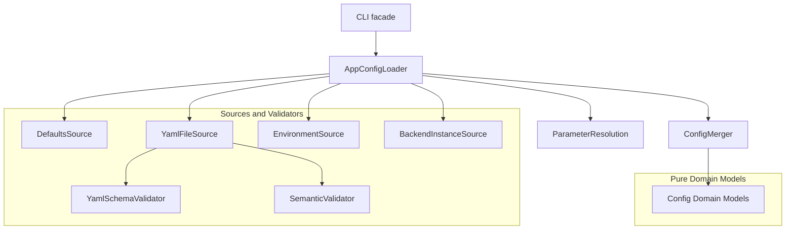
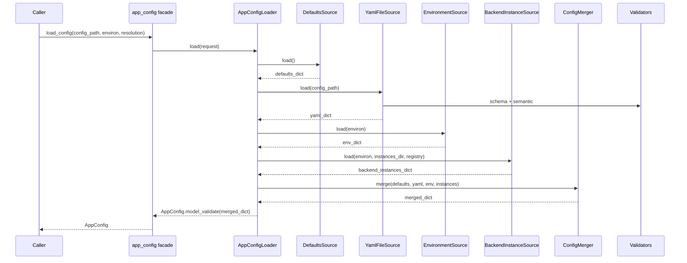

# Design Document: AppConfig God Object Refactoring

## Overview

This design refactors `src/core/config/app_config.py` from a ~2895 LOC mixed-responsibility module into a modular configuration subsystem aligned with the project’s staged initialization and DI patterns. The refactor separates configuration *domain models* from *source I/O and parsing*, introduces explicit boundaries and interfaces for test seams, and preserves externally observable behavior (config precedence and public entry points) unless explicitly noted in requirements.

The primary risk is compatibility: `AppConfig` and several nested config types are imported widely across `src/` and `tests/`. The design therefore uses a **Facade** approach where `src/core/config/app_config.py` becomes a thin compatibility layer that re-exports stable types and delegates loading behavior to new components.

### Goals
- Eliminate “God module” characteristics by separating concerns into cohesive components with explicit interfaces.
- Ensure configuration assembly is deterministic and testable without reading process globals (`os.environ`) or filesystem state unless explicitly provided.
- Preserve precedence and ParameterResolution semantics (CLI > ENV > YAML > defaults), and preserve dynamic backend instance representation in serialization.
- Ensure maintainability guardrails: each touched production file ≤ 600 LOC and CC ≤ 40.

### Non-Goals
- Adding new configuration options or changing user-facing defaults.
- Redesigning backend routing or connector behavior outside what is necessary to make configuration assembly testable and modular.
- Replacing the DI container; the subsystem integrates with the existing `ServiceCollection`.

## Architecture

### Existing Architecture Analysis
Current `src/core/config/app_config.py` mixes:
- Domain config models (`AppConfig`, `BackendSettings`, `LoggingConfig`, etc.)
- YAML file loading + schema and semantic validation
- Environment parsing and precedence application
- Backend instance discovery via environment variables and per-instance YAML files
- Dynamic backend storage/access via `__dict__` mutation and custom serialization

This creates tight coupling to `os.environ`, filesystem paths, and the backend registry at *model construction time*, which harms testability and increases the blast radius of changes.

### Architecture Pattern & Boundary Map

The refactor adopts a **Configuration Pipeline** pattern:
- **Sources** (Strategy): independently produce partial config dictionaries from defaults/YAML/env/instance-discovery.
- **Merger**: applies deterministic merges according to precedence rules.
- **Validators**: schema/semantic validation are explicit steps.
- **Assembler/Factory**: orchestrates sources + merger + validation and returns `AppConfig`.
- **Facade**: preserves imports and public functions in `src/core/config/app_config.py`.



**Dependency Direction**:
- Domain models are pure (no `os.environ`, no filesystem, no backend registry access).
- Adapters (sources/validators) depend on domain models and shared utilities.
- Loader/assembler depends on adapters and returns domain models.

### Technology Stack Alignment

| Layer | Choice / Version | Role in Feature | Notes |
|-------|------------------|-----------------|-------|
| Runtime | Python 3.10+ | Core | Maintain type hints, no blocking I/O in async paths |
| Models | Pydantic v2 (`DomainModel`) | Config models | Keep models immutable (`frozen=True`) where feasible |
| DI | `ServiceCollection` | Instance management | `AppConfig` registered as singleton instance |
| Errors | `ConfigurationError` | Failure reporting | Structured errors with `details` |

## System Flows

### Load Config (Defaults + YAML + ENV + Backend Instances)



Notes:
- Backend instance discovery is treated as a source with explicit semantics (documented below) and is testable via injected `environ` and `instances_dir`.
- CLI overrides remain handled by the CLI subsystem (already extracted into `src/core/cli_support/`) and are applied after `load_config`.

## Requirements Traceability

| Requirement | Summary | Components | Interfaces | Flows |
|-------------|---------|------------|------------|-------|
| 1.x | Preserve public contract | Facade, Loader | `IAppConfigLoader` | Load Config |
| 2.x | Enforce layering | Domain Models, Sources | `IConfigSource`, `IConfigMerger` | Load Config |
| 3.x | Precedence + tracking | Merger, Sources | `IConfigMerger`, `IConfigSource` | Load Config |
| 4.x | Validation behavior | YamlFileSource, Validators | `IConfigValidator` | Load Config |
| 5.x | Backend instances | BackendInstanceSource | `IBackendInstanceSource` | Load Config |
| 6.x | Backend lookup API | BackendSettings | `IBackendConfigLookup` (adapter) | (N/A) |
| 7.x | DI alignment | Stage registrations | (existing DI) | (N/A) |
| 8.x | Errors and logging | Loader, Validators | `ConfigurationError` | Load Config |
| 9.x | Testability | All components | all interfaces | Load Config |
| 10.x | Maintainability limits | File layout | (N/A) | (N/A) |

## Components and Interfaces

### Component Summary

| Component | Domain | Intent | Requirements | DI Lifetime | Key Interfaces |
|----------|--------|--------|--------------|-------------|----------------|
| `app_config` Facade | `src/core/config/` | Preserve public imports and functions | 1.1–1.5 | (N/A) | (N/A) |
| AppConfigLoader | `src/core/config/loading/` | Orchestrate sources/merge/validate | 1.1, 2.3, 3.1, 8.1, 9.1 | Singleton | `IAppConfigLoader` |
| DefaultsSource | `src/core/config/sources/` | Produce defaults dict | 3.5, 9.3 | Singleton | `IConfigSource` |
| YamlFileSource | `src/core/config/sources/` | Load YAML + run validators | 4.1–4.4, 8.2 | Singleton | `IConfigSource` |
| EnvironmentSource | `src/core/config/sources/` | Map env vars to config dict | 1.2, 3.4, 9.4 | Singleton | `IConfigSource` |
| BackendInstanceSource | `src/core/config/sources/` | Discover backend instances (env + instance YAML) | 5.2–5.5 | Singleton | `IBackendInstanceSource` |
| ConfigMerger | `src/core/config/merge/` | Deterministic merge by precedence | 3.1, 2.3, 9.3 | Singleton | `IConfigMerger` |
| Validators | `src/core/config/validation/` | Schema and semantic validation | 4.1–4.4 | Singleton | `IConfigValidator` |
| ProjectPaths | `src/core/config/paths/` | Resolve schema/instances paths | 2.2, 9.5 | Singleton | `IProjectPaths` |

### Interfaces (Contracts)

#### IAppConfigLoader
```python
from abc import ABC, abstractmethod
from dataclasses import dataclass
from pathlib import Path
from collections.abc import Mapping

from src.core.config.parameter_resolution import ParameterResolution
from src.core.config.models.app_config import AppConfig

@dataclass(frozen=True)
class ConfigLoadRequest:
    config_path: Path | None
    environ: Mapping[str, str]
    resolution: ParameterResolution | None

class IAppConfigLoader(ABC):
    @abstractmethod
    def load(self, request: ConfigLoadRequest) -> AppConfig:
        ...
```

#### IConfigSource
```python
from abc import ABC, abstractmethod
from dataclasses import dataclass
from pathlib import Path
from collections.abc import Mapping
from typing import Any

from src.core.config.parameter_resolution import ParameterResolution

@dataclass(frozen=True)
class SourceContext:
    config_path: Path | None
    environ: Mapping[str, str]
    resolution: ParameterResolution | None

class IConfigSource(ABC):
    @abstractmethod
    def load(self, ctx: SourceContext) -> dict[str, Any]:
        ...
```

#### IConfigMerger
```python
from abc import ABC, abstractmethod
from typing import Any

class IConfigMerger(ABC):
    @abstractmethod
    def merge(self, layers: list[dict[str, Any]]) -> dict[str, Any]:
        ...
```

#### IConfigValidator
```python
from abc import ABC, abstractmethod
from pathlib import Path
from typing import Any

class IConfigValidator(ABC):
    @abstractmethod
    def validate_yaml(self, *, yaml_path: Path, data: Any) -> None:
        ...
```

#### IBackendInstanceSource (backend-specific source)
```python
from abc import ABC, abstractmethod
from dataclasses import dataclass
from pathlib import Path
from collections.abc import Mapping
from typing import Any

from src.core.config.parameter_resolution import ParameterResolution

@dataclass(frozen=True)
class BackendInstanceContext:
    environ: Mapping[str, str]
    instances_dir: Path
    resolution: ParameterResolution | None

class IBackendInstanceSource(ABC):
    @abstractmethod
    def load_instances(self, ctx: BackendInstanceContext) -> dict[str, Any]:
        ...
```

### Backend Instance Precedence Semantics

To preserve current behavior, backend instance fields are merged using domain-specific precedence:
1. Main config YAML (if it defines an instance key)
2. Environment-discovered instances (only created if not defined by main config)
3. Per-instance YAML files (`config/backends/backend-instances/*.yaml`) override existing instance fields (including main config and env-discovered fields), but do not remove fields that are not specified.

This is an internal precedence rule within the backend instance domain and does not change the global precedence rules for non-backend-instance settings.

## Data Models

### Domain Models (`src/core/config/models/`)

The config models currently defined in `src/core/config/app_config.py` are relocated into focused modules (≤ 600 LOC each), for example:
- `models/app_config.py`: `AppConfig` only (imports nested config types)
- `models/backends.py`: `BackendConfig`, `BackendSettings`
- `models/auth.py`: `AuthConfig`, `BruteForceProtectionConfig`
- `models/logging.py`: `LoggingConfig`, `LogLevel`
- `models/session.py`: `SessionConfig` and closely related session sub-configs
- `models/routing.py`: `RoutingConfig`
- `models/tool_call_reactor.py`: `ToolCallReactorConfig`
- `models/misc.py`: small remaining configs (`CodebuffConfig`, `UsageTrackingConfig`, etc.) split further if needed

`src/core/config/app_config.py` remains a facade that re-exports these types to preserve imports.

### Backend Lookup API (Stabilization)

`BackendSettings` exposes a typed lookup surface (preferred) and provides a backward-compatible adapter for legacy attribute-style access:
- Preferred: `BackendSettings.get_backend(name) -> BackendConfig | None`
- Compatibility: `BackendConfigProvider` may construct a **non-persistent default** `BackendConfig()` when a backend name is missing, avoiding hidden state mutation while preserving callers that expect a `BackendConfig` result.

Any remaining dynamic behavior (e.g., attribute access) must be documented and isolated so it can be deprecated safely later.

## Error Handling

All configuration loading and validation failures raise `ConfigurationError` with structured `details`:
- `details.path`: file path when applicable
- `details.errors`: schema errors list when applicable
- `details.hint`: actionable remediation when possible

No secrets (API keys, tokens) are logged or included in error details.

## Testing Strategy

### Unit Tests (`tests/unit/`)
- Sources: YAML loader, env source mapping, backend instance discovery (all with injected `environ`/tmp dirs)
- Merger: deterministic merge ordering + edge cases (nested merges, overrides)
- Validators: schema/semantic error propagation and error detail shapes
- Loader: orchestrates sources and returns deterministic `AppConfig`

### Integration Tests (`tests/integration/`)
- Verify CLI > ENV > YAML precedence end-to-end using `parse_cli_args` + `apply_cli_args`
- Verify backend instance discovery integration with registry stubs and instance YAML files

## Security and Observability

- `ParameterResolution.log()` continues to redact secret fields.
- Config logging avoids emitting raw credential material and maintains stable, testable logs.

## Migration and Compatibility Notes

- `src/core/config/app_config.py` remains the canonical import path for `AppConfig` and nested config types; internally it delegates to the new modules.
- Existing deprecated `src/core/config/config_loader.py` behavior remains deprecated; no new entry points are introduced.
- The refactor is executed in small steps that keep tests green (facade first, then incremental extraction), with explicit fallbacks where necessary.

