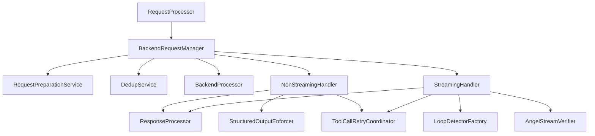
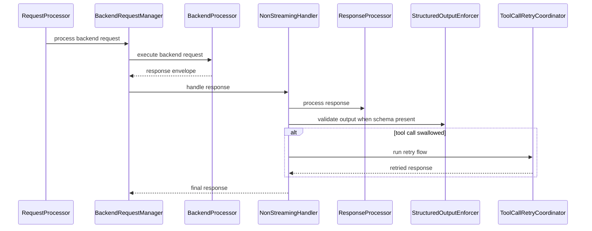
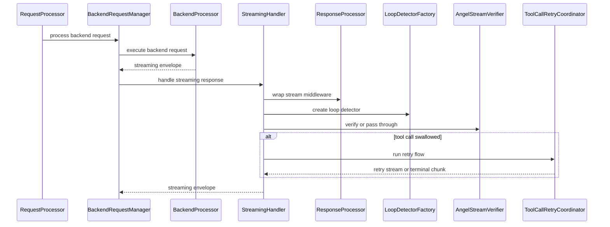

## Overview
This design refactors `BackendRequestManager` into a thin orchestrator with focused components for request preparation, non-streaming processing, streaming processing, and tool-call retry coordination. The goal is to reduce file size and complexity while preserving existing public contracts, retry semantics, and streaming safety behaviors.

The change targets maintainers and operators by improving modularity and testability without altering runtime behavior. This keeps existing integrations stable while making the request manager more approachable to reason about and extend.

### Goals
- Reduce the size and cognitive load of the backend request manager by splitting responsibilities into dedicated components.
- Preserve existing contracts, retry limits, metadata keys, and streaming behavior.
- Make dependencies explicit and DI-friendly, avoiding runtime service lookups.
- Improve unit testability by enabling isolated component testing.

### Non-Goals
- Changing request/response behavior or retry semantics.
- Introducing new configuration options or external dependencies.
- Modifying upstream request processor phases or downstream response adapters.
- Altering tool-call reactor policy or streaming accumulation rules.

## Architecture

### Existing Architecture Analysis (if applicable)
- Request processing already follows an orchestrator + phase component pattern (`RequestProcessor` and `request_processor_internal` interfaces).
- `BackendRequestManager` is registered via `core_processing` DI helpers and used by both backend preparer and executor phases.
- Streaming behavior depends on metadata keys consumed by `content_accumulation_processor` and `steering_leak_protection`.
- Structured output middleware is currently accessed via runtime DI lookup inside the manager.

### Architecture Pattern & Boundary Map
**Architecture Integration**:
- Selected pattern: Orchestrator with dedicated component services, aligned to request processor decomposition.
- Domain/feature boundaries: Request preparation, non-streaming response processing, streaming response processing, and tool-call retry are isolated components.
- Existing patterns preserved: DI via `ServiceCollection`, staged initialization, Pydantic domain models, async I O.
- New components rationale: isolate high-complexity streaming and retry logic and make dependencies explicit.
- Steering compliance: SRP, explicit interfaces, and fail-open optional collaborators.



### Technology Stack

| Layer | Choice / Version | Role in Feature | Notes |
|-------|------------------|-----------------|-------|
| Runtime | Python 3.10+ / FastAPI async | Core framework | Preserve async I O paths |
| DI Container | `src/core/di/container.py` | Service registration | Use singleton services for handlers |
| Models | Pydantic v2 | Typed context models | Avoid ad hoc dicts across boundaries |
| Response Processing | `ResponseProcessor` | Middleware for responses | Existing dependency, no new deps |

## System Flows

### Non-Streaming Response Path


### Streaming Response Path


## Requirements Traceability

| Requirement | Summary | Components | Interfaces | Flows |
|-------------|---------|------------|------------|-------|
| 1.1 | Implement `IBackendRequestManager` | BackendRequestManager | IBackendRequestManager | Non-Streaming, Streaming |
| 1.2 | Dedup raises `DuplicateRequestError` | BackendRequestManager | IBackendRequestManager | Non-Streaming, Streaming |
| 1.3 | Streaming returns `StreamingResponseEnvelope` | BackendRequestManager, StreamingHandler | IStreamingBackendResponseHandler | Streaming |
| 1.4 | Empty stream raises `BackendError` | StreamingHandler | IStreamingBackendResponseHandler | Streaming |
| 1.5 | Preserve request and response types | BackendRequestManager | IBackendRequestManager | Non-Streaming, Streaming |
| 2.1 | Replace messages on command modification | RequestPreparationService | IBackendRequestPreparation | Request Preparation |
| 2.2 | Skip backend when modified messages empty | RequestPreparationService | IBackendRequestPreparation | Request Preparation |
| 2.3 | Append tool output messages | RequestPreparationService | IBackendRequestPreparation | Request Preparation |
| 2.4 | Compact history when enabled | RequestPreparationService | IBackendRequestPreparation | Request Preparation |
| 2.5 | Fail open on compaction errors | RequestPreparationService | IBackendRequestPreparation | Request Preparation |
| 2.6 | Copy request when messages modified | RequestPreparationService | IBackendRequestPreparation | Request Preparation |
| 3.1 | Process non-streaming response | NonStreamingHandler | INonStreamingBackendResponseHandler | Non-Streaming |
| 3.2 | Retry on empty response | NonStreamingHandler | INonStreamingBackendResponseHandler | Non-Streaming |
| 3.3 | Apply structured output validation | StructuredOutputEnforcer | IStructuredOutputEnforcer | Non-Streaming |
| 3.4 | Filter metadata for JSON serializable | NonStreamingHandler | INonStreamingBackendResponseHandler | Non-Streaming |
| 3.5 | Start tool call retry when swallowed | ToolCallRetryCoordinator | IToolCallRetryCoordinator | Non-Streaming, Streaming |
| 3.6 | Terminal response on retry limit | ToolCallRetryCoordinator | IToolCallRetryCoordinator | Non-Streaming, Streaming |
| 3.7 | Emit retry count metadata | ToolCallRetryCoordinator | IToolCallRetryCoordinator | Non-Streaming, Streaming |
| 4.1 | Wrap streaming middleware | StreamingHandler | IStreamingBackendResponseHandler | Streaming |
| 4.2 | Retry on empty streaming output | StreamingHandler | IStreamingBackendResponseHandler | Streaming |
| 4.3 | Tool call retry on streaming swallow | ToolCallRetryCoordinator | IToolCallRetryCoordinator | Streaming |
| 4.4 | Loop detection and cancellation | LoopDetectorFactory, StreamingHandler | ILoopDetectorFactory | Streaming |
| 4.5 | Angel verification and replacement | AngelStreamVerifier | IAngelStreamVerifier | Streaming |
| 4.6 | Attach session metadata to chunks | StreamingHandler | IStreamingBackendResponseHandler | Streaming |
| 5.1 | Separate processing components | BackendRequestManager, component services | IBackendRequestPreparation, handlers | Non-Streaming, Streaming |
| 5.2 | Allow mocked dependencies | Component services | Component interfaces | All |
| 5.3 | Orchestrator delegates work | BackendRequestManager | IBackendRequestManager | All |
| 5.4 | Optional collaborators fail open | BackendRequestManager, RequestPreparationService | IBackendRequestManager | All |
| 5.5 | Delegate structured output, loop detection, Angel | StructuredOutputEnforcer, LoopDetectorFactory, AngelStreamVerifier | Component interfaces | Non-Streaming, Streaming |
| 6.1 | Preserve metadata keys | NonStreamingHandler, StreamingHandler, ToolCallRetryCoordinator | Component interfaces | Non-Streaming, Streaming |
| 6.2 | Terminal response metadata set | ToolCallRetryCoordinator | IToolCallRetryCoordinator | Non-Streaming, Streaming |
| 6.3 | Emit steering replacement marker | ToolCallRetryCoordinator, StreamingHandler | IToolCallRetryCoordinator | Streaming |

## Components and Interfaces

**DI Registration Strategy**:
- All new services are registered as `Singleton` via `core_processing` to match existing orchestration services.
- `BackendRequestManager` remains the DI entry point (`IBackendRequestManager`).

| Component | Layer | Intent | Req Coverage | DI Lifetime | Contracts |
|-----------|-------|--------|--------------|-------------|-----------|
| BackendRequestManager | `src/core/services/` | Orchestrate request prep and response handling | 1.1-1.5, 5.3 | Singleton | IBackendRequestManager |
| BackendRequestPreparationService | `src/core/services/` | Normalize messages and apply compaction | 2.1-2.6, 5.1 | Singleton | IBackendRequestPreparation |
| BackendNonStreamingResponseHandler | `src/core/services/` | Process non-streaming responses and retries | 3.1-3.4 | Singleton | INonStreamingBackendResponseHandler |
| BackendStreamingResponseHandler | `src/core/services/` | Process streaming pipeline and recovery | 4.1-4.6 | Singleton | IStreamingBackendResponseHandler |
| ToolCallRetryCoordinator | `src/core/services/` | Manage tool-call retry state and limits | 3.5-3.7, 4.3, 6.1-6.3 | Singleton | IToolCallRetryCoordinator |
| StructuredOutputEnforcer | `src/core/services/` | Apply structured output validation | 3.3, 5.5 | Singleton | IStructuredOutputEnforcer |
| LoopDetectorFactory | `src/core/services/` | Provide loop detector instances | 4.4, 5.5 | Singleton | ILoopDetectorFactory |
| AngelStreamVerifier | `src/core/services/` | Buffer and verify streaming output | 4.5, 5.5 | Singleton | IAngelStreamVerifier |

### Services Layer (`src/core/services/`)

#### BackendRequestPreparationService

| Field | Detail |
|-------|--------|
| Intent | Prepare backend requests from command results and compaction |
| Requirements | 2.1, 2.2, 2.3, 2.4, 2.5, 2.6 |
| Interface | `IBackendRequestPreparation` in `src/core/interfaces/` |
| DI Lifetime | Singleton |

**Responsibilities & Constraints**
- Normalize modified command messages into `ChatMessage` instances.
- Append tool output messages when present.
- Invoke history compaction when enabled and above thresholds.
- Preserve fail-open behavior for compaction errors.

**Dependencies (via DI)**
- Inbound: `BackendRequestManager`
- Outbound: `HistoryCompactionService`, `IConfig`
- External: none

**Contracts**: Service [x] / Event [ ] / Middleware [ ]

##### Service Interface
```python
from abc import ABC, abstractmethod

class IBackendRequestPreparation(ABC):
    @abstractmethod
    async def prepare(
        self,
        request: ChatRequest,
        command_result: ProcessedResult,
    ) -> ChatRequest | None:
        """Return a new request with normalized messages or None to skip backend."""
        ...
```
- Preconditions: `request.messages` and `command_result` are non-null.
- Postconditions: Returned request uses new message list when modified.
- Invariants: Original request instance is not mutated.

##### DI Registration (in `core_processing`)
```python
def _backend_request_preparation_factory(provider: IServiceProvider) -> BackendRequestPreparationService:
    compaction = provider.get_service(HistoryCompactionService)
    config = provider.get_service(AppConfig)
    return BackendRequestPreparationService(compaction, config)

services.add_singleton(IBackendRequestPreparation, implementation_factory=_backend_request_preparation_factory)
```
**Config fallback**: `BackendRequestPreparationService` must handle `config` being `None` by
using safe defaults for compaction flags/thresholds to satisfy optional-collaborator
requirements.

#### BackendNonStreamingResponseHandler

| Field | Detail |
|-------|--------|
| Intent | Process non-streaming responses, including structured output and retries |
| Requirements | 3.1, 3.2, 3.3, 3.4 |
| Interface | `INonStreamingBackendResponseHandler` in `src/core/interfaces/` |
| DI Lifetime | Singleton |

**Responsibilities & Constraints**
- Invoke `ResponseProcessor` for empty-response detection and middleware processing.
- Apply structured output validation via `IStructuredOutputEnforcer` when schema context exists.
- Filter metadata to JSON-serializable values and remove `original_request` objects.
- Delegate tool-call retry behavior to `IToolCallRetryCoordinator`.
- Ensure structured output validation executes exactly once (either via feature pipeline
  or legacy middleware), and does not double-apply.

**Dependencies (via DI)**
- Inbound: `BackendRequestManager`
- Outbound: `IResponseProcessor`, `IStructuredOutputEnforcer`, `IToolCallRetryCoordinator`
- External: none

**Contracts**: Service [x] / Event [ ] / Middleware [ ]

##### Service Interface
```python
from abc import ABC, abstractmethod

class INonStreamingBackendResponseHandler(ABC):
    @abstractmethod
    async def handle(
        self,
        response: ResponseEnvelope,
        request: ChatRequest,
        context: RequestContext,
        processing_context: ResponseProcessingContext,
    ) -> ResponseEnvelope:
        """Return a processed non-streaming response envelope."""
        ...
```
- Preconditions: `response.content` is available for non-streaming requests.
- Postconditions: Response content and metadata are normalized and safe to serialize.
- Invariants: No additional backend calls beyond retry policy.

#### BackendStreamingResponseHandler

| Field | Detail |
|-------|--------|
| Intent | Handle streaming middleware, recovery, and safety checks |
| Requirements | 4.1, 4.2, 4.3, 4.4, 4.5, 4.6 |
| Interface | `IStreamingBackendResponseHandler` in `src/core/interfaces/` |
| DI Lifetime | Singleton |

**Responsibilities & Constraints**
- Wrap streams with `ResponseProcessor` middleware.
- Detect empty streams and apply recovery prompts up to retry limits.
- When the empty-stream retry limit is exceeded, raise `BackendError` containing the retry
  reason and `session_id`, preserving the existing contract.
- Run loop detection and emit cancellation chunk on detection.
- Delegate tool-call retry to `IToolCallRetryCoordinator`.
- Buffer and verify streaming output via `IAngelStreamVerifier` when enabled.
- Attach `session_id`, `original_request`, and `client_os` metadata to chunks.
- Fail open on streaming middleware, loop detection, and Angel verification errors by
  logging with `exc_info=True` and continuing with the original stream when possible.

**Dependencies (via DI)**
- Inbound: `BackendRequestManager`
- Outbound: `IResponseProcessor`, `ILoopDetectorFactory`, `IAngelStreamVerifier`, `IToolCallRetryCoordinator`
- External: none

**Contracts**: Service [x] / Event [ ] / Middleware [ ]

##### Service Interface
```python
from abc import ABC, abstractmethod

class IStreamingBackendResponseHandler(ABC):
    @abstractmethod
    async def handle(
        self,
        stream: StreamingResponseEnvelope,
        request: ChatRequest,
        context: RequestContext,
        processing_context: ResponseProcessingContext,
    ) -> StreamingResponseEnvelope:
        """Return a processed streaming response envelope."""
        ...
```
- Preconditions: Input is a streaming request and a streaming envelope.
- Postconditions: Stream yields processed chunks with required metadata.
- Invariants: Preserve `media_type`, `headers`, and `cancel_callback`.

#### ToolCallRetryCoordinator

| Field | Detail |
|-------|--------|
| Intent | Centralize tool-call retry flow with escalating steering |
| Requirements | 3.5, 3.6, 3.7, 4.3, 6.1, 6.2, 6.3 |
| Interface | `IToolCallRetryCoordinator` in `src/core/interfaces/` |
| DI Lifetime | Singleton |

**Responsibilities & Constraints**
- Track retry counts using request `extra_body` keys and response metadata counters.
- Append steering messages and preserve message history.
- Emit terminal responses when retry limits are exceeded.
- Preserve metadata keys consumed by downstream components.

**Retry Metadata Contract (Preserve Existing Keys)**
The refactor must preserve both response metadata keys (public) and request `extra_body`
fields (internal control). These keys are consumed by downstream processors and tests.

**Request `extra_body` fields (control flags and counters)**
| Key | Purpose | Notes |
|-----|---------|-------|
| `_tool_call_reactor_retry` | Marks the request as a retry to prevent infinite loops | Must be set for retried requests |
| `_tool_call_reactor_retry_count` | Current retry attempt count | Primary counter |
| `_dangerous_command_retry_count` | Legacy counter alias | Must be kept in sync with primary |

**Response metadata fields (public contract)**
| Key | Purpose | Notes |
|-----|---------|-------|
| `tool_call_swallowed` | Indicates a blocked tool call requiring retry | Consumed by downstream processors |
| `dangerous_command_retry_count` | Retry count exposed to clients | Mirrors request counter |
| `tool_call_reactor_retry_count` | Retry count exposed to clients | Mirrors request counter |
| `dangerous_command_limit_exceeded` | Terminal response marker | Set when retry limit exceeded |
| `session_terminated` | Session termination flag | Set on terminal response |
| `is_done` | Termination marker | Preserve existing usage |
| `finish_reason` | Termination reason | Use `security_limit` when exceeded |
| `_steering_replacement` | Streaming steering replacement marker | Required by accumulation reset |
| `original_request` | Only for streaming chunks | Must be removed from non-streaming metadata |

**Dependencies (via DI)**
- Inbound: NonStreamingHandler, StreamingHandler
- Outbound: `IBackendProcessor`, `IResponseProcessor`
- External: none

**Contracts**: Service [x] / Event [ ] / Middleware [ ]

##### Service Interface
```python
from abc import ABC, abstractmethod

class IToolCallRetryCoordinator(ABC):
    @abstractmethod
    async def handle_non_streaming(
        self,
        request: ChatRequest,
        response: ResponseEnvelope,
        context: RequestContext,
        retry_state: ToolCallRetryState,
    ) -> ResponseEnvelope | None:
        """Return a retried response or None when no retry is needed."""
        ...

    @abstractmethod
    async def handle_streaming(
        self,
        request: ChatRequest,
        response: ResponseEnvelope,
        context: RequestContext,
        retry_state: ToolCallRetryState,
    ) -> StreamingResponseEnvelope | None:
        """Return a retried stream or terminal stream when needed."""
        ...
```
- Preconditions: `retry_state` reflects current retry count and limit.
- Postconditions: Retry count metadata is updated on retried responses.
- Invariants: No retries beyond configured limits.

##### Retry Flow Ownership
To avoid double-processing or skipped middleware, the coordinator returns **raw backend**
results and does **not** apply response processor middleware or metadata filtering itself.
Processing ownership is:
- Non-streaming: `BackendNonStreamingResponseHandler` always runs response processing,
  structured output validation, and metadata filtering on any retried response.
- Streaming: `BackendStreamingResponseHandler` always wraps streams with middleware and
  applies streaming safety logic on any retried stream.

The coordinator is limited to: counting retries, shaping retry requests, invoking the
backend processor, and attaching/propagating retry metadata.

#### StructuredOutputEnforcer

| Field | Detail |
|-------|--------|
| Intent | Apply structured output validation when schema is present |
| Requirements | 3.3, 5.5 |
| Interface | `IStructuredOutputEnforcer` in `src/core/interfaces/` |
| DI Lifetime | Singleton |

**Responsibilities & Constraints**
- Validate structured output using the response-processor feature pipeline (preferred) or the
  legacy middleware when explicitly required for backward compatibility.
- Preserve error propagation semantics for validation failures.
- Avoid DI cycles by using a factory or provider-based lookup inside the enforcer, while
  keeping the enforcer itself a stable injected dependency.

**Dependencies (via DI)**
- Inbound: NonStreamingHandler
- Outbound: `StructuredOutputFeature` (preferred) or `StructuredOutputMiddleware` (legacy)
- External: none

**Contracts**: Service [x] / Event [ ] / Middleware [ ]

##### Service Interface
```python
from abc import ABC, abstractmethod

class IStructuredOutputEnforcer(ABC):
    @abstractmethod
    async def enforce(
        self,
        response: ProcessedResponse,
        context: StructuredOutputContext,
    ) -> ProcessedResponse:
        """Validate structured output and return a processed response."""
        ...
```
- Preconditions: `context.schema` is present.
- Postconditions: Response content conforms to schema or raises validation error.

**DI Wiring Plan (Cycle-Safe)**
- Preferred path: register `StructuredOutputFeature` into the `ResponseProcessor` pipeline
  at DI time, then have `StructuredOutputEnforcer` resolve the feature (or an adapter)
  via `IServiceProvider`. This ensures exactly-once validation and keeps streaming/non-streaming
  parity.
- Legacy path (only if required for compatibility): resolve `StructuredOutputMiddleware`
  lazily via `IServiceProvider` and apply it directly. This path must be opt-in and
  documented to prevent double-processing.
- `StructuredOutputEnforcer` remains a singleton with a provider-based lookup to avoid
  stage-order cycles or eager instantiation issues.

Example registration (in `core_processing`):
```python
def _structured_output_enforcer_factory(provider: IServiceProvider) -> StructuredOutputEnforcer:
    return StructuredOutputEnforcer(provider)

services.add_singleton(IStructuredOutputEnforcer, implementation_factory=_structured_output_enforcer_factory)
```

Example usage inside enforcer:
```python
class StructuredOutputEnforcer(IStructuredOutputEnforcer):
    def __init__(self, provider: IServiceProvider) -> None:
        self._provider = provider

    async def enforce(self, response: ProcessedResponse, context: StructuredOutputContext) -> ProcessedResponse:
        feature = self._provider.get_required_service(StructuredOutputFeature)
        return await feature.process(response=response, session_id=context.request_id, context=context, is_streaming=False)
```

#### LoopDetectorFactory

| Field | Detail |
|-------|--------|
| Intent | Provide per-stream loop detector instances |
| Requirements | 4.4, 5.5 |
| Interface | `ILoopDetectorFactory` in `src/core/interfaces/` |
| DI Lifetime | Singleton |

**Responsibilities & Constraints**
- Create and reset loop detectors per stream.
- Encapsulate DI lookup and fallback behavior.

**Dependencies (via DI)**
- Inbound: StreamingHandler
- Outbound: `ILoopDetector`
- External: none

**Contracts**: Service [x] / Event [ ] / Middleware [ ]

##### Service Interface
```python
from abc import ABC, abstractmethod

class ILoopDetectorFactory(ABC):
    @abstractmethod
    def create(self) -> ILoopDetector:
        """Return a ready loop detector instance."""
        ...
```

#### AngelStreamVerifier

| Field | Detail |
|-------|--------|
| Intent | Buffer and verify streaming output when Angel is enabled |
| Requirements | 4.5, 5.5 |
| Interface | `IAngelStreamVerifier` in `src/core/interfaces/` |
| DI Lifetime | Singleton |

**Responsibilities & Constraints**
- Buffer streaming chunks when Angel verification is enabled.
- Call Angel backend for verification and return corrected output when required.
- Fail open on verification errors by logging with `exc_info=True` and returning the
  original chunks without replacement.

**Dependencies (via DI)**
- Inbound: StreamingHandler
- Outbound: `IAngelServiceFactory`, `IBackendService`
- External: none

**Contracts**: Service [x] / Event [ ] / Middleware [ ]

##### Service Interface
```python
from abc import ABC, abstractmethod
from collections.abc import AsyncIterator

class IAngelStreamVerifier(ABC):
    @abstractmethod
    async def verify_or_passthrough(
        self,
        request: ChatRequest,
        stream: AsyncIterator[ProcessedResponse],
        context: StreamingContext,
    ) -> AsyncIterator[ProcessedResponse]:
        """Return verified stream or original stream when no steering is needed."""
        ...
```
- Preconditions: Stream yields `ProcessedResponse` instances.
- Postconditions: Output stream preserves metadata contracts.

## Data Models

### Domain Model (`src/core/domain/`)
- Introduce typed context models for processing to avoid ad hoc dicts across boundaries.

**Proposed Models**
```python
from pydantic import BaseModel
from pydantic.types import JsonValue

class StructuredOutputContext(BaseModel):
    schema: object
    schema_name: str
    request_id: str

class ResponseProcessingContext(BaseModel):
    session_id: str
    backend_name: str | None
    model_name: str | None
    client_os: str | None
    original_request: ChatRequest | None
    structured_output: StructuredOutputContext | None

class ToolCallRetryState(BaseModel):
    retry_count: int
    max_retries: int
    steering_message: str | None
    is_streaming: bool
```
- These models remain internal to the request manager subsystem and are translated into the existing middleware context dicts as needed.

### Context Translation Plan
To preserve current middleware behavior, a dedicated translation helper should map
typed context models into the dicts expected by `IResponseProcessor` and
`StructuredOutputMiddleware`. This ensures required keys are present and legacy
paths remain stable.

**Source of truth**: `ResponseProcessingContext` and `RequestContext.processing_context`.

**Middleware context keys (non-streaming)**
| Key | Source | Notes |
|-----|--------|-------|
| `original_request` | `ResponseProcessingContext.original_request` | Required for empty-response retry logic |
| `backend_response` | `ResponseEnvelope` | Attached at handler call site |
| `backend_name` | `ResponseProcessingContext.backend_name` or `ChatRequest.extra_body.backend_type` | Preserve existing fallback |
| `model_name` | `ResponseProcessingContext.model_name` or `ChatRequest.model` | Preserve existing fallback |
| `session_id` | `ResponseProcessingContext.session_id` | Required for logging and retries |
| `response_schema` | `RequestContext.processing_context.response_schema` | Structured output validation |
| `schema_name` | `RequestContext.processing_context.schema_name` | Structured output validation |
| `request_id` | `RequestContext.processing_context.request_id` | Structured output validation |

**Middleware context keys (streaming)**
Same as non-streaming, plus:
| Key | Source | Notes |
|-----|--------|-------|
| `client_os` | `ResponseProcessingContext.client_os` or processing context | Optional client metadata |
| `stream_id` | `RequestContext.processing_context.request_id` or `session_id` | Stable stream correlation key |

**Processing context passthrough**
- Merge all keys from `RequestContext.processing_context` into the middleware context
  (after typed fields above), preserving legacy keys used by streaming middleware.
  Typed fields take precedence to keep behavior consistent.

**Placement**
- `BackendRequestManager` builds `ResponseProcessingContext` once per request.
- `BackendNonStreamingResponseHandler` and `BackendStreamingResponseHandler` call a shared
  helper (e.g., `build_middleware_context`) to convert to the dict shape expected by
  existing processors. This keeps behavior centralized and testable.

### DTOs and Envelopes (`src/core/domain/responses.py`)
- `ResponseEnvelope` and `StreamingResponseEnvelope` are unchanged.
- Metadata remains a `dict[str, JsonValue]` within envelopes to preserve existing contracts.

## Error Handling

### Error Hierarchy
All errors extend `LLMProxyError` from `src/core/common/exceptions.py`.

### Error Strategy
- Preserve current `BackendError` and `DuplicateRequestError` behavior.
- Avoid new exception types for the refactor; use existing errors for compatibility.
- Continue to log with `exc_info=True` for unexpected failures in streaming or compaction paths.

## Testing Strategy

### Unit Tests (`tests/unit/`)
- Add focused tests for each new component interface (preparation, non-streaming handler, streaming handler, retry coordinator).
- Mock dependencies to validate error handling and metadata preservation.

### Integration Tests (`tests/integration/`)
- Update existing tests that instantiate `BackendRequestManager` to ensure constructor compatibility.
- Maintain current tests for compaction, tool-call swallow retry, streaming recovery, and Angel verification.

### Test Commands
```bash
# Focused unit tests
./.venv/Scripts/python.exe -m pytest tests/unit/core/services/test_backend_request_manager_* -v

# Integration coverage
./.venv/Scripts/python.exe -m pytest tests/integration/test_retry_on_swallow_integration.py -v
```

## Security Considerations
- Preserve the tool-call retry limit and terminal response metadata to prevent unsafe loops.
- Maintain metadata filtering to avoid serializing unsafe objects.

## Performance & Scalability
- No additional backend calls beyond existing retry limits.
- Streaming buffering remains conditional on Angel verification.

## Stage Registration
- Register new services in `core_processing` under `CoreServicesStage` to align with existing request processor wiring.
