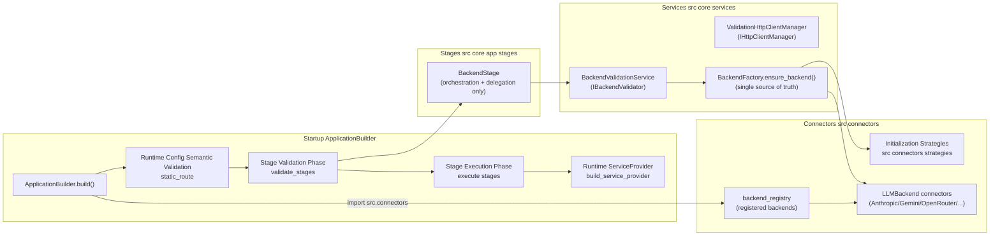
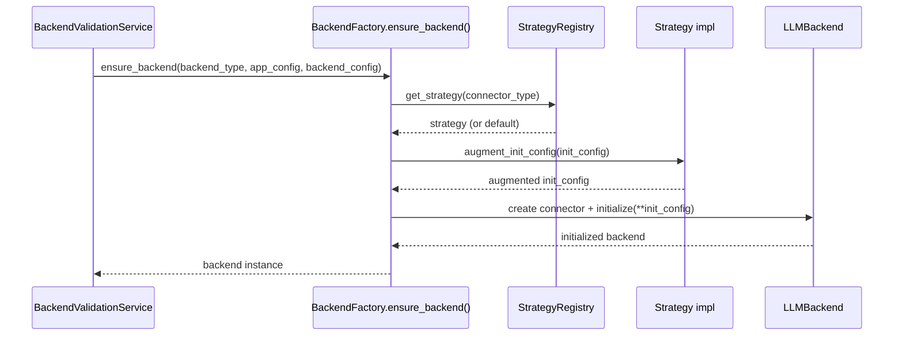

# Technical Design: Backend Stage SOLID Refactoring

---
**Project Context**: Universal LLM Proxy - FastAPI async service with staged initialization, DI containers, adapter pattern for LLM backends.
---

## Overview

This refactor decomposes the current `BackendStage` god class into SOLID-compliant components and removes all legacy/fallback/manual validation paths that duplicate backend initialization logic and increase leak risk. The new design introduces explicit service boundaries for backend validation, backend initialization augmentation (strategy pattern), and validation-time HTTP client lifecycle management, while keeping startup behavior deterministic and regression-testable.

The primary users are maintainers and connector authors. Maintainers gain a smaller, delegation-only `BackendStage` and a single source of truth for initialization (`BackendFactory.ensure_backend()` + strategies). Connector authors gain an OCP-compliant extension point: adding a backend-specific initialization strategy without editing `BackendFactory` or `BackendStage`.

### Goals
- Enforce SRP/OCP by shrinking `BackendStage` to orchestration + delegation only (`5.1, 5.2, 5.3, 5.4, 5.5, 5.6, 5.7, 5.8, 5.9`).
- Eliminate backend initialization duplication by moving backend-specific shaping into strategies and removing all stage fallback/manual paths (`6.1, 6.2, 6.3, 6.4, 6.5, 6.6, 6.7, 6.8, 9.1, 9.2, 9.3, 9.4, 9.5`).
- Make validation leak-safe and deterministic given that stage validation runs before stage execution (`2.1, 2.2, 2.3, 2.4, 2.5, 2.6, 2.7, 2.8, 2.9, 2.10, 3.1, 3.2, 3.3, 3.4, 3.5, 3.6, 3.7, 3.8, 3.9, 3.10, 11.1`).
- Move `static_route` validation to config-level validation with connector auto-discovery guarantees (`4.1, 4.2, 4.3, 4.4, 4.5, 4.6, 4.7`).

### Non-Goals
- Redesigning runtime request routing/failover or backend completion flow orchestration.
- Changing connector protocol contracts (beyond initialization kwargs mapping already in use).
- Adding new backend providers or changing existing config schema semantics beyond required validations.

## Architecture

### Existing Architecture Analysis
- Startup uses staged initialization (`src/core/app/application_builder.py` and `src/core/app/stages/*`).
- Stage validation (`InitializationStage.validate`) runs before stage execution (`ApplicationBuilder.validate_stages()`), so validation must not depend on stage `execute()` side effects.
- DI registrations already follow a registrar pattern (`src/core/di/registrations/*`), but `BackendStage` still performs validation-time work and includes fallback/manual validation that duplicates `BackendFactory.ensure_backend()`.
- Connector discovery is import-driven: `import src.connectors` triggers module auto-import and registration in `backend_registry`.

### Architecture Pattern & Boundary Map

**Selected pattern**: Strangler refactor with explicit service boundaries (SOLID + staged initialization alignment).

**Architecture Integration**
- Selected pattern: “Strangler fig” extraction (new services introduced and then `BackendStage` reduced to delegating facade).
- Domain/feature boundaries:
  - Stage layer: orchestration only (`BackendStage`)
  - Services layer: validation and lifecycle management (`BackendValidationService`, `ValidationHttpClientManager`)
  - Connector extension point: initialization shaping (`src/connectors/strategies/*`)
  - Config validation: fail-fast checks (`static_route` validation)
- Existing patterns preserved: staged init, DI registrars, connector import side effects, `LLMProxyError` hierarchy usage.
- Steering compliance: SRP, OCP, DRY; tests as executable specifications.



### Technology Stack

| Layer | Choice / Version | Role in Feature | Notes |
|-------|------------------|-----------------|-------|
| Runtime | Python 3.10+ / FastAPI (async) | Startup & lifecycle | All I/O is `async/await` |
| DI Container | `src/core/di/container.py` | Service registration & disposal | Use explicit lifetimes; dispose on failures |
| Initialization | Staged (`src/core/app/stages/`) | Startup ordering | Validation runs before execution |
| HTTP Client | httpx.AsyncClient | Backend and validation calls | Must be leak-safe; managed via manager + disposal |
| Config | `src/core/config/*` | Fail-fast validation | `static_route` validated before stages run |

## System Flows

### Startup Build: Validation and Execution

```mermaid
sequenceDiagram
  participant CLI as Entry point
  participant AB as ApplicationBuilder
  participant Conn as src.connectors import
  participant CVal as Runtime Config Semantic Validation
  participant DI as ServiceCollection
  participant VP as Validation ServiceProvider
  participant PL as provider_lifecycle
  participant BS as BackendStage.validate()
  participant BV as IBackendValidator
  participant SE as Stage execution
  participant RP as Runtime ServiceProvider

  CLI->>AB: build(config)
  AB->>Conn: import src.connectors (auto-register backends)
  AB->>CVal: validate static_route (requires registry)
  AB->>DI: replace AppConfig and IConfig in DI (pre-validation)
  AB->>VP: build validation ServiceProvider (no post-build hooks)
  AB->>PL: install validation provider via lock-protected context
  AB->>BS: validate(services, config)
  BS->>BV: resolve from validation provider; validate_all(config)
  BV-->>BS: bool (pass/fail)
  AB->>PL: restore previous global provider
  AB->>VP: dispose validation provider (always)
  alt validation failed
    AB->>DI: dispose ServiceCollection (cleanup)
    AB-->>CLI: raise validation error
  else validation ok
    AB->>SE: execute stages in order
    AB->>RP: build runtime ServiceProvider
    AB-->>CLI: FastAPI app
  end
```

### Backend Initialization: Strategy-Based Augmentation



## Requirements Traceability

> Each ID below is mapped to concrete design elements. IDs use the canonical `N.M` format from `requirements.md`.

### Requirement 1 (Initialization Strategies)
| Requirement | Summary | Components | Interfaces | Flows |
|---|---|---|---|---|
| 1.1 | New backends register strategies without editing factory/stage | `src/connectors/strategies/registry.py` | `IBackendInitializationStrategy` | Strategy-based init |
| 1.2 | Strategy contract for init kwargs augmentation | Strategy implementations | `IBackendInitializationStrategy.augment_init_config` | Strategy-based init |
| 1.3 | Factory selects strategy by connector type | `BackendFactory.ensure_backend` | Registry API | Strategy-based init |
| 1.4 | Default strategy when none registered | Default strategy | Registry API | Strategy-based init |
| 1.5 | Remove factory hardcoded branching | `BackendFactory.ensure_backend` | Registry API | Strategy-based init |
| 1.6 | Validation uses factory ensure_backend | `BackendValidationService` | `IBackendValidator` | Startup build |
| 1.7 | Strategy code colocated with connectors | `src/connectors/strategies/*` | N/A | N/A |
| 1.8 | Dedicated strategies for Anthropic/Gemini/OpenRouter | `anthropic.py`, `gemini.py`, `openrouter.py` strategies | `IBackendInitializationStrategy` | Strategy-based init |

### Requirement 2 (Backend Validation Service)
| Requirement | Summary | Components | Interfaces | Flows |
|---|---|---|---|---|
| 2.1 | Standalone validation service (testable) | `BackendValidationService` | `IBackendValidator` | Startup build |
| 2.2 | Determine configured backends from AppConfig | `BackendValidationService` | `IBackendValidator` | Startup build |
| 2.3 | Use `ensure_backend()` only | `BackendFactory.ensure_backend` | `IBackendFactory` (existing) | Strategy-based init |
| 2.4 | Collect validation errors | `BackendValidationService` | `IBackendValidator` | Startup build |
| 2.5 | Fail if none functional (non-test) | `BackendValidationService` | `IBackendValidator` | Startup build |
| 2.6 | Allow minimal/test env when none configured | `BackendValidationService` | `IBackendValidator` | Startup build |
| 2.7 | Respect `PYTEST_CURRENT_TEST` | `BackendValidationService` | `IBackendValidator` | Startup build |
| 2.8 | Stage validate delegates only | `BackendStage.validate` | `IBackendValidator` | Startup build |
| 2.9 | DI registration via validation registrar | `src/core/di/registrations/_backend/validation.py` | `IBackendValidator` | Startup build |
| 2.10 | Missing DI deps fails fast; no fallbacks | `BackendValidationService`, `BackendStage` | `IBackendValidator` | Startup build |
| 2.11 | Builder establishes validation DI context | `ApplicationBuilder.validate_stages`, `provider_lifecycle` | N/A | Startup build |

### Requirement 3 (HTTP Client Manager)
| Requirement | Summary | Components | Interfaces | Flows |
|---|---|---|---|---|
| 3.1 | Encapsulate creation/cleanup logic | `ValidationHttpClientManager` | `IHttpClientManager` | Startup build |
| 3.2 | HTTP/2 first, fallback HTTP/1.1 | `ValidationHttpClientManager` | `IHttpClientManager` | Startup build |
| 3.3 | Track client for cleanup | `ValidationHttpClientManager` | `IHttpClientManager` | Startup build |
| 3.4 | Close client on partial failure | `ValidationHttpClientManager` | `IHttpClientManager` | Startup build |
| 3.5 | Close client if exists | `ValidationHttpClientManager` | `IHttpClientManager` | Startup build |
| 3.6 | Await cleanup tasks (5s timeout) | `ValidationHttpClientManager` | `IHttpClientManager` | Startup build |
| 3.7 | Clear task references after cleanup | `ValidationHttpClientManager` | `IHttpClientManager` | Startup build |
| 3.8 | Injected into validation service | `BackendValidationService` | `IHttpClientManager` | Startup build |
| 3.9 | Stage delegates cleanup; no lifecycle in stage | `BackendStage` | N/A | Startup build |
| 3.10 | Dispose on validation failure | `ApplicationBuilder.validate_stages` | N/A | Startup build |

### Requirement 4 (Static Route Config Validation)
| Requirement | Summary | Components | Interfaces | Flows |
|---|---|---|---|---|
| 4.1 | Validate static_route vs registered backends | runtime config semantics validator | N/A | Startup build |
| 4.2 | Raise ConfigurationError with details | Config validator | N/A | Startup build |
| 4.3 | Include current value + example | Config validator | N/A | Startup build |
| 4.4 | Run before stage execution | `ApplicationBuilder.build` | N/A | Startup build |
| 4.5 | Remove stage static route validation | `BackendStage` | N/A | Startup build |
| 4.6 | Implement in semantic validation layer | `src/core/config/semantic_validation.py` (runtime validation entry) | N/A | Startup build |
| 4.7 | Ensure connectors imported before validation | `ApplicationBuilder.build` | N/A | Startup build |
| 4.8 | Validate final resolved AppConfig only | `ApplicationBuilder.build` + semantic validation | N/A | Startup build |

### Requirement 5 (BackendStage Simplification)
| Requirement | Summary | Components | Interfaces | Flows |
|---|---|---|---|---|
| 5.1 | BackendStage <150 LOC | `BackendStage` | N/A | Startup build |
| 5.2 | Execute only import connectors + call registrar | `BackendStage.execute` | N/A | Startup build |
| 5.3 | Validate delegates only | `BackendStage.validate` | `IBackendValidator` | Startup build |
| 5.4 | Remove listed legacy methods | `BackendStage` | N/A | N/A |
| 5.5 | No direct AsyncClient lifecycle in stage | `BackendStage` | N/A | N/A |
| 5.6 | Use `src.core.di.registrations.backend.register(...)` | `BackendStage.execute` | N/A | Startup build |
| 5.7 | Docstring states single responsibility | `BackendStage` | N/A | N/A |
| 5.8 | No fallbacks/exception handling | `BackendStage` | N/A | N/A |
| 5.9 | No provider build/mutation in validate | `BackendStage.validate` + builder-managed provider | N/A | Startup build |

### Requirement 6 (Duplication Elimination)
| Requirement | Summary | Components | Interfaces | Flows |
|---|---|---|---|---|
| 6.1 | No duplicate init logic in stage/factory | `BackendStage`, `BackendFactory` | N/A | Strategy-based init |
| 6.2 | Delete `_manual_backend_validation` | `BackendStage` | N/A | N/A |
| 6.3 | Validation uses factory only | `BackendValidationService` | `IBackendValidator` | Startup build |
| 6.4 | ensure_backend is single init source | `BackendFactory.ensure_backend` | `IBackendFactory` | Strategy-based init |
| 6.5 | Backend-specific logic only in strategies | `src/connectors/strategies/*` | `IBackendInitializationStrategy` | Strategy-based init |
| 6.6 | Remove factory hardcoded connector branches | `BackendFactory.ensure_backend` | N/A | Strategy-based init |
| 6.7 | Warn + default strategy when missing | Strategy registry | Registry API | Strategy-based init |
| 6.8 | Remove stage legacy validation/client paths | `BackendStage` | N/A | Startup build |

### Requirement 7 (Test Migration)
| Requirement | Summary | Components | Interfaces | Flows |
|---|---|---|---|---|
| 7.1 | Stage tests become delegation-only | `tests/unit/core/app/stages/test_backend_startup_validation.py` | `IBackendValidator` | Startup build |
| 7.2 | New validator service tests | `tests/unit/core/services/test_backend_validation_service.py` | `IBackendValidator` | N/A |
| 7.3 | New http client manager tests | `tests/unit/core/services/test_validation_http_client_manager.py` | `IHttpClientManager` | N/A |
| 7.4 | Repoint regression leak tests | `tests/regression/*backend*_leak*` | `IHttpClientManager` | Startup build |
| 7.5 | Validator tests instantiate directly | unit tests | `IBackendValidator` | N/A |
| 7.6 | Manager tests preserve leak patterns | unit/regression tests | `IHttpClientManager` | N/A |
| 7.7 | Move static route tests to config tests | `tests/unit/core/config/test_config_validator.py` | N/A | Startup build |
| 7.8 | All tests pass unchanged behavior | entire suite | N/A | N/A |

### Requirement 8 (Interfaces + DI Registration)
| Requirement | Summary | Components | Interfaces | Flows |
|---|---|---|---|---|
| 8.1 | Define IBackendValidator | `src/core/interfaces/backend_validator_interface.py` | `IBackendValidator` | Startup build |
| 8.2 | Define IBackendInitializationStrategy | `src/core/interfaces/backend_initialization_strategy_interface.py` | `IBackendInitializationStrategy` | Strategy-based init |
| 8.3 | Define IHttpClientManager | `src/core/interfaces/http_client_manager_interface.py` | `IHttpClientManager` | Startup build |
| 8.4 | Validator implements IBackendValidator | `BackendValidationService` | `IBackendValidator` | Startup build |
| 8.5 | Manager implements IHttpClientManager | `ValidationHttpClientManager` | `IHttpClientManager` | Startup build |
| 8.6 | Registry provides get_strategy defaulting | Strategy registry | Registry API | Strategy-based init |
| 8.7 | New validation registrar registers services | `src/core/di/registrations/_backend/validation.py` | `IBackendValidator`, `IHttpClientManager` | Startup build |
| 8.8 | Registrar follows existing patterns | DI registrations | N/A | N/A |

### Requirement 9 (SOLID-Only Validation Path)
| Requirement | Summary | Components | Interfaces | Flows |
|---|---|---|---|---|
| 9.1 | No stage validation fallbacks | `BackendStage` | N/A | Startup build |
| 9.2 | Validation + init are single SOLID path | `BackendValidationService`, `BackendFactory`, strategies | `IBackendValidator`, `IBackendInitializationStrategy` | Startup build |
| 9.3 | Missing deps fails fast | `BackendValidationService` | `IBackendValidator` | Startup build |
| 9.4 | Leak regressions target manager | regression tests | `IHttpClientManager` | Startup build |
| 9.5 | Builder replaces AppConfig/IConfig pre-validation | `ApplicationBuilder.build` | N/A | Startup build |

### NFRs (10–14)
| Requirement | Summary | Components | Interfaces | Flows |
|---|---|---|---|---|
| 10.1 | No startup regression | builder + stages | N/A | Startup build |
| 10.2 | No validation duration regression | validator service | `IBackendValidator` | Startup build |
| 10.3 | Strategy overhead bounded | strategy registry | N/A | Strategy-based init |
| 11.1 | Leak-safe validation clients | manager + provider disposal | `IHttpClientManager` | Startup build |
| 11.2 | Fail-fast with clear errors | builder + validator | `IBackendValidator` | Startup build |
| 11.3 | Strategy exceptions have context | registry/strategy | `IBackendInitializationStrategy` | Strategy-based init |
| 11.4 | Cleanup is fail-safe | manager | `IHttpClientManager` | Startup build |
| 12.1 | Log backend init details | BackendFactory | N/A | Strategy-based init |
| 12.2 | Log validation failures | validator service | `IBackendValidator` | Startup build |
| 12.3 | Log cleanup actions | manager | `IHttpClientManager` | Startup build |
| 12.4 | Log static route validation errors | config validator | N/A | Startup build |
| 13.1 | New backends add 1 file | strategies | `IBackendInitializationStrategy` | N/A |
| 13.2 | Reduce BackendStage complexity | BackendStage | N/A | N/A |
| 13.3 | Maintain/init test coverage | unit/regression tests | N/A | N/A |
| 13.4 | Provide executable “add strategy” example | example strategy + unit test | N/A | N/A |
| 14.1 | Existing connectors unchanged behavior | connectors + factory | N/A | Strategy-based init |
| 14.2 | Existing configs unchanged | config loader | N/A | Startup build |
| 14.3 | CLI/env flags unchanged | CLI | N/A | Startup build |
| 14.4 | ensure_backend API unchanged | BackendFactory | `IBackendFactory` | Strategy-based init |

## Components and Interfaces

### Quick Reference (Summary)

**New / extracted**
- `BackendValidationService` (`src/core/services/backend_validation_service.py`) implementing `IBackendValidator`
- `ValidationHttpClientManager` (`src/core/services/validation_http_client_manager.py`) implementing `IHttpClientManager`
- `src/connectors/strategies/registry.py` (strategy registry) + provider strategies
- `src/core/di/registrations/_backend/validation.py` (registrar for validation services)

**Modified**
- `src/core/app/stages/backend.py` (delegation-only)
- `src/core/services/backend_factory.py` (strategy-based augmentation; remove hardcoded branches)
- `src/core/config/semantic_validation.py` (runtime config semantics validation, including `static_route`)
- `src/core/app/application_builder.py` (runtime AppConfig replacement + leak-safe validation-provider lifecycle)
- `src/core/di/container.py` (validation-only provider build API: skip post-build hooks)
- `src/core/di/provider_lifecycle.py` (lock-protected temporary provider context)

**DI Registration Strategy**
- New services use singleton lifetimes unless they hold per-request state (none do here).
- Validation-only provider is built and disposed during `validate_stages()` to avoid leaks from validation-time instantiations, and is made temporarily accessible to stage validation via the provider lifecycle bridge (`2.11`).

### Startup Layer (`src/core/app/application_builder.py`)

| Field | Detail |
|-------|--------|
| Intent | Own validation-time DI lifecycle and runtime config validation ordering |
| Requirements | 2.11, 3.10, 4.1, 4.4, 4.7, 4.8, 9.5, 11.1, 11.2 |
| Contracts | Validation provider lifecycle + provider lifecycle bridge; runtime config semantics validation |

**Responsibilities & Constraints**
- Imports `src.connectors` before any validation that depends on backend registry state (`4.7`).
- Executes runtime config semantics validation for `static_route` against the final resolved `AppConfig` (not YAML dict data) (`4.1, 4.8`).
- Replaces the DI-registered `AppConfig` and `IConfig` bindings with the runtime `AppConfig` provided to `build()` prior to stage validation (`9.5`).
- Builds exactly one validation ServiceProvider for the duration of stage validation, disposes it deterministically, and restores any prior global provider state (`2.11, 11.1`).

**Validation Provider Lifecycle Contract (no stage provider builds)**
- Builder constructs a validation provider from the current `ServiceCollection` **without executing post-build hooks** (to prevent registration-time side effects unrelated to validation) (`2.11`).
  - This requires an explicit DI API that can build a provider without invoking `post_build_hooks(...)` (for example: `ServiceCollection.build_service_provider(run_post_build_hooks: bool = True)` where validation uses `False`).
- Builder installs that provider using a lock-protected context manager in `src.core.di.provider_lifecycle` (for example: `provider_lifecycle.temporary_service_provider(provider)`), so stage `validate()` methods can resolve required services without receiving a provider parameter (`2.11`).
- Stage validation must resolve services from the **currently installed** provider without triggering any implicit provider build. The provider lifecycle module therefore exposes a fail-fast accessor (for example: `provider_lifecycle.get_current_service_provider() -> IServiceProvider`) that raises if no provider is installed, and stage validation uses that accessor.
- Builder always restores the previous global provider and disposes the validation provider (success or failure), and also disposes the `ServiceCollection` on validation failure to prevent resource leaks (`3.10, 11.1`).

**Runtime Config Semantics Validation Contract**
- `static_route` validation is performed against the final resolved `AppConfig` during `ApplicationBuilder.build()` (not during YAML-file dict validation) (`4.1, 4.8`).
- The semantic validation layer exposes a runtime entry point (for example, `validate_app_config_semantics(config: AppConfig) -> None`) that can rely on connector auto-discovery having run (`4.7`).

### Services Layer (`src/core/services/`)

#### BackendValidationService

| Field | Detail |
|-------|--------|
| Intent | Validate that at least one configured backend is functional, using the canonical factory path |
| Requirements | 2.1, 2.2, 2.3, 2.4, 2.5, 2.6, 2.7, 2.8, 2.9, 2.10, 9.2, 9.3, 11.2, 12.2 |
| Interface | `IBackendValidator` in `src/core/interfaces/backend_validator_interface.py` |
| DI Lifetime | Singleton (per provider) |

**Responsibilities & Constraints**
- Determines configured backends from `AppConfig` without backend-specific branching.
- Creates backends only via `BackendFactory.ensure_backend()`.
- Never instantiates connectors directly and never duplicates init shaping.
- Behavior for “no functional backends” must preserve current startup behavior (fail in non-test; allow in test via `PYTEST_CURRENT_TEST`).

**Dependencies (via DI)**
- `AppConfig`
- `BackendFactory`
- `BackendRegistry` (or module-level registry access)
- `IHttpClientManager` (for explicit lifecycle responsibility and leak-safe cleanup semantics)

##### Service Interface (contract only)
```python
from __future__ import annotations

from typing import Protocol

from src.core.config.app_config import AppConfig


class IBackendValidator(Protocol):
    async def validate_all(self, config: AppConfig) -> bool:
        """Return True iff startup should continue."""
        ...
```

#### ValidationHttpClientManager

| Field | Detail |
|-------|--------|
| Intent | Encapsulate creation and cleanup of validation-time `httpx.AsyncClient` resources |
| Requirements | 3.1, 3.2, 3.3, 3.4, 3.5, 3.6, 3.7, 3.8, 3.9, 3.10, 11.1, 11.4, 12.3 |
| Interface | `IHttpClientManager` in `src/core/interfaces/http_client_manager_interface.py` |
| DI Lifetime | Singleton (per provider) |

**Responsibilities & Constraints**
- Provides a single “create client” behavior: HTTP/2 first, fallback to HTTP/1.1.
- Tracks the created client and any cleanup tasks; cleanup is safe with timeout/cancellation.
- Supports disposal both on validation failure (builder path) and on shutdown (provider disposal).

##### Service Interface (contract only)
```python
from __future__ import annotations

from typing import Protocol

import httpx


class IHttpClientManager(Protocol):
    def get_or_create_client(self) -> httpx.AsyncClient:
        """Return a managed AsyncClient instance."""
        ...

    async def cleanup(self) -> None:
        """Close managed client and await/cancel cleanup tasks."""
        ...
```

### Connectors Layer (`src/connectors/`)

#### Initialization Strategy Registry

| Field | Detail |
|-------|--------|
| Intent | Provide OCP-compliant mapping from connector type to initialization augmentation logic |
| Requirements | 1.1, 1.2, 1.3, 1.4, 1.5, 1.6, 1.7, 1.8, 6.5, 6.6, 6.7 |
| Location | `src/connectors/strategies/registry.py` |

**Registry Contract**
- `get_strategy(connector_type: str) -> IBackendInitializationStrategy`
- `register_strategy(connector_type: str, strategy: IBackendInitializationStrategy) -> None`
- Default strategy used if none registered; missing custom strategy logs warning (`6.7`).

##### Strategy Interface (contract only)
```python
from __future__ import annotations

from typing import Any, Protocol


class IBackendInitializationStrategy(Protocol):
    def augment_init_config(self, init_config: dict[str, Any]) -> dict[str, Any]:
        """Return init_config augmented for the target connector."""
        ...
```

#### Provider Strategies

| Strategy | Connector Type | Augmentation Summary |
|---|---|---|
| AnthropicInitStrategy | `anthropic` | Ensure `key_name`/Anthropic init kwargs consistent with existing behavior |
| GeminiInitStrategy | `gemini` | Ensure `key_name` and `gemini_api_base_url` mapping/default |
| OpenRouterInitStrategy | `openrouter` | Ensure `key_name`, headers provider, and default base URL |

### Stage Layer (`src/core/app/stages/`)

#### BackendStage

| Field | Detail |
|-------|--------|
| Intent | Orchestrate backend DI registration and delegate validation (no extra logic) |
| Requirements | 2.8, 5.1, 5.2, 5.3, 5.4, 5.5, 5.6, 5.7, 5.8, 5.9, 6.2, 6.8, 9.1 |
| DI Lifetime | N/A (stage instance) |

**Execute Responsibilities**
- Import connectors (`importlib.import_module("src.connectors")`) to trigger backend registrations.
- Invoke backend registrar: `src.core.di.registrations.backend.register(services, config)`.

**Validate Responsibilities**
- Resolve `IBackendValidator` from the temporary validation provider installed by the builder via the provider lifecycle bridge (`2.11`) and delegate to `IBackendValidator.validate_all(config)`.
- No provider building, no ServiceCollection mutation, and no fallback/manual validation logic (`5.9, 9.1`).

## Data Models

No new cross-domain models are required. This refactor primarily introduces new service contracts and moves existing validation/init logic behind them.

Key existing models used:
- `AppConfig` (`src/core/config/app_config.py`)
- `BackendSettings` / dynamic backend config lookup (`src/core/config/models/backends.py`)
- `BackendConfig` (normalized `api_key: str | None`)

## Error Handling

### Error Strategy
- Validation and configuration errors must fail fast and be actionable.
- No bare exception handling in stage logic; errors propagate to builder for logging and shutdown/cleanup.

### Expected Error Types (non-exhaustive)
- `ConfigurationError`: invalid `static_route` (as required by `4.2`)
- `ServiceResolutionError` / `InitializationError`: missing required DI services (validation must not fallback; `2.10`, `9.3`)
- `LLMProxyError` subclasses as already used by connector/runtime layers (no new hierarchy required here)

## Testing Strategy

### Unit Tests
- `tests/unit/core/app/stages/test_backend_startup_validation.py` reduced to delegation-only (`7.1`).
- Add:
  - `tests/unit/core/services/test_backend_validation_service.py` covering configured backend detection, test-env behavior, and functional/non-functional cases (`7.2`).
  - `tests/unit/core/services/test_validation_http_client_manager.py` covering create/fallback/cleanup semantics (`7.3`).
- `tests/unit/core/app/stages/test_backend_stage_static_route_validation.py` moved to config tests (`7.7`).

### Regression Tests
- Repoint existing leak regression tests from BackendStage internals to the manager and/or builder validation cleanup (`7.4`, `9.4`).

## Optional Sections

### Performance & Scalability
- Validation provider build/dispose introduces bounded startup overhead and does not affect steady-state throughput (`10.1, 10.2, 10.3`).

### Stage Registration
Stage order remains consistent with steering:
`Infrastructure -> Core Services -> Steering -> Backend -> ...`

This design adds pre-validation config injection and validation-provider lifecycle management to `ApplicationBuilder`, without changing stage dependencies.
