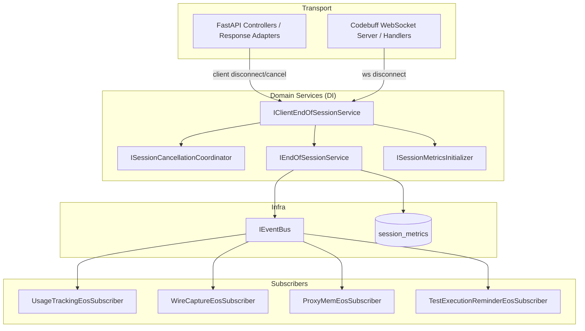
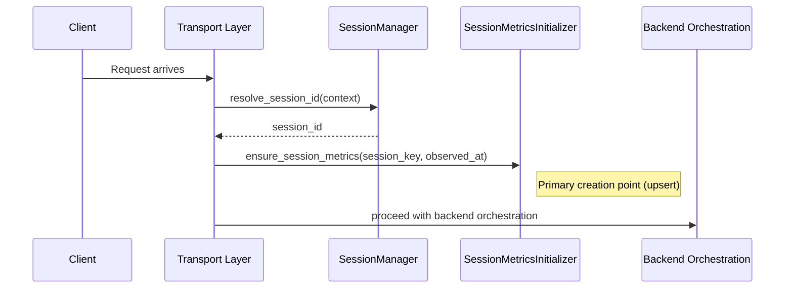
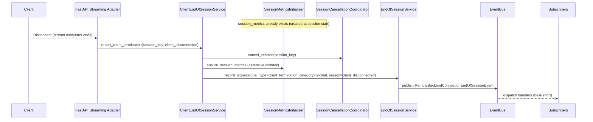
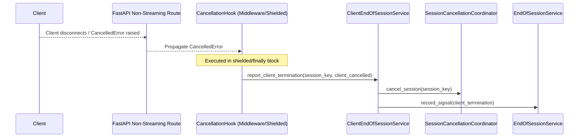
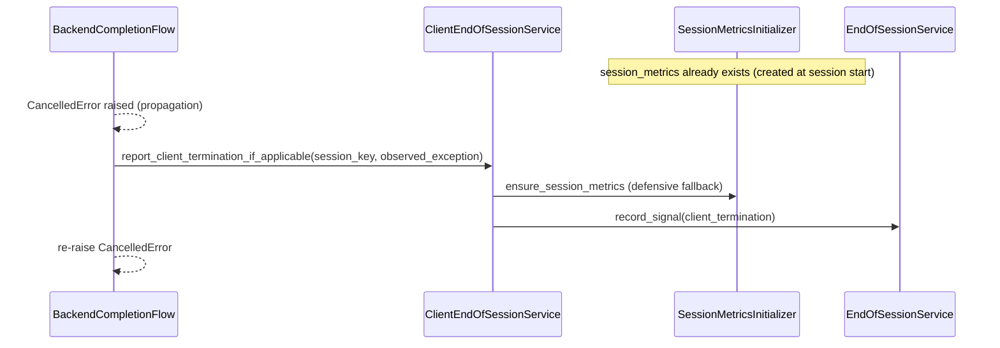
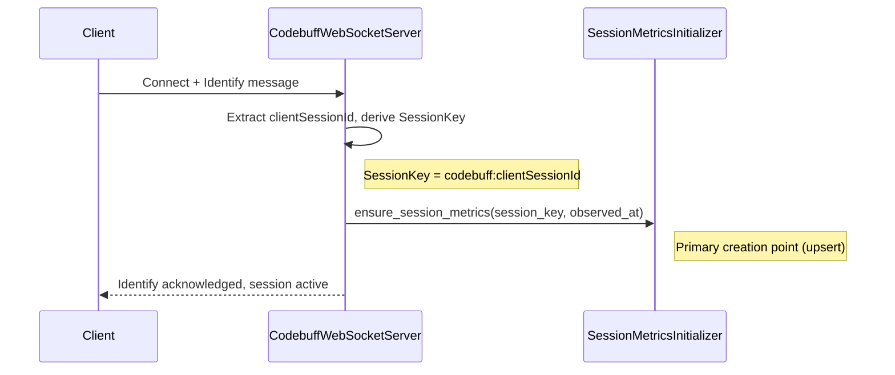
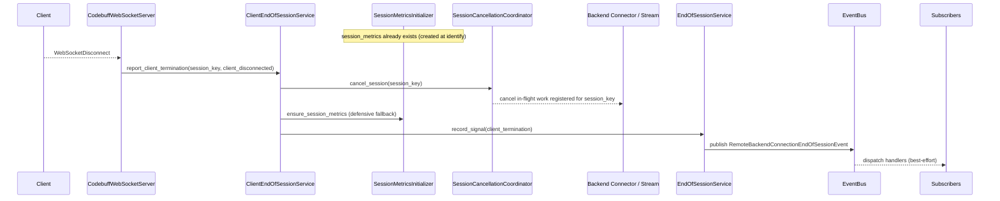

# Client End-of-Session Handling Design

## Overview
This feature introduces a first-class, session-scoped client-termination lifecycle that (a) detects client-side termination across transports, (b) cancels all in-flight and scheduled backend/agentic work for the affected session, and (c) guarantees End-of-Session (EoS) emission so subsystems (usage, wire capture, ProxyMem, steering) finalize consistently.

The design extends the existing EoS architecture established in `end-of-session-events` by adding a client-termination signal source and a session-wide cancellation coordinator. The implementation is designed to reduce transport coupling by keeping “disconnect detection” in transport adapters while normalizing and dispatching domain signals via DI-managed services.

### Goals
- Provide a normalized client termination signal with a standardized termination reason.
- Ensure client termination cannot bypass EoS emission and subscriber-driven finalization.
- Cancel in-flight backend calls and prevent new backend work (retry/failover/recovery/agentic steps) after client termination.
- Support HTTP-based endpoints and Codebuff WebSocket sessions.
- Preserve SOLID boundaries, strong session isolation, and explicit state ownership via DI-managed services.

### Non-Goals
- Changing frontend protocol semantics or introducing new client-facing cancellation APIs beyond those already present.
- Refactoring Codebuff prompt handling to route through the full core request processor (optional follow-up).
- Introducing new external dependencies or new persistence stores.
- Changing the canonical error-termination classification model (client termination remains “normal” termination category).

## Core Concepts and Terminology

To resolve ambiguity around the term "Session", this design strictly defines three distinct concepts:

### 1. Lifecycle Session (EoS/Cancellation Scope)
- **Definition**: The atomic unit of interaction that **must** emit exactly one End-of-Session (EoS) event.
- **Scope**: Cancellation is strictly scoped to this unit. If the client disconnects, work associated with this specific Lifecycle Session is cancelled.
- **Identity**: Maps to a unique Request ID (HTTP) or Connection ID (WebSocket).

### 2. Conversation / Agentic Chat Session
- **Definition**: A long-lived logical grouping spanning multiple Lifecycle Sessions (turns).
- **Scope**: Used for aggregation (ProxyMem, Analytics, Usage History).
- **Constraint**: Cancellation must **NEVER** propagate based on Conversation ID.

### 3. Transport Connection
- **Definition**: The physical connection (e.g., TCP socket, WebSocket connection).
- **Relation**: Usually 1:1 with Lifecycle Session for WebSockets (Codebuff), but distinct from Conversation.

### Invariants
1.  **Scope**: EoS emission and Cancellation are strictly scoped to the **Lifecycle Session**.
2.  **Cardinality**: A single Conversation contains **many** Lifecycle Sessions (1:N).
3.  **Isolation**: Cancellation must never cross Lifecycle Session boundaries (Requirement 1.6, NFR 3).

## Architecture

### Existing Architecture Analysis
- Streaming and non-streaming responses share a unified processing path via the stream normalizer/pipeline, but client disconnect detection is currently localized (for example, explicit polling in the Responses controller and `GeneratorExit` handling in a streaming orchestrator).
- Upstream cancellation is expressed primarily via `StreamingResponseEnvelope.cancel_callback` and ad-hoc markers (`cancel_reason`) rather than a session-scoped cancellation contract.
- The EoS system emits a single event per session using a DB claim on session metrics plus an in-memory hot-path dedupe cache; subsystems react through event bus subscribers.
- Backend orchestration re-raises cancellation exceptions, which can bypass EoS emission unless client termination is explicitly recorded before propagation.
- Codebuff WebSocket request flow is transport-specific and does not consistently integrate with the core cancellation/EoS lifecycle.

### Architecture Pattern & Boundary Map
**Architecture Integration**:
- Selected pattern: Internal event-driven lifecycle with a centralized “client termination reporter” feeding the existing EoS publisher, plus a session-scoped cancellation coordinator acting as the single source of truth for “session cancelled”.
- Domain/feature boundaries:
  - Transport layers detect disconnect/cancel and report a typed client termination signal.
  - Domain services normalize termination reasons, orchestrate cancellation, and emit EoS.
  - Subsystem behaviors remain in existing EoS subscribers (no duplication).
- Existing patterns preserved: DI-managed services, staged initialization, adapter layers, EoS pub/sub model, fail-open event dispatch.
- New components rationale:
  - Cancellation coordinator: prevents token waste and blocks follow-up backend calls after termination.
  - Client termination service: standardizes reasons, dedupes signals, and bridges to EoS emission.
- Steering compliance: SRP (separate detection/normalization/cancellation), explicit state ownership, and strong session isolation using a typed session key.

### Technology Stack & Alignment

| Layer | Choice / Version | Role in Feature | Notes |
|-------|------------------|-----------------|-------|
| Runtime | Python 3.10+ / FastAPI (async) | Cancellation + lifecycle | Use `async/await` for all I/O |
| DI Container | `src/core/di/container.py` | Service lifetimes | Cancellation coordinator is explicit state holder |
| Initialization | Staged init | Subscriber startup | Align with `src/core/app/lifecycle.py` patterns |
| Events | `src/core/services/event_bus.py` | EoS dispatch | Existing async pub/sub model |
| Persistence | `session_metrics` | EoS idempotency | Restart-safe “at most once” when available |
| Wire capture | CBOR capture | EoS metadata | Subscriptions remain unchanged; event reason becomes standardized |

## System Flows

### Session Initialization (Proactive Metrics Creation)
This flow shows the primary session metrics creation point, which occurs at session start before any backend work or potential termination.

### HTTP Streaming Disconnect → Cancellation → EoS

### HTTP Non-Streaming Client Disconnect / Cancellation
This flow addresses 1.4/3.8 for standard unary endpoints. It relies on a middleware or controller wrapper (Shielded Hook) to catch disconnects/cancellations.

### Backend Cancellation Exception Propagation → EoS

### Codebuff WebSocket Session Initialization
This flow shows Codebuff session setup including proactive metrics creation.

### Codebuff WebSocket Disconnect → Cancellation → EoS

## Requirements Traceability

| Requirement | Summary | Components | Interfaces | Flows |
|-------------|---------|------------|------------|-------|
| 1.1 | Detect dropped client connection | Transport adapters, ClientEndOfSessionService | `IClientEndOfSessionService` | HTTP Streaming Disconnect |
| 1.2 | Detect explicit client cancellation when available | Transport adapters, ClientEndOfSessionService | `IClientEndOfSessionService` | HTTP Streaming Disconnect |
| 1.3 | Support all frontend protocols including Codebuff | Transport adapters, Codebuff adapter | `IClientEndOfSessionService` | Codebuff Disconnect |
| 1.4 | Support streaming and non-streaming | Transport adapters, cancellation coordinator | `IClientEndOfSessionService`, `ISessionCancellationCoordinator` | HTTP Streaming Disconnect |
| 1.5 | Continuously evaluate termination while active | Transport monitors, cancellation coordinator | `ISessionCancellationCoordinator` | HTTP Streaming Disconnect |
| 1.6 | Do not attribute without session context | Client termination signal contract | `ClientEndOfSessionSignal` | All |
| 1.7 | Detect Codebuff disconnect as termination | Codebuff adapter | `IClientEndOfSessionService` | Codebuff Disconnect |
| 2.1 | Produce normalized client end-of-session signal | ClientEndOfSessionService | `IClientEndOfSessionService` | All |
| 2.2 | Include session identifier and timestamp | Signal contract | `ClientEndOfSessionSignal` | All |
| 2.3 | Include termination reason | Signal contract | `ClientTerminationReason` | All |
| 2.4 | Standardize reason set | Reason enum | `ClientTerminationReason` | All |
| 2.5 | Normalize multiple signals to one | ClientEndOfSessionService + EoS dedupe | `IClientEndOfSessionService`, `IEndOfSessionService` | All |
| 2.6 | Do not produce duplicates | ClientEndOfSessionService idempotency | `IClientEndOfSessionService` | All |
| 2.7 | Map legacy markers to standardized reasons | Reason mapper | `IClientTerminationReasonMapper` | All |
| 3.1 | Mark session ended on client signal | Cancellation coordinator + EoS | `ISessionCancellationCoordinator`, `IEndOfSessionService` | All |
| 3.2 | Emit EoS event on client termination | EoS publisher | `IEndOfSessionService` | All |
| 3.3 | Record category as normal | EoS signal contract | `EndOfSessionSignal` | All |
| 3.4 | Include client termination reason in EoS | EoS reason standardization | `IEndOfSessionService` | All |
| 3.5 | Prevent duplicate EoS | EoS idempotency | `IEndOfSessionService` | All |
| 3.6 | Emit even if stream does not complete | Transport disconnect reporting | `IClientEndOfSessionService` | HTTP Streaming Disconnect |
| 3.7 | Record signal type as client termination | EoS signal type extension | `EndOfSessionSignalType` | All |
| 3.8 | Emit EoS even when cancellation is exception-based | BackendFlow integration | `IClientEndOfSessionService` | Cancellation Exception |
| 3.9 | Fail-open when persistence unavailable | In-process dedupe + direct publish fallback | `IEndOfSessionService` | All |
| 3.10 | Persist idempotency state when enabled | Session metrics initializer + atomic claim | `ISessionMetricsInitializer`, `IEndOfSessionService` | All |
| 4.1 | Cancel in-flight backend work | Cancellation coordinator | `ISessionCancellationCoordinator` | All |
| 4.2 | Stop initiating additional backend work | Cancellation gate at backend call sites | `ISessionCancellationGate` | All |
| 4.3 | Cancel agentic/steering workflows | Cancellation coordinator registrations | `ISessionCancellationCoordinator` | All |
| 4.4 | Prevent retries/failover/follow-up calls | Cancellation gate integrated into recovery flows | `ISessionCancellationGate` | All |
| 4.5 | Treat uncancellable outcomes as non-deliverable | Transport adapters + cancellation coordinator | `ISessionCancellationCoordinator` | HTTP Streaming Disconnect |
| 4.6 | Scope cancellation to session | Session key contract | `SessionKey` | All |
| 4.7 | Prevent internal recovery workflows after termination | Cancellation gate | `ISessionCancellationGate` | All |
| 4.8 | Cancel backend work on Codebuff termination | Codebuff adapter + cancellation coordinator | `ISessionCancellationCoordinator` | Codebuff Disconnect |
| 5.1 | Finalize usage on client termination EoS | Existing subscriber | `IEventBus` | All |
| 5.2 | Finalize wire capture and record reason | Existing subscriber | `IEventBus` | All |
| 5.3 | Finalize ProxyMem with termination reason | Existing subscriber + reason standardization | `IEventBus` | All |
| 5.4 | Fault-isolate subsystem finalization | EventBus handler isolation | `IEventBus` | All |
| 5.5 | Emit EoS even when no backend response | Client termination reporting + session metrics init | `IClientEndOfSessionService`, `ISessionMetricsInitializer` | All |
| 6.1 | Log reason with session id | ClientEndOfSessionService logging | `IClientEndOfSessionService` | All |
| 6.2 | Make reason available to metrics/accounting | EoS reason standardization + subscribers | `IEndOfSessionService` | All |
| 6.3 | Record backend cancellation due to client termination | Cancellation coordinator metadata | `ISessionCancellationCoordinator` | All |
| 6.4 | Distinguish client termination from backend error | EoS signal type + category rules | `EndOfSessionSignalType` | All |

## Components and Interfaces

### Component Summary

| Component | Responsibility | DI Lifetime |
|----------|----------------|------------|
| `ClientEndOfSessionService` | Normalize/report client termination, orchestrate cancellation, trigger EoS | Singleton |
| `SessionCancellationCoordinator` | Session-scoped cancellation state, task registration, cancellation gate | Singleton |
| `SessionMetricsInitializer` | Ensure `session_metrics` existence before any EoS claim | Singleton |
| `ClientTerminationReasonMapper` | Map legacy/transport markers to standardized reasons | Singleton |
| Transport adapters (HTTP / Codebuff) | Detect disconnect/cancel and call `IClientEndOfSessionService` | Existing transport lifetimes |
| `SessionCancellationCleanupEosSubscriber` | Cleanup cancellation state on EoS emission (best-effort) | Singleton |

**DI Lifetime Safety (Critical)**: All singleton services in this feature depend ONLY on other singleton-safe dependencies:
- Repositories (`SessionMetricsRepository`) - singleton, stateless
- Configuration services - singleton
- Event bus (`IEventBus`) - singleton
- Other feature singletons listed above

Session/request-specific data is passed via **method arguments** (e.g., `SessionKey`, `ClientEndOfSessionSignal`), NOT via injected scoped dependencies. This ensures:
1. No "cannot resolve scoped service from singleton" runtime errors
2. No cross-session state leakage from captured scoped instances
3. Full compatibility with non-HTTP transports (Codebuff) that lack request scopes

### Data Contracts

#### `SessionKey`
A typed key that prevents cross-session leakage and supports multi-transport isolation.

- Fields:
  - `protocol: str` (e.g., "http", "codebuff")
  - `primary_id: str` (The logic key for EoS/Cancellation; e.g., Trace ID for HTTP)
  - `group_id: str | None` (The grouping key; e.g., Conversation ID for HTTP)

**Source of Truth: Session Identity Mapping**

| Frontend | Lifecycle Session Source (Generates ID) | Conversation Source | SessionKey.primary_id (EoS Scope) | SessionKey.group_id (Grouping) | session_metrics.session_id | Notes |
|---|---|---|---|---|---|---|
| **HTTP** | **Trace ID** (Unique Request ID) | `x-conversation-id` header or body param | Trace ID | Conversation ID | Trace ID | SSE stream is part of one HTTP Request. **1 Request = 1 EoS**. |
| **Codebuff** | **WS Connection ID** | N/A (Implicit 1:1) | `codebuff:{id}` | `None` | `codebuff:{id}` | **1 WS Connection = 1 EoS**. Aggregation (Conversation) is out of scope for this iteration. |

### Concrete Example: Chat App
Consider a user having a conversation with 20 turns.
- **Transport**: 20 separate HTTP requests.
- **Lifecycle Sessions**: 20 distinct sessions (identified by unique Trace IDs).
- **EoS Events**: 20 distinct events are emitted.
- **Cancellation**: If the user cancels the generation of turn 5, **only Lifecycle Session 5** is cancelled. Previous turns (1-4) and future turns (6-20) are unaffected.
- **Aggregation**: Subsystems (ProxyMem, Analytics) use `group_id` (Conversation ID) to link these 20 records, but the core proxy cancellation logic ignores this grouping.

**Scoping Rule**:
- **HTTP**: Cancellation and EoS are **Request-Scoped**. `SessionKey.primary_id` MUST be the Unique Request ID (Trace ID) to ensure retries are treated as distinct sessions.
- **Codebuff**: Cancellation and EoS are **Session-Scoped** (WebSocket connection lifetime).

#### `ClientTerminationReason`
Enum values:
- `client_disconnected`
- `client_cancelled`
- `unknown_client_termination`

#### `ClientEndOfSessionSignal`
Typed signal reported by transports to domain services.

- Fields:
  - `session_key: SessionKey`
  - `observed_at: datetime`
  - `reason: ClientTerminationReason`
  - `details: str | None` (bounded diagnostic detail; no secrets)

### Service Interfaces (Contracts)

#### `IClientEndOfSessionService`
- Responsibilities:
  - Accept `ClientEndOfSessionSignal` reports from transports.
  - Deduplicate multiple reports for the same session.
  - Ensure `session_metrics` exists for the session (best-effort) before attempting any EoS claim.
  - Cancel all registered work for the session.
  - Emit an EoS signal/event with client-termination signal type and standardized reason.
- Key operations (contract-level):
  - `report_client_termination(signal: ClientEndOfSessionSignal) -> None`
  - `report_client_termination_if_applicable(session_key: SessionKey, observed_exception: BaseException) -> None`

#### `ISessionCancellationCoordinator`
- Responsibilities:
  - Maintain explicit “cancelled” state per `SessionKey`.
  - Allow cancellable work to register under a session key.
  - Provide a “cancellation gate” used by any component that can initiate backend work.
- Key operations (contract-level):
  - `is_cancelled(session_key: SessionKey) -> bool`
  - `cancel_session(session_key: SessionKey, reason: ClientTerminationReason) -> None`
  - `register_cancellable(session_key: SessionKey, handle: ICancellable) -> None`
  - `cleanup(session_key: SessionKey) -> None` (best-effort removal of in-memory cancellation state)

#### `ISessionCancellationGate`
- Responsibilities:
  - Provide a low-friction guard for “do not start new backend work if cancelled”.
- Key operations:
  - `ensure_not_cancelled(session_key: SessionKey) -> None` (raises a domain cancellation exception)

#### `ISessionMetricsInitializer`
- Responsibilities:
  - Ensure `session_metrics` exists for the session before any EoS claim (3.10).
  - Be callable from both HTTP and non-HTTP transports (Codebuff) without relying on request scopes.
- Key operations:
  - `ensure_session_metrics(session_key: SessionKey, *, observed_at: datetime) -> None`
    - Best-effort: if persistence is unavailable, logs and returns without raising (3.9).
    - **Timeout**: This method MUST enforce a strict internal timeout (e.g., 2.0s) to prevent blocking the cancellation/EoS flow if the database is unresponsive.

#### `IClientTerminationReasonMapper`
- Responsibilities:
  - Map existing cancellation markers (for example, `client_disconnect`, `stream_cancelled`, `user_cancelled`) and transport signals (`GeneratorExit`) into standardized `ClientTerminationReason`.

### Integration Points (Non-Exhaustive)

#### HTTP Transports
- **Metrics initialization (proactive, required)**: Immediately after `session_id` is resolved for the request (in the core request processor), call `ISessionMetricsInitializer.ensure_session_metrics(...)` exactly once per session start. This MUST occur before any backend work begins to guarantee EoS can be emitted even if the client disconnects immediately.
- **Non-Streaming Hook**: A middleware or decorator (e.g., integrated into `GeneralExceptionMiddleware`) MUST catch `CancelledError` or `Disconnect` events. This hook MUST resolve the `SessionKey` and call `report_client_termination` within a shielded context.
- Streaming response adapters report disconnect on stream termination (`GeneratorExit`) and/or request-level disconnect detection (`request.is_disconnected()`), calling `IClientEndOfSessionService`.
- Non-streaming and streaming backend initiation paths MUST pass through the cancellation gate before any backend call is started.

#### Backend Orchestration and Recovery Flows
Components that can initiate additional backend calls must consult `ISessionCancellationGate` before doing so, including:
- Failover/retry execution
- Tool-call retry coordination
- Empty-stream recovery retries
- Angel verification and any other “follow-up backend call” workflow

**Structural Enforcement (Safety Net)**:
To prevent "zombie" requests and reduce reliance on manual flow checks, the **Backend Connector layer** (e.g., `BaseBackendConnector` or the final HTTP client wrapper) MUST enforce `ensure_not_cancelled(session_key)` immediately before transmitting any request.

The `SessionKey` MUST be propagated explicitly to the connector via a dedicated argument. This ensures the key is available for the check and cannot be silently dropped (as `**kwargs` might be).
- **Mandatory**: Add an explicit optional argument `cancellation_token: SessionKey | None = None` to `BaseBackendConnector.chat_completions`.
- **Requirement**: This requires updating `BaseBackendConnector` and **ALL** concrete backend implementations (OpenAI, Anthropic, Gemini, etc.) to accept this argument.
- **Prohibited**: Do not rely on `**kwargs` or implicit context dictionaries for passing the cancellation token, as these are fragile and break static analysis.

**Flow-Level Optimization**:
While the connector provides the final guard, high-level flows MUST still check cancellation to avoid wasted logic execution:
- `BackendCompletionFlow`: check at entry and before retry/failover decisions.
- Follow-up schedulers: check before scheduling new work steps.

#### Codebuff
- Session identity: derive `SessionKey(protocol="codebuff", session_id=f"codebuff:{clientSessionId}", request_id=None)` after identify/handshake.
- **Metrics initialization (required)**: immediately after identify/handshake, call `ISessionMetricsInitializer.ensure_session_metrics(...)`.
- The WebSocket server reports disconnect as `client_disconnected` through `IClientEndOfSessionService` (only if identify completed; otherwise no session attribution per 1.6).
- Codebuff prompt streaming registers in-flight backend work with `ISessionCancellationCoordinator` so the disconnect path can cancel it.

## Persistence and Idempotency
### Session Metrics Existence (3.10)
**Rule**: Any path that can emit EoS (including normal backend completion and error flows, not just client termination) MUST ensure `session_metrics` exists first using the defensive fallback pattern.

**Two-phase approach**:
1. **Primary (proactive)**: Initiate creation of `session_metrics` at session start. To meet **NFR 1 (Performance)**, this SHOULD be executed as a non-blocking background task (fire-and-forget) to avoid delaying the critical path (TTFB). **Crucially**, this background task MUST catch all exceptions and log them with a specific error code/metric to ensure visibility of initialization failures, preventing silent degradation to the blocking fallback.
   - HTTP: immediately after `session_id` resolution.
   - Codebuff: immediately after identify/handshake.
2. **Defensive fallback**: `ClientEndOfSessionService` calls `ensure_session_metrics` (awaiting the result) during termination handling. **This step MUST occur after initiating cancellation** to ensure database latency does not delay the stopping of backend work (NFR 1). This acts as the consistency guarantor: if the background task hasn't finished or failed, this step ensures the record exists before EoS emission.
   - **Timeout Enforced**: This fallback call MUST be wrapped in a strict timeout (e.g., 2.0s) to guarantee fail-open behavior if the DB is under load or unresponsive.

`ISessionMetricsInitializer.ensure_session_metrics(...)` is the single contract that implements both phases. It is a singleton service backed by `SessionMetricsRepository` and uses a create-or-get (upsert) strategy that relies on atomic database operations (e.g., `ON CONFLICT DO NOTHING`) to handle concurrency between the background task and the fallback safely without in-memory locks.

### Fail-Open Emission and Shielding (3.9 / 5.5)
- **Shielded Execution**: The termination reporting logic (in hooks/adapters) MUST be executed in a shielded context (e.g., `asyncio.shield` or `finally` block) to ensure it runs to completion even if the main request task is cancelled.
- **DB Unavailability Fallback**: If `ensure_session_metrics` fails (DB down):
  1. Log the failure with a high-visibility error code.
  2. **Proceed** with EoS emission (`record_signal`).
  3. `EndOfSessionService` MUST use an **in-process memory cache** (TTL ~5m) to deduplicate EoS events for the same `SessionKey` when DB claims are unavailable. This guarantees "at most once" per process behavior.

### EoS Idempotency and Fail-Open Emission (3.9/3.10)
- Primary: reuse the existing EoS persistence mechanism (atomic claim on `session_metrics`) for client termination (3.10).
- Fail-open: as defined above, fall back to in-process dedupe if persistence is unavailable.

## Observability and Security
- All client termination events are logged with session correlation identifiers and the standardized `ClientTerminationReason` (6.1).
- The EoS event `reason` field should be standardized to the same reason values so downstream subscribers can record consistent metadata (6.2).
- Cancellation operations must be scoped by `SessionKey` and must not allow cross-session cancellation or leakage (NFR 3).
- No termination reporting or metadata may include API keys or authorization headers.

## Cancellation State Management and Cleanup
`SessionCancellationCoordinator` is a singleton and therefore MUST be explicitly bounded and cleaned up to avoid unbounded growth.

### State and Dedupe
- The coordinator stores per-session cancellation state (cancelled flag, reason, timestamp) keyed by the full `SessionKey`. For HTTP, this includes `primary_id` (Trace ID) to allow retries.
- `IClientEndOfSessionService` deduplicates client termination reports by consulting the coordinator first (2.5/2.6).

### Cleanup
- Primary cleanup: `SessionCancellationCleanupEosSubscriber` listens for EoS events and calls `SessionCancellationCoordinator.cleanup(session_key)` best-effort.
- Safety net: The coordinator uses a passive **TTL Cache** (e.g., `cachetools.TTLCache`) to store session states. This automatically expires entries after a configurable TTL (e.g., 1 hour) without requiring complex background sweep tasks or concurrent cleanup logic (NFR 2).

## Resolved Decisions
- `session_metrics` uses a two-phase creation strategy: (1) **non-blocking** proactive creation at session start to satisfy latency NFRs, and (2) **blocking** defensive fallback during termination to guarantee consistency.
- All singleton services depend only on singleton-safe dependencies (repos, config, event bus); session/request data is passed via method arguments to avoid DI lifetime mismatches and cross-session leakage.
- Codebuff session ids are canonicalized as `codebuff:{clientSessionId}` to prevent collisions with HTTP session ids.
- **Backend cancellation gating (API Safety)**: Enforced structurally at the connector level. `SessionKey` is passed via an explicit `cancellation_token` argument in `BaseBackendConnector` methods. `**kwargs` propagation is prohibited for safety reasons.
- **HTTP Cancellation Scoping**: HTTP cancellation is keyed by `primary_id` (Trace ID, via `SessionKey`) to prevent collision with retries on the same conversation `group_id`. Codebuff cancellation remains session-scoped.
- Cancellation state cleanup is tied to EoS emission via `SessionCancellationCleanupEosSubscriber`, with a passive `TTLCache` (expiry-on-access/write) as a safety net for sessions that never reach EoS, avoiding background tasks.

## References
- `.kiro/specs/client-end-of-session-handling/research.md`
- `.kiro/specs/end-of-session-events/design.md`
- `src/core/services/end_of_session_service.py`
- `src/core/app/controllers/responses_controller.py`
- `src/codebuff/server.py`
