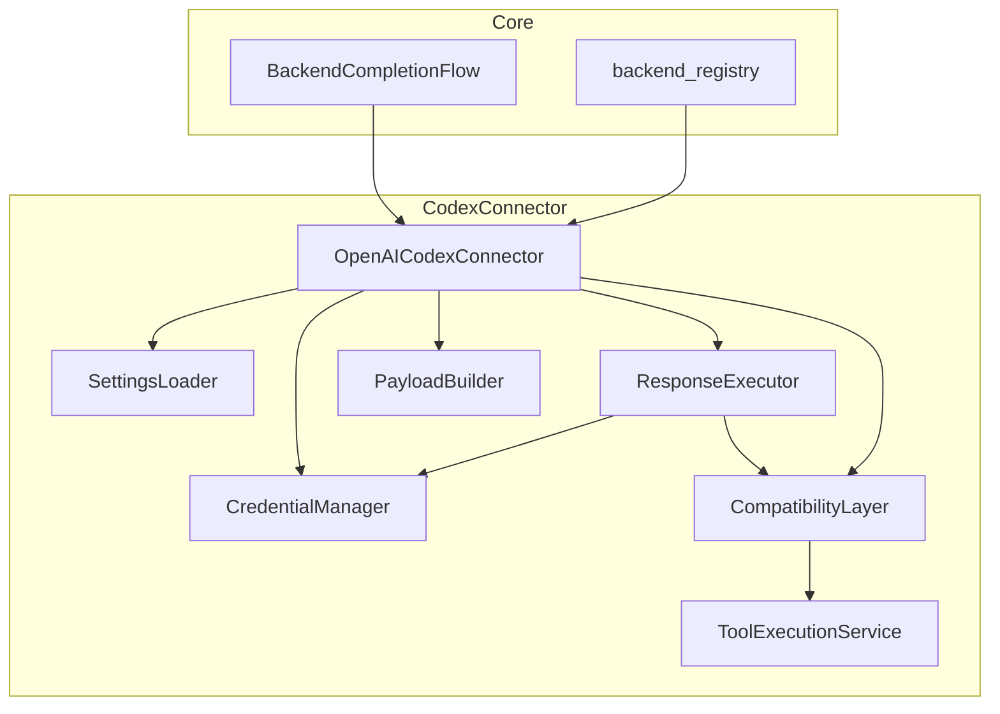
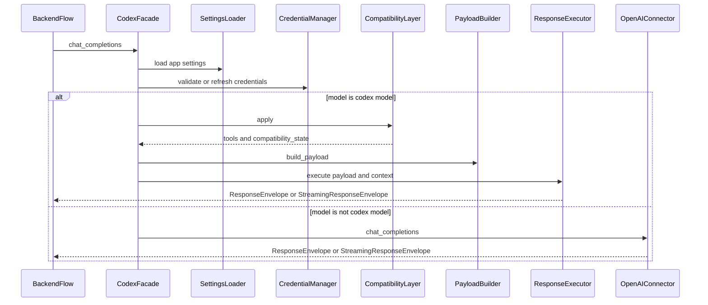
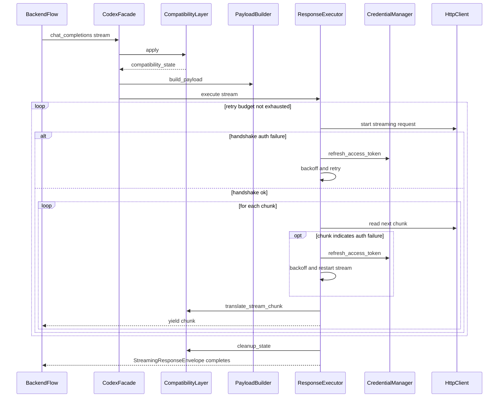

# Design Document

---
**Purpose**: Provide sufficient detail to ensure implementation consistency across different implementers, preventing interpretation drift.

**Approach**:
- Include essential sections that directly inform implementation decisions
- Omit optional sections unless critical to preventing implementation errors
- Match detail level to feature complexity
- Use diagrams and tables over lengthy prose

**Warning**: Approaching 1000 lines indicates excessive feature complexity that may require design simplification.

**Project Context**: Universal LLM Proxy - FastAPI async service with staged initialization, DI containers, adapter pattern for LLM backends.
---

## Overview
This feature completes the Codex connector refactor by converging on a single execution path and enforcing strict component boundaries. The intent is to eliminate duplicated streaming retry logic and private-state coupling while preserving current behavior for responses, streaming, compatibility flows, and error mapping.

**Purpose**: This feature delivers a modular, SOLID-aligned Codex backend implementation to maintainers and test authors without changing external API behavior for proxy users.  
**Users**: Maintainers and contributors will use this to extend Codex behavior and debug streaming/auth issues with lower cognitive load and stronger test seams.  
**Impact**: The Codex connector facade becomes an orchestration-only adapter; streaming retry and request execution are centralized in the response execution component.

### Goals
- Converge to a single Codex responses execution path (`ResponseExecutor`) for streaming and non-streaming.
- Remove connector logic that duplicates retry, token refresh, and chunk-level auth detection.
- Eliminate direct private-state access across components; use public contracts/configuration.
- Preserve behavior parity (responses, errors, streaming semantics, compatibility flows) and avoid regressions in other backends or core orchestration.

### Non-Goals
- Changing external endpoint behavior, response schemas, or configuration keys.
- Changing core backend orchestration, wire capture, or usage accounting architecture.
- Introducing new staged initialization stages.
- Introducing new micro-components (policy/header builder) unless follow-up evidence justifies it.

## Architecture

### Existing Architecture Analysis (if applicable)
- The Codex backend is implemented as `OpenAICodexConnector` in `src/connectors/openai_codex.py` and registered at import time via `backend_registry`.
- A componentized package exists at `src/connectors/openai_codex/` with contracts and interfaces, but the facade still contains an inline streaming retry path and private-field coupling to the executor and compatibility layer.
- Startup and DI follow staged initialization; the backend stage registers a partial `CodexConnectorDependencies` bundle (`src/core/di/registrations/_backend/codex.py`).
- Wire capture and usage accounting are orchestrated in core (`src/core/services/backend_completion_flow/service.py`); connector code must remain compatible with envelopes consumed by this orchestration.

### Architecture Pattern & Boundary Map
**Architecture Integration**:
- Selected pattern: Facade plus component services (connector orchestrates; components own behavior).
- Domain boundaries: settings, credentials, payload preparation, response execution, compatibility translation, tool execution.
- Existing patterns preserved: connector registration via `backend_registry`, staged init, DI for connector-agnostic services, async I/O via httpx.
- New components rationale: no new components required; the change is primarily boundary enforcement and ownership consolidation.
- Steering compliance: SRP, explicit contracts, and “thin orchestrators delegating to components” (mirrors core RequestProcessor pattern).



### Technology Stack

| Layer | Choice / Version | Role in Feature | Notes |
|-------|------------------|-----------------|-------|
| Runtime | Python 3.10+ / FastAPI (async) | Connector runtime | Use `async/await` for all I/O |
| HTTP Client | httpx (async) | Codex API calls | Shared client injected into connector |
| DI Container | `src/core/di/container.py` | Component overrides | Partial dependency bundle supported |
| Initialization | Staged (`src/core/app/stages/`) | Startup wiring | No new stages introduced |
| Connectors | `src/connectors/base.LLMBackend` | Backend adapter | Preserve `initialize` and `chat_completions` |
| Wire Capture | Core orchestrator | Captures | Connector returns envelopes compatible with capture wrapping |

## System Flows

### Model dispatch and compatibility orchestration


**Decisions**:
- Compatibility application runs before payload construction so translated messages and tool results are reflected in the request payload (7.1, 7.4).
- If compatibility mode allocates per-request state, the state is carried forward in `CodexRequestContext.metadata["compatibility_state"]` so the executor can guarantee cleanup regardless of outcome (7.3, 9.6).

### Streaming request with auth retry and compatibility translation (executor-owned)


**Decisions**:
- Retry and token refresh are owned by `ResponseExecutor` (3.1, 3.2, 3.3, 6.1, 6.2, 6.3, 6.4).
- Compatibility state lifecycle is owned by the compatibility layer and is cleaned up after stream completion or error by the executor (7.3).

## Requirements Traceability

| Requirement | Summary | Components | Interfaces | Flows |
|-------------|---------|------------|------------|-------|
| 1.1, 1.2, 1.3, 1.4, 1.5, 1.6 | Preserve behavior parity | Facade, Payload, Exec, Compat | `IPayloadBuilder`, `IResponseExecutor`, `ICompatibilityLayer` | Streaming request |
| 2.1, 2.2, 2.3, 2.4 | SOLID component boundaries | All Codex components | All `I*` interfaces | N/A |
| 3.1, 3.2, 3.3, 3.4 | Single execution path | Exec, Facade | `IResponseExecutor` | Streaming request |
| 4.1, 4.2, 4.3, 4.4, 4.5 | DI and wiring stability | Facade, DI registrations | `CodexConnectorDependencies` | N/A |
| 5.1, 5.2, 5.3, 5.4 | Credential concurrency safety | Creds | `ICredentialManager` | N/A |
| 6.1, 6.2, 6.3, 6.4 | Streaming retry parity | Exec, Creds | `IResponseExecutor`, `ICredentialManager` | Streaming request |
| 7.1, 7.2, 7.3, 7.4 | Compatibility flows stable | Compat, Tools, Exec | `ICompatibilityLayer`, `IToolExecutionService` | Streaming request |
| 8.1, 8.2, 8.3, 8.4, 8.5 | Observability compatibility | Exec, Facade | Envelopes | N/A |
| 9.1, 9.2, 9.3, 9.4, 9.5, 9.6 | Test seams and typing | All components | All `I*` interfaces | N/A |

## Components and Interfaces

**DI Registration Strategy**:
- Connector-agnostic services are registered as singletons via `ServiceCollection` (settings, credentials, tool execution).
- Connector-bound services (payload builder, response executor, compatibility layer) are constructed by the connector by default and may be overridden via `CodexConnectorDependencies`.

### OpenAICodexConnector (Facade)
| Field | Detail |
|-------|--------|
| Intent | Orchestrate Codex request lifecycle; delegate behavior to services |
| Base Class | `OpenAIConnector` |
| Backend Type | `backend_type = \"openai-codex\"` |

**Responsibilities & Constraints**
- Enforce current Codex backend enablement gating behavior (403) without affecting non-codex fallback behavior (1.1, 1.3).
- Preserve dispatch behavior: if `effective_model` is a Codex model, use the Codex Responses execution path; otherwise delegate to `OpenAIConnector.chat_completions(...)` (1.1, 1.2).
- Delegates payload building to `IPayloadBuilder`.
- Delegates execution (streaming and non-streaming) to `IResponseExecutor` exclusively (3.1, 3.2, 3.3).
- Delegates compatibility translation to `ICompatibilityLayer` only through public APIs (2.4).
- Validates dependency overrides and fails fast on invalid overrides (3.4, 4.3).

**Facade contract (public behavior)**
- `initialize(...)` preserves current credential initialization behavior.
- `chat_completions(...)` preserves response and streaming semantics; it must not implement retry logic directly.

### ResponseExecutor
| Field | Detail |
|-------|--------|
| Intent | Own Codex Responses API execution, streaming retry, and error mapping |
| Interface | `IResponseExecutor` |
| Lifetime | Connector-bound default; overrideable |

**Responsibilities**
- Execute non-streaming requests and return `ResponseEnvelope` with usage data (8.1).
- Execute streaming requests and return `StreamingResponseEnvelope` with retry semantics (6.1, 6.2, 6.3, 6.4).
- Own header building and auth header refresh logic during retry.
- Integrate compatibility translation for streaming chunks and ensure cleanup is invoked when the stream ends (7.2, 7.3).
- When `CodexRequestContext.metadata["compatibility_state"]` is present, ensure cleanup is invoked for both streaming and non-streaming execution outcomes to preserve current resource-safety behavior (7.3).

**Conversation and session identifier contract**
- The Codex HTTP headers `conversation_id` and `session_id` shall be derived from the Codex conversation identifier used today: `CodexPayload.prompt_cache_key` (1.2, 6.1).
  - If `prompt_cache_key` is missing or empty, the executor may fall back to `CodexRequestContext.session_id` or a generated UUID, but it must preserve current session continuity behavior as validated by existing integration tests (1.2, 6.4).
- `CodexRequestContext.session_id` is treated as a proxy correlation/request identifier and may differ from the Codex conversation identifier; it must remain stable for logging and metadata, but it is not the source of truth for Codex conversation headers (8.4).

**Configuration surface (public)**
- The retry budget and backoff sequence shall be configured at construction time from normalized settings:
  - `max_retries` derived from settings (6.4)
  - `retry_backoff_seconds` derived from settings (6.4)
- Tests and wiring shall not mutate private executor fields to change retry behavior (9.6). Supported test seams are:
  - override the settings source (`ISettingsLoader`) to produce desired retry values, or
  - provide an `IResponseExecutor` override via `CodexConnectorDependencies` configured for the test scenario.
- Runtime mutation of retry configuration is out of scope; if needed in the future, it must be exposed via an explicit public method (not private attribute mutation) (9.6).

### CredentialManager and CredentialWatcher
| Field | Detail |
|-------|--------|
| Intent | Credential lifecycle, refresh, watcher debounce, atomic persistence |
| Interface | `ICredentialManager` |
| Lifetime | Singleton |

**Responsibilities**
- Serialize refresh operations and prevent races (5.1).
- Persist refreshed tokens atomically (5.2).
- Debounce watcher-triggered reload tasks (5.3) and stop cleanly on shutdown (5.4).

### PayloadBuilder
| Field | Detail |
|-------|--------|
| Intent | Build Codex payloads and preserve passthrough detection rules |
| Interface | `IPayloadBuilder` |
| Lifetime | Connector-bound default; overrideable |

**Responsibilities**
- Detect native Responses payload passthrough under capability gating (1.5).
- Assemble Codex payload for non-passthrough requests (1.1, 1.2).
- Resolve tools and tool schema collision rules via `IToolSchemaResolver` (1.6).

### CompatibilityLayer
| Field | Detail |
|-------|--------|
| Intent | Preserve KiloCode and Droid compatibility behaviors and per-request state lifecycle |
| Interface | `ICompatibilityLayer` |
| Lifetime | Connector-bound default; overrideable |

**Responsibilities**
- Detect compatibility flows and translate tool calls (7.1).
- Translate streaming chunks using owned per-request state (7.2).
- Cleanup per-request state after stream completion or error (7.3).

**Contract requirement**
- The facade must not set compatibility internals via private attributes; collaborators are provided via the compatibility layer public construction/configuration surface (2.4).
- The compatibility layer must not depend on private attributes of collaborators (for example, translator internal parsers); collaborators must provide the public methods required by the flow (2.4, 9.6).
- Where translator outputs are consumed, the compatibility layer should rely on named fields (for example, `tool_name`/`arguments`) rather than tuple unpacking to keep the boundary explicit and typed (2.4, 9.6).

**State propagation contract**
- If `apply(...)` returns a non-null state, the facade shall propagate the state via `CodexRequestContext.metadata["compatibility_state"]` passed to the executor (7.3, 9.6).
- The executor shall treat the state as opaque and invoke `cleanup_state(...)` exactly once after completion or error; the state must not escape the request scope (7.3).

**Collaborator type contracts (public boundary)**
The compatibility layer collaborator surface must be typed and stable for test substitution (2.4, 9.3, 9.6). The following minimal Python `Protocol` shapes define the public boundary; concrete implementations may provide additional methods, but callers must not depend on them.

```python
from __future__ import annotations

from collections.abc import Awaitable
from typing import Mapping, Protocol


class ISessionDetectionResult(Protocol):
    is_kilocode: bool
    detection_method: str
    confidence: float


class ISessionDetector(Protocol):
    def detect(
        self,
        *,
        request_data: object,
        metadata: Mapping[str, object] | None,
        session_id: str,
        backend: str,
    ) -> Awaitable[ISessionDetectionResult]: ...


class IDroidDetectionResult(Protocol):
    is_droid: bool
    detection_method: str
    confidence: float


class IDroidDetector(Protocol):
    def detect(
        self,
        *,
        headers: Mapping[str, str] | None,
        messages: list[Mapping[str, object]] | None,
        tools: list[Mapping[str, object]] | None,
    ) -> IDroidDetectionResult: ...


class IKiloToolTranslator(Protocol):
    async def translate_tool_invocation(
        self, xml_text: str, session_id: str | None = None
    ) -> "IKiloTranslationResult | None": ...


class IKiloTranslationResult(Protocol):
    tool_name: str
    arguments: Mapping[str, object]


class IDroidToolTranslator(Protocol):
    def translate_codex_to_droid(
        self, codex_tool_name: str, codex_arguments: Mapping[str, object]
    ) -> "IDroidReverseTranslationResult": ...


class IDroidReverseTranslationResult(Protocol):
    droid_tool_name: str
    droid_arguments: Mapping[str, object]
```

Migration note: current implementations may accept looser types internally (including optional runtime imports), but the public constructor/configuration surface must accept these typed collaborators (or `None`) so wiring and tests do not rely on untyped `Any` or private attributes (2.4, 9.6).

**Public collaborator contract**
- `CompatibilityLayer` shall accept its collaborators via a documented public API (constructor injection is the default).
- The public collaborator surface shall include the following named parameters (types are illustrative and may be concrete classes or small focused protocols, but must not be `Any` at the boundary) (2.4, 9.6):
  - `session_detector`: `ISessionDetector` used to determine whether compatibility mode applies (7.1)
  - `kilo_translator`: `IKiloToolTranslator` used for tool translation (7.1)
  - `droid_detector`: `IDroidDetector` used for Droid detection (7.1)
  - `droid_translator`: `IDroidToolTranslator` used for stream chunk translation (7.1, 7.2)
  - `tool_execution_service`: tool execution collaborator (7.1)
- Where a collaborator is not provided, the compatibility layer may continue to apply the current “best-effort, fail-open” behavior (e.g., lazy availability checks for Droid support) without changing externally visible behavior (1.1, 1.2, 7.4).

### SettingsLoader
| Field | Detail |
|-------|--------|
| Intent | Normalize configuration with precedence and defaults |
| Interface | `ISettingsLoader` |
| Lifetime | Singleton |

**Responsibilities**
- Preserve configuration keys, defaults, and precedence (1.4).
- Provide normalized streaming retry settings used to configure the executor (6.4).

### ToolExecutionService
| Field | Detail |
|-------|--------|
| Intent | Execute proxy tools and MCP tools for compatibility flows |
| Interface | `IToolExecutionService` |
| Lifetime | Singleton |

## Data Models

### Connector-local contracts (`src/connectors/openai_codex/contracts.py`)
- `CodexRequestContext`: request + processed messages + effective model + capabilities + metadata.
- `CodexPayload`: typed representation of the Codex Responses payload (including passthrough support).
- `CompatibilityState`: per-request compatibility state that must be cleaned up.
- `CodexConnectorDependencies`: optional override bundle for components.

**Design constraint**: Cross-component boundaries should use typed models rather than ad-hoc dicts (aligns with design principles for type safety).

## Error Handling

### Error Strategy
- Preserve current error mapping for Codex requests and streaming retry exhaustion (1.3, 6.3).
- Fail fast on invalid component overrides (3.4) with clear error messages (prefer `ServiceResolutionError` or a connector-local validation error that maps to existing patterns).
- Do not introduce new externally visible error shapes.

## Testing Strategy

### Unit Tests (`tests/unit/connectors/openai_codex/`)
- Expand tests to verify supported configuration seams (9.6) instead of mutating private fields.
- Keep existing unit tests for settings normalization, credentials concurrency, payload/passthrough detection, executor retry behavior.

### Integration Tests (`tests/integration/`)
- Keep and extend parity tests:
  - `test_codex_streaming_retry_parity.py` must validate handshake and chunk retry behavior via the single executor path.
  - `test_codex_backend_wiring.py` must confirm staged init registration and DI partial bundle behavior.

### Regression gates
- Run all Codex unit tests and the Codex integration suite before merging any refactor step.
- Add new tests only for new public seams; avoid tests that assert internal call graphs.

## Security Considerations
- Preserve redaction behavior for secrets in logs/captures (8.5).
- Do not relax request validation rules (NFR Security).

## Performance & Scalability
- Avoid introducing additional network calls in request execution paths.
- Keep streaming per-chunk overhead minimal; translation should be best-effort and fail-open as today.

## Stage Registration
No new stages are required. Existing backend stage and DI registrations remain the integration points.

## Integration & Migration Notes
- Implement in small steps with parity tests as the merge gate: first remove the inline `_perform_request` execution path and route Codex-model execution to `IResponseExecutor.execute(...)` unconditionally (3.1, 3.2, 3.3).
- Preserve `openai-codex` backend registration and staged init wiring; do not introduce connector-level imports from controllers or transport layers (4.1, 4.5).
- Treat existing integration tests in `tests/integration/` and unit tests in `tests/unit/connectors/openai_codex/` as the non-regression contract for this refactor (1.1, 1.2, 1.3).
