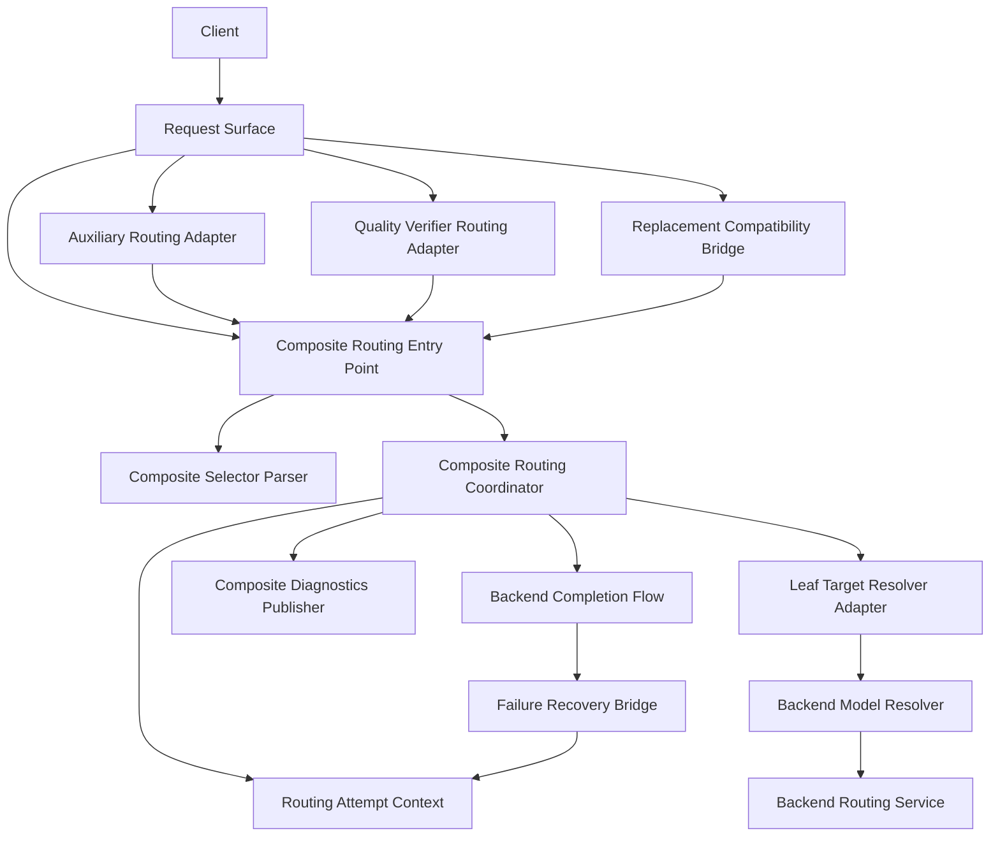
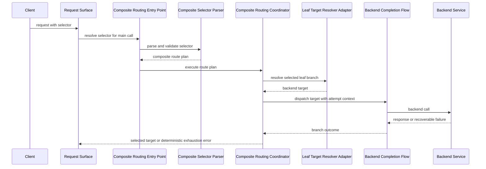
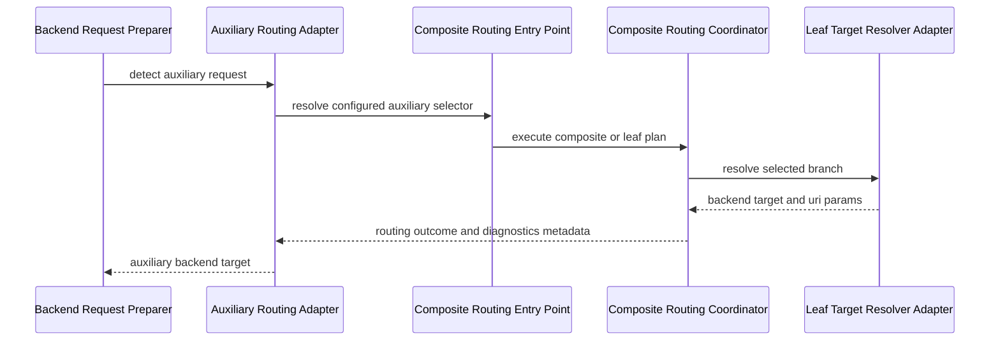
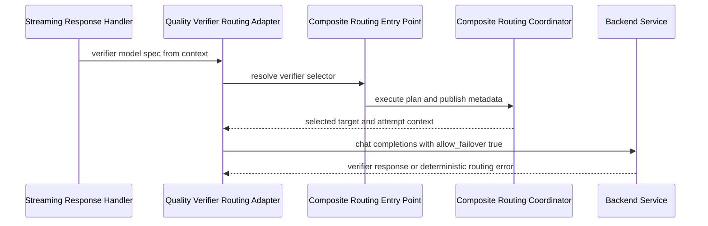
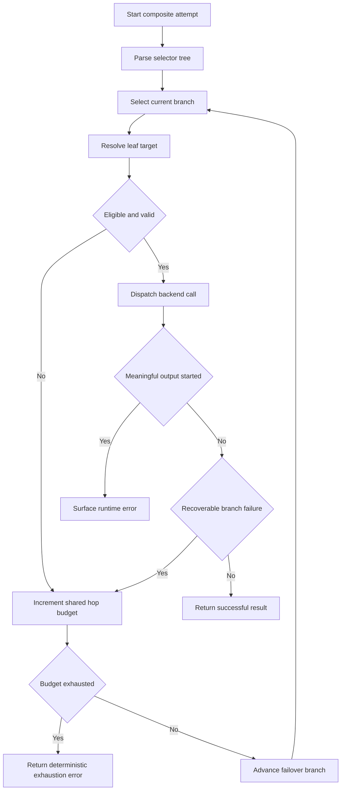
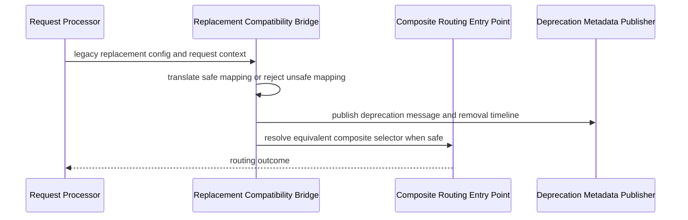
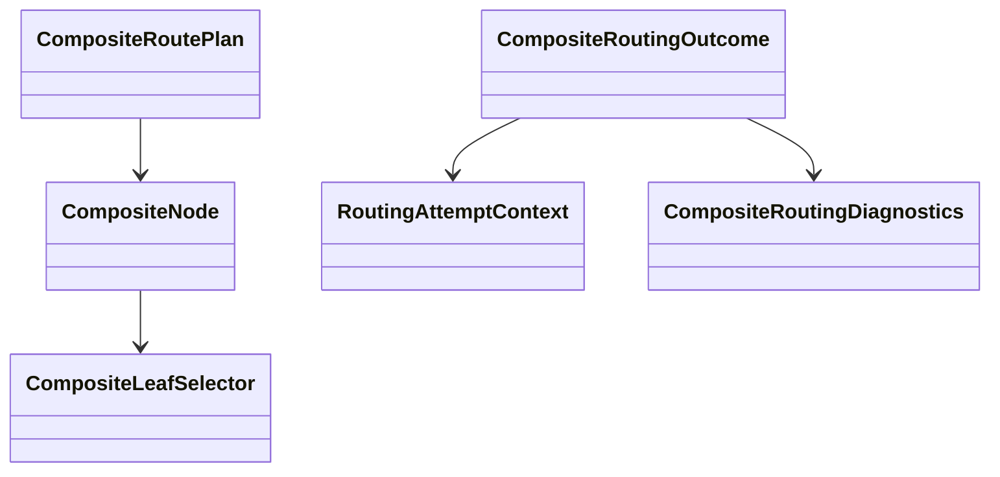
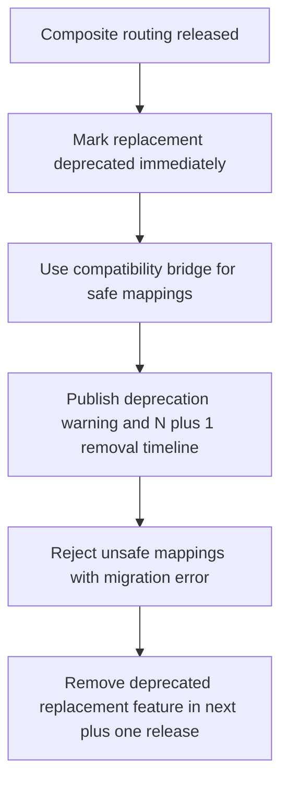

# Design Document

## Overview

This feature delivers one composite-routing model for the proxy’s outbound LLM call surfaces. Operators can express ordered failover with `|` and weighted random selection with `^` plus optional `[weight=N]` while preserving existing single-target selector semantics such as `backend:model`, backend-instance selectors, model-only selectors, vendor/model identifiers, and URI-style selector parameters.

The design extends the current resolver-centric routing architecture rather than replacing it. A dedicated composite-routing layer parses selector strings, validates the grammar, plans branch execution, tracks one bounded routing attempt context, and emits structured diagnostics. Existing single-target services remain the source of truth for backend-instance resolution, availability filtering, static-route behavior, and backend execution.

### Goals
- Provide one shared composite-routing entry point for main, auxiliary, and quality-verifier routing surfaces.
- Support ordered failover and weighted random branch selection without breaking existing selector semantics.
- Enforce deterministic parsing, explicit validation errors, and one shared retry/failover budget across composite and existing failover behavior.
- Deprecate random model replacement through a compatibility bridge and explicit operator messaging.
- Keep composite-routing decisions observable across existing diagnostics and request-context surfaces.

### Non-Goals
- Replacing the existing single-target resolver or backend routing service with network-time connector probing.
- Adding probabilistic multi-branch execution for weighted random selectors.
- Removing the deprecated replacement subsystem in this release.
- Changing external request payload fields or selector field names.

## Requirements Traceability

| Requirement | Summary | Components | Interfaces | Flows |
|-------------|---------|------------|------------|-------|
| 1.1, 1.2, 1.3, 1.4, 1.5 | Shared composite entry point across all routing surfaces | Composite Routing Entry Point, Composite Routing Coordinator, Leaf Target Resolver Adapter, Auxiliary Routing Adapter, Quality Verifier Routing Adapter | `ICompositeRoutingService`, `ICompositeRouteAwareTargetResolver` | 1, 2, 3 |
| 2.1, 2.2, 2.3, 2.4, 2.5 | Ordered failover selectors | Composite Selector Parser, Composite Routing Coordinator, Routing Attempt Context, Failure Recovery Bridge | `ICompositeSelectorParser`, `ICompositeRoutingService` | 1, 4 |
| 3.1, 3.2, 3.3, 3.4, 3.5 | Weighted random selectors | Composite Selector Parser, Weighted Branch Selector, Composite Routing Coordinator | `IWeightedBranchSelector` | 1, 4 |
| 4.1, 4.2, 4.3, 4.4, 4.5 | Deterministic parsing and validation | Composite Selector Parser, Composite Validation Error Adapter | `ICompositeSelectorParser` | 1 |
| 5.1, 5.2, 5.3, 5.4, 5.5 | Composite failover safety and bounded retries | Routing Attempt Context, Composite Routing Coordinator, Failure Recovery Bridge | `IRoutingAttemptBudget`, `ICompositeRoutingService` | 1, 4 |
| 6.1, 6.2, 6.3, 6.4, 6.5 | Backward compatibility | Leaf Target Resolver Adapter, parser leaf-selector contract, Static Route Compatibility Rules | `ICompositeRouteAwareTargetResolver` | 1, 2, 3 |
| 7.1, 7.2, 7.3, 7.4, 7.5 | Replacement deprecation and migration | Replacement Compatibility Bridge, Deprecation Metadata Publisher, Config Validation Adapter | `IReplacementCompositeBridge` | 5 |
| 8.1, 8.2, 8.3, 8.4, 8.5 | Observability and diagnosability | Composite Diagnostics Publisher, Request Context Metadata Contract, Error Adapter | `ICompositeRoutingDiagnosticsPublisher` | 1, 2, 3, 4, 5 |

## Architecture

### Existing Architecture Analysis

The codebase already uses a resolver-centric routing model. `BackendModelResolver` normalizes aliases, parses single-target selectors, resolves model-only routing through `BackendRoutingService`, and applies static-route behavior. `BackendRequestPreparer` proves that auxiliary routing can safely re-enter the shared resolver path. `QualityVerifierOrchestrator` performs internal backend calls through `IBackendService`, so it can adopt the same routing contract without changing its outward request schema.

The main architectural constraint is that current routing services assume one resolved `BackendTarget`. At the same time, failover safety already spans `FailureRecoveryExecutor`, `DefaultFailureHandlingStrategy`, and the existing “do not fail over after meaningful output begins” rule. The design therefore adds composite parsing and branch progression without creating a second retry system.

### Architecture Pattern & Boundary Map

Selected pattern: **Layered composite routing on top of the existing resolver and backend routing services**.

- Selected pattern: hybrid layered composition for a brownfield routing system.
- Domain/feature boundaries: parser owns syntax; coordinator owns branch planning and attempt accounting; existing resolver/routing services own leaf selector resolution; execution flow owns backend invocation and runtime recovery.
- Existing patterns preserved: staged startup, DI-managed service seams, transport-neutral routing logic, request-context metadata, typed proxy exceptions.
- New components rationale: composite grammar, branch history, migration bridge, and diagnostics need typed boundaries that current single-target services do not provide.
- Steering compliance: keeps framework details out of routing logic and avoids connector-specific behavior leaking into core contracts.



### Technology Stack

| Layer | Choice / Version | Role in Feature | Notes |
|-------|------------------|-----------------|-------|
| Backend / Services | Python 3.10+ | Typed composite parser, coordinator, adapters, and diagnostics services | Must satisfy mypy/pyright boundaries |
| Domain Modeling | Pydantic v2 models | AST nodes, routing attempt state, diagnostics payloads | Avoid untyped dictionaries at public boundaries |
| Runtime / DI | Existing `ServiceCollection` and staged initialization | Register composite-routing services and adapters | No new startup stage required |
| Resilience / Routing | Existing `BackendRoutingService`, `FailureRecoveryExecutor`, `DefaultFailureHandlingStrategy` | Leaf target resolution and shared attempt safety | Composite layer reuses these controls |
| Observability | Existing logging, request context metadata, diagnostics surfaces | Publish selected branch, skipped branches, exhaustion reasons, deprecation notices | Preserve non-composite diagnostics behavior |

## System Flows

### Flow 1: Main request composite resolution



Key decisions:
- Composite parsing happens before provider execution.
- Leaf selector resolution still uses the current resolver/routing logic.
- Runtime failures only advance composite failover when meaningful output has not started.

### Flow 2: Auxiliary routing through the shared entry point



Key decisions:
- Auxiliary requests keep the current payload shape and context metadata model.
- `skip_static_route` stays in the leaf-resolution boundary so auxiliary behavior remains compatible with current static-route bypass rules.

### Flow 3: Quality Verifier routing through the shared entry point



Key decisions:
- Quality Verifier keeps using `IBackendService` for execution, but its model-spec resolution becomes composite-aware through the same entry point.
- Verifier routing metadata is stored in request context and logs, not in request schema changes.

### Flow 4: Composite failover with shared attempt budget



Key decisions:
- Parse-valid branch rejection, ineligible branch transitions, and recoverable branch failures all use one shared hop budget model.
- Budget exhaustion reuses the project’s deterministic attempt-budget error semantics.
- Once meaningful output begins, composite failover stops.

### Flow 5: Replacement deprecation bridge



Key decisions:
- Safe legacy mappings are translated into composite routing behavior instead of keeping a parallel routing model.
- Unsafe mappings fail explicitly with migration guidance.

## Components and Interfaces

### Components Summary

| Component | Domain/Layer | Intent | Req Coverage | Key Dependencies (P0/P1) | Contracts |
|-----------|--------------|--------|--------------|--------------------------|-----------|
| Composite Routing Entry Point | Core services | Canonical routing API used by all outbound inference surfaces | 1.1, 1.3, 1.5, 6.3, 8.5 | Parser (P0), Coordinator (P0) | Service |
| Composite Selector Parser | Core services | Parse, normalize, and validate composite selectors into typed plans | 2.1, 3.1, 4.1, 4.2, 4.4 | Leaf selector grammar contract (P0) | Service |
| Composite Routing Coordinator | Core services | Execute composite plans, select weighted branches, advance failover, and publish diagnostics | 1.3, 2.2, 3.5, 5.1, 8.1 | Weighted Selector (P0), Leaf Resolver (P0), Attempt Budget (P0) | Service, State |
| Leaf Target Resolver Adapter | Core services | Bridge composite branch leaves into current single-target resolution logic | 1.2, 2.5, 6.1, 6.2 | Backend Model Resolver (P0), Backend Routing Service (P0) | Service |
| Routing Attempt Context | Core domain/state | Track shared failover hops, branch history, and exhaustion state | 5.1, 5.2, 5.3, 5.4 | Coordinator (P0), Failure Recovery Bridge (P0) | State |
| Weighted Branch Selector | Core services | Choose exactly one branch from weighted nodes via injectable RNG | 3.1, 3.2, 3.3, 3.5 | Random provider abstraction (P1) | Service |
| Composite Diagnostics Publisher | Core services | Persist bounded routing metadata to request context, logs, and diagnostics surfaces | 8.1, 8.2, 8.3, 8.4, 8.5 | Request context (P0), logs/diagnostics (P1) | Service |
| Quality Verifier Routing Adapter | Core services | Resolve `quality_verifier_model` through the shared entry point | 1.1, 1.3, 6.5, 8.5 | Entry Point (P0), Quality Verifier flow (P1) | Service |
| Auxiliary Routing Adapter | Core services | Route auxiliary selectors through the shared entry point | 1.1, 1.3, 6.2, 8.5 | Entry Point (P0), Request Preparer (P1) | Service |
| Replacement Compatibility Bridge | Core services/config | Translate deprecated replacement behavior to composite routing and publish migration messages | 7.1, 7.2, 7.3, 7.4, 7.5 | Replacement Service (P0), Entry Point (P0) | Service |
| Failure Recovery Bridge | Core services | Integrate composite attempt context with existing runtime failure handling | 2.2, 5.2, 5.5 | Failure Recovery Executor (P0), Failure Strategy (P0) | Service |

### Core Routing Layer

#### Composite Routing Entry Point

| Field | Detail |
|-------|--------|
| Intent | Provide one canonical composite-aware routing service for all outbound inference call sites |
| Requirements | 1.1, 1.3, 1.5, 6.3, 8.5 |

**Responsibilities & Constraints**
- Accept raw selector strings from main request, auxiliary, verifier, and replacement-bridge surfaces.
- Detect composite vs leaf-only selectors without changing legacy selector semantics.
- Create one routing attempt context per logical routing operation.
- Return a typed routing outcome rather than exposing parser details to callers.

**Dependencies**
- Inbound: request surfaces and internal routing adapters — invoke shared routing resolution (P0)
- Outbound: Composite Selector Parser — normalize selector strings into typed plans (P0)
- Outbound: Composite Routing Coordinator — execute the plan and produce an outcome (P0)
- Outbound: Composite Diagnostics Publisher — persist routing metadata (P1)

**Contracts**: Service [x] / API [ ] / Event [ ] / Batch [ ] / State [ ]

##### Service Interface
```typescript
interface CompositeRoutingService {
  resolveSelector(input: CompositeRoutingInput): Promise<CompositeRoutingOutcome>;
}
```
- Preconditions:
  - `selector` is a non-empty string from a supported routing surface.
  - `surface` identifies main, auxiliary, quality verifier, or replacement bridge.
- Postconditions:
  - Returns one selected branch outcome or a deterministic typed routing error.
  - Publishes bounded diagnostics metadata for the routing attempt.
- Invariants:
  - All supported routing surfaces use the same parser and coordinator.
  - Non-composite selectors preserve existing behavior.

**Implementation Notes**
- Integration: wrapped by adapters for request, auxiliary, verifier, and replacement flows.
- Validation: route detection must not reinterpret URI parameter content as composite syntax.
- Risks: future direct bypass by new call sites.

#### Composite Selector Parser

| Field | Detail |
|-------|--------|
| Intent | Parse and validate composite selector syntax into immutable typed route plans |
| Requirements | 2.1, 3.1, 4.1, 4.2, 4.3, 4.4, 4.5, 6.1 |

**Responsibilities & Constraints**
- Support ordered failover `|`, weighted random `^`, optional `[weight=N]` as prefix annotation, and whitespace normalization. Reject selectors that mix `|` and `^` operators in a single string.
- Treat current leaf selector grammar as canonical inside composite branches.
- Reject malformed or unsupported syntax with explicit validation errors.
- Produce deterministic parse trees for the same normalized input.

**Dependencies**
- Inbound: Composite Routing Entry Point — parse selector strings before execution (P0)
- Outbound: leaf selector grammar helper — validate branch leaf strings using existing semantics (P0)
- External: Pydantic typed models — encode AST and validation envelopes (P1)

**Contracts**: Service [x] / API [ ] / Event [ ] / Batch [ ] / State [ ]

##### Service Interface
```typescript
interface CompositeSelectorParser {
  parse(selector: string): CompositeRoutePlan;
}
```
- Preconditions:
  - Input is a raw selector string before backend execution begins.
- Postconditions:
  - Returns an immutable route plan with normalized branch metadata.
  - Raises a validation error envelope when syntax is malformed or unsupported.
- Invariants:
  - Parsing is deterministic for the same selector and grammar version.
  - Leaf selectors preserve current backend/model parsing semantics.

**Implementation Notes**
- Integration: parser output becomes the only accepted composite execution input.
- Validation: invalid weights, mixed-operator usage, and unsupported constructs fail before dispatch.
- Risks: grammar edge cases with URI-parameter interaction without clear test coverage.

#### Composite Routing Coordinator

| Field | Detail |
|-------|--------|
| Intent | Execute composite route plans using weighted selection, ordered failover, and shared attempt accounting |
| Requirements | 1.3, 2.2, 2.3, 3.5, 5.1, 5.2, 5.3, 5.4, 8.1, 8.2 |

**Responsibilities & Constraints**
- Evaluate composite branch sequences iteratively while consuming a single request-scoped attempt budget.
- Select exactly one branch for weighted-random nodes.
- Advance failover only for branches rejected before meaningful output begins.
- Return structured exhaustion errors when all branches are ineligible or exhausted.

**Dependencies**
- Inbound: Composite Routing Entry Point — delegates route execution (P0)
- Outbound: Weighted Branch Selector — choose one weighted branch deterministically under test control (P0)
- Outbound: Leaf Target Resolver Adapter — resolve leaf selectors into `BackendTarget` objects (P0)
- Outbound: Routing Attempt Context — record branch progress and remaining budget (P0)
- Outbound: Composite Diagnostics Publisher — record branch outcomes (P1)

**Contracts**: Service [x] / API [ ] / Event [ ] / Batch [ ] / State [x]

##### Service Interface
```typescript
interface CompositeRoutingCoordinator {
  execute(plan: CompositeRoutePlan, input: CompositeRoutingInput): Promise<CompositeRoutingOutcome>;
}
```
- Preconditions:
  - `plan` comes from the canonical parser.
  - `input.context` is request-scoped and mutable for diagnostics metadata.
- Postconditions:
  - Returns one selected leaf target or a deterministic exhaustion error.
  - Updates the routing attempt context with bounded branch history.
- Invariants:
  - One composite routing operation owns exactly one attempt budget.
  - Weighted random never dispatches more than one branch per node.

**Implementation Notes**
- Integration: runtime execution flow reports recoverable branch failures back into this component or its bridge contract.
- Validation: branch progression rules distinguish validation rejection, eligibility rejection, and runtime failure.
- Risks: interaction complexity between composite failover and existing runtime recovery loops.

### Resolver and Execution Integration Layer

#### Leaf Target Resolver Adapter

| Field | Detail |
|-------|--------|
| Intent | Reuse current single-target routing behavior for each composite leaf selector |
| Requirements | 1.2, 2.5, 4.5, 6.1, 6.2, 6.5 |

**Responsibilities & Constraints**
- Delegate leaf selectors into the existing `BackendModelResolver` and `BackendRoutingService` path.
- Preserve alias handling, model-only resolution, backend-instance behavior, static-route compatibility, and URI parameter propagation.
- Return typed leaf-resolution errors that the composite coordinator can classify.

**Dependencies**
- Inbound: Composite Routing Coordinator — requests leaf resolution (P0)
- Outbound: Backend Model Resolver — existing target resolution semantics (P0)
- Outbound: Backend Routing Service — backend/model candidate resolution (P0)

**Contracts**: Service [x] / API [ ] / Event [ ] / Batch [ ] / State [ ]

##### Service Interface
```typescript
interface CompositeRouteAwareTargetResolver {
  resolveLeaf(input: CompositeLeafResolutionInput): Promise<LeafRoutingResolution>;
}
```
- Preconditions:
  - Input leaf selector is already grammar-valid.
- Postconditions:
  - Returns one resolved backend target with URI params and compatibility metadata.
- Invariants:
  - Leaf semantics match current non-composite routing semantics.

**Implementation Notes**
- Integration: implement as an adapter around `BackendModelResolver` rather than a new resolver stack.
- Validation: preserve `skip_static_route` and auxiliary-routing behavior through unchanged context flags.
- Risks: accidental double parsing.

#### Routing Attempt Context

| Field | Detail |
|-------|--------|
| Intent | Hold one logical routing attempt’s shared hop budget, branch history, and exhaustion state |
| Requirements | 5.1, 5.2, 5.3, 5.4, 8.2 |

**Responsibilities & Constraints**
- Track failover hops across composite failover evaluation and runtime recovery callbacks.
- Expose remaining budget and exhaustion reason in a typed form.
- Store only bounded metadata required for diagnostics and error reporting.

**Dependencies**
- Inbound: Composite Routing Coordinator — creates and advances context (P0)
- Inbound: Failure Recovery Bridge — consumes and updates the same context (P0)
- Outbound: Composite Diagnostics Publisher — reads history for diagnostics (P1)

**Contracts**: Service [ ] / API [ ] / Event [ ] / Batch [ ] / State [x]

##### State Management
- State model: immutable snapshot plus request-scoped mutable handle for hop count, branch trail, and exhaustion markers.
- Persistence & consistency: request-context lifetime only; no cross-request storage.
- Concurrency strategy: single-request ownership, no shared mutable global state.

**Implementation Notes**
- Integration: attach a typed handle to `RequestContext.extensions` using one canonical key.
- Validation: fail immediately when budget is exhausted before selecting another branch.
- Risks: duplicated counters in old and new paths.

#### Failure Recovery Bridge

| Field | Detail |
|-------|--------|
| Intent | Integrate composite branch progression with existing runtime failure handling |
| Requirements | 2.2, 5.2, 5.4, 5.5 |

**Responsibilities & Constraints**
- Translate runtime recovery results into composite branch outcomes.
- Preserve current protections against retry/failover after meaningful output begins.
- Reuse existing failure-strategy timeout and hop-budget semantics for exhaustion messaging.

**Dependencies**
- Inbound: Backend Completion Flow and Failure Recovery Executor — emit runtime outcome signals (P0)
- Outbound: Routing Attempt Context — increment shared hop state (P0)
- Outbound: Composite Routing Coordinator — request next eligible branch when allowed (P0)

**Contracts**: Service [x] / API [ ] / Event [ ] / Batch [ ] / State [ ]

##### Service Interface
```typescript
interface FailureRecoveryBridge {
  recordBranchFailure(input: CompositeBranchFailureInput): CompositeRecoveryDecision;
}
```
- Preconditions:
  - Failure occurs before meaningful output begins.
- Postconditions:
  - Returns either advance-failover or surface-error with typed reason.
- Invariants:
  - Runtime recovery never resets the composite attempt budget.

**Implementation Notes**
- Integration: extend current failure-handling collaboration points rather than adding a second retry loop.
- Validation: preserve existing attempt-budget-exhausted error shapes where possible.
- Risks: mismatch between branch-level and backend-level failure categories.

### Surface Adapters and Migration Layer

#### Quality Verifier Routing Adapter

| Field | Detail |
|-------|--------|
| Intent | Route `quality_verifier_model` through the shared composite entry point without schema changes |
| Requirements | 1.1, 1.3, 6.5, 8.5 |

**Responsibilities & Constraints**
- Accept the configured verifier model spec string from context/config.
- Resolve composite selectors before `IBackendService.chat_completions(...)` is invoked.
- Publish verifier-specific routing diagnostics alongside existing quality-verifier logging.

**Dependencies**
- Inbound: streaming response handler and Quality Verifier flow (P1)
- Outbound: Composite Routing Entry Point (P0)
- Outbound: Composite Diagnostics Publisher (P1)

**Contracts**: Service [x] / API [ ] / Event [ ] / Batch [ ] / State [ ]

**Implementation Notes**
- Integration: adapter injects routing outcome into the existing verifier request flow.
- Validation: surfaces that still require explicit backend selectors keep that rule at the leaf parser level.
- Risks: verifier-specific context churn.

#### Auxiliary Routing Adapter

| Field | Detail |
|-------|--------|
| Intent | Route auxiliary selectors through the same entry point used by main requests |
| Requirements | 1.1, 1.3, 6.2, 8.5 |

**Responsibilities & Constraints**
- Preserve current auxiliary detection and derived-session behavior.
- Resolve the configured auxiliary selector through the composite entry point.
- Maintain `skip_static_route` semantics for auxiliary reroutes.

**Dependencies**
- Inbound: Backend Request Preparer (P1)
- Outbound: Composite Routing Entry Point (P0)
- Outbound: Leaf Target Resolver Adapter (P0)

**Contracts**: Service [x] / API [ ] / Event [ ] / Batch [ ] / State [ ]

**Implementation Notes**
- Integration: replaces ad hoc second-pass selector construction with canonical shared resolution.
- Validation: auxiliary context metadata remains operator-visible for diagnostics.
- Risks: static-route interactions.

#### Replacement Compatibility Bridge

| Field | Detail |
|-------|--------|
| Intent | Keep deprecated replacement behavior working temporarily while converging on composite routing |
| Requirements | 7.1, 7.2, 7.3, 7.4, 7.5 |

**Responsibilities & Constraints**
- Translate safe replacement configurations into equivalent composite weighted-random routing plans.
- Emit structured deprecation metadata with N+1 removal timeline.
- Reject unsafe mappings with explicit migration guidance.

**Dependencies**
- Inbound: Request Processor and Model Replacement Service (P0)
- Outbound: Composite Routing Entry Point (P0)
- Outbound: diagnostics/config validation surfaces (P1)

**Contracts**: Service [x] / API [ ] / Event [ ] / Batch [ ] / State [ ]

##### Service Interface
```typescript
interface ReplacementCompositeBridge {
  translate(input: ReplacementBridgeInput): ReplacementBridgeOutcome;
}
```
- Preconditions:
  - Replacement subsystem is enabled or configured.
- Postconditions:
  - Returns either an equivalent composite selector plan or an explicit migration error.
- Invariants:
  - New routing capabilities are not added to the deprecated replacement subsystem.

**Implementation Notes**
- Integration: bridge runs before backend execution and before replacement state is finalized for the request.
- Validation: incompatible wildcard/rule combinations or ambiguous session semantics fail explicitly.
- Risks: operator confusion during migration.

#### Composite Diagnostics Publisher

| Field | Detail |
|-------|--------|
| Intent | Publish composite-routing decisions and failures to existing observability surfaces |
| Requirements | 8.1, 8.2, 8.3, 8.4, 8.5 |

**Responsibilities & Constraints**
- Persist selected branch, skipped branches, exhaustion causes, and deprecation notices in a bounded structured form.
- Preserve non-composite diagnostics behavior.
- Keep payloads safe for logs and diagnostics endpoints.

**Dependencies**
- Inbound: Entry Point and Coordinator (P0)
- Outbound: Request context metadata, logging, diagnostics controller surfaces (P1)

**Contracts**: Service [x] / API [ ] / Event [x] / Batch [ ] / State [ ]

##### Event Contract
- Published metadata:
  - selected selector branch
  - branch outcome trail with category (`validation_rejected`, `ineligible`, `runtime_failed`, `selected`, `exhausted`)
  - shared hop-budget counters
  - deprecation bridge status and removal timeline when applicable
- Ordering / delivery guarantees:
  - request-scoped best-effort metadata publishing before error surfacing or successful dispatch completion

**Implementation Notes**
- Integration: use bounded request-context metadata plus structured logging fields.
- Validation: invalid-selector errors must include the rejected selector string in a safe operator-actionable form.
- Risks: oversized branch histories without truncation.

## Data Models

### Domain Model
- `CompositeRoutePlan`: immutable parsed representation of one selector string.
- `CompositeNode`: discriminated union with node kinds `leaf`, `failover_group`, and `weighted_group`.
- `CompositeLeafSelector`: raw leaf selector text plus normalized selector text, weight annotation, and leaf-local metadata.
- `RoutingAttemptContext`: request-scoped attempt state with hop count, branch history, exhaustion metadata, and routing-surface identity.
- `CompositeRoutingOutcome`: selected backend target plus diagnostics metadata, or deterministic typed failure envelope.
- `ReplacementBridgeOutcome`: translated composite selector or migration error plus deprecation metadata.



### Logical Data Model

**Structure Definition**
- `CompositeRoutePlan`
  - `source_selector: str`
  - `normalized_selector: str`
  - `root_node: CompositeNode`
  - `grammar_version: str`
- `CompositeNode`
  - `kind: enum`
  - `children: list[CompositeNode]`
  - `leaf_selector: CompositeLeafSelector | null`
  - `weight: int | null`
- `RoutingAttemptContext`
  - `surface: enum`
  - `hop_count: int`
  - `max_hops: int`
  - `branch_history: list[CompositeBranchRecord]`
  - `content_started: bool`
  - `exhaustion_reason: str | null`
- `CompositeBranchRecord`
  - `selector_fragment: str`
  - `outcome_category: enum`
  - `backend: str | null`
  - `model: str | null`
  - `reason_code: str | null`

**Consistency & Integrity**
- Parse plans are immutable once created.
- Attempt context is request-scoped and single-owner.
- Branch history is bounded to avoid oversized diagnostics payloads.

### Data Contracts & Integration

**API Data Transfer**
- No external request schema changes.
- Existing selector fields continue to carry raw strings.
- Internal routing contracts use typed models instead of ad hoc dictionaries.

**Cross-Service Data Management**
- `RequestContext.extensions` is the per-request propagation channel for attempt context and diagnostics metadata.
- No durable storage is introduced for composite routing in this phase.

## Error Handling

### Error Strategy
- Parse and validation errors fail before backend execution with a typed routing validation error.
- Composite exhaustion uses deterministic routing errors aligned with current attempt-budget messaging.
- Runtime branch failures only advance failover before meaningful output begins.
- Migration-bridge failures return explicit configuration/migration errors rather than silent fallback.

### Error Categories and Responses
- **Validation errors**: malformed composite grammar, invalid weight, unsupported construct, unsafe replacement mapping.
- **Availability errors**: all composite branches ineligible, exhausted failover budget, temporary backend unavailability.
- **Runtime recovery boundaries**: branch runtime failure before meaningful output may advance failover; after meaningful output it surfaces immediately.

### Monitoring
- Structured log fields include routing surface, selected branch, hop count, exhaustion reason, and deprecation status.
- Request-context metadata feeds existing diagnostics surfaces.
- Non-composite diagnostics behavior remains unchanged.

## Testing Strategy

### Unit Tests
- Composite parser normalization, mixed-operator rejection, whitespace handling, weight-prefix parsing, and invalid-weight validation.
- Weighted branch selector behavior with deterministic injected RNG and exact one-branch selection semantics.
- Composite coordinator branch progression for validation rejection, ineligible branch, runtime branch failure, and exhaustion.
- Replacement bridge translation and explicit migration rejection behavior.
- Diagnostics publisher truncation and metadata shape guarantees.

### Integration Tests
- Main request routing through the shared entry point for leaf-only, failover, and weighted selectors.
- Auxiliary routing through `BackendRequestPreparer` preserving static-route bypass and derived-session metadata.
- Quality Verifier routing with composite selector support and consistent diagnostics output.
- Shared hop-budget behavior across composite failover and runtime recovery boundaries.
- Backward compatibility for existing `backend:model`, model-only, backend-instance, and URI-parameter selectors.

### Performance/Load
- Parser and coordinator hot-path tests with composite selectors containing bounded branch counts.
- Concurrency tests confirming request-scoped attempt state and no shared mutable routing leakage.
- Diagnostics payload-size tests for large branch histories with truncation metadata.

## Security Considerations
- Composite selector parsing must reject malformed or ambiguous inputs before provider execution.
- Diagnostics metadata must not expose secrets, auth tokens, or provider-specific credentials.
- Replacement migration messages must remain operator-actionable without leaking unrelated internal config.

## Performance & Scalability
- Routing decisions remain fully in-memory and reuse current backend eligibility data.
- Composite evaluation is bounded by shared failover-hop limits and parser validation rules.
- RNG access for weighted selection uses an injected abstraction so concurrency behavior is explicit and testable.

## Migration Strategy



- Phase 1: release composite routing and mark random model replacement deprecated immediately.
- Phase 2: translate safe replacement configurations through the compatibility bridge and emit structured warnings.
- Phase 3: reject unsafe mappings with explicit migration guidance during the deprecation window.
- Phase 4: remove deprecated replacement routing behavior in the N+1 release.
