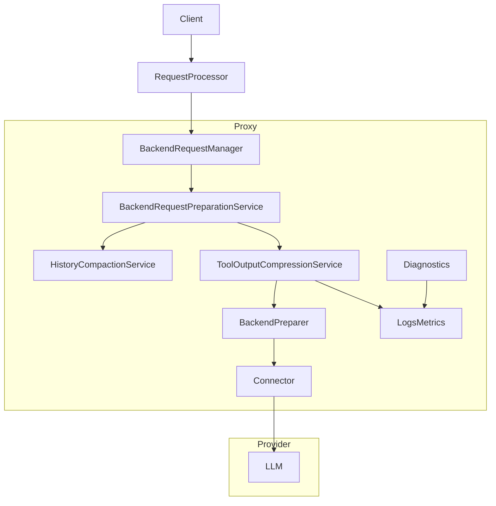
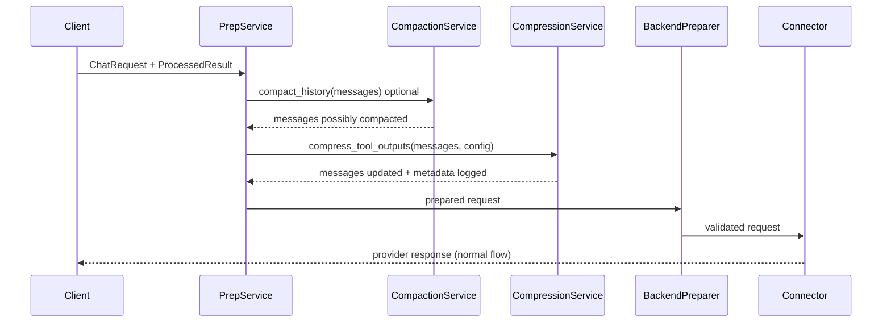
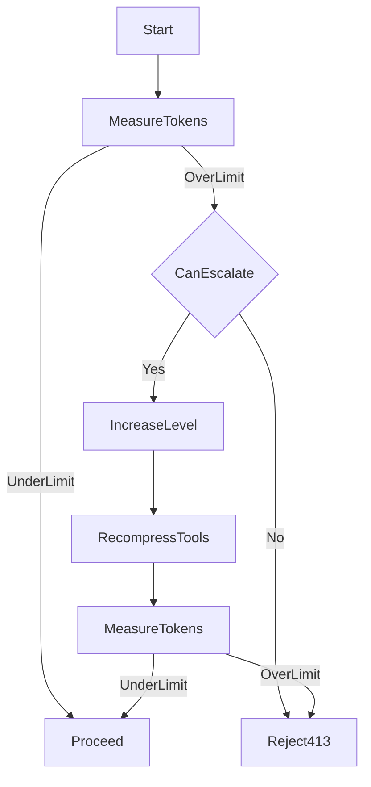
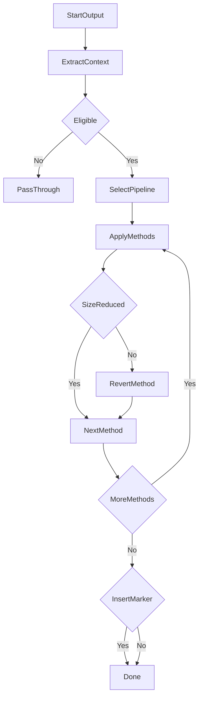

## Overview
This feature introduces a **feature-flagged, strategy-based dynamic tool-output compression subsystem** that reduces prompt tokens while preserving correctness, debuggability, and workflow compatibility. It unifies and generalizes three existing token-reduction mechanisms (history compaction, pytest output compression, and Gemini connector truncation) under a single orchestration model, while keeping legacy behavior as compatibility contracts during migration.

Dynamic compression operates **only on tool outputs** (messages with `role="tool"`) during **backend request preparation**, **before connector translation**, and performs **mandatory bounded escalation** under token pressure before size-based request rejection. All compression behavior is **deterministic**, **stateless across requests**, and **fail-open** by default.

### Goals
- Reduce prompt size by applying RTK-inspired primitives (ANSI normalization, deduplication, grouping, truncation) and tool-aware strategies.
- Provide safe rollout controls: global enable/disable plus per-tool-category and per-method feature flags.
- Ensure deterministic strategy selection, safe marker placement (inline for text, out-of-band for structured payloads), and predictable precedence when multiple controls overlap.
- Integrate token-pressure escalation so the system increases compression aggressiveness within configured bounds before rejecting requests for context-size limits.
- Preserve actionable anchors in compressed outputs (file and line references), plus deterministic line-window/read-detail behavior for navigation workflows.
- Support concise acknowledgements for successful side-effect command outputs to remove low-signal transport noise while preserving key outcomes.
- Support stats-first summaries for high-volume informational command outputs while retaining bounded representative samples for drill-down.
- Apply sensitive-field projection/masking policies for high-risk output categories and provide bounded raw-output recovery handles when truncation occurs.
- Preserve compatibility contracts for legacy history compaction and pytest compression unless explicitly overridden by new settings.
- Provide per-output compression metadata and aggregate metrics via existing observability patterns (structured logs + diagnostics) without new external dependencies.

### Non-Goals
- Compress streaming response chunks in-flight (tool-output compression is request-bound only).
- Port RTK shell hooks / terminal integration patterns into the proxy (API-layer scope).
- Add new client-facing API endpoints for compression control (configuration-driven).
- Change provider API schemas or the CBOR wire-capture binary format/storage layout.

## Requirements Traceability
**Traceability ID convention used in this design**: each acceptance-criteria bullet \(M\) under “Requirement N” in `requirements.md` is referenced as requirement ID \(N.M\) in this document (e.g., Req 1 criteria #3 → `1.3`).

| Requirement | Summary | Components | Interfaces | Flows |
|-------------|---------|------------|------------|-------|
| 1.1-1.6 | Feature-flagged global and granular controls with fail-open on invalid config | CompressionConfigProvider, CompressionPolicyEvaluator, ToolOutputCompressionService | `IToolOutputCompressionService`, `ICompressionConfigProvider` | ConfigResolution, CompressionPipeline |
| 2.1-2.6 | Dynamic selection, deterministic priority, levels, escalation under budget pressure, min-size gating, statelessness | ToolIdentityResolver, StrategyRegistry, BackendPreparer escalation path | `IToolIdentityResolver`, `ICompressionStrategyRegistry`, `IToolOutputCompressionService` | SelectionAndApply, BudgetEscalation |
| 3.1-3.6 | Fail-open, metadata preservation, ordering, marker insertion, size-increase guard, sequential fallback | ToolOutputCompressionService, MarkerRenderer | `ICompressionMarkerRenderer` | CompressionPipeline |
| 4.1-4.8 | RTK-inspired generic primitives as independent strategies, including output pattern matching, empty-result fallback, and diff-aware compression | AnsiNormalizerStrategy, LineDedupeStrategy, GroupingStrategy, FailurePreservingTruncationStrategy, OutputPatternMatchStrategy, DiffCompactStrategy | `ICompressionStrategy` | StrategyPipeline |
| 5.1-5.8 | Broad tool coverage and extensibility using ToolCategory + command identity, including mutating-command acknowledgements, stats-first summaries, and explicit-format passthrough detection | ToolIdentityResolver, RuleBasedStrategySelector, MutatingSuccessAckStrategy, StatsExtractionSummaryStrategy | `IToolIdentityResolver`, `ICompressionRuleEvaluator` | SelectionAndApply |
| 6.1-6.6 | File listing and search-result compression with location anchors and noise directory filtering | DirectoryTreeSummaryStrategy, SearchResultsGroupingStrategy | `ICompressionStrategy` | StrategyPipeline |
| 7.1-7.8 | File read detail levels with fallback, deterministic line windows, and data-format-safe reductions | FileDetailLevelStrategy, LanguageExtractors | `IFileDetailExtractor` | FileDetailFlow |
| 8.1-8.5 | Failure-focused compression for tests/lint/build; pytest compatibility | FailureFocusStrategySet, LegacyPytestAdapterStrategy | `ICompressionStrategy` | StrategyPipeline |
| 9.1-9.7 | JSON/NDJSON/XML/log compression with machine-parseable guarantees and sensitive-field projection policies | JsonStructureStrategy, NdjsonShapeSummaryStrategy, XmlStructureStrategy, LogDedupeStrategy, SensitiveFieldProjectionStrategy | `ICompressionStrategy` | StrategyPipeline |
| 10.1-10.5 | Observability, wire-capture correlation, aggregate metrics, and truncation-recovery handles | CompressionMetricsRecorder, EffectiveConfigReporter, CompressionRecoveryStore | `ICompressionMetricsRecorder`, `ICompressionDiagnosticsReporter`, `ICompressionRecoveryStore` | CompressionPipeline, Diagnostics |
| 11.1-11.5 | Backward compatibility + deterministic precedence; avoid double reduction | LegacyCompatibilityResolver, PrecedenceResolver | `ILegacyCompressionCompatibilityResolver` | MigrationPrecedence, LegacyRemoval |
| 12.1-12.4 | Config surface integrity and deterministic effective config | ConfigIntegrityChecker, EffectiveConfigReporter | `ICompressionConfigProvider`, `ICompressionDiagnosticsReporter` | ConfigResolution |
| 13.1-13.6 | Operator-definable declarative compression rules with composable primitives and built-in rule library | DeclarativeFilterPipeline, DeclarativeRuleRegistry | `IDeclarativeFilterPipeline`, `ICompressionStrategy` | DeclarativeRulePipeline |
| 14.1-14.7 | Legacy code unification: remove duplicate pytest/Gemini/detection code after verified equivalence | LegacyCompatibilityResolver, ToolIdentityResolver | `ILegacyCompressionCompatibilityResolver`, `IToolIdentityResolver` | MigrationPrecedence, LegacyRemoval |

## Architecture

### Existing Architecture Analysis (brownfield)

The codebase contains **six** distinct tool-output processing features that partially overlap with the dynamic compression subsystem. All must be inventoried, interaction-mapped, and either unified under the new architecture or explicitly scoped out with documented interaction boundaries.

#### Feature 1: History compaction (`HistoryCompactionService`)
- **Location**: `src/core/services/history_compaction_service.py` (class `HistoryCompactionService`, method `compact_history` :57, `_perform_compaction` :155)
- **What it does**: Replaces **stale** tool outputs with `[COMPACTED]` stubs by resource identity when estimated tokens exceed a threshold.
- **Pipeline position**: Called from `BackendRequestPreparationService.prepare()` after merging command results into messages, before connector translation.
- **Config**: `compaction.enabled`, `compaction.token_threshold`, `compaction.min_tool_output_tokens_to_compact`, category allow/deny lists, `stub_template` (inert), `redact_resource_identifiers`.
- **Migration plan**: Remains as-is (separate concern: staleness-based stubbing). Dynamic compression runs **after** compaction. Compaction config drift fields (`stub_template`, `max_stubs_per_resource`, `preserve_last_n_results`) must be resolved as part of Requirement 12.
- **Interaction**: Compaction may replace tool content with stubs before dynamic compression sees it. Dynamic compression must detect compaction markers and skip already-compacted outputs.

#### Feature 2: Pytest output compression (`ResponseManagerService`)
- **Location**: `src/core/services/response_manager_service.py` (methods `_apply_pytest_compression_sync` :602, `_filter_pytest_output` :886, `_filter_pytest_output_with_metrics` :938)
- **What it does**: Filters PASSED lines, strips inline timing segments, keeps failure content and summary line. Applied to command results during response formatting.
- **Pipeline position**: Runs in `ResponseManagerService.format_command_result_for_agent()` — **before the result is added to session history**. This means compressed output is what gets stored and sent to backends.
- **Config**: `session.pytest_compression_enabled` (default: on), `pytest_compression_min_lines` / `PYTEST_COMPRESSION_MIN_LINES`.
- **Migration plan**: **Must be unified** into the `pytest_failure_focus` strategy under the new dynamic compression subsystem. The legacy code in `ResponseManagerService` must be removed after migration. See "Legacy Unification Roadmap" below.
- **Critical note — pipeline position shift**: Legacy compression runs before history storage (output is compressed once, stored compressed). The new system runs before backend translation (output stored uncompressed, compressed per-request). This is an intentional improvement: it preserves original content for different backends and allows recompression at different levels under budget pressure. Contract tests must pin current output shape before migration.

#### Feature 3: Pytest detection pipeline (`PytestCompressionService` + `PytestCompressionHandler`)
- **Location**: `src/core/services/pytest_compression_service.py` (`PytestCompressionService` :20, `scan_for_pytest` :127), `src/core/services/tool_call_handlers/pytest_compression_handler.py` (`PytestCompressionHandler` :25)
- **What it does**: Detects pytest commands in shell tool calls via regex. `PytestCompressionHandler` sets `compress_next_tool_call_reply=True` on session state when pytest is detected.
- **Pipeline position**: Runs as a tool call handler during tool call reaction (before command execution).
- **Dead code issue**: The `compress_next_tool_call_reply` session flag is written by `PytestCompressionHandler` but **never read** — the actual compression in `ResponseManagerService` uses its own pytest detection heuristics independently. This flag is dead code.
- **Migration plan**: **Must be removed.** Pytest detection must be unified into `ToolIdentityResolver`. The shell tool name list (`bash`, `exec_command`, etc.) and pytest regex pattern are useful inputs for the new identity resolver. The handler and service classes must be deleted after `ToolIdentityResolver` subsumes their detection logic.

#### Feature 4: Gemini tool-output truncation (`ChatRequestPreparer`)
- **Location**: `src/connectors/gemini_base/chat_request_preparer.py` (`_truncate_tool_outputs_if_configured` :696, `_resolve_tool_output_truncation_limits` :784)
- **What it does**: Truncates `role="tool"` string content by character and line limits before Gemini API translation.
- **Pipeline position**: Runs inside the Gemini connector, **after** backend request preparation but **before** Gemini-specific translation. Already skipped when `compaction.enabled` is true.
- **Config**: Backend extras `tool_output_truncate_chars`, `tool_output_truncate_lines`; env `GEMINI_TOOL_OUTPUT_TRUNCATE_CHARS`, `GEMINI_TOOL_OUTPUT_TRUNCATE_LINES`, `GEMINI_TOOL_OUTPUT_TRUNCATION_LOG_LEVEL`.
- **Migration plan**: **Must be deprecated and removed** after dynamic compression is stable. During migration, connector-level truncation runs only when dynamic compression is disabled for the affected scope (see precedence model). After dynamic compression covers all Gemini-relevant tool outputs, this code path must be removed and the env/extras config fields deprecated with operator warnings.

#### Feature 5: Artifact preview compression (`ArtifactService`)
- **Location**: `src/core/services/artifact_service.py` (`ArtifactService` :71, `normalize_artifact_previews` :79, `_compress_existing_artifact_preview` :153)
- **What it does**: Expands truncated artifact previews in the most recent tool message batch; compresses older expanded previews to shorter summaries (40 lines / 1500 chars vs 120 lines / 6000 chars for expanded).
- **Pipeline position**: Runs during command processing in `CommandHandler`, on `ProcessedResult` — **before** messages reach backend request preparation.
- **Config**: Hard-coded limits (`_ARTIFACT_MAX_LINES=120`, `_COMPRESSED_ARTIFACT_MAX_LINES=40`).
- **Migration plan**: **Out of scope** for this spec — artifact preview management is a separate concern (file content expansion/compression, not tool output token reduction). However, dynamic compression must be aware of artifact-modified content: it must not re-compress already artifact-compressed previews or strip artifact system-reminder markers. The interaction is: artifact normalization runs first (during command processing), then compaction (during backend prep), then dynamic compression (during backend prep, after compaction).

#### Feature 6: Tool call text downgrade (`stringify_tool_calls_and_results`)
- **Location**: `src/core/domain/chat_history_utils.py` (`stringify_tool_calls_and_results` :16, truncation at :172-173)
- **What it does**: Converts `role="tool"` messages to `role="user"` text for backends that cannot carry native tool roles. Applies hard-coded `max_tool_result_chars=2000` truncation and `max_converted_tool_messages=50` limit.
- **Pipeline position**: Called from Gemini connector's `_downgrade_tool_calls_to_text` (when thought signatures are missing) and `QualityVerifierService.build_verification_messages`.
- **Config**: Hard-coded defaults only.
- **Migration plan**: **Out of scope** for this spec — text downgrade is a backend compatibility concern (role conversion), not a compression strategy. However, the hard-coded `max_tool_result_chars=2000` truncation should eventually be replaced by dynamic compression limits. For now, text downgrade runs independently of dynamic compression (it operates on a separate code path for backends requiring role conversion).

#### Token/context-window enforcement
- **Location**: `BackendPreparer` using measured token counts.
- **What it does**: Rejects requests with structured `InvalidRequestError` (413) when context limits are exceeded.
- **Migration plan**: Extended by the budget-pressure escalation path (Req 2.5) — dynamic compression must be attempted before any compression-eligible size-limit rejection.

### Prerequisite Refactoring: ToolCategory extraction
`ToolCategory` and `categorize_tool()` currently reside in `src/core/domain/compaction.py` (compaction domain). The compression subsystem needs these for tool identity resolution but must not depend on compaction internals. During implementation, extract `ToolCategory` and `categorize_tool()` to a shared domain module (e.g., `src/core/domain/tool_identity.py`) and update both compaction and compression imports to reference the shared location. This avoids coupling two independent subsystems and preserves SRP.

### Architecture Pattern & Boundary Map
**Selected pattern**: **Strategy registry + rule-based selector + orchestrator**, with **hybrid incremental migration** (legacy behaviors wrapped as strategies where needed).



**Architecture Integration**:
- **Selected pattern**: Strategy + Orchestrator + Rule-based selection.
- **Domain/feature boundaries**:
  - Strategy implementations are isolated units (independent, stateless).
  - Orchestration is centralized in a single service that does *selection + safe composition* only.
  - Legacy behaviors remain available behind compatibility adapters and precedence rules.
- **Existing patterns preserved**: staged init, DI seams (`src/core/interfaces/`), transport neutrality (no FastAPI types in core services).
- **New components rationale**: required to satisfy per-method flags, deterministic priority, broad tool coverage, and unified metrics.
- **Steering compliance**: SRP (strategies do one thing), explicit interfaces, fail-open safety, deterministic behavior.

## Technology Stack

| Layer | Choice / Version | Role in Feature | Notes |
|-------|------------------|-----------------|-------|
| Runtime | Python 3.10+ / FastAPI (async) | Execution environment | All request-path work must be async-safe (no blocking I/O) |
| DI Container | `src/core/di/container.py` | Strategy + service wiring | Prefer singleton stateless services |
| Config | `src/core/config/app_config.py` + models | Feature flags, rules, levels | Precedence: CLI > ENV > YAML > defaults |
| Token Counting | `src/core/utils/token_count.py` | Strict enforcement and escalation trigger | Use only when needed (validation boundary) |
| Logging | Python logging + structured extras | Per-output metadata and aggregate metrics | No new metrics dependencies |
| Wire Capture | CBOR capture pipeline | Audit what backend received | Must remain post-transform accurate |

## System Flows

### Flow 1: Request-bound tool output compression (pre-translation)


Key flow decisions:
- Compression runs **after** history compaction to preserve compaction compatibility and avoid altering stale-detection behavior.
- Compression only targets `role="tool"` messages and must preserve message ordering.

### Flow 2: Token-pressure escalation before size-based failure


Key flow decisions:
- Escalation is a required pre-rejection step for compression-eligible requests before any size-based 413 outcome.
- Escalation is bounded by a configured maximum level and maximum number of passes.
- If recompression fails, the system fails open for that pass (keeps last known-good output) and proceeds to final enforcement outcome deterministically.

### Flow 3: Per-output deterministic strategy pipeline


Key flow decisions:
- **Eligibility** checks global `enabled`, per-category/method flags, and `min_bytes` (Req `1.1-1.4`, `2.6`).
- **SelectPipeline** is deterministic: stable rule ordering by explicit priority, then config order (Req `2.2`).
- **ApplyMethods** is sequential and fail-open: errors do not abort request processing (Req `3.1`, `3.6`).
- **SizeReduced** enforces “never apply a method that increases serialized size” (Req `3.5`).
- **InsertMarker** is content-type aware: inline markers for text only; structured outputs use out-of-band marker metadata to preserve parseability (Req `9.5`, `9.6`).

## Components and Interfaces

**DI Registration Strategy**:
- Orchestrator + registry + strategy implementations are registered as **Singleton**.
- Configuration is read per request (snapshot), so changes apply to subsequent requests deterministically.
- No strategy may require FastAPI/Starlette imports; transport mapping remains separate.

### Component Summary
| Component | Layer | Intent | Req Coverage | DI Lifetime | Contracts |
|-----------|-------|--------|--------------|-------------|-----------|
| ToolOutputCompressionService | `src/core/services/` | Orchestrate selection + apply strategies with fail-open semantics | 1.1-12.4 | Singleton | `IToolOutputCompressionService` |
| CompressionStrategyRegistry | `src/core/services/` | Hold registered strategies and priorities | 2.2, 5.5 | Singleton | `ICompressionStrategyRegistry` |
| ToolIdentityResolver | `src/core/services/` | Derive tool category + command identity from tool call + args | 2.1, 5.1-5.4, 5.7 | Singleton | `IToolIdentityResolver` |
| RuleBasedStrategySelector | `src/core/services/` | Select method pipeline via config rules | 2.1-2.4, 5.2-5.4, 5.7 | Singleton | `ICompressionRuleEvaluator` |
| MarkerRenderer | `src/core/services/` | Emit deterministic compression marker payloads for safe inline or out-of-band placement | 3.4, 7.2, 9.6 | Singleton | `ICompressionMarkerRenderer` |
| CompressionMetricsRecorder | `src/core/services/` | Record per-output metadata + aggregate counters | 10.1-10.5 | Singleton | `ICompressionMetricsRecorder` |
| CompressionRecoveryStore | `src/core/services/` | Persist bounded raw artifacts and emit redaction-safe recovery handles when truncation occurs | 10.5, NFR4 | Singleton | `ICompressionRecoveryStore` |
| LegacyCompatibilityResolver | `src/core/services/` | Resolve precedence between legacy and new controls and prevent double reduction | 11.1-11.5 | Singleton | `ILegacyCompressionCompatibilityResolver` |
| FileDetailExtractorSet | `src/core/services/` | Extract structure/signatures by file type with fallback and deterministic line-window behavior | 7.1-7.8 | Singleton | `IFileDetailExtractor` |
| StructuredPayloadGuard | `src/core/services/` | Enforce machine-parseable output invariants for configured structured formats | 9.5-9.7, 3.1 | Singleton | `IStructuredPayloadGuard` |
| DeclarativeFilterPipeline | `src/core/services/` | Load, validate, and execute operator-defined declarative compression rules using an 8-stage text-processing pipeline | 13.1-13.6 | Singleton | `IDeclarativeFilterPipeline` |
| DeclarativeRuleRegistry | `src/core/services/` | Hold built-in and operator-defined declarative rules, validate at startup, and provide ordered lookup by tool output predicates | 13.3-13.5 | Singleton | `IDeclarativeRuleRegistry` |

### Services Layer (`src/core/services/`)

#### ToolOutputCompressionService
| Field | Detail |
|-------|--------|
| Intent | Apply a deterministic compression pipeline to eligible tool outputs with fail-open safety |
| Requirements | 1.1-1.6, 2.1-2.6, 3.1-3.6, 9.5-9.7, 10.1-10.5, 11.1-11.5, 12.1-12.4 |
| Interface | `IToolOutputCompressionService` in `src/core/interfaces/` |
| DI Lifetime | Singleton |

**Responsibilities & Constraints**
- Only compress `role="tool"` messages and preserve message order.
- Preserve all non-content tool-message metadata (for example: tool call ID, tool name, success/failure status, and correlation metadata) unchanged; compression may only mutate the message content field (plus optional inline marker inside that content).
- Select methods based on tool identity + content metadata using deterministic priority.
- Apply methods sequentially; on failure, return last successful output or original.
- Skip any method whose output increases serialized size.
- Enforce per-output time budget and min-size eligibility thresholds.
- Preserve navigability anchors for read/search style outputs (path and line references when present).
- Allow summary strategies for mutating and informational commands to emit concise acknowledgements/stats with key outcomes.
- Preserve machine-parseable validity for structured outputs (JSON/NDJSON/XML and operator-defined structured formats) or fail open to original output.
- Emit markers inline only for plain-text outputs; for structured outputs, emit out-of-band markers/metadata only.

**Dependencies (via DI)**
- Inbound: called from `BackendRequestPreparationService` and `BackendPreparer` bounded escalation path for compression-eligible size-limit checks.
- Outbound: `ICompressionConfigProvider`, `ICompressionStrategyRegistry`, `IToolIdentityResolver`, `ICompressionRuleEvaluator`, `ICompressionMarkerRenderer`, `IStructuredPayloadGuard`, `ICompressionMetricsRecorder`, `ILegacyCompressionCompatibilityResolver`.

##### Service Interface
```python
from abc import ABC, abstractmethod
from src.core.domain.chat import ChatMessage
from src.core.domain.request_context import RequestContext

class ToolOutputCompressionResult: ...

class IToolOutputCompressionService(ABC):
    @abstractmethod
    async def compress_tool_outputs(
        self,
        *,
        context: RequestContext | None,
        messages: list[ChatMessage],
        reason: str,
        level_override: CompressionLevel | None = None,
    ) -> ToolOutputCompressionResult:
        """Return a new message list with compressed tool outputs (fail-open).

        When level_override is provided (e.g. during budget-pressure escalation),
        it takes precedence over the configured default level for this invocation.
        """
        ...
```

##### DI Registration (request processing stage)
```python
def _factory(provider):
    registry = provider.get_required_service(ICompressionStrategyRegistry)
    resolver = provider.get_required_service(IToolIdentityResolver)
    evaluator = provider.get_required_service(ICompressionRuleEvaluator)
    marker = provider.get_required_service(ICompressionMarkerRenderer)
    metrics = provider.get_required_service(ICompressionMetricsRecorder)
    compat = provider.get_required_service(ILegacyCompressionCompatibilityResolver)
    config = provider.get_required_service(ICompressionConfigProvider)
    return ToolOutputCompressionService(
        registry=registry,
        identity_resolver=resolver,
        rule_evaluator=evaluator,
        marker_renderer=marker,
        metrics_recorder=metrics,
        compat_resolver=compat,
        config_provider=config,
    )
```

#### ICompressionStrategy (strategy contract)
| Field | Detail |
|-------|--------|
| Intent | Transform a single tool output deterministically using one primitive or tool-specific rule |
| Requirements | 2.2-2.4, 3.1-3.6, 4.1-4.5, 5.1-5.7, 6.1-6.5, 7.1-7.8, 8.1-8.5, 9.1-9.7 |
| Interface | `ICompressionStrategy` in `src/core/interfaces/` |
| DI Lifetime | Singleton |

##### Strategy Interface (contract only)
```python
from abc import ABC, abstractmethod

class ICompressionStrategy(ABC):
    @property
    @abstractmethod
    def name(self) -> str: ...

    @property
    @abstractmethod
    def priority(self) -> int: ...

    @abstractmethod
    def matches(self, ctx: ToolOutputContext) -> bool:
        """Pure predicate: determines applicability without side effects."""
        ...

    @abstractmethod
    def compress(self, *, ctx: ToolOutputContext, level: CompressionLevel) -> CompressionOutcome:
        """Pure transform: deterministic, fail-fast; orchestrator handles fail-open."""
        ...
```

#### ToolIdentityResolver
| Field | Detail |
|-------|--------|
| Intent | Determine tool category and command identity for selection |
| Requirements | 2.1, 5.1-5.4, 5.7 |
| Interface | `IToolIdentityResolver` in `src/core/interfaces/` |
| DI Lifetime | Singleton |

**Identity model (high level)**
- **Tool name**: function name from tool call (e.g., `bash`, `read_file`).
- **Tool category**: computed using existing `ToolCategory` / `categorize_tool()` infrastructure, extended with additional categories needed for compression.
- **Command identity** (when applicable): stable parsing of shell command string from tool arguments:
  - `command_signature`: first token/executable (e.g., `git`, `kubectl`, `aws`)
  - `command_prefix`: signature + first subcommand when present (e.g., `git status`, `gh pr`, `docker ps`)
- **Explicit format flags** (when applicable): detect arguments that indicate user-requested output format (e.g., `--json`, `--format`, `--stat`, `--numstat`, `--output-format`) to inform passthrough or format-aware compression decisions (Req `5.8`).

##### Resolver Interface (contract only)
```python
from abc import ABC, abstractmethod

class ToolIdentity: ...
class ToolOutputContext: ...

class IToolIdentityResolver(ABC):
    @abstractmethod
    def resolve(self, ctx: ToolOutputContext) -> ToolIdentity:
        """Pure resolution: deterministic; no cross-request state."""
        ...
```

#### CompressionStrategyRegistry
| Field | Detail |
|-------|--------|
| Intent | Provide a deterministic ordered set of strategies for selection and composition |
| Requirements | 2.2, 5.5 |
| Interface | `ICompressionStrategyRegistry` in `src/core/interfaces/` |
| DI Lifetime | Singleton |

**Registry invariants**
- Strategies are ordered by `(priority, name)` for determinism.
- Strategy names are globally unique; duplicates are rejected at startup with warning and fail-open behavior for dynamic compression initialization.

#### LegacyCompatibilityResolver
| Field | Detail |
|-------|--------|
| Intent | Prevent double reduction and resolve precedence between legacy and new controls |
| Requirements | 11.1-11.5 |
| Interface | `ILegacyCompressionCompatibilityResolver` in `src/core/interfaces/` |
| DI Lifetime | Singleton |

**Compatibility responsibilities**
- Detect “already reduced” outputs (legacy pytest compression markers, connector truncation markers, dynamic compression markers) and prevent re-application unless explicitly configured.
- Produce a deterministic “effective behavior” decision record for diagnostics (`11.5`, `12.2`).

### Configuration Model (`src/core/config/`)
Dynamic compression introduces a new top-level config block.

**Proposed YAML shape (conceptual)**:
```yaml
dynamic_compression:
  enabled: false
  level: "conservative"              # conservative | balanced | aggressive
  max_level: "aggressive"            # escalation ceiling
  min_bytes: 1024                    # eligibility threshold
  time_budget_ms_per_output: 100
  structured_formats: ["json", "ndjson", "xml"]  # extensible set of machine-parseable formats
  recovery:
    enabled: true
    mode: "failures"                 # failures | always | never
    max_artifacts: 20
    max_artifact_bytes: 1048576
    retention_hours: 24
  sensitive_projection:
    enabled: true
    categories: ["cloud", "environment"]
    secret_retrieval_command_allowlist:
      - "aws secretsmanager get-secret-value"
  marker:
    enabled: true
    style: "prefix"                  # prefix | suffix | none (text outputs only)
    include_sizes: true
    include_methods: true
    structured_payload_mode: "out_of_band_only"  # out_of_band_only is required default
  categories:
    git: { enabled: true }
    listing: { enabled: true }
    search: { enabled: true }
    test: { enabled: true }
    lint: { enabled: true }
    build: { enabled: true }
    container: { enabled: true }
    cloud: { enabled: true }
    github_cli: { enabled: true }
    package_manager: { enabled: true }
    http_json: { enabled: true }
  methods:
    ansi_normalize: { enabled: true }
    line_dedupe: { enabled: true }
    group_paths: { enabled: true }
    truncate_failure_preserving: { enabled: true }
    json_structure_only: { enabled: true }
    ndjson_shape_summary: { enabled: true }
    file_detail_levels: { enabled: true }
    stats_extraction_summary: { enabled: true }
    mutating_success_ack: { enabled: true }
    sensitive_field_projection: { enabled: true }
    pytest_failure_focus: { enabled: "inherit_legacy" }
  noise_directories: ["node_modules", ".git", "target", "__pycache__", ".venv", "vendor"]
  diff:
    max_lines_per_hunk: 100
    max_total_lines: 500
  json:
    max_depth: 4
    max_keys_per_object: 20
    max_array_elements: 5
    max_string_length: 80
  rules:
    # Deterministic priority order; first match wins.
    - name: "git_status"
      priority: 10
      when: { command_prefix: "git status" }
      pipeline: ["stats_extraction_summary"]
    - name: "default_shell"
      priority: 1000
      when: { tool_category: "command_execution" }
      pipeline: ["ansi_normalize", "line_dedupe", "truncate_failure_preserving"]
  declarative_rules:
    # Operator-defined text-processing filter pipelines matched by command.
    # Each rule supports an 8-stage pipeline (modeled after RTK TOML filters):
    #   1. strip_ansi          - remove ANSI/control sequences
    #   2. replace             - regex-based line replacements
    #   3. match_output        - full-output pattern match with replacement message
    #                            (optional `unless` guard to skip when errors present)
    #   4. strip_lines / keep_lines - line-pattern-based exclusion or inclusion
    #   5. truncate_lines_at   - per-line character cap
    #   6. head_lines / tail_lines - keep first/last N lines
    #   7. max_lines           - hard line cap
    #   8. on_empty            - fallback message when result is empty
    - name: "gradle_build"
      match_command: "gradle|gradlew"
      strip_ansi: true
      strip_lines: ["^Daemon", "^Configuring", "^Resolving", "^Download", "^> Task.*UP-TO-DATE", "^> Task.*NO-SOURCE"]
      match_output: { pattern: "BUILD SUCCESSFUL", message: "gradle: ok", unless: "FAILED|error:" }
      max_lines: 60
      on_empty: "gradle: ok"
    # Built-in declarative rules ship as defaults for 50+ common tools.
    # Operators can override or extend with additional entries.
```

**Config integrity behaviors**
- Unknown method names, category names, or rule pipeline entries are treated as invalid configuration for that effective config snapshot: the proxy bypasses dynamic compression (fail-open) and emits an operator-visible warning describing the unknown value(s) (`1.5`, `12.1`).
- Effective config (post-precedence) is exposed via diagnostics in a redaction-safe form (`12.2`).

### Rule evaluation and priority semantics
- **Rule ordering**: sort by ascending `priority` (lower number first). For ties, preserve declaration order from configuration to keep evaluation deterministic.
- **Match model**: a rule matches if all `when` predicates match the tool output context. Predicates are restricted to observable, deterministic fields (tool name, ToolCategory, command signature/prefix, content-type heuristics, size/line counts).
- **Selection semantics**: exactly one rule is selected per output: the first match after deterministic ordering (by `priority`, then declaration order). Composition across multiple rules is out of scope for the initial implementation; compose by placing multiple methods in a single rule pipeline.
- **Pipeline execution**: methods in `pipeline` are applied sequentially in the declared order, subject to per-method enablement and size-increase guards.
- **No hidden fallthrough**: if a matching rule’s pipeline is empty after filtering disabled methods, the system passes through unchanged and emits a debug log (config surface integrity).

### Marker policy (transparency with structured-format integrity)
Markers use deterministic formatting and are split by payload type:

- **Plain text outputs (`text`)**:
  - marker may be injected into content when enabled.
  - marker insertion is idempotent: if content already contains a dynamic compression marker (for example: due to budget-pressure escalation passes), the marker renderer replaces it rather than appending additional markers.
  - **Prefix marker (default)**: `[COMPRESSED level=balanced methods=ansi_normalize,line_dedupe saved=1234B]`
  - **Reduced marker** (when `include_sizes=false`): `[COMPRESSED methods=ansi_normalize,line_dedupe]`

- **Machine-parseable structured outputs (`json`, `ndjson`, `xml`, configured structured types)**:
  - inline marker injection into payload body is forbidden.
  - markers and compression metadata are emitted out-of-band via diagnostics/internal metadata only.
  - if a candidate transform or marker policy cannot preserve machine parseability, the system must fail open to the original payload.

### Legacy precedence and double-reduction prevention
The effective ordering of reductions is deterministic:
1. **History compaction** (`compaction.*`) runs first (stale-output stubbing only).
2. **Dynamic compression** runs second (single-output reductions on remaining `role="tool"` messages).
3. **Connector-level truncation** (Gemini `extra.tool_output_truncate_*`) runs only when dynamic compression is disabled for that request scope, or when explicitly configured as a final safety fallback.

For pytest:
- The legacy `session.pytest_compression_enabled` behavior remains functional.
- The dynamic compression pipeline treats pytest compression as a **compatibility strategy** (`pytest_failure_focus`) that can run in “inherit legacy” mode to avoid divergence until explicitly overridden.

**Pytest compatibility matrix (migration contract)**

| Legacy behavior surface | Legacy control | Dynamic equivalent | Effective precedence | Migration rule |
|-------------------------|----------------|--------------------|----------------------|----------------|
| Response filtering enable/disable | `session.pytest_compression_enabled` | `dynamic_compression.methods.pytest_failure_focus.enabled` | Legacy wins when dynamic is `inherit_legacy`; explicit dynamic override wins only when not `inherit_legacy` | Preserve current behavior by default (`11.1`, `8.5`) |
| Threshold for applying compression | `PYTEST_COMPRESSION_MIN_LINES` and session state | method-level thresholds/rules | Existing env/session semantics win in compatibility mode | Do not regress existing activation thresholds during rollout (`11.1`, `11.2`) |
| Tool-command detection path | shell tool names + pytest detection in existing services | `ToolIdentityResolver` + rule predicates | Legacy detection path remains authoritative in compatibility mode | Dynamic rules may extend, not weaken, existing detection (`11.1`, `11.5`) |
| Output shape preservation in pytest failures | current ResponseManager filtering semantics | `pytest_failure_focus` strategy | Legacy output semantics preserved unless explicit override | Contract tests pin legacy behavior before override (`8.5`, `11.1`) |

### Migration: compaction configuration drift
The dynamic compression migration includes resolving compaction drift fields that are documented but currently inert:
- `stub_template`: must either be wired to stub rendering or treated as deprecated with an operator-visible warning when set.
- `max_stubs_per_resource` / `preserve_last_n_results`: must either be implemented deterministically in compaction semantics or explicitly deprecated with warnings.

### Legacy Unification Roadmap

The goal is to eliminate concurrent implementations of similar functionality. After the new dynamic compression subsystem is verified stable, the following legacy features must be systematically removed and their responsibilities unified under the new architecture. **No legacy compression code may remain as a parallel path once the corresponding dynamic compression strategy is verified equivalent.**

#### Phase 1: Compatibility mode (initial rollout)
During initial rollout, legacy features run in compatibility mode alongside the new system:
- Legacy pytest compression in `ResponseManagerService` remains active when `dynamic_compression.methods.pytest_failure_focus.enabled = "inherit_legacy"`.
- Gemini connector truncation runs when dynamic compression is disabled for the affected scope.
- `PytestCompressionService` and `PytestCompressionHandler` continue to run (but their detection results may be duplicated by `ToolIdentityResolver`).

#### Phase 2: Verification and contract testing
Before removing any legacy code, contract tests must prove behavioral equivalence:
- Pin current pytest compression output for representative inputs using snapshot/golden-file tests.
- Pin current Gemini truncation behavior for representative inputs.
- Verify `ToolIdentityResolver` detects all commands currently detected by `PytestCompressionService.scan_for_pytest` (shell tool name list + pytest regex).

#### Phase 3: Legacy code removal (after verification)

| Legacy Feature | Files to Remove/Modify | Replacement | Blocking Condition |
|----------------|------------------------|-------------|-------------------|
| Pytest output filtering | Remove `_apply_pytest_compression_sync`, `_filter_pytest_output`, `_filter_pytest_output_with_metrics` from `response_manager_service.py` | `pytest_failure_focus` strategy in dynamic compression | Contract tests pass; `pytest_failure_focus` produces equivalent output |
| Pytest detection service | Delete `src/core/services/pytest_compression_service.py` | `ToolIdentityResolver` with pytest command identity | `ToolIdentityResolver` detects all pytest invocations that legacy detection finds |
| Pytest compression handler | Delete `src/core/services/tool_call_handlers/pytest_compression_handler.py` | Not needed (dynamic compression does not require pre-detection state) | Pytest detection unified into `ToolIdentityResolver` |
| `compress_next_tool_call_reply` session flag | Remove from session state model | Not needed (dead code; never read) | Immediate removal (no behavioral dependency) |
| Pytest DI registration | Remove `_register_pytest_compression_service` from `src/core/di/registrations/tooling.py` and handler registration from `post_build_actions.py` | Dynamic compression DI registration | All pytest compression goes through dynamic compression |
| Pytest config/CLI/env | Deprecate `session.pytest_compression_enabled`, `pytest_compression_min_lines`, `PYTEST_COMPRESSION_MIN_LINES`, `--enable-pytest-compression`/`--disable-pytest-compression` | `dynamic_compression.methods.pytest_failure_focus.*` | Emit deprecation warnings when legacy fields are set; remove after one release cycle |
| Gemini tool truncation | Remove `_truncate_tool_outputs_if_configured`, `_resolve_tool_output_truncation_limits`, `_truncate_text_content` from `chat_request_preparer.py` | Dynamic compression covers all Gemini-bound tool outputs | Contract tests pass; dynamic compression verified for Gemini requests |
| Gemini truncation config | Deprecate `GEMINI_TOOL_OUTPUT_TRUNCATE_CHARS`, `GEMINI_TOOL_OUTPUT_TRUNCATE_LINES`, backend extras `tool_output_truncate_*` | `dynamic_compression` config | Emit deprecation warnings; remove after one release cycle |

#### Pipeline ordering (post-unification)
After legacy removal, the deterministic tool-output processing pipeline is:
1. **Artifact normalization** (`ArtifactService.normalize_artifact_previews`) — during command processing, expand/compress artifact previews. Runs before messages reach backend prep.
2. **History compaction** (`HistoryCompactionService.compact_history`) — during backend prep, replace stale tool outputs with stubs. Separate concern, remains.
3. **Dynamic compression** (`ToolOutputCompressionService.compress_tool_outputs`) — during backend prep, after compaction. Skips compacted and artifact-marker outputs.
4. **Token enforcement** (`BackendPreparer`) — after compression, with budget-pressure escalation before 413 rejection.
5. **Connector translation** — backend-specific message format conversion (no further content modification).

#### Interaction boundaries (features out of scope for unification)
- **`ArtifactService`**: Separate concern (file content preview management). Dynamic compression must detect artifact system-reminder markers and avoid re-compressing artifact previews.
- **`stringify_tool_calls_and_results`**: Separate concern (role downgrade for non-tool-supporting backends). Hard-coded `max_tool_result_chars=2000` should be refactored to use dynamic compression limits in a future iteration, but is out of scope for this spec.
- **`QualityVerifierService._sanitize_history_for_quality_verifier`**: Separate concern (verifier model input sanitization). Not part of the main request pipeline.

## Data Models
The compression subsystem introduces typed, internal domain models for context, outcomes, and metrics.

### Domain Models (`src/core/domain/`)
- `ToolOutputContext`: derived identity and observable metadata (tool name, tool category, command signature/subcommand, content type hints, sizes, line counts, line-number presence, and structured-format parseability flags for JSON/NDJSON/XML and configured structured types).
- `CompressionOutcome`: output text + applied flag + method metadata + size delta + elapsed time.
- `ToolOutputCompressionResult`: transformed message list + aggregate savings + per-output records.

### Configuration Models (`src/core/config/models/`)
- `DynamicCompressionConfig`
  - `enabled`, `level`, `max_level`, thresholds, `structured_formats`, marker policy (including `structured_payload_mode`), method toggles, category toggles, rule list.
- `CompressionMarkerConfig`
- `CompressionRule`

### Per-output Metadata (internal + diagnostics)
Per tool output, record:
- original size (bytes and approximate tokens)
- compressed size (bytes and approximate tokens)
- methods attempted/applied and elapsed time per method
- marker policy outcome (inserted or suppressed)
- fail-open details (error strings, step that failed)
- sensitive-field projection outcome (applied policy + redacted field count)
- optional truncation recovery handle when raw artifacts are retained
- optional content hashes (SHA-256) of original and final content when enabled, to support correlation without retaining raw content

### Compression domain contracts (type-safe boundaries)
The following models are contracts (shape and invariants), not implementation detail.

```python
from enum import Enum
from pydantic import BaseModel, Field

class CompressionLevel(str, Enum):
    conservative = "conservative"
    balanced = "balanced"
    aggressive = "aggressive"

class ToolOutputContentType(str, Enum):
    text = "text"
    json = "json"
    ndjson = "ndjson"
    xml = "xml"

class ToolIdentity(BaseModel):
    tool_name: str
    tool_category: str
    command_signature: str | None = None
    command_prefix: str | None = None
    explicit_format_flags: list[str] = Field(default_factory=list)

class ToolOutputContext(BaseModel):
    identity: ToolIdentity
    content: str
    content_type: ToolOutputContentType = ToolOutputContentType.text
    byte_size: int = Field(ge=0)
    line_count: int = Field(ge=0)
    has_line_numbers: bool = False
    has_ansi: bool = False
    has_diff_markers: bool = False
    has_explicit_format: bool = False
    structured_format: str | None = None
    is_machine_parseable: bool = False

class CompressionOutcome(BaseModel):
    content: str
    applied: bool
    method_name: str
    original_bytes: int = Field(ge=0)
    result_bytes: int = Field(ge=0)
    elapsed_ms: float = Field(ge=0)
    error: str | None = None

class CompressionMethodRecord(BaseModel):
    name: str
    applied: bool
    elapsed_ms: float = Field(ge=0)
    original_bytes: int = Field(ge=0)
    result_bytes: int = Field(ge=0)
    error: str | None = None

class ToolOutputCompressionRecord(BaseModel):
    tool_call_id: str | None = None
    identity: ToolIdentity
    original_bytes: int
    compressed_bytes: int
    methods: list[CompressionMethodRecord]
    marker_inserted: bool
    sensitive_projection_applied: bool = False
    redacted_field_count: int = 0
    recovery_handle: str | None = None
    failed_open: bool
```

## Compression Strategy Catalog (initial set)
This catalog defines the **minimum initial strategy surface** required to satisfy coverage requirements. Each strategy is independently testable and can be enabled/disabled via feature flags. The **RTK Ref** column points to the proven Rust implementation that agents MUST consult before coding the Python counterpart.

| Strategy Name | Primary Use | Output Shape | RTK Ref (file:line) | Notes |
|--------------|-------------|--------------|---------------------|-------|
| `ansi_normalize` | Remove terminal control sequences | Plain text | `core/utils.rs:48` (`strip_ansi`) | Required for noisy CLIs and progress spinners (`4.1`) |
| `line_dedupe` | Deduplicate identical lines/blocks | Plain text with counts | `cmds/system/log_cmd.rs:67` (`analyze_logs`) | Emits `(xN)` counts (`4.2`) |
| `group_paths` | Group path-like items by prefix | Grouped blocks | `cmds/system/grep_cmd.rs:12` (group-by-file), `cmds/system/find_cmd.rs:193` | Deterministic key extraction (`4.3`) |
| `truncate_failure_preserving` | Truncate while preserving error sections | Header + errors + tail | `core/filter.rs:323` (`smart_truncate`), `core/utils.rs:233` (`fallback_tail`) | Keeps error blocks and a representative sample (`4.4`) |
| `directory_tree_summary` | Compress large listings | Tree summary | `cmds/system/ls.rs:108` (`compact_ls`), `cmds/system/tree.rs:65`, `cmds/system/constants.rs:1` (`NOISE_DIRS`) | Preserves directory structure (`6.1`) |
| `search_results_grouping` | Compress grep-like output | Group by file | `cmds/system/grep_cmd.rs:12`, `cmds/system/grep_cmd.rs:155` (`clean_line`) | Preserves limited context lines (`6.2-6.3`) |
| `file_detail_levels` | Full/structure/signatures + line windows | Explicit omission markers | `core/filter.rs:8` (`FilterLevel`), `core/filter.rs:156` (`MinimalFilter`), `core/filter.rs:233` (`AggressiveFilter`), `cmds/system/read.rs:9` | Language-aware where possible (`7.1-7.8`) |
| `stats_extraction_summary` | Aggregate informational command output | Stats header + bounded sample | `cmds/git/git.rs:594` (`format_status_output`), `cmds/git/git.rs:517` (`filter_log_output`) | Preserves counts/deltas/status buckets (`5.7`) |
| `mutating_success_ack` | Condense successful side-effect commands | Short status line | `cmds/git/git.rs:296` (`compact_diff` success path), `core/utils.rs:192` (`exit_code_from_output`) | Preserves commit/branch/count outcomes (`5.6`) |
| `pytest_failure_focus` | Failure-only pytest output | Failures + summary | `cmds/python/pytest_cmd.rs:52` (`filter_pytest_output`) | Wrap legacy behavior by default (`8.5`) |
| `diagnostics_grouping` | Lint/typecheck output grouping | Group by file and rule | `cmds/python/mypy_cmd.rs:43`, `cmds/python/ruff_cmd.rs:97`, `cmds/js/lint_cmd.rs:88`, `cmds/js/tsc_cmd.rs:40`, `cmds/ruby/rubocop_cmd.rs:53`, `cmds/go/golangci_cmd.rs:83` | Applies to ruff/mypy/tsc-like outputs (`8.2`) |
| `json_structure_only` | JSON structure-only representation | Structured summary | `cmds/system/json_cmd.rs:91` (`filter_json_compact`), `cmds/system/json_cmd.rs:181` (`filter_json_string`) | Uses configured fail-open fallback on parse errors (`9.1`, `9.4`) |
| `ndjson_shape_summary` | NDJSON shape aggregation | Counts by shape | `cmds/system/json_cmd.rs:91` (JSON array handling) | Uses configured fail-open fallback on parse errors (`9.2`, `9.4`) |
| `xml_structure_preserving` | XML compression while preserving parseability | XML with preserved well-formedness | (no direct RTK equivalent; use JSON strategy patterns as structural reference) | Fail-open if transformation would break XML validity (`9.5`, `9.6`) |
| `log_dedupe` | Noisy logs | Dedup with normalized keys + counts | `cmds/system/log_cmd.rs:67` (`analyze_logs` - timestamp/UUID normalization and dedup) | Preserves representative error lines (`9.3`) |
| `sensitive_field_projection` | Mask/remove high-risk fields in sensitive categories | Redaction-safe summary | `cmds/system/env_cmd.rs:148` (`mask_value`), `cmds/system/env_cmd.rs:9` | Default-on for env/cloud style payloads (`9.7`) |
| `output_pattern_match` | Replace full output matching a configured pattern with a short message | Short replacement message | `core/toml_filter.rs:429` (`apply_filter` - match_output + unless stage) | Supports exclusion guard patterns (`4.6`, `4.7`) |
| `diff_compact` | Compress unified diff/patch output preserving structure | Per-file stats + bounded hunks | `cmds/git/git.rs:296` (`compact_diff`) | Retains file headers, `@@` markers, bounded lines (`4.8`) |
| `declarative_rule_filter` | Apply operator-defined YAML/config-based filter pipeline | Varies by rule definition | `core/toml_filter.rs:134` (`CompiledFilter`), `core/toml_filter.rs:175` (`TomlFilterRegistry`), `core/toml_filter.rs:429` (`apply_filter`), `filters/*.toml` | 8-stage pipeline (`13.1-13.6`) |

All RTK file paths above are relative to `dev/thrdparty/rtk/src/`.

**Coverage mapping (Req 5.1, 5.7, 5.8)**
- **git outputs**: strategy selection by `command_signature=git` with specialized pipelines per `command_prefix`:
  - `git status`: porcelain parsing with file counts, status buckets, configurable max file/untracked limits.
  - `git diff`/`git show`: `diff_compact` strategy (per-file `+N -M` stats, hunk headers, bounded changed lines per hunk, global line cap); passthrough when `--stat`/`--numstat`/`--shortstat` detected.
  - `git log`: stats-first summaries with bounded body lines per entry, line length caps, and configurable entry limits.
  - `git branch`: deduplicated remote listing with configurable max entries.
  - Mutating commands (`git add/commit/push/pull/fetch/stash`): concise success acknowledgements preserving key outcome identifiers.
- **diff/patch outputs**: `diff_compact` strategy applicable to unified diffs from any source (git, diff command, `gh pr diff`), with per-file change statistics, hunk-level truncation (configurable lines/hunk default 100, max total lines default 500), and passthrough detection for explicit format flags.
- **file listings**: `directory_tree_summary` for `ToolCategory.LIST_DIRECTORY` and `command_signature` in `ls|dir|tree`; noise directory filtering (`node_modules`, `.git`, `target`, `__pycache__`, `.venv`, `vendor`, configurable); extension summary for large listings.
- **file reads**: `file_detail_levels` for `ToolCategory.FILE_READ|VIEW_FILE`, including optional line numbers and deterministic line-window reduction.
- **search results**: `search_results_grouping` for `ToolCategory.SEARCH` and `command_signature` in `rg|grep|find`, preserving `file:line` anchors where present; per-file match limits; compact long paths; context line bounds.
- **test outputs**: `pytest_failure_focus` for pytest; generic failure-preserving strategies for vitest, go test (NDJSON stream parsing), cargo test/nextest, rspec/minitest, playwright, .NET test/TRX output.
- **linter/typechecker outputs**: `diagnostics_grouping` for ruff, mypy, eslint, tsc, rubocop, golangci-lint (v1/v2 JSON), clippy, basedpyright; group by file and rule/code with top-code summaries; fallback to dedupe/truncation.
- **formatter outputs**: success/change detection for black, prettier, biome, ruff format, dotnet format; emit compact confirmation with changed file counts and bounded file list.
- **build outputs**: failure-preserving truncation + ANSI normalization + dedupe for cargo build/check, make, gradle, maven, dotnet build, gcc, swift build; declarative rules for additional build tools.
- **container/kubernetes outputs**: ANSI normalization + dedupe + truncation; optional grouping by resource name; docker ps/images formatting with row limits.
- **cloud CLI outputs**: JSON structure extraction when applicable + truncation for text + sensitive-field projection by command profile; specialized handling for AWS subcommands, gcloud, terraform plan output.
- **infrastructure CLI outputs**: declarative rules for terraform, helm, ansible-playbook, systemctl, ssh, rsync; failure-focused with success short-circuits.
- **environment-variable dumps**: sensitive-field masking/projection with configurable exceptions.
- **GitHub CLI outputs**: JSON injection-aware handling for `gh pr list/view/checks/status/diff`, `gh issue list/view`, `gh run list/view`; markdown body filtering (strip HTML comments, badge lines, image-only lines); passthrough for `--json` flag.
- **package manager outputs**: ANSI normalization + progress filtering + stats-first reductions for pip, npm, pnpm, brew, bundle, composer, poetry, uv; list/install summaries + truncation fallback; declarative rules for additional package managers.
- **database CLI outputs**: row/record limits for psql-style tabular output; border stripping; compact expanded-format records.
- **HTTP/JSON dumps**: JSON structure-only + redaction-aware truncation fallback; curl/wget response compression with success confirmation for downloads.
- **XML payloads**: XML-aware compression that preserves well-formed structure; fallback to original payload when safety checks fail.
- **Declarative rule coverage**: Built-in declarative rules provide compression for 50+ additional tools (Gradle, Make, Maven, Terraform, Helm, Ansible, systemctl, rsync, ping, shellcheck, yamllint, markdownlint, and others) modeled after RTK's TOML filter library.

## Declarative Filter Pipeline (Req 13)

The declarative filter pipeline provides an operator-extensible, configuration-only mechanism for adding compression rules. This design is modeled after RTK's TOML filter system, which covers 58+ development tools using an 8-stage text-processing pipeline.

### Pipeline stages (applied in order)
1. **`strip_ansi`** - Remove ANSI/terminal control sequences from the output.
2. **`replace`** - Apply regex-based line replacements (chained, order-preserving).
3. **`match_output`** - Test the full output against a regex pattern; if matched and no `unless` guard pattern is present, short-circuit to a configured replacement message. The `unless` guard prevents false-positive replacements (e.g., do not report "synced ok" if error patterns are found).
4. **`strip_lines` / `keep_lines`** (mutually exclusive) - Remove lines matching any regex, or keep only lines matching at least one regex.
5. **`truncate_lines_at`** - Cap each line to a maximum character length.
6. **`head_lines` / `tail_lines`** - Keep only the first/last N lines, with an `... (N lines omitted)` joiner.
7. **`max_lines`** - Hard cap on total output lines.
8. **`on_empty`** - If the result is empty after all stages, emit a configured fallback message (e.g., "tool: ok").

### Built-in rule library
The proxy ships with a library of built-in declarative rules modeled after RTK's 58+ TOML filters, covering tools such as: Gradle, Make, Maven, Terraform, Helm, Ansible, systemctl, rsync, ping, shellcheck, yamllint, markdownlint, brew, bundle, composer, poetry, uv, gcc, swift build, dotnet build, and others. These provide immediate out-of-the-box token savings for common development workflows without requiring specialized code-based strategies.

### Precedence with code-based strategies
When both a code-based strategy and a declarative rule match the same output, the code-based strategy takes precedence by default. Operators can explicitly configure a declarative rule to override code-based strategies by setting an `override` flag on the rule definition. Declarative rules participate in the same eligibility, fail-open, marker, and observability contracts as code-based strategies.

### Validation and safety
Declarative rule definitions are validated at startup. Invalid regex patterns, unknown stage names, or malformed rules cause the individual rule to be skipped with an operator-visible warning (fail-open). Regex evaluation is bounded by a configurable timeout to prevent catastrophic backtracking.

## Observability and Diagnostics

### Per-output compression metadata (Req 10.1)
For each tool output processed, record and emit:
- `original_bytes`, `compressed_bytes`, `saved_bytes`
- `level` and the ordered list of `methods_applied`
- `elapsed_ms_total` and per-method elapsed time
- `failed_open` indicator and any non-fatal `errors` encountered

This metadata is stored internally (for diagnostics and wire-capture correlation) and emitted via structured logs without including raw tool output content.

### Structured logging (Req 10.1, 10.4)
Compression emits a single structured log event per compressed output (at INFO) plus debug-only events for skipped/ignored rules. Log fields are designed for metrics extraction:
- request correlation identifiers (for example: request ID; and capture ID when wire capture is enabled)
- `tool_name`, `tool_category`, `command_signature`, `command_prefix`
- `methods_attempted`, `methods_applied`
- `original_bytes`, `compressed_bytes`, `saved_bytes`
- `elapsed_ms_total`
- `failed_open` and `failure_reason` (if applicable)

Frequent failures or fallbacks are surfaced by incrementing per-method failure counters and emitting periodic warnings (rate-limited) keyed by strategy name (`10.4`).

### Wire capture correlation (Req 10.2)
CBOR wire captures must continue to reflect the **post-compression** provider payload sent to the backend.

Correlation is achieved **without changing the CBOR format/storage** by emitting per-output compression records to structured logs and diagnostics, keyed by existing request/capture correlation identifiers (for example: request ID + `tool_call_id` when present):
- derived tool identity and the ordered `methods_applied`
- original/compressed sizes and elapsed time
- optional SHA-256 hashes of the original and final content when enabled (hash-only by default; raw retention is optional)

Inline markers (plain text only) are treated as **human-readable transparency**, not as the primary machine correlation mechanism.
For structured payloads (`json`, `ndjson`, `xml`, configured structured types), correlation markers remain out-of-band only (no inline payload mutation).

### Aggregate metrics (Req 10.3)
Expose aggregate metrics suitable for tracking savings over time using existing patterns:
- Maintain in-memory counters in `CompressionMetricsRecorder` (by method, category, and level).
- Surface these counters in the existing diagnostics surface (e.g., `/v1/diagnostics`) as `dynamic_compression.stats`, including:
  - total outputs processed
  - outputs compressed
  - total bytes saved
  - failures by method
  - fail-open count

No new external metrics dependencies are introduced; structured logs remain the primary integration point for external monitoring systems (`10.3`, `10.4`).

### Truncation recovery handles (Req 10.5, NFR 4)
When configured, truncation-heavy strategies persist bounded raw-output artifacts and expose a redaction-safe recovery handle:
- retention policy is bounded by mode (`failures`/`always`/`never`), maximum artifact size/count, and retention horizon.
- emitted handle is a diagnostics-safe reference token/path alias, not raw payload content.
- for plain-text outputs, optional in-text hints may include the handle; structured outputs remain out-of-band only.
- artifact-write failures are non-fatal and emit warnings while request flow continues fail-open.

## Error Handling
Compression must not be a new failure source in core request routing.

- All internal compression errors are handled as **fail-open**:
  - If a method fails → skip it and return last successful output (or original).
  - If config is invalid/unknown → bypass compression for affected scope and emit warning.
  - If structured-output validity cannot be preserved (JSON/NDJSON/XML/configured structured types) → return original payload unchanged.
  - If truncation recovery artifact persistence fails → continue without recovery handle and emit warning.
- Transport-layer errors remain governed by existing exception mapping; compression code must not import FastAPI/Starlette types.

## Testing Strategy

**TDD Mandate**: All implementation MUST follow strict Test-Driven Development. Write failing tests FIRST, then implement production code to make them pass. Use RTK's inline tests (`#[cfg(test)]` modules in each `.rs` file) and test fixtures (`dev/thrdparty/rtk/tests/`) as the primary source for realistic test inputs and expected outputs. Port representative RTK test cases to Python before implementing the corresponding strategy.

- **Unit tests** (written BEFORE production code per TDD):
  - Each strategy: determinism (same input → same output), no size increase when marked “applied”, marker formatting stability.
  - Structured strategies: JSON/NDJSON/XML outputs remain machine-parseable after compression; fail-open when invariants cannot be guaranteed.
  - Sensitive-field projection strategies: required fields retained, protected fields masked/removed, command-allowlist exceptions honored.
  - Recovery store: bounded artifact creation/rotation and non-fatal behavior on write failures.
  - Derive test inputs from RTK source: each RTK `.rs` file contains `#[cfg(test)]` modules with realistic test cases that demonstrate expected compression behavior. Port these to Python as the first step of each task.
  - Tool identity resolver: command parsing + categorization is stable across input shapes. Compare against RTK's `discover/registry.rs:74` (`classify_command`) behavior.
  - Rule evaluation: deterministic selection given ordered rules and priorities.
  - Declarative filter pipeline: each of the 8 stages independently and composed. Use RTK's `filters/*.toml` definitions as test cases for the built-in rule library.
- **Integration tests**:
  - Compression placement in `BackendRequestPreparationService` (pre-translation).
  - Mandatory bounded escalation path in `BackendPreparer` executes before compression-eligible size-limit 413.
  - Truncation scenarios emit diagnostics recovery handles under configured retention mode and do not alter structured payload validity rules.
  - Double-reduction prevention with Gemini truncation and legacy pytest compression.
- **Regression**:
  - Existing history compaction and pytest compression tests remain green unless an explicit override flag is enabled.
  - Legacy pytest compatibility matrix scenarios remain pinned during migration.

## Optional Sections (include when relevant)

### Security Considerations
- Provide redaction controls for any retained artifacts and for diagnostics output.
- Allow disabling any retention of original uncompressed outputs used solely for troubleshooting (`NFR 4`).
- Apply sensitive-field projection by default for configured high-risk categories, with explicit allowlist exceptions for secret-retrieval commands.
- Ensure logs and metrics do not emit raw tool output content; only sizes, hashes, and safe identifiers.

### Performance & Scalability
- Default per-output time budget target: 100ms (`NFR 1`).
- Use cheap heuristics for the main path; reserve accurate token counting for strict validation boundaries.
- Strategies must be O(n) over text size with bounded memory growth; enforce max input size limits and early exits.
- Strategies that require structured parsing (JSON/NDJSON/XML) must include explicit size/complexity guards and fail open when limits are exceeded to avoid event-loop starvation in async request paths.

### Stage Registration
New compression services should be wired via staged initialization:
- Register the compression subsystem (registry, strategies, orchestrator) in **Core Services** or **Processor** stage registration helpers.
- Inject `IToolOutputCompressionService` into `BackendRequestPreparationService` factory in `src/core/di/registration_helpers/request_processing/_rp_backend_components.py`.
- Integrate a mandatory bounded escalation path in `BackendPreparer` to call the compression service before any compression-eligible size-limit 413 outcome.

### Budget-Pressure Escalation Integration (BackendPreparer)
`BackendPreparer` already enforces token/context-window limits and can reject with 413. The escalation path extends this:

**Escalation loop** (owned by `BackendPreparer`, not by the compression service):
1. After initial compression at the configured default level, `BackendPreparer` measures token usage.
2. If over limit and dynamic compression is enabled, `BackendPreparer` calls `compress_tool_outputs()` with `level_override` set to the next higher `CompressionLevel` (conservative -> balanced -> aggressive).
3. Re-measures tokens. If still over limit and `max_level` not yet reached, repeats step 2.
4. If budget is satisfied, proceeds. If `max_level` is exhausted and still over limit, fails with 413 as before.

**Constraints**:
- Maximum escalation passes: bounded by the number of `CompressionLevel` values between default and `max_level` (at most 2 passes).
- If recompression fails (fail-open), the system keeps the last known-good output and proceeds to final enforcement.
- Escalation state is request-scoped and not shared across requests (`2.1` statelessness).
- Marker rendering must be idempotent across passes: each pass replaces any existing dynamic compression marker rather than appending additional markers.

## RTK Source Code Reference Map

The RTK codebase at `./dev/thrdparty/rtk/` is the authoritative reference for all compression primitives and tool-specific filters in this design. **Implementing agents MUST consult the referenced RTK source files before coding each component.** Do not guess at filtering heuristics or output-processing patterns when proven implementations exist. Translate Rust patterns faithfully to Python, adapting only for the proxy's async/DI/config architecture.

### Core Framework (`dev/thrdparty/rtk/src/core/`)

| RTK File | Key Symbols (line) | Proxy Counterpart |
|----------|--------------------|--------------------|
| `filter.rs` | `FilterLevel` (:8), `FilterStrategy` (:37), `Language` (:42), `MinimalFilter` (:156), `AggressiveFilter` (:233), `smart_truncate` (:323) | `CompressionLevel`, `ICompressionStrategy`, file-type heuristics, `truncate_failure_preserving` |
| `utils.rs` | `strip_ansi` (:48), `truncate` (:25), `fallback_tail` (:233), `exit_code_from_output` (:192) | `ansi_normalize` strategy, truncation helpers, fail-open tail extraction |
| `toml_filter.rs` | `CompiledFilter` (:134), `TomlFilterRegistry` (:175), `apply_filter` (:429), `find_matching_filter` (:661) | `DeclarativeFilterPipeline`, `DeclarativeRuleRegistry`, 8-stage pipeline |
| `config.rs` | `Config` (:9), `LimitsConfig` (:103) | `DynamicCompressionConfig`, thresholds and limits |
| `runner.rs` | `run_filtered` (:56), `RunOptions` (:18) | `ToolOutputCompressionService` orchestration, fail-open pipeline |
| `tee.rs` | `tee_raw` (:145), `tee_and_hint` (:182), `TeeMode` (:228), `MIN_TEE_SIZE` (:8) | `CompressionRecoveryStore`, truncation recovery handles |
| `tracking.rs` | `estimate_tokens` (:1025), `Tracker` (:91), `record` (:351) | `CompressionMetricsRecorder`, token estimation |
| `constants.rs` | `DEFAULT_HISTORY_DAYS` (:6), `HISTORY_DB` (:2) | Recovery retention defaults |

### Command Identity & Routing (`dev/thrdparty/rtk/src/discover/`)

| RTK File | Key Symbols (line) | Proxy Counterpart |
|----------|--------------------|--------------------|
| `registry.rs` | `classify_command` (:74) | `ToolIdentityResolver.resolve()`, tool category classification |
| `rules.rs` | `RtkRule` entries (:14+) | `RuleBasedStrategySelector` rule table |
| `lexer.rs` | `tokenize` (:17) | Shell command argument parsing for identity resolution |

### Tool-Specific Filters (`dev/thrdparty/rtk/src/cmds/`)

| RTK File | Key Symbols (line) | Proxy Strategy |
|----------|--------------------|--------------------|
| **Git** | | |
| `git/git.rs` | `compact_diff` (:296), `filter_log_output` (:517), `format_status_output` (:594) | `diff_compact`, `stats_extraction_summary` (git log), git status rules |
| `git/diff_cmd.rs` | `run` (:9) | Diff detection and routing |
| `git/gh_cmd.rs` | `filter_markdown_body` (:28), `run` (:182) | GitHub CLI JSON/markdown handling |
| **System/Shell** | | |
| `system/ls.rs` | `compact_ls` (:108) | `directory_tree_summary` |
| `system/tree.rs` | `filter_tree_output` (:65) | Tree view compression |
| `system/constants.rs` | `NOISE_DIRS` (:1) | Noise directory filtering list |
| `system/grep_cmd.rs` | `run` (:12), `clean_line` (:155) | `search_results_grouping` |
| `system/find_cmd.rs` | `run` (:193) | Find output filtering |
| `system/read.rs` | `run` (:9) | `file_detail_levels`, line-window reductions |
| `system/json_cmd.rs` | `filter_json_compact` (:91), `filter_json_string` (:181) | `json_structure_only`, JSON depth/key/string limits |
| `system/log_cmd.rs` | `analyze_logs` (:67) | `log_dedupe`, timestamp/UUID normalization |
| `system/env_cmd.rs` | `run` (:9), `mask_value` (:148) | `sensitive_field_projection`, env-var masking |
| **Python** | | |
| `python/pytest_cmd.rs` | `filter_pytest_output` (:52) | `pytest_failure_focus` |
| `python/mypy_cmd.rs` | `filter_mypy_output` (:43) | `diagnostics_grouping` (mypy variant) |
| `python/ruff_cmd.rs` | `filter_ruff_check_json` (:97) | `diagnostics_grouping` (ruff variant) |
| `python/pip_cmd.rs` | `run` (:16) | Package manager compression |
| **JavaScript/TypeScript** | | |
| `js/lint_cmd.rs` | `run` (:88) | `diagnostics_grouping` (eslint variant) |
| `js/tsc_cmd.rs` | `filter_tsc_output` (:40) | `diagnostics_grouping` (tsc variant) |
| `js/npm_cmd.rs` | `run` (:76) | npm/pnpm package manager rules |
| `js/vitest_cmd.rs` | `run` (:218) | Vitest test runner failure focus |
| **Cloud/Infra** | | |
| `cloud/aws_cmd.rs` | `run` (:46) | Cloud CLI JSON + sensitive-field handling |
| `cloud/container.rs` | `run` (:21) | Docker/kubectl output compression |
| `cloud/curl_cmd.rs` | `run` (:10) | HTTP response compression |
| `cloud/psql_cmd.rs` | `filter_psql_output` (:47) | Database CLI tabular output |
| **Go** | | |
| `go/go_cmd.rs` | `run_test` (:43) | Go test failure-focused filtering |
| `go/golangci_cmd.rs` | `run` (:83) | golangci-lint diagnostics |
| **Rust** | | |
| `rust/cargo_cmd.rs` | `run` (:20) | Cargo build/test filtering |
| `rust/runner.rs` | `filter_errors` (:102), `run_test` (:65) | Rust test/build failure focus |
| **Ruby** | | |
| `ruby/rspec_cmd.rs` | `run` (:65) | RSpec test failure focus |
| `ruby/rubocop_cmd.rs` | `run` (:53) | RuboCop diagnostics grouping |
| **.NET** | | |
| `dotnet/dotnet_cmd.rs` | `run_build` (:21) | .NET build/test filtering |

### Declarative Filter Library (`dev/thrdparty/rtk/src/filters/`)

| RTK File | Coverage |
|----------|----------|
| `README.md` | Filter format documentation and authoring guide |
| `*.toml` (58+ files) | Built-in filter definitions for common tools; each TOML file defines match predicates and an 8-stage pipeline. Port these to YAML-based declarative rules for the proxy's built-in rule library. |

### RTK Test Fixtures (`dev/thrdparty/rtk/tests/`)

Test fixtures and inline `#[cfg(test)]` modules in RTK source files provide realistic input/output pairs. **Use these as a primary source for TDD test cases** when porting strategies to Python.

## Supporting References (Optional)
- RTK reference:
  - `https://mintlify.com/rtk-ai/rtk/concepts/filtering-strategies`
  - `https://mintlify.com/rtk-ai/rtk/concepts/token-savings`
  - `https://raw.githubusercontent.com/rtk-ai/rtk/master/README.md`
