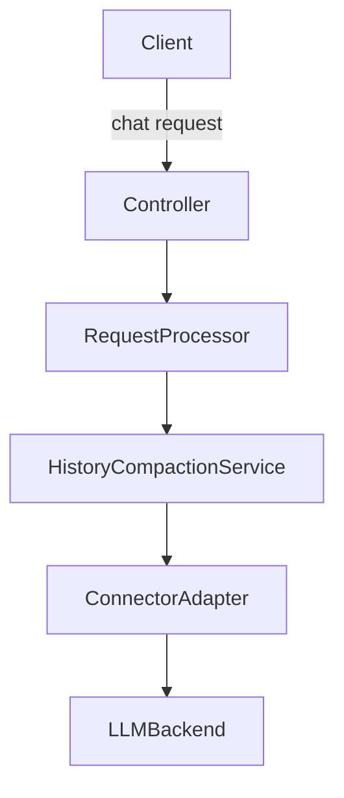

# Design Document

## Overview

This feature adds an intelligent context compaction step that trims stale tool outputs in chat histories before dispatch to LLM backends, keeping only the latest full result per resource and replacing older ones with explicit stubs. It reduces prompt size while preserving conversational integrity and transparency about removed content.

**Users**: Proxy operators and developers relying on the proxy to forward lean yet accurate histories to backend LLMs.
**Impact**: Inserts a compaction service into the request pipeline ahead of connector translation, with observability and fail-open behavior to avoid blocking requests.

### Goals

- Reduce prompt token/byte size by compacting stale tool outputs when newer outputs exist (Req 1.1-1.5, 2.1-2.5, 3.1-3.5).
- Keep latest tool results intact; use explicit stubs for superseded outputs (Req 2.1-2.3).
- Govern compaction by configurable token budgets and per-tool policies (Req 3.1-3.5).
- Provide metrics/logs for compaction actions and fail open on errors (Req 4.1-4.5).

### Non-Goals

- No compaction of user/system/assistant reasoning messages.
- No aggressive summarization beyond stub replacement in this iteration.
- No connector-specific compaction; connectors remain unaware.

## Architecture

### Existing Architecture Analysis (if applicable)

- Compaction must integrate before connector-specific formatting to preserve adapter boundaries.
- DI-driven services are typically singleton; request-scoped data passed as parameters.
- Missing `.kiro/steering/`; proceeding with default project patterns (staged init, adapter pattern).

### Architecture Pattern & Boundary Map

**Architecture Integration**:

- Selected pattern: Pipeline service invoked in request processing prior to connector translation.
- Domain boundaries: Compaction service operates on a request-local history copy; connectors remain unchanged.
- Existing patterns preserved: DI, staged initialization, adapter isolation.
- New components rationale: Dedicated service for compaction logic and policy to isolate responsibilities.
- Steering compliance: Follows SOLID, DI, and fail-open error handling.



### Technology Stack

| Layer | Choice / Version | Role in Feature | Notes |
|-------|------------------|-----------------|-------|
| Runtime | Python 3.10+ / FastAPI (async) | Core framework | `async/await` for I/O |
| DI Container | `src/core/di/container.py` | Register compaction service & policy | Singleton service |
| Initialization | Staged (`src/core/app/stages/`) | Wire compaction service before connectors | Add registration in services stage |
| Connectors | `src/connectors/base.LLMBackend` | Consume already-compacted history | Unchanged |
| Config | `src/core/config/app_config.py` | Thresholds/flags/policies | CLI > ENV > YAML |

## System Flows

Sequence (compaction-aware request path):

1. Controller receives chat request and builds history.
2. RequestProcessor invokes HistoryCompactionService with history, config, and token estimates.
3. Service detects stale tool outputs per resource, replaces earlier ones with stubs, respecting token thresholds.
4. Compacted history is forwarded to connector adapter unchanged in order.
5. Metrics/logs recorded; on error, original history forwarded (fail-open).

## Requirements Traceability

| Requirement | Summary | Components | Interfaces | Flows |
|-------------|---------|------------|------------|-------|
| 1.1-1.5 | Detect stale tool outputs by resource identity | HistoryCompactionService, CompactionPolicy | IHistoryCompactionService | System flow 1-3 |
| 2.1-2.5 | Replace stale outputs with explicit stubs, keep latest intact | HistoryCompactionService, StubBuilder | IHistoryCompactionService | System flow 2-4 |
| 3.1-3.5 | Token-budget governed compaction with policies | HistoryCompactionService | IHistoryCompactionService | System flow 2-3 |
| 4.1-4.5 | Observability, fail-open, redaction | Metrics hooks, Logging | IHistoryCompactionService | System flow 2-5 |

## Components and Interfaces

**DI Registration Strategy**:

- Lifetime: Singleton for services; per-request state passed via method parameters.
- Binding: `IHistoryCompactionService` -> `HistoryCompactionService`.
- Registration: Add in services stage before connector registration.

| Component | Layer | Intent | Req Coverage | DI Lifetime | Contracts |
|-----------|-------|--------|--------------|-------------|-----------|
| HistoryCompactionService | `src/core/services/` | Perform compaction over chat history | 1.1-1.5, 2.1-2.5, 3.1-3.5, 4.1-4.5 | Singleton | IHistoryCompactionService |
| CompactionPolicy | `src/core/domain/` | Evaluate staleness and eligibility per message | 1.1-1.3, 3.3-3.4 | Request-local data class | Domain policy |
| StubBuilder | `src/core/domain/` | Produce explicit stub content for stale messages | 2.1-2.3 | Request-local helper | Domain utility |

### Services Layer (`src/core/services/`)

#### HistoryCompactionService

| Field | Detail |
|-------|--------|
| Intent | Traverse chat history, detect stale tool outputs, replace with stubs, enforce token thresholds |
| Requirements | 1.1-1.5, 2.1-2.5, 3.1-3.5, 4.1-4.5 |
| Interface | `IHistoryCompactionService` in `src/core/interfaces/` |
| DI Lifetime | Singleton |

**Responsibilities & Constraints**

- Single-pass correlation by resource identity (file path, command signature, and optional parameters like offset/limit for partial reads).
- For file read operations with offset/limit parameters, treat each unique (file_path, offset, limit) tuple as a distinct resource to avoid incorrectly compacting reads of different file portions (Req 1.1.1).
- Preserve message ordering and metadata; mutate only tool content when compacting.
- Fail-open with logging on errors.

**Dependencies (via DI)**

- Token estimation utility (existing usage estimator).
- Config provider for thresholds, flags, allow/deny tool policies.
- Logger.

**Contracts**: Service [x] / Event [ ] / Middleware [ ]

##### Service Interface

```python
from abc import ABC, abstractmethod
from typing import Sequence

class IHistoryCompactionService(ABC):
    @abstractmethod
    async def compact_history(
        self,
        messages: Sequence[ChatMessage],
        token_budget: TokenBudgetConfig,
        policies: CompactionPolicies,
    ) -> Sequence[ChatMessage]:
        """Detect and compact stale tool results; preserve order; fail open on errors."""
        ...
```

- Preconditions: Messages include role/name/tool metadata; token estimator available.
- Postconditions: Returns compacted messages; if errors, returns original messages.
- Invariants: Most recent tool result per resource remains unmodified.

##### DI Registration (in appropriate stage)

```python
def _history_compaction_factory(provider: IServiceProvider) -> HistoryCompactionService:
    estimator = provider.get_required_service(ITokenEstimator)
    config = provider.get_required_service(IAppConfig)
    logger = provider.get_required_service(ILogger)
    return HistoryCompactionService(estimator, config, logger)

services.add_singleton(IHistoryCompactionService, implementation_factory=_history_compaction_factory)
```

### Domain Layer (`src/core/domain/`)

#### ResourceIdentityExtractor

- Extracts resource identity from tool arguments including:
  - File path (primary key)
  - Offset/limit parameters as secondary keys for partial file reads (Req 1.1.1)
  - Command signatures for command execution tools
  - Query/pattern for search tools
- Returns `None` when identity cannot be determined (Req 1.3)

#### CompactionPolicy

- Encapsulates rules: resource key extraction, tool allow/deny lists, thresholds.
- Request-local immutable instance passed to the service.

#### StubBuilder

- Generates stub text including resource identity and note about newer outputs.
- Applies redaction rules when embedding identifiers.

## Data Models

- `CompactionPolicies`: thresholds (soft/hard), allow/deny tool types, max stubs per resource.
- `TokenBudgetConfig`: target token ceiling to trigger compaction.
- No new persistent storage; all state request-scoped.

## Error Handling

- All errors mapped to `LLMProxyError` subclasses where raised; otherwise fail-open and log with `exc_info=True`.
- Do not catch bare `Exception`; scope catches to compaction operations.

## Testing Strategy

### Unit Tests (`tests/unit/`)

- Staleness detection per resource key (Req 1.1-1.5).
- Stub replacement correctness and ordering (Req 2.1-2.5).
- Token threshold behavior (Req 3.1-3.5).
- Fail-open logging on stub generation error (Req 4.4).

### Integration Tests (`tests/integration/`)

- Pipeline invocation: controller -> compaction -> connector receives compacted history.
- Metrics/log entries emitted when compaction occurs.

### Property Tests (`tests/property/`)

- Optional: invariants that latest tool result per resource remains unchanged regardless of history permutations.

## Security Considerations

- Stub content must avoid leaking sensitive payloads; apply existing redaction helpers.
- Config/flags must not expose secrets in logs.

## Performance & Scalability

- O(n) pass over messages with hashmap for resource correlation.
- Avoid deep copies unless compacting; reuse existing message objects when untouched.

## Stage Registration

```text
Infrastructure -> Core Services -> Backends -> Controllers
```

- Register `IHistoryCompactionService` in services stage.
- Invoke compaction in request processing prior to connector selection/translation.

## Supporting References (Optional)

- Discovery notes in `research.md`.
