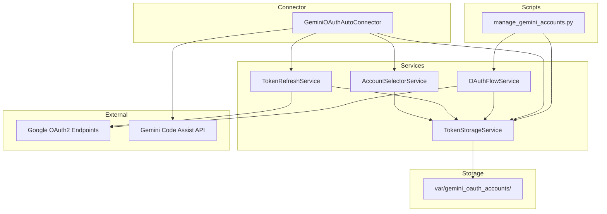
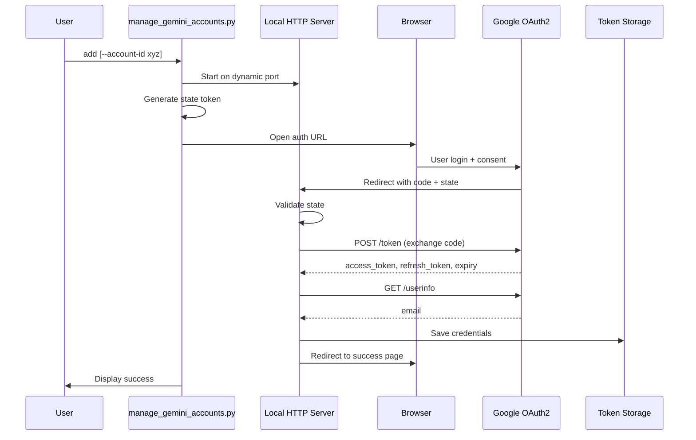
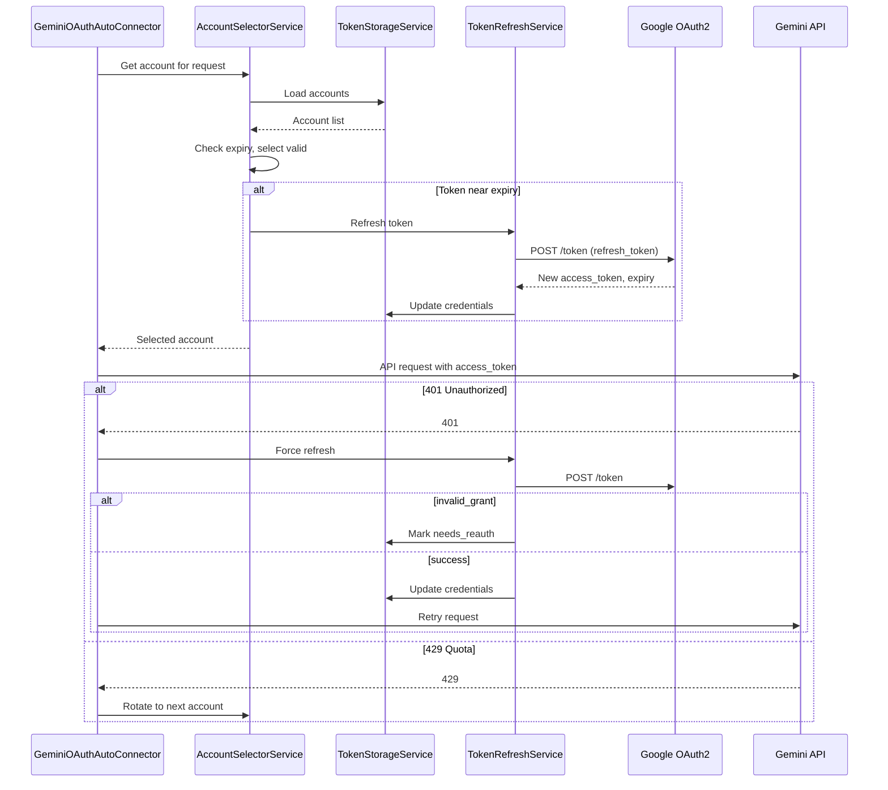

# Design Document: Gemini OAuth Auto-Connector

---
**Purpose**: This feature delivers self-contained OAuth2 authentication for Google Gemini API to developers and operators who want to use personal Google accounts without external dependencies on `gemini-cli`.

**Users**: Developers integrating LLM capabilities and operators managing backend configurations will utilize this for streamlined multi-account Gemini authentication with automatic token refresh.

**Impact**: Adds a new backend connector type `gemini-oauth-auto` that manages OAuth tokens independently, storing credentials in `var/gemini_oauth_accounts/` instead of relying on `~/.gemini/oauth_creds.json` managed by external tools.

---

## Goals

- Provide self-contained OAuth2 flow (browser-based authorization, token exchange, refresh)
- Support multiple Google accounts with automatic rotation
- Store credentials locally with atomic file operations
- Deliver standalone account management script in `scripts/`
- Extend existing `GeminiOAuthBaseConnector` without modifying it

## Non-Goals

- Token encryption at rest (deferred to future enhancement)
- Service account / workload identity support
- GUI for account management
- PKCE flow (using gemini-cli's client_secret flow)
- Custom OAuth client credentials (using embedded gemini-cli credentials)
- Cross-machine token synchronization

---

## Architecture

### Existing Architecture Analysis

**Current gemini-oauth infrastructure**:

- `GeminiOAuthBaseConnector` (2,641 lines) in `src/connectors/gemini_base/connector.py`
- `CredentialCoordinator` manages single-account credential lifecycle
- `TokenManager` delegates refresh to `gemini-cli` subprocess
- Credentials stored in `~/.gemini/oauth_creds.json` (external dependency)

**Constraints preserved**:

- Extends `GeminiOAuthBaseConnector` (do not modify base class)
- Follows hexagonal architecture (ports/adapters pattern)
- Respects staged initialization via `backend_registry`
- Uses DI composition (not injection into base class)

### Architecture Pattern & Boundary Map



**Architecture Integration**:

- **Selected pattern**: Composition over inheritance; services composed into connector
- **Domain boundaries**: OAuth flow (script-only) vs runtime token management (connector)
- **Existing patterns preserved**: Adapter pattern, staged init, backend registry
- **New components rationale**: Separate services for single responsibility
- **Steering compliance**: SOLID principles, async I/O, strong typing

### Technology Stack

| Layer | Choice / Version | Role in Feature | Notes |
|-------|------------------|-----------------|-------|
| Runtime | Python 3.10+ / FastAPI (async) | Core framework | Use `async/await` for all I/O |
| HTTP Client | `httpx` (async) | Token exchange, refresh, userinfo | Already in project dependencies |
| Local Server | `aiohttp` or stdlib | OAuth callback server | Script-only, not runtime |
| Browser | `webbrowser` stdlib | Open auth URL | Cross-platform |
| Storage | JSON files | Credential persistence | Atomic writes via temp+rename |
| Config | `pydantic` models | Validation | Extend `AppConfig` |

---

## System Flows

### OAuth Authorization Flow (Script)



**Key Decisions**:

- State parameter validates CSRF protection
- Dynamic port allocation (bind to 0) with optional fixed port override
- Userinfo fetch provides email for account identification
- 120-second timeout for user to complete authorization

### Token Refresh Flow (Runtime)



**Key Decisions**:

- Proactive refresh 5 minutes before expiry
- Single retry on 401 after refresh
- `invalid_grant` marks account as `needs_reauth`
- Quota exhaustion triggers immediate rotation

---

## Requirements Traceability

| Requirement | Summary | Components | Interfaces | Flows |
|-------------|---------|------------|------------|-------|
| 1 | OAuth2 Authorization Flow | OAuthFlowService, ManageScript | - | OAuth Authorization |
| 2 | Token Storage and Persistence | TokenStorageService | ITokenStorage | - |
| 3 | Automatic Token Refresh | TokenRefreshService | ITokenRefresh | Token Refresh |
| 4 | Multi-Account Support | AccountSelectorService | IAccountSelector | Token Refresh |
| 5 | List Accounts (Script) | ManageScript, TokenStorageService | - | - |
| 6 | Add Account (Script) | ManageScript, OAuthFlowService | - | OAuth Authorization |
| 7 | Update Account (Script) | ManageScript, OAuthFlowService | - | OAuth Authorization |
| 8 | Remove Account (Script) | ManageScript, TokenStorageService | - | - |
| 9 | Backend Connector | GeminiOAuthAutoConnector | LLMBackend | Token Refresh |
| 10 | Configuration Schema | ConfigModel | - | - |

---

## Components and Interfaces

### Component Summary

| Component | Layer | Intent | Req Coverage | DI Lifetime | Contracts |
|-----------|-------|--------|--------------|-------------|-----------|
| GeminiOAuthAutoConnector | `src/connectors/` | Backend adapter with self-managed OAuth | 9 | Singleton | LLMBackend |
| TokenStorageService | `src/connectors/gemini_oauth_auto/` | Multi-account credential persistence | 2, 5, 8 | Singleton | ITokenStorage |
| TokenRefreshService | `src/connectors/gemini_oauth_auto/` | HTTP-based token refresh | 3 | Singleton | ITokenRefresh |
| AccountSelectorService | `src/connectors/gemini_oauth_auto/` | Round-robin account selection | 4 | Singleton | IAccountSelector |
| OAuthFlowService | `src/connectors/gemini_oauth_auto/` | Browser OAuth authorization | 1, 6, 7 | Transient | - |
| manage_gemini_accounts.py | `scripts/` | CLI for account management | 5, 6, 7, 8 | Script | - |

---

### Connectors Layer (`src/connectors/`)

#### GeminiOAuthAutoConnector

| Field | Detail |
|-------|--------|
| Intent | Backend adapter with self-managed OAuth tokens |
| Requirements | 9 |
| Base Class | `GeminiOAuthBaseConnector` |
| Backend Type | `"gemini-oauth-auto"` |

**Responsibilities & Constraints**

- Extends `GeminiOAuthBaseConnector` without modifying base class
- Overrides credential loading to use `TokenStorageService`
- Overrides token refresh to use `TokenRefreshService` (bypasses gemini-cli subprocess)
- Delegates account selection to `AccountSelectorService`
- Updates `last_used` timestamp after successful requests

**Dependencies**

- Inbound: Backend registry registration (P0)
- Outbound: TokenStorageService, AccountSelectorService, TokenRefreshService
- External: Gemini Code Assist API (via base class), Google OAuth2 token endpoint

**Base Class Override Strategy**

The following base class methods/properties MUST be overridden to decouple from `~/.gemini/oauth_creds.json` and `gemini-cli`:

| Method/Property | Base Behavior | Override Behavior |
|-----------------|--------------|-------------------|
| `_oauth_credentials` | Reads from CredentialCoordinator | Returns credentials from AccountSelectorService |
| `initialize()` | Loads from `~/.gemini/oauth_creds.json`, starts file watcher | Loads from `var/gemini_oauth_accounts/`, no file watcher |
| `_refresh_token_if_needed()` | Calls TokenManager → gemini-cli subprocess | Delegates to TokenRefreshService (HTTP-based) |
| `_load_oauth_credentials()` | Reads from credential file path | Not used (returns False, credentials from storage) |
| `_start_file_watching()` | Watches `~/.gemini/oauth_creds.json` | No-op (storage service handles file management) |
| `is_backend_functional()` | Checks base credential state | Checks if any valid accounts available |

**Required Overrides**

```python
class GeminiOAuthAutoConnector(GeminiOAuthBaseConnector):
    backend_type: str = "gemini-oauth-auto"
    
    def __init__(
        self,
        client: httpx.AsyncClient,
        config: AppConfig,
        translation_service: TranslationService,
        name: str | None = None,
        token_storage: TokenStorageService | None = None,
        account_selector: AccountSelectorService | None = None,
        token_refresh: TokenRefreshService | None = None,
    ) -> None:
        super().__init__(client, config, translation_service, name)
        # Compose services with shared httpx client for consistent connection pooling
        storage_path = Path(config.get("gemini_oauth_auto_storage_path", "var/gemini_oauth_accounts"))
        self._token_storage = token_storage or TokenStorageService(storage_path)
        self._token_refresh_service = token_refresh or TokenRefreshService(
            storage=self._token_storage,
            http_client=client,  # Share connector's httpx client
        )
        self._account_selector = account_selector or AccountSelectorService(
            storage=self._token_storage,
            refresh_service=self._token_refresh_service,
        )
        # Track selected account for last_used updates
        self._current_account: StoredAccount | None = None
    
    async def initialize(self, **kwargs: Any) -> None:
        """Initialize with local account storage.
        
        Bypasses base class credential loading from ~/.gemini/oauth_creds.json.
        Instead, loads accounts from var/gemini_oauth_accounts/.
        """
        await self._token_storage.load_all_accounts()
        
        # Select initial account
        self._current_account = await self._account_selector.get_next_account()
        
        # Set functional state based on account availability
        if self._current_account:
            self.is_functional = True
            self._initialization_failed = False
            logger.info(
                "gemini-oauth-auto initialized with %d accounts",
                self._account_selector.get_available_count(),
            )
        else:
            self.is_functional = False
            self._credential_validation_errors = [
                "No valid accounts available. Run: python scripts/manage_gemini_accounts.py add"
            ]
            logger.warning("gemini-oauth-auto initialized with no valid accounts")
        
        self._initialized = True
    
    @property
    def _oauth_credentials(self) -> dict[str, Any] | None:
        """Override to use selected account credentials."""
        if self._current_account:
            return self._current_account.to_credentials_dict()
        return None
    
    async def _refresh_token_if_needed(self, *, force_reload: bool = False) -> bool:
        """Override to use HTTP-based token refresh instead of gemini-cli.
        
        Args:
            force_reload: If True, force refresh even if not expired
        
        Returns:
            True if token is valid (refreshed or was already valid)
        """
        if not self._current_account:
            return False
        
        try:
            if force_reload:
                self._current_account = await self._token_refresh_service.force_refresh(
                    self._current_account
                )
            else:
                self._current_account = await self._token_refresh_service.refresh_if_needed(
                    self._current_account
                )
            return True
        except TokenRefreshError as e:
            if e.needs_reauth:
                # Current account needs re-authorization, try to rotate
                logger.warning(
                    "Account %s needs re-authorization, rotating to next account",
                    self._current_account.account_id,
                )
                self._current_account = await self._account_selector.get_next_account()
                return self._current_account is not None
            return False
    
    async def _load_oauth_credentials(
        self, *, force_reload: bool = False, silent: bool = False
    ) -> bool:
        """Override to disable base class credential loading.
        
        Returns False to indicate no credentials loaded via this path.
        Actual credentials come from _oauth_credentials property.
        """
        return False
    
    def _start_file_watching(self) -> None:
        """Override to disable file watching.
        
        File management is handled by TokenStorageService.
        """
        pass  # No-op
    
    def is_backend_functional(self) -> bool:
        """Override to check account availability."""
        return (
            self._initialized
            and not self._initialization_failed
            and self._account_selector.get_available_count() > 0
        )
    
    async def _handle_quota_exhaustion(self) -> bool:
        """Handle quota exhaustion by rotating to next account.
        
        Returns:
            True if rotation succeeded, False if no more accounts available
        """
        logger.debug(
            "Quota exhausted for account %s, rotating to next",
            self._current_account.account_id if self._current_account else "unknown",
        )
        self._current_account = await self._account_selector.rotate_on_quota()
        return self._current_account is not None
```

**Registration**

```python
# At module level
backend_registry.register_backend("gemini-oauth-auto", GeminiOAuthAutoConnector)
```

---

### Services Layer (`src/connectors/gemini_oauth_auto/`)

#### TokenStorageService

| Field | Detail |
|-------|--------|
| Intent | Multi-account credential persistence with atomic file operations |
| Requirements | 2, 5, 8 |
| Interface | `ITokenStorage` |
| DI Lifetime | Singleton |

**Responsibilities & Constraints**

- Manage `var/gemini_oauth_accounts/` directory
- One JSON file per account: `{account_id}.json`
- Atomic writes (temp file + rename)
- Restrictive file permissions (600 on POSIX)
- Skip corrupted files with warning (fail-open)

**Dependencies**

- External: File system (P0)

**Contracts**: Service [x]

##### Service Interface

```python
from abc import ABC, abstractmethod
from pathlib import Path

class ITokenStorage(ABC):
    @abstractmethod
    async def load_all_accounts(self) -> list[StoredAccount]:
        """Load all accounts from storage directory.
        
        Postcondition: Returns list of valid accounts, skips corrupted files.
        """
        ...
    
    @abstractmethod
    async def get_account(self, account_id: str) -> StoredAccount | None:
        """Get specific account by ID."""
        ...
    
    @abstractmethod
    async def save_account(self, account: StoredAccount) -> None:
        """Save account credentials atomically.
        
        Precondition: account.account_id is valid (alphanumeric, hyphens, underscores).
        Postcondition: File written with restrictive permissions.
        """
        ...
    
    @abstractmethod
    async def delete_account(self, account_id: str) -> bool:
        """Delete account credentials file.
        
        Returns: True if deleted, False if not found.
        """
        ...
    
    @abstractmethod
    async def list_accounts(self) -> list[AccountSummary]:
        """List all accounts with status information."""
        ...
```

---

#### TokenRefreshService

| Field | Detail |
|-------|--------|
| Intent | HTTP-based OAuth token refresh with retry logic |
| Requirements | 3 |
| Interface | `ITokenRefresh` |
| DI Lifetime | Singleton |

**Responsibilities & Constraints**

- POST to `https://oauth2.googleapis.com/token` with refresh_token
- Handle `invalid_grant` error (mark account as `needs_reauth`)
- Retry with exponential backoff (3 attempts, 1s/2s/4s delays)
- Prevent concurrent refresh for same account (async lock)
- Proactive refresh when within 5 minutes of expiry
- Use shared `httpx.AsyncClient` for connection pooling

**Dependencies**

- Inbound: `httpx.AsyncClient` (P0) - shared from connector
- Outbound: TokenStorageService (P0)
- External: Google OAuth2 token endpoint (P0)

**Contracts**: Service [x]

##### Service Interface

```python
class ITokenRefresh(ABC):
    @abstractmethod
    async def refresh_if_needed(self, account: StoredAccount, buffer_ms: int = 300_000) -> StoredAccount:
        """Refresh token if within buffer of expiry.
        
        Args:
            account: Account to potentially refresh
            buffer_ms: Milliseconds before expiry to trigger refresh (default 5 min)
        
        Returns: Account with updated tokens (or unchanged if not needed)
        Raises: TokenRefreshError if refresh fails
        """
        ...
    
    @abstractmethod
    async def force_refresh(self, account: StoredAccount) -> StoredAccount:
        """Force immediate token refresh.
        
        Returns: Account with updated tokens
        Raises: TokenRefreshError with needs_reauth flag if invalid_grant
        """
        ...
```

##### Token Refresh Implementation

```python
from src.connectors.gemini_oauth_auto.constants import (
    OAUTH_CLIENT_ID,
    OAUTH_CLIENT_SECRET,
    TOKEN_ENDPOINT,
)

class TokenRefreshService(ITokenRefresh):
    """HTTP-based OAuth token refresh service.
    
    Uses injected httpx.AsyncClient for connection pooling consistency.
    """
    
    def __init__(
        self,
        storage: ITokenStorage,
        http_client: httpx.AsyncClient,
        max_retries: int = 3,
        base_delay: float = 1.0,
    ) -> None:
        self._storage = storage
        self._http_client = http_client  # Shared client from connector
        self._max_retries = max_retries
        self._base_delay = base_delay
        self._refresh_locks: dict[str, asyncio.Lock] = {}
    
    def _get_lock(self, account_id: str) -> asyncio.Lock:
        """Get or create lock for account to prevent concurrent refresh."""
        if account_id not in self._refresh_locks:
            self._refresh_locks[account_id] = asyncio.Lock()
        return self._refresh_locks[account_id]
    
    async def refresh_if_needed(
        self, account: StoredAccount, buffer_ms: int = 300_000
    ) -> StoredAccount:
        """Refresh token if within buffer of expiry."""
        if not account.is_expired(buffer_ms):
            return account
        return await self._do_refresh_with_retry(account)
    
    async def force_refresh(self, account: StoredAccount) -> StoredAccount:
        """Force immediate token refresh."""
        return await self._do_refresh_with_retry(account)
    
    async def _do_refresh_with_retry(self, account: StoredAccount) -> StoredAccount:
        """Execute refresh with exponential backoff retry."""
        last_error: Exception | None = None
        
        for attempt in range(self._max_retries):
            try:
                return await self._do_refresh(account)
            except TokenRefreshError:
                raise  # Don't retry auth errors
            except httpx.HTTPError as e:
                last_error = e
                if attempt < self._max_retries - 1:
                    delay = self._base_delay * (2 ** attempt)  # 1s, 2s, 4s
                    logger.debug(
                        "Token refresh attempt %d failed, retrying in %.1fs: %s",
                        attempt + 1, delay, e,
                    )
                    await asyncio.sleep(delay)
        
        raise TokenRefreshError(f"Token refresh failed after {self._max_retries} attempts: {last_error}")
    
    async def _do_refresh(self, account: StoredAccount) -> StoredAccount:
        """Execute single token refresh request."""
        async with self._get_lock(account.account_id):
            # Double-check if already refreshed by another coroutine
            current = await self._storage.get_account(account.account_id)
            if current and not current.is_expired(buffer_ms=60_000):  # 1 min buffer
                return current
            
            response = await self._http_client.post(
                TOKEN_ENDPOINT,
                data={
                    "client_id": OAUTH_CLIENT_ID,
                    "client_secret": OAUTH_CLIENT_SECRET,
                    "refresh_token": account.refresh_token,
                    "grant_type": "refresh_token",
                },
            )
            
            if response.status_code == 400:
                error = response.json()
                if error.get("error") == "invalid_grant":
                    account.needs_reauth = True
                    await self._storage.save_account(account)
                    raise TokenRefreshError("Refresh token revoked", needs_reauth=True)
            
            response.raise_for_status()
            tokens = response.json()
            
            # Update account with new tokens
            account.access_token = tokens["access_token"]
            account.expiry_date = int(time.time() * 1000) + (tokens["expires_in"] * 1000)
            account.updated_at = datetime.now(timezone.utc).isoformat()
            account.needs_reauth = False  # Clear flag on successful refresh
            
            await self._storage.save_account(account)
            logger.debug(
                "Token refreshed for account %s, expires in %ds",
                account.account_id,
                tokens["expires_in"],
            )
            return account
```

---

#### AccountSelectorService

| Field | Detail |
|-------|--------|
| Intent | Round-robin account selection with failover |
| Requirements | 4 |
| Interface | `IAccountSelector` |
| DI Lifetime | Singleton |

**Responsibilities & Constraints**

- Round-robin selection among valid accounts
- Skip accounts with `needs_reauth=True`
- Skip accounts with expired tokens (after refresh attempt)
- Immediate rotation on quota exhaustion

**Dependencies**

- Outbound: TokenStorageService (P0), TokenRefreshService (P1)

**Contracts**: Service [x]

##### Service Interface

```python
class IAccountSelector(ABC):
    @abstractmethod
    async def get_next_account(self) -> StoredAccount | None:
        """Get next valid account in rotation.
        
        Returns: Valid account or None if no accounts available.
        Side effect: Advances rotation index.
        """
        ...
    
    @abstractmethod
    def get_current_account(self) -> StoredAccount | None:
        """Get currently selected account without advancing."""
        ...
    
    @abstractmethod
    async def rotate_on_quota(self) -> StoredAccount | None:
        """Rotate to next account due to quota exhaustion.
        
        Returns: Next available account or None.
        """
        ...
    
    @abstractmethod
    def get_available_count(self) -> int:
        """Count of accounts not marked needs_reauth."""
        ...
```

---

#### OAuthFlowService

| Field | Detail |
|-------|--------|
| Intent | Browser-based OAuth authorization flow |
| Requirements | 1, 6, 7 |
| Interface | - (script-only, no DI) |
| DI Lifetime | Transient |

**Responsibilities & Constraints**

- Start local HTTP server on dynamic port
- Generate cryptographic state parameter (32 bytes hex)
- Open browser with authorization URL
- Handle callback, validate state, exchange code for tokens
- Fetch userinfo for email identification
- Redirect browser to success/failure page
- Timeout after configurable duration (default 120s)

**Dependencies**

- External: Google OAuth2 endpoints (P0)
- External: Local browser (P1)

##### OAuth Flow Implementation

```python
OAUTH_SCOPES = [
    "https://www.googleapis.com/auth/cloud-platform",
    "https://www.googleapis.com/auth/userinfo.email",
    "https://www.googleapis.com/auth/userinfo.profile",
]

AUTH_URL = "https://accounts.google.com/o/oauth2/v2/auth"
TOKEN_URL = "https://oauth2.googleapis.com/token"
USERINFO_URL = "https://www.googleapis.com/oauth2/v2/userinfo"

SUCCESS_REDIRECT = "https://developers.google.com/gemini-code-assist/auth_success_gemini"
FAILURE_REDIRECT = "https://developers.google.com/gemini-code-assist/auth_failure_gemini"

async def authorize(
    self,
    account_id: str | None = None,
    port: int | None = None,
    timeout: int = 120,
    open_browser: bool = True,
) -> StoredAccount:
    """Run OAuth authorization flow.
    
    Args:
        account_id: Custom account identifier (auto-generated if None)
        port: Fixed port for callback server (dynamic if None)
        timeout: Seconds to wait for authorization
        open_browser: Whether to auto-open browser
    
    Returns: StoredAccount with tokens and email
    Raises: OAuthError on failure or timeout
    """
```

---

### Scripts (`scripts/`)

#### manage_gemini_accounts.py

| Field | Detail |
|-------|--------|
| Intent | CLI tool for account management |
| Requirements | 5, 6, 7, 8 |

**Commands**

| Command | Arguments | Description |
|---------|-----------|-------------|
| `list` | `--json` | Display all registered accounts |
| `add` | `--account-id`, `--no-browser`, `--port`, `--timeout`, `--force` | Add new account via OAuth |
| `update <account-id>` | `--no-browser`, `--port`, `--timeout` | Re-authorize existing account |
| `remove <account-id>` | `--force` | Delete account credentials |

**Implementation**

```python
#!/usr/bin/env python
"""Manage Gemini OAuth accounts for gemini-oauth-auto connector."""

import argparse
import asyncio
import sys
from pathlib import Path

# Add src to path for imports
sys.path.insert(0, str(Path(__file__).parent.parent))

from src.connectors.gemini_oauth_auto.oauth_flow import OAuthFlowService
from src.connectors.gemini_oauth_auto.token_storage import TokenStorageService

async def cmd_list(args: argparse.Namespace) -> int:
    """List all registered accounts."""
    storage = TokenStorageService()
    accounts = await storage.list_accounts()
    
    if not accounts:
        print("No accounts registered.")
        print("Run: python scripts/manage_gemini_accounts.py add")
        return 0
    
    if args.json:
        import json
        print(json.dumps([a.to_dict() for a in accounts], indent=2))
    else:
        print(f"{'Account ID':<20} {'Email':<30} {'Status':<15} {'Expires':<20}")
        print("-" * 85)
        for a in accounts:
            print(f"{a.account_id:<20} {a.email:<30} {a.status:<15} {a.expiry_display:<20}")
    
    return 0

def main() -> int:
    parser = argparse.ArgumentParser(description="Manage Gemini OAuth accounts")
    subparsers = parser.add_subparsers(dest="command", required=True)
    
    # list command
    list_parser = subparsers.add_parser("list", help="List registered accounts")
    list_parser.add_argument("--json", action="store_true", help="Output as JSON")
    
    # add command
    add_parser = subparsers.add_parser("add", help="Add new account")
    add_parser.add_argument("--account-id", help="Custom account identifier")
    add_parser.add_argument("--no-browser", action="store_true", help="Don't auto-open browser")
    add_parser.add_argument("--port", type=int, help="Fixed callback port")
    add_parser.add_argument("--timeout", type=int, default=120, help="Auth timeout in seconds")
    add_parser.add_argument("--force", action="store_true", help="Overwrite existing account")
    
    # ... similar for update and remove
    
    args = parser.parse_args()
    return asyncio.run(dispatch(args))

if __name__ == "__main__":
    sys.exit(main())
```

---

## Data Models

### Domain Model (`src/connectors/gemini_oauth_auto/models.py`)

#### StoredAccount

```python
from pydantic import BaseModel, Field
from datetime import datetime
from typing import Literal
import time
import re

ACCOUNT_ID_PATTERN = re.compile(r"^[a-zA-Z0-9_-]{1,64}$")

class StoredAccount(BaseModel):
    """Stored OAuth account credentials."""
    
    account_id: str = Field(..., pattern=r"^[a-zA-Z0-9_-]{1,64}$")
    email: str | None = None
    access_token: str
    refresh_token: str
    token_type: str = "Bearer"
    scope: str | None = None
    expiry_date: int  # milliseconds since epoch
    created_at: str  # ISO 8601
    updated_at: str  # ISO 8601
    last_used: str | None = None
    needs_reauth: bool = False
    
    def is_expired(self, buffer_ms: int = 0) -> bool:
        """Check if token is expired (with optional buffer)."""
        return time.time() * 1000 >= self.expiry_date - buffer_ms
    
    def to_credentials_dict(self) -> dict[str, Any]:
        """Convert to format expected by GeminiOAuthBaseConnector."""
        return {
            "access_token": self.access_token,
            "refresh_token": self.refresh_token,
            "token_type": self.token_type,
            "expiry_date": self.expiry_date,
        }
    
    @property
    def status(self) -> Literal["valid", "expired", "needs_reauth"]:
        if self.needs_reauth:
            return "needs_reauth"
        if self.is_expired():
            return "expired"
        return "valid"

class AccountSummary(BaseModel):
    """Summary for display in list command."""
    account_id: str
    email: str | None
    status: str
    expiry_display: str
    last_used: str | None
```

### Configuration Model (`src/core/config/`)

```python
class GeminiOAuthAutoConfig(BaseModel):
    """Configuration for gemini-oauth-auto connector."""
    
    accounts: list[str] | Literal["all"] = "all"
    refresh_buffer_seconds: int = 300
    selection_strategy: Literal["round-robin", "random", "first-available"] = "round-robin"
    storage_path: str = "var/gemini_oauth_accounts"
```

### File Format

**Location**: `var/gemini_oauth_accounts/{account_id}.json`

```json
{
  "account_id": "personal-gmail",
  "email": "user@gmail.com",
  "access_token": "ya29.xxx...",
  "refresh_token": "1//xxx...",
  "token_type": "Bearer",
  "scope": "https://www.googleapis.com/auth/cloud-platform https://www.googleapis.com/auth/userinfo.email https://www.googleapis.com/auth/userinfo.profile",
  "expiry_date": 1737417600000,
  "created_at": "2026-01-21T00:00:00+01:00",
  "updated_at": "2026-01-21T00:00:00+01:00",
  "last_used": null,
  "needs_reauth": false
}
```

---

## Error Handling

### Error Hierarchy

| Error Type | HTTP Status | Use Case |
|------------|-------------|----------|
| `OAuthError` | - | OAuth flow failures (script only) |
| `TokenRefreshError` | - | Token refresh failures |
| `NoValidAccountsError` | 503 | All accounts expired/needs_reauth |
| `AuthenticationError` | 401 | Credential issues at request time |
| `BackendError` | 502 | Gemini API failures |

### Error Strategy

```python
class OAuthError(Exception):
    """OAuth authorization flow error."""
    pass

class TokenRefreshError(LLMProxyError):
    """Token refresh failure."""
    def __init__(self, message: str, needs_reauth: bool = False):
        super().__init__(message)
        self.needs_reauth = needs_reauth

class NoValidAccountsError(LLMProxyError):
    """No valid accounts available for requests."""
    def __init__(self):
        super().__init__(
            "No valid Gemini OAuth accounts available. "
            "Run: python scripts/manage_gemini_accounts.py add"
        )
```

---

## Testing Strategy

### Test Organization

```
tests/
├── unit/
│   └── connectors/
│       └── gemini_oauth_auto/
│           ├── test_token_storage.py       # Req 2
│           ├── test_token_refresh.py       # Req 3
│           ├── test_account_selector.py    # Req 4
│           ├── test_oauth_flow.py          # Req 1
│           ├── test_models.py              # Data models
│           └── test_connector.py           # Req 9
└── integration/
    └── connectors/
        └── test_gemini_oauth_auto_e2e.py   # Full flow
```

### Unit Tests

- [ ] TokenStorageService: atomic writes, corruption handling, permissions
- [ ] TokenRefreshService: successful refresh, invalid_grant, retry logic
- [ ] AccountSelectorService: round-robin, skip needs_reauth, quota rotation
- [ ] OAuthFlowService: state validation, code exchange, userinfo fetch
- [ ] StoredAccount: expiry checking, status calculation, validation
- [ ] GeminiOAuthAutoConnector: credential override, initialization

### Integration Tests

- [ ] Full OAuth flow with mocked Google endpoints
- [ ] Connector integration with storage and selector
- [ ] Script commands with file system operations

### Test Commands

```bash
# Unit tests
.venv\Scripts\python.exe -m pytest tests/unit/connectors/gemini_oauth_auto/ -v

# Integration tests (requires network mocking)
.venv\Scripts\python.exe -m pytest tests/integration/connectors/test_gemini_oauth_auto_e2e.py -v

# With coverage
.venv\Scripts\python.exe -m pytest tests/unit/connectors/gemini_oauth_auto/ --cov=src/connectors/gemini_oauth_auto
```

---

## Security Considerations

### Credential Protection

- Token files: Mode 600 on POSIX (`os.chmod(path, 0o600)`)
- Windows: Best-effort ACL (document limitation)
- Callback server: Bind to `127.0.0.1` only, reject non-local
- Logging: Never log `access_token` or `refresh_token` values
- State parameter: 32 cryptographic random bytes (hex encoded)

### Client Credentials

- Embedded credentials follow Google's "installed application" policy
- Client ID and secret are public knowledge (documented in gemini-cli)
- No additional secrets required from users

---

## Stage Registration

```
Infrastructure -> Core Services -> Backends -> Controllers
                                      ^
                                      |
                            GeminiOAuthAutoConnector registered
```

**Registration**: `backend_registry.register_backend()` at module import level (BackendStage)

---

## Directory Structure

```
src/connectors/
├── gemini_oauth_auto/
│   ├── __init__.py
│   ├── models.py              # StoredAccount, AccountSummary
│   ├── token_storage.py       # TokenStorageService
│   ├── token_refresh.py       # TokenRefreshService
│   ├── account_selector.py    # AccountSelectorService
│   ├── oauth_flow.py          # OAuthFlowService
│   ├── constants.py           # OAuth client credentials, URLs
│   └── errors.py              # OAuthError, TokenRefreshError
├── gemini_oauth_auto.py       # GeminiOAuthAutoConnector + registration

scripts/
└── manage_gemini_accounts.py  # CLI tool

config/schemas/
└── gemini_oauth_auto.yaml     # Configuration schema

var/
└── gemini_oauth_accounts/     # Created at runtime
    └── {account_id}.json      # Per-account credentials
```
