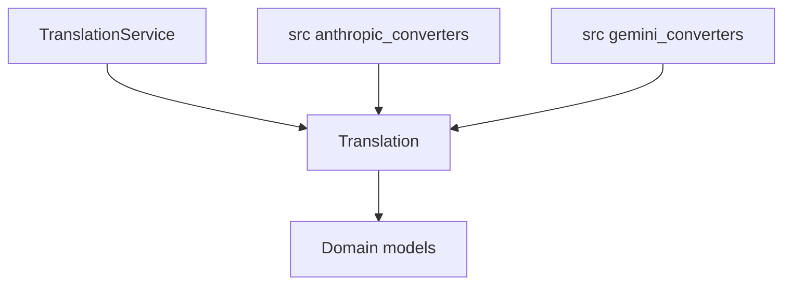
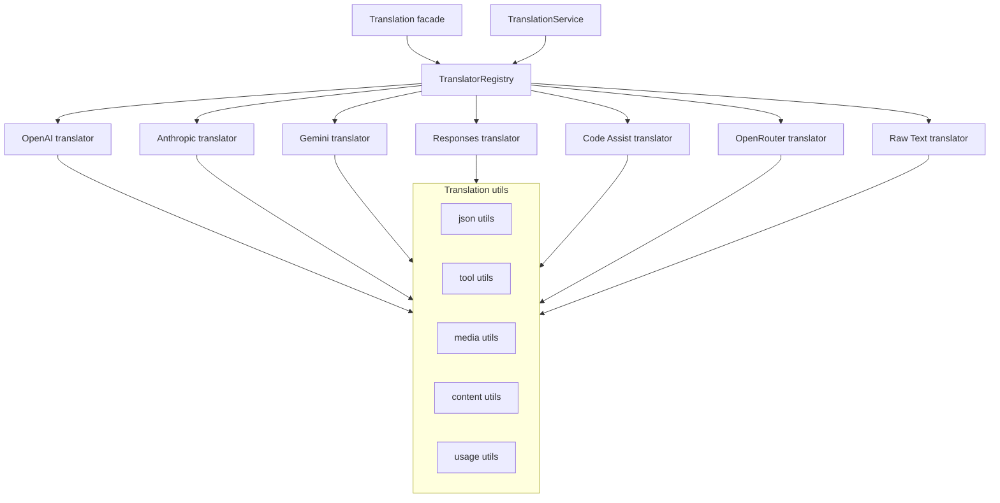

# Design Document: Cross-API Translation Refactoring

## Overview

This design document describes the refactoring of the Cross-API Translation service from a monolithic "God Object" pattern into a modular, layered architecture. The current `Translation` class in `src/core/domain/translation.py` (~4.4k lines, 51 methods) will be decomposed into specialized translator modules following SOLID principles, with shared utilities extracted into reusable components. The refactor also targets `TranslationService` in `src/core/services/translation_service.py` (~1k lines) which currently duplicates and orchestrates portions of the same logic.

The refactoring uses the Strategy pattern for translator implementations, Factory pattern for translator creation, and Facade pattern to maintain backward compatibility with existing public APIs.

## Goals

- Split `Translation` into focused translator modules by format: `openai`, `anthropic`, `gemini`, `responses` (including `openai-responses`), `code_assist`, `openrouter`, `raw_text`.
- Extract shared helpers (JSON sanitization, tool args, usage normalization, multimodal helpers, safe string coercion) into reusable modules.
- Preserve backward compatibility for all existing public translation entrypoints and the compatibility modules `src/anthropic_converters.py` and `src/gemini_converters.py`.
- Integrate cleanly with the existing DI container (`ServiceCollection`) without introducing new DI infrastructure.

## Non-Goals

- Changing any external API schemas or introducing new frontend endpoints.
- Changing the canonical domain models (`CanonicalChatRequest`, `CanonicalChatResponse`, `CanonicalStreamChunk`).
- Altering existing error types/messages as observed by callers (unless explicitly required by requirements).

## Architecture

### Current Architecture (Before)



### Target Architecture (After)



## Components and Interfaces

### 1. Translator Protocol (Interface)

```python
# src/core/interfaces/translator_protocol.py

from collections.abc import Collection
from typing import Protocol

from pydantic import BaseModel

from src.core.domain.chat import (
    CanonicalChatRequest,
    CanonicalChatResponse,
    CanonicalStreamChunk,
    ChatResponse,
)

class TranslatorProtocol(Protocol):
    """Protocol defining the contract for API format translators."""
    
    @property
    def format_names(self) -> Collection[str]:
        """Return supported format keys, including aliases (e.g., 'responses', 'openai-responses')."""
        ...
    
    def to_domain_request(self, request: BaseModel) -> CanonicalChatRequest:
        """Convert API-specific request to canonical format."""
        ...
    
    def from_domain_request(self, request: CanonicalChatRequest) -> BaseModel:
        """Convert canonical request to API-specific format."""
        ...
    
    def to_domain_response(self, response: BaseModel) -> CanonicalChatResponse:
        """Convert API-specific response to canonical format."""
        ...
    
    def from_domain_response(self, response: ChatResponse) -> BaseModel:
        """Convert domain response to API-specific format."""
        ...


class StreamingTranslatorProtocol(Protocol):
    """Protocol for streaming chunk translation."""
    
    def to_domain_stream_chunk(self, chunk: BaseModel) -> CanonicalStreamChunk:
        """Convert API-specific stream chunk to canonical format."""
        ...
    
    def from_domain_stream_chunk(self, chunk: CanonicalStreamChunk) -> BaseModel:
        """Convert canonical stream chunk to API-specific format."""
        ...
```

### 2. Base Translator (Abstract Base Class)

```python
# src/core/domain/translators/base.py

from abc import ABC, abstractmethod
from pydantic import BaseModel

from src.core.domain.base_translator import BaseTranslator as TranslationBaseTranslator
from src.core.domain.chat import (
    CanonicalChatRequest,
    CanonicalChatResponse,
    CanonicalStreamChunk,
    ChatResponse,
)

class BaseFormatTranslator(TranslationBaseTranslator, ABC):
    """Abstract base class for API format translators.

    Note: This is intentionally distinct from `src.core.domain.base_translator.BaseTranslator`.
    """
    
    @property
    @abstractmethod
    def format_names(self) -> set[str]:
        """Return the supported API format keys (including aliases)."""
        pass
    
    @abstractmethod
    def to_domain_request(self, request: BaseModel) -> CanonicalChatRequest:
        """Convert API-specific request to canonical format."""
        pass
    
    @abstractmethod
    def to_domain_response(self, response: BaseModel) -> CanonicalChatResponse:
        """Convert API-specific response to canonical format."""
        pass
    
    def from_domain_request(self, request: CanonicalChatRequest) -> BaseModel:
        """Convert canonical request to API-specific format. Optional override."""
        raise NotImplementedError("Translator does not support from_domain_request")
    
    def from_domain_response(self, response: ChatResponse) -> BaseModel:
        """Convert domain response to API-specific format. Optional override."""
        raise NotImplementedError("Translator does not support from_domain_response")


class StreamingTranslatorMixin:
    """Mixin for streaming translation capabilities."""
    
    def to_domain_stream_chunk(self, chunk: BaseModel) -> CanonicalStreamChunk:
        """Convert API-specific stream chunk to canonical format."""
        raise NotImplementedError("Streaming not supported")
    
    def from_domain_stream_chunk(self, chunk: CanonicalStreamChunk) -> BaseModel:
        """Convert canonical stream chunk to API-specific format."""
        raise NotImplementedError("Streaming not supported")
```

### 3. Translator Registry

```python
# src/core/domain/translators/registry.py

from typing import Callable
from src.core.interfaces.translator_protocol import TranslatorProtocol

class TranslatorRegistry:
    """Registry for managing translator instances."""
    
    def __init__(self) -> None:
        self._translators: dict[str, TranslatorProtocol] = {}
        self._factories: dict[str, Callable[[], TranslatorProtocol]] = {}
    
    def register(self, translator: TranslatorProtocol) -> None:
        """Register a translator instance for all of its supported format keys."""
        for format_name in translator.format_names:
            self._translators[format_name] = translator
    
    def register_factory(self, format_name: str, factory: Callable[[], TranslatorProtocol]) -> None:
        """Register a factory for lazy translator creation."""
        self._factories[format_name] = factory
    
    def get(self, format_name: str) -> TranslatorProtocol:
        """Get translator by format name, creating if necessary."""
        if format_name not in self._translators:
            if format_name in self._factories:
                self._translators[format_name] = self._factories[format_name]()
            else:
                raise KeyError(f"No translator registered for format: {format_name}")
        return self._translators[format_name]
    
    def has(self, format_name: str) -> bool:
        """Check if a translator is registered for the format."""
        return format_name in self._translators or format_name in self._factories


_global_registry = TranslatorRegistry()


def get_global_translator_registry() -> TranslatorRegistry:
    """Return the process-wide translator registry used by Translation and TranslationService."""
    return _global_registry
```

### 4. Specialized Translators

#### OpenAI Translator
```python
# src/core/domain/translators/openai_translator.py

class OpenAITranslator(BaseFormatTranslator, StreamingTranslatorMixin):
    """Translator for OpenAI API format."""
    
    @property
    def format_names(self) -> set[str]:
        return {"openai"}
    
    def to_domain_request(self, request: BaseModel) -> CanonicalChatRequest:
        # OpenAI-specific request conversion logic
        ...
    
    def to_domain_response(self, response: BaseModel) -> CanonicalChatResponse:
        # OpenAI-specific response conversion logic
        ...
    
    def to_domain_stream_chunk(self, chunk: BaseModel) -> CanonicalStreamChunk:
        # OpenAI-specific streaming chunk conversion
        ...
```

#### Anthropic Translator
```python
# src/core/domain/translators/anthropic_translator.py

class AnthropicTranslator(BaseFormatTranslator, StreamingTranslatorMixin):
    """Translator for Anthropic API format."""
    
    @property
    def format_names(self) -> set[str]:
        return {"anthropic"}
    
    # Similar structure to OpenAI translator
```

#### Gemini Translator
```python
# src/core/domain/translators/gemini_translator.py

class GeminiTranslator(BaseFormatTranslator, StreamingTranslatorMixin):
    """Translator for Gemini API format."""
    
    @property
    def format_names(self) -> set[str]:
        return {"gemini"}
    
    # Similar structure with Gemini-specific logic
```

#### Responses API Translator
```python
# src/core/domain/translators/responses_translator.py

class ResponsesTranslator(BaseFormatTranslator, StreamingTranslatorMixin):
    """Translator for OpenAI Responses API format."""
    
    @property
    def format_names(self) -> set[str]:
        return {"responses", "openai-responses"}
```

#### Code Assist Translator
```python
# src/core/domain/translators/code_assist_translator.py

class CodeAssistTranslator(BaseFormatTranslator, StreamingTranslatorMixin):
    """Translator for Code Assist API format."""
    
    @property
    def format_names(self) -> set[str]:
        return {"code_assist"}
```

#### OpenRouter Translator
```python
# src/core/domain/translators/openrouter_translator.py

class OpenRouterTranslator(BaseFormatTranslator):
    """Translator for OpenRouter API format."""

    @property
    def format_names(self) -> set[str]:
        return {"openrouter"}
```

#### Raw Text Translator
```python
# src/core/domain/translators/raw_text_translator.py

class RawTextTranslator(BaseFormatTranslator, StreamingTranslatorMixin):
    """Translator for raw text format."""

    @property
    def format_names(self) -> set[str]:
        return {"raw_text"}
```

### 5. Shared Utilities

#### JSON Utilities
```python
# src/core/domain/translation_utils/json_utils.py

from pydantic import BaseModel


def to_json_safely(model: BaseModel, *, max_depth: int = 100) -> str:
    """Serialize a typed model into a JSON string suitable for wire formats.

    Cross-layer rule: translator modules exchange typed models; JSON sanitation
    happens at the serialization boundary, not by passing ad-hoc dict/list
    payloads between utilities.
    """
    ...
```

#### Tool Utilities
```python
# src/core/domain/translation_utils/tool_utils.py

def _normalize_tool_arguments(arguments_json: str) -> str:
    """Normalize tool call arguments to a JSON string."""
    ...

from pydantic import BaseModel


def _process_gemini_function_call(function_call: BaseModel, part: BaseModel | None = None) -> ToolCall:
    """Process a Gemini function call into a ToolCall."""
    ...
```

#### Media Utilities
```python
# src/core/domain/translation_utils/media_utils.py

def _detect_image_mime_type(url: str) -> str:
    """Detect MIME type for an image URL or data URI."""
    ...

from pydantic import BaseModel


def _process_gemini_image_part(part: BaseModel) -> BaseModel | None:
    """Convert a multimodal image part to Gemini format."""
    ...
```

#### Content Utilities
```python
# src/core/domain/translation_utils/content_utils.py

def _safe_string(value: object) -> str:
    """Convert any value to a string safely."""
    ...

def normalize_text_content(content: object) -> str:
    """Normalize text content from various formats."""
    ...

def _coerce_reasoning_text(value: object) -> str | None:
    """Flatten nested reasoning payloads into text."""
    ...
```

#### Usage Utilities
```python
# src/core/domain/translation_utils/usage_utils.py

from pydantic import BaseModel


def _normalize_usage_metadata(usage: BaseModel, source_format: str) -> BaseModel:
    """Normalize usage metadata from different API formats (typed contract)."""
    ...
```

### 6. Translation Facade (Refactored)

```python
# src/core/domain/translation.py (refactored)

class Translation(BaseTranslator):
    """
    Facade class maintaining backward compatibility.
    Delegates to specialized translators.
    """
    
    @classmethod
    def _get_translator(cls, format_name: str) -> TranslatorProtocol:
        from src.core.domain.translators.registry import get_global_translator_registry

        return get_global_translator_registry().get(format_name)
    
    @staticmethod
    def gemini_to_domain_request(request: BaseModel) -> CanonicalChatRequest:
        return Translation._get_translator("gemini").to_domain_request(request)
    
    @staticmethod
    def anthropic_to_domain_response(response: BaseModel) -> CanonicalChatResponse:
        return Translation._get_translator("anthropic").to_domain_response(response)
    
    # ... other static methods delegating to appropriate translators
```

## Data Models

The existing data models remain unchanged:

- `CanonicalChatRequest` - Internal request representation
- `CanonicalChatResponse` - Internal response representation
- `CanonicalStreamChunk` - Internal streaming chunk representation
- `ChatMessage` - Message in a conversation
- `ToolCall` - Tool/function call representation
- `FunctionCall` - Function call details

## Correctness Properties

*A property is a characteristic or behavior that should hold true across all valid executions of a system-essentially, a formal statement about what the system should do. Properties serve as the bridge between human-readable specifications and machine-verifiable correctness guarantees.*

### Property 1: Translator Module Existence and Correctness
*For any* supported API format (`openai`, `anthropic`, `gemini`, `responses`/`openai-responses`, `code_assist`, `openrouter`, `raw_text`), a dedicated translator module SHALL exist and correctly convert requests/responses for that format.
**Validates: Requirements 1.1, 1.2, 1.3, 1.4, 1.5, 1.6, 1.7**

### Property 2: Shared Utility Output Validity
*For any* input to shared utility functions (`to_json_safely`, `_normalize_tool_arguments`, `_safe_string`), the output SHALL be valid and JSON-serializable.
**Validates: Requirements 2.1, 2.2, 2.3, 2.4, 2.5**

### Property 3: Backward Compatibility Equivalence
*For any* valid input to the original Translation class methods, the refactored implementation SHALL produce output equivalent to the original implementation.
**Validates: Requirements 5.1, 5.2, 5.3, 5.4, 5.5**

### Property 4: Protocol Implementation Completeness
*For any* translator registered in the system, the translator SHALL implement all required methods defined in the TranslatorProtocol.
**Validates: Requirements 4.1, 4.2**

### Property 5: Format-Based Routing Correctness
*For any* translation call with a specified format key, the Translation facade and TranslationService SHALL dispatch to the translator registered for that format key (including aliases).
**Validates: Requirements 4.3, 9.1, 9.2, 9.3**

### Property 6: Edge Case Handling Preservation
*For any* edge case input (malformed JSON, multimodal content, reasoning data, thought signatures, empty/null content), the refactored system SHALL handle it identically to the original implementation.
**Validates: Requirements 10.1, 10.2, 10.3, 10.4, 10.5**

### Property 7: Usage Metadata Normalization Consistency
*For any* usage metadata dict and source format, normalize_usage_metadata SHALL return a dict containing prompt_tokens, completion_tokens, and total_tokens keys with integer values.
**Validates: Requirements 2.3**

## Error Handling

### Error Categories

1. **TranslationError** - Base exception for translation failures
2. **UnsupportedFormatError** - Raised when format is not supported
3. **InvalidRequestError** - Raised when request structure is invalid
4. **InvalidResponseError** - Raised when response structure is invalid
5. **SerializationError** - Raised when JSON serialization fails

### Error Handling Strategy

- Preserve current externally observable exception behavior as asserted by the existing test suite (including error types/messages where tests rely on them).
- Prefer the existing exception hierarchy in `src/core/common/exceptions.py` (notably `TranslationError`, `InvalidRequestError`, and `ValidationError`) for any new/centralized error paths introduced by refactoring.
- Keep unsupported-format behavior consistent with current call sites (today this is typically `NotImplementedError` in `TranslationService`).

## Testing Strategy

### Dual Testing Approach

The refactoring will use both unit tests and property-based tests:

1. **Unit Tests** - Verify specific examples and edge cases
2. **Property-Based Tests** - Verify universal properties across all inputs

### Property-Based Testing Framework

We will use **Hypothesis** (already present in the project) for property-based testing.

### Test Organization

```
tests/
├── unit/
│   └── translators/
│       ├── test_openai_translator.py
│       ├── test_anthropic_translator.py
│       ├── test_gemini_translator.py
│       ├── test_responses_translator.py
│       ├── test_code_assist_translator.py
│       ├── test_openrouter_translator.py
│       └── test_raw_text_translator.py
│   └── translation_utils/
│       ├── test_json_utils.py
│       ├── test_tool_utils.py
│       ├── test_media_utils.py
│       ├── test_content_utils.py
│       └── test_usage_utils.py
├── property/
│   └── translators/
│       ├── test_translator_properties.py
│       └── test_backward_compatibility.py
```

### Property Test Examples

```python
# tests/property/translators/test_translator_properties.py

import json

from hypothesis import given, strategies as st

from src.core.domain.translation_utils.json_utils import _sanitize_dict_for_json

@given(st.dictionaries(st.text(), st.recursive(
    st.none() | st.booleans() | st.integers() | st.floats(allow_nan=False) | st.text(),
    lambda children: st.lists(children) | st.dictionaries(st.text(), children)
)))
def test_sanitize_dict_produces_json_serializable(data):
    """
    **Feature: cross-api-translation-refactoring, Property 2: Shared Utility Output Validity**
    **Validates: Requirements 2.1**
    """
    result = _sanitize_dict_for_json(data)
    # Should not raise
    json.dumps(result)
```

### Backward Compatibility Tests

Backward compatibility is primarily validated by the existing unit/integration/property tests that already assert canonical translation behavior, plus any additional targeted regression fixtures added during the refactor.

```python
def test_gemini_to_domain_request_backward_compatible(sample_gemini_request):
    """
    **Feature: cross-api-translation-refactoring, Property 3: Backward Compatibility Equivalence**
    **Validates: Requirements 5.1**
    """
    # Expected result is provided by an existing regression fixture (or a stable golden snapshot).
    expected = expected_canonical_request

    # Refactored implementation result (public API remains the same)
    actual = Translation.gemini_to_domain_request(sample_gemini_request)
    
    assert actual == expected
```

## Directory Structure

```
src/core/
├── domain/
│   ├── translation.py              # Refactored facade (~200 lines)
│   ├── base_translator.py          # Existing base class
│   ├── translators/
│   │   ├── __init__.py
│   │   ├── base.py                 # BaseFormatTranslator + StreamingTranslatorMixin
│   │   ├── registry.py             # TranslatorRegistry
│   │   ├── openai_translator.py    # OpenAI translator (~400 lines)
│   │   ├── anthropic_translator.py # Anthropic translator (~400 lines)
│   │   ├── gemini_translator.py    # Gemini translator (~400 lines)
│   │   ├── responses_translator.py # Responses API translator (~300 lines)
│   │   ├── code_assist_translator.py # Code Assist translator (~200 lines)
│   │   ├── openrouter_translator.py  # OpenRouter translator (~200 lines)
│   │   └── raw_text_translator.py    # Raw text translator (~200 lines)
│   └── translation_utils/
│       ├── __init__.py
│       ├── json_utils.py           # JSON sanitization (~150 lines)
│       ├── tool_utils.py           # Tool argument handling (~100 lines)
│       ├── media_utils.py          # Image/media processing (~100 lines)
│       ├── content_utils.py        # Text content utilities (~100 lines)
│       └── usage_utils.py          # Usage metadata (~50 lines)
├── interfaces/
│   └── translator_protocol.py      # Protocol definitions (~50 lines)
└── services/
    └── translation_service.py      # Refactored service (~400 lines)
```

## Migration Strategy

### Phase 1: Extract Utilities
1. Create `translation_utils/` directory
2. Extract utility functions from Translation class
3. Update imports in Translation class
4. Verify all tests pass

### Phase 2: Create Translator Infrastructure
1. Create `translators/` directory
2. Implement TranslatorProtocol and BaseFormatTranslator
3. Implement TranslatorRegistry
4. Verify infrastructure works

### Phase 3: Implement Specialized Translators
1. Create OpenAITranslator (extract from Translation)
2. Create AnthropicTranslator (extract from Translation)
3. Create GeminiTranslator (extract from Translation)
4. Create ResponsesTranslator (extract from Translation)
5. Create CodeAssistTranslator (extract from Translation)
6. Create OpenRouterTranslator (extract from Translation)
7. Create RawTextTranslator (extract from Translation)
8. Verify each translator independently

### Phase 4: Refactor Translation Facade
1. Update Translation class to delegate to translators
2. Maintain all static method signatures
3. Verify backward compatibility

### Phase 5: Refactor TranslationService
1. Update to use TranslatorRegistry
2. Remove duplicated logic
3. Verify all tests pass

### Phase 6: Cleanup
1. Remove dead code from original Translation class
2. Update documentation
3. Final test verification
