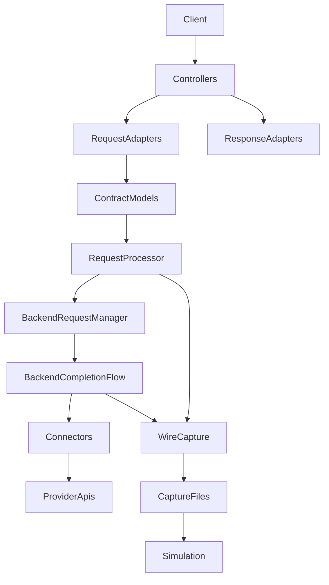
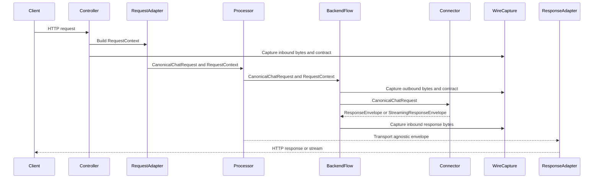

# Design Document

---
**Purpose**: Define the architecture and interface contracts to introduce strict, explicit typed data contracts for cross-layer and cross-domain exchanges while preserving externally observable behavior.
---

## Overview

This design introduces a contract-first boundary strategy for the Universal LLM Proxy to reduce ad hoc `dict` and `Any` usage across layers. The design standardizes canonical types for request payloads, request context, backend targets, streaming chunks, response envelopes, usage metadata, and capture records, and it constrains vendor- and protocol-specific extensions using JSON-serializable typed values.

The primary value is improved maintainability and debuggability: fewer hidden conversions, fewer runtime casts, and fewer “mystery dict” payloads moving between controllers, core services, and connectors. The design preserves external behavior (HTTP schemas, error mapping, streaming semantics, and CBOR capture fidelity) by concentrating representation changes at explicit boundary conversion points.

This feature is delivered incrementally. Phase A is intentionally conservative: it removes implicit cross-layer contracts by making `RequestContext` fields explicit and constraining extension payload typing, while deferring high-blast-radius changes (such as narrowing `ResponseEnvelope.content`) to later phases.

### Goals
- Reduce cross-layer reliance on `Any` and ad hoc `dict[str, Any]` for contract-shaped data.
- Make boundary conversions explicit, bounded, and observable.
- Prefer immutable, copy-on-write contracts for request/response payloads, with additive mutation provenance.
- Preserve client-visible behavior, streaming semantics, and capture compatibility.

### Non-Goals
- Changing public HTTP API schemas or endpoints.
- Rewriting all vendor/protocol translator logic in one step.
- Changing the byte-precise CBOR capture format or semantics.

## Architecture

### Existing Architecture Analysis
- Domain models already exist for key concepts (`CanonicalChatRequest`, `ChatResponse`, `CanonicalStreamChunk`) and use Pydantic v2 immutability via `ValueObject`.
- Streaming already has typed contracts (`StreamingChunk`) and a serializer that prefers typed metadata while retaining fallbacks.
- Several boundary interfaces remain permissive (`Any` or `dict[str, Any]`), notably:
  - Backend completion collaborators (`src/core/interfaces/backend_completion_collaborators.py`)
  - Response processing (`src/core/interfaces/response_processor_interface.py`)
  - Request processor interface legacy inputs (`src/core/interfaces/request_processor_interface.py`)
- `RequestContext` is currently extended via dynamic attributes (`domain_request`, `raw_body`, `backend`) by controllers and services, forcing `type: ignore[attr-defined]` and making the effective contract implicit.

### Canonical Contract Set v1

This section defines the minimum canonical contract set (v1) to avoid implementation drift and parallel representations.

**Canonical payload contracts**
- Inbound request payload: `src/core/domain/chat.py` `CanonicalChatRequest` (canonical), `ChatRequest` (compatibility alias).
- Streaming chunk (internal): `src/core/domain/streaming/streaming_content.py` `StreamingContent` (canonical internal value).
- Streaming chunk (typed boundary): `src/core/domain/streaming/contracts.py` `StreamingChunk` (typed serialization/validation contract).

**Canonical context contracts**
- Request context: `src/core/domain/request_context.py` `RequestContext` with explicit typed fields:
  - `domain_request: CanonicalChatRequest | None`
  - `raw_body: bytes | None`
  - `backend: str | None`
  - `effective_model: str | None`
  - `extensions: dict[str, JsonValue]` (single open extension container; optional in Phase A but required by the policy)

**Canonical routing contract**
- Backend target: introduce a domain `BackendTarget` value object:
  - `backend: str`
  - `model: str`
  - `uri_params: dict[str, JsonValue]`
  - **File placement**: `src/core/domain/backend_target.py`
  - **Primary owners**: backend routing + completion orchestration (`src/core/services/backend_model_resolver.py`, `src/core/services/backend_completion_flow/*`)

**Canonical usage contract (Phase B+)**
- Usage summary: introduce a domain `UsageSummary` value object:
  - `prompt_tokens: int | None`, `completion_tokens: int | None`, `total_tokens: int | None`
  - `extensions: dict[str, JsonValue]` (provider-specific fields)
  - **File placement**: `src/core/domain/usage_summary.py`
  - **Primary owners**: usage/capture accounting (`src/core/services/usage_*`, wire capture orchestrators)

**Response envelopes (Phase B+)**
- `ResponseEnvelope` and `StreamingResponseEnvelope` remain the transport-agnostic carriers.
- Phase A does not narrow `ResponseEnvelope.content`; Phase B+ narrows/standardizes `usage` and `metadata` to avoid `dict[str, Any]`.

### Architecture Pattern & Boundary Map

**Architecture Integration**:
- Selected pattern: Contract-first layered boundaries with compatibility façades.
- Domain boundaries: Canonical contract models live in the domain layer and are referenced across layers; transport and connector layers adapt at the edges.
- Existing patterns preserved: staged init, DI, adapter pattern for connectors, transport-agnostic response envelopes.
- New components rationale: minimal new services focused on contract coercion and context construction, plus interface tightening for collaborator seams.



### Technology Stack

| Layer | Choice / Version | Role in Feature | Notes |
|-------|------------------|-----------------|-------|
| Runtime | Python 3.10+ | Type-hints + dataclasses | Avoid `Any` at boundaries |
| Domain models | Pydantic v2 | Canonical contracts | Use `ValueObject` for immutability |
| JSON-serializable values | `pydantic.types.JsonValue` | Constrain extension payloads | Prefer over `dict[str, Any]` |
| Internal DTOs | `@dataclass(frozen=True, slots=True)` | Performance-sensitive contracts | Mirrors existing CBOR capture models |
| Type checking | mypy | Enforce boundary typing | Keep new ignores out of boundary code |
| Wire capture | CBOR | Fidelity debugging | Preserve byte-precise behavior |

## System Flows



Key flow decisions:
- Boundary conversions occur only in adapters and explicitly defined “coercion” surfaces.
- Streaming conversion must not require buffering solely for typing purposes.

## Requirements Traceability

| Requirement | Summary | Components | Interfaces | Flows |
|-------------|---------|------------|------------|-------|
| 1.1, 1.2, 1.3, 1.4, 1.5 | Preserve external behavior and capture compatibility | Controllers, RequestProcessor, BackendCompletionFlow, WireCapture services | Existing public interfaces remain compatible | Main sequence |
| 2.1, 2.2, 2.3, 2.4, 2.5, 2.6 | Canonical contracts and normalization | Domain contracts, request/response adapters, backend target resolver | New contract types and tightened collaborator seams | Main sequence |
| 3.1, 3.2, 3.3, 3.4 | Typed cross-layer boundaries | Interface tightening, contract coercion service, JSON extension typing | New `IContractCoercionService` and updated interface types | Main sequence |
| 4.1, 4.2, 4.3, 4.4 | Explicit conversion points and reduced churn | Adapter-only conversion policy, “single canonical representation per concept” | Contract mapping interfaces | Main sequence |
| 5.1, 5.2, 5.3, 5.4 | Immutability and additive mutations | Immutable ValueObjects, provenance records, traffic-leg contract snapshots | Provenance and mutation recording interfaces | Main sequence |
| 6.1, 6.2, 6.3 | Validation and error strategy | Contract validation at adapters/coercers, error mapping | Existing `LLMProxyError` hierarchy | Main sequence |
| 7.1, 7.2, 7.3 | Capture integration and round-trip | CBOR capture, deterministic serialization hooks, replay decoding helpers | Capture decoding helpers (new) | Main sequence |
| 8.1, 8.2 | Contributor guidance | Documentation and enforcement hooks | N/A | N/A |

## Components and Interfaces

### Summary Table

| Component | Intent | Requirements | Notes |
|----------|--------|--------------|-------|
| Domain contract models | Provide canonical types for cross-layer exchange | 2.1, 2.2, 3.1, 3.3, 5.1 | Prefer Pydantic v2 ValueObjects |
| Request context contract | Make `RequestContext` an explicit contract (no dynamic attrs) | 2.3, 3.1, 4.1 | Eliminates attr-defined ignores |
| Contract coercion service | Centralize any remaining legacy dict conversion at boundaries | 3.1, 3.2, 6.1 | Transitional compatibility façade |
| Backend collaborator interface tightening | Replace `Any` with canonical types across collaborators | 3.1, 3.2, 4.2 | Enables mypy enforcement |
| Capture decoding helpers | Best-effort decode captured bytes into canonical contracts | 7.2 | Keeps byte fidelity source-of-truth |
| Documentation | Define canonical contract set and allowed conversions | 8.1, 8.2 | Prevent regression to ad hoc dicts |

### DI Registration Strategy
- `IContractCoercionService`: Singleton (only if legacy dict inputs must remain supported at the processor boundary).
- Contract models: Domain-only (no DI).
- Phase A prefers enhancing the existing FastAPI request adapter to populate typed `RequestContext` fields; no DI service required for context construction.

### Domain Model (`src/core/domain/`)

#### Canonical request and response contracts

| Field | Detail |
|-------|--------|
| Intent | Standardize the canonical request and response payload shapes exchanged across layers |
| Requirements | 2.1, 2.2, 2.3, 2.4, 2.5, 3.1 |
| Canonical types | `CanonicalChatRequest`, `ChatResponse`, `ResponseEnvelope`, `StreamingResponseEnvelope` |

**Contract decisions**
- `CanonicalChatRequest` is the canonical cross-layer request payload for core services and connectors.
- `ResponseEnvelope` and `StreamingResponseEnvelope` remain the canonical transport-agnostic return carriers, but their metadata fields must be constrained away from `Any`.

#### JSON extension values

| Field | Detail |
|-------|--------|
| Intent | Constrain vendor- and protocol-specific extensions without using `Any` |
| Requirements | 3.3, 6.1 |
| Contract | `pydantic.types.JsonValue` for values; `dict[str, JsonValue]` for objects |

**Extension-field rule**
- Only a single, explicitly named “extension” container is permitted to remain open-ended; all other cross-layer fields must be typed.
- Extensions must be JSON-serializable and deterministic for capture/debugging purposes.

### DTOs and Envelopes (`src/core/domain/responses.py`)

| Field | Detail |
|-------|--------|
| Intent | Transport-agnostic envelopes for controller adapters | 2.5, 6.1, 7.1 |
| Requirements | 2.5, 3.1, 7.1 |
| Gap | `content`, `usage`, `metadata` are currently `Any` / `dict[str, Any]` |

**Design direction**
- Narrow `usage` and `metadata` to JSON-serializable values (`dict[str, JsonValue]`) or to dedicated typed models with a single extension container.
- Treat `content` as a union of known response types for canonical endpoints (for example `ChatResponse`, `dict[str, JsonValue]`, `bytes`, `str`) rather than unconstrained `Any`.

### Request Context Contract (`src/core/domain/request_context.py`)

| Field | Detail |
|-------|--------|
| Intent | Make cross-layer request context explicit and type-safe | 2.3, 3.1, 4.1 |
| Requirements | 2.3, 3.1, 4.1, 7.1 |
| Current gap | Dynamic attributes used by controllers/services |

**Proposed explicit fields**
- `domain_request: CanonicalChatRequest | None`
- `raw_body: bytes | None`
- `backend: str | None`
- `effective_model: str | None`
- `extensions: dict[str, JsonValue]` (single extension container)

**Rationale**
- These are already implicitly required by cross-layer logic (session resolution, capture, routing) and should not be “hidden” behind dynamic attribute writes.

### Migration Plan: Removing dynamic `RequestContext` attributes (Phase A)

| Current implicit attribute | Known writers | Known readers | Replacement | Phase |
|---|---|---|---|---|
| `context.domain_request` | Controllers (`src/core/app/controllers/*`), `src/core/services/session_enricher.py` | `src/core/services/session_resolver_service.py` and downstream session logic | `RequestContext.domain_request` | A |
| `context.raw_body` | Controllers (`src/core/app/controllers/*`) | Wire capture and debugging | `RequestContext.raw_body` | A |
| `context.backend` | Set indirectly via state/provider; read in request processor via `getattr(context, "backend", None)` | Request processor replacement logic | `RequestContext.backend` | A |

**Adapter change (Phase A)**
- Enhance `src/core/transport/fastapi/request_adapters.py` to populate `RequestContext.domain_request` and `RequestContext.raw_body` (and avoid post-construction dynamic assignments).

**Controller change (Phase A)**
- Replace `ctx.domain_request = ...  # type: ignore[attr-defined]` and `ctx.raw_body = ...` writes with constructor/field assignments to declared `RequestContext` fields.

### Services Layer (`src/core/services/`)

#### ContractCoercionService

| Field | Detail |
|-------|--------|
| Intent | Convert any remaining legacy dict payloads into canonical contracts at a single, explicit boundary | 3.1, 3.2, 6.1 |
| Requirements | 3.1, 3.2, 6.1 |
| Interface | `IContractCoercionService` in `src/core/interfaces/` |
| DI Lifetime | Singleton |

**Responsibilities & Constraints**
- Accept legacy inputs where still supported and produce canonical domain models.
- Validate inputs and raise structured errors consistent with the existing error hierarchy.
- Avoid repeated coercion within a single request lifecycle.

##### Service Interface
```python
from abc import ABC, abstractmethod
from typing import Any

from src.core.domain.chat import CanonicalChatRequest

class IContractCoercionService(ABC):
    @abstractmethod
    def coerce_inbound_request(self, request_data: Any) -> CanonicalChatRequest:
        """Convert legacy request payloads into CanonicalChatRequest."""
        ...
```

##### DI Registration (in Processor stage)
```python
def _factory(provider):
    return ContractCoercionService()

services.add_singleton(IContractCoercionService, implementation_factory=_factory)
```

### Backend Completion Flow Collaborators (`src/core/interfaces/backend_completion_collaborators.py`)

| Field | Detail |
|-------|--------|
| Intent | Replace collaborator `Any` signatures with canonical types | 3.1, 3.2, 4.2 |
| Requirements | 3.1, 3.2, 4.2 |
| Current gap | Many methods accept/return `Any` |

**Design direction**
- Collaborator interfaces should accept `CanonicalChatRequest` and `RequestContext` where applicable, and return typed target contracts rather than `Any`.
- `ResolvedTarget.uri_params` should be constrained from `dict[str, Any]` to `dict[str, JsonValue]`.

### Streaming Contracts

| Field | Detail |
|-------|--------|
| Intent | Ensure a single canonical streaming chunk representation across internal boundaries | 2.2, 4.2, 5.4 |
| Requirements | 2.2, 4.2, 5.4, 7.3 |
| Existing assets | `StreamingChunk`, `StreamingContent`, `SSESerializer` |

**Canonical choice**
- `StreamingContent` is the canonical internal representation flowing through streaming processors.
- `StreamingChunk` is the typed serialization contract used by the serializer and as a validation boundary.

**Rationale (typing vs performance)**
- `StreamingContent` is a lightweight dataclass already used as the “unified representation” for streaming chunks. Keeping it canonical minimizes conversion overhead in hot streaming paths.
- `StreamingChunk` provides strong schema validation at the boundaries where correctness matters (serialization, error envelopes, done markers) without forcing all internal processors to pay the cost of Pydantic model materialization per chunk.

**Compatibility rule**
- `StreamingResponseEnvelope.content` must yield a stream of typed or canonicalizable items that can be normalized to `StreamingContent` without buffering.

### Capture and Replay

| Field | Detail |
|-------|--------|
| Intent | Preserve byte fidelity while enabling contract-level replay diagnostics | 7.1, 7.2, 7.3 |
| Requirements | 7.1, 7.2, 7.3 |

**Design direction**
- Treat raw bytes as the capture source-of-truth.
- Provide best-effort decoding helpers that parse captured JSON bytes into canonical domain models (request/response) for simulation tooling.
- Ensure any canonical contract serialization used for debugging is deterministic enough for diffing (stable key ordering where applicable).

## Data Models

### Domain Model
- Prefer `ValueObject` for payload contracts that must be immutable (requests, responses, canonical stream chunks).
- Prefer dataclasses for internal DTOs that require low overhead (capture entries).
- Constrain extension containers to JSON-serializable values (`JsonValue`).

### Data Contracts and Integration
- Controller inputs are converted to canonical request contracts before invoking core processing services.
- Connector inputs are canonical domain request contracts; provider request payloads are created only inside connectors.

## Error Handling

### Error Strategy
- Contract validation failures at boundary conversion points map to existing structured errors and HTTP adapters.
- Fail-open semantics for best-effort side effects remain unchanged; typed contract introduction must not turn best-effort behavior into hard failures.

## Testing Strategy

### Unit Tests
- Contract coercion: legacy inputs convert deterministically and fail with structured validation errors.
- Request context construction: typed fields exist without using dynamic attribute writes.
- Streaming normalization: typed chunk conversion and done-marker behavior remain stable.

### Integration Tests
- Controller to processor to backend flow uses canonical contracts and preserves response schemas.
- Wire capture emits compatible CBOR and can be inspected as before.

## Integration and Migration Notes

This feature is designed to be delivered in phases while preserving external behavior:
- Phase A (safe): Make `RequestContext` explicit (remove dynamic attribute usage) and constrain extension containers to JSON-serializable types (`JsonValue`), without narrowing `ResponseEnvelope.content`.
- Phase B: Introduce `BackendTarget` and `UsageSummary` contracts and tighten collaborator and connector-facing interfaces using canonical types (with compatibility overloads where needed).
- Phase C: Converge remaining parallel representations (usage metadata, response envelope metadata typing, and streaming adapter boundaries) and remove redundant conversions.

## Contributor Guidance Deliverable

**Artifact**: Add `docs/development_guide/typed-data-contracts.md`

**Minimum outline**
- Canonical Contract Set v1 (with pointers to source-of-truth types)
- Allowed boundary conversion points (transport↔domain, domain↔connector, domain↔capture/replay)
- Extension-field policy (single extension container; `JsonValue` only)
- Promotion process (how to turn an extension key into a typed model field)
- Examples (before/after signatures for interfaces; how to avoid `Any` across seams)

**Guardrails (lightweight enforcement)**
- PR checklist for boundary changes:
  - No new `Any` in `src/core/interfaces/` signatures for cross-layer seams.
  - No new `dict[str, Any]` for contract-shaped payloads across layers; use `JsonValue` or a named contract.
  - No new `type: ignore` in boundary modules; if unavoidable, document rationale and add a follow-up task.
- Local validation commands (developer workflow):
  - `rg -n "dict\\[str, Any\\]" src/core/interfaces src/core/domain src/core/transport | head`
  - `rg -n "\\bAny\\b" src/core/interfaces | head`
  - Run mypy for affected areas to ensure no new boundary ignores are required.
- CI hook (optional, minimal):
  - Add a fast grep step that fails on introducing `dict[str, Any]` in boundary modules listed above, with an allowlist for clearly-non-contract internal contexts.

## Open Questions and Risks
- Whether `ResponseEnvelope.content` should be narrowed to a small explicit union or represented as a generic typed envelope (deferred to Phase B+ for safety).
- Which `extra_body` keys should be promoted into first-class typed models vs remaining as JSON-typed extensions.
- How far to tighten public interfaces without breaking test seams or legacy call sites.
