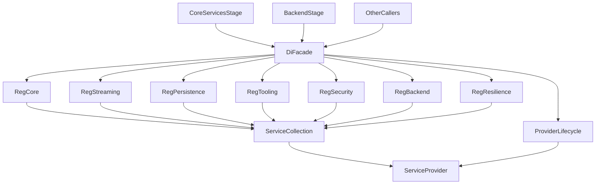
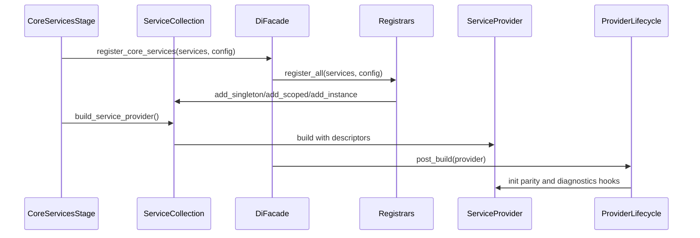

# Design Document: `di-services-god-object-refactoring`

## Overview
This design refactors the DI registration layer currently concentrated in `src/core/di/services.py` into cohesive, feature-scoped registration modules while preserving the existing staged initialization and runtime behavior of the proxy.

The primary value delivered is maintainability: a smaller, discoverable composition root that aligns with the project’s staged initialization, interface-first boundaries, and SOLID/DRY expectations. The refactor is explicitly brownfield-safe: public DI entry points remain stable while internal wiring is reorganized.

## Goals
- Decompose DI registration into cohesive, feature-scoped modules that are easy to locate and modify.
- Preserve behavioral compatibility: existing stages, controllers, and services resolve the same effective implementations and lifetime semantics.
- Provide actionable DI resolution errors (including the resolution path) when diagnostics are enabled.
- Enforce maintainability gates for DI modules: `<600 LOC` and `<50` max function CC.

## Non-Goals
- Changing business logic or request/response behavior outside DI wiring.
- Re-architecting the DI container into a third-party library or framework.
- Eliminating all global service-locator accessors in one step (compatibility is preserved first).

## Architecture

### Existing Architecture Analysis
- DI container runtime: `ServiceCollection` / `ServiceProvider` in `src/core/di/container.py`.
- Bulk wiring and global provider access: `src/core/di/services.py`.
- Staged startup is the bootstrapping source of truth: `src/core/app/stages/`.
- Known integration hotspot: `src/core/app/stages/backend.py` imports `_resolve_failure_strategy` from `src/core/di/services.py` and contains early-startup validation logic.

The current `src/core/di/services.py` mixes:
- DI registration (composition root)
- global provider lifecycle and “self-healing”
- post-build feature parity initialization
- helper logic used by stages

### Architecture Pattern & Boundary Map
**Selected pattern**: “Facade composition root + feature-scoped registrars”

- `src/core/di/services.py` remains a public facade for stable imports.
- Registrations move into `src/core/di/registrations/` modules grouped by feature area.
- Global provider lifecycle and post-build hooks move into a dedicated module to keep registrars pure.
- Stages import stable helpers from dedicated helper modules (no private helper imports from the facade).



### Registration Order Contract (Stage Alignment)
This refactor preserves staged initialization as the startup source of truth and defines a deterministic registration order to prevent subtle override/lifetime regressions.

**Invocation points**
- `CoreServicesStage.execute(...)` remains the primary call site for `register_core_services(services, config)`.
- Legacy/compat paths (e.g., `ServiceCollection.register_app_services(...)`, global `get_service_collection()` bootstrap) must delegate to the same registrar orchestrator to avoid drift, but must not re-order registrar execution.

**Registrar call order (deterministic)**
1. `registrations/core.py`
2. `registrations/streaming.py`
3. `registrations/persistence.py`
4. `registrations/security.py`
5. `registrations/tooling.py`
6. `registrations/backend.py`
7. `registrations/resilience.py`

**Registrar dependency direction (must not be violated)**
- `core` provides config/session/app-state primitives and must not import downstream features.
- `streaming`, `persistence`, `security`, `tooling` may depend on `core`.
- `backend` may depend on `core`, `security`, and `tooling` (for safety/observability hooks), but must not depend on `resilience` concrete implementations.
- `resilience` may depend on `backend` and the backend-completion-flow interfaces, but must not depend on `controllers` or transport.

**Idempotency / non-overriding rule**
- Registrars must not override existing descriptors registered by earlier registrars or by stages.
- All registrars use a shared `register_if_absent(...)` helper (see `_shared.py`) to enforce “first registration wins” unless a deliberate, documented exception exists.

### Technology Stack & Alignment

| Layer | Choice / Version | Role in Feature | Notes |
|-------|------------------|-----------------|-------|
| Runtime | Python 3.10+ | Implementation language | Type hints required (`disallow_untyped_defs=true`) |
| DI Container | `src/core/di/container.py` | Registration + resolution | Singleton/Scoped/Transient semantics preserved |
| Initialization | Staged init (`src/core/app/stages/`) | Startup ordering | `CoreServicesStage` remains the primary hook |
| Quality Gates | Ruff + `scripts/analyze_complexity.py` | CC/LOC enforcement | Add DI scope to validator; enable Ruff mccabe config |

## System Flows

### Startup registration and provider build


## Requirements Traceability

| Requirement | Summary | Components | Interfaces | Flows |
|-------------|---------|------------|------------|-------|
| 1.1 | Staged init succeeds after refactor | `src/core/di/services.py`, registrars, stages | `ServiceCollection`, `IServiceProvider` | Startup registration |
| 1.2 | Same effective implementations + lifetimes | Registrars + shared registration helpers | Existing `I*` interfaces | Startup registration |
| 1.3 | Actionable missing-service error w resolution path | DI diagnostics component | `ServiceResolutionError` | Startup + runtime resolution |
| 1.4 | Tests pass without DI regressions | DI test harness + existing tests | N/A | CI/test execution |
| 2.1 | Decompose into cohesive modules | `src/core/di/registrations/*` | N/A | N/A |
| 2.2 | Dedicated entry points per feature area | Registrar module layout | N/A | N/A |
| 2.3 | No import-time I O / DB opens / side effects | Registrar constraints + lifecycle module | N/A | N/A |
| 2.4 | No new circular imports | Registrar dependency rules + local imports | N/A | N/A |
| 3.1 | DI layer is composition-only | Registrar responsibility boundaries | N/A | N/A |
| 3.2 | Interface-first registrations | Registrars enforce `I* -> Impl` bindings | `src/core/interfaces/*` | N/A |
| 3.3 | Disabled optional features do not block startup | Config-gated registrars | `AppConfig` | Startup registration |
| 4.1 | No DI module exceeds 600 LOC | Registrar granularity + validator | N/A | N/A |
| 4.2 | DI modules pass max CC 50 | Ruff mccabe config + validator | N/A | N/A |
| 4.3 | Minimize duplication | Shared registration helpers | N/A | N/A |

## Components and Interfaces

### DI Registration Layer (`src/core/di/`)

#### `src/core/di/services.py` (Compatibility Facade)

| Field | Detail |
|-------|--------|
| Intent | Preserve stable DI entry points while delegating to registrars |
| Requirements | 1.1, 1.2, 2.1, 2.2 |
| Interface | N/A (module facade) |
| DI Lifetime | N/A |

**Responsibilities & Constraints**
- Must remain small and stable: exports existing public functions without changing call signatures.
- Must not contain bulk registrations; delegates to registrars.
- Must not import heavy feature modules at import time; use local imports in registrar functions.

**Public API contract (stable)**
- `get_service_collection() -> ServiceCollection`
- `register_core_services(services: ServiceCollection, app_config: AppConfig | None = None) -> None`
- `get_or_build_service_provider() -> IServiceProvider`
- `get_service_provider() -> IServiceProvider`
- `set_service_provider(provider: IServiceProvider | None) -> None`
- `get_service(...)`, `get_required_service(...)`

#### `src/core/di/provider_lifecycle.py` (Global Provider Lifecycle + Post-Build Hooks)

| Field | Detail |
|-------|--------|
| Intent | Own global provider/collection state and post-build initialization in one place |
| Requirements | 1.1, 1.3, 2.3 |
| Interface | N/A |
| DI Lifetime | N/A |

**Responsibilities & Constraints**
- Own `_service_collection` and `_service_provider` globals (compatibility).
- Implement “post-build” hooks that are not pure registration (feature parity init, optional self-healing).
- Keep logic small; do not depend on feature modules except through narrow helper imports.

**Technical debt removal**
- The refactor removes the current “self-healing” behavior where `get_service_provider()` re-registers services and rebuilds the provider if selected components are missing.
- After the refactor, `get_service_provider()` returns the built provider as-is; missing registrations are treated as configuration/bootstrapping defects and are caught by DI integrity tests (and by improved diagnostics when enabled).

#### `src/core/di/registrations/*` (Feature-Scoped Registrars)

Each registrar module exposes:
```python
def register(services: ServiceCollection, app_config: AppConfig | None) -> None: ...
```

Registrar modules are pure composition:
- No network I/O.
- No DB connections opened at import time or inside `register(...)`.
- Imports of feature implementations occur inside `register(...)` (and inside config-gated branches) to avoid circular imports and to support optional-feature behavior.

**Proposed registrar set (subject to design review)**
- `registrations/core.py`: `AppConfig`, session, command pipeline, application state, app settings
- `registrations/streaming.py`: streaming pipeline, middleware manager, response processor wiring
- `registrations/persistence.py`: database config/engine, repositories, memory subsystem wiring
- `registrations/tooling.py`: tool call reactor subsystem wiring, pytest compression, dangerous commands
- `registrations/security.py`: sandboxing, path validation, unified tool security wiring
- `registrations/backend.py`: backend registry/factory/service, translation service, routing wiring
- `registrations/resilience.py`: failover, rate limiting, failure strategy wiring, backend completion flow collaborators

#### Shared Registration Helpers (`src/core/di/registrations/_shared.py`)

| Field | Detail |
|-------|--------|
| Intent | Provide shared idempotent registration utilities and reduce duplication |
| Requirements | 1.2, 4.3 |
| Interface | N/A |
| DI Lifetime | N/A |

**Responsibilities**
- Idempotent wrappers that preserve existing “register if missing” behavior.
- Centralized “register concrete + interface alias” patterns.
- Diagnostic logging hooks (debug only).

### DI Diagnostics (resolution path)

#### `src/core/di/diagnostics.py`

| Field | Detail |
|-------|--------|
| Intent | Provide resolution tracing and actionable error output when enabled |
| Requirements | 1.3 |
| Interface | `ServiceResolutionError` enrichment |
| DI Lifetime | N/A |

**Behavior contract**
- When DI diagnostics are enabled, the container records a per-resolution “resolution stack” of service types being constructed.
- The stack must be concurrency-safe across async tasks and threads; use `contextvars` to avoid leakage between concurrent resolutions.

**Error shaping rules (deterministic, actionable)**
- Missing descriptor:
  - `get_service(T)` returns `None` (existing behavior).
  - `get_required_service(T)` raises `ServiceResolutionError` with:
    - message: `"No service registered for <TypeName>"`
    - `details` includes:
      - `missing_service`: `<TypeName>`
      - `resolution_path`: list of type names from the current stack, ending with `<TypeName>`
      - `diagnostics_enabled`: `true`
- Scoped-from-root misuse:
  - Resolving a scoped service from the root provider must raise `ServiceResolutionError` (not a raw `RuntimeError`) when diagnostics are enabled, with:
    - `details.reason = "scoped_service_from_root"`
    - `details.resolution_path` set as above
- Factory/constructor failures:
  - If an `implementation_factory` (or constructor) raises, wrap it in `ServiceResolutionError` when diagnostics are enabled, preserving the original exception as `__cause__`, with:
    - `details.reason = "factory_exception"`
    - `details.error_type` / `details.error_message`
    - `details.resolution_path`

**Resolution path format**
- `resolution_path` is a list of service type names (`__name__` when available, else `str(type)`), ordered from the outermost requested service to the failing dependency.

**Activation**
- Gated behind existing `DI_STRICT_DIAGNOSTICS` (or a dedicated diagnostic flag) to avoid overhead by default.

### Stage Integration Hotspots

#### Failure strategy helper (avoid private helper imports)
`src/core/app/stages/backend.py` currently imports `_resolve_failure_strategy` from `src/core/di/services.py`.

**Design contract**
- Provide a stable helper in a dedicated module (for example `src/core/di/registration_helpers/failure_handling.py`) that both:
  - the resilience registrar uses during DI registration, and
  - `BackendStage` may use during early validation paths.

This breaks the direct dependency on a private symbol inside the facade and supports modularization.

## Error Handling

### Error Strategy
- Missing services must continue to raise `ServiceResolutionError` (extends `LLMProxyError`).
- When diagnostics are enabled, include resolution path details (see 1.3) without changing the public exception type.
- No bare `except Exception` in new DI modules; targeted exception handling only.

## Testing Strategy

### Test Organization
Reuse existing DI test coverage as regression gates:
- `tests/unit/core/di/test_service_registration.py`
- `tests/integration/test_di_container_integrity.py`
- `tests/regression/test_backend_service_di_regression.py`

### New/Updated Test Coverage (design intent)
- Registrar smoke tests: ensure each registrar can be called on an empty `ServiceCollection` without import errors and with deterministic registration outcomes.
- Registration parity tests (targeted): snapshot a curated set of high-risk services (e.g., `IBackendService`, streaming pipeline entry points, tool-call reactor) to verify:
  - interface-to-implementation bindings
  - lifetimes (singleton/scoped/transient)
- Diagnostics tests: when diagnostics enabled, missing-service errors include a resolution path.

## Quality Gates (LOC + CC)

### LOC
- Enforcement via `scripts/analyze_complexity.py` by adding a DI refactor “scope” function and validator mode aligned to `<600 LOC` per module.

### Cyclomatic Complexity
- Primary enforcement uses `scripts/analyze_complexity.py` (threshold `<50` max function CC).

**Concrete repo hooks**
- Extend `scripts/analyze_complexity.py` with:
  - `get_di_services_scope_files(...)` to define the DI refactor scope
  - `validate_di_services_refactor_scope()` to validate `<600 LOC` and `<50` max function CC
  - CLI flag: `--validate-di-services-scope`
- Proposed DI refactor scope patterns:
  - `src/core/di/services.py` (facade)
  - `src/core/di/provider_lifecycle.py`
  - `src/core/di/diagnostics.py`
  - `src/core/di/registrations/**/*.py`
  - `src/core/di/registration_helpers/**/*.py` (if introduced)

**How to run**
```text
./.venv/Scripts/python.exe scripts/analyze_complexity.py --validate-di-services-scope
```

## Integration & Migration Notes
- Phased extraction (recommended):
  1. Introduce registrars and move registrations section-by-section from `src/core/di/services.py`.
  2. Keep facade exports stable; update stages only where they import private helpers.
  3. Align `ServiceCollection.register_app_services(...)` (legacy path) to call the same registrars to avoid drift.
  4. Introduce/enforce LOC/CC gates once files are split to prevent regressions.

## Risks & Mitigations
- Risk: subtle lifetime changes during extraction - Mitigation: parity tests for curated critical services + preserve current registration order initially.
- Risk: circular import regressions - Mitigation: registrar dependency rules + local imports within `register(...)`.
- Risk: early-startup validation paths diverge from final DI wiring - Mitigation: dedicate stable helper modules for shared wiring logic used in both staged init and early validation.
