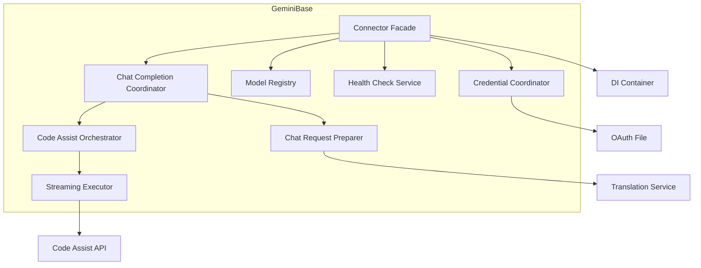
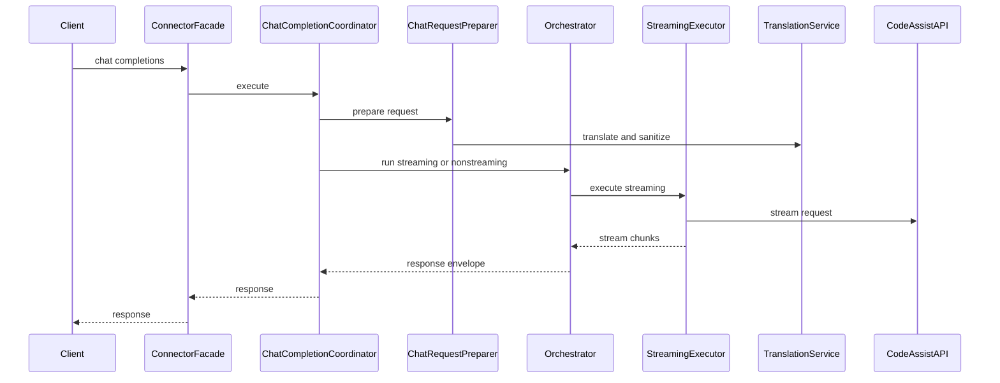

# Design Document

## Overview
This design refactors the Gemini base connector into a thin facade that composes focused internal services while preserving external behavior, registration, and compatibility contracts. The refactor reduces `connector.py` size and isolates responsibilities for credentials, health checks, model discovery, and request orchestration.

The primary users are backend maintainers and contributors who need clearer boundaries for testing and extension. The impact is an internal reorganization of `src/connectors/gemini_base/` without changes to public endpoints, response shapes, or backend registration semantics.

### Goals
- Reduce `src/connectors/gemini_base/connector.py` responsibilities to orchestration only.
- Enforce separation of concerns and SOLID boundaries for credential, model, health, and chat flow logic.
- Preserve observable behavior, error mapping, and streaming semantics.

### Non-Goals
- Introducing new backend features or API surface changes.
- Changing routing, resilience, or wire capture behavior in core services.
- Adding new external dependencies or altering configuration schema.

## Requirements Traceability

| Requirement | Summary | Components | Interfaces | Flows |
| --- | --- | --- | --- | --- |
| 1.1 | Decompose responsibilities into discrete modules | GeminiCredentialCoordinator, GeminiModelRegistry, GeminiHealthCheckService, GeminiChatCompletionCoordinator | ICredentialCoordinator, IModelRegistry, IHealthCheckService, IChatCompletionCoordinator | Chat completion flow |
| 1.2 | Separate modules for request, response, streaming, error mapping, auth | ChatRequestPreparer, StreamingExecutor, StreamingResponseAccumulator, GeminiErrorMapper, GeminiCredentialCoordinator | IErrorMapper, ICredentialCoordinator | Chat completion flow |
| 1.3 | Changes isolated to corresponding module | All new services and facade | Service interfaces | N/A |
| 1.4 | Optional features encapsulated | GeminiVtcWrapperBuilder, ThoughtSignatureService | IVtcWrapperBuilder, IThoughtSignatureService | Streaming flow |
| 1.5 | Thin orchestration entrypoint | GeminiOAuthBaseConnector | LLMBackend | Chat completion flow |
| 2.1 | Preserve backend type and config surface | GeminiOAuthBaseConnector | LLMBackend | Initialization flow |
| 2.2 | Preserve response schema and status mapping | GeminiChatCompletionCoordinator, StreamingResponseAccumulator, ResponsePostProcessor | IChatCompletionCoordinator, IResponsePostProcessor | Chat completion flow |
| 2.3 | Preserve streaming ordering and termination | StreamingExecutor, CodeAssistOrchestrator | ICodeAssistOrchestrator | Streaming flow |
| 2.4 | Preserve error mapping | GeminiErrorMapper, StreamingExecutor | IErrorMapper | Chat completion flow |
| 2.5 | Preserve backend registration | gemini_oauth_* registration | BackendRegistry | N/A |
| 3.1 | Expose interface boundaries | ICredentialCoordinator, IModelRegistry, IHealthCheckService, IChatCompletionCoordinator, IErrorMapper, IVtcWrapperBuilder, ICodeAssistOrchestrator | Protocols in gemini_base | N/A |
| 3.2 | Subcomponents via DI or factory wiring | GeminiOAuthBaseConnector service resolution, ServiceCollection | IServiceProvider | N/A |
| 3.3 | Depend on abstractions | Facade uses interfaces | Protocols in gemini_base | N/A |
| 3.4 | Reuse shared services | TranslationService, ResponsePostProcessor | Existing interfaces | Chat completion flow |
| 4.1 | Unit-testable subcomponents | New services and existing helpers | Service interfaces | N/A |
| 4.2 | Accept test doubles | DI-friendly constructors | Service interfaces | N/A |
| 4.3 | Avoid duplicate logic | Centralized coordinator services | Service interfaces | N/A |
| 4.4 | connector.py limited to orchestration | GeminiOAuthBaseConnector | LLMBackend | Chat completion flow |

## Architecture

### Existing Architecture Analysis
- The Gemini base connector already uses extracted helpers (`ChatRequestPreparer`, `StreamingExecutor`, `CodeAssistOrchestrator`) but still coordinates credentials, model discovery, health checks, and streaming selection in a single class.
- Backend registration is class-based via `backend_registry.register_backend(...)` and is executed at import time in `src/connectors/gemini_oauth_*.py`.
- Tests assert specific method names and behaviors in the connector, so facade compatibility is mandatory.

### Architecture Pattern & Boundary Map



**Architecture Integration**:
- Selected pattern: Facade plus service composition with existing strategy interfaces.
- Domain boundaries: connector facade remains the only public entrypoint; coordinator services own specialized state and logic.
- Existing patterns preserved: adapter pattern (`LLMBackend`), strategy protocols, staged initialization, DI conventions.
- New components rationale: isolate credential lifecycle, model registry, health checks, and chat orchestration for testability.
- DI integration: resolve optional services via `get_service_provider()` when available, with fallback to local defaults to preserve current backend factory behavior.
- Steering compliance: SOLID boundaries, DRY reuse of existing helpers, and DI seams for testing.

### Technology Stack & Alignment

| Layer | Choice / Version | Role in Feature | Notes |
| --- | --- | --- | --- |
| Runtime | Python 3.10+ | Connector runtime | Async for I/O paths |
| Connectors | `src/connectors/base.LLMBackend` | Backend adapter | Preserve public interface |
| DI Container | `src/core/di/container.py` | Optional service wiring | Use for interface bindings |
| HTTP Client | httpx (async) | Gemini API access | No change in usage |
| Observability | structlog, CBOR capture | Logging and captures | Preserve payload shapes |

## System Flows



Flow decisions: streaming and non-streaming paths both use the streaming executor, with accumulation for non-streaming responses to preserve existing behavior.

## Components & Interface Contracts

### Component Summary
| Component | Layer | Intent | Req Coverage | DI Lifetime | Contracts |
| --- | --- | --- | --- | --- | --- |
| GeminiOAuthBaseConnector | `src/connectors/` | Public facade and orchestration entrypoint | 1.5, 2.1, 2.5, 4.4 | N/A | Service |
| GeminiCredentialCoordinator | `src/connectors/gemini_base/` | Credential validation, refresh, and file watching | 1.1, 1.3, 2.4, 4.1, 4.2 | Transient | Service |
| GeminiModelRegistry | `src/connectors/gemini_base/` | Model discovery, mapping, and validation | 1.1, 2.1, 2.2 | Transient | Service |
| GeminiHealthCheckService | `src/connectors/gemini_base/` | Health check and readiness gating | 1.1, 2.4 | Transient | Service |
| GeminiChatCompletionCoordinator | `src/connectors/gemini_base/` | Chat flow orchestration | 1.2, 2.2, 2.3, 4.1 | Transient | Service |
| GeminiErrorMapper | `src/connectors/gemini_base/` | Error mapping and normalization | 1.2, 2.4, 4.1 | Transient | Service |
| GeminiVtcWrapperBuilder | `src/connectors/gemini_base/` | Build optional VTC streaming wrapper | 1.4, 4.1 | Transient | Service |
| Existing helpers | `src/connectors/gemini_base/` | ChatRequestPreparer, CodeAssistOrchestrator, StreamingExecutor, StreamingResponseAccumulator | 1.2, 2.2, 2.3 | Existing | Service |

**DI Registration Strategy**:
- Register coordinator interfaces and default implementations in `BackendStage` or `src/core/di/registrations/_backend/` modules.
- Use a connector-local resolver that calls `get_service_provider()` to fetch optional services when the DI container is available; fall back to default constructors when not registered.
- Use transient lifetimes for per-connector state and singleton lifetimes for stateless shared utilities (token estimator, auth provider).

**Connector Service Resolution**:
- Source: `get_service_provider()` from `src/core/di/services.py` (pattern already used in connector code paths).
- Behavior: resolve optional services if registered, otherwise instantiate in `GeminiOAuthBaseConnector` to preserve backend registry behavior.

### Connectors Layer (`src/connectors/`)

#### GeminiOAuthBaseConnector

| Field | Detail |
| --- | --- |
| Intent | Backend facade that preserves public interface and delegates to coordinators |
| Base Class | `LLMBackend` |
| Backend Type | `backend_type = "gemini-oauth-*"` |

**Responsibilities & Constraints**
- Expose stable public methods (`initialize`, `chat_completions`, `_chat_completions_code_assist`, `_chat_completions_code_assist_streaming`).
- Delegate to internal services without changing observable behavior.
- Preserve backend registration and type naming.

**Dependencies (via DI)**
| Dependency | Direction | Criticality |
| --- | --- | --- |
| ICredentialCoordinator | Outbound | P0 |
| IModelRegistry | Outbound | P1 |
| IHealthCheckService | Outbound | P1 |
| IChatCompletionCoordinator | Outbound | P0 |
| IVtcWrapperBuilder | Outbound | P1 |
| TranslationService | Outbound | P0 |

**Contracts**: Service [x]

**Implementation Notes**
- Integration: Maintain existing constructor signature and resolve optional services via `get_service_provider()` when available.
- Validation: Keep runtime credential validation before chat completions.
- Risks: Reflection-based tests require method names and call patterns to remain stable.

### Gemini Base Components (`src/connectors/gemini_base/`)

#### GeminiCredentialCoordinator

| Field | Detail |
| --- | --- |
| Intent | Coordinate credential loading, validation, refresh, and file watching |
| Requirements | 1.1, 1.3, 2.4, 4.1, 4.2 |
| Interface | `ICredentialCoordinator` in `src/connectors/gemini_base/interfaces.py` |
| DI Lifetime | Transient |

**Responsibilities & Constraints**
- Own the initialization pipeline for credentials (validate, load, refresh, watch).
- Encapsulate file watcher state and token manager coordination.
- Provide a typed credential state boundary for other services.

**Dependencies (via DI)**
| Dependency | Direction | Criticality |
| --- | --- | --- |
| CredentialLoader | Outbound | P0 |
| TokenManager | Outbound | P0 |
| FileWatcher | Outbound | P1 |

**Contracts**: Service [x]

##### Service Interface
```python
from abc import ABC, abstractmethod

from src.connectors.gemini_base.models import GeminiOAuthCredentials

class ICredentialCoordinator(ABC):
    @abstractmethod
    async def initialize(self, *, gemini_cli_oauth_path: str | None) -> None:
        """Load credentials and set initial health state."""
        ...

    @abstractmethod
    async def validate_runtime(self) -> bool:
        """Return True when credentials are valid for request execution."""
        ...

    @abstractmethod
    async def refresh_if_needed(self, *, force_reload: bool = False) -> bool:
        """Refresh access token if required and return success."""
        ...

    @property
    @abstractmethod
    def credentials(self) -> GeminiOAuthCredentials | None:
        """Return the current credential payload."""
        ...
```
- Preconditions: Credentials have been loaded or a refresh attempt has been made.
- Postconditions: Credential state and watcher state are consistent.
- Invariants: Access token presence implies non-expired credentials.

**Implementation Notes**
- Integration: Wrap existing `CredentialLoader`, `TokenManager`, and `FileWatcher` logic.
- Validation: Surface validation errors through existing `AuthenticationError` and `BackendError` types.
- Risks: File watcher scheduling must remain thread-safe.

#### GeminiModelRegistry

| Field | Detail |
| --- | --- |
| Intent | Discover, cache, and validate Gemini model identifiers |
| Requirements | 1.1, 2.1, 2.2 |
| Interface | `IModelRegistry` in `src/connectors/gemini_base/interfaces.py` |
| DI Lifetime | Transient |

**Responsibilities & Constraints**
- Load models via API discovery with a fallback list.
- Maintain public to internal model alias mapping.
- Provide fast validation with cached sets.

**Dependencies (via DI)**
| Dependency | Direction | Criticality |
| --- | --- | --- |
| IModelDiscoveryStrategy | Outbound | P1 |
| IEndpointConfig | Outbound | P1 |
| ICredentialCoordinator | Inbound | P0 |

**Contracts**: Service [x]

##### Service Interface
```python
from abc import ABC, abstractmethod

class IModelRegistry(ABC):
    @abstractmethod
    async def ensure_loaded(self) -> None:
        """Load models if not already cached."""
        ...

    @abstractmethod
    def validate(self, model_name: str) -> None:
        """Raise if the model is unavailable for this backend."""
        ...

    @abstractmethod
    def to_public_name(self, model_name: str) -> str:
        """Map internal names to public aliases when required."""
        ...

    @abstractmethod
    def to_internal_name(self, model_name: str) -> str:
        """Map public aliases to internal names when required."""
        ...

    @abstractmethod
    def list_public_models(self) -> list[str]:
        """Return vendor-prefixed models for routing."""
        ...
```
- Preconditions: Credentials are valid when API discovery is attempted.
- Postconditions: Model cache is populated or fallback is applied.
- Invariants: Cached set mirrors `available_models` list.

**Implementation Notes**
- Integration: Use existing `ApiModelDiscovery` and model validation helpers.
- Validation: Preserve vendor prefix behavior and alias mapping.
- Risks: Avoid blocking on API discovery during request execution.

#### GeminiHealthCheckService

| Field | Detail |
| --- | --- |
| Intent | Perform initial health check and readiness gating |
| Requirements | 1.1, 2.4 |
| Interface | `IHealthCheckService` in `src/connectors/gemini_base/interfaces.py` |
| DI Lifetime | Transient |

**Responsibilities & Constraints**
- Execute first-use health checks with existing endpoints.
- Record health-checked state without altering connector health semantics.

**Dependencies (via DI)**
| Dependency | Direction | Criticality |
| --- | --- | --- |
| ICredentialCoordinator | Inbound | P0 |
| IEndpointConfig | Outbound | P1 |
| httpx.AsyncClient | External | P1 |

**Contracts**: Service [x]

##### Service Interface
```python
from abc import ABC, abstractmethod

class IHealthCheckService(ABC):
    @abstractmethod
    async def ensure_healthy(self) -> None:
        """Perform first use health check if needed."""
        ...
```
- Preconditions: Credentials are valid or have been refreshed.
- Postconditions: Health check state is updated.
- Invariants: A failed health check does not invalidate valid credentials.

**Implementation Notes**
- Integration: Reuse existing health check logic and endpoints.
- Validation: Maintain existing warning and logging behavior.
- Risks: Avoid changing error types returned to callers.

#### GeminiChatCompletionCoordinator

| Field | Detail |
| --- | --- |
| Intent | Orchestrate streaming and non-streaming chat completion flow |
| Requirements | 1.2, 2.2, 2.3, 4.1 |
| Interface | `IChatCompletionCoordinator` in `src/connectors/gemini_base/interfaces.py` |
| DI Lifetime | Transient |

**Responsibilities & Constraints**
- Select streaming or non-streaming path based on request.
- Delegate preparation, execution, and response accumulation.
- Preserve response envelopes and streaming chunk order.

**Dependencies (via DI)**
| Dependency | Direction | Criticality |
| --- | --- | --- |
| ChatRequestPreparer | Outbound | P0 |
| ICodeAssistOrchestrator | Outbound | P0 |
| StreamingResponseAccumulator | Outbound | P1 |
| IErrorMapper | Outbound | P1 |

**Contracts**: Service [x]

##### Service Interface
```python
from abc import ABC, abstractmethod
from src.core.domain.chat import CanonicalChatRequest, ChatMessage
from src.core.domain.responses import ResponseEnvelope, StreamingResponseEnvelope

class IChatCompletionCoordinator(ABC):
    @abstractmethod
    async def execute(
        self,
        request_data: CanonicalChatRequest,
        processed_messages: list[ChatMessage],
        *,
        effective_model: str,
    ) -> ResponseEnvelope | StreamingResponseEnvelope:
        """Return a streaming or non-streaming response envelope."""
        ...
```
- Preconditions: Credential validation and health checks are completed.
- Postconditions: Response envelopes match existing behavior.
- Invariants: Streaming responses preserve chunk order and termination.

**Implementation Notes**
- Integration: Use `CodeAssistOrchestrator` as the `ICodeAssistOrchestrator` implementation and keep `StreamingExecutor` unchanged.
- Validation: Keep rate limit and auth retry semantics intact.
- Risks: Avoid altering streaming error payload formatting.
 - Integration: Facade normalizes `processed_messages` into `ChatMessage` instances before delegation.

#### CodeAssistOrchestrator (Existing)

| Field | Detail |
| --- | --- |
| Intent | Own streaming and non-streaming orchestration with post-processing |
| Requirements | 2.3 |
| Interface | `ICodeAssistOrchestrator` in `src/connectors/gemini_base/interfaces.py` |
| DI Lifetime | Transient |

**Responsibilities & Constraints**
- Run streaming requests with prefetch behavior and optional wrappers.
- Accumulate streaming responses for non-streaming callers.

**Dependencies (via DI)**
| Dependency | Direction | Criticality |
| --- | --- | --- |
| StreamingExecutor | Outbound | P0 |
| IResponsePostProcessor | Outbound | P1 |
| ThoughtSignatureService | Outbound | P1 |
| IRetryPolicy | Outbound | P2 |

**Contracts**: Service [x]

##### Service Interface
```python
from abc import ABC, abstractmethod
from collections.abc import Callable

from src.connectors.gemini_base.chat_request_preparer import PreparedChatRequest
from src.connectors.gemini_base.orchestrator import StreamWrapper
from src.connectors.gemini_base.streaming_executor import ITokenRefresher
from src.core.domain.chat import ToolCall
from src.core.domain.responses import ResponseEnvelope, StreamingResponseEnvelope

class ICodeAssistOrchestrator(ABC):
    @abstractmethod
    async def run_streaming(
        self,
        *,
        prepared: PreparedChatRequest,
        url: str,
        token_refresher: ITokenRefresher,
        thought_signature_callback: Callable[[list[ToolCall], str | None], None] | None = None,
        key_name: str | None = None,
        stream_wrapper: StreamWrapper | None = None,
    ) -> StreamingResponseEnvelope:
        """Execute a streaming request and return a streaming envelope."""
        ...

    @abstractmethod
    async def run_non_streaming(
        self,
        *,
        prepared: PreparedChatRequest,
        url: str,
        token_refresher: ITokenRefresher,
        thought_signature_callback: Callable[[list[ToolCall], str | None], None] | None = None,
        key_name: str | None = None,
    ) -> ResponseEnvelope:
        """Execute via streaming and accumulate into a response envelope."""
        ...
```
- Preconditions: Prepared request is valid and token refresher is available.
- Postconditions: Envelope is populated with stable response shape.
- Invariants: Stream ordering matches the backend delivery order.

**Implementation Notes**
- Integration: `CodeAssistOrchestrator` remains the default implementation.
- Validation: Preserve prefetch and drop-stop behavior in streaming pipelines.
- Risks: Avoid altering response post-processing order.

#### GeminiErrorMapper

| Field | Detail |
| --- | --- |
| Intent | Normalize exceptions to `LLMProxyError` while preserving status semantics |
| Requirements | 1.2, 2.4, 4.1 |
| Interface | `IErrorMapper` in `src/connectors/gemini_base/interfaces.py` |
| DI Lifetime | Transient |

**Responsibilities & Constraints**
- Map `AuthenticationError`, `BackendError`, `InvalidRequestError`, and `HTTPException` to stable LLMProxy error categories.
- Convert unexpected exceptions to `BackendError` with logging and `exc_info=True`.

**Dependencies (via DI)**
| Dependency | Direction | Criticality |
| --- | --- | --- |
| Logger | External | P2 |

**Contracts**: Service [x]

##### Service Interface
```python
from abc import ABC, abstractmethod

from src.core.common.exceptions import LLMProxyError

class IErrorMapper(ABC):
    @abstractmethod
    def map_exception(self, error: Exception, *, backend_name: str) -> LLMProxyError:
        """Normalize exceptions without changing status mapping."""
        ...
```
- Preconditions: Error is caught within connector boundary.
- Postconditions: Returned error is an `LLMProxyError` subclass.
- Invariants: Status code and error code remain consistent with existing behavior.

**Implementation Notes**
- Integration: Reuse existing exception constructors and error codes.
- Validation: Preserve error detail structure for resilience layer.
- Risks: Ensure error mapping does not mask auth failures.

#### GeminiVtcWrapperBuilder

| Field | Detail |
| --- | --- |
| Intent | Build optional VTC streaming wrapper when enabled |
| Requirements | 1.4, 4.1 |
| Interface | `IVtcWrapperBuilder` in `src/connectors/gemini_base/interfaces.py` |
| DI Lifetime | Transient |

**Responsibilities & Constraints**
- Assemble a `StreamWrapper` for VTC responses when requested.
- Return `None` when VTC is disabled or dependencies are unavailable.

**Dependencies (via DI)**
| Dependency | Direction | Criticality |
| --- | --- | --- |
| ToolCallReactorService | Outbound | P2 |
| IToolArgumentsParser | Outbound | P2 |
| IToolArgumentsFixupPipeline | Outbound | P2 |

**Contracts**: Service [x]

##### Service Interface
```python
from abc import ABC, abstractmethod

from src.connectors.gemini_base.orchestrator import StreamWrapper
from src.core.domain.chat import CanonicalChatRequest

class IVtcWrapperBuilder(ABC):
    @abstractmethod
    def build(
        self,
        request_data: CanonicalChatRequest,
        *,
        effective_model: str,
    ) -> StreamWrapper | None:
        """Return a wrapper when VTC is enabled, otherwise None."""
        ...
```
- Preconditions: Request data is validated and includes VTC flags if applicable.
- Postconditions: Wrapper is pure and does not mutate the stream.
- Invariants: Wrapper does not alter chunk ordering.

**Implementation Notes**
- Integration: Use `get_service_provider()` to resolve optional tool-call services; fallback to `None` when unavailable.
- Validation: Preserve existing VTC behavior and context fields.
- Risks: Avoid dependency errors from missing DI registrations.

## Data Models

### Domain Model (`src/core/domain/`)
- No new cross-domain models are introduced.
- Existing `ResponseEnvelope` and `StreamingResponseEnvelope` remain the response contracts.

### Connector Internal Models (`src/connectors/gemini_base/`)
- Introduce a typed credential contract (`GeminiOAuthCredentials`) in `src/connectors/gemini_base/models.py` to avoid ad-hoc dicts across service boundaries.
- Reuse `PreparedChatRequest` for prepared request data.

#### GeminiOAuthCredentials (Pydantic)
| Field | Type | Notes |
| --- | --- | --- |
| access_token | str | Required access token |
| refresh_token | str \| None | Optional refresh token |
| expiry_date | int \| None | Optional epoch milliseconds |
| project_id | str \| None | Optional cached project ID |

Constraints:
- Additional provider fields are preserved for backward compatibility.

## Error Handling

### Error Hierarchy
All errors continue to extend `LLMProxyError` in `src/core/common/exceptions.py`.

### Error Strategy
- Preserve existing `AuthenticationError`, `BackendError`, and `ServiceUnavailableError` usage.
- Use `GeminiErrorMapper` to normalize exceptions without changing status mapping or error codes.
- Maintain structured logging with `exc_info=True`.

### Health-Aware Integration
- Keep `is_backend_functional()` semantics unchanged.
- Health checks remain non-blocking after valid credentials are established.

## Testing Strategy

### Unit Tests (`tests/unit/`)
- Service logic with mocked dependencies for credential, model, health, and chat coordinators.
- Interface contract compliance for coordinator services.
- Error handling and retry paths for auth and rate-limit scenarios.
- Error mapper and VTC wrapper builder behavior under missing DI dependencies.

### Integration Tests (`tests/integration/`)
- Connector wiring with DI registration of new services.
- End-to-end chat completion flow with streaming and non-streaming variants.

### Behavior Tests (`tests/behavior/`)
- Preserve existing scenarios around auth retry and graceful degradation.
- Validate that compatibility tests that inspect connector methods continue to pass.

## Security Considerations
- No changes to credential storage location or logging redaction rules.
- Credential handling remains in-memory and file access is limited to existing paths.

## Performance & Scalability
- Streaming path keeps existing executor and chunk processing logic.
- Model discovery remains cached and non-blocking for request execution.

## Stage Registration
- No new stages are introduced.
- Register coordinator services in backend DI registrations (for example `src/core/di/registrations/_backend/extracted_services.py`) to enable optional injection.
