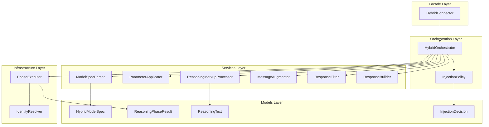
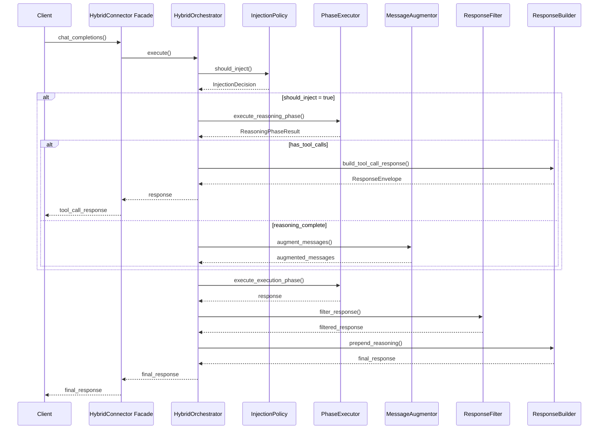

# Technical Design: Hybrid Connector God Object Refactoring

---
**Purpose**: Decompose the monolithic `HybridConnector` class (2,301 lines) into a modular, SOLID-compliant package while preserving all public APIs and ensuring 100% backward compatibility.

**Approach**: Create a new `hybrid_backend/` package with layered architecture, migrate methods to focused services, convert `HybridConnector` to a thin facade.

**Project Context**: Universal LLM Proxy - FastAPI async service with staged initialization, DI containers, adapter pattern for LLM backends
---

## Overview

**Purpose**: This refactoring delivers improved maintainability, testability, and extensibility to developers working on hybrid two-phase reasoning functionality.

**Users**: Developers maintaining hybrid backend logic, operators configuring two-phase reasoning workflows, and test maintainers ensuring code quality.

**Impact**: Changes the internal architecture of hybrid backend while preserving the external `HybridConnector` class signature and behavior.

### Goals

- Decompose 2,301-line God Object into focused services (each <300 lines)
- Achieve SOLID compliance, especially Single Responsibility and Dependency Inversion
- Establish clear architectural layers with enforced boundaries
- Enable unit testing of individual concerns in isolation
- Preserve 100% backward compatibility with existing APIs and tests

### Non-Goals

- Changing the hybrid backend's external behavior or features
- Modifying the model specification syntax (`hybrid:[backend:model,backend:model]`)
- Adding new functionality beyond refactoring existing code
- Changing wire protocol or response formats
- Modifying DI container registration patterns (beyond internal dependencies)

## Architecture

### Existing Architecture Analysis

**Current state** (`src/connectors/hybrid.py`):

- Single 2,301-line class with 35+ methods handling 10+ distinct concerns
- Mixed abstraction levels (parsing, orchestration, response building)
- Direct service resolution via `get_required_service()` scattered throughout
- Two dataclasses (`HybridModelSpec`, `ReasoningPhaseResult`) defined in-line

**Patterns to preserve**:

- `LLMBackend` inheritance pattern from `src/connectors/base.py`
- Backend registration via `backend_registry.register_backend()`
- Async/await for all I/O operations
- `ResponseEnvelope` / `StreamingResponseEnvelope` return types

**Reference architectures** (from gap analysis):

1. `src/connectors/gemini_base/` - Protocol-first, multi-file connector package
2. `src/core/cli_support/` - Recent God Object refactoring with layered services

### Architecture Pattern & Boundary Map

**Selected pattern**: Layered Architecture with Facade



**Architecture Integration**:

| Aspect | Decision |
|--------|----------|
| Pattern | Layered + Facade to preserve backward compatibility |
| Boundaries | 5 layers: Facade → Orchestration → Services → Infrastructure → Models |
| Imports | Unidirectional: upper layers import from lower, never reverse |
| DI Strategy | Constructor injection for orchestrator; optional DI for services |
| Existing Patterns | `LLMBackend` inheritance, `backend_registry` registration preserved |
| Steering Compliance | SOLID (SRP, OCP, ISP, DIP), DRY, explicit contracts |
| Layer Enforcement | Automated test validates import constraints (see Testing Strategy) |

### Technology Stack

| Layer | Choice / Version | Role in Feature | Notes |
|-------|------------------|-----------------|-------|
| Runtime | Python 3.10+ / FastAPI (async) | Core framework | All new services use `async/await` |
| Protocols | `typing.Protocol` + `@runtime_checkable` | Interface contracts | Following `gemini_base` pattern |
| Models | `dataclasses` (frozen where appropriate) | Domain data | Immutable where possible |
| Connectors | `LLMBackend` from `src/connectors/base.py` | Base class | Inheritance preserved |
| Services | Constructor injection | Dependency management | No DI container for internal wiring |

## System Flows

### Two-Phase Hybrid Execution Flow



**Key decisions**:

- `InjectionPolicy` is consulted first to enable short-circuit for non-injection scenarios
- Tool call detection happens after reasoning phase completes
- Response filtering always occurs to ensure no reasoning tags leak to clients

## Requirements Traceability

| Req | Summary | Components | Interfaces | Flows |
|-----|---------|------------|------------|-------|
| 1 | Modular Package Structure | `hybrid_backend/` package | Package `__init__.py` | - |
| 2.1 | ModelSpecParser extraction | `ModelSpecParser` | `IModelSpecParser` | - |
| 2.2 | ParameterApplicator extraction | `ParameterApplicator` | `IParameterApplicator` | - |
| 2.3 | MessageAugmentor extraction | `MessageAugmentor` | `IMessageAugmentor` | Augmentation step |
| 2.4 | ReasoningMarkupProcessor extraction | `ReasoningMarkupProcessor` | `IReasoningMarkupProcessor` | - |
| 2.5 | ResponseFilter extraction | `ResponseFilter` | `IResponseFilter` | Filter step |
| 2.6 | ResponseBuilder extraction | `ResponseBuilder` | `IResponseBuilder` | Build step |
| 3 | Protocol interfaces | `protocols.py` | All `I*` interfaces | - |
| 4 | Dependency Inversion | `HybridOrchestrator` | Protocol dependencies | All flows |
| 5 | Layered Architecture | All packages | Layer imports | - |
| 6.1-6.5 | Domain Model Extraction | `models/` package | Dataclass contracts | - |
| 7 | Orchestrator Extraction | `HybridOrchestrator` | `IHybridOrchestrator` | Main flow |
| 8 | Injection Policy Extraction | `InjectionPolicy` | `IInjectionPolicy` | Injection decision |
| 9 | Phase Executor Extraction | `PhaseExecutor` | `IPhaseExecutor` | Phase steps |
| 10 | Backward Compatibility | `HybridConnector` facade | Unchanged public API | - |
| 11 | Test-Preserving Migration | Test file updates | Import path changes | - |

## Components and Interfaces

### Package Structure

```text
src/connectors/hybrid_backend/
├── __init__.py                    # Public exports (HybridOrchestrator, models)
├── protocols.py                   # All Protocol interfaces (~150 lines)
├── models/
│   ├── __init__.py
│   ├── model_spec.py              # HybridModelSpec dataclass
│   ├── phase_result.py            # ReasoningPhaseResult dataclass
│   ├── reasoning_text.py          # ReasoningText dataclass (NEW)
│   └── injection_decision.py      # InjectionDecision dataclass (NEW)
├── services/
│   ├── __init__.py
│   ├── model_spec_parser.py       # ModelSpecParser service
│   ├── parameter_applicator.py    # ParameterApplicator service
│   ├── message_augmentor.py       # MessageAugmentor service
│   ├── reasoning_markup_processor.py # ReasoningMarkupProcessor service
│   ├── response_filter.py         # ResponseFilter service
│   └── response_builder.py        # ResponseBuilder service
├── orchestration/
│   ├── __init__.py
│   ├── orchestrator.py            # HybridOrchestrator main class
│   └── injection_policy.py        # InjectionPolicy service
└── infrastructure/
    ├── __init__.py
    ├── phase_executor.py          # PhaseExecutor service
    └── identity_resolver.py       # IdentityResolver utility
```

### Component Summary

| Component | Layer | Intent | Req Coverage | Contracts |
|-----------|-------|--------|--------------|-----------|
| `HybridConnector` | Facade | Backward-compatible entry point | 10 | `LLMBackend` |
| `HybridOrchestrator` | Orchestration | Two-phase flow coordination | 7 | `IHybridOrchestrator` |
| `InjectionPolicy` | Orchestration | Injection decision logic | 8 | `IInjectionPolicy` |
| `ModelSpecParser` | Services | Parse model specification strings | 2.1 | `IModelSpecParser` |
| `ParameterApplicator` | Services | Apply phase-specific parameters | 2.2 | `IParameterApplicator` |
| `MessageAugmentor` | Services | Inject reasoning into messages | 2.3 | `IMessageAugmentor` |
| `ReasoningMarkupProcessor` | Services | Tag normalization and extraction | 2.4 | `IReasoningMarkupProcessor` |
| `ResponseFilter` | Services | Strip reasoning tags from responses | 2.5 | `IResponseFilter` |
| `ResponseBuilder` | Services | Construct response envelopes | 2.6 | `IResponseBuilder` |
| `PhaseExecutor` | Infrastructure | Backend interaction for phases | 9 | `IPhaseExecutor` |
| `IdentityResolver` | Infrastructure | Resolve identity configuration | 9 | - |

---

### Protocols Layer (`src/connectors/hybrid_backend/protocols.py`)

All interfaces are defined in a single file following the `cli_support/protocols.py` pattern.

```python
"""Protocols for hybrid backend services.

This module defines the contracts for all services in the hybrid_backend package.
Following the Interface Segregation Principle, each protocol is focused and minimal.

Requirements satisfied:
- 3: Protocol-first design for all services
- 4: Dependency Inversion via Protocol interfaces
"""
from __future__ import annotations

from typing import TYPE_CHECKING, Any, Protocol, runtime_checkable

if TYPE_CHECKING:
    from src.connectors.hybrid_backend.models.model_spec import HybridModelSpec
    from src.connectors.hybrid_backend.models.phase_result import ReasoningPhaseResult
    from src.connectors.hybrid_backend.models.injection_decision import InjectionDecision
    from src.connectors.hybrid_backend.models.reasoning_text import ReasoningText
    from src.core.domain.responses import ResponseEnvelope, StreamingResponseEnvelope
    from src.core.interfaces.configuration_interface import IAppIdentityConfig
    from src.core.interfaces.model_bases import DomainModel, InternalDTO


@runtime_checkable
class IModelSpecParser(Protocol):
    """Protocol for parsing hybrid model specification strings."""
    
    def parse(self, model_spec: str) -> HybridModelSpec:
        """Parse hybrid model specification.
        
        Args:
            model_spec: Format "hybrid:[backend:model?params,backend:model?params]"
            
        Returns:
            Parsed HybridModelSpec
            
        Raises:
            ValueError: If format is invalid
        """
        ...


@runtime_checkable
class IParameterApplicator(Protocol):
    """Protocol for applying phase-specific parameters to requests."""
    
    def apply_reasoning_params(
        self,
        request_data: DomainModel | InternalDTO | dict[str, Any],
        backend: str,
        params: dict[str, Any] | None = None,
    ) -> DomainModel | InternalDTO | dict[str, Any]:
        """Apply reasoning-phase parameters to request data."""
        ...
    
    def apply_execution_params(
        self,
        request_data: DomainModel | InternalDTO | dict[str, Any],
        backend: str,
        params: dict[str, Any] | None = None,
    ) -> DomainModel | InternalDTO | dict[str, Any]:
        """Apply execution-phase parameters to request data."""
        ...


@runtime_checkable
class IReasoningMarkupProcessor(Protocol):
    """Protocol for reasoning markup tag processing."""
    
    def normalize(
        self, reasoning_output: str, backend: str
    ) -> ReasoningText:
        """Normalize reasoning markup to canonical format."""
        ...
    
    def format_for_model(
        self, reasoning_output: str, backend: str
    ) -> str:
        """Format reasoning with backend-specific tags."""
        ...
    
    def extract_plain_text(self, reasoning_output: str) -> str:
        """Strip all tags and return plain text."""
        ...


@runtime_checkable
class IMessageAugmentor(Protocol):
    """Protocol for injecting reasoning into message lists."""
    
    def augment(
        self,
        messages: list[Any],
        reasoning_output: str,
        execution_backend: str,
    ) -> list[Any]:
        """Inject reasoning into messages using appropriate strategy."""
        ...


@runtime_checkable
class IResponseFilter(Protocol):
    """Protocol for filtering reasoning tags from responses."""
    
    def filter_content(self, content: Any) -> Any:
        """Filter reasoning tags from response content."""
        ...
    
    async def filter_stream(
        self, response: StreamingResponseEnvelope
    ) -> StreamingResponseEnvelope:
        """Filter reasoning tags from streaming response."""
        ...


@runtime_checkable
class IResponseBuilder(Protocol):
    """Protocol for constructing response envelopes."""
    
    def build_reasoning_chunk(
        self,
        reasoning_output: str,
        reasoning_backend: str,
        reasoning_model: str,
    ) -> Any:
        """Build a streaming chunk containing reasoning preview."""
        ...
    
    def build_tool_call_response(
        self,
        tool_calls: list[dict[str, Any]],
        request_dict: dict[str, Any],
        backend: str,
        model: str,
    ) -> ResponseEnvelope | StreamingResponseEnvelope:
        """Build response for tool-call-only scenarios."""
        ...
    
    def prepend_reasoning_to_stream(
        self,
        response: StreamingResponseEnvelope,
        reasoning_output: str,
        reasoning_backend: str,
        reasoning_model: str,
    ) -> StreamingResponseEnvelope:
        """Prepend reasoning chunk to streaming response."""
        ...


@runtime_checkable
class IInjectionPolicy(Protocol):
    """Protocol for reasoning injection decisions."""
    
    def should_inject(
        self,
        processed_messages: list[Any] | None,
        request_messages: list[Any] | None,
        probability_override: float | None = None,
    ) -> InjectionDecision:
        """Determine whether reasoning should be injected."""
        ...
    
    def update_backoff(self, success: bool) -> None:
        """Update adaptive backoff state based on phase outcome."""
        ...


@runtime_checkable
class IPhaseExecutor(Protocol):
    """Protocol for executing reasoning and execution phases."""
    
    async def execute_reasoning_phase(
        self,
        messages: list[Any],
        reasoning_backend: str,
        reasoning_model: str,
        request_data: DomainModel | InternalDTO | dict[str, Any],
        identity: IAppIdentityConfig | None,
        uri_params: dict[str, Any] | None = None,
    ) -> ReasoningPhaseResult:
        """Execute reasoning phase and return captured output."""
        ...
    
    async def execute_execution_phase(
        self,
        request_data: DomainModel | InternalDTO | dict[str, Any],
        augmented_messages: list[Any],
        execution_backend: str,
        execution_model: str,
        identity: IAppIdentityConfig | None,
        uri_params: dict[str, Any] | None = None,
        **kwargs: Any,
    ) -> ResponseEnvelope | StreamingResponseEnvelope:
        """Execute execution phase with augmented messages."""
        ...


@runtime_checkable
class IHybridOrchestrator(Protocol):
    """Protocol for the main hybrid orchestration flow."""
    
    async def execute(
        self,
        request_data: DomainModel | InternalDTO | dict[str, Any],
        processed_messages: list[Any],
        effective_model: str,
        identity: IAppIdentityConfig | None = None,
        **kwargs: Any,
    ) -> ResponseEnvelope | StreamingResponseEnvelope:
        """Execute the complete two-phase hybrid completion."""
        ...
```

---

### Models Layer (`src/connectors/hybrid_backend/models/`)

#### HybridModelSpec (`models/model_spec.py`)

```python
"""Hybrid model specification dataclass."""
from dataclasses import dataclass, field
from typing import Any


@dataclass(frozen=True)
class HybridModelSpec:
    """Specification for a hybrid model configuration.
    
    Attributes:
        reasoning_backend: Backend name for reasoning phase
        reasoning_model: Model name for reasoning phase
        reasoning_params: URI parameters for reasoning phase
        execution_backend: Backend name for execution phase
        execution_model: Model name for execution phase
        execution_params: URI parameters for execution phase
    """
    reasoning_backend: str
    reasoning_model: str
    reasoning_params: dict[str, Any] = field(default_factory=dict)
    execution_backend: str = ""
    execution_model: str = ""
    execution_params: dict[str, Any] = field(default_factory=dict)
```

#### ReasoningPhaseResult (`models/phase_result.py`)

```python
"""Reasoning phase result dataclass."""
from dataclasses import dataclass, field
from typing import TYPE_CHECKING, Any

if TYPE_CHECKING:
    from src.core.interfaces.response_processor_interface import ProcessedResponse


@dataclass
class ReasoningPhaseResult:
    """Container for reasoning phase outcome.
    
    Attributes:
        text: Captured reasoning output text
        complete: Whether reasoning completed successfully
        tool_calls: Any tool calls requested by reasoning model
        raw_chunks: Raw processed response chunks for debugging
        media_type: Response media type if available
        headers: Response headers if available
    """
    text: str = ""
    complete: bool = False
    tool_calls: list[dict[str, Any]] = field(default_factory=list)
    raw_chunks: list["ProcessedResponse"] = field(default_factory=list)
    media_type: str | None = None
    headers: dict[str, str] | None = None
    
    def has_tool_calls(self) -> bool:
        """Check whether reasoning produced any tool calls."""
        return len(self.tool_calls) > 0
```

#### ReasoningText (`models/reasoning_text.py`) - NEW

```python
"""Reasoning text with tagged and plain representations."""
from dataclasses import dataclass


@dataclass(frozen=True)
class ReasoningText:
    """Encapsulates reasoning text in multiple formats.
    
    Attributes:
        tagged: Reasoning with backend-specific tags
        plain: Plain text with all tags stripped
        backend: Source backend for tag format selection
    """
    tagged: str
    plain: str
    backend: str
```

#### InjectionDecision (`models/injection_decision.py`) - NEW

```python
"""Injection decision dataclass."""
from dataclasses import dataclass


@dataclass(frozen=True)
class InjectionDecision:
    """Encapsulates the result of injection policy evaluation.
    
    Attributes:
        should_inject: Whether reasoning should be injected
        reason: Human-readable explanation of the decision
        is_first_turn: Whether this is the first user turn
        probability_used: The probability value that was evaluated
    """
    should_inject: bool
    reason: str
    is_first_turn: bool = False
    probability_used: float = 1.0
```

---

### Services Layer (`src/connectors/hybrid_backend/services/`)

#### ModelSpecParser (`services/model_spec_parser.py`)

| Field | Detail |
|-------|--------|
| Intent | Parse hybrid model specification strings into structured `HybridModelSpec` |
| Requirements | 2.1 |
| Interface | `IModelSpecParser` |

**Responsibilities & Constraints**

- Parse `hybrid:[backend:model?params,backend:model?params]` format
- Validate format and provide descriptive error messages
- Extract and decode URI parameters
- No state - pure function wrapped in class for testability

**Dependencies**: None (pure parsing logic)

**Method mapping from hybrid.py**:

- `_parse_hybrid_model_spec()` → `ModelSpecParser.parse()`

---

#### ParameterApplicator (`services/parameter_applicator.py`)

| Field | Detail |
|-------|--------|
| Intent | Apply phase-specific parameters to request data |
| Requirements | 2.2 |
| Interface | `IParameterApplicator` |

**Responsibilities & Constraints**

- Apply reasoning phase parameters from `REASONING_PHASE_PARAMS`
- Apply execution phase parameters from `EXECUTION_PHASE_PARAMS`
- Handle Pydantic models, dicts, and dataclasses uniformly
- Support URI parameter overrides

**Dependencies**:

- `model_capabilities.REASONING_PHASE_PARAMS`
- `model_capabilities.EXECUTION_PHASE_PARAMS`

**Method mapping from hybrid.py**:

- `_apply_reasoning_params()` → `ParameterApplicator.apply_reasoning_params()`
- `_apply_parameter_overrides()` → internal helper

---

#### ReasoningMarkupProcessor (`services/reasoning_markup_processor.py`)

| Field | Detail |
|-------|--------|
| Intent | Process reasoning markup tags (normalize, wrap, extract) |
| Requirements | 2.4 |
| Interface | `IReasoningMarkupProcessor` |

**Responsibilities & Constraints**

- Normalize reasoning to canonical tag format
- Apply backend-specific tag wrapping
- Extract plain text from tagged content
- Handle malformed/partial tags gracefully

**Dependencies**:

- `model_capabilities.REASONING_TAG_FORMAT`

**Method mapping from hybrid.py**:

- `_normalize_reasoning_markup()` → `normalize()`
- `_apply_reasoning_tag_wrapping()` → internal
- `_extract_reasoning_inner_text()` → `extract_plain_text()`
- `_format_reasoning_for_model()` → `format_for_model()`
- `_has_reasoning_content()` → internal
- `_prepare_reasoning_texts()` → `normalize()` returning `ReasoningText`
- `_assemble_reasoning_markup()` → internal
- `_truncate_after_reasoning_close()` → internal

---

#### MessageAugmentor (`services/message_augmentor.py`)

| Field | Detail |
|-------|--------|
| Intent | Inject reasoning output into message lists |
| Requirements | 2.3 |
| Interface | `IMessageAugmentor` |

**Responsibilities & Constraints**

- Inject as system message if backend supports system role
- Prepend to first user message otherwise
- Support repeat-message mode (append as assistant message)
- Use `ReasoningMarkupProcessor` for formatting

**Dependencies**:

- `IReasoningMarkupProcessor`
- `model_capabilities.SYSTEM_MESSAGE_SUPPORT`
- `AppConfig.backends.hybrid_backend_repeat_messages`

**Method mapping from hybrid.py**:

- `_augment_messages()` → `MessageAugmentor.augment()`
- `_inject_as_system_message()` → internal
- `_inject_to_user_message()` → internal
- `_supports_system_messages()` → internal

---

#### ResponseFilter (`services/response_filter.py`)

| Field | Detail |
|-------|--------|
| Intent | Strip reasoning tags from response content |
| Requirements | 2.5 |
| Interface | `IResponseFilter` |

**Responsibilities & Constraints**

- Filter reasoning tags from string content
- Recursively filter JSON structures
- Handle streaming responses with async generators
- Preserve response structure while filtering content

**Dependencies**: None (uses compiled regex patterns)

**Method mapping from hybrid.py**:

- `_strip_reasoning_tags()` → internal
- `_filter_response_content()` → `filter_content()`
- `_filter_json_content()` → internal
- `_filter_response_stream()` → `filter_stream()`

---

#### ResponseBuilder (`services/response_builder.py`)

| Field | Detail |
|-------|--------|
| Intent | Construct response envelopes for various scenarios |
| Requirements | 2.6 |
| Interface | `IResponseBuilder` |

**Responsibilities & Constraints**

- Build reasoning preview chunks for streaming
- Build tool-call-only responses when reasoning yields tool calls
- Prepend reasoning to streaming and non-streaming responses
- Use `ReasoningMarkupProcessor` for formatting

**Dependencies**:

- `IReasoningMarkupProcessor`
- `ProcessedResponse` from domain

**Method mapping from hybrid.py**:

- `_build_reasoning_stream_chunk()` → `build_reasoning_chunk()`
- `_build_tool_call_only_response()` → `build_tool_call_response()`
- `_prepend_reasoning_chunk_to_stream()` → `prepend_reasoning_to_stream()`
- `_prepend_reasoning_to_non_streaming_content()` → `prepend_reasoning_to_content()`
- `_format_reasoning_for_client()` → internal (uses `ReasoningMarkupProcessor`)

---

### Orchestration Layer (`src/connectors/hybrid_backend/orchestration/`)

#### InjectionPolicy (`orchestration/injection_policy.py`)

| Field | Detail |
|-------|--------|
| Intent | Encapsulate injection decision logic |
| Requirements | 8 |
| Interface | `IInjectionPolicy` |
| Lifetime | Per-connector instance (stateful) |

**Responsibilities & Constraints**

- Determine if reasoning should be injected
- Handle first-turn forcing (forced initial turns window)
- Implement probability-based injection
- Manage adaptive backoff counter
- Track injection decisions for observability

**Dependencies**:

- `AppConfig.backends.reasoning_injection_probability`
- `AppConfig.backends.forced_initial_turns`

**State & Lifecycle**:

- `_reasoning_backoff_remaining: int` (moved from `HybridConnector`)
- **Lifecycle**: One `InjectionPolicy` instance is created per `HybridConnector` instance. This preserves the current semantics where backoff state is maintained per-connector (i.e., per-client session).
- **Thread safety**: The state is only modified within a single async context, so no locking is required.
- **Testing**: For unit tests, create a fresh `InjectionPolicy` instance per test. For testing backoff behavior, call `update_backoff()` to simulate phase outcomes.

**Method mapping from hybrid.py**:

- `_is_first_user_turn()` → internal
- Injection probability logic from `chat_completions()` → `should_inject()`

---

#### HybridOrchestrator (`orchestration/orchestrator.py`)

| Field | Detail |
|-------|--------|
| Intent | Coordinate the two-phase hybrid completion flow |
| Requirements | 7 |
| Interface | `IHybridOrchestrator` |

**Responsibilities & Constraints**

- Parse model specification
- Evaluate injection policy
- Coordinate reasoning phase (if needed)
- Handle tool-call short-circuit
- Coordinate execution phase
- Apply response filtering
- Build final response

**Dependencies (via constructor injection)**:

- `IModelSpecParser`
- `IParameterApplicator`
- `IInjectionPolicy`
- `IPhaseExecutor`
- `IMessageAugmentor`
- `IResponseFilter`
- `IResponseBuilder`

**Method mapping from hybrid.py**:

- `chat_completions()` main logic → `HybridOrchestrator.execute()`

**Code size target**: <100 lines for `execute()` method

---

### Infrastructure Layer (`src/connectors/hybrid_backend/infrastructure/`)

#### PhaseExecutor (`infrastructure/phase_executor.py`)

| Field | Detail |
|-------|--------|
| Intent | Execute reasoning and execution phases via backends |
| Requirements | 9 |
| Interface | `IPhaseExecutor` |

**Responsibilities & Constraints**

- Resolve backend connectors via registry
- Prepare requests with phase parameters
- Handle streaming capture for reasoning phase
- Apply URI parameters with validation
- Manage timeouts and error handling

**Dependencies**:

- `IServiceProvider` (for `BackendService`, `BackendFactory`)
- `URIParameterValidator`
- `ReasoningStreamProcessor`
- `IParameterApplicator`
- `IdentityResolver`

**Method mapping from hybrid.py**:

- `_execute_reasoning_phase()` → `execute_reasoning_phase()`
- `_execute_execution_phase()` → `execute_execution_phase()`
- `_prepare_backend_request()` → internal

---

#### IdentityResolver (`infrastructure/identity_resolver.py`)

| Field | Detail |
|-------|--------|
| Intent | Resolve identity configuration for backend calls |
| Requirements | 9 |
| Interface | None (simple utility) |

**Responsibilities**:

- Preference order: backend-specific → request → global
- Handle all identity sources consistently

**Method mapping from hybrid.py**:

- `_resolve_backend_identity()` → `IdentityResolver.resolve()`

---

### Facade Layer (`src/connectors/hybrid.py`)

The existing `HybridConnector` class is converted to a thin facade:

```python
"""Hybrid backend connector facade - preserves backward compatibility."""
import httpx
from typing import Any

from src.connectors.base import LLMBackend
from src.connectors.hybrid_backend.orchestration.orchestrator import HybridOrchestrator
from src.connectors.hybrid_backend.orchestration.injection_policy import InjectionPolicy
from src.connectors.hybrid_backend.services.model_spec_parser import ModelSpecParser
from src.connectors.hybrid_backend.services.parameter_applicator import ParameterApplicator
from src.connectors.hybrid_backend.services.message_augmentor import MessageAugmentor
from src.connectors.hybrid_backend.services.reasoning_markup_processor import ReasoningMarkupProcessor
from src.connectors.hybrid_backend.services.response_filter import ResponseFilter
from src.connectors.hybrid_backend.services.response_builder import ResponseBuilder
from src.connectors.hybrid_backend.infrastructure.phase_executor import PhaseExecutor
from src.connectors.hybrid_backend.infrastructure.identity_resolver import IdentityResolver
from src.connectors.hybrid_backend.models import HybridModelSpec, ReasoningPhaseResult
from src.core.config.app_config import AppConfig
from src.core.domain.responses import ResponseEnvelope, StreamingResponseEnvelope
from src.core.interfaces.configuration_interface import IAppIdentityConfig
from src.core.interfaces.model_bases import DomainModel, InternalDTO
from src.core.services.backend_registry import backend_registry

if TYPE_CHECKING:
    from src.core.services.backend_registry import BackendRegistry
    from src.core.services.translation_service import TranslationService

# Re-export for backward compatibility
__all__ = ["HybridConnector", "HybridModelSpec", "ReasoningPhaseResult"]


class HybridConnector(LLMBackend):
    """LLMBackend implementation for hybrid two-phase reasoning.
    
    This class serves as a backward-compatible facade, delegating all
    work to the modular `HybridOrchestrator`.
    """
    backend_type = "hybrid"
    
    def __init__(
        self,
        client: httpx.AsyncClient,
        config: AppConfig,
        translation_service: TranslationService,
        backend_registry: BackendRegistry | None = None,
    ) -> None:
        super().__init__(config=config)
        # Store dependencies for orchestrator
        self.client = client
        self.translation_service = translation_service
        self._backend_registry = backend_registry
        # Build orchestrator with all dependencies
        self._orchestrator = self._build_orchestrator(client, config, backend_registry)
    
    def _build_orchestrator(
        self,
        client: httpx.AsyncClient,
        config: AppConfig,
        backend_registry: BackendRegistry | None,
    ) -> HybridOrchestrator:
        """Construct the orchestrator with injected dependencies.
        
        Dependency wiring order (bottom-up to avoid circular dependencies):
        1. Models layer: No instantiation needed (dataclasses)
        2. Stateless services: No dependencies on other services
        3. Services with dependencies: Inject lower-level services
        4. Infrastructure: Inject config and external adapters
        5. Orchestration: Inject all services
        """
        # Layer 1: Stateless services (no dependencies)
        model_spec_parser = ModelSpecParser()
        reasoning_markup_processor = ReasoningMarkupProcessor()
        response_filter = ResponseFilter()
        identity_resolver = IdentityResolver(config)
        
        # Layer 2: Services with service dependencies
        parameter_applicator = ParameterApplicator()
        message_augmentor = MessageAugmentor(
            markup_processor=reasoning_markup_processor,
            config=config,
        )
        response_builder = ResponseBuilder(
            markup_processor=reasoning_markup_processor,
        )
        
        # Layer 3: Infrastructure (external I/O)
        phase_executor = PhaseExecutor(
            client=client,
            config=config,
            backend_registry=backend_registry,
            parameter_applicator=parameter_applicator,
            identity_resolver=identity_resolver,
        )
        
        # Layer 4: Orchestration (stateful policy)
        injection_policy = InjectionPolicy(config=config)
        
        # Layer 5: Main orchestrator
        return HybridOrchestrator(
            model_spec_parser=model_spec_parser,
            parameter_applicator=parameter_applicator,
            injection_policy=injection_policy,
            phase_executor=phase_executor,
            message_augmentor=message_augmentor,
            response_filter=response_filter,
            response_builder=response_builder,
            config=config,
        )
    
    async def initialize(self, **kwargs: Any) -> None:
        """Initialize the hybrid backend.
        
        Note: The orchestrator and services are stateless (except InjectionPolicy),
        so initialization just imports the backend registry if not provided.
        """
        if self._backend_registry is None:
            from src.core.services.backend_registry import backend_registry
            self._backend_registry = backend_registry
        logger.info("Hybrid backend initialized successfully")
    
    def get_available_models(self) -> list[str]:
        """Return available models (empty - models specified per-request)."""
        return []
    
    async def chat_completions(
        self,
        request_data: DomainModel | InternalDTO | dict[str, Any],
        processed_messages: list,
        effective_model: str,
        identity: IAppIdentityConfig | None = None,
        **kwargs: Any,
    ) -> ResponseEnvelope | StreamingResponseEnvelope:
        """Execute the two-phase hybrid completion."""
        return await self._orchestrator.execute(
            request_data=request_data,
            processed_messages=processed_messages,
            effective_model=effective_model,
            identity=identity,
            **kwargs,
        )


# Register the hybrid backend (unchanged)
backend_registry.register_backend("hybrid", HybridConnector)
```

## Data Models

### Domain Model Summary

| Model | Location | Immutable | Purpose |
|-------|----------|-----------|---------|
| `HybridModelSpec` | `models/model_spec.py` | Yes (`frozen=True`) | Parsed model specification |
| `ReasoningPhaseResult` | `models/phase_result.py` | No (mutable lists) | Phase execution result |
| `ReasoningText` | `models/reasoning_text.py` | Yes (`frozen=True`) | Tagged/plain text pair |
| `InjectionDecision` | `models/injection_decision.py` | Yes (`frozen=True`) | Injection policy result |

### Existing Models Preserved

These models remain unchanged in their current locations:

- `ProcessedResponse` from `src/core/interfaces/response_processor_interface.py`
- `ResponseEnvelope` / `StreamingResponseEnvelope` from `src/core/domain/responses.py`
- `DomainModel` / `InternalDTO` from `src/core/interfaces/model_bases.py`

## Error Handling

### Error Hierarchy

All errors follow the existing `LLMProxyError` pattern:

| Error Type | HTTP Status | Use Case |
|------------|-------------|----------|
| `ValueError` | 400 | Invalid model spec format |
| `BackendError` | 502 | Backend resolution/execution failures |
| `TimeoutError` | 504 | Reasoning phase timeout |

### Error Strategy

- Validate model spec early in `ModelSpecParser.parse()`
- Propagate backend errors with context from `PhaseExecutor`
- Log with structured context at each phase boundary
- Preserve existing error messages for backward compatibility

## Testing Strategy

### Test Organization

```text
tests/
├── unit/
│   └── connectors/
│       └── hybrid_backend/
│           ├── test_model_spec_parser.py
│           ├── test_parameter_applicator.py
│           ├── test_message_augmentor.py
│           ├── test_reasoning_markup_processor.py
│           ├── test_response_filter.py
│           ├── test_response_builder.py
│           ├── test_injection_policy.py
│           ├── test_phase_executor.py
│           └── test_orchestrator.py
└── integration/
    └── connectors/
        └── test_hybrid_backend_integration.py  # Existing, update imports
```

### Test Migration Strategy

**Phase 1**: Update imports only

- Existing test files remain functional
- Add re-exports to `hybrid.py` for `HybridModelSpec`, `ReasoningPhaseResult`

**Phase 2**: Add new unit tests

- Each service gets dedicated unit tests
- Mock Protocol dependencies

**Phase 3**: Validate integration

- Run existing integration tests
- Verify no behavioral changes

### Unit Tests (per service)

- [x] `ModelSpecParser`: Valid/invalid formats, edge cases, error messages
- [x] `ParameterApplicator`: Pydantic, dict, dataclass handling
- [x] `MessageAugmentor`: System message injection, user message injection, repeat mode
- [x] `ReasoningMarkupProcessor`: Tag normalization, extraction, malformed input
- [x] `ResponseFilter`: String, JSON, streaming filtering
- [x] `ResponseBuilder`: Chunk building, tool call responses, stream prepending
- [x] `InjectionPolicy`: First turn, probability, backoff state, lifecycle
- [x] `PhaseExecutor`: Backend resolution, timeout handling, error propagation
- [x] `HybridOrchestrator`: Full flow, short-circuits, error handling

### Architectural Tests (Layer Enforcement)

To satisfy requirement 5.4, an automated layer boundary test validates import constraints:

**Test file**: `tests/unit/connectors/hybrid_backend/test_layer_boundaries.py`

```python
"""Architectural tests to enforce layer boundaries in hybrid_backend package.

Requirements satisfied:
- 5.4: When a layer violation occurs, the architecture check shall fail
"""
import ast
import importlib.util
from pathlib import Path
import pytest

# Layer definitions (top to bottom)
LAYERS = {
    "facade": ["src/connectors/hybrid.py"],
    "orchestration": ["src/connectors/hybrid_backend/orchestration/"],
    "services": ["src/connectors/hybrid_backend/services/"],
    "infrastructure": ["src/connectors/hybrid_backend/infrastructure/"],
    "models": ["src/connectors/hybrid_backend/models/"],
}

# Allowed import directions (layer can import from layers below it)
ALLOWED_IMPORTS = {
    "facade": ["orchestration", "services", "infrastructure", "models"],
    "orchestration": ["services", "infrastructure", "models"],
    "services": ["infrastructure", "models"],
    "infrastructure": ["models"],
    "models": [],  # Models can only import stdlib/typing
}

def get_layer_for_path(path: str) -> str | None:
    """Determine which layer a file belongs to."""
    for layer, patterns in LAYERS.items():
        for pattern in patterns:
            if pattern in path:
                return layer
    return None

def extract_imports(file_path: Path) -> list[str]:
    """Extract all import statements from a Python file."""
    with open(file_path) as f:
        tree = ast.parse(f.read())
    
    imports = []
    for node in ast.walk(tree):
        if isinstance(node, ast.Import):
            for alias in node.names:
                imports.append(alias.name)
        elif isinstance(node, ast.ImportFrom):
            if node.module:
                imports.append(node.module)
    return imports

def get_imported_layer(import_path: str) -> str | None:
    """Determine which layer an import belongs to."""
    for layer, patterns in LAYERS.items():
        for pattern in patterns:
            if pattern.rstrip("/").replace("/", ".") in import_path:
                return layer
    return None

@pytest.mark.unit
def test_no_upward_layer_imports():
    """Verify no module imports from a layer above it."""
    hybrid_backend = Path("src/connectors/hybrid_backend")
    violations = []
    
    for py_file in hybrid_backend.rglob("*.py"):
        file_layer = get_layer_for_path(str(py_file))
        if not file_layer:
            continue
        
        for import_path in extract_imports(py_file):
            imported_layer = get_imported_layer(import_path)
            if imported_layer and imported_layer not in ALLOWED_IMPORTS.get(file_layer, []):
                if imported_layer != file_layer:  # Same-layer imports are OK
                    violations.append(
                        f"{py_file}: {file_layer} imports from {imported_layer} ({import_path})"
                    )
    
    assert not violations, f"Layer violations found:\\n" + "\\n".join(violations)

@pytest.mark.unit
def test_models_have_no_internal_dependencies():
    """Verify models layer only imports stdlib/typing."""
    models_dir = Path("src/connectors/hybrid_backend/models")
    violations = []
    
    for py_file in models_dir.glob("*.py"):
        for import_path in extract_imports(py_file):
            if import_path.startswith("src."):
                # Allow TYPE_CHECKING imports from core domain
                if "core.interfaces" not in import_path and "core.domain" not in import_path:
                    violations.append(f"{py_file}: models imports {import_path}")
    
    assert not violations, f"Model layer violations:\\n" + "\\n".join(violations)
```

**Test execution**:

```powershell
./.venv/Scripts/python.exe -m pytest tests/unit/connectors/hybrid_backend/test_layer_boundaries.py -v
```

### Test Commands

```powershell
# Fast unit tests for hybrid_backend
./.venv/Scripts/python.exe -m pytest tests/unit/connectors/hybrid_backend/ -v

# Existing hybrid tests (should pass unchanged)
./.venv/Scripts/python.exe -m pytest tests/unit/connectors/test_hybrid*.py -v

# Integration tests
./.venv/Scripts/python.exe -m pytest tests/integration/connectors/test_hybrid*.py -v

# Full suite
./.venv/Scripts/python.exe -m pytest -m "not slow"
```

## Security Considerations

- No new external inputs introduced (same model spec format)
- No secrets or credentials handled differently
- Existing logging redaction patterns preserved

## Performance & Scalability

**No performance regression expected**:

- Same code paths, just reorganized
- No additional object allocations in hot paths
- Async generators passed through, not wrapped

**Streaming optimization**:

- `_filter_response_stream()` async generator delegated directly
- No buffering changes

## Supporting References

### Import Cycle Prevention

To prevent circular imports between layers:

1. **TYPE_CHECKING imports**: Use `if TYPE_CHECKING:` for type hints that would cause cycles
2. **Protocol-based dependencies**: Services depend on Protocols, not implementations
3. **Lazy imports**: Infrastructure layer imports services at runtime if needed
4. **Models have no dependencies**: Domain models only use stdlib/typing

### Async Generator Delegation

For streaming responses, preserve the `cancel_callback` pattern:

```python
# In ResponseBuilder.prepend_reasoning_to_stream()
async def combined_stream() -> AsyncGenerator[ProcessedResponse, None]:
    yield reasoning_chunk
    async for chunk in original_stream():
        yield filtered_chunk

return StreamingResponseEnvelope(
    stream=combined_stream,
    media_type=response.media_type,
    headers=response.headers,
    cancel_callback=response.cancel_callback,  # Preserve original callback
)
```

### Layer Import Rules

```python
# ✅ Valid imports
from src.connectors.hybrid_backend.models import HybridModelSpec  # Upper imports lower
from src.connectors.hybrid_backend.protocols import IPhaseExecutor  # All import protocols

# ❌ Invalid imports (should fail architectural tests)
# In services/model_spec_parser.py:
from src.connectors.hybrid_backend.orchestration import HybridOrchestrator  # Lower importing upper
```
