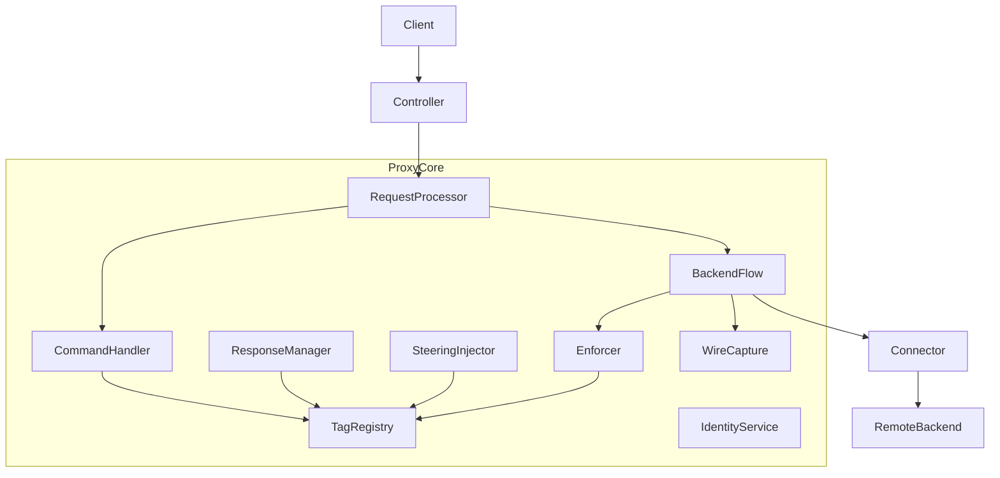
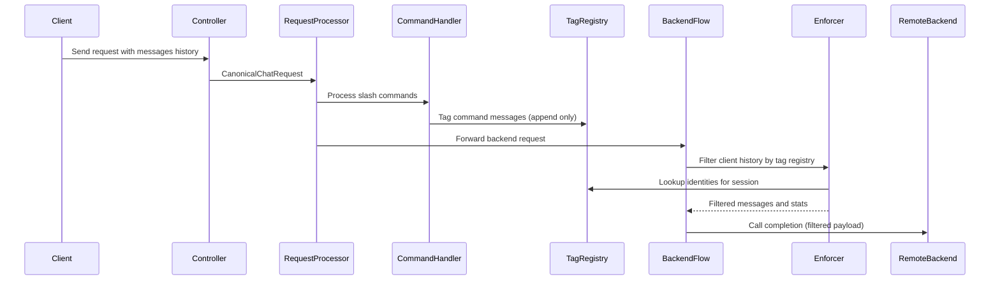
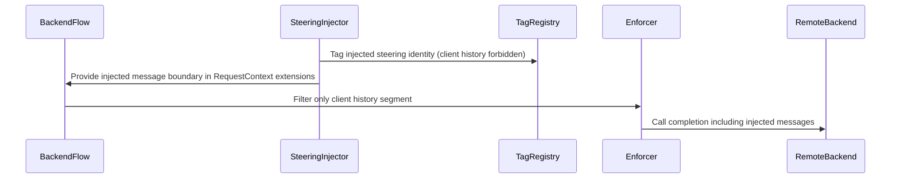

# Technical Design: Non-Forwardable Message Tagging

## Overview
This feature provides a deterministic, session-scoped mechanism to tag messages as non-forwardable and to enforce those tags at a single authoritative boundary immediately before any remote LLM backend call. It prevents internal-only messages (slash commands, server command responses, and server-managed steering/internal messages) from being forwarded to remote backends when clients resend full conversation history.

This is an alpha-stage project. The implementation is expected to be final: no backward compatibility guarantees, no fallbacks to legacy behavior, and removal of legacy regex-based non-forwardable enforcement mechanisms.

### Goals
- Ensure non-forwardable messages are never included in outbound payloads to remote LLM backends, even when clients resend history.
- Provide deterministic, server-derived message identity so previously tagged messages can be recognized without relying on client metadata.
- Enforce filtering at a single backend-call boundary that covers normal requests and internal workflows (retries/steering).
- Remove legacy regex-based non-forwardable mechanisms and all wiring that activates them.

### Non-Goals
- Preserving legacy behavior that relied on regex stripping, metadata round-tripping, or compatibility fallbacks.
- Providing a public client API to mark messages as non-forwardable.
- Supporting embedded or “inline” commands inside otherwise forwardable message content as a compatibility feature.

## Architecture

### Existing Architecture Analysis
- Request processing is orchestrated by `RequestProcessor` (`src/core/services/request_processor_service.py`) with decomposed phase components (command handling, backend preparation, request transforms, backend execution).
- Command processing is implemented by the command pipeline (`src/core/commands/service.py`) and may mutate message content (for example stripping matched command text) during command execution; non-forwardable tagging MUST still recognize and exclude the original client-submitted command message when it later appears in history (2.5, 1.4).
- Remote backend calls are orchestrated through `BackendCompletionFlow` (`src/core/services/backend_completion_flow/service.py`) and include outbound wire capture prior to backend invocation.
- Sessions are resolved and persisted via `ISessionService` and repositories; session continuity can be derived from message history (`IntelligentSessionResolver`).
- Optional history compaction may rewrite historical tool result messages (for example replacing stale tool outputs with explicit stubs) during backend request preparation (`BackendRequestPreparationService`, `HistoryCompactionService`). This rewrites message content while preserving canonical linkage fields (for example `tool_call_id`) and must not break non-forwardable identity matching (1.12, 1.13).
- Request transforms and history compaction are fail-open by design (`RequestTransformPipeline`, `HistoryCompactionService`); non-forwardable enforcement MUST be independent of these mechanisms and MUST fail closed at the backend-call boundary (7.3, 10.1).
- There are backend-call entry points that currently bypass `BackendCompletionFlow` by calling `LLMBackend.chat_completions(...)` directly (for example WebSocket features and internal multi-phase workflows). This spec requires routing all remote backend calls through a single orchestrator/enforcement boundary (7.5, 7.6, 8.*).
- Current “do not forward” behavior is partially implemented via regex-based command stripping and metadata-dependent heuristics (`src/security.py`, `src/core/services/redaction_middleware.py`), which is fragile under client history re-submission and violates 13.1-13.3 for this spec.
- Backend session resolution inside `BackendCompletionFlow` can currently proceed without a session id when neither context nor request provides one (`CompletionSessionResolver`); this spec requires a non-empty session id be resolved or created for every backend-call interaction (8.1).
- Some controller/test hooks can invoke backend adapters directly (for example a mock backend attached to app state); these must be removed or routed through the same enforcement boundary to satisfy 7.6.

### Architecture Pattern & Boundary Map
Selected pattern: **Service + Boundary Enforcement (Option B)**. Tagging is session-scoped and stored server-side. Enforcement occurs in a single place immediately prior to backend invocation inside backend orchestration.



**Architecture Integration**
- Existing patterns preserved: staged init, DI services/interfaces, domain contracts (`ChatMessage`, `ChatRequest`), `LLMProxyError` hierarchy.
- New components rationale:
  - Identity service: deterministic message identity independent of client metadata.
  - Registry: server-side session lifetime storage of non-forwardable identities/tags.
  - Enforcer: single authoritative filter invoked immediately before backend call/capture.
- Steering compliance: enforce strong typing and explicit contracts; remove fragile regex enforcement code.

### Technology Stack

| Layer | Choice / Version | Role in Feature | Notes |
|-------|------------------|-----------------|-------|
| Runtime | Python 3.10+ / FastAPI (async) | Execution environment | Use `async/await` for persistence and I/O |
| Domain Contracts | Pydantic v2 models | Message identity and tag contracts | Avoid ad-hoc dict payloads |
| DI Container | `src/core/di/container.py` | Service registration | Singleton services keyed by session id |
| Backend Orchestration | `BackendCompletionFlow` | Enforcement point | Filter before outbound capture and invoke |
| Persistence | Session repository/service | Store tags for session lifetime | No new external dependencies |

### Backend Invocation Coverage (Normative)
This feature relies on a single enforcement boundary (Option B). To make that boundary real across the codebase (7.5, 7.6), the proxy MUST route all remote backend calls through the same orchestrator that hosts the non-forwardable enforcer.

**Authoritative rule**
- Only the backend-call orchestrator (invoked via `IBackendService.call_completion(...)` → `BackendCompletionFlow`) is permitted to call `LLMBackend.chat_completions(...)`.
- Any code path currently calling `LLMBackend.chat_completions(...)` directly (for example WebSocket handlers or internal multi-phase executors) MUST be refactored to call `IBackendService.call_completion(...)` instead.

**Known bypasses (evidence from gap analysis; must be eliminated)**
- `src/codebuff/handlers/prompt_handler.py` (direct `backend.chat_completions(...)`)
- `src/connectors/hybrid_backend/infrastructure/phase_executor.py` (direct `execution_connector.chat_completions(...)`)
- `src/core/app/controllers/__init__.py` (test-only direct `app_state.openrouter_backend.chat_completions(...)`)

**Session requirement**
- All such calls MUST supply a `RequestContext` with `session_id` set so tags remain session-scoped and stable across entry points (8.*).
- If an entry point does not have a session id available, it MUST resolve or create one and MUST NOT proceed to a backend call without it (8.1).

### Tagging Sources (Normative)
This design assumes that messages become non-forwardable at specific creation/inference points, and that tags are recorded immediately so later client history re-submission can be filtered reliably.

- **Slash command messages (2.*)**:
  - When a message is identified as a slash command and handled server-side, the proxy MUST tag the command message as `never_forward` for the session (2.5).
  - If the command pipeline rewrites the message content during processing, the proxy MUST still tag based on the identity of the original client-submitted message so later history re-submission is recognized (1.4, 2.5).
- **Command response messages (3.*)**:
  - When the proxy generates a command response and sends it to the client, it MUST tag that response message as `never_forward` (3.1).
  - Tag recognition MUST NOT rely on metadata that clients may not round-trip (3.3, 12.1).
- **Steering/internal injected messages (4.*)**:
  - When the proxy injects steering/internal messages for a backend-call workflow, it MUST tag those injected message identities as `client_history_only` (4.1).
  - The injector MUST provide the injected-message provenance boundary so the enforcer can include injected messages for the current call but exclude client-echoed copies later (4.4, 7.2).
  - Injection sources include tool-call retry/steering flows and other UX-improvement workflows; implementers MUST audit all such injection sites to ensure tags and provenance are applied consistently (7.5, 7.6).

## System Flows

### Flow 1: Normal Request with History Re-submission
Note: upstream request preparation may optionally compact historical tool outputs before backend dispatch. The non-forwardable identity rules below ensure tag matching remains stable across such compaction (1.12, 1.13).



### Flow 2: Internal Retry or Steering Workflow Backend Call
Internal workflows that append server-managed steering messages MUST tag those injected messages in the “client-history-only” scope and MUST also provide provenance for injected messages so the enforcer can (a) filter client-submitted history against both scopes and (b) still include injected messages for the current backend call. Messages tagged in the “never-forward” scope are excluded regardless of origin.



## Requirements Traceability

| Requirement | Summary | Components | Interfaces | Flows |
|-------------|---------|------------|------------|-------|
| 1.1 | Tag messages per session (scoped) | TagRegistry | `INonForwardableMessageRegistry` | 1, 2 |
| 1.2 | Deterministic message identity | IdentityService | `INonForwardableMessageIdentityService` | 1, 2 |
| 1.3 | Tags immutable for session lifetime | TagRegistry persistence | `INonForwardableMessageRegistry` | 1, 2 |
| 1.4 | Recognize tagged messages on history resend | Enforcer + TagRegistry | `INonForwardableMessageEnforcer` | 1 |
| 1.5 | Preserve order of forwardable messages | Enforcer | `INonForwardableMessageEnforcer` | 1 |
| 1.6 | Do not mutate remaining content | Enforcer | `INonForwardableMessageEnforcer` | 1 |
| 1.7 | Support “never-forward” scope | TagRegistry + Enforcer | `INonForwardableMessageRegistry` | 1, 2 |
| 1.8 | Support “client-history-only” scope | TagRegistry + Enforcer + SteeringInjector | `INonForwardableMessageRegistry` | 1, 2 |
| 1.9 | Identity excludes client metadata | IdentityService | `INonForwardableMessageIdentityService` | 1, 2 |
| 1.10 | Identity stable after request normalization | IdentityService | `INonForwardableMessageIdentityService` | 1, 2 |
| 1.11 | “Never-forward” excludes regardless of origin | Enforcer | `INonForwardableMessageEnforcer` | 1, 2 |
| 1.12 | Tag recognition survives history compaction | IdentityService + Enforcer | `INonForwardableMessageIdentityService` | 1 |
| 1.13 | Identity stable across compaction rewrites | IdentityService | `INonForwardableMessageIdentityService` | 1 |
| 2.1 | Slash commands never forwarded | CommandHandler + Enforcer | `ICommandHandler`, `INonForwardableMessageRegistry` | 1 |
| 2.2 | Prefix-based command candidacy | CommandParser/Handler | `ICommandHandler` | 1 |
| 2.3 | Valid commands execute server-side without backend call | CommandHandler + ResponseManager | `ICommandHandler` | 1 |
| 2.4 | Invalid commands error without backend call | CommandHandler | `ICommandHandler` | 1 |
| 2.5 | Tag slash command messages | CommandHandler + TagRegistry | `INonForwardableMessageRegistry` | 1 |
| 3.1 | Tag command responses | ResponseManager | `INonForwardableMessageRegistry` | 1 |
| 3.2 | Filter command responses on history resend | Enforcer | `INonForwardableMessageEnforcer` | 1 |
| 3.3 | Do not require client metadata | IdentityService | `INonForwardableMessageIdentityService` | 1 |
| 4.1 | Record injected steering as client-history non-forwardable | SteeringInjector + TagRegistry | `INonForwardableMessageRegistry` | 2 |
| 4.2 | Filter echoed steering from client history | Enforcer | `INonForwardableMessageEnforcer` | 1 |
| 4.3 | Ignore client tagging attempts | Enforcer + TagRegistry | `INonForwardableMessageRegistry` | 1 |
| 4.4 | Injected steering remains forwardable for that call | BackendFlow + Enforcer | `IBackendCompletionFlow`, `INonForwardableMessageEnforcer` | 2 |
| 5.1 | Apply filtering for all frontends with message history | Enforcer | `INonForwardableMessageEnforcer` | 1 |
| 5.2 | Filter across roles/content types | IdentityService + Enforcer | `INonForwardableMessageIdentityService` | 1 |
| 5.3 | Error when nothing forwardable remains | Enforcer | `INonForwardableMessageEnforcer` | 1 |
| 5.4 | Produce valid backend request after filtering | BackendFlow | `IBackendCompletionFlow` | 1 |
| 6.1 | Log filtering decisions | Enforcer | `INonForwardableMessageEnforcer` | 1 |
| 6.2 | Avoid logging message contents | Enforcer | `INonForwardableMessageEnforcer` | 1 |
| 6.3 | Wire capture excludes filtered messages | BackendFlow ordering | `IBackendCompletionFlow` | 1 |
| 7.1 | Filter immediately before backend call | BackendFlow + Enforcer | `INonForwardableMessageEnforcer` | 1, 2 |
| 7.2 | Filter applies to internal workflows | BackendFlow + Enforcer | `INonForwardableMessageEnforcer` | 2 |
| 7.3 | Fail closed on indeterminate match | Enforcer | `INonForwardableMessageEnforcer` | 1 |
| 7.4 | Filter applies after history compaction | BackendFlow ordering | `INonForwardableMessageEnforcer` | 1 |
| 7.5 | Filter applies across all entry points | BackendFlow as shared orchestrator | `IBackendService` | 1, 2 |
| 7.6 | No backend call bypasses enforcement | BackendFlow coverage + bypass removal | `IBackendService` | 1, 2 |
| 8.1 | Resolve or create session id | Entry point session integration | `RequestContext` | 1, 2 |
| 8.2 | Reuse session id for non-HTTP turns | Entry point session integration | `RequestContext` | 1, 2 |
| 8.3 | Tag storage/apply within session id | TagRegistry + Enforcer | `INonForwardableMessageRegistry` | 1, 2 |
| 8.4 | No tag leakage across sessions | TagRegistry isolation | `INonForwardableMessageRegistry` | 1, 2 |
| 9.1 | Minimal latency overhead | IdentityService caching + Enforcer | `INonForwardableMessageIdentityService` | 1 |
| 10.1 | Fail without backend call on internal error | Enforcer error strategy | `INonForwardableMessageEnforcer` | 1 |
| 11.1 | Telemetry correlation | Enforcer logs | `INonForwardableMessageEnforcer` | 1 |
| 12.1 | Resist spoofing/forgery | Server-side registry + provenance boundary | `INonForwardableMessageRegistry` | 1 |
| 13.1 | No regex-based non-forwardable enforcement | Legacy deletion | N/A | N/A |
| 13.2 | No legacy fallbacks | Legacy deletion | N/A | N/A |
| 13.3 | Remove legacy wiring and code | Legacy deletion | N/A | N/A |
| 14.1 | Bounded memory representation | TagRegistry storage | `INonForwardableMessageRegistry` | 1 |
| 14.2 | Deduplicate tag entries | TagRegistry | `INonForwardableMessageRegistry` | 1 |
| 14.3 | Enforce per-session tag limit | TagRegistry + Enforcer error path | `INonForwardableMessageRegistry` | 1 |
| 14.4 | Default tag limit 10,000 | Config default | `INonForwardableMessageRegistry` | 1 |

## Components and Interfaces

### Summary
| Component | Layer | Intent | Req Coverage | DI Lifetime | Contracts |
|-----------|-------|--------|--------------|-------------|-----------|
| NonForwardableMessageIdentityService | `src/core/services/` | Compute deterministic message identity | 1.2, 1.9, 1.10, 1.13, 3.3, 5.2 | Singleton | `INonForwardableMessageIdentityService` |
| NonForwardableMessageRegistry | `src/core/services/` | Persist and query session-scoped tags | 1.1, 1.3, 1.7, 1.8, 2.5, 3.1, 4.1, 14.* | Singleton | `INonForwardableMessageRegistry` |
| NonForwardableMessageEnforcer | `src/core/services/` | Filter messages immediately before backend call | 1.4-1.6, 1.8, 1.11, 1.12, 4.4, 5.*, 6.*, 7.*, 10.1, 14.3 | Singleton | `INonForwardableMessageEnforcer` |

**DI Registration Strategy**
- Identity and enforcement are stateless singletons.
- Registry is a singleton coordinating persistence and optional per-session caching.

### Services Layer (`src/core/services/`)

#### NonForwardableMessageIdentityService
| Field | Detail |
|-------|--------|
| Intent | Compute deterministic identity from a domain `ChatMessage` |
| Requirements | 1.2, 1.9, 1.10, 1.13, 3.3, 5.2 |
| Interface | `INonForwardableMessageIdentityService` |
| DI Lifetime | Singleton |

##### Service Interface
```python
from abc import ABC, abstractmethod
from src.core.domain.chat import ChatMessage

class INonForwardableMessageIdentityService(ABC):
    @abstractmethod
    def compute_identity(self, message: ChatMessage) -> str:
        """Return deterministic identity; must not rely on client metadata."""
        ...
```
- Preconditions: `message` must be a validated domain `ChatMessage`.
- Postconditions: returned identity is stable for equivalent messages within the session.

##### Identity Canonicalization (Normative)
The identity service MUST be explicit about which message attributes contribute to identity and how they are serialized. This definition is intended to be stable for the lifetime of the project (alpha finality; no legacy fallbacks).

**Identity classes**
- Tool result messages (`role="tool"` and `tool_call_id` set): identity MUST be stable across history compaction that rewrites tool output content, so the identity input MUST NOT include the tool result `content`. It MUST include:
  - `role`
  - `tool_call_id`
  - `name` (when present)
- All other messages: identity input MUST include:
  - `role`
  - `content` (string or structured content parts, preserving part order)
  - `reasoning_content`
  - `name`
  - `tool_calls` (including `id`, `type`, `function.name`, `function.arguments`, and any provider-specific extra fields carried in canonical domain models)
  - `tool_call_id`

**Identity exclusions**
- `metadata` and any other client-provided out-of-band metadata fields
- transport/protocol wrapper fields not part of the canonical message contract

**Text normalization for hashing (does not mutate messages)**
- Normalize line endings in all textual fields used for identity: convert CRLF (`\r\n`) and CR (`\r`) to LF (`\n`).
- Do not trim or otherwise normalize whitespace.

**Stable serialization and digest**
- Serialize the identity input to JSON with deterministic key ordering (`sort_keys=true`) and no insignificant whitespace, encoded as UTF‑8.
- Compute `sha256` over the resulting bytes; encode the identity as a lowercase hex string.

#### NonForwardableMessageRegistry
| Field | Detail |
|-------|--------|
| Intent | Store/query non-forwardable tags for a session lifetime |
| Requirements | 1.1, 1.3, 1.7, 1.8, 2.5, 3.1, 4.1, 14.* |
| Interface | `INonForwardableMessageRegistry` |
| DI Lifetime | Singleton |

##### Service Interface
```python
from abc import ABC, abstractmethod
from enum import Enum
from collections.abc import Iterable

class NonForwardableTagScope(str, Enum):
    NEVER_FORWARD = "never_forward"
    CLIENT_HISTORY_ONLY = "client_history_only"

class INonForwardableMessageRegistry(ABC):
    @abstractmethod
    async def tag_identities(
        self,
        session_id: str,
        identities: Iterable[str],
        *,
        scope: NonForwardableTagScope,
        reason: str,
    ) -> None:
        """Persist tags; append-only and immutable for session lifetime."""
        ...

    @abstractmethod
    async def is_tagged(
        self,
        session_id: str,
        identity: str,
        *,
        scope: NonForwardableTagScope,
    ) -> bool:
        """Return True when identity is tagged for the given session and scope."""
        ...
```
- Invariants:
  - Tags are monotonic (append-only) and never removed within session lifetime.
  - Tagging is idempotent: re-tagging the same identity+scope MUST NOT increase stored state (14.2).
  - Tag storage MUST be bounded per session (14.3, 14.4); exceeding the limit MUST raise a domain error and MUST NOT allow a backend call.
  - The per-session tag limit MUST be sourced from proxy configuration and defaults to 10,000 identities per session when not configured (14.4).
  - Tagging call sites MUST compute identities from the message representation that can appear in client-submitted history, not from internal metadata or mutated/transient representations used only during processing (1.4, 1.9, 2.5, 3.3).

#### NonForwardableMessageEnforcer
| Field | Detail |
|-------|--------|
| Intent | Filter messages immediately before backend call and emit telemetry |
| Requirements | 1.4-1.6, 1.8, 1.11, 4.4, 5.*, 6.*, 7.*, 10.1, 11.1 |
| Interface | `INonForwardableMessageEnforcer` |
| DI Lifetime | Singleton |

##### Service Interface
```python
from abc import ABC, abstractmethod
from src.core.domain.chat import ChatMessage
from src.core.domain.request_context import RequestContext

class INonForwardableMessageEnforcer(ABC):
    @abstractmethod
    async def filter_messages(
        self,
        *,
        session_id: str,
        messages: list[ChatMessage],
        context: RequestContext | None,
    ) -> tuple[list[ChatMessage], int]:
        """Return (filtered_messages, filtered_count) or raise a domain error (fail closed)."""
        ...
```
- Preconditions: `session_id` resolved; `messages` are validated domain messages.
- Postconditions: returns a message list with order preserved and no content mutation.
- Error behavior: fail closed (raise `LLMProxyError`) before any backend call when filtering cannot be safely applied.

## Data Models

### Domain Model (`src/core/domain/`)
New domain contracts introduced by this feature:
- `MessageIdentity`: canonical identity string (hash) for a message.
- `NonForwardableTagScope`: differentiates “never-forward” from “client-history-only”.
- `NonForwardableMessageTag`: stored tag record (identity, scope, reason, timestamps).

#### `NonForwardableTagScope` Semantics (Normative)
| Scope | Meaning | Filtering Rule |
|------|---------|----------------|
| `never_forward` | Must never be included in outbound backend payloads | Filter from both client-submitted history and server-injected segments (1.7, 1.11) |
| `client_history_only` | Must not be forwarded when echoed by clients | Filter only when present in client-submitted history; do not filter solely due to this scope when the message is injected for the current backend call (1.8, 4.4) |

### Configuration (Normative)
The proxy MUST expose configuration for bounded tag storage (14.*):
- `non_forwardable_tagging.max_identities_per_session` (integer, default: `10000`)

### Session Identity Coverage (Normative)
Non-forwardable tagging is strictly session-scoped. Any entry point that can initiate remote backend calls MUST provide or establish a stable `session_id` for the lifetime of that interaction (8.*).

**Session identity rules**
- For HTTP API requests, `RequestContext.session_id` (and/or `request.extra_body["session_id"]`) is the session key used for tag storage and matching.
- For non-HTTP entry points (for example WebSocket-driven features), the entry point MUST allocate or resolve a `session_id` and reuse it across turns, then pass it via `RequestContext.session_id` to the shared backend-call orchestrator.
- Internal multi-phase workflows MUST propagate the same `session_id` into any nested backend calls.
- The backend-call orchestrator MUST NOT proceed with a missing session id; when neither context nor request provides one, it MUST generate a new session id and use it consistently for that interaction (8.1).

### RequestContext Extensions
Internal provenance required for internal workflows that append injected messages:
- `RequestContext.extensions["proxy_injected_messages_start_index"]` (integer, optional): index in the message list at which server-injected messages begin for this request.
- Validation: when present, the value MUST be an integer in the inclusive range `[0, len(messages)]`; otherwise the enforcer MUST fail closed before any backend call.
- Filtering rules:
  - Split `messages` into `client_history = messages[:start_index]` and `injected = messages[start_index:]`.
  - Filter `client_history` against both scopes (`never_forward`, `client_history_only`).
  - Filter `injected` against `never_forward` only; `client_history_only` tags must not remove injected messages intended for this call (4.4).

## Error Handling

### Error Hierarchy
All errors extend `LLMProxyError` from `src/core/common/exceptions.py`.

| Error Type | HTTP Status | Use Case |
|------------|-------------|----------|
| `NonForwardableEnforcementError` | 500 | Internal failure during identity/registry lookup; fail closed (no backend call) |
| `NoForwardableContentError` | 400 | Filtering removes all forwardable content (requirement 5.3) |
| `NonForwardableTagLimitExceededError` | 400 | Tagging would exceed the configured per-session tag limit; fail closed (14.3, 14.4) |

### Error Strategy
- Filtering enforcement is fail-closed to satisfy 7.3 and 10.1.
- Tag limit enforcement failures (14.3) are handled as terminal errors before any backend call.
- Logging is structured and content-minimizing to satisfy 6.2 and 11.1.

## Testing Strategy

### Unit Tests (`tests/unit/`)
- Identity determinism and normalization behavior (`INonForwardableMessageIdentityService`)
- Identity stability for tool result messages when tool output content is rewritten by history compaction (same `tool_call_id` → same identity) (1.12, 1.13)
- Registry append-only and immutability semantics (`INonForwardableMessageRegistry`)
- Registry deduplication and per-session limit enforcement (`INonForwardableMessageRegistry`) (14.*)
- Enforcer filtering: preserves order, does not mutate content, correct counts, fail-closed errors (`INonForwardableMessageEnforcer`)

### Integration Tests (`tests/integration/`)
- Backend completion flow filters before outbound wire capture and backend invocation (6.3, 7.1)
- When optional history compaction is enabled and compacts tool outputs, non-forwardable filtering still matches and excludes tagged messages correctly (7.4, 1.12)
- Internal retry/steering workflows provide injection boundary and still get correct filtering behavior (7.2)
- Non-HTTP entry points and internal multi-phase workflows route backend calls through the shared backend-call orchestrator and apply non-forwardable filtering with correct session scoping (7.5, 7.6, 8.*)
- Legacy regex-based mechanisms removed (tests updated to assert absence of old behavior)

### Property Tests (`tests/property/`)
- Identity invariants across randomly generated message shapes (role/content variants)
- Filtering invariants (order preserved; removed identities are always subset of tagged set)

## Optional Sections

### Security Considerations
- Client-provided message metadata and extra fields are untrusted for determining forwarding eligibility.
- The server stores tags keyed by session id and message identity and ignores client attempts to “self-tag”.
- Filtering occurs prior to backend call and outbound capture to prevent prompt leakage through any path.

### Performance & Scalability
- Identity computation is per-message; services should cache within a single request to reduce repeated hashing.
- Registry lookups should support batch queries to avoid O(n) round-trips when filtering long histories.
- Tag storage should be fixed-size per entry (digest + scope) and enforce a per-session upper bound to avoid unbounded in-process memory growth (14.*).

### Stage Registration
- Register new services in `CoreServicesStage` so they are available to command handling, response creation, and backend orchestration.
- Wire the enforcer into backend orchestration (`BackendCompletionFlow`) immediately prior to backend request construction and outbound capture.
  - The authoritative insertion point is after `canonical_request` is synchronized with the target and before `IBackendRequestPreparer.prepare_backend_request(...)`.
  - The enforcer MUST update `canonical_request.messages` to the filtered list so the downstream backend call’s `processed_messages` reflect filtering as well as the translated backend request payload (7.1, 7.6).
  - The filtered message list MUST be the source for both backend request translation and outbound wire capture so captures reflect the exact payload sent to the remote backend (6.3, 7.1).
