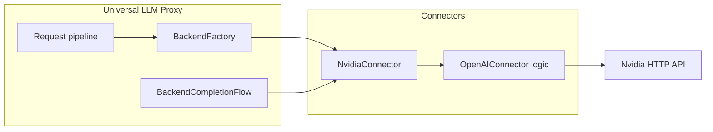
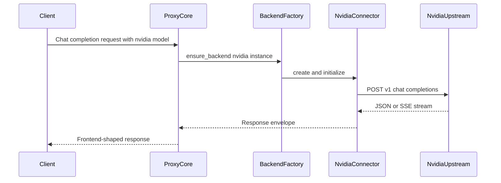

# Design: Nvidia API backend

## Overview

**Purpose**: Add a first-class **Nvidia** backend so operators can route chat traffic to NVIDIA-hosted (or self-hosted) NIM OpenAI-compatible inference using existing proxy frontends and `backend:model` selection.

**Users**: Operators configure credentials and base URL; client applications use unchanged OpenAI-compatible frontends; maintainers extend the connector catalog using established patterns.

**Impact**: Introduces one new connector module auto-discovered with other backends. No new request-processor stages or DI services. Shared completion, failover, usage, and wire-capture pipelines consume the new backend like existing API-key providers.

### Goals

- Expose stable backend type `nvidia` with registry registration and OpenAI-compatible chat completions to NVIDIA inference HTTP API.
- Support configuration via `BackendConfig` (YAML and related precedence) plus `NVIDIA_API_KEY` when no higher-precedence key is supplied.
- Preserve async execution, structured errors, observability, and documentation parity with comparable connectors (e.g. ZenMux).

### Non-Goals

- OAuth or multi-user personal credential flows for Nvidia (API key only in this feature).
- Non-chat NVIDIA APIs (embeddings-only, reward-only, or VLM-specific endpoints) unless they already map cleanly through the existing OpenAI chat path.
- Changes to frontend route shapes or new public HTTP endpoints on the proxy.

## Architecture

### Existing architecture analysis

- **Staged init**: Backends are constructed in the backend stage; `backend_imports` ensures connector packages load and self-register.
- **Factory**: `BackendFactory.ensure_backend` builds `init_config` from `BackendConfig`, applies optional initialization strategies, instantiates via `backend_registry`, then calls `initialize`.
- **Execution**: `BackendCompletionFlow` orchestrates calls; connectors return `ResponseEnvelope` / `StreamingResponseEnvelope`; errors map through `LLMProxyError` and transport adapters.
- **Config**: `BackendSettings` holds dynamic `backends.<name>` entries modeled by `BackendConfig` (`api_key`, `api_url`, `models`, `timeout`, `extra`).

### Architecture pattern and boundary map

**Selected pattern**: **Adapter (connector)** — one new `LLMBackend` implementation specialized for Nvidia, delegating protocol details to the existing `OpenAIConnector` implementation.

**Boundaries**:

- **Connector (`src/connectors/`)**: Nvidia-specific defaults (base URL, env key, optional headers), registration side effect only.
- **Core services**: Unchanged contracts; backend type string participates in routing, health, captures, and failover like other types.
- **Config**: Uses generic `BackendConfig`; no mandatory new `AppConfig` fields if YAML keys under `backends.nvidia` suffice.

**Steering compliance**: Async I/O, DI-owned shared `httpx.AsyncClient`, `LLMBackend` / `IHealthAware` behavior, absolute imports from `src`.

### Availability and listing (1.3)

For **Requirement 1.3**, “not advertised as an available routing target” means the same behavior as other API-key OpenAI-style connectors (e.g. OpenAI, ZenMux) when the backend is **unconfigured**:

- **Model catalogs and listings** that derive from `get_available_models()` / post-`initialize` discovery: if there is **no API key** (after YAML, CLI, and `NVIDIA_API_KEY` resolution) and no static `models` list in config, **`available_models` is empty**, so `nvidia`-prefixed models do not appear as selectable options where the proxy filters by discovered models.
- **Explicit routing** (e.g. client sends `backend:model` with `nvidia:...`): the proxy does not silently rewrite to another vendor; **missing or invalid credentials** yield the same structured errors and HTTP statuses as comparable backends (see **Error handling** below), not an unlabeled fallback.

No separate “hide from registry” mechanism is introduced: the connector remains registered for import-time discovery; **visibility and usability** follow existing backend-service rules for empty model sets and auth failures.

### Technology stack

| Layer | Choice | Role in feature |
|-------|--------|-----------------|
| Runtime | Python 3.10+, FastAPI async | Unchanged |
| HTTP | Shared `httpx.AsyncClient` | Injected by `BackendFactory` |
| Connector base | `OpenAIConnector` subclass | OpenAI-compatible JSON and SSE |
| Registration | `backend_registry.register_backend` | Import-time discovery |
| Config | `BackendConfig` + YAML `backends.nvidia` | `api_key`, `api_url`, optional `models` |
| Secrets (env) | `NVIDIA_API_KEY` | Read in connector `initialize` when `api_key` absent from kwargs |

## System flows

### Chat completion (non-streaming and streaming)

**Decisions**: Routing and model selection reuse existing `backend:model` parsing. Streaming follows `OpenAIConnector` path (no full-buffer policy change). Correlation IDs remain attached by existing logging and capture wrappers around backend execution.

## Requirements traceability

| Requirement | Summary | Components | Interfaces | Flows |
|-------------|---------|------------|------------|-------|
| 1.1, 1.2 | Stable `nvidia` id and registry registration | New connector module + import discovery | `LLMBackend` via `OpenAIConnector` | Registration at import |
| 1.3 | Unconfigured backend not a valid target | Same listing and routing behavior as OpenAI-style peers; see **Availability and listing (1.3)** | Existing routing contracts | Request routing |
| 2.1, 2.3 | URL, timeout, models via `BackendConfig` | YAML `backends.nvidia`, semantic validation | `BackendConfig` | Factory `init_config` |
| 2.2 | Predictable failure without silent vendor switch | Existing error mapping; no Nvidia-specific fallback | `LLMProxyError` family | Completion flow |
| 2.4 | `NVIDIA_API_KEY` when no higher-precedence key | `NvidiaConnector.initialize` | Same as Zenmux pattern | Initialize |
| 3.1–3.4 | Chat forward, stream, correlation | `OpenAIConnector` methods | `LLMBackend` | Sequence above |
| 4.1–4.3 | Errors, failover, usage | `BackendCompletionFlow`, parent error and usage handling | Existing collaborators | Completion flow |
| 5.1–5.2 | Captures and structured logs | Global capture pipeline | Existing | Same as other backends |
| 6.1–6.2 | User docs | `docs/user_guide/backends/nvidia.md`, `overview.md` | N/A | N/A |

## Components and interfaces

**DI registration**: No new application services. Connector factory registration only (`register_backend` at module import).

| Component | Layer | Intent | Req coverage | Contracts |
|-----------|-------|--------|--------------|-----------|
| NvidiaConnector | `src/connectors/` | Nvidia NIM OpenAI-compatible adapter | 1.x, 2.x, 3.x, 4.x, 5.x | Extends `OpenAIConnector`; `backend_type = "nvidia"` |
| User documentation | `docs/user_guide/backends/` | Operator onboarding | 6.x | Markdown |

### Connectors layer: NvidiaConnector

| Field | Detail |
|-------|--------|
| Intent | Route chat completions to NVIDIA inference API with correct base URL, auth, and model ids |
| Base class | `OpenAIConnector` |
| Backend type | `nvidia` |
| Default base URL | `https://integrate.api.nvidia.com/v1` (overridable via `BackendConfig.api_url` mapped to `api_base_url` in factory) |
| Vendor prefix | `None` (upstream model ids are already vendor-qualified) |

**Responsibilities**

- **`initialize`**: If `api_key` missing in kwargs, set from `NVIDIA_API_KEY` when present; delegate to `super().initialize` with `api_base_url` defaulting to connector default.
- **`get_headers`**: Use `Authorization: Bearer <api_key>` via parent unless Nvidia documentation requires extra headers (to be validated during implementation; see `research.md`).
- **Chat completions**: Inherit non-streaming and streaming behavior from parent; no duplicate HTTP client logic.

**Health**: Reuse `OpenAIConnector` health check against `{api_base_url}/models` when key present.

**Activity tracking**: Inherited from `LLMBackend` base; no change.

## Data models

- **Configuration**: Reuse `BackendConfig` fields (`api_key`, `api_url`, `models`, `timeout`, `extra`). Optional: document env alias `NVIDIA_API_BASE_URL` only if implementation adds factory-level mapping; otherwise document YAML `api_url` only for base override.
- **Wire / domain payloads**: No new Pydantic models; request and response shapes remain OpenAI-compatible envelopes already handled by `OpenAIConnector` and translation services.

## Error handling

- Reuse existing mapping from HTTP status and error JSON to `AuthenticationError`, `BackendError`, `InvalidRequestError`, etc., as implemented on `OpenAIConnector` and shared streaming error helpers.
- Nvidia-specific error bodies that deviate from OpenAI shape: normalize in connector only if integration tests prove a gap; otherwise treat as generic backend error with logged raw payload at debug level.

### Credential and init failure semantics (2.2)

For **Requirement 2.2**, behavior **matches comparable OpenAI-style backends** (no Nvidia-specific fail-fast at startup unless product later tightens requirements globally):

- **Missing API key** at `initialize`: parent path skips `GET /models` discovery; logs at DEBUG; **`available_models` stays empty**; process startup continues.
- **Invalid or rejected API key** on `GET /models` during init: parent catches exceptions, logs a **WARNING**, leaves **`available_models` empty**; startup continues.
- **First use / request time**: when a client actually invokes chat completions against Nvidia **without a usable key** or with upstream auth failure, existing completion and routing layers surface **operator-visible** structured errors (`LLMProxyError` subclasses, consistent HTTP mapping)—**no silent switch** to another vendor backend.

This preserves predictable failure at the point of use while avoiding a one-off stricter startup policy for Nvidia only.

## Testing strategy

- **Unit**: New tests under `tests/unit/connectors/`, modeled on `test_zenmux_connector.py` and `test_zenmux_usage_tracking.py` — cover `initialize` env fallback, default base URL, header construction, and mocked `httpx` responses for `/models` and `/chat/completions`.
- **Mandatory for 4.3 (usage / streaming parity)**:
  - **Non-streaming**: At least one test using a **fixture** (synthetic JSON body) shaped like a successful Nvidia/OpenAI-compatible chat completion response **with `usage` populated**; assert the same usage extraction / accounting path used for OpenAI-style backends records expected token counts (or documents a single known gap in the user guide if upstream omits fields).
  - **Streaming**: At least one test using **SSE-style chunks** (fixture or recorded fragment) that includes **final usage** (e.g. OpenAI-style stream ending with usage object) when the vendor supplies it; assert aggregates match expectations. If Nvidia streams omit usage entirely, **document that limitation** in the backend user guide so 4.3 is satisfied by explicit scope.
- **Integration** (optional supplement): Mocked upstream or recorded responses for end-to-end connector call if unit fixtures are insufficient.
- **Regression**: Run connector-related unit tests and full pytest per `AGENTS.md` after implementation.

## Security considerations

- Never log raw `NVIDIA_API_KEY`; rely on existing factory redaction for logged `init_config`.
- API keys only from config kwargs or `NVIDIA_API_KEY` per precedence documented in user guide.

## Performance and scalability

- No additional sync I/O; shared `httpx` connection pooling unchanged.
- No extra allocations on hot path beyond parent connector behavior.

## Stage registration

- **No new stages**. New file under `src/connectors/` is picked up by existing `pkgutil` discovery in `src/connectors/__init__.py` (module name not in skip list).

## Supporting references

- Detailed API notes and trade-offs: `.kiro/specs/nvidia-api-backend/research.md`
- Prior gap analysis: `.kiro/specs/nvidia-api-backend/gap-analysis.md`
