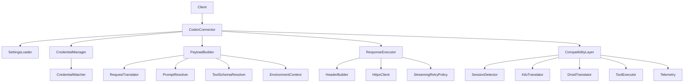
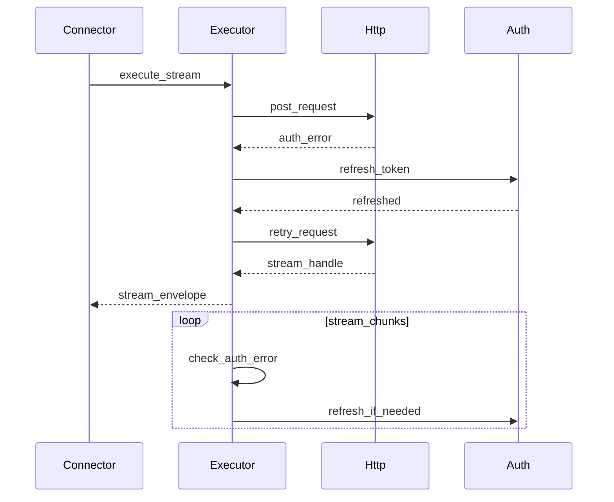
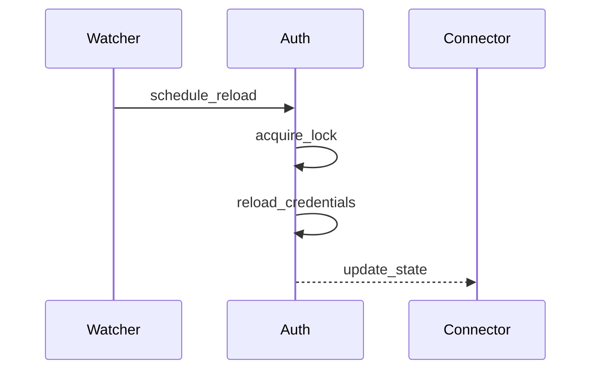

# Design Document

---
**Purpose**: Provide sufficient detail to ensure implementation consistency across different implementers, preventing interpretation drift.

**Approach**:

- Include essential sections that directly inform implementation decisions
- Omit optional sections unless critical to preventing implementation errors
- Match detail level to feature complexity
- Use diagrams and tables over lengthy prose

**Warning**: Approaching 1000 lines indicates excessive feature complexity that may require design simplification.

**Project Context**: Universal LLM Proxy - FastAPI async service with staged initialization, DI containers, adapter pattern for LLM backends
---

## Overview

This design refactors the OpenAI Codex connector into cohesive components while preserving current runtime behavior, compatibility modes, and error semantics. The outcome is a smaller connector facade that delegates to dedicated services for credentials, payload construction, streaming execution, and compatibility flows.

The primary users are proxy developers and maintainers who need to extend or debug Codex behavior without re-learning a 4k LOC file. Operators benefit from preserved auth resilience, streaming stability, and unchanged observability signals.

Impact: the connector implementation becomes modular and easier to test while keeping the same backend type, configuration surface, and responses for existing clients.

### Goals

- Reduce `src/connectors/openai_codex.py` size by extracting responsibilities into smaller modules.
- Preserve behavior for responses, streaming, errors, and compatibility modes.
- Introduce stable internal interfaces to improve test seams and maintainability.

### Non-Goals

- Changing external API behavior, response schemas, or configuration keys.
- Introducing new protocol support or new backend types.
- Modifying core routing, staged initialization, or DI container behavior.

## Architecture

### Existing Architecture Analysis (if applicable)

**Summary**: The current connector extends `OpenAIConnector` and implements Codex-specific auth, payload construction, streaming retry, and compatibility translation. It already uses helper modules (`_openai_codex_*`) but the connector owns cross-cutting concerns and state.

**Scope**:

- Maintains registration in `backend_registry` and auto-import behavior.
- Integrates with `TranslationService` and `OpenAIConnector` request handling.
- Owns credential reload and file watcher scheduling, plus compatibility flows.

**Decisions**:

- Preserve connector registration and public import path.
- Keep compatibility layer behaviors unchanged while relocating logic.

**Impacts/Risks**:

- Refactor must not alter concurrency patterns for credentials or streaming.
- Tests currently access internal attributes; a compatibility adapter is required.

### Architecture Pattern & Boundary Map

**Summary**: Use a facade connector that delegates to internal component services following single-responsibility boundaries.

**Scope**: Internal component boundaries remain within `src/connectors/` and do not introduce new staged initialization steps.

**Decisions**:

- Selected pattern: Facade + component services.
- Domain boundaries: settings, credentials, payload, response execution, compatibility.
- Existing patterns preserved: adapter pattern for connectors, DI-style interfaces for test seams.

**Impacts/Risks**:

- Requires careful interface boundaries to avoid regressions in streaming and auth.



**Architecture Integration**:

- New components are connector-local; no new core services are introduced.
- The facade maintains the existing `OpenAICodexConnector` class and backend registration.

### Technology Stack

| Layer | Choice / Version | Role in Feature | Notes |
|-------|------------------|-----------------|-------|
| Runtime | Python 3.10+ / FastAPI async | Connector runtime | Use async for all I/O |
| HTTP Client | httpx async | Codex API calls | Shared client injected into connector |
| Connectors | `LLMBackend` base | Backend adapter | Preserve `chat_completions` and `initialize` |
| Config | `AppConfig` | Codex settings | Preserve CLI > ENV > YAML precedence |
| Logging | structlog / logging | Observability | Preserve log fields and levels |

## System Flows

### Streaming authentication retry



**Decisions**: Preserve retry limits and backoff, including handshake and chunk-level failures.

### Credential reload from file watcher



**Decisions**: Keep event gating to ensure a single reload task per change window.

## Requirements Traceability

| Requirement | Summary | Components | Interfaces | Flows |
|-------------|---------|------------|------------|-------|
| 1.1 | Response payload parity | ResponseExecutor, PayloadBuilder | IResponseExecutor, IPayloadBuilder | Streaming authentication retry |
| 1.2 | Streaming ordering and termination parity | ResponseExecutor | IResponseExecutor | Streaming authentication retry |
| 1.3 | Error mapping parity | ResponseExecutor, CredentialManager | IResponseExecutor, ICredentialManager | Streaming authentication retry |
| 1.4 | Config keys and defaults parity | SettingsLoader | ISettingsLoader | Credential reload from file watcher |
| 1.5 | Request parameter transformation parity | PayloadBuilder, RequestTranslator | IPayloadBuilder, IRequestTranslator | Streaming authentication retry |
| 1.6 | Passthrough detection parity | PayloadBuilder | IPayloadBuilder | Streaming authentication retry |
| 1.7 | Tool schema collision handling | ToolSchemaResolver | IToolSchemaResolver | Streaming authentication retry |
| 2.1 | Distinct components for responsibilities | All components | Component interfaces | N/A |
| 2.2 | Decoupled request and response changes | PayloadBuilder, ResponseExecutor | IPayloadBuilder, IResponseExecutor | N/A |
| 2.3 | Optional capabilities encapsulated | CompatibilityLayer, ResponseExecutor | ICompatibilityLayer, IResponseExecutor | Streaming authentication retry |
| 2.4 | Explicit contracts between components | Component interfaces | Interfaces listed | N/A |
| 3.1 | Backend registration preserved | CodexConnector | N/A | N/A |
| 3.2 | DI and collaborator injection | CodexConnector, Component interfaces | ISettingsLoader, ICredentialManager | N/A |
| 3.3 | Layering compliance | All components | N/A | N/A |
| 3.4 | Staged init compatibility | CodexConnector | N/A | N/A |
| 4.1 | Mockable request and response paths | PayloadBuilder, ResponseExecutor | IPayloadBuilder, IResponseExecutor | N/A |
| 4.2 | Isolated changes for new fields | PayloadBuilder, ToolSchemaResolver | IPayloadBuilder, IToolSchemaResolver | N/A |
| 4.3 | Documented interfaces for tests | Component interfaces | All interfaces | N/A |
| 4.4 | Type annotations preserved | All components | N/A | N/A |
| 5.1 | Usage metadata preserved | ResponseExecutor | IResponseExecutor | Streaming authentication retry |
| 5.2 | Wire capture data preserved | ResponseExecutor | IResponseExecutor | Streaming authentication retry |
| 5.3 | Capture failure behavior parity | ResponseExecutor | IResponseExecutor | Streaming authentication retry |
| 5.4 | Structured logs preserved | ResponseExecutor, CompatibilityLayer | IResponseExecutor, ICompatibilityLayer | N/A |
| 6.1 | Credential concurrency safety | CredentialManager | ICredentialManager | Credential reload from file watcher |
| 6.2 | Atomic credential persistence | CredentialManager | ICredentialManager | Credential reload from file watcher |
| 6.3 | Single reload task per window | CredentialWatcher, CredentialManager | ICredentialManager | Credential reload from file watcher |
| 7.1 | Streaming handshake retry parity | ResponseExecutor | IResponseExecutor | Streaming authentication retry |
| 7.2 | Chunk-level retry parity | ResponseExecutor | IResponseExecutor | Streaming authentication retry |
| 7.3 | Exhausted retry error shape parity | ResponseExecutor | IResponseExecutor | Streaming authentication retry |
| 8.1 | Stable test seams | CodexConnector, Component interfaces | All interfaces | N/A |
| 8.2 | Attribute compatibility adapters | CodexConnector | N/A | N/A |
| 8.3 | KiloCode and Droid flow parity | CompatibilityLayer | ICompatibilityLayer | Streaming authentication retry |
| 9.1 | Documented config keys honored | SettingsLoader | ISettingsLoader | N/A |
| 9.2 | Default behaviors preserved | SettingsLoader | ISettingsLoader | N/A |

## Components and Interfaces

### Component Summary

| Component | Layer | Intent | Req Coverage | DI Lifetime | Contracts |
|-----------|-------|--------|--------------|-------------|-----------|
| CodexConnector | `src/connectors/openai_codex.py` | Facade and backend adapter | 1.1-1.7, 3.1-3.4, 8.1-8.3 | Singleton | Connector |
| SettingsLoader | `src/connectors/openai_codex/settings.py` | Normalize configuration | 1.4, 9.1, 9.2 | Singleton | Service |
| CredentialManager | `src/connectors/openai_codex/credentials.py` | Load, validate, refresh credentials | 6.1-6.3, 1.3 | Singleton | Service |
| CredentialWatcher | `src/connectors/openai_codex/credentials.py` | File watcher scheduling | 6.3 | Singleton | Service |
| PayloadBuilder | `src/connectors/openai_codex/payload.py` | Build Codex payloads | 1.5, 1.6 | Singleton | Service |
| RequestTranslator | `src/connectors/openai_codex/request_translator.py` | Translate chat requests to Codex format | 1.5 | Singleton | Service |
| ToolSchemaResolver | `src/connectors/openai_codex/tool_schema.py` | Resolve tool schema and collisions | 1.7 | Singleton | Service |
| PromptResolver | `src/connectors/openai_codex/prompt.py` | Resolve and sanitize prompts | 1.5 | Singleton | Service |
| ResponseExecutor | `src/connectors/openai_codex/executor.py` | Execute Codex responses API | 1.1-1.3, 5.1-5.4, 7.1-7.3 | Singleton | Service |
| CompatibilityLayer | `src/connectors/openai_codex/compat.py` | KiloCode and Droid flows | 1.2, 2.3, 8.3 | Singleton | Service |
| ToolExecutionService | `src/connectors/openai_codex/tools.py` | Execute proxy and MCP tools | 8.3 | Singleton | Service |

**DI Registration Strategy**: Components are registered via `ServiceCollection` as an optional `CodexConnectorDependencies` factory in the Backend stage. The connector facade accepts an optional dependencies bundle; if absent, it calls a default factory that builds concrete components. This preserves DI patterns while keeping the connector registry entry unchanged.

### Connectors Layer (`src/connectors/`)

#### OpenAICodexConnector (Facade)

| Field | Detail |
|-------|--------|
| Intent | Backend adapter for OpenAI Codex using OAuth tokens |
| Requirements | 1.1-1.7, 3.1-3.4, 8.1-8.3 |
| Base Class | `OpenAIConnector` |
| DI Lifetime | Singleton |

**Responsibilities & Constraints**

- Delegates auth, payload, execution, and compatibility logic to component services.
- Preserves backend type, registry registration, and public import path.
- Exposes legacy attributes or adapter properties needed for existing tests.
- Normalizes legacy `**kwargs` initialization into `CodexInitOptions` for internal use.

**Dependencies (via DI)**

- Outbound: SettingsLoader, CredentialManager, PayloadBuilder, ResponseExecutor, CompatibilityLayer.
- External: httpx `AsyncClient`, `TranslationService` (from base connector).
- Construction: backend factory resolves `CodexConnectorDependencies` from `ServiceCollection` when available.

**Contracts**: Service [ ] / Event [ ] / Middleware [ ]

##### Connector Interface

```python
from abc import ABC, abstractmethod
from src.connectors.openai_codex.contracts import ToolArguments, ToolExecutionResult
from src.connectors.openai_codex.contracts import (
    CodexRequestContext,
    CompatibilityResult,
    CompatibilityState,
    ProviderStreamChunk,
)
from src.core.domain.responses import ResponseEnvelope, StreamingResponseEnvelope
from src.core.domain.chat import CanonicalChatRequest
from src.connectors.openai_codex.contracts import CodexInitOptions, ProcessedMessage

class ICodexConnector(ABC):
    @abstractmethod
    async def initialize(self, options: CodexInitOptions) -> None:
        """Initialize credentials and connector state."""
        ...

    @abstractmethod
    async def chat_completions(
        self,
        request_data: CanonicalChatRequest,
        processed_messages: list[ProcessedMessage],
        effective_model: str,
    ) -> ResponseEnvelope | StreamingResponseEnvelope:
        """Execute Codex chat completions or responses."""
        ...
```

- Preconditions: `initialize` must succeed before `chat_completions`.
- Postconditions: Behavior parity with current connector, including streaming retry behavior.

### Services Layer (`src/connectors/openai_codex/`)

#### SettingsLoader

| Field | Detail |
|-------|--------|
| Intent | Build connector settings with precedence and validation |
| Requirements | 1.4, 9.1, 9.2 |
| Interface | `ISettingsLoader` |
| DI Lifetime | Singleton |

**Responsibilities & Constraints**

- Normalize settings for capabilities, prompt, tool schema, renderer, streaming, and compatibility.
- Preserve config precedence and defaults.

**Dependencies (via DI)**

- External: `AppConfig`, environment variables.

**Contracts**: Service [x] / Event [ ] / Middleware [ ]

##### Service Interface

```python
from abc import ABC, abstractmethod
from src.core.config.app_config import AppConfig

class ISettingsLoader(ABC):
    @abstractmethod
    def load(self, app_config: AppConfig) -> "CodexConnectorSettings":
        """Return normalized settings for the connector."""
        ...
```

- Preconditions: `app_config` is validated by core config loader.
- Postconditions: Settings include defaults and environment overrides.

#### CredentialManager

| Field | Detail |
|-------|--------|
| Intent | Manage credential loading, validation, refresh, and concurrency |
| Requirements | 6.1-6.3, 1.3 |
| Interface | `ICredentialManager` |
| DI Lifetime | Singleton |

**Responsibilities & Constraints**

- Own all locks and concurrency gating for auth.
- Perform atomic persistence on refresh.

**Dependencies (via DI)**

- Outbound: CredentialWatcher for file changes.
- External: file system, httpx client for token refresh.

**Contracts**: Service [x] / Event [ ] / Middleware [ ]

##### Service Interface

```python
from abc import ABC, abstractmethod
from pathlib import Path

class ICredentialManager(ABC):
    @abstractmethod
    async def initialize(self, auth_path: Path | None) -> None:
        """Load initial credentials and start watcher."""
        ...

    @abstractmethod
    async def refresh_access_token(self) -> bool:
        """Refresh the access token in a concurrency-safe manner."""
        ...

    @abstractmethod
    def get_access_token(self) -> str | None:
        """Return current access token if available."""
        ...

    @abstractmethod
    async def shutdown(self) -> None:
        """Stop the file watcher and release resources.

        This method ensures clean shutdown by:
        - Stopping the credential file watcher
        - Cancelling any pending reload tasks
        - Releasing concurrency locks

        Safe to call multiple times; subsequent calls are no-ops.
        """
        ...

    @abstractmethod
    def is_watcher_running(self) -> bool:
        """Return True if the credential file watcher is active."""
        ...
```

- Preconditions: `initialize` called once per connector lifecycle.
- Postconditions: Refresh never leaves credentials in a partially written state.
- Shutdown postconditions: Watcher is stopped and `is_watcher_running()` returns False.

#### PayloadBuilder

| Field | Detail |
|-------|--------|
| Intent | Build Codex payloads and conversation identifiers |
| Requirements | 1.5, 1.6 |
| Interface | `IPayloadBuilder` |
| DI Lifetime | Singleton |

**Responsibilities & Constraints**

- Preserve passthrough detection behavior.
- Delegate prompt and tool schema logic to specialized services.

**Dependencies (via DI)**

- Outbound: RequestTranslator, PromptResolver, ToolSchemaResolver.
- Inbound: CodexConnector facade.

**Contracts**: Service [x] / Event [ ] / Middleware [ ]

##### Service Interface

```python
from abc import ABC, abstractmethod
from src.connectors.openai_codex.contracts import CodexPayload, CodexRequestContext

class IPayloadBuilder(ABC):
    @abstractmethod
    def build_payload(self, context: CodexRequestContext) -> CodexPayload:
        """Build a Codex payload preserving passthrough rules."""
        ...
```

- Preconditions: `CodexRequestContext` contains resolved model and messages.
- Postconditions: Payload is compatible with Codex Responses API and preserves behavior.

#### RequestTranslator

| Field | Detail |
|-------|--------|
| Intent | Translate canonical chat requests to Codex input format |
| Requirements | 1.5 |
| Interface | `IRequestTranslator` |
| DI Lifetime | Singleton |

**Responsibilities & Constraints**

- Convert `CanonicalChatRequest` messages to Codex input items.
- Preserve parameter transformation semantics from current connector.
- Handle message role mapping and content normalization.

**Dependencies (via DI)**

- Inbound: PayloadBuilder
- External: None (pure transformation)

**Contracts**: Service [x] / Event [ ] / Middleware [ ]

##### Service Interface

```python
from abc import ABC, abstractmethod
from src.connectors.openai_codex.contracts import CodexInputItem, ProcessedMessage

class IRequestTranslator(ABC):
    @abstractmethod
    def translate_messages(
        self, messages: list[ProcessedMessage]
    ) -> list[CodexInputItem]:
        """Convert processed messages to Codex input items."""
        ...

    @abstractmethod
    def translate_tool_calls(
        self, tool_calls: list[ToolCall]
    ) -> list[CodexInputItem]:
        """Convert tool calls to Codex function_call input items."""
        ...
```

- Preconditions: Messages are pre-processed and validated.
- Postconditions: Output items match current Codex input schema.

#### PromptResolver

| Field | Detail |
|-------|--------|
| Intent | Resolve and sanitize system prompts for Codex requests |
| Requirements | 1.5 |
| Interface | `IPromptResolver` |
| DI Lifetime | Singleton |

**Responsibilities & Constraints**

- Load Codex system prompt from bundled resources or vendor sources.
- Apply prompt customization based on capabilities and settings.
- Sanitize prompts to prevent injection or encoding issues.

**Dependencies (via DI)**

- Inbound: PayloadBuilder
- External: Bundled prompt resources, vendor prompt sources

**Contracts**: Service [x] / Event [ ] / Middleware [ ]

##### Service Interface

```python
from abc import ABC, abstractmethod
from src.connectors.openai_codex.contracts import CodexConnectorSettings, CodexClientCapabilities

class IPromptResolver(ABC):
    @abstractmethod
    def resolve_system_prompt(
        self,
        settings: CodexConnectorSettings,
        capabilities: CodexClientCapabilities,
    ) -> str:
        """Return the resolved system prompt for the request."""
        ...

    @abstractmethod
    def resolve_instructions(
        self,
        settings: CodexConnectorSettings,
        user_instructions: str | None,
    ) -> str | None:
        """Return merged instructions or None if not applicable."""
        ...
```

- Preconditions: Settings and capabilities are validated.
- Postconditions: Prompt content is sanitized and ready for API submission.

#### ResponseExecutor

| Field | Detail |
|-------|--------|
| Intent | Execute Codex Responses API and manage streaming retries |
| Requirements | 1.1-1.3, 5.1-5.4, 7.1-7.3 |
| Interface | `IResponseExecutor` |
| DI Lifetime | Singleton |

**Responsibilities & Constraints**

- Preserve streaming retry, error mapping, and usage metadata.
- Apply header refresh on token updates.

**Dependencies (via DI)**

- Outbound: HeaderBuilder, CredentialManager, CompatibilityLayer.
- External: httpx client, base `OpenAIConnector` methods for HTTP interactions.

**Contracts**: Service [x] / Event [ ] / Middleware [ ]

##### Service Interface

```python
from abc import ABC, abstractmethod
from src.core.domain.responses import ResponseEnvelope, StreamingResponseEnvelope
from src.connectors.openai_codex.contracts import CodexPayload, CodexRequestContext

class IResponseExecutor(ABC):
    @abstractmethod
    async def execute(
        self, payload: CodexPayload, context: CodexRequestContext
    ) -> ResponseEnvelope | StreamingResponseEnvelope:
        """Execute Codex request with retry and compatibility handling."""
        ...
```

- Preconditions: Payload and headers are already validated.
- Postconditions: Error shapes and statuses match current behavior.

#### CompatibilityLayer

| Field | Detail |
|-------|--------|
| Intent | Handle KiloCode and Droid compatibility flows |
| Requirements | 1.2, 2.3, 8.3 |
| Interface | `ICompatibilityLayer` |
| DI Lifetime | Singleton |

**Responsibilities & Constraints**

- Maintain current detection heuristics and tool translation semantics.
- Preserve tool execution results formatting.
- Own per-request compatibility state (tool-call caches, translation buffers) and define cleanup rules after streaming completes.

**Dependencies (via DI)**

- Outbound: SessionDetector, KiloToolTranslator, DroidSessionDetector, DroidToolTranslator, ToolExecutionService.

**Contracts**: Service [x] / Event [ ] / Middleware [ ]

##### Service Interface

```python
from abc import ABC, abstractmethod

class ICompatibilityLayer(ABC):
    @abstractmethod
    async def apply(self, context: CodexRequestContext) -> CompatibilityResult:
        """Detect and translate compatibility tool calls."""
        ...

    @abstractmethod
    async def translate_stream_chunk(
        self, chunk: ProviderStreamChunk, state: CompatibilityState
    ) -> ProviderStreamChunk:
        """Apply streaming tool-call translations with owned state."""
        ...

    @abstractmethod
    async def cleanup_state(self, state: CompatibilityState) -> None:
        """Release per-request state after streaming completes or on error.

        This method MUST be called after streaming ends (success or failure) to:
        - Clear tool-call caches and translation buffers
        - Release any pending tool-call references
        - Reset detection flags

        The state object should not be reused after cleanup.
        """
        ...

    @abstractmethod
    def create_state(self) -> CompatibilityState:
        """Create a new per-request compatibility state instance.

        Returns a fresh state object for tracking compatibility flows
        during a single request lifecycle.
        """
        ...
```

- Preconditions: Request context has processed messages.
- Postconditions: Tool translations and results match current behavior.
- Cleanup postconditions: State resources are released; state object is invalidated.

#### ToolExecutionService

| Field | Detail |
|-------|--------|
| Intent | Execute proxy-side and MCP tools for compatibility flows |
| Requirements | 8.3 |
| Interface | `IToolExecutionService` |
| DI Lifetime | Singleton |

**Responsibilities & Constraints**

- Execute proxy tools via `UniversalToolExecutor` and format results consistently.
- Execute MCP tool calls with timeout handling and structured error mapping.

**Dependencies (via DI)**

- External: `UniversalToolExecutor`, MCP client bridge, telemetry hooks.

**Contracts**: Service [x] / Event [ ] / Middleware [ ]

##### Service Interface

```python
from abc import ABC, abstractmethod

class IToolExecutionService(ABC):
    @abstractmethod
    async def execute_proxy_tool(
        self, tool_name: str, arguments: ToolArguments
    ) -> ToolExecutionResult:
        """Execute a proxy tool and return formatted result."""
        ...

    @abstractmethod
    async def execute_mcp_tool(
        self, tool_name: str, arguments: ToolArguments
    ) -> ToolExecutionResult:
        """Execute an MCP tool and return formatted result."""
        ...
```

## Data Models

**Summary**: Introduce connector-local contract models to reduce ad-hoc dicts between internal components.

**Scope**: Models are internal to `src/connectors/openai_codex/` and do not alter external APIs.

**Decisions**:

- Use Pydantic v2 models or dataclasses for internal contracts.
- Keep outward payloads as `dict` at the HTTP boundary only.

**Impacts/Risks**:

- Minor conversion overhead; improved type safety and testability.

### Domain Model (`src/connectors/openai_codex/`)

**Core Contract Models** (Pydantic v2 or dataclasses):

| Model | Fields | Invariants |
|-------|--------|------------|
| `CodexConnectorSettings` | `default_capabilities`, `agent_overrides`, `prompt`, `tool_schema`, `streaming`, `compatibility_layer`, `renderer` | Defaults and env overrides applied; normalized types |
| `CodexInitOptions` | `openai_codex_path: str | None`,`openai_api_base_url: str | None`,`enable_openai_codex_backend_debugging_override: bool | None`,`backend_extras: dict[str, object] | None` | Values validated and normalized from legacy `**kwargs` |
| `CodexRequestContext` | `request: CanonicalChatRequest`, `processed_messages: list[ProcessedMessage]`, `effective_model: str`, `capabilities: CodexClientCapabilities`, `session_id: str`, `metadata: dict[str, object] | None` | `session_id` present; `effective_model` stripped of vendor prefix |
| `CodexPayload` | `model: str`, `input: list[CodexInputItem]`, `tools: list[CodexToolSchema]`, `tool_choice: str`, `parallel_tool_calls: bool`, `reasoning: ReasoningSpec | None`,`store: bool`,`stream: bool`,`include: list[str]`,`prompt_cache_key: str`,`instructions: str | None`,`extras: dict[str, object] | None` | Serialized payload matches current behavior and passthrough rules |
| `CompatibilityResult` | `codex_tools`, `proxy_tools`, `mcp_tools`, `tool_results`, `state: CompatibilityState` | Tool lists and results aligned with current compatibility behavior |
| `CompatibilityState` | `droid_tool_name_cache: dict[str, str]`, `droid_tool_args_buffer: dict[str, str]`, `pending_tool_calls: list[PendingToolCall]`, `is_kilocode: bool`, `is_droid: bool` | State is per-request; cleared after stream ends |
| `CodexConnectorDependencies` | Optional component overrides for settings, credentials, payload, executor, compatibility | All fields optional; defaults resolved by factory |

**Supporting Structures**:

- `ProcessedMessage`: `role: str`, `content: str | list[MessagePart]`, `tool_calls: list[ToolCall] | None`, `name: str | None`, `tool_call_id: str | None`, `metadata: dict[str, object] | None`.
- `MessagePart`: `type: str`, `text: str | None`, `data: object | None`.
- `ToolCall`: `id: str | None`, `type: str`, `function_name: str`, `arguments_json: str`.
- `CodexInputItem`: discriminated by `type` with minimal fields needed for Responses input items.
- `CodexToolSchema`: `name: str`, `description: str | None`, `parameters: dict[str, object]`, `type: str`.
- `ToolArguments`: `payload: dict[str, object]`.
- `ToolExecutionResult`: `success: bool`, `result: str`, `error: str | None`, `metadata: dict[str, object] | None`.
- `ProviderStreamChunk`: `raw: object` wrapper for provider-specific streaming chunks.
- `PendingToolCall`: `id: str`, `name: str`, `command_text: str`.

## Error Handling

### Error Strategy

- Preserve existing exceptions from `OpenAIConnector` and Codex connector paths.
- Continue to map authentication failures to HTTP 401/403 as today.
- Continue to return `HTTPException` payloads for upstream errors to maintain error shape parity.

### Health-Aware Integration

- The facade continues to implement `is_backend_functional` and uses existing degraded and recovered states.

## Testing Strategy

**Summary**: Retain existing Codex tests and add component-level unit tests for extracted services.

**Scope**: Unit tests cover settings, credentials, payload, and streaming retry policy. Integration tests keep KiloCode and Droid flows intact.

**Decisions**:

- Provide adapter properties in the facade for legacy tests accessing internal attributes.
- Add targeted tests for token refresh concurrency and streaming auth retry parity.

**Impacts/Risks**:

- Some tests will require updates to use new interfaces or adapter properties.

### Unit Tests (`tests/unit/`)

- SettingsLoader: config precedence and default behavior
- CredentialManager: refresh lock and atomic persistence behavior
- PayloadBuilder: passthrough detection and tool schema collision handling

### Integration Tests (`tests/integration/`)

- Preserve `test_codex_kilo_compatibility_e2e.py` behavior
- Add streaming retry parity validation with mocked httpx responses

## Security Considerations

- Continue to redact secrets in logs and wire captures.
- Maintain atomic credential writes to avoid token leakage or corruption.

## Performance & Scalability

- Do not add extra network calls in critical paths.
- Avoid per-chunk allocations in streaming loops beyond existing behavior.

## Stage Registration

No new stages are required. Backend registration remains in the connector module import path. The Backend stage registers a dependencies factory so that DI can supply component overrides when needed.

```python
def _codex_dependencies_factory(provider: IServiceProvider) -> CodexConnectorDependencies:
    return CodexConnectorDependencies(
        settings_loader=provider.get_service(ISettingsLoader),
        credential_manager=provider.get_service(ICredentialManager),
        payload_builder=provider.get_service(IPayloadBuilder),
        response_executor=provider.get_service(IResponseExecutor),
        compatibility_layer=provider.get_service(ICompatibilityLayer),
        tool_execution_service=provider.get_service(IToolExecutionService),
    )

services.add_singleton(CodexConnectorDependencies, implementation_factory=_codex_dependencies_factory)
```

## Supporting References (Optional)

- `research.md` for detailed discovery notes and decision rationale.
