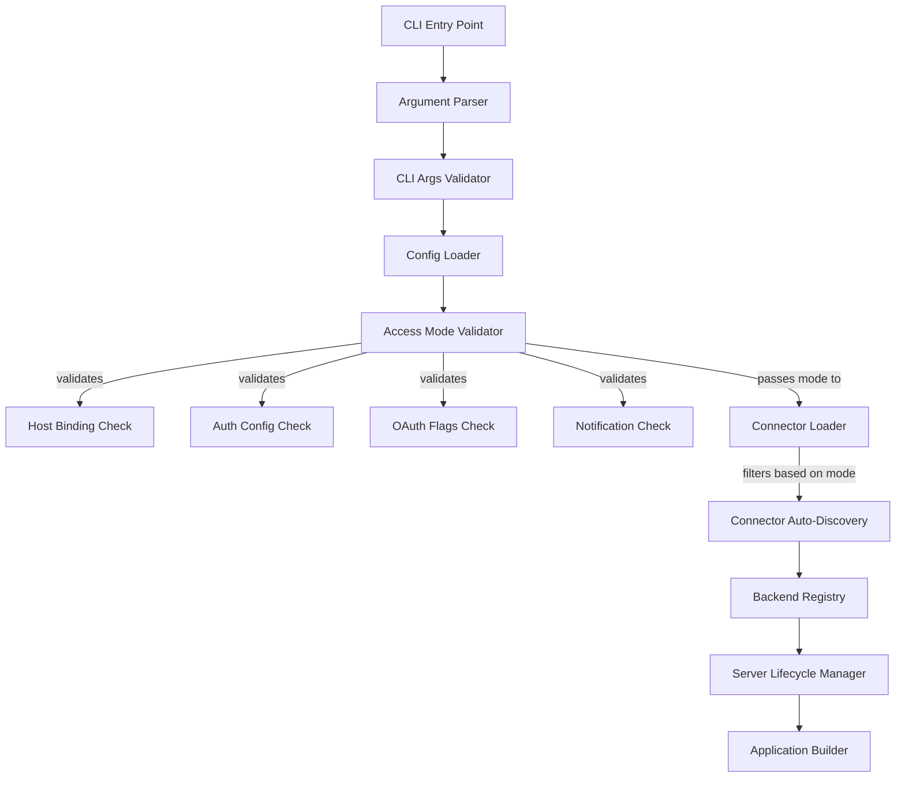
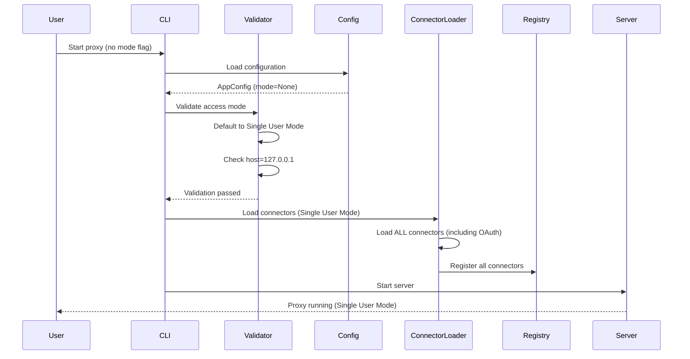
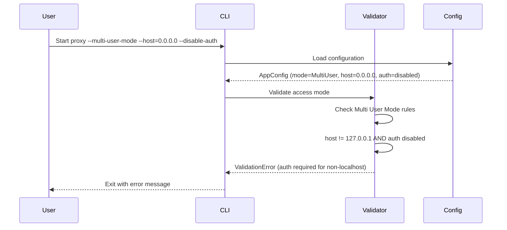
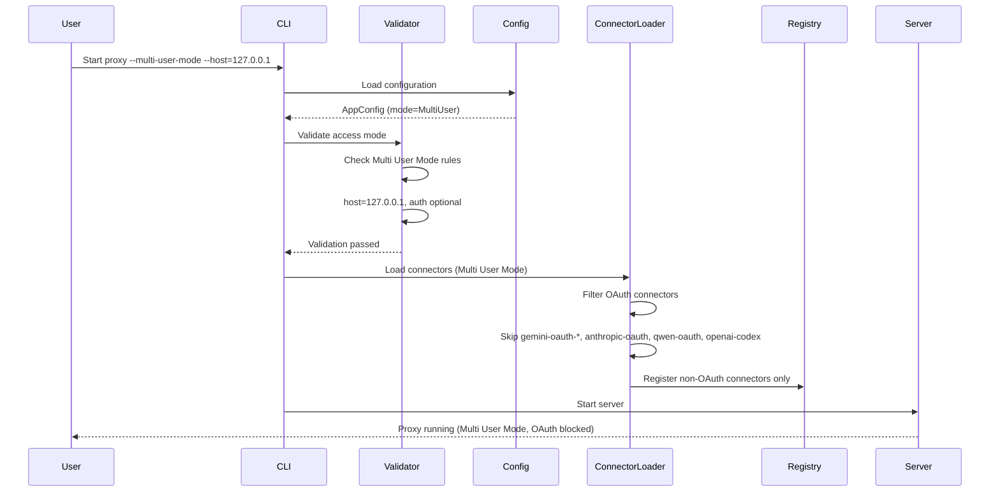

# Design Document

## Overview

This feature introduces two distinct runtime access modes for the Universal LLM Proxy: **Single User Mode** (default) and **Multi User Mode**. These modes enforce appropriate security boundaries based on deployment context, preventing common misconfigurations that could expose personal credentials or allow unauthenticated remote access.

### Goals
- Provide explicit access mode controls that enforce security boundaries appropriate to deployment context
- Prevent accidental exposure of OAuth-based personal credentials in shared/production deployments
- Enforce authentication requirements for non-localhost bindings in production mode
- Maintain backward compatibility with existing deployments (default to Single User Mode)
- Block desktop-specific features (notifications) in server deployment mode
- Provide clear, actionable error messages when validation fails

### Non-Goals
- Runtime switching between access modes (mode is immutable after startup)
- Automatic detection of deployment context beyond localhost binding
- Fine-grained per-connector access control (mode applies uniformly to all OAuth connectors)
- Migration of existing OAuth credentials to static credentials
- Support for OAuth connectors in Multi User Mode (explicitly blocked)

## Architecture

### Existing Architecture Analysis

Relevant existing components:
- `src/core/cli.py` - CLI entry point and main() function
- `src/core/cli_support/argument_parser_builder.py` - CLI argument construction
- `src/core/cli_support/cli_args_validator.py` - CLI argument validation
- `src/core/cli_support/server_lifecycle_manager.py` - Server startup coordination
- `src/core/config/app_config.py` - Application configuration model
- `src/connectors/__init__.py` - Backend connector auto-discovery and loading
- `src/core/services/backend_registry.py` - Backend registration
- `src/core/services/notification_service.py` - Desktop notification service

Observed gaps relative to requirements:
- No access mode concept exists in configuration or CLI
- No validation of host binding vs authentication state
- No mechanism to filter OAuth connectors during loading
- No validation of OAuth debugging override flags in production context
- No validation of desktop notifications vs deployment mode

### Architecture Pattern & Boundary Map

Selected pattern: **Early Validation + Filtered Connector Loading**.

Rationale:
- Validation occurs early in startup sequence (after config loading, before backend loading)
- OAuth connector filtering happens during auto-discovery phase
- Immutable access mode prevents runtime mode switching complexity
- Clear separation between validation logic and connector loading logic



Boundary ownership:
- **ArgumentParserBuilder** owns CLI flag definitions for access mode
- **CliArgsValidator** owns mutual exclusivity validation for mode flags
- **AccessModeValidator** (new) owns all access mode validation rules
- **ConnectorLoader** (enhanced) owns OAuth connector filtering based on mode
- **AppConfig** owns access mode storage and accessor methods
- **ServerLifecycleManager** coordinates validation execution during startup

### Technology Stack & Alignment

| Layer | Choice / Version | Role in Feature | Notes |
|------|------------------|-----------------|-------|
| Runtime | Python 3.10+ | Access mode validation and connector filtering | Validation must not block event loop |
| CLI | argparse | Access mode flag parsing | Mutually exclusive group for mode flags |
| Config | Pydantic v2 | Access mode configuration model | Immutable after startup |
| DI Container | `ServiceCollection` | Access mode validator registration | Must pass DI scanner |
| Initialization | Staged init | Validation before backend loading | Stage ordering critical |
| Connectors | Auto-discovery | OAuth filtering during import | Module-level filtering |

## System Flows

### Flow 1: Single User Mode Startup (Default)



Key decisions:
- Default mode is Single User Mode for backward compatibility
- Host binding validation enforces localhost-only in Single User Mode
- All connectors (including OAuth) are loaded
- OAuth debugging override flags are allowed

### Flow 2: Multi User Mode Startup with Validation Failure



Key decisions:
- Validation fails fast before backend loading
- Error message provides actionable guidance
- Non-zero exit code for automation compatibility

### Flow 3: Multi User Mode Startup with OAuth Connector Filtering



Key decisions:
- OAuth connector filtering happens during auto-discovery
- Filtered connectors are logged at INFO level
- Backend registry never sees OAuth connectors in Multi User Mode

## Requirements Traceability

| Requirement | Summary | Components | Interfaces | Flows |
|-------------|---------|------------|------------|-------|
| 1.1, 1.2, 1.3, 1.4, 1.5 | Access mode selection and logging | ArgumentParserBuilder, CliArgsValidator, AppConfig | N/A | Flow 1, 2, 3 |
| 2.1, 2.2, 2.3, 2.4 | Single User Mode localhost enforcement | AccessModeValidator | IAccessModeValidator | Flow 1 |
| 3.1, 3.2, 3.3, 3.4 | Single User Mode OAuth support | ConnectorLoader, CliArgsValidator | N/A | Flow 1 |
| 4.1, 4.2, 4.3 | Single User Mode optional auth | AccessModeValidator | IAccessModeValidator | Flow 1 |
| 5.1, 5.2, 5.3, 5.4, 5.5, 5.6 | Multi User Mode auth enforcement | AccessModeValidator | IAccessModeValidator | Flow 2, 3 |
| 6.1, 6.2, 6.3, 6.4, 6.5 | Multi User Mode OAuth blocking | ConnectorLoader, BackendRegistry | N/A | Flow 3 |
| 7.1, 7.2, 7.3, 7.4 | Multi User Mode OAuth flag rejection | CliArgsValidator, AccessModeValidator | IAccessModeValidator | Flow 2 |
| 8.1, 8.2, 8.3 | Multi User Mode OAuth auto-replacement rejection | CliArgsValidator, AccessModeValidator | IAccessModeValidator | Flow 2 |
| 9.1, 9.2, 9.3, 9.4, 9.5 | Multi User Mode notification rejection | AccessModeValidator | IAccessModeValidator | Flow 2 |
| 10.1, 10.2, 10.3, 10.4, 10.5 | Observability and logging | AppConfig, HealthController, ConnectorLoader | N/A | Flow 1, 3 |
| 11.1, 11.2, 11.3, 11.4 | Error messages and guidance | AccessModeValidator | IAccessModeValidator | Flow 2 |
| 12.1, 12.2, 12.3, 12.4 | Backward compatibility | AppConfig, AccessModeValidator | N/A | Flow 1 |
| 13.1, 13.2, 13.3, 13.4 | Documentation and help text | ArgumentParserBuilder | N/A | N/A |

## Components and Interfaces

### Components Summary

| Component | Layer | Intent | Req Coverage | DI Lifetime | Contracts |
|----------|-------|--------|--------------|-------------|----------|
| AccessModeValidator | core/cli_support | Validates access mode rules during startup | 2, 4, 5, 7, 8, 9, 11 | Transient | IAccessModeValidator |
| AccessModeConfig | core/config/models | Configuration model for access mode | 1, 10, 12 | N/A (data model) | N/A |
| ConnectorLoader | connectors | Filters OAuth connectors based on access mode | 3, 6, 10 | N/A (module-level) | N/A |
| ArgumentParserBuilder | core/cli_support | Adds access mode CLI flags | 1, 13 | Transient | N/A |
| CliArgsValidator | core/cli_support | Validates mode flag mutual exclusivity | 1, 7, 8 | Transient | N/A |

### Services Layer

#### AccessModeValidator

| Field | Detail |
|-------|--------|
| Intent | Validate all access mode rules during startup before backend loading |
| Requirements | 2.1-2.4, 4.1-4.3, 5.1-5.6, 7.1-7.4, 8.1-8.3, 9.1-9.5, 11.1-11.4 |
| Interface | `IAccessModeValidator` |
| Inputs | AppConfig (with access mode, host, auth config, notification config), parsed CLI args |
| Outputs | None (raises ValueError on validation failure) |

Interface contract:
- `validate(config: AppConfig, args: argparse.Namespace) -> None`

Behavioral rules:
- Validates Single User Mode requires localhost binding (host == "127.0.0.1")
- Validates Multi User Mode requires auth for non-localhost binding
- Validates Multi User Mode blocks OAuth debugging override flags
- Validates Multi User Mode blocks `--allow-oauth-auto-replacement` flag
- Validates Multi User Mode blocks desktop notifications
- Raises ValueError with actionable error messages on validation failure
- Validation occurs after config loading but before backend loading

#### ConnectorLoader (Enhanced)

| Field | Detail |
|-------|--------|
| Intent | Filter OAuth connectors during auto-discovery based on access mode |
| Requirements | 3.1, 6.1-6.5, 10.4-10.5 |
| Location | `src/connectors/__init__.py` |

OAuth connector detection rules:
- Connector name contains `-oauth-` or ends with `-oauth`
- Connector has `has_static_credentials` property returning `False`
- Known OAuth connectors: `gemini-oauth-*`, `anthropic-oauth`, `qwen-oauth`, `openai-codex`

Filtering behavior:
- In Single User Mode: Load all connectors (no filtering)
- In Multi User Mode: Skip OAuth connectors during auto-discovery
- Log skipped connectors at INFO level with count
- Log loaded OAuth connectors at DEBUG level in Single User Mode

### Configuration Layer

#### AccessModeConfig

| Field | Detail |
|-------|--------|
| Intent | Store access mode configuration |
| Requirements | 1.1-1.5, 10.1-10.3, 12.1-12.4 |
| Location | `src/core/config/models/access_mode.py` |

Data model:
```python
class AccessMode(str, Enum):
    SINGLE_USER = "single_user"
    MULTI_USER = "multi_user"

class AccessModeConfig(BaseModel):
    mode: AccessMode = AccessMode.SINGLE_USER
```

Integration with AppConfig:
- Add `access_mode: AccessModeConfig` field to AppConfig
- Default mode is SINGLE_USER for backward compatibility
- Mode is immutable after startup (no runtime switching)

## Data Models

### Access Mode Enumeration

```python
class AccessMode(str, Enum):
    """Proxy access mode enumeration."""
    SINGLE_USER = "single_user"  # Default: local development, OAuth allowed
    MULTI_USER = "multi_user"    # Production: shared deployment, OAuth blocked
```

### Access Mode Configuration

```python
class AccessModeConfig(BaseModel):
    """Access mode configuration."""
    mode: AccessMode = Field(
        default=AccessMode.SINGLE_USER,
        description="Proxy access mode (single_user or multi_user)"
    )
    
    def is_single_user(self) -> bool:
        """Check if running in Single User Mode."""
        return self.mode == AccessMode.SINGLE_USER
    
    def is_multi_user(self) -> bool:
        """Check if running in Multi User Mode."""
        return self.mode == AccessMode.MULTI_USER
```

### OAuth Connector Patterns

```python
# OAuth connector detection patterns
OAUTH_CONNECTOR_PATTERNS = [
    "-oauth-",  # Matches: gemini-oauth-auto, gemini-oauth-free, etc.
    "-oauth",   # Matches: anthropic-oauth, qwen-oauth
]

# Known OAuth connectors (explicit list for clarity)
KNOWN_OAUTH_CONNECTORS = [
    "gemini-oauth-auto",
    "gemini-oauth-free",
    "gemini-oauth-plan",
    "anthropic-oauth",
    "qwen-oauth",
    "openai-codex",  # Uses OAuth via auth.json
]
```

## Correctness Properties

*A property is a characteristic or behavior that should hold true across all valid executions of a system-essentially, a formal statement about what the system should do. Properties serve as the bridge between human-readable specifications and machine-verifiable correctness guarantees.*

### Property 1: Single User Mode localhost enforcement
*For any* host configuration value other than "127.0.0.1", when operating in Single User Mode, the system should refuse to start with a validation error.
**Validates: Requirements 2.2**

### Property 2: Multi User Mode authentication enforcement for non-localhost
*For any* host configuration value other than "127.0.0.1", when operating in Multi User Mode with authentication disabled, the system should refuse to start with a validation error.
**Validates: Requirements 5.4**

### Property 3: Multi User Mode allows non-localhost with authentication
*For any* host configuration value other than "127.0.0.1", when operating in Multi User Mode with authentication enabled, the system should start successfully.
**Validates: Requirements 5.3**

### Property 4: Multi User Mode blocks OAuth debugging override flags
*For any* OAuth debugging override flag (e.g., `--enable-*-oauth-*-backend-debugging-override`), when operating in Multi User Mode, the system should refuse to start with a validation error.
**Validates: Requirements 7.1**

### Property 5: Error messages provide actionable guidance
*For any* validation failure, the error message should contain actionable guidance on how to resolve the issue.
**Validates: Requirements 11.2**

### Property 6: Error messages reference relevant CLI flags
*For any* access mode validation failure, the error message should reference the relevant CLI flags or configuration options.
**Validates: Requirements 11.3**

### Property 7: Validation failures exit with non-zero code
*For any* validation failure, the system should exit with a non-zero exit code.
**Validates: Requirements 11.4**

## Error Handling

### Validation Error Taxonomy

| Error Type | Trigger | Error Message Pattern | Exit Code |
|------------|---------|----------------------|-----------|
| Mutual Exclusivity | Both `--single-user-mode` and `--multi-user-mode` specified | "Cannot specify both --single-user-mode and --multi-user-mode. Choose one." | 1 |
| Single User Non-Localhost | Single User Mode with host != 127.0.0.1 | "Single User Mode requires binding to 127.0.0.1 only. Current host: {host}. Use --multi-user-mode for remote access." | 1 |
| Multi User No Auth | Multi User Mode with host != 127.0.0.1 and auth disabled | "Multi User Mode requires authentication when binding to non-localhost addresses. Current host: {host}. Enable authentication via API keys or SSO." | 1 |
| Multi User OAuth Flags | Multi User Mode with OAuth debugging override flags | "OAuth debugging override flags are not allowed in Multi User Mode: {flags}. OAuth connectors are blocked in production deployments." | 1 |
| Multi User OAuth Replacement | Multi User Mode with `--allow-oauth-auto-replacement` | "OAuth auto-replacement (--allow-oauth-auto-replacement) is not allowed in Multi User Mode. OAuth connectors are blocked in production deployments." | 1 |
| Multi User Notifications | Multi User Mode with notifications enabled | "Desktop notifications are not allowed in Multi User Mode. Multi User Mode is for dedicated servers, not desktop computers. Use --disable-notifications or switch to Single User Mode." | 1 |

### Error Message Guidelines

All validation error messages must:
1. Clearly state what validation rule failed
2. Show the current configuration value that caused the failure
3. Provide actionable guidance on how to fix the issue
4. Reference relevant CLI flags or configuration options
5. Not leak sensitive information (API keys, tokens)

## Observability

### Startup Logging

Access mode logging during startup:

```
INFO: Starting LLM Proxy in Single User Mode (default)
DEBUG: Loaded OAuth connectors: gemini-oauth-auto, anthropic-oauth, qwen-oauth, openai-codex
```

```
INFO: Starting LLM Proxy in Multi User Mode
INFO: Skipped 4 OAuth connectors in Multi User Mode (OAuth not allowed in production)
```

### Health Endpoint

Extend `/health` endpoint to include access mode:

```json
{
  "status": "healthy",
  "access_mode": "single_user",
  "version": "1.0.0",
  ...
}
```

### CLI Help Text

```
Access Mode Options:
  --single-user-mode    Run in Single User Mode (default). Allows OAuth connectors,
                        optional authentication, localhost-only binding. Suitable for
                        local development.
  
  --multi-user-mode     Run in Multi User Mode. Blocks OAuth connectors, requires
                        authentication for non-localhost binding. Suitable for shared
                        or production deployments.
```

## Security Considerations

### OAuth Credential Isolation

- OAuth connectors use personal credentials (browser-based auth, auth.json files)
- These credentials should never be exposed in shared/production deployments
- Multi User Mode enforces this by blocking OAuth connector loading entirely
- No runtime mechanism to bypass this restriction (immutable after startup)

### Authentication Requirements

- Multi User Mode enforces authentication for non-localhost bindings
- Authentication can be via API keys or SSO
- Localhost bindings (127.0.0.1) can optionally disable auth in both modes
- Single User Mode allows auth to be disabled for localhost (development convenience)

### Desktop Notifications

- Desktop notifications are OS-level features requiring desktop environment
- Multi User Mode blocks notifications as it's intended for server deployments
- Prevents notification failures and unnecessary dependencies in server context

## Performance Considerations

- Access mode validation occurs once during startup (no runtime overhead)
- OAuth connector filtering happens during module import (one-time cost)
- No runtime checks for access mode after startup (immutable)
- Validation is synchronous and fast (no I/O, no network calls)

## Testing Strategy

### Unit Tests

- **Access mode selection**: Test default mode, explicit mode flags, mutual exclusivity
- **Single User Mode validation**: Test localhost enforcement, OAuth support, optional auth
- **Multi User Mode validation**: Test auth enforcement, OAuth blocking, notification blocking
- **Error messages**: Test all validation error scenarios for clarity and actionable guidance
- **OAuth connector filtering**: Test connector detection and filtering logic
- **Backward compatibility**: Test default behavior matches current behavior

### Integration Tests

- **Single User Mode startup**: Full startup with OAuth connectors loaded
- **Multi User Mode startup**: Full startup with OAuth connectors filtered
- **Validation failures**: Test startup failures with various invalid configurations
- **Health endpoint**: Test access mode appears in health response
- **CLI help**: Test help text includes access mode documentation

### Property-Based Tests

- **Property 1**: Single User Mode localhost enforcement (generate random non-localhost IPs)
- **Property 2**: Multi User Mode auth enforcement (generate random non-localhost IPs without auth)
- **Property 3**: Multi User Mode allows non-localhost with auth (generate random IPs with auth)
- **Property 4**: Multi User Mode blocks OAuth flags (test all known OAuth override flags)
- **Property 5**: Error messages provide guidance (test all validation failures)
- **Property 6**: Error messages reference CLI flags (test all mode-related failures)
- **Property 7**: Validation failures exit non-zero (test all validation failures)

## Integration & Migration Notes

### Backward Compatibility

- Default mode is Single User Mode (matches current behavior exactly)
- No changes to existing CLI flags or configuration options
- Existing deployments continue to work without modification
- OAuth connectors remain available in default mode

### Migration Path

For users wanting to deploy in production:
1. Add `--multi-user-mode` flag to startup command
2. Ensure authentication is enabled (API keys or SSO)
3. Remove any OAuth debugging override flags
4. Disable desktop notifications if enabled
5. Verify OAuth connectors are not in use

### Configuration File Support

Access mode can be specified in config file:

```yaml
access_mode:
  mode: multi_user  # or single_user
```

CLI flags take precedence over config file.

## Implementation Notes

### OAuth Connector Detection

OAuth connectors are detected by:
1. Connector name patterns (`-oauth-`, `-oauth`)
2. `has_static_credentials` property returning `False`
3. Explicit list of known OAuth connectors

This multi-layered approach ensures:
- New OAuth connectors are caught by naming convention
- Connectors like `openai-codex` are caught by property check
- Explicit list provides clarity and documentation

### Validation Timing

Validation must occur:
1. After CLI argument parsing
2. After configuration loading
3. Before backend connector loading
4. Before server initialization

This ensures:
- All configuration is available for validation
- OAuth connectors are never loaded in Multi User Mode
- Validation failures prevent server startup

### Immutable Access Mode

Access mode is immutable after startup because:
- Runtime mode switching adds complexity
- Security boundaries should not change during operation
- Connector loading cannot be reversed after startup
- Clear separation between development and production modes
