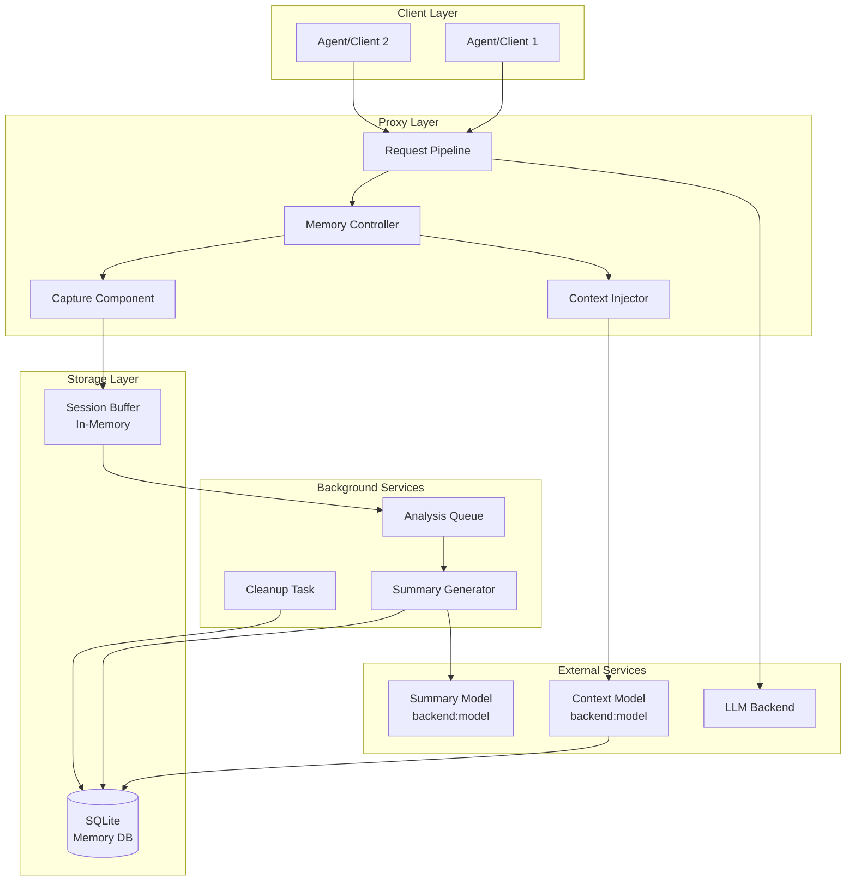

# ProxyMem Design Document

## Overview

ProxyMem is a proxy-based memory layer that provides cross-session context persistence for LLM agents. The system operates transparently at the proxy layer, capturing session data, generating structured summaries via LLM analysis, and enriching future requests with relevant historical context.

The architecture follows a pipeline pattern:
1. **Capture Pipeline**: Intercepts and buffers session interactions when memory is enabled
2. **Analysis Pipeline**: Processes completed sessions through an LLM to generate structured summaries
3. **Injection Pipeline**: Retrieves relevant context and injects it into new session requests

## Architecture



## Components and Interfaces

### 1. MemoryConfiguration

Manages all ProxyMem configuration with support for CLI, environment variables, and config file.

```python
class MemoryConfiguration(DomainModel):
    """Configuration for ProxyMem feature."""
    
    model_config = ConfigDict(frozen=True)
    
    # Global availability (gates all other settings)
    available: bool = False
    
    # Default state when available
    default_enabled: bool = False
    
    # Model configuration
    summary_model: str | None = None  # backend:model format
    context_model: str | None = None  # backend:model format
    
    # Prompt configuration
    summary_prompt: str | None = None  # Path to custom prompt file
    context_prompt: str | None = None  # Path to custom prompt file
    
    # Database configuration
    database_path: str = "./var/memory.sqlite3"
    
    # Behavior configuration
    session_timeout_minutes: int = 30
    max_sessions_to_consider: int = 10
    max_context_tokens: int = 2000
    max_summary_tokens: int = 800
    max_transcript_chars: int = 50_000
    summary_completion_tokens: int = 10_000
    context_relevance_threshold: float = 0.5
    retention_days: int = 90
    max_buffer_size_bytes: int = 10 * 1024 * 1024  # 10MB
    analysis_queue_maxsize: int = 100
    analysis_timeout_seconds: int = 30
    max_concurrent_analyses: int = 4
    
    # Context injection template
    context_template: str | None = None
    
    # Privacy and control
    redaction_patterns: list[str] = Field(default_factory=list)
    persist_transcript: bool = False  # defaults to discard after summary
    disabled_users: set[str] = Field(default_factory=set)
    disabled_clients: set[str] = Field(default_factory=set)
    single_user_mode: bool = False  # if true, use a fixed user_id for all sessions
    fixed_user_id: str | None = None  # used only in single_user_mode
    
    # Prompt/schema versioning
    summary_prompt_version: str = "v1"
    summary_schema_version: str = "v1"
    
    # Project scoping
    require_project_discovery: bool = True
    project_discovery_mode: Literal["deterministic", "nondeterministic", "any"] = "any"
```

### 2. IMemoryService Interface

Core interface for memory operations.

```python
class IMemoryService(Protocol):
    """Interface for ProxyMem operations."""
    
    def is_available(self) -> bool:
        """Check if memory feature is globally available."""
        ...
    
    def is_enabled_for_session(self, session_id: str) -> bool:
        """Check if memory is enabled for a specific session."""
        ...
    
    def enable_for_session(self, session_id: str, user_id: str | None, tenant_id: str | None = None) -> bool:
        """Enable memory for a session. Returns False if not available or user not authorized."""
        ...
    
    def disable_for_session(self, session_id: str) -> None:
        """Disable memory for a session."""
        ...
    
    def capture_interaction(
        self, 
        session_id: str, 
        role: str, 
        content: str,
        metadata: InteractionMetadata,
        user_id: str | None,
        tenant_id: str | None = None,
    ) -> None:
        """Capture an interaction if memory is enabled."""
        ...
    
    def record_tool_event(
        self,
        session_id: str,
        event: "ToolEvent",
        user_id: str | None,
        tenant_id: str | None = None,
    ) -> None:
        """Capture deterministic tool events (file edits, git commits) when memory is enabled."""
        ...
    
    async def get_context_for_session(
        self,
        user_id: str,
        current_prompt: str,
        tenant_id: str | None = None,
    ) -> str | None:
        """Retrieve relevant historical context for a new session."""
        ...
    
    def mark_session_complete(self, session_id: str, user_id: str | None, tenant_id: str | None = None) -> None:
        """Mark a session as complete and queue for analysis."""
        ...
```
Implementations must consult `disabled_users`, `disabled_clients`, identity presence, and tenant scoping before enabling or capturing, ensuring privacy and isolation per Requirements 14 and 17. `record_tool_event()` MUST deduplicate per session and drop events when memory is disabled.

### 3. MemoryRepository

Data access layer for SQLite operations.

```python
class IMemoryRepository(Protocol):
    """Interface for memory data persistence."""
    
    async def save_session_summary(self, summary: SessionSummary) -> None:
        """Persist a session summary to the database."""
        ...
    
    async def get_recent_sessions(
        self, 
        user_id: str, 
        limit: int,
        tenant_id: str | None = None,
        project_id: str | None = None,
        project_root: str | None = None
    ) -> list[SessionSummary]:
        """Retrieve recent session summaries for a user."""
        ...
    
    async def delete_old_sessions(self, before_date: datetime) -> int:
        """Delete sessions older than the specified date. Returns count deleted."""
        ...
    
    async def initialize_schema(self) -> None:
        """Create database schema if it doesn't exist."""
        ...
```

### 4. SessionCaptureBuffer

In-memory buffer for active session data.

```python
class SessionCaptureBuffer:
    """Thread-safe buffer for capturing session interactions."""
    
    def __init__(self, max_size_bytes: int):
        self._buffers: dict[str, SessionBuffer] = {}
        self._max_size_bytes = max_size_bytes
        self._lock = asyncio.Lock()
    
    async def append(
        self, 
        session_id: str, 
        interaction: CapturedInteraction
    ) -> bool:
        """Append interaction to buffer. Returns False if buffer full."""
        ...
    
    async def get_and_clear(self, session_id: str) -> list[CapturedInteraction]:
        """Get all interactions for a session and clear the buffer."""
        ...
    
    async def get_buffer_size(self, session_id: str) -> int:
        """Get current buffer size in bytes for a session."""
        ...
```

### 4a. DeterministicToolEventCollector

Collects deterministic tool events (file edits and git commits) emitted by the proxy's tool hooks.

```python
class DeterministicToolEventCollector:
    """Tracks deterministic file edits and git commits per session."""
    
    def __init__(self):
        self._file_edits: dict[str, dict[str, FileEditEvent]] = defaultdict(dict)  # session_id -> path -> last event
        self._git_commits: dict[str, list[GitCommitEvent]] = defaultdict(list)  # session_id -> commits
        self._lock = asyncio.Lock()
    
    async def record_file_edit(self, session_id: str, event: FileEditEvent, project_root: str | None) -> None:
        """Normalize path relative to project_root when provided; deduplicate by path keeping the most recent event."""
        ...
    
    async def record_git_commit(self, session_id: str, event: GitCommitEvent) -> None:
        """Append commit event when commit hash/message are available; ignore duplicates by hash for the session."""
        ...
    
    async def get_and_clear(self, session_id: str) -> tuple[list[FileEditEvent], list[GitCommitEvent]]:
        """Return deterministic file edits and git commits for a session and clear cached state."""
        ...
```

Rules:
- Normalize file paths relative to detected project_root when available; otherwise store absolute paths using forward slashes.
- Classify file edits as `created|modified|deleted|unknown` and keep the latest timestamp per path; preserve original tool name for auditability.
- Deduplicate git commits per session by commit hash; store message, branch (if provided), and timestamp.
- Drop tool events when memory is disabled to respect session opt-out.

### 5. SummaryGenerator

Background service for generating session summaries.

```python
class SummaryGenerator:
    """Generates structured summaries from session transcripts."""
    
    def __init__(
        self,
        backend_service: IBackendService,
        model_spec: str,
        prompt_loader: PromptLoader,
        repository: IMemoryRepository,
        validator: "ISummaryValidator",
        redactor: "IRedactor",
        config: MemoryConfiguration,
        metrics: "IMetricsSink",
        clock: "IClock",
    ):
        ...
    
    async def generate_summary(
        self, 
        session_data: SessionData
    ) -> SessionSummary:
        """Chunk transcripts if oversized, redact sensitive data, call the model with XML prompt (bounded by completion tokens), validate/parse output, and persist summary."""
        ...
    
    async def process_queue(self) -> None:
        """Process queued sessions for summary generation with timeouts, backpressure, and dedup safeguards."""
        ...
```

#### Chunked Analysis Flow
1. Estimate transcript size (chars/tokens); if above `max_transcript_chars` or `max_summary_tokens`, split into ordered chunks.
2. Summarize each chunk with a compact prompt that emits partial XML fragments.
3. Combine chunk summaries into a consolidated transcript and run a final pass using the main XML prompt.
4. Ensure chunk metadata (paths from deterministic file edits, git commit events, tasks, tests/errors/branch/head/open_questions) is merged without duplication and respects sentinel rules (`UNKNOWN` when absent).
5. Respect `summary_completion_tokens` when calling the model for both chunk and final passes; truncate/limit completions accordingly.
6. If completions exceed limits after retries, apply middle-out compression (retain head/tail, summarize the middle) to produce a final XML within budget.

#### Deterministic Evidence Handling
- `generate_summary()` MUST inject deterministic file edit and git commit lists from `SessionData` into the summary prompt via `{deterministic_file_edits}` and `{deterministic_git_commits}` placeholders.
- When deterministic lists are non-empty, instructions MUST direct the model to copy them verbatim into `<touched_files>` and `<git_operations>` (adding human-readable details when needed) and avoid omitting or altering provided paths/hashes.
- Lists should be serialized as machine-readable bullet rows (e.g., `action | path | tool | timestamp` for file edits, `hash | branch | message | timestamp` for commits) to minimize ambiguity.
- When lists are empty, populate placeholders with `NONE` or `UNKNOWN` markers to prevent hallucinated file paths or commits.
- Summary parsing/validation should deduplicate any overlap between deterministic lists and transcript-derived mentions, preferring deterministic evidence.

### 6. ContextInjector

Handles context retrieval and injection into requests.

```python
class ContextInjector:
    """Retrieves and injects historical context into requests."""
    
    def __init__(
        self,
        backend_service: IBackendService,
        model_spec: str,
        prompt_loader: PromptLoader,
        repository: IMemoryRepository,
        config: MemoryConfiguration
    ):
        ...
    
    async def get_relevant_context(
        self,
        user_id: str,
        current_prompt: str,
        session_summaries: list[SessionSummary]
    ) -> str | None:
        """Query context model for relevant historical context."""
        ...
    
    def inject_context(
        self,
        messages: list[dict],
        context: str
    ) -> list[dict]:
        """Inject context as virtual message between system and first user message."""
        ...
```
`inject_context()` should enforce the configured token cap and skip injection entirely if the templated context would exceed `max_context_tokens`, preserving the original request unchanged (Requirement 16.4).
If context is skipped (timeout/backpressure/token cap/no relevant sessions/low relevance), insert a minimal marker message indicating no historical context was provided so downstream agents can adjust expectations.
Marker format: `[NO_PRIOR_CONTEXT_PROVIDED]`.

Relevance & recency strategy:
- Score candidate summaries using explicit signals (file/feature overlap, recentness, goal/topic match) and configurable weights.
- Apply a configurable relevance threshold (`context_relevance_threshold`); inject only summaries above threshold.
- Prefer more recent summaries when relevance scores tie or are close.
- Filter candidate summaries to those matching the same user_id (and tenant_id) and matching project_id/project_root when project scoping is active; otherwise skip injection with marker.

### 7. Command Handlers

Interactive command handlers for memory control.

```python
@command("memory-on")
class MemoryOnCommandHandler(ICommandHandler):
    """Handler for !/memory-on command."""
    
    async def handle(self, command: Command, session: Session) -> CommandResult:
        """Enable memory gathering for the current session."""
        ...

@command("memory-off")
class MemoryOffCommandHandler(ICommandHandler):
    """Handler for !/memory-off command."""
    
    async def handle(self, command: Command, session: Session) -> CommandResult:
        """Disable memory gathering for the current session."""
        ...

@command("memory-status")
class MemoryStatusCommandHandler(ICommandHandler):
    """Handler for !/memory-status command."""
    
    async def handle(self, command: Command, session: Session) -> CommandResult:
        """Return current memory gathering state."""
        ...
```

### 8. SummaryValidator

Validates LLM responses against the XML schema and converts them into domain models.

```python
class ISummaryValidator(Protocol):
    """Validates and parses XML summaries."""
    
    def validate_and_parse(self, raw_xml: str) -> SessionSummary:
        """Validate against schema (versioned) and parse into SessionSummary; raises on failure."""
        ...
```

Key responsibilities:
- Enforce schema version, required elements, allowed enums, and XML escaping
- Detect and reject natural-language pre/postamble outside the root element
- Normalize sentinel values (`UNKNOWN`, `NONE`) for missing evidence

### 9. Redactor

Applies privacy rules before model calls or persistence.

```python
class IRedactor(Protocol):
    """Redacts sensitive data from transcripts and summaries."""
    
    def apply(self, text: str) -> str:
        """Return redacted text based on configured patterns."""
        ...
```

The redactor runs before summary generation, before logging payloads, and before storing summaries.

### 10. AnalysisQueue & Supervisors

Coordinates background work with backpressure, deduplication, and resumability.

- Uses `asyncio.Queue` (bounded by `analysis_queue_maxsize`) keyed by `session_id`
- Enforces per-job timeout (`analysis_timeout_seconds`)
- Deduplicates queued jobs per `session_id` to avoid duplicate summaries
- Persists lightweight queue metadata to allow requeue on restart
- Emits metrics for queue depth and latency; exposes health status to ops
- Uses a worker pool capped by `max_concurrent_analyses` to limit concurrent model calls
- Associates each job with `user_id` (and tenant_id) to ensure isolation in downstream processing

### 11. Metrics and Health Reporter

Collects operational signals for observability.

- Metrics sink for queue depth, capture buffer utilization, summary/context latency, retry counts
- Structured logging with `session_id` and `user_id` correlation identifiers
- Health probe returning availability of DB, workers, and model connectivity

## Data Models

### SessionSummary

```python
class SessionSummary(DomainModel):
    """Structured summary of a completed session."""
    
    model_config = ConfigDict(frozen=True)
    
    id: str  # UUID
    user_id: str
    tenant_id: str | None = None
    project_id: str | None = None
    project_root: str | None = None
    session_id: str
    session_start: datetime
    client_agent: str | None
    backend_model: str  # backend:model format
    title: str  # One-sentence summary
    scope: str  # What the session was about
    goals: list[str]  # Main objectives
    open_questions: list[str]
    remaining_tasks: list["TaskItem"]
    modified_files: list["FileChange"]  # Files that were modified
    git_operations: list["GitOperation"]
    completion_status: str  # "completed", "partial", "abandoned"
    key_decisions: list[str]  # Important decisions made
    operations_performed: list[str]  # notable commands or operations
    tests_run: list["TestRun"]
    errors: list[str]
    risks_or_warnings: list[str]
    evidence: list[str]
    full_analysis: str  # Complete LLM analysis (XML payload)
    branch: str | None = None
    head_sha: str | None = None
    summary_version: str
    created_at: datetime
```

### TaskItem

```python
class TaskItem(DomainModel):
    """Remaining or open tasks from the session."""
    
    model_config = ConfigDict(frozen=True)
    
    description: str
    status: Literal["open", "blocked"]
```

### FileChange

```python
class FileChange(DomainModel):
    """A single file touched during the session."""
    
    model_config = ConfigDict(frozen=True)
    
    path: str
    status: Literal["created", "modified", "deleted"]
```

### GitOperation

```python
class GitOperation(DomainModel):
    """Git actions observed during the session."""
    
    model_config = ConfigDict(frozen=True)
    
    type: Literal["commit", "branch", "merge", "rebase", "cherry-pick"]
    ref: str | None
    details: str

class FileEditEvent(DomainModel):
    """Deterministic record of a file edit captured from tool calls."""
    
    model_config = ConfigDict(frozen=True)
    
    path: str  # normalized relative to project_root when available
    action: Literal["created", "modified", "deleted", "unknown"]
    tool: str | None = None
    timestamp: datetime

class GitCommitEvent(DomainModel):
    """Deterministic record of a git commit event captured from tool calls."""
    
    model_config = ConfigDict(frozen=True)
    
    commit_hash: str
    message: str | None = None
    branch: str | None = None
    timestamp: datetime

ToolEvent = FileEditEvent | GitCommitEvent

class TestRun(DomainModel):
    """Test execution details."""
    
    model_config = ConfigDict(frozen=True)
    
    name: str
    status: Literal["passed", "failed", "timeout", "skipped"]
    command: str | None = None
```

### CapturedInteraction

```python
class InteractionMetadata(DomainModel):
    """Typed metadata attached to captured interactions.

    This model defines the cross-layer contract for observability metadata and
    avoids passing ad-hoc dictionaries between memory capture, persistence, and
    analysis layers.
    """

    model_config = ConfigDict(frozen=True, extra="forbid")

    backend_type: str | None = None
    model: str | None = None
    prompt_tokens: int | None = None
    completion_tokens: int | None = None
    total_tokens: int | None = None


class CapturedInteraction(DomainModel):
    """A single captured interaction in a session."""
    
    model_config = ConfigDict(frozen=True)
    
    timestamp: datetime
    role: str  # "user" or "assistant"
    content: str
    metadata: InteractionMetadata
```

### SessionData

```python
class SessionData(DomainModel):
    """Complete data for a session pending analysis."""
    
    model_config = ConfigDict(frozen=True)
    
    session_id: str
    user_id: str
    tenant_id: str | None = None
    project_id: str | None = None
    project_root: str | None = None
    client_agent: str | None
    backend_model: str
    branch: str | None = None
    head_sha: str | None = None
    started_at: datetime
    ended_at: datetime
    transcript_chars: int
    estimated_tokens: int | None = None
    redaction_applied: bool = False
    interactions: list[CapturedInteraction]
    deterministic_file_edits: list[FileEditEvent] = Field(default_factory=list)
    deterministic_git_commits: list[GitCommitEvent] = Field(default_factory=list)
```

### Database Schema

```sql
CREATE TABLE IF NOT EXISTS session_summaries (
    id TEXT PRIMARY KEY,
    user_id TEXT NOT NULL,
    tenant_id TEXT,
    project_id TEXT,
    project_root TEXT,
    session_id TEXT NOT NULL,
    session_start TIMESTAMP NOT NULL,
    client_agent TEXT,
    backend_model TEXT NOT NULL,
    title TEXT NOT NULL,
    scope TEXT,
    goals TEXT,  -- JSON array
    modified_files TEXT,  -- JSON array
    remaining_tasks TEXT, -- JSON array of TaskItem
    git_operations TEXT, -- JSON array of GitOperation
    operations_performed TEXT, -- JSON array
    open_questions TEXT, -- JSON array
    tests_run TEXT, -- JSON array of TestRun
    errors TEXT, -- JSON array
    branch TEXT,
    head_sha TEXT,
    completion_status TEXT,
    key_decisions TEXT,  -- JSON array
    risks_or_warnings TEXT, -- JSON array
    evidence TEXT, -- JSON array
    full_analysis TEXT,
    summary_version TEXT NOT NULL,
    created_at TIMESTAMP NOT NULL DEFAULT CURRENT_TIMESTAMP
);

CREATE INDEX IF NOT EXISTS idx_session_summaries_user_id 
    ON session_summaries(user_id);
CREATE INDEX IF NOT EXISTS idx_session_summaries_session_start 
    ON session_summaries(session_start DESC);
CREATE INDEX IF NOT EXISTS idx_session_summaries_user_session_start 
    ON session_summaries(user_id, session_start DESC);
CREATE INDEX IF NOT EXISTS idx_session_summaries_user_tenant 
    ON session_summaries(user_id, tenant_id, session_start DESC);
CREATE INDEX IF NOT EXISTS idx_session_summaries_user_project 
    ON session_summaries(user_id, project_id, session_start DESC);

CREATE TABLE IF NOT EXISTS user_project_dirs (
    id INTEGER PRIMARY KEY AUTOINCREMENT,
    user_id TEXT NOT NULL,
    project_root TEXT NOT NULL,
    UNIQUE(user_id, project_root)
);

-- Optionally, maintain a lookup view or helper for mapping project_root to project_id per user
```

## Correctness Properties

*A property is a characteristic or behavior that should hold true across all valid executions of a system-essentially, a formal statement about what the system should do. Properties serve as the bridge between human-readable specifications and machine-verifiable correctness guarantees.*

### Property 1: Memory availability gates all activation
*For any* configuration where `memory_available` is `false`, all attempts to enable memory (via command or default) should fail and no session data should be captured.
**Validates: Requirements 1.2, 2.4**

### Property 2: Configuration precedence
*For any* combination of CLI, environment variable, and config file values for a memory setting, the effective value should follow precedence: CLI > env > config file.
**Validates: Requirements 1.5**

### Property 3: Session state isolation
*For any* two sessions, enabling or disabling memory in one session should not affect the memory state of the other session.
**Validates: Requirements 3.5**

### Property 4: Capture completeness
*For any* session with memory enabled, all user prompts and assistant responses passing through the proxy should be captured with complete metadata.
**Validates: Requirements 4.1, 4.2**

### Property 5: Buffer size enforcement
*For any* session, the in-memory capture buffer should never exceed the configured maximum size.
**Validates: Requirements 4.4**

### Property 6: Session completion triggers analysis
*For any* session that completes (via timeout or explicit close) with memory enabled, the session should be queued for background analysis.
**Validates: Requirements 5.3**

### Property 7: Summary storage completeness
*For any* successfully generated summary, all required fields (user_id, session_id, session_start, backend_model, title, scope, completion_status, goals, remaining_tasks, open_questions, modified_files, git_operations, operations_performed, tests_run, errors, risks_or_warnings, evidence, branch, head_sha, full_analysis, summary_version) should be present in the database record.
**Validates: Requirements 7.2, 12.2**

### Property 8: Context injection position
*For any* request where context is injected, the injected message should appear after any system message and before the first user message.
**Validates: Requirements 8.3**

### Property 9: Context token limiting
*For any* injected context, the token count should not exceed the configured maximum.
**Validates: Requirements 8.4**

### Property 10: Graceful degradation on context failure
*For any* context retrieval that fails or times out, the original request should proceed without modification.
**Validates: Requirements 8.5**

### Property 11: Prompt template substitution
*For any* prompt file with template variables, all supported variables should be correctly substituted with actual values.
**Validates: Requirements 11.5**

### Property 12: Retention enforcement
*For any* session record older than the configured retention period, the cleanup task should delete it.
**Validates: Requirements 10.1, 10.2**

### Property 13: Summary XML validity
*For any* generated summary, the stored XML payload should be well-formed and conform to the active schema version.
**Validates: Requirements 6.10, 12.1, 12.6, 12.7**

### Property 14: Transcript disposal
*For any* session after summary persistence, no raw transcript content should remain in memory or be written to disk.
**Validates: Requirements 6.13, 14.2**

### Property 15: Analysis deduplication and resumption
*For any* session, at most one summary record should be persisted per session_id unless explicitly re-queued, and queued analyses should resume safely after restarts.
**Validates: Requirements 13.2, 13.4**

### Property 16: Backpressure isolation
*For any* capture buffer or analysis queue overflow, proxy request handling should continue unaffected while memory features degrade gracefully.
**Validates: Requirements 13.3, 16.1, 16.3**

### Property 17: User isolation
*For any* operations (capture, retrieval, storage, injection), data associated with one `user_id` (and tenant_id) must never be readable or used for another `user_id` (or different tenant_id).
**Validates: Requirements 17.1, 17.2, 17.3**

### Property 18: Summary field completeness
*For any* generated summary, optional fields (tests_run, errors, branch, head_sha, open_questions) should be present with values or `UNKNOWN` as appropriate, and stored alongside required fields.
**Validates: Requirements 7.2, 12.2**

### Property 19: Context relevance thresholding
*For any* set of candidate summaries, only those meeting or exceeding the relevance threshold should be injected, preferring more recent summaries when scores tie.
**Validates: Requirements 8.10, 9.1**

### Property 20: Project scoping
*For any* session without a detected project root (when required), context injection should be skipped; for sessions with a project_root/project_id, only summaries from the same user/tenant and project should be injected.
**Validates: Requirements 18.1, 18.2, 18.4**

### Property 21: Summary completion cap
*For any* summary generation call, the model completion should not exceed the configured `summary_completion_tokens` budget.
**Validates: Requirements 6.14**

### Property 22: Deterministic tool events reflected in summaries
*For any* session with captured deterministic file edits or git commits, the summary prompt should include those lists and the resulting XML should surface them in `<touched_files>` and `<git_operations>`, using `UNKNOWN` only when lists are empty.
**Validates: Requirements 19.4, 19.5, 19.6**

## Error Handling

### Configuration Errors
- Invalid model specification format: Log error at startup, disable feature
- Missing required model when feature enabled: Log error at startup, disable feature
- Invalid prompt file path: Log error at startup, fall back to default prompt
- Database path not writable: Log error at startup, disable feature

### Runtime Errors
- Summary generation failure: Retry up to 3 times with exponential backoff (1s, 2s, 4s), then log and discard
- Summary validation failure (malformed XML): Log hashed/truncated payload without raw content, issue corrective prompt, retry within retry budget
- Context retrieval timeout: Log warning, proceed without context injection
- Database write failure: Log error, retry once, then discard (data loss acceptable for non-critical feature)
- Buffer overflow: Log warning, stop capturing for session, mark session as partial
- Analysis queue overflow: Apply backpressure policy (drop or delay) and emit metric without blocking request path
- Redaction failure: Fallback to passthrough with redaction disabled for that payload, log securely without content

### Graceful Degradation
The system should never block or fail proxy operations due to memory feature issues. All memory operations should be:
- Asynchronous where possible
- Time-bounded with reasonable timeouts
- Fail-safe (errors result in feature bypass, not proxy failure)

## Testing Strategy

- TDD: Write or update failing tests before implementing each functional slice (config, repository, service, commands, prompts, generators, injectors, queues). Treat green tests as the definition of done for that slice.
- Coding standards:
  - Layered, modular architecture with clear boundaries (config -> service -> adapters/repository -> interfaces)
  - SOLID principles and DRY; prefer small, composable components
  - Dependency injection via existing DI container; no global singletons
  - PEP 8 and modern Python best practices
  - QA pipeline: `ruff` (with `--fix`), `black`, `mypy` on touched files; enforce async correctness and non-blocking I/O

### Unit Testing
- Configuration loading and precedence
- Command handler behavior
- Buffer management
- Message injection logic
- Template variable substitution
- Summary validator XML parsing and schema enforcement
- Redaction pattern application on transcripts and logs
- Isolation enforcement for repository queries and context retrieval (user_id/tenant_id scoping)

### Property-Based Testing
Using `hypothesis` library for Python:

- **Property 1**: Generate random configurations with `memory_available=False`, verify no data capture occurs
- **Property 2**: Generate random CLI/env/config combinations, verify correct precedence
- **Property 3**: Generate random session pairs with different memory states, verify isolation
- **Property 4**: Generate random message sequences, verify all are captured when enabled
- **Property 5**: Generate large payloads, verify buffer limits enforced
- **Property 8**: Generate random message lists, verify injection position
- **Property 9**: Generate large context strings, verify truncation
- **Property 11**: Generate random template variables, verify substitution
- **Property 13**: Generate valid/invalid XML payloads, verify validator accepts only well-formed schema-compliant output
- **Property 14**: Generate sessions with summaries and verify raw transcripts are cleared post-persistence
- **Property 15**: Generate duplicate completion events and simulated restarts, verify single summary persisted and jobs resume safely
- **Property 16**: Generate overload scenarios for buffers and queues, verify proxy path remains non-blocking and degradation rules applied
- **Property 17**: Generate multi-user/tenant datasets and verify no cross-user retrieval or injection occurs
- **Property 18**: Generate transcripts with/without tests/errors/branch/head/open_questions and verify XML contains fields with evidence or `UNKNOWN` when absent
- **Property 19**: Generate mixed relevance scores and verify context injector selects only items above threshold and prefers recent items when relevance ties
- **Property 20**: Generate sessions with/without detected project roots; verify no-context marker is used when missing and only same-project summaries are injected when present
- **Property 21**: Generate long transcripts and ensure summary generator enforces `summary_completion_tokens` cap on model responses
- **Property 22**: Generate deterministic file edits and git commits; ensure summary prompt includes the lists and parsed XML echoes them in `<touched_files>` and `<git_operations>`

Property validation mapping:
- Property 18 validates Requirements 7.2 and 12.2.
- Property 19 validates Requirements 8.10 and 9.1.
- Property 20 validates Requirements 18.1, 18.2, and 18.4.
- Property 21 validates Requirements 6.14.
- Property 22 validates Requirements 19.4, 19.5, and 19.6.

### Integration Testing
- End-to-end flow: capture -> analysis -> storage -> retrieval -> injection
- Database schema creation and migration
- Background task scheduling and execution
- Multi-session concurrent access
- Chunked analysis for oversized transcripts
- Backpressure behavior under high load with context and summary generation timeouts
- Validate XML content includes tests/errors/branch/head/open_questions and that evidence items map to transcript content
- Validate context injection "no-context provided" marker appears when context is skipped due to timeout/backpressure/token cap
- Validate context relevance filtering honors threshold and ranks recent/high-relevance sessions above others; ensure low-relevance items are omitted
- Validate project scoping: with project detection enabled, context and summaries are restricted to same user/tenant/project; when detection fails, context injection is skipped with a warning/marker
- Validate deterministic file edit and git commit lists are passed to the summary prompt and appear in `<touched_files>` and `<git_operations>` without being dropped or altered

## Default Prompts

### Session Summary Prompt (config/prompts/memory_summary.md)

```markdown
You are analyzing a completed coding session to create a structured summary for future reference.

Respond with ONLY well-formed XML (no prose, no markdown, no code fences) following this template. Escape special characters. Use `UNKNOWN` when evidence is missing. Do not invent files, commits, or tasks that were not mentioned.

<session_summary version="{summary_schema_version}">
  <metadata>
    <session_id>{session_id}</session_id>
    <user_id>{user_id}</user_id>
    <tenant_id>{tenant_id}</tenant_id>
    <project_id>{project_id}</project_id>
    <project_root>{project_root}</project_root>
    <analysis_timestamp>{analysis_timestamp}</analysis_timestamp>
    <model>{model}</model>
    <prompt_version>{summary_prompt_version}</prompt_version>
    <summary_version>{summary_schema_version}</summary_version>
    <branch>{branch}</branch>
    <head_sha>{head_sha}</head_sha>
  </metadata>
  <title>One-sentence description of the session</title>
  <scope>Brief description of the area/component/feature</scope>
  <main_goals>
    <goal>Goal text</goal>
  </main_goals>
  <completion_status>completed|partial|abandoned</completion_status>
  <remaining_tasks>
    <task status="open|blocked">Task description</task>
  </remaining_tasks>
  <touched_files>
    <file status="created|modified|deleted">relative/path</file>
  </touched_files>
  <git_operations>
    <operation type="commit|branch|merge|rebase|cherry-pick" ref="hash-or-name">Details (or UNKNOWN)</operation>
  </git_operations>
  <operations_performed>
    <operation>Notable commands, migrations, or scripts run</operation>
  </operations_performed>
  <tests_run>
    <test status="passed|failed|timeout|skipped">Test name or command</test>
  </tests_run>
  <errors>
    <error>Key exceptions or error messages observed</error>
  </errors>
  <open_questions>
    <item>Assumptions, uncertainties, or clarifications needed</item>
  </open_questions>
  <key_decisions>
    <decision>Important technical/design decision with rationale</decision>
  </key_decisions>
  <risks_or_warnings>
    <item>Risks, blockers, or caveats</item>
  </risks_or_warnings>
  <evidence>
    <item>Specific evidence from the transcript (file paths, errors, outputs)</item>
  </evidence>
</session_summary>

## Session Transcript
{session_transcript}

## Deterministic File Edits (from proxy tool calls)
{deterministic_file_edits}

## Deterministic Git Commits (from proxy tool calls)
{deterministic_git_commits}

Guidelines:
- Use only information explicitly present in the transcript and deterministic lists; if unsure, use UNKNOWN.
- The deterministic lists above are authoritative: copy their entries into `<touched_files>` and `<git_operations>` (augment with brief details if helpful) and do not omit or alter provided paths/hashes.
- Keep the title to one sentence.
- Prefer relative paths for files; include commit hashes when mentioned.
- Do not include markdown, JSON, or commentary; return only XML matching the template.
```

### Context Retrieval Prompt (config/prompts/memory_context.md)

```markdown
You are helping provide relevant historical context for a new coding session.

## Current User Prompt
{user_prompt}

## Recent Session Summaries
{session_summaries}

## Instructions
Analyze the current user prompt and the recent session summaries. Identify any sessions that are directly relevant to what the user is about to work on.

Provide a concise context summary (maximum {max_tokens} tokens) that includes:
1. Relevant prior work on the same files, features, or components
2. Important decisions or approaches that were established
3. Unfinished tasks or known issues that relate to the current work
4. Warnings about approaches that didn't work well

## Output Format
If relevant context exists, provide it in this format:

**Prior Session Context:**
[Your synthesized context here]

If no relevant prior sessions exist, respond with exactly: NO_RELEVANT_CONTEXT

## Guidelines
- Only include information directly relevant to the current prompt
- Prioritize recent sessions over older ones
- Be concise - this context will be injected into the conversation
- Focus on actionable information, not general summaries
- If the user is starting something completely new, respond with NO_RELEVANT_CONTEXT
```

