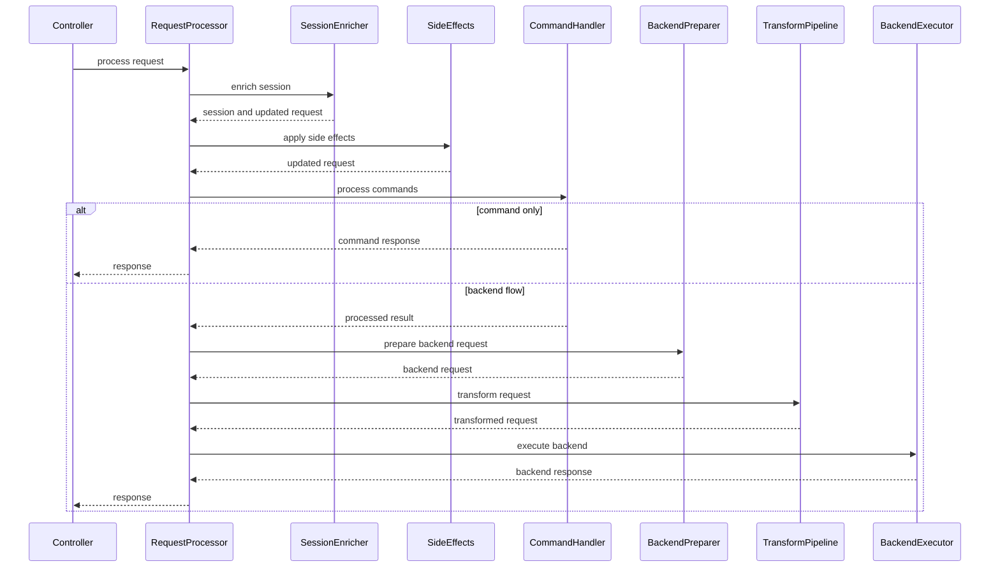

# Design Document: Request Processor Refactoring

---
**Purpose**: Provide an implementation-ready technical design to refactor the existing `RequestProcessor` God Object into focused components while preserving current behavior and existing DI wiring.

**Project Context**: Universal LLM Proxy - FastAPI async service with staged initialization, DI containers, adapter pattern for LLM backends.
---

## Overview

This refactoring decomposes the current `RequestProcessor` implementation (`src/core/services/request_processor_service.py`) into cohesive request-pipeline phases. The goal is to reduce complexity and improve separation of concerns while preserving externally observable behavior: the `IRequestProcessor` contract, response envelope shapes, side effects, and all existing tests.

### Goals
- Preserve current behavior and public contracts (`IRequestProcessor`, response envelopes, side effects).
- Reduce complexity by extracting pipeline phases into focused components.
- Improve testability through component-level unit tests and clearer DI boundaries.
- Keep DI wiring compatible with both staged initialization (`ProcessorStage`) and legacy container usage.

### Non-Goals
- Adding new user-visible features.
- Changing ordering or semantics of transformations.
- Changing request/response domain models or envelope types.
- Refactoring unrelated services outside request processing.

## Architecture

### Existing Architecture Analysis

The `RequestProcessor` currently performs multiple responsibilities in a single orchestration method, including:
- Session resolution and enrichment (agent normalization, OS detection, VTC detection, project directory auto-resolution).
- Best-effort side effects (streaming tool registry updates, memory context injection, memory capture).
- Command processing and command-only early returns (including special handling for certain agents).
- Tool artifact preview expansion and compression.
- Backend request preparation and token-limit validation (fail-fast on structured validation, fail-open on unexpected enforcement errors).
- Outbound request transformations (redaction, edit precision tuning, tool filtering) with fixed ordering and fail-open error handling.
- Backend invocation and persistence side effects (session history update, best-effort fingerprint update, turn completion when replacement state exists).

Key integration surfaces that must remain compatible:
- Staged initialization wiring: `src/core/app/stages/processor.py` binds `IRequestProcessor` to `RequestProcessor` via a factory.
- Legacy DI wiring: `src/core/di/container.py` registers `IRequestProcessor` in some flows.

### Architecture Pattern and Boundary Map

**Selected pattern**: Orchestrator plus phase handlers.

**Rationale**:
- `RequestProcessor` remains the orchestrator to preserve DI bindings and compatibility.
- Each pipeline phase becomes a dedicated component with explicit responsibilities and a clear error-handling policy.
- Cross-cutting request transformations are grouped into a transformation pipeline that preserves ordering and fail-open semantics.

```mermaid
graph TB
    Controller[Http Controller] --> RequestProcessor[Request Processor]

    RequestProcessor --> SessionEnricher[Session Enricher]
    RequestProcessor --> SideEffects[Side Effects]
    RequestProcessor --> CommandHandler[Command Handler]
    RequestProcessor --> BackendPreparer[Backend Preparer]
    RequestProcessor --> TransformPipeline[Transform Pipeline]
    RequestProcessor --> BackendExecutor[Backend Executor]

    SessionEnricher --> SessionManager[Session Manager]
    SessionEnricher --> AppState[Application State]

    SideEffects --> StreamingRegistry[Streaming Registry]
    SideEffects --> MemoryInjector[Context Injector]
    SideEffects --> MemoryCapture[Memory Capture]

    CommandHandler --> CommandProcessor[Command Processor]
    CommandHandler --> ResponseManager[Response Manager]
    CommandHandler --> ArtifactService[Artifact Service]

    BackendPreparer --> BackendRequestManager[Backend Request Manager]
    BackendPreparer --> TokenUtilities[Token Utilities]

    TransformPipeline --> Redaction[Redaction]
    TransformPipeline --> EditPrecision[Edit Precision]
    TransformPipeline --> ToolFiltering[Tool Filtering]

    BackendExecutor --> BackendRequestManager
    BackendExecutor --> SessionManager
```



Boundary decisions:
- `SessionEnricher` owns only session and request-context enrichment.
- `SideEffects` owns best-effort side effects and their ordering.
- `CommandHandler` owns command processing, command-only flow decisions, and artifact normalization.
- `BackendPreparer` owns request preparation and validation (including fail-fast vs fail-open boundaries).
- `TransformPipeline` owns outbound request transformations and preserves their fixed ordering.
- `BackendExecutor` owns backend invocation and persistence side effects, including `finally`-based turn completion.

### Technology Stack

| Layer | Choice / Version | Role in Feature | Notes |
|-------|------------------|-----------------|-------|
| Runtime | Python 3.10+ / FastAPI async | Request pipeline | Keep I/O async |
| DI | `ServiceCollection` + factories | Wiring | Preserve staged init |
| Legacy DI | `src/core/di/container.py` | Compatibility | Must remain compatible |
| Domain | Pydantic v2 models | Requests and envelopes | Preserve shapes |
| Errors | `LLMProxyError` hierarchy | Propagation | Preserve behavior |

## System Flows



Flow-level decisions:
- Session enrichment runs before side effects.
- Project directory resolution precedes context injection.
- Artifact normalization runs after command processing and before command-only decisions.
- Transformations run in fixed order: redaction, then edit precision, then tool filtering.
- Backend execution is the only phase that updates session history and ensures turn completion semantics.

## Requirements Traceability

| Requirement | Summary | Components | Interfaces | Flows |
|-------------|---------|------------|------------|-------|
| 1.1 | Type checking behavior | RequestProcessor | IRequestProcessor | Main |
| 1.3 | Command-only compatibility | CommandHandler | IResponseManager | Command only |
| 1.7 | Turn completion in finally | BackendExecutor | IModelReplacementService | Backend |
| 2.1 | Composition into components | All phases | Internal contracts | Main |
| 3.1 | Orchestrator delegates | RequestProcessor | IRequestProcessor | Main |
| 4.1 | Session id resolution | SessionEnricher | ISessionManager | Main |
| 5.1 | Allowed tools registry update | SideEffects | Streaming registry | Main |
| 6.1 | Disable commands behavior | CommandHandler | ICommandProcessor | Main |
| 7.1 | Artifact preview expansion | ArtifactService | Internal contract | Main |
| 8.3 | Fail-fast structured validation | BackendPreparer | Token utilities | Backend |
| 9.8 | Transformation ordering preserved | TransformPipeline | Existing middleware and services | Backend |
| 10.2 | Backend invocation | BackendExecutor | IBackendRequestManager | Backend |
| 11.1 | DI binding preserved | ProcessorStage | ServiceCollection | All |
| 12.1 | Existing tests remain green | All | pytest | All |

## Components and Interfaces

### Component Summary

| Component | Domain | Intent | Requirements | DI Lifetime |
|-----------|--------|--------|--------------|------------|
| RequestProcessor | Orchestration | Coordinates phases and preserves `IRequestProcessor` | 1.1, 1.2, 2.1, 3.1, 11.1 | Singleton |
| SessionEnricher | Session | Session resolution and client context enrichment | 4.1, 4.2, 4.3, 4.6, 4.8 | Singleton |
| SideEffects | Side effects | Streaming registry and memory integrations | 5.1, 5.2, 5.3, 5.4, 5.5, 5.6 | Singleton |
| CommandHandler | Commands | Command processing and command-only flows | 6.1, 6.2, 6.3, 6.4, 6.5 | Singleton |
| ArtifactService | Artifacts | Artifact preview expansion and compression | 7.1, 7.2, 7.3, 7.4 | Singleton |
| BackendPreparer | Backend prep | Backend request creation and validation | 8.1, 8.2, 8.3, 8.4, 8.5 | Singleton |
| TransformPipeline | Transform | Redaction, precision, tool filtering pipeline | 9.1, 9.2, 9.3, 9.4, 9.5, 9.6, 9.7, 9.8 | Singleton |
| BackendExecutor | Backend exec | Backend call and persistence side effects | 10.1, 10.2, 10.3, 10.4 | Singleton |

### Interface Contracts

These contracts are internal and exist to support testability and DI wiring. They are not user-facing APIs.

#### ISessionEnricher

```python
from abc import ABC, abstractmethod
from src.core.domain.chat import ChatRequest
from src.core.domain.request_context import RequestContext

class ISessionEnricher(ABC):
    @abstractmethod
    async def enrich(self, context: RequestContext, request: ChatRequest) -> tuple[object, ChatRequest]:
        """Return (session, possibly updated request)."""
        ...
```

#### IRequestSideEffects

```python
from abc import ABC, abstractmethod
from src.core.domain.chat import ChatRequest
from src.core.domain.request_context import RequestContext

class IRequestSideEffects(ABC):
    @abstractmethod
    async def apply(self, context: RequestContext, session_id: str, request: ChatRequest) -> ChatRequest:
        """Apply best-effort side effects and return updated request."""
        ...
```

#### ICommandHandler

```python
from abc import ABC, abstractmethod
from src.core.domain.chat import ChatRequest
from src.core.domain.processed_result import ProcessedResult
from src.core.domain.request_context import RequestContext
from src.core.domain.responses import ResponseEnvelope, StreamingResponseEnvelope

class ICommandHandler(ABC):
    @abstractmethod
    async def handle(self, context: RequestContext, session: object, session_id: str, request: ChatRequest) -> ProcessedResult | ResponseEnvelope | StreamingResponseEnvelope:
        """Return a processed result for backend flow, or an early response for command-only flow."""
        ...
```

#### IBackendPreparer

```python
from abc import ABC, abstractmethod
from src.core.domain.chat import ChatRequest
from src.core.domain.processed_result import ProcessedResult
from src.core.domain.request_context import RequestContext

class IBackendPreparer(ABC):
    @abstractmethod
    async def prepare(self, context: RequestContext, session_id: str, request: ChatRequest, processed: ProcessedResult) -> ChatRequest | None:
        """Return prepared backend request or None when backend should be skipped."""
        ...
```

#### IRequestTransformPipeline

```python
from abc import ABC, abstractmethod
from src.core.domain.chat import ChatRequest
from src.core.domain.request_context import RequestContext

class IRequestTransformPipeline(ABC):
    @abstractmethod
    async def transform(self, context: RequestContext, session: object, session_id: str, request: ChatRequest) -> ChatRequest:
        """Apply request transformations; must be fail-open on unexpected errors."""
        ...
```

#### IBackendExecutor

```python
from abc import ABC, abstractmethod
from src.core.domain.chat import ChatRequest
from src.core.domain.request_context import RequestContext
from src.core.domain.responses import ResponseEnvelope, StreamingResponseEnvelope

class IBackendExecutor(ABC):
    @abstractmethod
    async def execute(self, context: RequestContext, session: object, session_id: str, request: ChatRequest, original_request: ChatRequest) -> ResponseEnvelope | StreamingResponseEnvelope:
        """Execute the backend call and perform required side effects."""
        ...
```

## Error Handling

The refactoring preserves the existing error philosophy:
- Fail-fast: structured validation errors (`InvalidRequestError`) propagate.
- Fail-open: enrichments, side effects, and transformations log and continue.
- Propagate: backend failures propagate unchanged; ensure turn completion occurs in `finally`.

## Testing Strategy

- Preserve existing unit tests for request processing and related focused areas.
- Add component-level unit tests for extracted components, focusing on:
  - fail-open vs fail-fast behavior
  - ordering guarantees (especially transformations)
  - side effect isolation (streaming registry, memory middleware)
- Maintain integration/property coverage that exercises end-to-end processor wiring.

## Migration Strategy

- Extract phases incrementally behind the existing request processor API.
- After each extraction, run the existing test suite to validate behavior preservation.
- Keep constructor compatibility by adding optional dependencies (or a single optional “components bundle”) rather than breaking direct instantiation patterns.

## Complexity Measurement Notes

The implementation should select a complexity measurement approach that runs successfully in this repository. Current `radon`/`xenon` tooling may fail when parsing `pyproject.toml` in this repo; if those tools are used, they should be pinned/configured to avoid parsing unrelated tool configuration.

