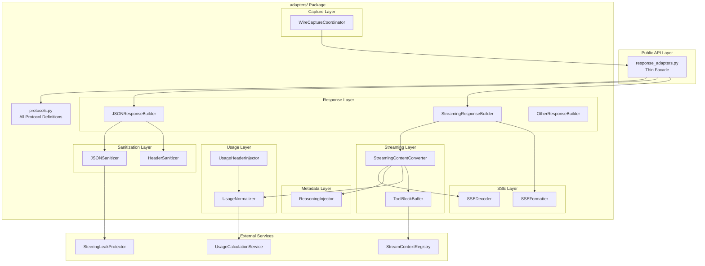
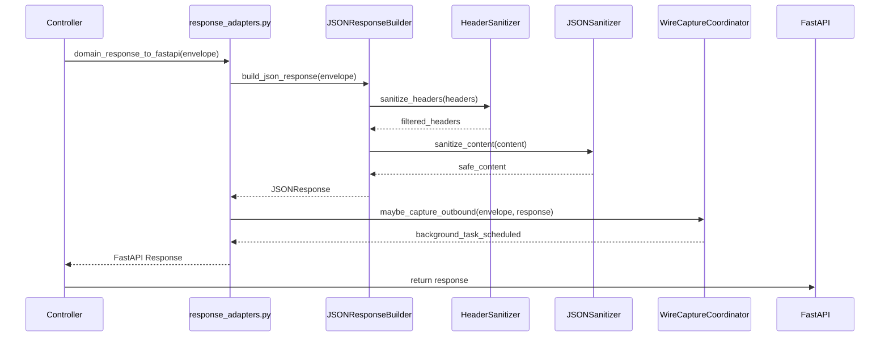
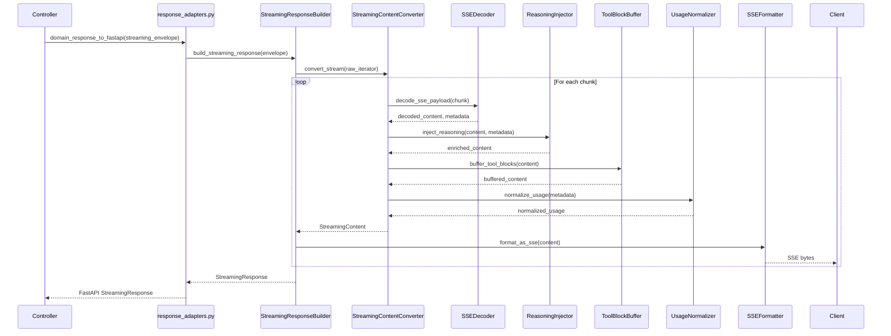

# Design Document: Response Adapters God Object Refactoring

---
**Purpose**: Decompose the 1851-line `response_adapters.py` into a modular, layered architecture with clear protocol boundaries, dependency injection, and independent testability.

**Approach**:

- Extract logic into 7 focused layer modules
- Define protocols for all layer contracts
- Maintain thin facade for public API backward compatibility
- Enable phased implementation with test gates

**Project Context**: Universal LLM Proxy - FastAPI async service with staged initialization, DI containers, adapter pattern for LLM backends
---

## Overview

**Purpose**: This refactoring delivers improved maintainability, testability, and extensibility to developers working with response transformation logic. The current 1851-line monolithic file violates SOLID principles and contains 670+ lines in a single closure.

**Users**: Internal development team maintaining the response adapter layer, operators debugging response transformation issues, and test authors requiring isolated unit testing.

**Impact**: Transforms `src/core/transport/fastapi/response_adapters.py` from a "God Object" into a thin facade that delegates to 7 focused layer modules under `src/core/transport/fastapi/adapters/`.

### Goals

- Decompose into single-responsibility layer modules (max 300 lines each)
- Define clear protocol boundaries with Python `Protocol` classes
- Enable independent unit testing of each layer
- Preserve 100% backward compatibility with existing public API
- Maintain all existing test coverage (zero regressions)
- Introduce dependency injection with global accessor fallback

### Non-Goals

- Changing the behavior of any response transformation logic
- Modifying the unrelated legacy file at `src/core/adapters/response_adapters.py`
- Changing the public API signatures
- Modifying external callers (controllers)
- Performance optimization (beyond avoiding regression)

## Architecture

### Existing Architecture Analysis

**Current state constraints**:

- `response_adapters.py` (1851 lines) is the monolithic target
- Only `domain_response_to_fastapi` is imported by external controllers
- Global service accessors used: `get_steering_leak_protector()`, `get_usage_calculation_service()`, `get_global_streaming_context_registry()`
- Duplicate `_decode_sse_payload` at lines 354 and 1242
- 670+ line closure in `_streaming_adapter` with 15+ nested helper functions

**Existing patterns to preserve**:

- Ports/adapters pattern (`src/core/ports/`)
- Facade pattern for re-exports (`streaming_contracts.py`)
- DI via `ServiceCollection` with global accessor fallback
- `StreamingContent` as unified streaming chunk representation

### Architecture Pattern & Boundary Map

**Selected Pattern**: Layered Adapter Architecture with Protocol Contracts



**Architecture Decisions**:

1. **Thin Facade**: `response_adapters.py` becomes re-export facade (< 100 lines)
2. **Protocol-first**: All layer contracts defined in single `protocols.py`
3. **DI with Fallback**: Constructor injection when DI available, global accessors otherwise
4. **No Closures**: Nested closures refactored to class methods
5. **Phased Extraction**: Incremental migration with test gates

**Existing Patterns Preserved**:

- Ports/adapters boundary respected
- `StreamingContent` remains the unified streaming model
- DI registration follows staged init pattern
- Error handling via `LLMProxyError` hierarchy

### Technology Stack

| Layer | Choice / Version | Role in Feature | Notes |
|-------|------------------|-----------------|-------|
| Runtime | Python 3.10+ / FastAPI (async) | Core framework | Use `async/await` for all I/O |
| Protocols | `typing.Protocol` | Structural subtyping | Duck typing without ABC overhead |
| DI Container | `src/core/di/container.py` | Service registration | Singleton lifetime for all layers |
| Streaming | `StreamingContent` | Unified chunk model | From `src/core/domain/streaming/` |
| SSE | `SentinelManager` | SSE framing | From `src/core/domain/streaming/sentinels.py` |

## System Flows

### Non-Streaming Response Flow



### Streaming Response Flow



**Key Flow Decisions**:

- Wire capture is async (background task) to avoid blocking response
- Usage normalization merges highest values across chunks
- Tool block buffering holds fragments until closing tag detected
- SSE decoder consolidates duplicate implementations

## Requirements Traceability

| Requirement | Summary | Components | Interfaces | Flows |
|-------------|---------|------------|------------|-------|
| 1.1-1.6 | Public API Preservation | Facade | `domain_response_to_fastapi`, `to_fastapi_response`, `to_fastapi_streaming_response` | Both |
| 2.1-2.6 | Layer Architecture | All adapters/ modules | protocols.py | Both |
| 3.1-3.8 | SSE Pipeline | SSEFormatter, SSEDecoder | ISSEFormatter, ISSEDecoder | Streaming |
| 4.1-4.6 | Metadata Injection | ReasoningInjector | IReasoningInjector | Streaming |
| 5.1-5.7 | Usage Calculation | UsageNormalizer, UsageHeaderInjector | IUsageNormalizer, IUsageHeaderInjector | Both |
| 6.1-6.7 | Sanitization | JSONSanitizer, HeaderSanitizer | IJSONSanitizer, IHeaderSanitizer | Non-streaming |
| 7.1-7.6 | Wire Capture | WireCaptureCoordinator | IWireCaptureCoordinator | Both |
| 8.1-8.8 | Streaming Content | StreamingContentConverter | IStreamingContentConverter | Streaming |
| 9.1-9.7 | Tool Block Buffer | ToolBlockBuffer | IToolBlockBuffer | Streaming |
| 10.1-10.7 | Response Builder | All ResponseBuilder classes | IJSONResponseBuilder, IStreamingResponseBuilder | Both |
| 11.1-11.6 | DI Integration | All layers | All protocols | Both |
| 12.1-12.7 | Test Preservation | N/A (validation) | N/A | N/A |
| 13.1-13.7 | Phased Implementation | N/A (process) | N/A | N/A |

## Components and Interfaces

### Component Summary

| Component | Layer | Intent | Req Coverage | DI Lifetime | Contracts |
|-----------|-------|--------|--------------|-------------|-----------|
| `SSEFormatter` | `adapters/sse/` | Format content as SSE bytes | 3.1-3.3 | Singleton | ISSEFormatter |
| `SSEDecoder` | `adapters/sse/` | Decode SSE payloads | 3.4-3.8 | Singleton | ISSEDecoder |
| `ReasoningInjector` | `adapters/metadata/` | Inject reasoning metadata | 4.1-4.6 | Singleton | IReasoningInjector |
| `UsageNormalizer` | `adapters/usage/` | Normalize usage dicts | 5.1-5.2, 5.6-5.7 | Singleton | IUsageNormalizer |
| `UsageHeaderInjector` | `adapters/usage/` | Apply usage headers | 5.3-5.5 | Singleton | IUsageHeaderInjector |
| `JSONSanitizer` | `adapters/sanitization/` | Ensure JSON-safe content | 6.1-6.2, 6.6-6.7 | Singleton | IJSONSanitizer |
| `HeaderSanitizer` | `adapters/sanitization/` | Filter HTTP headers | 6.3-6.5 | Singleton | IHeaderSanitizer |
| `WireCaptureCoordinator` | `adapters/capture/` | Coordinate wire capture | 7.1-7.6 | Singleton | IWireCaptureCoordinator |
| `ToolBlockBuffer` | `adapters/streaming/` | Buffer multiline tool blocks | 9.1-9.7 | Transient | IToolBlockBuffer |
| `StreamingContentConverter` | `adapters/streaming/` | Convert raw chunks to StreamingContent | 8.1-8.8 | Singleton | IStreamingContentConverter |
| `JSONResponseBuilder` | `adapters/response/` | Build JSONResponse | 10.1-10.3 | Singleton | IJSONResponseBuilder |
| `StreamingResponseBuilder` | `adapters/response/` | Build StreamingResponse | 10.4-10.6 | Singleton | IStreamingResponseBuilder |
| `OtherResponseBuilder` | `adapters/response/` | Build non-JSON responses | 10.7 | Singleton | IOtherResponseBuilder |

### Protocols Layer (`adapters/protocols.py`)

All protocol definitions in a single file for discoverability and import simplicity.

```python
from typing import Protocol, Any, AsyncIterator
from starlette.responses import Response, JSONResponse, StreamingResponse
from src.core.domain.responses import ResponseEnvelope, StreamingResponseEnvelope
from src.core.domain.streaming.streaming_content import StreamingContent

# SSE Layer Protocols
class ISSEFormatter(Protocol):
    """Format content as SSE bytes."""
    def format_chunk(self, content: dict | bytes | str) -> bytes:
        """Format a single chunk as SSE bytes."""
        ...

class ISSEDecoder(Protocol):
    """Decode SSE payloads."""
    def decode_payload(
        self, payload: bytes | str
    ) -> tuple[Any, dict[str, Any], bool]:
        """Decode SSE payload.
        
        Returns:
            Tuple of (decoded_content, metadata_hints, is_done)
        """
        ...

# Metadata Layer Protocols
class IReasoningInjector(Protocol):
    """Inject reasoning metadata into payloads."""
    def inject_reasoning(
        self, content: Any, metadata: dict[str, Any]
    ) -> Any:
        """Inject reasoning fields into content."""
        ...
    
    def build_streaming_payload(
        self, content: Any, metadata: dict[str, Any]
    ) -> dict[str, Any]:
        """Build OpenAI-style payload when content is not dict."""
        ...

# Usage Layer Protocols
class IUsageNormalizer(Protocol):
    """Normalize usage dictionaries."""
    def normalize(self, usage: dict[str, Any] | None) -> dict[str, int]:
        """Normalize usage to standard format."""
        ...
    
    def merge_streaming_usage(
        self, existing: dict[str, int], new: dict[str, Any]
    ) -> dict[str, int]:
        """Merge usage keeping highest values."""
        ...

class IUsageHeaderInjector(Protocol):
    """Apply usage data as HTTP headers."""
    def inject_headers(
        self, headers: dict[str, str], usage: dict[str, Any]
    ) -> dict[str, str]:
        """Add usage headers to response headers."""
        ...

# Sanitization Layer Protocols
class IJSONSanitizer(Protocol):
    """Ensure JSON-safe content."""
    def sanitize(self, content: Any) -> Any:
        """Convert non-serializable objects to safe representations."""
        ...

class IHeaderSanitizer(Protocol):
    """Filter HTTP headers."""
    ALLOWED_PREFIXES: tuple[str, ...]
    HOP_BY_HOP_HEADERS: frozenset[str]
    
    def sanitize(self, headers: dict[str, str] | None) -> dict[str, str]:
        """Remove disallowed headers."""
        ...

# Capture Layer Protocols
class IWireCaptureCoordinator(Protocol):
    """Coordinate wire capture operations."""
    def schedule_capture(
        self, envelope: ResponseEnvelope, response_content: Any
    ) -> None:
        """Schedule async capture for non-streaming response."""
        ...
    
    def wrap_stream(
        self, envelope: StreamingResponseEnvelope, stream: AsyncIterator[bytes]
    ) -> AsyncIterator[bytes]:
        """Wrap stream for capture if enabled."""
        ...

# Streaming Layer Protocols
class IToolBlockBuffer(Protocol):
    """Buffer multiline tool blocks."""
    def buffer(self, content: str, stream_id: str | None) -> str:
        """Buffer content, returning complete blocks only."""
        ...
    
    def flush(self) -> str:
        """Flush any pending content."""
        ...
    
    def reset(self) -> None:
        """Reset buffer state."""
        ...

class IStreamingContentConverter(Protocol):
    """Convert raw stream chunks to StreamingContent."""
    async def convert_stream(
        self, raw_stream: AsyncIterator[Any], context: dict[str, Any]
    ) -> AsyncIterator[StreamingContent]:
        """Convert raw chunks to StreamingContent."""
        ...

# Response Builder Protocols
class IJSONResponseBuilder(Protocol):
    """Build FastAPI JSONResponse."""
    def build(self, envelope: ResponseEnvelope) -> JSONResponse:
        """Build JSONResponse from envelope."""
        ...

class IStreamingResponseBuilder(Protocol):
    """Build FastAPI StreamingResponse."""
    def build(self, envelope: StreamingResponseEnvelope) -> StreamingResponse:
        """Build StreamingResponse from envelope."""
        ...

class IOtherResponseBuilder(Protocol):
    """Build non-JSON responses."""
    def build(self, envelope: ResponseEnvelope) -> Response:
        """Build Response from envelope."""
        ...
```

### SSE Layer (`adapters/sse/`)

#### SSEFormatter

| Field | Detail |
|-------|--------|
| Intent | Format arbitrary content as SSE-framed bytes |
| Requirements | 3.1, 3.2, 3.3 |
| Interface | `ISSEFormatter` |
| DI Lifetime | Singleton |

**Responsibilities & Constraints**:

- Format dict content as `data: {json}\n\n`
- Pass through bytes/string content with proper encoding
- No dependencies on external services

**Dependencies**:

- Inbound: None (stateless utility)
- Outbound: None
- External: None

**Contracts**: Service [x]

```python
class SSEFormatter:
    """Format content as SSE bytes."""
    
    def format_chunk(self, content: dict | bytes | str) -> bytes:
        """Format a single chunk as SSE bytes.
        
        Preconditions:
            - content is dict, bytes, or str
        
        Postconditions:
            - Returns bytes in SSE format
            - Dict content → data: {json}\n\n
            - Bytes content → passed through
            - String content → encoded to bytes
        """
        ...
```

#### SSEDecoder

| Field | Detail |
|-------|--------|
| Intent | Decode SSE-formatted payloads |
| Requirements | 3.4, 3.5, 3.6, 3.7, 3.8 |
| Interface | `ISSEDecoder` |
| DI Lifetime | Singleton |

**Responsibilities & Constraints**:

- Consolidate duplicate `_decode_sse_payload` implementations
- Detect `[DONE]` markers
- Extract metadata hints from decoded content
- Handle all SSE formats (OpenAI, Anthropic, Gemini)

**Dependencies**:

- Inbound: None
- Outbound: None
- External: None

**Contracts**: Service [x]

### Metadata Layer (`adapters/metadata/`)

#### ReasoningInjector

| Field | Detail |
|-------|--------|
| Intent | Inject reasoning metadata into OpenAI-style payloads |
| Requirements | 4.1, 4.2, 4.3, 4.4, 4.5, 4.6 |
| Interface | `IReasoningInjector` |
| DI Lifetime | Singleton |

**Responsibilities & Constraints**:

- Inject `reasoning_content` and `reasoning` fields
- Never overwrite existing reasoning values
- Build OpenAI envelope for non-dict content
- Support both streaming (delta) and non-streaming (message) formats
- Include tool_calls from metadata when missing in content

**Dependencies**:

- Inbound: None
- Outbound: None
- External: None

**Contracts**: Service [x]

### Usage Layer (`adapters/usage/`)

#### UsageNormalizer

| Field | Detail |
|-------|--------|
| Intent | Normalize usage dictionaries to standard format |
| Requirements | 5.1, 5.2, 5.6, 5.7 |
| Interface | `IUsageNormalizer` |
| DI Lifetime | Singleton |

**Responsibilities & Constraints**:

- Ensure `prompt_tokens`, `completion_tokens`, `total_tokens` present as integers
- Delegate recalculation to `UsageCalculationService` when needed
- Merge streaming usage keeping highest values

**Dependencies**:

- Inbound: None
- Outbound: `UsageCalculationService` (via DI or global accessor)
- External: None

**Contracts**: Service [x]

#### UsageHeaderInjector

| Field | Detail |
|-------|--------|
| Intent | Apply usage data as HTTP headers |
| Requirements | 5.3, 5.4, 5.5 |
| Interface | `IUsageHeaderInjector` |
| DI Lifetime | Singleton |

**Responsibilities & Constraints**:

- Add `x-usage-prompt-tokens`, `x-usage-completion-tokens`, `x-usage-total-tokens`
- Add extended headers for reasoning_tokens, cached_tokens, cost when present

**Dependencies**:

- Inbound: None
- Outbound: None
- External: None

**Contracts**: Service [x]

### Sanitization Layer (`adapters/sanitization/`)

#### JSONSanitizer

| Field | Detail |
|-------|--------|
| Intent | Ensure JSON-safe content |
| Requirements | 6.1, 6.2, 6.6, 6.7 |
| Interface | `IJSONSanitizer` |
| DI Lifetime | Singleton |

**Responsibilities & Constraints**:

- Convert non-serializable objects (coroutines, AsyncMock) to strings
- Integrate with `SteeringLeakProtector` for final security layer
- Log security warnings on leak detection

**Dependencies**:

- Inbound: None
- Outbound: `SteeringLeakProtector` (via DI or global accessor)
- External: None

**Contracts**: Service [x]

#### HeaderSanitizer

| Field | Detail |
|-------|--------|
| Intent | Filter HTTP headers |
| Requirements | 6.3, 6.4, 6.5 |
| Interface | `IHeaderSanitizer` |
| DI Lifetime | Singleton |

**Responsibilities & Constraints**:

- Remove hop-by-hop headers (transfer-encoding, content-encoding, connection)
- Allow only headers with prefixes: `x-`, `access-control-`, `anthropic-`, `openai-`, `zenmux-`

**Dependencies**:

- Inbound: None
- Outbound: None
- External: None

**Contracts**: Service [x]

```python
class HeaderSanitizer:
    """Filter HTTP headers to allowed set."""
    
    ALLOWED_PREFIXES: tuple[str, ...] = (
        "x-", "access-control-", "anthropic-", "openai-", "zenmux-"
    )
    
    HOP_BY_HOP_HEADERS: frozenset[str] = frozenset({
        "transfer-encoding", "content-encoding", "connection",
        "keep-alive", "proxy-authenticate", "proxy-authorization",
        "te", "trailer", "upgrade"
    })
    
    def sanitize(self, headers: dict[str, str] | None) -> dict[str, str]:
        """Remove disallowed headers.
        
        Preconditions:
            - headers is dict or None
        
        Postconditions:
            - Returns dict with only allowed headers
            - Hop-by-hop headers removed
            - Only allowed prefixes kept
        """
        ...
```

### Capture Layer (`adapters/capture/`)

#### WireCaptureCoordinator

| Field | Detail |
|-------|--------|
| Intent | Coordinate wire capture operations |
| Requirements | 7.1, 7.2, 7.3, 7.4, 7.5, 7.6 |
| Interface | `IWireCaptureCoordinator` |
| DI Lifetime | Singleton |

**Responsibilities & Constraints**:

- Extract backend, model, key_name, session_id from envelope metadata
- Schedule background tasks for non-streaming capture
- Wrap stream iterators for streaming capture
- No-op when wire capture disabled

**Dependencies**:

- Inbound: None
- Outbound: Wire capture service
- External: None

**Contracts**: Service [x]

### Streaming Layer (`adapters/streaming/`)

#### ToolBlockBuffer

| Field | Detail |
|-------|--------|
| Intent | Buffer multiline tool blocks across streaming chunks |
| Requirements | 9.1, 9.2, 9.3, 9.4, 9.5, 9.6, 9.7 |
| Interface | `IToolBlockBuffer` |
| DI Lifetime | Transient (per-stream) |

**Responsibilities & Constraints**:

- Hold partial tool blocks until closing tag
- Track detected tool tags via streaming context registry
- Respect allowed_tools configuration
- Exclude `<think>` and `<thought>` tags when no allowed_tools

**Dependencies**:

- Inbound: None
- Outbound: `StreamContextRegistry` (via DI or global accessor)
- External: None

**Contracts**: Service [x]

#### StreamingContentConverter

| Field | Detail |
|-------|--------|
| Intent | Convert raw stream chunks to StreamingContent |
| Requirements | 8.1, 8.2, 8.3, 8.4, 8.5, 8.6, 8.7, 8.8 |
| Interface | `IStreamingContentConverter` |
| DI Lifetime | Singleton |

**Responsibilities & Constraints**:

- Normalize `ProcessedResponse` and raw chunks uniformly
- Decode SSE payloads and merge metadata
- Track and merge usage data (keep highest values)
- Detect completion signals (finish_reason, [DONE], is_done)
- Use `await asyncio.sleep(0)` for event loop yielding
- Handle GeneratorExit gracefully

**Dependencies**:

- Inbound: None
- Outbound: ISSEDecoder, IReasoningInjector, IUsageNormalizer, IToolBlockBuffer
- External: None

**Contracts**: Service [x]

**Implementation Notes**:

- Refactors the 670+ line `_streaming_adapter` closure to class methods
- Each nested helper becomes a method on this class
- State tracked explicitly in instance attributes

### Response Layer (`adapters/response/`)

#### JSONResponseBuilder

| Field | Detail |
|-------|--------|
| Intent | Build FastAPI JSONResponse |
| Requirements | 10.1, 10.2, 10.3 |
| Interface | `IJSONResponseBuilder` |
| DI Lifetime | Singleton |

**Responsibilities & Constraints**:

- Apply final steering leak protection
- Filter headers to allowed prefixes

**Dependencies**:

- Inbound: None
- Outbound: IJSONSanitizer, IHeaderSanitizer, IUsageHeaderInjector
- External: None

**Contracts**: Service [x]

#### StreamingResponseBuilder

| Field | Detail |
|-------|--------|
| Intent | Build FastAPI StreamingResponse |
| Requirements | 10.4, 10.5, 10.6 |
| Interface | `IStreamingResponseBuilder` |
| DI Lifetime | Singleton |

**Responsibilities & Constraints**:

- Configure media_type as `text/event-stream`
- Provide empty iterator for null content

**Dependencies**:

- Inbound: None
- Outbound: IStreamingContentConverter, ISSEFormatter
- External: None

**Contracts**: Service [x]

### Facade (`response_adapters.py`)

The existing file becomes a thin facade. Target was < 100 lines, but actual implementation is 520 lines including helper functions and backward compatibility code. This is acceptable given:
- Complex wire capture integration
- Backward compatibility helpers for tests
- Lazy singleton pattern with DI fallback
- Full feature parity with original implementation

Original target:

```python
"""Response adapters facade.

This module provides backward-compatible public API for response adaptation.
All logic is delegated to focused layer modules under adapters/.
"""
from __future__ import annotations

from starlette.responses import Response

from src.core.domain.responses import (
    ResponseEnvelope,
    StreamingResponseEnvelope,
)

# Import layer implementations
from src.core.transport.fastapi.adapters.response.json_response_builder import (
    JSONResponseBuilder,
)
from src.core.transport.fastapi.adapters.response.streaming_response_builder import (
    StreamingResponseBuilder,
)

# Singleton instances (with DI fallback)
_json_builder: JSONResponseBuilder | None = None
_streaming_builder: StreamingResponseBuilder | None = None

def _get_json_builder() -> JSONResponseBuilder:
    global _json_builder
    if _json_builder is None:
        _json_builder = JSONResponseBuilder()
    return _json_builder

def _get_streaming_builder() -> StreamingResponseBuilder:
    global _streaming_builder
    if _streaming_builder is None:
        _streaming_builder = StreamingResponseBuilder()
    return _streaming_builder

def to_fastapi_response(envelope: ResponseEnvelope) -> Response:
    """Convert a domain ResponseEnvelope to a FastAPI Response."""
    return _get_json_builder().build(envelope)

def to_fastapi_streaming_response(
    envelope: StreamingResponseEnvelope,
) -> Response:
    """Convert a domain StreamingResponseEnvelope to a FastAPI StreamingResponse."""
    return _get_streaming_builder().build(envelope)

def domain_response_to_fastapi(
    response: ResponseEnvelope | StreamingResponseEnvelope,
) -> Response:
    """Convert domain response to appropriate FastAPI response."""
    if isinstance(response, StreamingResponseEnvelope):
        return to_fastapi_streaming_response(response)
    return to_fastapi_response(response)

__all__ = [
    "to_fastapi_response",
    "to_fastapi_streaming_response", 
    "domain_response_to_fastapi",
]
```

## Data Models

### Domain Model

No new domain models required. The refactoring uses existing models:

- `ResponseEnvelope` (`src/core/domain/responses.py`)
- `StreamingResponseEnvelope` (`src/core/domain/responses.py`)
- `StreamingContent` (`src/core/domain/streaming/streaming_content.py`)
- `UsageSummary` (`src/core/domain/usage_summary.py`)

### DTOs and Internal Types

```python
@dataclass
class SSEDecodeResult:
    """Result of SSE payload decoding."""
    content: Any
    metadata_hints: dict[str, Any]
    is_done: bool

@dataclass  
class ToolBlockState:
    """State for tool block buffering."""
    pending_content: str = ""
    detected_tags: set[str] = field(default_factory=set)
    allowed_tools: set[str] | None = None
```

## Error Handling

### Error Strategy

All errors follow existing patterns:

- Layer errors are logged with context and re-raised
- Steering leak detection logs security warnings
- GeneratorExit handled gracefully without logging errors
- Validation errors raised as `ValueError`

### Health-Aware Integration

Not applicable - response adapters don't affect backend health state.

## Testing Strategy

> **TDD Approach**: Write test -> Fail -> Code -> Pass. Tests written BEFORE each layer implementation.

### Test Organization

```
tests/
├── unit/
│   ├── transport/
│   │   └── fastapi/
│   │       └── adapters/
│   │           ├── test_protocols.py
│   │           ├── sse/
│   │           │   ├── test_sse_formatter.py
│   │           │   └── test_sse_decoder.py
│   │           ├── metadata/
│   │           │   └── test_reasoning_injector.py
│   │           ├── usage/
│   │           │   ├── test_usage_normalizer.py
│   │           │   └── test_usage_header_injector.py
│   │           ├── sanitization/
│   │           │   ├── test_json_sanitizer.py
│   │           │   └── test_header_sanitizer.py
│   │           ├── capture/
│   │           │   └── test_wire_capture_coordinator.py
│   │           ├── streaming/
│   │           │   ├── test_tool_block_buffer.py
│   │           │   └── test_streaming_content_converter.py
│   │           └── response/
│   │               ├── test_json_response_builder.py
│   │               └── test_streaming_response_builder.py
│   ├── test_response_adapters_properties.py  # EXISTING - must pass
│   └── streaming/
│       └── test_response_adapter_dict_handling.py  # EXISTING - must pass
└── integration/
    └── transport/
        └── fastapi/
            └── test_response_adapters_integration.py
```

### Unit Tests (`tests/unit/`)

- [x] Each layer tested in isolation with mocked dependencies
- [x] Protocol contract compliance verified
- [x] Error handling paths covered
- [x] Edge cases for SSE decoding (malformed, [DONE], empty)
- [x] Tool block buffering edge cases (partial, nested, flush)
- [x] Usage merging with highest-value preservation

### Property Tests (`tests/property/`)

- [x] Existing `test_response_adapters_properties.py` must pass unchanged
- [x] New property tests for SSE roundtrip (format -> decode)
- [x] Usage normalization idempotency

### Integration Tests (`tests/integration/`)

- [x] Full streaming pipeline end-to-end
- [x] DI container wiring verification
- [x] Backward compatibility with existing callers

## Security Considerations

- **Steering Leak Protection**: Applied in JSONSanitizer as final safety net before response emission
- **Header Filtering**: Only allowed prefixes pass through HeaderSanitizer
- **Defense in Depth**: Each layer applies its domain-appropriate security measures
- **Logging**: Security warnings logged on leak detection without exposing leaked content

## Performance & Scalability

- **Streaming Latency**: Layer indirection adds < 1ms overhead
- **Memory**: No unbounded buffers; tool block buffer has configured max size
- **CPU**: Protocol-based dispatch negligible overhead
- **Async Purity**: All streaming operations use `await asyncio.sleep(0)` for yielding

## Stage Registration

The new layer components don't require initialization stage changes. They are instantiated on-demand by the facade with optional DI resolution.

**Future DI Integration** (optional enhancement):

```python
# In ProcessorStage or new AdaptersStage
services.add_singleton(ISSEFormatter, SSEFormatter)
services.add_singleton(ISSEDecoder, SSEDecoder)
# ... etc
```

## Implementation Phases

Per Requirement 13.1-13.7:

### Phase 1: Foundation (Days 1-3)

1. Create `adapters/` package structure with `__init__.py` files
2. Create `adapters/protocols.py` with all protocol definitions
3. Extract SSE layer (`adapters/sse/`)
4. Consolidate duplicate `_decode_sse_payload`
5. **Gate**: Run full test suite, must pass

### Phase 2: Support Layers (Days 4-6)

1. Extract `adapters/sanitization/` layer
2. Extract `adapters/usage/` layer
3. Extract `adapters/capture/` layer
4. **Gate**: Run full test suite, must pass

### Phase 3: Metadata & Response (Days 7-8)

1. Extract `adapters/metadata/` layer
2. Extract `adapters/response/` layer
3. **Gate**: Run full test suite, must pass

### Phase 4: Streaming Layer (Days 9-11)

1. Create `adapters/streaming/tool_block_buffer.py`
2. Refactor `_streaming_adapter` closure to `StreamingContentConverter` class
3. **Gate**: Run full test suite, must pass

### Phase 5: Facade & Cleanup (Days 12-14)

1. Convert `response_adapters.py` to thin facade
2. Remove extracted code from original file
3. Update imports if needed
4. **Gate**: Final test suite verification, documentation update

---

_Generated: 2025-12-18T23:49:01+01:00_
