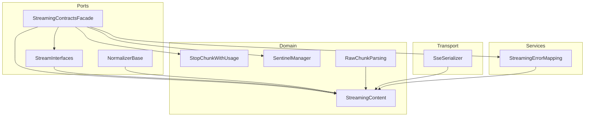
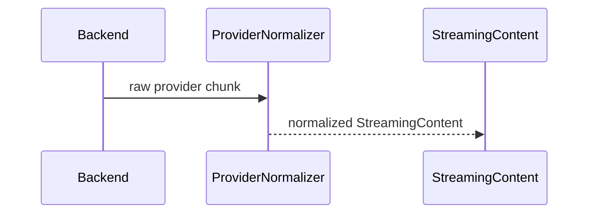
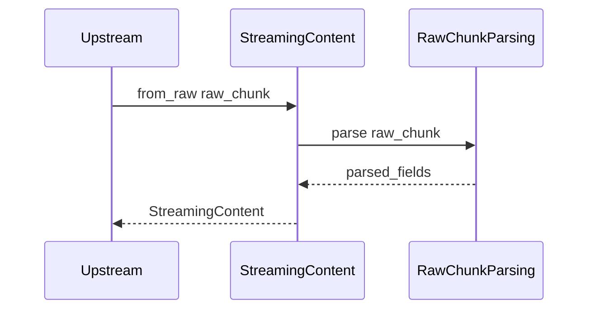
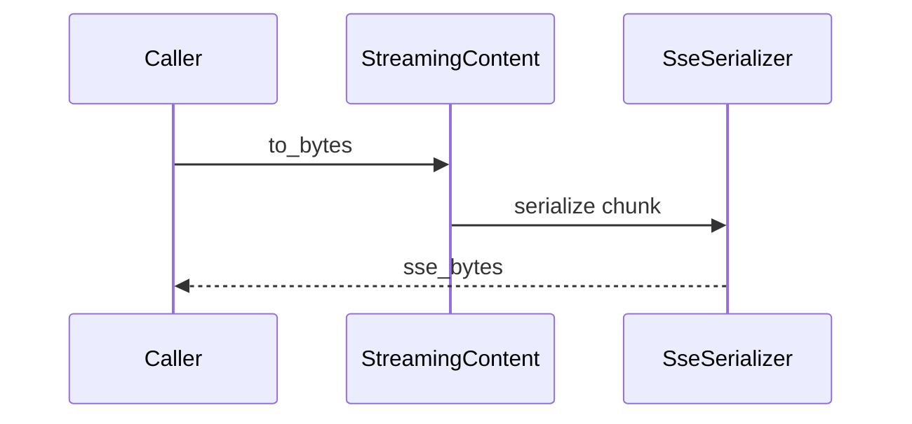
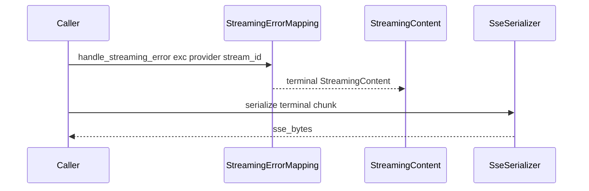

# Design: Streaming Contracts God Object Refactoring

## Overview

This feature decomposes `src/core/ports/streaming_contracts.py` into smaller, cohesive modules with clear responsibilities and stable dependency direction, while preserving the existing public import surface (`src.core.ports.streaming_contracts`) and runtime streaming behavior relied on by connectors, services, transports, and the test suite.

The refactor is executed as an **extension** to an existing streaming subsystem (provider normalizers, assemblers, response adapters, and service pipelines already exist). The primary impact is architectural: a “God Object” module is converted into a compatibility facade and responsibilities are relocated into domain, ports, transport, and services layers with explicit boundaries.

### Goals
- Reduce `src/core/ports/streaming_contracts.py` to a compatibility facade under the size threshold (1.1).
- Keep every newly introduced or substantially expanded module under the size threshold (1.2) and enforce complexity limits (1.3, 1.5).
- Remove vendor/transport dependencies from the contracts layer and preserve stable dependency direction (2.1, 2.3).
- Preserve public imports and streaming behavior (3.1, 3.2, 3.3) including usage stop-chunk handling, done markers, whitespace deltas, tool-call sanitization, and error propagation (4.1–4.4).

### Non-Goals
- Changing client-visible SSE semantics, payload schemas, done-marker behavior, or usage accounting (3.3, 4.1–4.4).
- Redesigning or replacing the existing streaming pipeline orchestrators/assemblers.
- Unifying the two existing “stream normalizer” abstractions with the same name (`IStreamNormalizer`) across ports vs services; this refactor keeps them separate and clarifies boundaries.

## Architecture

### Existing Architecture Analysis

`src/core/ports/streaming_contracts.py` currently mixes multiple responsibilities:
- contract types and interfaces
- stop-chunk usage protection
- provider/format parsing (`StreamingContent.from_raw`)
- SSE transport serialization (`StreamingContent.to_bytes`)
- vendor exception mapping (`httpx` -> `LLMProxyError`)

This violates boundary direction (2.1) and concentrates complexity (1.3). It also increases circular import risk because many modules and tests import from the same file (3.1).

### Architecture Pattern & Boundary Map

Selected pattern: **Clean layering** aligned with existing steering conventions (DI, staged initialization, adapter pattern).

Key boundary intent:
- **Domain** owns chunk semantics and invariants.
- **Ports** owns contracts and validation helpers; no vendor/transport imports.
- **Transport** owns SSE framing and byte-level contracts.
- **Services** owns vendor exception mapping and error normalization.
- **Facade** preserves the legacy import surface and performs re-exports only.



### Technology Stack

| Layer | Choice / Version | Role in Feature | Notes |
|-------|------------------|-----------------|-------|
| Runtime | Python 3.10+ | Modules/interfaces | Type hints required (`disallow_untyped_defs = true`) |
| Web | FastAPI (async) | Unchanged | No blocking I/O in async paths |
| Errors | `LLMProxyError` hierarchy | Streaming error envelopes | Preserve structured error metadata |
| Metrics gates | `scripts/analyze_complexity.py` (radon) | Enforce LOC/CC thresholds | Scope should be limited to streaming-contracts surface area |

## System Flows

### Flow 0: Provider-specific normalization (where provider parsing lives)



Decision: Provider-specific event parsing and normalization occurs in provider normalizers (2.2). The contracts surface (`StreamingContent.from_raw`) does not embed provider-specific parsing logic; it only canonicalizes transport-neutral shapes and preserves backward compatible entry points (3.1).

### Flow 1: Raw chunk normalization inside the contracts surface



Decision: `StreamingContent.from_raw` remains as a stable entry point (3.1), but becomes a delegator to small shape parsers to satisfy complexity constraints (1.3, 1.4) while keeping provider parsing in provider normalizers (2.2).

### Flow 2: SSE byte serialization



Decision: The transport serializer becomes the single owner of byte-level SSE rules (3.3, 4.4) and tool-call sanitization (4.3).

### Flow 3: Error mapping into terminal streaming chunks



Decision: error mapping moves out of the contracts layer to satisfy 2.1 while preserving existing error chunk structure and determinism (3.3, 4.4).

## Requirements Traceability

| Requirement | Summary | Components | Interfaces | Flows |
|-------------|---------|------------|------------|-------|
| 1.1 | Contracts file becomes facade under LOC cap | StreamingContractsFacade | re-exports | N/A |
| 1.2 | New/expanded modules under LOC cap | All new modules | N/A | N/A |
| 1.3 | No function exceeds CC cap | RawChunkParsing, SseSerializer, StreamingErrorMapping | N/A | 1, 2, 3 |
| 1.4 | No high-CC relocation | RawChunkParsing (strategy split) | N/A | 1 |
| 1.5 | No new module exceeds total CC cap | RawChunkParsing, SseSerializer, StreamingErrorMapping | N/A | N/A |
| 2.1 | No vendor/transport imports in contracts | StreamingContractsFacade, StreamInterfaces | N/A | 3 |
| 2.2 | Provider parsing in normalizers/adapters | Provider normalizers | `IProviderStreamNormalizer` | 0 |
| 2.3 | Contracts layer does not import connectors | All contracts/ports modules | N/A | N/A |
| 3.1 | Preserve public import surface | StreamingContractsFacade | All re-exported symbols | N/A |
| 3.2 | Preserve StopChunkWithUsage protection | StopChunkWithUsage | N/A | 2 |
| 3.3 | Preserve SSE semantics | SseSerializer, StreamingContent delegator | N/A | 2 |
| 4.1 | Usage stop chunk emitted correctly | StopChunkWithUsage, SseSerializer | N/A | 2 |
| 4.2 | Whitespace-only deltas not dropped | StreamingContent invariants | N/A | 1 |
| 4.3 | Tool-call sanitization preserved | SseSerializer | N/A | 2 |
| 4.4 | Done marker detection/emission preserved | SentinelManager, SseSerializer | N/A | 2 |
| 5.1 | New stateful collaborators use DI | N/A (kept stateless) | N/A | N/A |
| 5.2 | Avoid fallback construction | N/A (kept stateless) | N/A | N/A |
| 6.1 | Existing tests pass | All | N/A | N/A |
| 6.2 | Characterization tests for implicit behavior | SSE and stop-chunk tests | N/A | 1, 2, 3 |
| 6.3 | Document boundaries | This design doc + research log | N/A | N/A |

## Components and Interfaces

### Summary

| Component | Layer | Intent | Req Coverage | DI Lifetime | Contracts |
|----------|-------|--------|--------------|-------------|----------|
| StreamingContractsFacade | `src/core/ports/` | Preserve legacy imports via re-export only | 1.1, 2.1, 3.1 | N/A | N/A |
| StreamingContent | `src/core/domain/` | Canonical streaming chunk model and invariants | 3.1, 4.2 | N/A | N/A |
| StopChunkWithUsage | `src/core/domain/` | Prevent usage stop chunk leakage | 3.2, 4.1 | N/A | N/A |
| SentinelManager | `src/core/domain/` | Done marker creation and detection | 4.4 | N/A | N/A |
| RawChunkParsing | `src/core/domain/` | Decompose parsing heuristics into strategies | 1.3, 1.4, 3.3, 4.4 | N/A | N/A |
| SseSerializer | `src/core/transport/` | Central SSE framing and sanitization | 3.3, 4.1, 4.3, 4.4 | N/A | N/A |
| StreamingErrorMapping | `src/core/services/` | Map vendor exceptions to terminal chunks | 2.1, 3.3 | N/A | Service |
| StreamInterfaces | `src/core/ports/` | Streaming ABI definitions | 2.1, 3.1 | N/A | Service |

DI Registration Strategy:
- Option B introduces new modules but keeps the extracted collaborators **stateless**. No new DI bindings are required to satisfy 5.1 and 5.2. If state is introduced later (caches, registries), it must be moved behind `src/core/interfaces/` and registered in the DI composition root.

### Ports Layer (`src/core/ports/`)

#### StreamingContractsFacade

| Field | Detail |
|-------|--------|
| Intent | Re-export the public streaming contracts surface |
| Requirements | 1.1, 2.1, 3.1 |
| Interface | N/A |
| DI Lifetime | N/A |

Responsibilities & Constraints
- Re-export-only file (no logic) to minimize circular import risk.
- Must not import vendor/transport libraries such as `httpx` or FastAPI/Starlette types (2.1).

#### Naming and Imports (Avoid `IStreamNormalizer` Collision)

The codebase currently contains two unrelated interfaces named `IStreamNormalizer`:
- Provider-normalizer ABI (ports/contracts surface)
- Middleware pipeline normalizer ABI (services layer)

To avoid confusion and circular imports:
- The ports-layer interface is defined internally as `IProviderStreamNormalizer` in `src/core/ports/streaming/interfaces.py`.
- `src/core/ports/streaming_contracts.py` re-exports `IProviderStreamNormalizer` under the legacy name `IStreamNormalizer` to preserve the public import surface (3.1).
- Every file that needs the services-layer normalizer must import it from `src/core/interfaces/streaming_response_processor_interface.py` and should alias it locally (for example `IProcessingStreamNormalizer`) to avoid ambiguity.

This is a documentation-enforced boundary rule: new modules introduced by this refactor must not import the services-layer `IStreamNormalizer` into ports/contracts code or vice versa.

#### StreamInterfaces

| Field | Detail |
|-------|--------|
| Intent | Define stable streaming ABIs for normalizers, processors, and assemblers |
| Requirements | 2.1, 3.1 |
| Interface | Defined in ports module (contract-only) |
| DI Lifetime | N/A |

Service Interface
```python
from __future__ import annotations

from abc import ABC, abstractmethod
from collections.abc import AsyncIterator
from typing import Protocol

from src.core.domain.chat import CanonicalChatRequest
from src.core.domain.streaming.streaming_content import StreamingContent


class StreamProducer(Protocol):
    async def stream_completion(self, request: CanonicalChatRequest) -> AsyncIterator[object]: ...
    def get_provider_name(self) -> str: ...


class IProviderStreamNormalizer(ABC):
    @abstractmethod
    def normalize_stream(
        self, stream: AsyncIterator[object], provider: str
    ) -> AsyncIterator[StreamingContent]:
        ...


class IStreamProcessor(ABC):
    @abstractmethod
    async def process(self, content: StreamingContent) -> StreamingContent:
        ...

    def reset(self) -> None:
        return None


class IStreamAssembler(ABC):
    @abstractmethod
    def assemble_stream(
        self, stream: AsyncIterator[StreamingContent], format: str = "sse"
    ) -> AsyncIterator[bytes]:
        ...
```

### Domain Model (`src/core/domain/`)

#### StreamingContent

| Field | Detail |
|-------|--------|
| Intent | Canonical streaming chunk representation |
| Requirements | 3.1, 4.2, 4.4 |
| Interface | Domain dataclass |
| DI Lifetime | N/A |

Responsibilities & Constraints
- Owns chunk invariants such as “whitespace-only text is non-empty” (4.2).
- Maintains stable, normalized metadata and stream identifiers.
- Keeps `from_raw` and `to_bytes` signatures stable for backward compatibility (3.1), but delegates parsing and serialization outward for maintainability (1.3, 1.4).

#### StopChunkWithUsage

| Field | Detail |
|-------|--------|
| Intent | Prevent accidental stringification/implicit serialization of usage stop chunks |
| Requirements | 3.2, 4.1 |
| Interface | Dict subclass with protective behavior |
| DI Lifetime | N/A |

Responsibilities & Constraints
- Must preserve “leak prevention” behavior and remain detectable as a distinct type through the pipeline (3.2).
- Must be handled explicitly by the serializer so usage appears at the top-level SSE payload (4.1).

#### SentinelManager

| Field | Detail |
|-------|--------|
| Intent | Centralize done marker construction and detection |
| Requirements | 4.4 |
| Interface | Small utility |
| DI Lifetime | N/A |

Responsibilities & Constraints
- Done marker bytes must remain exactly `b"data: [DONE]\\n\\n"` where required by tests (4.4).

#### RawChunkParsing

| Field | Detail |
|-------|--------|
| Intent | Decompose `from_raw` heuristics into small strategies |
| Requirements | 1.3, 1.4, 3.3, 4.4 |
| Interface | Domain parsing entry points |
| DI Lifetime | N/A |

Responsibilities & Constraints
- Parse supported shapes currently accepted by `StreamingContent.from_raw` (bytes SSE fragments, dict payloads, `ProcessedResponse`, existing `StreamingContent`) without embedding provider-specific semantics.
- Must not introduce provider-specific parsing logic that belongs in provider normalizers (2.2). The parsing entry point is limited to canonicalizing transport-neutral shapes and detecting the standard SSE done marker (4.4).

Supported Inputs Matrix (for `StreamingContent.from_raw`)

| Input Shape | Supported | Outcome |
|------------|-----------|---------|
| `StreamingContent` | Yes | Returned as a copy (preserve flags and metadata) |
| `ProcessedResponse` | Yes | Unwrap `.content` and merge `.metadata` / `.usage` (3.1, 3.3) |
| `StopChunkWithUsage` | Yes | Preserved as content; must remain wrapped (3.2, 4.1) |
| `bytes` / `bytearray` SSE (`data: ...\n\n`) | Yes | Detect `[DONE]` and parse JSON payloads when present (4.4) |
| `str` containing SSE (`data: ...`) | Yes | Same semantics as bytes form |
| `str` containing JSON | Yes | Parse to dict and re-run dict handling |
| OpenAI-style streaming dict (`choices[].delta` / `choices[].message`) | Yes | Canonical path: extract content/tool_calls/reasoning and relevant metadata (3.3) |
| Unknown dict shape (not OpenAI-style) | Yes (opaque) | Treated as opaque content dict without provider-specific interpretation; serializer is responsible for SSE framing (3.3) |
| Pydantic model (`model_dump`) | Yes (best-effort) | Convert via `model_dump()` and re-run dict handling |
| Other types | Yes (best-effort) | Coerce to string content (diagnostic only) |

Explicitly Not Supported as “provider parsing” in `from_raw`
- Provider event schemas such as:
  - Gemini-style dicts with top-level `candidates` (provider-specific)
  - Anthropic event dicts with top-level `type` such as `content_block_delta` / `message_delta` (provider-specific)

Those shapes may still flow through `from_raw` as opaque dict content, but the contracts layer must not implement provider semantics for them. Provider normalizers (Flow 0) are responsible for converting provider events into canonical streaming content (2.2).

### Transport Layer (`src/core/transport/`)

#### SseSerializer

| Field | Detail |
|-------|--------|
| Intent | Single source of truth for SSE framing and sanitization |
| Requirements | 3.3, 4.1, 4.3, 4.4 |
| Interface | Transport serializer API (function/class) |
| DI Lifetime | N/A |

Responsibilities & Constraints
- Produce byte-identical SSE output required by tests (3.3, 4.4).
- Serialize StopChunkWithUsage with usage at top level and terminate correctly (4.1).
- Sanitize tool-call structures by removing internal fields (4.3).
- Never depend on `src/connectors/` (2.3).

### Services Layer (`src/core/services/`)

#### StreamingErrorMapping

| Field | Detail |
|-------|--------|
| Intent | Map vendor exceptions to `LLMProxyError` and terminal streaming chunks |
| Requirements | 2.1, 3.3, 4.4 |
| Interface | Module-level API exposed via facade |
| DI Lifetime | N/A |

Responsibilities & Constraints
- Own all mappings for `httpx` exceptions and JSON decode errors without importing vendor libraries in the contracts layer (2.1).
- Preserve the structured error metadata envelope expected by transports and tests (3.3, 4.4).

## Data Models

### Domain Model (`src/core/domain/`)

Cross-layer contract rule: outside provider/transport adapters, streaming data must be passed as standardized models (prefer Pydantic v2). Legacy “raw dict” payloads and wide unions should not cross layer boundaries; they should be normalized into typed models at the boundary (design-principles.md).

`StreamingContent` is treated as the **public compatibility facade** for the canonical streaming chunk contract (3.1). Internally, extracted components should standardize on typed contracts for payload/metadata/error/usage rather than ad-hoc dictionaries.

Canonical contracts (conceptual Pydantic v2 shapes):

```python
from __future__ import annotations

from typing import Literal

from pydantic import BaseModel, ConfigDict, Field

from src.core.domain.chat import ToolCall


class StreamingErrorInfo(BaseModel):
    model_config = ConfigDict(extra="forbid")

    type: str
    message: str
    code: str | None = None
    retryable: bool | None = None


class StreamingUsage(BaseModel):
    model_config = ConfigDict(extra="forbid")

    prompt_tokens: int | None = None
    completion_tokens: int | None = None
    total_tokens: int | None = None


class StreamingMetadata(BaseModel):
    model_config = ConfigDict(extra="forbid")

    provider: str | None = None
    stream_id: str | None = None
    finish_reason: str | None = None
    role: str | None = None
    tool_calls: list[ToolCall] | None = None
    reasoning_content: str | None = None
    error: StreamingErrorInfo | None = None
    usage: StreamingUsage | None = None


class StreamingPayload(BaseModel):
    model_config = ConfigDict(extra="forbid")

    kind: Literal["text", "opaque_json", "binary", "empty"] = "empty"
    text: str | None = None
    opaque_json: str | None = None
    binary_b64: str | None = None


class StreamingChunk(BaseModel):
    model_config = ConfigDict(extra="forbid")

    payload: StreamingPayload = Field(default_factory=StreamingPayload)
    metadata: StreamingMetadata = Field(default_factory=StreamingMetadata)
    is_done: bool = False
    is_empty: bool = False
    is_cancellation: bool = False
```

Compatibility expectation (3.1):
- `StreamingContent` may expose legacy `.content`/`.metadata`/`.usage` properties for existing import sites, but extracted collaborators should exchange `StreamingChunk`/`StreamingMetadata`/`StreamingPayload` rather than raw dicts.

Invariants (non-exhaustive):
- Whitespace-only string content is non-empty (4.2).
- Done markers are detectable and preserved without emitting spurious content (4.4).
- StopChunkWithUsage must not be implicitly stringified (3.2).

## Error Handling

Error strategy:
- Streaming error mapping produces a terminal `StreamingContent` chunk with:
  - `metadata.finish_reason == "error"`
  - `metadata.error` as a typed `StreamingErrorInfo` contract (stable keys: `type`, `message`, `code`, `retryable`)
- The mapping lives in services to allow vendor imports (`httpx`) while keeping ports/contracts vendor-free (2.1).

## Testing Strategy

### Test Organization
Tests mirror source structure under `tests/`:
- `tests/unit/` - Isolated unit tests
- `tests/integration/` - Cross-component tests
- `tests/property/` - Hypothesis property-based tests
- `tests/regression/` - Bug-regression coverage

### Unit Tests (`tests/unit/`)
- Validate `StreamingContent.from_raw` and `.to_bytes` behavior remains stable via delegation.
- Validate done-marker exact bytes (`b"data: [DONE]\\n\\n"`) and no duplication across adapters/formatters (4.4).
- Validate StopChunkWithUsage leak-prevention behavior and serialization (3.2, 4.1).
- Validate tool-call sanitization outputs in SSE payloads (4.3).

### Property Tests (`tests/property/`)
- Preserve invariants for error mapping determinism and structured error chunks.
- Preserve streaming contracts invariants for randomly generated chunks (validation, done markers).

### Regression Tests (`tests/regression/`)
- StopChunkWithUsage wrapper preservation through pipeline stages (3.2).

### Metrics Guardrails

Introduce an enforceable, **scoped** gate that verifies:
- `src/core/ports/streaming_contracts.py` < 600 LOC (1.1)
- each streaming-contracts refactor module < 600 LOC (1.2)
- per-function CC ≤ 50 and per-module CC ≤ 200 within scope (1.3, 1.5)

Operationalization (so this is not “aspirational”):
- Add a focused script (example name): `scripts/check_streaming_contracts_metrics.py`
  - Inputs: an explicit list of file globs limited to the streaming-contracts refactor surface area
  - Output: clear failure messages pointing to violating file(s) and function(s)
  - Behavior: non-zero exit code on violation
- Add a unit test (example name): `tests/unit/core/ports/test_streaming_contracts_metrics_gate.py`
  - Invokes the script (or imports its functions) to fail CI when thresholds are exceeded.

Scope definition (must be limited to avoid unrelated failures):
- `src/core/ports/streaming_contracts.py`
- `src/core/ports/streaming/*.py`
- `src/core/domain/streaming/*.py`
- `src/core/domain/streaming/parsing/*.py`
- `src/core/transport/streaming/*.py`
- `src/core/services/streaming/error_mapping.py`

### Test Commands
```bash
./.venv/Scripts/python.exe -m pytest -m unit
./.venv/Scripts/python.exe -m pytest -m "not slow"
```

## Optional Sections

### Security Considerations
- Ensure serializer sanitization continues to remove internal tool-call markers and `extra_content` (4.3).
- Preserve existing steering leak protection behavior by not weakening final outbound sanitation in transport/assemblers.

### Performance & Scalability
- The serializer and parsers are hot-path. Extracted units must be small and predictable to prevent allocation-heavy or quadratic behavior in streams.
- Avoid adding new per-chunk network/file I/O and keep the refactor async-safe.

## Supporting References (Optional)
- See `.kiro/specs/streaming-contracts-god-object-refactoring/research.md` for discovery notes, integration hotspots, and byte-level contract citations.
