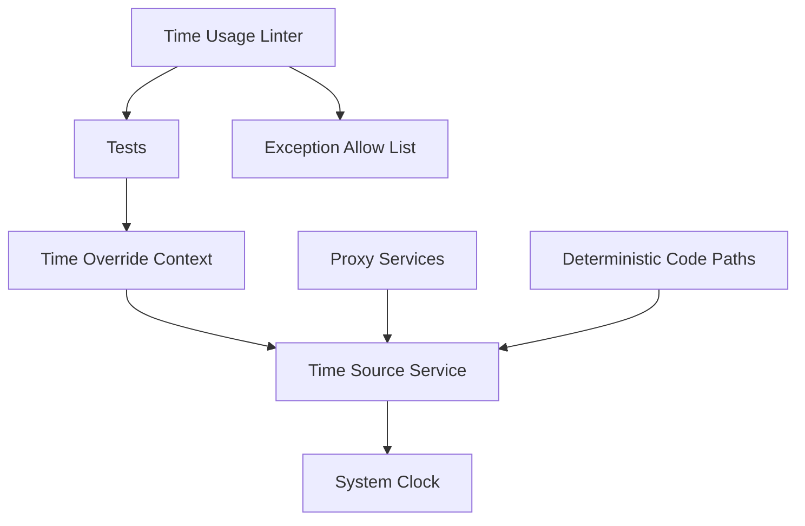
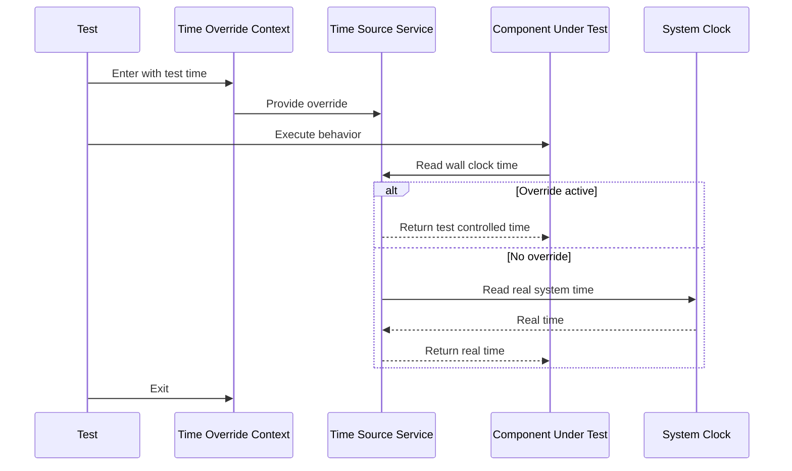

# Design Document: test-system-time-mocking-fix

---
**Purpose**: Ensure deterministic, test-controlled time across the test suite and deterministic code paths by introducing a single overrideable time boundary and enforcing a time usage linter for unsafe real-time reads.

**Project Context**: Universal LLM Proxy - FastAPI async service with staged initialization, DI containers, adapter pattern for LLM backends.
---

## Overview
This feature makes time-dependent tests deterministic by eliminating unsafe reads of real system wall-clock time in tests and deterministic code paths. It introduces a single, overrideable time source boundary for code that is asserted in tests, and adds a dedicated time usage linter to prevent unsafe real-time dependencies from re-entering the suite.

Developers maintaining the proxy and its test suite use this to write stable tests without relying on incidental monkeypatching behavior. Maintainers use the explicit exception policy and automated guard to keep the suite deterministic over time.

### Goals
- Establish a single, overrideable time source boundary used by deterministic code paths.
- Standardize time control policy for tests (including explicit exceptions with rationale).
- Prevent regression by failing fast when unsafe real-time reads are introduced in tests.

### Non-Goals
- Rewriting all production wall-clock reads across the entire codebase in one change.
- Eliminating legitimate real-time-dependent tests (network/live/benchmark) where real time is required.
- Changing externally observable production behavior when tests do not supply test-controlled time.

## Architecture

### Existing Architecture Analysis
- The project uses staged initialization and DI-managed services for cross-cutting concerns.
- The test suite already uses two time-control techniques:
  - `tests/utils/fake_clock.py` for deterministic async scheduling and epoch seconds (`time.time`).
  - `freezegun` for deterministic datetime wall-clock behavior.
- Some production code uses imported aliases like `from time import time`, which bypass patching strategies that only replace `time.time`.
- DI wiring is centralized behind the registrar orchestrator (`src/core/di/registrations/_orchestrator.py`) and executed during staged startup, which is the natural integration point for cross-cutting services.

### Architecture Pattern & Boundary Map
**Selected pattern**: Service + Interface (central time source boundary) with a hybrid migration strategy.

**Architecture Integration**
- Domain/feature boundaries:
  - `Time Source` boundary owns “what time is it” semantics for deterministic paths.
  - Test policy boundary owns exception classification and regression enforcement.
- Existing patterns preserved:
  - DI registration via `ServiceCollection` and registrar orchestrator.
  - Async/await correctness for sleep and scheduling.
- New components rationale:
  - A single overrideable time source eliminates patch brittleness and imported-alias bypass.
  - A time usage linter ensures the cleanup does not need repeating.

### Technology Stack

| Layer | Choice / Version | Role in Feature | Notes |
|-------|------------------|-----------------|-------|
| Runtime | Python 3.10+ | Time boundary + tests | Type hints required |
| Test runner | Pytest | Regression guard + policy checks | Uses existing markers |
| Time freezing | `freezegun` (existing) | Transitional datetime control | Avoid global freezing |
| Fake scheduling | `tests/utils/fake_clock.py` (existing) | Transitional `asyncio.sleep` control | ContextVar scoped |

## System Flows

### Deterministic Test Using Central Time Source

## Requirements Traceability

| Requirement | Summary | Components | Interfaces | Flows |
|-------------|---------|------------|------------|-------|
| 1.1 | Disallow unsafe wall-clock dependency in tests | TimeUsageLinter | ExceptionPolicy | |
| 1.2 | Use test-controlled time where safe | TimeSource, TimeOverride | ITimeSource | Deterministic Test Using Central Time Source |
| 1.3 | Direct real-time reads require explicit exception | TimeUsageLinter, AllowList | ExceptionPolicy | |
| 1.4 | CI determinism for time assertions | TimeSource, TimeUsageLinter | ITimeSource | |
| 1.5 | Identify remaining non-compliant usages | TimeUsageLinter | ExceptionPolicy | |
| 2.1 | Explicitly identify real-time-dependent tests | ExceptionPolicy | | |
| 2.2 | Real-time-dependent tests do not require freezing | ExceptionPolicy | | |
| 2.3 | Disallow undocumented real-time dependency | TimeUsageLinter | ExceptionPolicy | |
| 2.4 | Preserve/update exception rationale on change | ExceptionPolicy | | |
| 3.1 | Ensure all relevant time reads observe test time | TimeSource, TimeOverride | ITimeSource | Deterministic Test Using Central Time Source |
| 3.2 | Outputs reflect active test-controlled time | TimeSource | ITimeSource | Deterministic Test Using Central Time Source |
| 3.3 | Mixed real and test time requires exception | TimeUsageLinter, ExceptionPolicy | ExceptionPolicy | |
| 4.1 | Prevent new unsafe real-time dependencies | TimeUsageLinter | ExceptionPolicy | |
| 4.2 | Replace or record as exception per usage | ExceptionPolicy | | |
| 4.3 | Preserve test intent | ExceptionPolicy | | |
| 4.4 | No undocumented real-time reads remain | TimeUsageLinter | ExceptionPolicy | |
| 5.1 | Single documented policy for time control | ExceptionPolicy | | |
| 5.2 | Use canonical technique per API surface | ExceptionPolicy, TimeSource | | |
| 5.3 | Document multi-technique selection criteria | ExceptionPolicy | | |
| 5.4 | Minimize distinct techniques | ExceptionPolicy | | |
| 5.5 | Treat non-applicable categories as exception candidates | ExceptionPolicy | | |
| 6.1 | Provide single overrideable wall-clock source | TimeSource | ITimeSource | |
| 6.2 | Allow tests to supply test-controlled time | TimeOverride | ITimeSource | Deterministic Test Using Central Time Source |
| 6.3 | Deterministic paths avoid direct real-time reads | TimeSource | ITimeSource | |
| 6.4 | Components asserted in tests use time source or exception | TimeSource, ExceptionPolicy | ITimeSource | |
| 7.1 | Fail tests when new unsafe reads are introduced | TimeUsageLinter | | |
| 7.2 | Explicit allow-list mechanism for approved exceptions | AllowList | ExceptionPolicy | |
| 7.3 | Actionable reporting for detected reads | TimeUsageLinter | | |
| 8.1 | Dedicated time usage linter exists | TimeUsageLinter | | |
| 8.2 | Linter fails on non-exempt real-time calls | TimeUsageLinter | | |
| 8.3 | Marker-based exclusions supported | TimeUsageLinter, ExceptionPolicy | ExceptionPolicy | |
| 8.4 | Linter reports actionable locations | TimeUsageLinter | | |
| 9.1 | Deterministic outcomes across machines/time zones | TimeSource, TimeOverride, TimeUsageLinter | ITimeSource | Deterministic Test Using Central Time Source |
| 10.1 | Make time dependency explicit | ExceptionPolicy, TimeUsageLinter | ExceptionPolicy | |
| 11.1 | CI stability for time-dependent tests | TimeUsageLinter, ExceptionPolicy | ExceptionPolicy | |

## Components and Interfaces

**DI Registration Strategy**
- `ITimeSource` -> `TimeSource` (`Singleton`, context-aware)
- Registration location: core DI registrations (registrar orchestrator path `src/core/di/registrations/_orchestrator.py`) so all services can depend on `ITimeSource` consistently.
- Test override is not a DI registration; it is a scoped override mechanism layered on top of the time source boundary.

### Time Control Policy (Canonical Techniques)

This design assumes the repository will continue to have multiple time-control utilities, but applies a single policy to minimize arbitrary choice:

- For deterministic code paths owned by this repository, prefer `ITimeSource` + `TimeOverride` (Requirement 6) so tests do not rely on patching/interception.
- For async scheduling and epoch-seconds determinism in tests, use the existing `FakeClockContext` (`tests/utils/fake_clock.py`) because it safely controls `asyncio.sleep` and `time.time` without leaking across concurrent tests.
- Use `freezegun` only when testing code that directly calls `datetime`/`date` APIs and cannot be refactored to consume `ITimeSource` in the scope of this effort (incremental migration).

This policy keeps a single “first choice” mechanism (`ITimeSource`) for repository-owned deterministic behavior, and confines patch-based techniques to the smallest required surface area.

### TimeSource

| Field | Detail |
|-------|--------|
| Intent | Single boundary for wall-clock time reads in deterministic code paths |
| Ownership | Core services / shared utilities |
| Consumers | Services and deterministic helpers whose outputs are asserted in tests |

**Interface Contract**
- `ITimeSource` (Python typing `Protocol` or ABC):
  - `def now_utc(self) -> datetime`
  - `def now_local(self) -> datetime`
  - `def unix_time_s(self) -> float`
  - `def monotonic_s(self) -> float`
  - `async def sleep(self, seconds: float) -> None`

**Behavioral Contract**
- `now_utc` and `unix_time_s` are derived from the same conceptual clock so tests can reason about ordering and equality without mixing sources.
- `monotonic_s` remains a duration-only primitive and is not used for wall-clock timestamps in persisted or user-visible data.

**Integration Notes**
- Deterministic code paths that are asserted in tests depend on `ITimeSource` rather than calling `datetime.now(...)`, `time.time()`, or using imported aliases.
- `TimeSource` resolves an active override from a scoped override mechanism (for example, a `ContextVar` set by `TimeOverride`); when no override is active it reads real system time and delegates sleeping to `asyncio.sleep` (no production behavior change without an override).

### TimeOverride

| Field | Detail |
|-------|--------|
| Intent | Provide test-controlled time without broad patching |
| Scope | Per-test or per-suite, explicitly scoped |

**Contract**
- An override context supplies a deterministic `ITimeSource` implementation for the duration of the context.
- Outside the override scope, the system continues to use the default (system-backed) time behavior.

**Integration Notes**
- This design avoids global freezing hooks to prevent unintended side effects (e.g., time-derived filenames in test logging).
- Override scope is async-safe and compatible with parallel pytest execution; override state must not leak across concurrent tests.

### ExceptionPolicy

| Field | Detail |
|-------|--------|
| Intent | Define what is allowed to use real time and how that is documented |
| Scope | Tests and deterministic code paths under enforcement |

**Policy Contract**
- Real-time-dependent tests are explicitly marked and include a rationale.
- Exceptions are reviewable in code review and machine-verifiable by the time usage linter.
- Policy distinguishes categories:
  - Deterministic tests (must use test-controlled time)
  - Real-time-dependent tests (explicit exception)
  - Out-of-scope suites (e.g., live tests) handled via allow-listing rules

**Standardization**
- Marker name: `pytest.mark.real_time`.
- Machine-checkable rationale: `pytest.mark.real_time(reason="<non-empty>")` is required for per-test exceptions.
- The allow-list is the machine-readable source of truth for what is exempted from scanning and why (each entry includes a justification).

**Marker Registration & Precedence Rules**
- Marker registration: `real_time` is registered in the project’s pytest marker configuration (so it is discoverable and does not produce unknown-marker warnings).
- Precedence (most specific to least specific):
  1. Allow-list entries that target a specific test nodeid (exact test) take priority.
  2. Per-test exception marker `pytest.mark.real_time(reason=...)` applies to that test only.
  3. Allow-list entries that target file globs or directories apply next.
  4. No implicit exemption: other markers (for example `live`, `network`, `no_global_mock`) do not automatically exempt a test unless the allow-list explicitly includes that category.

### TimeUsageLinter

| Field | Detail |
|-------|--------|
| Intent | Dedicated time-usage test linter to prevent reintroduction of unsafe wall-clock reads in tests |
| Scope | Test suite (primary), optionally selected deterministic production modules |

**Linter Contract**
- Scans tests for unsafe real-time read patterns unless exempted by the ExceptionPolicy allow-list.
- Fails with actionable output identifying file and location for each violation.
- Enforces that exemptions are explicit and carry rationale (either `pytest.mark.real_time(reason=...)` or an allow-list justification).

**Detection Scope**
- Default scope: `tests/` (excluding suites that are allow-listed as real-time-dependent, such as `tests/live/`, unless opted in).
- Optional scope: selected deterministic production modules that directly influence asserted timestamps.

**Unguarded Real-Time Reads (Policy-Level)**
- The time usage linter flags *unguarded* call sites that would read real system wall-clock time under default test execution (Requirement 8.1–8.2).
- The linter must recognize and exclude call sites that are within a time-controlled context that makes the relevant API deterministic, so existing “freezed time” tests do not become false positives.

**Guarded Contexts Recognized by the Linter**
- `freezegun`:
  - `with freeze_time(...):` guards `datetime.now(...)`, `datetime.utcnow()`, and `date.today()` within the `with` scope.
  - `@freeze_time(...)` guards the entire decorated test function body.
- `FakeClockContext` (`tests/utils/fake_clock.py`):
  - `async with FakeClockContext(...):` guards `time.time()` (and code derived from it) within the `async with` scope.
  - `FakeClockContext` does not guard `datetime.now(...)` / `date.today()`; those calls remain unguarded unless covered by `freezegun` or replaced by `ITimeSource`.

**Call Patterns Under Enforcement**
- Datetime wall-clock reads (guarded by `freezegun` only):
  - `datetime.now(...)`, `datetime.utcnow()`, `date.today()`
- Epoch wall-clock reads (guarded by `FakeClockContext` only):
  - `time.time()`, including imported aliases that bypass attribute patching (`from time import time` followed by `time()`).
- The policy allows duration-only primitives (e.g., `time.monotonic()`) when they are not used as wall-clock timestamps for asserted outputs.

**Implementation Note (for robustness)**
- The linter should be AST-based (like the existing stall linter) so it can:
  - report accurate file/line/column locations,
  - distinguish call expressions from comments/strings,
  - detect import aliases (`from time import time as now_s`) and class imports (`from datetime import datetime`),
  - and determine whether each call is inside a guarded scope (for example, under a `with freeze_time(...)` block).

**AllowList Contract**
- Location: `tests/utils/time_policy_allowlist.json` (checked into repo).
- Each entry includes a target selector (file glob or pytest nodeid pattern) and a justification.
- Suggested shape (versioned for safe evolution):
  - `{"version": 1, "entries": [{"target_type": "nodeid"|"glob", "target": "...", "reason": "..."}]}`

**Test-Linter Alignment**
- Implemented as a dedicated linter-style test (for example `tests/unit/test_time_usage_linter.py`), analogous to `tests/unit/test_stall_linter.py` and the architectural linter invoked from `tests/unit/test_test_quality.py`.
- The linter is expected to run in normal developer workflows and CI (i.e., it is not an optional, manual-only check).
- Optional fast-fail optimization: run the time-usage linter early in `pytest_collection_modifyitems` (similar to the existing stall-linter ordering) to fail fast before xdist worker fan-out.

## Data Models
No new persisted data models are required. The only “data” for this feature is policy metadata used by the time usage linter:
- A machine-readable allow-list (for approved exceptions and exempted suites).
- Marker conventions and rationale text (stored in test source alongside the exception).

## Error Handling
This feature introduces no new runtime error surface for proxy requests. Failures are test-time failures (time usage linter) and should be expressed as clear pytest assertion failures with actionable locations.

## Testing Strategy

### Unit Tests
- Verify `ITimeSource` semantics (UTC vs local, epoch seconds consistency).
- Verify TimeOverride scoping behavior (override active vs inactive).
- Verify time usage linter detection and allow-list behavior (including rationale enforcement).

### Integration Tests
- Refactor representative flaky/time-dependent tests to use the central time source override mechanism.
- Ensure that legitimate real-time tests remain functional and explicitly documented as exceptions.

### Property Tests
- For time-sensitive property tests, ensure generated scenarios do not rely on wall clock; use the time override boundary as needed.

## Integration & Migration Notes
- Migration is incremental:
  - Prioritize code paths where timestamps are asserted in tests or affect deterministic outputs.
  - Keep `freezegun` and `FakeClockContext` as transitional tools; the target state is that deterministic code paths use the time source boundary.
- Avoid global time freezing; prefer explicit per-test scoping to reduce cross-suite interference, especially under parallel execution.
