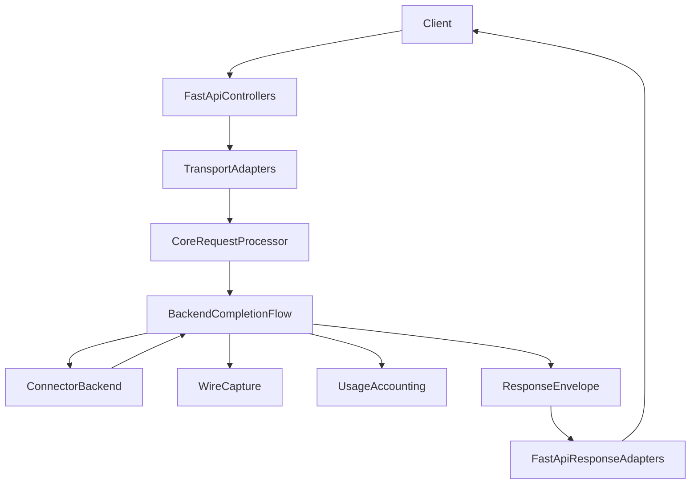
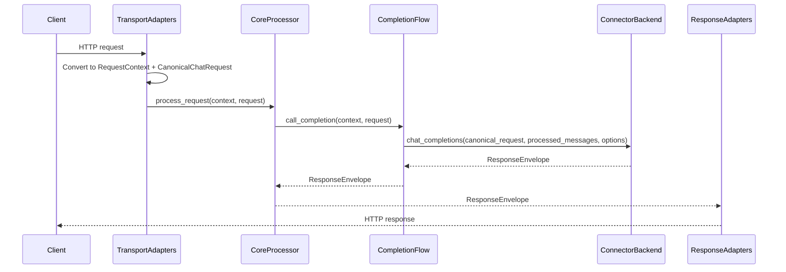
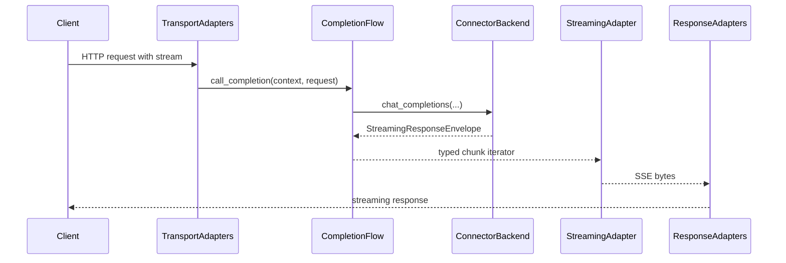

# Design Document

---
**Purpose**: Define a practical, low-risk design to harden typed contract boundaries across Transport ↔ Core ↔ Connector seams while preserving externally observable behavior.

**Project Context**: Universal LLM Proxy - async FastAPI application with staged initialization, DI-managed services, adapter pattern for connectors, and CBOR wire captures.
---

## Overview

This design hardens cross-layer boundary typing by (1) defining an explicit *boundary surface enforcement scope*, (2) tightening the highest-leverage seams (connector invocation, transport response/streaming adapters, wire-capture collaborator interfaces), and (3) concentrating any remaining legacy compatibility into explicitly named conversion points.

Given current codebase reality (widespread `Any` usage in `src/core/domain` utilities and translation code), enforcement is scoped to true cross-layer seams and canonical contract carriers, rather than treating the entire domain layer as a “boundary module”. This reduces refactor blast radius while still meeting the intent of typed contracts at cross-layer exchange points.

### Goals
- Make “boundary typing” enforceable and sustainable via a clear scope + guardrail.
- Ensure Transport ↔ Core ↔ Connector seams exchange canonical contracts or JSON-serializable typed values (`JsonValue`).
- Preserve external behavior: HTTP API shapes, error mapping, streaming semantics, capture compatibility.
- Centralize legacy dict compatibility at explicit conversion points.
- Prevent new cross-layer “extension surface sprawl” by making extension mechanisms explicit and reviewable.

### Non-Goals
- Rewriting all translation utilities to remove `Any` throughout `src/core/domain` internals.
- Redesigning the entire canonical request model in one step; legacy permissive request fields may remain where required (per 2.7), but must be confined and documented.
- Changing CBOR capture encoding, capture file format, or replay semantics.

## Requirements Traceability

| Requirement | Summary | Components | Interfaces | Flows |
|-------------|---------|------------|------------|-------|
| 1.1–1.5 | External behavior preserved | Compatibility adapters, regression tests, capture checks | Existing controller/service interfaces | Non-streaming + streaming request flows |
| 2.1–2.7 | Canonical contracts across seams | Boundary contract set + conversion points | `RequestContext`, `BackendTarget`, `UsageSummary`, envelopes | Transport-to-core, core-to-connector, response adaptation |
| 3.1–3.7 | Guardrails + enforcement | Enforcement scope + checker config + allowlist | Boundary type checker | CI / local verification |
| 4.1–4.4 | Connector seam hardened | Canonical connector API + compatibility adapter | Connector base/protocol | Backend invocation flow |
| 5.1–5.3 | Explicit conversion points | Centralized coercion at adapters only | Coercion helpers | Entry + connector boundary |
| 6.1–6.3 | Typed usage/metadata boundaries | UsageSummary and JSON-safe metadata at seams | Response processor contracts, adapter protocols | Response pipeline |
| 7.1–7.3 | Capture/replay alignment | Typed capture surfaces + decoder remains best-effort | Capture orchestrator contracts | Capture and replay |
| 8.1–8.3 | Contributor guidance | Updated docs + enforcement workflow | Typed contract guidance | N/A |

## Architecture

### Existing Architecture Analysis

- Request entry is through FastAPI controllers and adapter functions that construct `RequestContext` and normalize protocol payloads into canonical request models.
- Core processing is orchestrated by `RequestProcessor` and backend orchestration by `BackendCompletionFlow` (currently implemented under `src/core/services/backend_completion_flow/`).
- Transport response adaptation (including streaming/SSE) is layered under `src/core/transport/fastapi/adapters/`.
- Connector invocation is through `src/connectors/base.LLMBackend.chat_completions(...)`, which currently accepts permissive inputs (`dict[str, Any]`, untyped processed messages, `**kwargs: Any`) even though call sites already have canonical inputs available.
- Response streaming is already normalized through `ProcessedResponse` and `StreamingResponseEnvelope`, and typed streaming boundary models exist (`StreamingChunk`), but several boundary protocols still expose `Any`/`dict[str, Any]`.
- Session cancellation already has a stable core-side interface (`ISessionCancellationCoordinator`), but the connector seam is still typed as `Any` for cancellation in the base connector API.
- A boundary type checker exists (`dev/scripts/check_boundary_types.py`) but currently relies on hard-coded “boundary directories” and treats `src/core/domain/` broadly as “boundary”, yielding a large number of violations and not covering the connector seam; scope reconciliation is required before it can be used as a practical guardrail.

### Architecture Pattern & Boundary Map

**Selected pattern**: Boundary Contract Hardening with Compatibility Facades (Hybrid).

- **Boundary policy**: define what is considered a boundary surface (enforced) vs internal-only (not enforced).
- **Conversion policy**: conversions are permitted only at explicit adapter boundaries; core services operate on canonical contracts.
- **Compatibility policy**: legacy dict acceptance remains only behind explicitly named coercers/shims.

**Boundary contracts at each edge**
- TransportAdapters → CoreProcessor: `RequestContext` + `CanonicalChatRequest`
- CoreProcessor → CompletionFlow: `CanonicalChatRequest` + `RequestContext` + `BackendTarget`
- CompletionFlow → Connector: connector-facing request contract + typed processed messages + JSON-safe options
- CompletionFlow → Capture/Usage: canonical usage contracts (`UsageSummary`, `CanonicalUsageRecord`) and JSON-safe metadata
- ResponseEnv → ResponseAdapters: typed response envelopes + typed streaming chunk contracts

## Technology Stack

| Layer | Choice / Version | Role in Feature | Notes |
|-------|------------------|-----------------|-------|
| Runtime | Python 3.10 / FastAPI | Transport entry and response adaptation | No FastAPI types leak into connector contracts |
| Models | Pydantic v2 + dataclasses | Canonical contracts and DTOs | Prefer `JsonValue` for extension values |
| DI | `ServiceCollection` | Optional adapter/service registration | Preserve staged init ordering |
| Capture | CBOR (`cbor2`) | Wire capture fidelity | Preserve existing capture format |
| Type checking | mypy | Enforce boundary signatures | Guardrails reduce `Any` at seams |

## System Flows

### Non-streaming request flow (boundary conversions)

### Streaming request flow (typed chunk boundary)

## Components and Interfaces

### Summary Table

| Component | Layer | Intent | Requirements | Notes |
|----------|-------|--------|--------------|-------|
| Boundary surface scope | `dev/` | Define enforcement scope for guardrails | 3.1, 3.2 | Enables practical enforcement |
| Boundary type checker update | `dev/` | Enforce typed boundary signatures within scope | 3.3–3.7 | Must include connectors |
| Connector contract hardening | `src/connectors/` | Make connector seam typed and stable | 4.1–4.4 | Requires compatibility shim |
| Response/streaming seam typing | `src/core/interfaces/`, `src/core/transport/` | Remove `Any` from boundary signatures and chunk contracts | 2.5, 6.1–6.3 | Avoid per-chunk heavy conversions |
| Capture collaborator typing | `src/core/interfaces/` | Replace `Any`/`dict[str, Any]` with canonical contracts | 7.1–7.3 | Preserve CBOR fidelity |
| Legacy coercion utilities | `src/core/transport/` (or services) | Centralize dict→contract conversion at explicit boundaries | 5.1–5.3 | No “deep” coercion in core |

### Boundary Type Guardrails: Enforcement Specification (Design Decision)

**Decision**: Make boundary typing enforceable by defining an explicit “boundary surface enforcement scope” and an explicit exception/allowlist mechanism.

**Rationale**:
- The current guardrail script treats `src/core/domain/` broadly as “boundary”, which is not aligned with the intent of “cross-layer seams” and is not actionable at current scale (gap analysis: ~638 violations).
- Enforcement must focus on *actual seam surfaces* (interfaces, transport adapters, connector base API) and the *canonical contract carriers* that cross those seams.
- Exceptions must be explicit, minimal, and time-bounded to prevent permanent backsliding (2.7, 3.5).

**Enforcement scope definition (3.1, 3.2)**:
- Create a dedicated, versioned scope file at `dev/boundary_types_scope.json` containing:
  - `include_globs`: list of glob patterns
  - `exclude_globs`: list of glob patterns
  - `explicit_files`: list of exact files that must be enforced even if outside globs
- The scope is deliberately phased so the guardrail can become *green and enforceable* early, rather than flagging thousands of pre-existing violations:
  - **Phase 0 (minimum viable enforcement; expected to become green first)**:
    - `explicit_files`:
      - `src/connectors/base.py` (connector boundary API)
      - `src/core/interfaces/response_processor_interface.py` (processed chunk contract + response processor seam)
      - `src/core/transport/fastapi/adapters/protocols.py` (adapter protocol signatures)
      - `src/core/domain/responses.py` (response envelopes; already boundary-carried)
      - `src/core/domain/request_context.py` (context contract; already boundary-carried)
      - `src/core/domain/backend_target.py` (routing contract; already boundary-carried)
      - `src/core/domain/usage_summary.py` (usage contract; already boundary-carried)
      - `src/core/domain/streaming/contracts.py` (typed chunk boundary model)
    - `include_globs`: empty or extremely narrow (prefer explicit pinning in Phase 0 to control blast radius)
    - `exclude_globs`: optional; primarily used in later phases when include_globs expand
  - **Phase 1+ (expand enforcement surface incrementally)**:
    - Add narrowly targeted `include_globs` as areas become compliant, e.g.:
      - `src/core/interfaces/**/*.py` (after high-traffic interfaces stop using `Any`)
      - `src/core/transport/fastapi/adapters/**/*.py` (after adapter protocols and key implementations are typed)
      - `src/connectors/contracts/**/*.py` (when connector-facing DTOs are introduced)
    - Keep `src/core/domain/**/*.py` excluded by default, except for explicit canonical contract carriers.

**Scope precedence rules**
- `explicit_files` override `exclude_globs`.
- If a file matches both `include_globs` and `exclude_globs`, it is excluded unless also present in `explicit_files`.

**Phased connector enforcement (3.2, 4.1–4.4)**
- Phase 0/1: Enforce only the connector boundary API (`src/connectors/base.py`) and any new connector contract definitions under `src/connectors/contracts/**`.
- Phase 2+: Expand enforcement to selected connector implementations after they migrate to the canonical connector API, using time-bounded allowlist entries as needed (2.7, 3.5).

**Guardrail implementation contract (3.3–3.7)**:
- `dev/scripts/check_boundary_types.py` is updated to:
  - Load `dev/boundary_types_scope.json`.
  - Apply includes/excludes and enforce only files in the resulting set.
  - Exit non-zero on violations and print file:line:column messages (already supported).
- The developer documentation is updated to:
  - Describe `dev/boundary_types_scope.json` as the source of truth (3.1, 8.1).
  - Provide the canonical command to run the check (3.3).

**Guardrail capability (clarification)**:
- Phase 0 enforcement is intentionally **signature-first**: the checker primarily targets `Any` / `dict[str, Any]` in function/method signatures and Protocol definitions (the highest-leverage boundary surfaces).
- Phase 0 does **not** attempt to fully enforce Pydantic model field types or prevent all possible “extension sprawl” mechanically; that is handled by the explicit extension policy, review, and targeted tests.
- Phase 1+ may optionally expand the checker to inspect class-level annotations for a small, explicitly pinned set of boundary-carried contract classes (starting with response-processing and adapter-layer contracts) if signature-only enforcement proves insufficient.

**Exception / allowlist mechanism (2.7, 3.5)**:
- Create a dedicated allowlist file at `dev/boundary_types_allowlist.json` with entries:
  - `file`: exact path
  - `symbol`: optional function/class name (if applicable)
  - `violation`: e.g., `Any-in-signature`, `dict[str, Any]`
  - `reason`: short rationale
  - `expires_at`: RFC3339 timestamp (required)
  - `tracking`: issue/spec reference (required)
- The checker must treat allowlisted entries as permitted, and fail when `expires_at` is in the past.

**Why connectors are in-scope**
- The connector seam is an explicit cross-layer boundary (Core ↔ Connector) and must be enforced by scope (3.2) to satisfy 4.1–4.4.

### Extension Mechanisms Policy (Design Decision)

**Decision**: Treat “extensions” as a first-class boundary concept: new cross-layer extensibility must go through explicitly approved extension containers/fields with JSON-safe values, and we do not add new ad hoc dict-shaped extension fields at boundaries.

**Motivation**
- The codebase already has multiple extension-like surfaces for compatibility and provider variance (e.g., `ChatRequest.extra_body`, tool metadata, streaming payload metadata).
- Without an explicit policy, boundary hardening risks either (a) breaking compatibility by trying to eliminate legacy surfaces too aggressively, or (b) letting new ad hoc extension fields proliferate, undoing the typing gains.

**Approved extension mechanisms (initial list; Phase 0/1)**
- `RequestContext.extensions: dict[str, JsonValue]` (cross-layer context metadata)
- `ConnectorRequestContext.extensions: dict[str, JsonValue]` (connector-facing context metadata; Phase 1)
- `UsageSummary.extensions: dict[str, JsonValue]` (provider-specific usage)
- `ResponseEnvelope.metadata: dict[str, JsonValue] | None` and `StreamingResponseEnvelope.metadata: dict[str, JsonValue] | None` (response metadata crossing seams)
- `ProcessedResponse.metadata: dict[str, JsonValue]` (streaming processed-chunk metadata crossing core → transport seam)

**Legacy extension mechanisms (allowed, but no new usage; Phase 0/1)**
- `ChatRequest.extra_body: dict[str, Any] | None` and related permissive request fields (kept for external protocol compatibility; promotion path required under 2.7)
- `ToolCall.extra_content: dict[str, Any] | None` (kept for provider compatibility; promotion path required under 2.7)
- `StreamingChunk.payload.opaque_json_dict: dict[str, Any] | None` (kept as an explicit “opaque” escape hatch; prefer `JsonValue` where feasible)

**Rules**
- New cross-layer metadata/extension fields MUST be added to an approved extension mechanism, not as a new standalone `dict[str, Any]` field on a boundary-carried contract.
- Extension values crossing seams MUST be JSON-safe (`JsonValue`) unless explicitly documented as an “opaque” escape hatch with a promotion plan (2.7).
- When a legacy extension mechanism is used to carry a stable, recurring concept, it must be promoted into a typed field or JSON-safe approved extension mechanism on a time-bounded plan (2.7, 8.2).

### Connector-Facing Contracts

**Decision**: Introduce an explicit canonical connector contract and invoke connectors through a single adapter that preserves backward compatibility without leaking legacy shapes into core orchestration.

**Compatibility stance (project-default assumption)**:
- Treat `LLMBackend` as a *stable plugin boundary* for this project: connectors are auto-discovered/imported and are likely to be customized. Avoid hard breaking changes to `LLMBackend` signatures in the near term.
- Achieve hardening by controlling what *core passes into connectors* (canonical inputs + typed messages + typed cancellation + JSON-safe options) and by containing legacy behavior behind a single, explicitly named adapter/invoker.

#### Connector Context Contract (Minimal, Stable)

**Decision**: Define a minimal connector-facing context contract that carries only stable, transport-agnostic data needed for logging/diagnostics/correlation, without exposing raw transport details (headers/cookies) or core-internal objects.

**Contract**: `ConnectorRequestContext` (dataclass/InternalDTO)
- `request_id: str | None`
- `session_id: str | None`
- `client_host: str | None`
- `extensions: dict[str, JsonValue]` (JSON-safe; for cross-layer correlation/debug metadata)

**Rationale**
- Satisfies the intent of requirement 2.3 (“request and context contracts”) without forcing `RequestContext` to become a connector dependency.
- Keeps the connector seam stable and avoids leaking transport details or dynamic core state across the boundary.
 - Mapping is performed by core orchestration (`ConnectorInvoker`) as a shallow projection: `RequestContext` → `ConnectorRequestContext`.

**Canonical connector API (4.1–4.3, 2.3)**:
- Define a canonical connector-facing request contract:
  - `ConnectorChatCompletionsRequest` (dataclass/InternalDTO) with:
    - `request: CanonicalChatRequest`
    - `processed_messages: Sequence[ChatMessage]`
    - `effective_model: str`
    - `identity: IAppIdentityConfig | None`
    - `cancellation_token: SessionKey | None`
    - `cancellation_coordinator: ISessionCancellationCoordinator | None`
    - `context: ConnectorRequestContext | None`
    - `options: dict[str, JsonValue]` (connector options; replaces `**kwargs`)
- Define a canonical connector protocol/interface:
  - `ICanonicalChatCompletionsBackend.chat_completions(request: ConnectorChatCompletionsRequest) -> ResponseEnvelope | StreamingResponseEnvelope`

**Backward compatibility strategy (4.4, 5.1–5.2)**:
- Introduce `ConnectorInvoker` in core orchestration that:
  1. Builds `ConnectorChatCompletionsRequest` from canonical inputs.
  2. If backend implements `ICanonicalChatCompletionsBackend`, call the canonical method.
  3. Else call legacy `LLMBackend.chat_completions(...)` using:
     - `request_data=request` (canonical domain model, never a dict)
     - `processed_messages=list(processed_messages)` (still typed values)
     - `effective_model=effective_model`
     - `**kwargs` expanded from `options` (legacy-only escape hatch)
- This is the only permitted location where `options` are re-expanded into `**kwargs`, and it must be treated as a documented boundary exception under 2.7/3.5 with a deprecation plan.
- Connector context forwarding to legacy connectors is not guaranteed: legacy connectors may accept arbitrary `**kwargs` but may also forward them to HTTP clients. To avoid accidental breakage, connector context is guaranteed only for the canonical connector API; if a legacy connector needs context, it should be migrated to the canonical API (4.4).

**Migration plan (phased)**
- Phase 1: Add the canonical protocol + invoker; migrate first-party connectors to implement `ICanonicalChatCompletionsBackend`.
- Phase 2: Deprecate legacy kwargs expansion (warn in logs when used); progressively stop relying on `**kwargs` in first-party connectors.
- Phase 3 (optional, requires explicit approval): Remove legacy kwargs expansion entirely. This is considered a potentially breaking change for third-party connectors and is therefore out-of-scope for default execution.

### Response Processing and Streaming Boundary Contracts

**Decision**: Treat the existing `ProcessedResponse` contract (`src/core/interfaces/response_processor_interface.py`) as the canonical core→transport processed-chunk wrapper, and treat `StreamingChunk` (`src/core/domain/streaming/contracts.py`) as the typed boundary contract for serialization/validation where it adds value.

**Current state to reconcile**
- `StreamingResponseEnvelope.content` is already `AsyncIterator[ProcessedResponse]`, but `ProcessedResponse` and `IResponseProcessor` still expose `Any` in signatures/attributes, preventing boundary guardrails from being actionable within `src/core/interfaces/` and `src/core/transport/`.
- Transport adapter protocols (SSE decoding, usage normalization, reasoning injection) still accept/return `Any`/`dict[str, Any]` for boundary-carried payloads and metadata.

**Hardened processed-chunk contract (2.5, 6.1–6.3)**:
- Define a single shared content union for boundary use:
  - `ProcessedChunkContent = bytes | str | dict[str, JsonValue] | None`
- Ensure `ProcessedResponse` carries:
  - `content: ProcessedChunkContent`
  - `usage: UsageSummary | None`
  - `metadata: dict[str, JsonValue]` (no mutable class-level defaults)
- Constrain boundary protocol signatures to consume/emit `ProcessedResponse` (or `ProcessedChunkContent`) rather than raw `Any`.

**Allowed conversion points**
- Connector/raw stream → core streaming processing: provider-specific objects may exist internally, but must be normalized into `ProcessedChunkContent` before crossing into `StreamingResponseEnvelope.content`.
- Response processor → transport adapter: no deep validation per chunk; only shallow checks and serialization.
- Transport streaming adapter → wire: optional validation can use `StreamingChunk` for done markers and error envelopes without introducing per-chunk heavy parsing.

**Performance constraints (NFR1.2)**
- No Pydantic model parsing per chunk in hot paths unless explicitly required for correctness.
- Prefer shallow coercion (e.g., bytes decode) and JSON-safe metadata merging.

**Canonical types for boundary usage**:
- `UsageSummary` for usage propagation and accumulation.
- `dict[str, JsonValue]` for metadata crossing seams.

### Capture Collaborator Contracts

**Design intent**:
- Replace capture collaborator signatures that accept `Any` or `dict[str, Any]` for canonical usage / EOS metadata with canonical contracts:
  - `CanonicalUsageRecord` (or `UsageSummary`) for usage.
  - `dict[str, JsonValue]` for structured metadata.
- Replace “identity context” `Any` with `IAppIdentityConfig | None` where possible; where not possible, treat it as a documented boundary exception (2.7, 3.5).

## Error Handling and Validation

- Boundary conversions from external input to canonical contracts validate input and raise structured errors consistent with the existing `LLMProxyError` hierarchy (1.3, NFR2.2).
- Legacy compatibility coercion remains best-effort only where current behavior is fail-open, and must not change client-visible error semantics (NFR2.3).

## Migration and Rollout Plan (Phased)

### Phase 0: Align policy and enforcement (3.1–3.7)
- Define and document boundary surface enforcement scope.
- Update boundary type checker to use that scope and include connectors.
- Add allowlist entries only with explicit rationale and a deprecation plan.
- Phase 0 “exit criteria” (must be true before treating the guardrail as meaningful):
  - `dev/scripts/check_boundary_types.py` can run against Phase 0 scope and exit 0 on `main` (or fails only on a small, time-bounded allowlist with expiry).
  - `ProcessedResponse` and the highest-traffic adapter protocol signatures stop using `Any` for boundary-carried content/metadata (use `ProcessedChunkContent` + `JsonValue`).
  - `src/connectors/base.py` no longer requires `dict[str, Any]` inputs from core call sites (core always passes canonical request).
  - A minimal unit test suite exists for scope filtering + allowlist expiry behavior.
  - Documentation states: “Phase 0 scope is enforced; other areas are advisory until expanded.”

### Phase 1: Harden connector seam (4.1–4.4, 2.3)
- Introduce `ConnectorChatCompletionsRequest` + `ICanonicalChatCompletionsBackend`.
- Update core orchestration to invoke connectors via `ConnectorInvoker` only.
- Migrate first-party connectors to the canonical API; keep legacy invocation behind the invoker as a time-bounded exception.

### Phase 2: Harden response/streaming seams (2.5, 6.1–6.3)
- Update the response processor and transport streaming adapters to accept/yield `ProcessedResponse` with `ProcessedChunkContent` only.
- Ensure streaming performance is preserved by keeping per-chunk conversions minimal and avoiding per-chunk deep parsing (NFR1.2).

### Phase 3: Centralize legacy coercion (5.1–5.3)
- Remove acceptance of legacy dict contexts from core services; confine dict→contract conversion to explicit adapter points only.

### Phase 4: Optional follow-ups (2.7)
- Tighten remaining permissive legacy fields in canonical request/response models where feasible, promoting stable keys into typed fields or an approved JSON-safe extension mechanism.

## Testing Strategy

- Add or extend unit tests that assert boundary contracts are used at key seams (3.3, 4.1, 6.1).
- Add integration tests covering:
  - Supported protocol controllers (OpenAI/Responses/Anthropic/Gemini) for streaming and non-streaming paths (1.1–1.5).
  - Wire capture enabled path, ensuring capture compatibility and decode best-effort behavior (1.4, 7.1–7.3).
- Add tests for the boundary type checker behavior and allowlist mechanism (3.3–3.5).

## Risks and Mitigations

- **Risk**: Enforcement scope is too narrow and misses real boundary leaks.  
  **Mitigation**: Scope is explicit and documented; expand scope iteratively when seams are reclassified as boundaries.

- **Risk**: Connector compatibility breaks due to signature changes.  
  **Mitigation**: Compatibility adapter at connector boundary; phased migration with parallel support.

- **Risk**: Streaming regressions due to increased per-chunk processing.  
  **Mitigation**: Prefer shallow coercion and JSON-safe metadata; avoid per-chunk deep validation; add streaming regression tests (NFR1.2).

## Implementation Defaults (to remove ambiguity)

These defaults are chosen to minimize risk and maximize practical value for this repo’s shape (many protocols, streaming, capture/replay, connector auto-discovery).

1. **Boundary scope default**: Treat `src/core/domain/**` as internal-only for guardrail enforcement, except for explicitly pinned canonical contract carriers (context/target/usage/envelopes/streaming typed contracts). Do not treat translation modules as “boundary surfaces” in Phase 0/1. (3.1)
2. **Legacy extension default**: Treat the explicitly listed legacy extension mechanisms (`ChatRequest.extra_body`, `ToolCall.extra_content`, `StreamingChunk.payload.opaque_json_dict`) as allowed for compatibility, but forbid introducing new ones. Promotion into typed fields or approved JSON-safe extension mechanisms is deferred unless a field is clearly stable and low-risk to promote. (2.6, 2.7)
