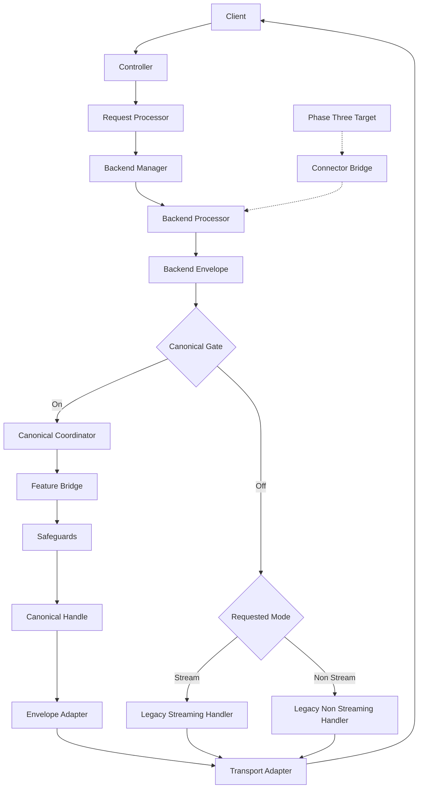
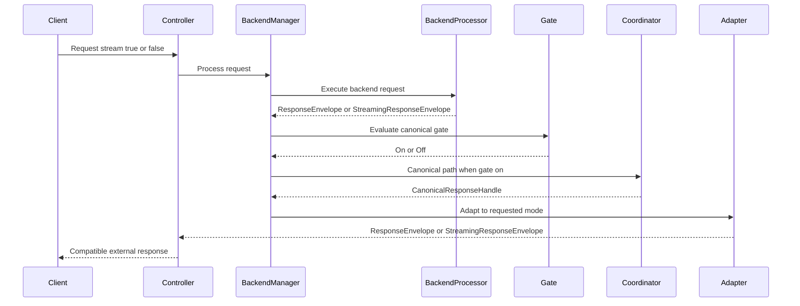
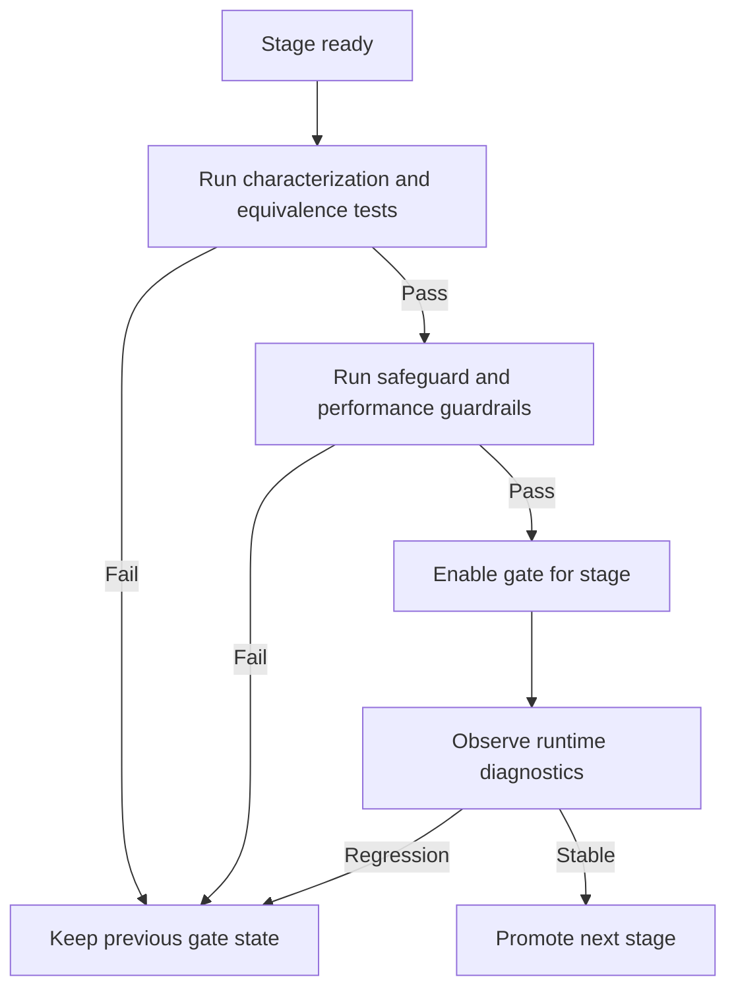
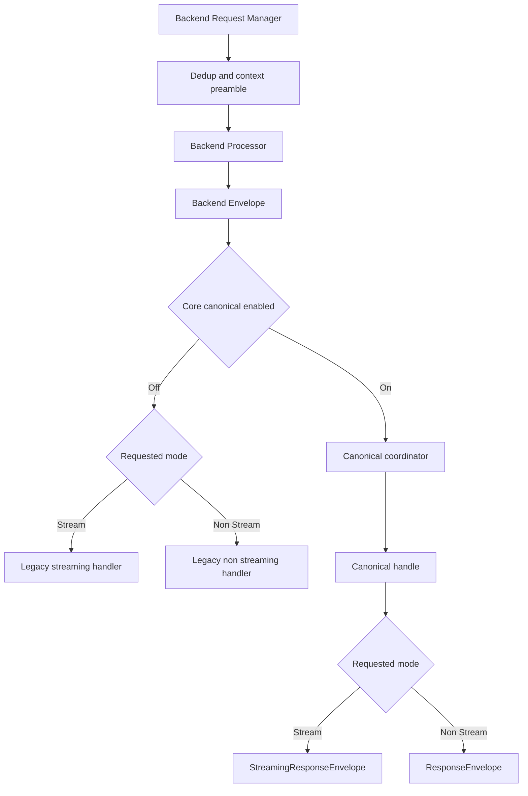

# Design Document: unification-of-request-processing

---
**Purpose**: Define an implementation-ready architecture for converging duplicated streaming and non-streaming request-processing paths into a canonical internal model while preserving external API behavior.
---

## Overview

This feature introduces a **stream-first canonical internal processing model** for request/response handling in the proxy core. The design converges duplicated business logic in orchestration, middleware contracts, and connector integration layers, while preserving current client-visible streaming and non-streaming contracts through compatibility adapters.

The design is intentionally phased. Instead of a big-bang replacement, each phase introduces a bounded convergence change behind migration gates, with equivalence validation and rollback control. Phase 1 intentionally converges the system at the **current `BackendRequestManager` boundary** by consuming the existing `IBackendProcessor` result. Phase 3 lowers the same canonical contract deeper into connector execution after the manager-level design is proven.

### Goals
- Converge equivalent stream/non-stream business logic into one canonical internal path.
- Preserve current public transport contracts (SSE and non-stream JSON semantics) during migration.
- Reduce feature-parity overhead by moving from dual implementations to canonical feature processing.
- Enable provider-by-provider connector convergence with explicit rollout and rollback controls.
- Define measurable migration promotion gates using contract equivalence, safeguard characterization, and performance/resource guardrails.

### Non-Goals
- Replacing frontend API surfaces such as `/v1/chat/completions`, Responses, Anthropic, or Gemini endpoints.
- Changing externally documented payload shapes, status codes, or headers in this design phase.
- Rewriting all connectors simultaneously.
- Removing legacy contracts before migration completion criteria are met.

## Architecture

### Existing Architecture Analysis

Current implementation has partial convergence and systemic duplication.

- **Converged area**: `UnifiedResponsePipeline` already treats non-streaming as single-chunk streaming internally inside `ResponseProcessor`.
- **Manager-level split**: `BackendRequestManager.process_backend_request()` calls `IBackendProcessor`, then branches on `backend_request.stream` into separate streaming and non-streaming handlers.
- **Handler complexity**:
  - `BackendNonStreamingResponseHandler` owns empty-response retry, structured-output enforcement, tool-call retry, and metadata shaping.
  - `BackendStreamingResponseHandler` owns middleware wrapping, quality-verifier buffering, loop detection, tool-call retry, empty-stream recovery, status extraction, and stream lifecycle behavior.
- **Interface-level split**:
  - `IResponseProcessor` exposes separate non-streaming and streaming methods.
  - `IResponseFeature` enforces separate `process_non_streaming()` and `process_streaming()` implementations.
  - Backend request manager collaborators are split into `INonStreamingBackendResponseHandler` and `IStreamingBackendResponseHandler`.
- **Stateful feature behavior**: Several response-processing features use stream-end or full-response semantics, so a chunk-only contract without lifecycle context is insufficient.
- **Compatibility-critical boundaries**:
  - `domain_response_to_fastapi()` branches by `ResponseEnvelope` vs `StreamingResponseEnvelope`.
  - Controllers and transport adapters encode mode-specific error rendering and disconnect behavior.
  - The streaming path applies request-dedup completion tracking after handler processing.
  - Existing regression suites pin protocol behavior tightly.

### Selected Pattern and Phased Boundary Strategy

**Selected pattern**: phased canonical response handling with a stream-first core and compatibility adapters at boundaries.

**Why this pattern fits the codebase**:
- It reuses the proven stream-first pattern already present in `UnifiedResponsePipeline` and Gemini base orchestration.
- It respects the current brownfield cut lines instead of forcing an immediate connector rewrite.
- It preserves staged initialization and DI seams while allowing incremental retirement of split components.

**Key boundary decision**:
- The canonical business unit remains an `AsyncIterator[ProcessedResponse]`.
- Phase 1 cannot expose only that iterator, because the current manager boundary must also preserve `status_code`, `headers`, `media_type`, `cancel_callback`, and usage records already carried by `ResponseEnvelope` and `StreamingResponseEnvelope`.
- Therefore the canonical manager-level contract is a richer **`CanonicalResponseHandle`** that carries the canonical stream plus the transport-neutral envelope metadata needed by compatibility adapters.



### Boundary Decisions

- Phase 1 canonicalizes **post-backend-response handling** at the current manager boundary; `IBackendProcessor` remains in place.
- Phase 3 lowers the same canonical contract below `IBackendProcessor` through `ConnectorStreamFirstBridge` for migrated providers.
- Legacy split handlers remain only as fallback or delegation shims during migration.
- Dedup duplicate short-circuit behavior stays above the gate; streaming dedup completion tracking remains wrapped around the final returned streaming envelope until equivalent canonical behavior is proven.
- Transport adaptation remains a boundary concern. The canonical path does not directly emit FastAPI responses.
- Mode-sensitive exceptions are allowed only when explicitly documented, bounded, and tested.

### Critical Migration Invariants

These invariants must hold throughout migration. They are captured here because they are part of the design contract, not optional supporting notes.

| Invariant Area | Current Owner(s) | Design Rule During Migration |
|----------------|------------------|------------------------------|
| Streaming boundary contract | `response_adapters.py`, envelope models | Preserve SSE framing and current terminal completion marker semantics. |
| Non-streaming boundary contract | `response_adapters.py`, envelope models | Preserve JSON payload shape, media type, status, and usage projection semantics. |
| Envelope metadata survival | manager boundary plus envelope contracts | Preserve `status_code`, `headers`, `media_type`, `cancel_callback`, and usage/accounting data through canonical handling. |
| Dedup duplicate short-circuit | `BackendRequestManager` | Keep duplicate-request rejection above the Phase 1 gate. |
| Streaming dedup completion classification | `BackendRequestManager` | Preserve current disconnect-before-terminal, disconnect-after-terminal, and explicit error classification semantics until an equivalent canonical mechanism is proven. |
| Empty-response and empty-stream recovery | split handlers plus empty-response middleware | Converge deliberately; do not assume these are generic chunk-processing behaviors. |
| Loop detection and cancellation | streaming handler | Preserve cancellation chunk emission and cancel-callback invocation behavior. |
| Tool-call retry coordination | split handlers plus `ToolCallRetryCoordinator` | Keep mode-correct retry behavior explicit until a unified collaborator is proven safe. |
| Quality verifier control flow | request processor, streaming verifier, streaming handler | Preserve skip-verification signaling, auxiliary verification, and recall behavior. |
| Disconnect cleanup | transport boundary | Keep disconnect cleanup and cancel-callback behavior boundary-aware and non-blocking. |
| Migration gate safety | new migration gate work | Keep new gates default-off and expose path-selection diagnostics for every staged rollout. |

### Component Predecessor Map

| New Component | Predecessor(s) | Relationship | Retirement Phase |
|---------------|----------------|--------------|------------------|
| CanonicalResponseCoordinator | `BackendNonStreamingResponseHandler`, `BackendStreamingResponseHandler` | Subsumes shared post-backend-response business flow. In Phase 1 it consumes the existing backend envelope returned by `IBackendProcessor`. Legacy handlers may delegate to it or remain fallback branches while parity is proven. | Phase 4 |
| CanonicalResponseHandle | `ResponseEnvelope`, `StreamingResponseEnvelope` at internal manager boundary | Internal migration contract carrying canonical chunk stream plus envelope metadata required by compatibility adapters. It does not replace public boundary envelopes until retirement. | Phase 4 |
| EnvelopeCompatibilityAdapter | `NonStreamingAdapter` (`wrap_as_stream` and `unwrap_from_stream`), manager-level envelope branching | Converts a `CanonicalResponseHandle` back into the existing envelope contracts. Reuses `NonStreamingAdapter` accumulation patterns during transition where useful. | Phase 4 |
| FeatureProcessingBridge | `IResponseFeature` dual methods, parity registry scaffolding | Replaces split feature execution with one canonical contract plus explicit lifecycle context. Legacy adapters are allowed only for audit-approved features. | Phase 4 |
| ConnectorStreamFirstBridge | Provider-specific `stream_completion` and non-streaming method pairs | Standardizes connector invocation to the canonical handle contract. Introduced after manager-level convergence is stable. | Phase 4 |
| MigrationGateService | None | New config-driven rollout control, diagnostics source, and fallback selector. | Removed after Phase 4 completes |

### Technology Stack and Alignment

| Layer | Choice / Version | Role in Feature | Notes |
|-------|------------------|-----------------|-------|
| Runtime | Python 3.10+, async FastAPI | Core orchestration | No stack changes |
| Services | `src/core/services/*` | Canonical path and safeguards | Extend existing service orchestration |
| Contracts | `src/core/interfaces/*`, `src/core/domain/*` | Internal and edge contracts | Add canonical handle and typed feature context |
| Transport | `src/core/transport/fastapi/*` | Client compatibility boundary | Preserve current behavior |
| Connectors | `src/connectors/*` | Provider integration | Provider-by-provider stream-first convergence |
| Testing | pytest + existing unit/integration/regression/property suites | Promotion gates | Add characterization, equivalence, and guardrail suites |

## System Flows

### Phase 1 canonical manager flow



### Migration promotion flow



## Requirements Traceability

| Requirement | Summary | Components | Interfaces | Flows |
|-------------|---------|------------|------------|-------|
| 1.1-1.6 | Canonical internal processing path | Canonical Response Coordinator, Canonical Response Handle, Envelope Compatibility Adapter | `ICanonicalResponseCoordinator`, `IEnvelopeCompatibilityAdapter` | Phase 1 canonical manager flow |
| 2.1-2.6 | External contract compatibility | Envelope Compatibility Adapter, transport adapters, controller error mapping | Existing envelope contracts retained at boundary | Phase 1 canonical manager flow |
| 3.1-3.5 | Connector contract simplification | Connector Stream First Bridge, provider adapters | `IConnectorStreamBridge` | Phase 1 flow plus Phase 3 migration |
| 4.1-4.5 | Feature parity by construction | Feature Processing Bridge, canonical feature context, legacy feature adapters | `ICanonicalResponseFeature`, `CanonicalFeatureContext` | Phase 1 canonical manager flow |
| 5.1-5.9 | Reliability safeguards | Safeguard collaborators, dedup wrapper preservation, coordinator-integrated invariant checks | Existing retry, cancellation, dedup, loop, QV, tool-call collaborators plus canonical facade | Phase 1 canonical manager flow |
| 6.1-6.7 | Incremental migration safety | Migration Gate Service, diagnostics, equivalence verifier | `IMigrationGateService`, `IEquivalenceVerifier` | Migration promotion flow |
| 7.1-7.5 | Performance and resource safety | Performance Guardrail Evaluator | `IPerformanceGuardrailEvaluator` | Migration promotion flow |

## Components and Interfaces

### Component Summary

| Component | Domain/Layer | Intent | Req Coverage | Key Dependencies | Contracts |
|-----------|--------------|--------|--------------|------------------|-----------|
| CanonicalResponseCoordinator | Core services | Execute unified post-backend-response business flow | 1, 5 | Backend manager, response processor, safeguard collaborators | Service |
| CanonicalResponseHandle | Core domain | Carry canonical chunk stream plus envelope metadata | 1, 2, 5 | Existing envelope metadata | State |
| EnvelopeCompatibilityAdapter | Core and transport boundary | Convert canonical handle to existing external envelope behavior | 1, 2 | Canonical handle, transport adapters | Service |
| FeatureProcessingBridge | Middleware boundary | Apply canonical feature processing with typed lifecycle context | 4, 5 | Response features, feature audit results | Service |
| ConnectorStreamFirstBridge | Connector boundary | Normalize provider invocation to canonical handle contract | 3, 5, 6 | Provider connectors | Service |
| MigrationGateService | Ops control | Gate rollout, expose active stage, support rollback | 6 | Config, diagnostics, verifiers | Service and State |
| EquivalenceVerifier | Test and validation | Verify stream/non-stream contract equivalence | 2, 6 | Fixtures, golden transport expectations | Batch |
| PerformanceGuardrailEvaluator | Ops validation | Evaluate latency, TTFT, memory, cleanup guardrails | 7 | Metrics, soak tests | Batch |

### Core Services

#### CanonicalResponseHandle

`CanonicalResponseHandle` is the internal manager-level migration contract.

```python
@dataclass
class CanonicalResponseHandle:
    stream: AsyncIterator[ProcessedResponse]
    status_code: int
    media_type: str
    headers: dict[str, str] | None
    cancel_callback: Callable[[], Awaitable[None]] | None
    canonical_usage: CanonicalUsageRecord | None
    metadata: dict[str, JsonValue]
```

**Why this exists**
- `AsyncIterator[ProcessedResponse]` alone is not sufficient at the current manager boundary.
- The compatibility adapter must preserve envelope-level behavior already supplied by the backend path.
- This handle keeps the canonical business stream and the existing transport-neutral metadata together until final adaptation.

#### CanonicalResponseCoordinator

| Field | Detail |
|-------|--------|
| Intent | Centralize stream-first internal response handling for both requested modes at the current manager boundary |
| Requirements | 1.1, 1.2, 1.3, 1.4, 1.5, 1.6, 5.1, 5.2, 5.3, 5.4, 5.5, 5.6, 5.7, 5.8, 5.9 |

**Responsibilities and constraints**
- Consume the existing backend envelope returned by `IBackendProcessor` in Phase 1.
- Convert both requested modes into one canonical chunk stream without losing envelope metadata.
- Keep requested-mode selection outside core business logic; requested-mode adaptation happens only in `EnvelopeCompatibilityAdapter`.
- Preserve existing invariants for cancellation, retry, tool-call retry, loop detection, quality verifier behavior, and metadata propagation.
- Allow explicitly documented safeguard exceptions when behavior is inherently mode-sensitive.

**Dependencies**
- Inbound: `BackendRequestManager` and the `ResponseEnvelope | StreamingResponseEnvelope` returned by `IBackendProcessor`
- Outbound: `FeatureProcessingBridge`, safeguard collaborators, `EnvelopeCompatibilityAdapter`
- External: existing retry, cancellation, dedup, loop, tool-call retry, and quality-verifier services

##### Service Interface
```python
class ICanonicalResponseCoordinator(Protocol):
    async def from_backend_response(
        self,
        backend_response: ResponseEnvelope | StreamingResponseEnvelope,
        request: ChatRequest,
        context: RequestContext,
        processing_context: ResponseProcessingContext,
    ) -> CanonicalResponseHandle:
        ...
```

Preconditions:
- `backend_response` has already been produced by the current `IBackendProcessor` in Phase 1.

Postconditions:
- Returned handle exposes exactly one canonical chunk stream plus the envelope metadata needed by boundary adapters.

Invariants:
- Safeguard-critical metadata needed by downstream processing is preserved.
- Requested mode does not select a different business-logic implementation inside the coordinator.

**Phase note**
- Phase 3 may lower the coordinator input boundary below `IBackendProcessor`, but Phase 1 intentionally matches the current manager cut line to keep rollout bounded.

#### EnvelopeCompatibilityAdapter

| Field | Detail |
|-------|--------|
| Intent | Adapt a canonical handle to streaming or non-streaming external response contracts |
| Requirements | 1.2, 1.5, 2.1, 2.2, 2.3, 2.4, 2.5, 2.6 |

**Responsibilities and constraints**
- Convert a `CanonicalResponseHandle` to `StreamingResponseEnvelope` for streaming requests.
- Accumulate a canonical stream into `ResponseEnvelope` for non-streaming requests, including assembly of envelope-level fields such as model, id, created, choices, and system fingerprint from canonical metadata and request context.
- Preserve `status_code`, `headers`, `media_type`, `cancel_callback`, and `canonical_usage` from the canonical handle.
- Preserve terminal signaling and error semantics expected by transport adapters.

**Relationship to existing code**
- `to_non_streaming()` generalizes the accumulation pattern from `NonStreamingAdapter.unwrap_from_stream()` and `UnifiedResponsePipeline.process_non_streaming()`, but assembles a full `ResponseEnvelope`.
- `to_streaming()` preserves the existing `StreamingResponseEnvelope` contract expected by transport adapters and disconnect cleanup logic.

##### Service Interface
```python
class IEnvelopeCompatibilityAdapter(Protocol):
    async def to_streaming(
        self,
        handle: CanonicalResponseHandle,
        context: RequestContext,
    ) -> StreamingResponseEnvelope:
        ...

    async def to_non_streaming(
        self,
        handle: CanonicalResponseHandle,
        context: RequestContext,
    ) -> ResponseEnvelope:
        ...
```

### Middleware and Feature Boundary

#### CanonicalFeatureContext

The canonical feature contract requires typed lifecycle context because multiple existing features depend on stream-end or full-response semantics.

```python
@dataclass(frozen=True, slots=True)
class CanonicalFeatureContext:
    session_id: str
    request_id: str | None
    backend_name: str | None
    model_name: str | None
    stream_id: str | None
    is_final_chunk: bool
    finish_reason: str | None
    request_context: RequestContext | None
    original_request: ChatRequest | None
    metadata: Mapping[str, JsonValue]
```

#### FeatureProcessingBridge

| Field | Detail |
|-------|--------|
| Intent | Canonicalize feature processing and adapt legacy feature contracts where safe |
| Requirements | 4.1, 4.2, 4.3, 4.4, 4.5, 5.2, 5.4 |

**Responsibilities and constraints**
- Introduce one canonical feature-processing contract with typed lifecycle context.
- Support legacy compatibility adapters only for features whose audit confirms chunk-level delegation is safe.
- Keep mode-specific exceptions explicit, bounded, and auditable.
- Allow features that need full-response or terminal-only semantics to maintain per-session state keyed by typed lifecycle context rather than duplicate top-level business paths.

##### Service Interface
```python
class ICanonicalResponseFeature(Protocol):
    async def process_chunk(
        self,
        chunk: ProcessedResponse,
        context: CanonicalFeatureContext,
    ) -> ProcessedResponse:
        ...
```

##### Legacy adapter strategy

`LegacyFeatureAdapter` is intentionally constrained.

- It wraps an existing `IResponseFeature` only after an audit confirms that chunk-level delegation through `process_streaming()` preserves behavior.
- It may delegate canonical chunks to `process_streaming()` for audit-approved features that are already chunk-safe.
- Features that rely on full-response semantics, terminal-only validation, or other mode-sensitive behavior require one of the following:
  - a dedicated canonical adapter,
  - a canonical rewrite,
  - or an explicit documented exception per Requirement 4.3.
- The design explicitly rejects a blanket strategy of routing every legacy feature through `process_streaming()`.

##### Required feature classification

Before Phase 2 promotion, every response-processing feature in scope must be classified into one of these categories:

- `chunk-safe`
- `terminal-sensitive`
- `full-response-sensitive`
- `explicit mode exception`

This classification is part of the design contract for feature migration, not optional implementation bookkeeping.

#### Explicit mode-sensitive safeguards

The following concerns are expected to remain explicit during migration and must not be hand-waved as generic chunk processing:

- **Empty-response and empty-stream recovery**: retry behavior differs structurally today and must be converged deliberately.
- **Tool-call retry coordination**: current collaborator contracts remain mode-specific and need explicit adapters.
- **Loop detection and quality verifier buffering**: these may keep specialized internal collaborators behind the coordinator until parity is proven.
- **Streaming status extraction and disconnect cleanup**: these stay boundary-aware until compatibility tests prove a simpler design is safe.

### Connector Boundary

#### ConnectorStreamFirstBridge

| Field | Detail |
|-------|--------|
| Intent | Normalize connector invocation to a stream-first canonical handle contract |
| Requirements | 3.1, 3.2, 3.3, 3.4, 3.5, 6.1 |

**Responsibilities and constraints**
- Expose one internal connector invocation shape to the canonical coordinator once Phase 3 begins.
- Return a `CanonicalResponseHandle`, not only a chunk iterator, so connector-supplied metadata needed at boundaries is preserved.
- Handle provider fallback where native streaming is unavailable.
- Keep provider-specific translation localized to connector adapters.

##### Service Interface
```python
class IConnectorStreamBridge(Protocol):
    async def invoke(
        self,
        request: ConnectorChatCompletionsRequest,
        context: RequestContext,
    ) -> CanonicalResponseHandle:
        ...
```

##### Required provider capability matrix

Before any provider cohort is promoted through Phase 3, the implementation must classify each provider in scope by:

- native streaming support,
- required transport adaptation,
- boundary metadata or cancellation constraints,
- expected migration cohort,
- rollback sensitivity.

This matrix may evolve during implementation, but the classification dimensions themselves are part of the design.

### Migration Governance

#### MigrationGateService

| Field | Detail |
|-------|--------|
| Intent | Control staged enablement, diagnostics, and rollback of migration phases |
| Requirements | 6.1, 6.2, 6.4, 6.5, 6.6, 6.7 |

**Responsibilities and constraints**
- Evaluate stage readiness based on characterization, equivalence, and guardrail outcomes.
- Expose config-driven toggles for phase activation and deactivation.
- Default new gates to OFF.
- Expose diagnostics that identify which path handled a request and which stage is active.
- Provide deterministic rollback to the previous stable stage.

##### State model
- `core_canonical_enabled: bool`
- `feature_canonical_enabled: bool`
- `connector_stream_first_enabled: dict[str, bool]`
- `retirement_enabled: bool`
- `emit_path_selection_metadata: bool`

##### Persistence and consistency
- Source of truth is application configuration using existing precedence rules: CLI, environment, YAML, then defaults.
- Request-time evaluation is read-only.
- Gate-state changes occur only through controlled config reload boundaries.

### DI Transition Strategy

- Phase 0 introduces `MigrationGateService`, `CanonicalResponseCoordinator`, `EnvelopeCompatibilityAdapter`, and any typed-context helpers as additive singleton registrations.
- `BackendRequestManager` remains the runtime selector. DI registrations are not swapped dynamically.
- Legacy handlers stay registered during migration so rollback is a branch decision, not a container rewrite.
- Retirement removes the legacy handler interfaces, parity-registry wiring that only exists to police dual-path behavior, and phase-specific compatibility shims once completion criteria pass.

## Data Models

### Domain model

- `ProcessedResponse` remains the canonical chunk type with:
  - `content: ProcessedChunkContent`
  - `usage: UsageSummary | None`
  - `metadata: dict[str, JsonValue]`
- `CanonicalResponseHandle` is the new internal migration contract that carries:
  - canonical chunk iterator,
  - transport-neutral envelope metadata,
  - cancellation callback,
  - canonical usage,
  - migration diagnostics metadata.
- `CanonicalFeatureContext` is the typed lifecycle context passed to canonical features.
- External compatibility types retained during migration:
  - `ResponseEnvelope`
  - `StreamingResponseEnvelope`

### Logical data model

**Migration control config**
- `request_processing_unification`:
  - `enable_core_canonical_path: bool`
  - `enable_canonical_features: bool`
  - `connector_stream_first: dict[str, bool]`
  - `retire_legacy_dual_path: bool`
  - `emit_path_selection_metadata: bool`
  - `promotion_requirements`:
    - `require_characterization_tests: bool`
    - `require_equivalence_tests: bool`
    - `max_non_stream_p95_latency_delta_pct: float`
    - `max_stream_ttft_delta_pct: float`
    - `max_memory_delta_pct: float`
    - `require_cleanup_checks: bool`

### Contract stance during migration

- No client-facing schema changes in this feature design.
- No transport media type changes.
- Existing error envelope expectations remain valid at API boundaries.

## Error Handling and Observability

### Error strategy
- Keep the existing typed exception hierarchy and controller-level mapping unchanged at transport boundaries.
- Treat migration gate failures as safe fallback events, not client-visible protocol changes.
- Preserve mode-appropriate status extraction behavior for streaming responses before response return.

### Observability requirements
- Emit migration-specific dimensions:
  - `migration_stage`
  - `canonical_path_used`
  - `feature_canonical_used`
  - `connector_stream_first_used`
  - `guardrail_status`
  - `equivalence_status`
- Preserve downstream-compatible usage and metadata accounting values.
- Record path selection in logs or request metadata when enabled so operators can attribute regressions to a specific stage.

## Testing Strategy

### Phase verification and promotion evidence

| Phase | Goal | Required Evidence | Promotion Gate |
|-------|------|-------------------|----------------|
| Phase 0 | Establish baselines and rollout scaffolding | characterization coverage for current invariants, feature audit, gate config defaults, and path-selection diagnostics | Baselines are documented and runnable; new gates default to OFF |
| Phase 1 | Converge post-backend-response handling at manager boundary | unit tests for canonical handle and coordinator, compatibility adapter tests, integration equivalence for stream/non-stream outputs, safeguard characterization parity | Canonical manager path matches contract and safeguard evidence with rollback still available |
| Phase 2 | Converge feature contracts | typed lifecycle context coverage, feature classifications for migrated features, regressions for non-chunk-safe features, and canonical parity verification | Every migrated feature has an explicit canonical strategy and no silent lifecycle regressions |
| Phase 3 | Migrate connectors provider by provider | provider capability classifications, cohort-specific equivalence tests, connector contract tests, and guardrails per cohort | Cohort passes equivalence and guardrails before broader rollout |
| Phase 4 | Retire legacy split path | full regression suite, retirement checklist, DI cleanup verification, and no required fallback-only code paths for migrated scopes | Retirement only after all migrated scopes pass with no required rollback path |

### Existing evidence map for critical invariants

| Invariant Area | Existing Evidence | Additional Evidence Required By This Design |
|----------------|-------------------|-------------------------------------------|
| Boundary compatibility | `tests/integration/transport/fastapi/test_response_adapters_integration.py`, `tests/unit/test_transport_adapters.py` | canonical-path boundary regressions for unchanged streaming and non-streaming contracts |
| Dedup short-circuit and completion classification | `tests/unit/core/services/test_backend_request_manager_deduplication.py`, `tests/integration/test_backend_request_manager_e2e.py` | gate-enabled regressions that prove canonical adoption preserves the current classification rules |
| Empty-response and empty-stream recovery | `tests/unit/core/services/test_canonical_post_backend_response_pipeline.py`, `tests/unit/core/services/test_post_backend_single_stream_runtime.py`, `tests/unit/core/services/test_backend_streaming_failopen_terminal.py`, `tests/unit/core/services/test_backend_streaming_middleware_and_recovery.py`, `tests/integration/test_backend_request_manager_e2e.py` | explicit canonical-path recovery regressions before Phase 1 or Phase 2 promotion |
| Loop detection and cancel callback | `tests/unit/core/services/test_backend_streaming_loop_quality_metadata.py`, `tests/unit/core/services/test_backend_streaming_middleware_and_recovery.py`, `tests/integration/test_end_to_end_loop_detection.py` | canonical-path regressions for cancellation chunk emission and callback invocation |
| Tool-call retry coordination | `tests/unit/core/services/test_backend_streaming_middleware_and_recovery.py`, `tests/unit/core/services/test_tool_call_retry_coordinator.py`, `tests/integration/test_backend_request_manager_e2e.py` | adapter or canonical-path regressions proving retry limits and mode-correct behavior remain intact |
| Quality verifier semantics | `tests/unit/core/services/test_quality_verifier_stream_verifier.py`, `tests/unit/core/services/test_response_processor_quality_verifier.py`, `tests/integration/test_quality_verifier_integration.py` | canonical-path validation for skip-verification, recall, and streaming decision flow |
| Gate defaults and diagnostics | none dedicated yet | tests for config defaults, path-selection metadata, and stage diagnostics |

### Characterization tests
- Pin current manager and handler behavior before convergence for:
  - dedup duplicate handling,
  - empty-response and empty-stream recovery,
  - tool-call retry behavior,
  - loop detection,
  - quality verifier decisions,
  - streaming disconnect cleanup and completion tracking.

### Unit tests
- Canonical coordinator invariants at the current manager boundary.
- Canonical handle preservation of headers, status, media type, cancellation callback, and usage.
- Envelope compatibility adapter behavior for streaming and non-streaming requests.
- Typed canonical feature context construction.
- Migration gate decision logic and default-off behavior.

### Integration tests
- End-to-end chat completion equivalence for streaming vs non-streaming requests.
- Error-path contract equivalence for status, headers, payload shape, and SSE completion behavior.
- Safeguard invariants under canonical path, including dedup, cancellation, retries, loop detection, tool-call retry, and quality verifier behavior.
- Connector bridge behavior per migrated provider family.

### Feature audit validation
- Inventory every `IResponseFeature` implementation and classify it as:
  - chunk-safe for `LegacyFeatureAdapter`,
  - requiring dedicated canonical adapter,
  - or explicit mode exception.
- Add regression coverage for every feature not classified as chunk-safe.

### E2E and compatibility tests
- Golden contract tests for:
  - SSE framing and completion signaling,
  - non-streaming payload schema and usage fields,
  - mode-specific error rendering consistency,
  - client-disconnect cleanup and cancellation callback behavior.

### Performance and load tests
- Measure non-streaming end-to-end latency delta under stream-first accumulation.
- Measure streaming time-to-first-meaningful-output delta.
- Measure memory behavior for long streams and cleanup correctness.
- Block promotion on thresholds defined in migration config.

## Performance and Scalability

Feature-specific guardrails:
- `non_stream_p95_latency_delta_pct`
- `stream_ttft_delta_pct`
- `peak_memory_delta_pct`
- cleanup correctness for cancellation and stream resource release

Measurement strategy:
- Compare baseline vs candidate stage in identical scenarios.
- Require passing guardrails before stage enablement in production config.
- Treat cleanup correctness as a promotion blocker, not a best-effort metric.

## Migration Strategy

### Phase 0: Characterization and rollout scaffolding

- Audit current handler responsibilities and define the exact Phase 1 cut line.
- Audit all response features and classify their canonical migration strategy.
- Add migration config schema, gate defaults, and path-selection diagnostics.
- Create characterization tests for safeguard-critical behaviors before refactoring.

### Phase 1: Core canonical convergence at the current manager boundary

**Integration point**: `BackendRequestManager.process_backend_request()` after `IBackendProcessor.process_backend_request()` returns.

Current flow performs shared preamble work, calls `IBackendProcessor`, then branches by requested mode into split handlers. Phase 1 replaces only that post-backend-response split with a gate-controlled canonical branch.



**Phase 1 constraints**
- The backend processor call remains above the gate in Phase 1.
- The gate replaces only the post-backend-response handler selection.
- Shared dedup duplicate short-circuit logic stays above the gate.
- Streaming dedup completion tracking remains wrapped around the final returned stream.
- Legacy handlers may remain available as rollback branches or thin delegates.

### Phase 2: Feature contract convergence

- Introduce `CanonicalFeatureContext` and canonical feature contract.
- Migrate audit-approved features first.
- Convert non-chunk-safe features through dedicated canonical adapters or explicit exceptions.
- Replace parity-by-duplication checks with canonical equivalence checks only after feature coverage is complete.

### Phase 3: Connector convergence

- Introduce `ConnectorStreamFirstBridge` and provider capability matrix.
- Lower the canonical boundary below `IBackendProcessor` provider by provider.
- Start with providers closest to existing stream-first behavior.
- Keep provider-specific exceptions isolated to adapter layers.

### Phase 4: Legacy retirement

- Remove split handler interfaces and implementations once gates pass for all relevant providers.
- Remove parity scaffolding that exists only to police split-path behavior.
- Preserve only boundary adapters still required for stable external compatibility.

### Rollback triggers

- Characterization or equivalence test failure.
- Guardrail metric violation.
- Runtime regression in dedup, cancellation, retry, loop detection, tool-call retry, quality verifier, or completion tracking invariants.
- Diagnostics indicating unexpected path selection or stage mismatch.

### Validation checkpoints

- Phase 0: characterization baselines and gate scaffolding complete.
- Phase 1: unit, integration, compatibility, and safeguard characterization tests pass.
- Phase 2: feature audit complete; every migrated feature has an explicit canonical strategy.
- Phase 3: migrated providers pass connector equivalence and guardrail checks.
- Phase 4: retirement criteria met and full regression suite passes.
