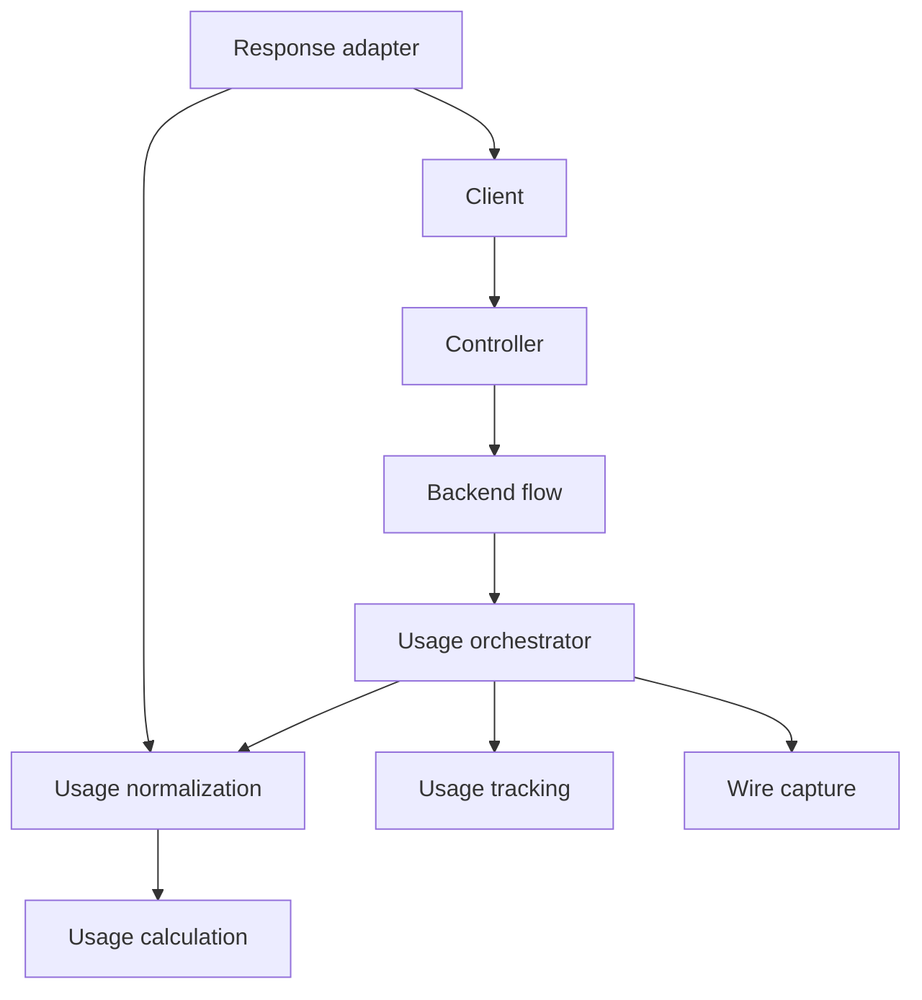
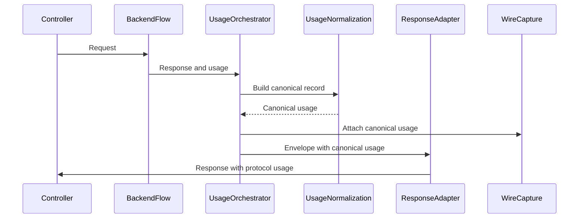
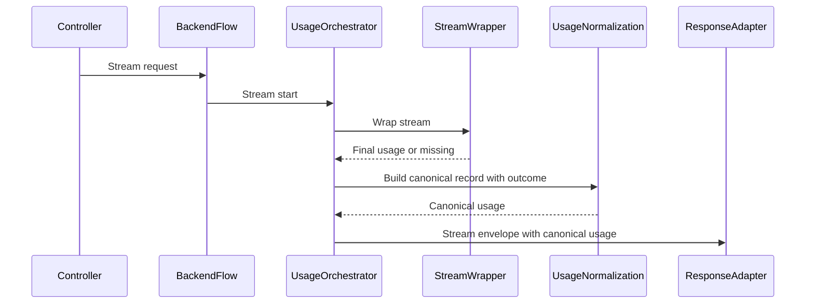

# Design Document

---
**Purpose**: Provide sufficient detail to ensure implementation consistency across different implementers, preventing interpretation drift.

**Approach**:
- Include essential sections that directly inform implementation decisions
- Omit optional sections unless critical to preventing implementation errors
- Match detail level to feature complexity
- Use diagrams and tables over lengthy prose

**Warning**: Approaching 1000 lines indicates excessive feature complexity that may require design simplification.

**Project Context**: Universal LLM Proxy - FastAPI async service with staged initialization, DI containers, adapter pattern for LLM backends.
---

> Sections may be reordered (e.g., surfacing Requirements Traceability earlier or moving Data Models nearer Architecture) when it improves clarity. Within each section, keep the flow **Summary -> Scope -> Decisions -> Impacts/Risks** so reviewers can scan consistently.

## Overview
The feature introduces a single, typed canonical usage record and centralizes normalization so usage output is consistent across protocols, streaming modes, and downstream integrations. It reduces duplication across translators, adapters, and services while preserving provider-specific usage extensions, explicit unavailability semantics, and explicit protocol mapping.

This design targets operators and integrators who need reliable usage reporting, as well as maintainers who need a DRY, predictable normalization path. It impacts response shaping, usage tracking hooks, and wire capture metadata without changing public response shapes.

### Goals
- Centralize usage normalization behind a single DI service and typed contract.
- Preserve provider extensions and explicit null semantics for unavailable fields.
- Emit canonical usage consistently for streaming and non-streaming responses.

### Non-Goals
- Database schema changes for persistent canonical usage storage.
- Reworking pricing or billing logic beyond normalization.
- Introducing new external dependencies.

## Requirements Traceability

| Requirement | Summary | Components | Interfaces | Flows |
|-------------|---------|------------|------------|-------|
| 1.1 | Canonical record produced | UsageNormalizationService, UsageAccountingOrchestrator | IUsageNormalizationService | Non streaming response flow |
| 1.2 | Canonical fields coverage | CanonicalUsageRecord | N/A | N/A |
| 1.3 | Total tokens derived | UsageNormalizationService | IUsageNormalizationService | Non streaming response flow |
| 1.4 | Null for unavailable | UsageNormalizationService | IUsageNormalizationService | Non streaming response flow |
| 1.5 | Request id from RequestContext | UsageNormalizationService | IUsageNormalizationService | Non streaming response flow |
| 1.6 | Request id from processing context | UsageNormalizationService | IUsageNormalizationService | Non streaming response flow |
| 1.7 | Provider identifier mapping | UsageNormalizationService | IUsageNormalizationService | Non streaming response flow |
| 1.8 | Model identifier mapping | UsageNormalizationService | IUsageNormalizationService | Non streaming response flow |
| 1.9 | Protocol openai mapping | ChatController, UsageNormalizationService | IUsageNormalizationService | Non streaming response flow |
| 1.10 | Protocol openai-responses mapping | ResponsesController, UsageNormalizationService | IUsageNormalizationService | Non streaming response flow |
| 1.11 | Protocol anthropic mapping | AnthropicController, UsageNormalizationService | IUsageNormalizationService | Non streaming response flow |
| 1.12 | Protocol gemini mapping | Gemini controller, UsageNormalizationService | IUsageNormalizationService | Non streaming response flow |
| 2.1 | Cross protocol consistency | UsageNormalizationService, Response adapters | IUsageNormalizationService | Non streaming response flow |
| 2.2 | Extensions container | CanonicalUsageRecord | N/A | N/A |
| 2.3 | Extensions preserved | UsageNormalizationService | IUsageNormalizationService | Non streaming response flow |
| 2.4 | Units and naming normalized | UsageNormalizationService | IUsageNormalizationService | Non streaming response flow |
| 3.1 | Streaming complete outcome | UsageTrackingWrapper, UsageNormalizationService | IUsageNormalizationService | Streaming completion flow |
| 3.2 | No final record mid stream | UsageTrackingWrapper, UsageAccountingOrchestrator | IUsageNormalizationService | Streaming completion flow |
| 3.3 | Incomplete outcome on abort | BackendCompletionFlow, UsageNormalizationService | IUsageNormalizationService | Streaming completion flow |
| 3.4 | Incomplete reason values | CanonicalUsageRecord | N/A | Streaming completion flow |
| 3.5 | Client disconnect reason | ResponsesController, UsageNormalizationService | IUsageNormalizationService | Streaming completion flow |
| 3.6 | Upstream cancelled reason | StreamingResponseEnvelope, UsageNormalizationService | IUsageNormalizationService | Streaming completion flow |
| 3.7 | Timeout reason mapping | StreamingErrorMapper, UsageNormalizationService | IUsageNormalizationService | Streaming completion flow |
| 3.8 | Backend error reason mapping | StreamingErrorMapper, UsageNormalizationService | IUsageNormalizationService | Streaming completion flow |
| 3.9 | Unknown reason fallback | UsageNormalizationService | IUsageNormalizationService | Streaming completion flow |
| 4.1 | Missing usage fails open | UsageNormalizationService | IUsageNormalizationService | Non streaming response flow |
| 4.2 | Structured warning context | UsageNormalizationService | IUsageNormalizationService | Non streaming response flow |
| 4.3 | Missing cost is null | UsageNormalizationService | IUsageNormalizationService | Non streaming response flow |
| 5.1 | Downstream exposure | UsageAccountingOrchestrator, WireCaptureOrchestrator | IUsageNormalizationService | Non streaming response flow |
| 5.2 | Protocol usage from canonical | Response adapters | IUsageNormalizationService | Non streaming response flow |
| 5.3 | Response shape preserved | Response adapters | N/A | Non streaming response flow |
| 5.4 | Do not overwrite with zero | Response adapters | IUsageNormalizationService | Non streaming response flow |
| 5.5 | Headers from canonical | UsageHeaderInjector | N/A | Non streaming response flow |
| 5.6 | Canonical usage in capture metadata | WireCaptureCoordinator, WireCaptureOrchestrator | IUsageNormalizationService | Non streaming response flow |

## Architecture

### Existing Architecture Analysis (if applicable)
- Usage normalization exists in translators, response adapters, and calculation services with overlapping rules.
- Usage tracking and streaming wrappers already capture usage but lack explicit completion outcomes.
- Response adapters currently inject usage and headers without a canonical usage contract.
- RequestContext carries request_id and processing_context values but does not standardize protocol mapping.

### Architecture Pattern & Boundary Map
**Architecture Integration**:
- Selected pattern: Service plus interface boundary to centralize normalization and keep DI wiring consistent.
- Domain boundaries: Canonical usage contract in `src/core/domain/` with a dedicated normalization service in `src/core/services/`.
- Existing patterns preserved: Adapter pattern in response adapters, DI container registration, staged initialization.
- New components rationale: One normalization service to remove drift; one canonical model to enforce null semantics and extensions.
- Wire capture integration: Canonical usage is added to capture metadata under canonical_usage without modifying client payloads.
- Steering compliance: DRY and SRP by consolidating usage normalization.



### Technology Stack & Alignment

| Layer | Choice / Version | Role in Feature | Notes |
|-------|------------------|-----------------|-------|
| Runtime | Python 3.10+ / FastAPI async | Core runtime | Keep async for all IO |
| Domain models | Pydantic v2 | Canonical usage contract | New canonical usage model |
| Services | DI container | Normalization boundary | Singleton service |
| Response adapters | FastAPI adapters | Protocol usage projection | Preserve response shape |
| Wire capture | CBOR capture | Canonical usage exposure | Optional, config driven |

## System Flows



Wire capture receives canonical usage through capture metadata only; client-facing payloads remain unchanged.



Incomplete reason mapping uses cancellation reason and error classification (see table below). Cancellation reason is sourced from streaming controllers when cancel callbacks are invoked.

| Signal Source | Condition | Incomplete Reason | Notes |
|--------------|-----------|-------------------|-------|
| RequestContext.processing_context.values.cancel_reason | client_disconnect | client_disconnect | Set by controller when client disconnect is detected |
| RequestContext.processing_context.values.cancel_reason | stream_cancelled or user_cancelled | upstream_cancelled | Explicit cancellation without error classification |
| UsageNormalizationContext.error_classification | timeout | timeout | Derived from StreamingErrorMapper APITimeoutError |
| UsageNormalizationContext.error_classification | backend_error or connection_error | backend_error | Derived from BackendError or APIConnectionError |
| Default | none of the above | unknown | Fallback when no signal is available |

## Components & Interface Contracts

**DI Registration Strategy**:
- UsageNormalizationService: Singleton, `IUsageNormalizationService` -> `UsageNormalizationService`.

| Component | Layer | Intent | Req Coverage | DI Lifetime | Contracts |
|-----------|-------|--------|--------------|-------------|-----------|
| UsageNormalizationService | `src/core/services/` | Canonical usage normalization | 1.1, 1.2, 1.3, 1.4, 1.5, 1.6, 1.7, 1.8, 1.9, 1.10, 1.11, 1.12, 2.1, 2.2, 2.3, 2.4, 3.1, 3.2, 3.3, 3.4, 3.5, 3.6, 3.7, 3.8, 3.9, 4.1, 4.2, 4.3, 5.1, 5.2, 5.3, 5.4, 5.5, 5.6 | Singleton | IUsageNormalizationService |
| UsageAccountingOrchestrator | `src/core/services/backend_completion_flow/` | Attach canonical usage to responses | 1.1, 3.1, 3.2, 3.3, 3.4, 5.1 | Existing | Service |
| Response adapters | `src/core/transport/fastapi/` | Project canonical usage to protocol usage and headers | 2.1, 2.2, 2.3, 2.4, 5.2, 5.3, 5.4, 5.5 | Existing | Middleware |
| WireCaptureOrchestrator | `src/core/services/backend_completion_flow/` | Persist canonical usage in captures | 5.1, 5.6 | Existing | Service |
| UsageTrackingWrapper | `src/core/services/` | Streaming completion and outcome data | 3.1, 3.2, 3.3, 3.4 | Existing | Service |

### Controllers Layer (`src/core/app/controllers/`)

#### Protocol Tagging (Chat, Responses, Anthropic, Gemini)

| Field | Detail |
|-------|--------|
| Intent | Stamp protocol identifiers onto RequestContext for normalization |
| Requirements | 1.9, 1.10, 1.11, 1.12 |
| Integration | `fastapi_to_domain_request_context` call sites in controllers |

**Responsibilities & Constraints**
- Set `RequestContext.extensions.protocol` to openai in ChatController, openai-responses in ResponsesController, anthropic in AnthropicController, and gemini in Gemini endpoints.
- Avoid inference from URL or headers; controller knows the protocol surface.

**Implementation Notes**
- For streaming controllers, when invoking cancellation callbacks, set `RequestContext.processing_context.values.cancel_reason` to client_disconnect or stream_cancelled.

### Services Layer (`src/core/services/`)

#### UsageNormalizationService

| Field | Detail |
|-------|--------|
| Intent | Centralize usage normalization into canonical record |
| Requirements | 1.1-5.6 |
| Interface | `IUsageNormalizationService` in `src/core/interfaces/` |
| DI Lifetime | Singleton |

**Responsibilities & Constraints**
- Produce `CanonicalUsageRecord` from backend usage and request context.
- Preserve provider extensions and set null for unavailable canonical fields.
- Merge canonical usage into protocol usage without overwriting existing values with zeroes.
- Resolve request_id precedence: RequestContext.request_id, then RequestContext.processing_context.values.request_id, else null.
- Map protocol to openai, openai-responses, anthropic, or gemini based on the handling controller.
- Map incomplete reasons based on streaming cancellation signals and error classifications.
- Provide capture-only metadata payloads without altering client response shapes.

**Dependencies (via DI)**
| Dependency | Direction | Criticality | Notes |
|------------|-----------|-------------|-------|
| UsageCalculationService | Outbound | P1 | Recalculation and token derivation |
| RequestContext | Inbound | P1 | Request id, processing context values, protocol, modification tracker |
| ResponseEnvelope | Inbound | P2 | Usage and metadata inputs |

**Contracts**: Service [x] / Event [ ] / Middleware [ ]

##### Service Interface
```python
from abc import ABC, abstractmethod

from src.core.domain.usage_canonical_record import CanonicalUsageRecord
from src.core.domain.usage_normalization_context import UsageNormalizationContext
from src.core.domain.usage_payload import UsagePayload
from src.core.domain.usage_summary import UsageSummary

class IUsageNormalizationService(ABC):
    @abstractmethod
    async def build_canonical_record(
        self,
        *,
        context: UsageNormalizationContext,
        usage: UsageSummary | None,
        raw_usage: UsagePayload | None,
    ) -> CanonicalUsageRecord:
        """Return canonical usage with nulls for unavailable fields."""
        ...

    @abstractmethod
    def project_protocol_usage(
        self,
        *,
        canonical: CanonicalUsageRecord,
        existing: UsagePayload | None,
    ) -> UsagePayload | None:
        """Merge canonical usage into protocol payload without overwriting with zeros."""
        ...
```
- Preconditions: Context includes backend type and model when known; protocol is provided by controllers when available.
- Postconditions: Canonical record contains nulls for unavailable fields and preserves extensions.
- Invariants: Extensions are stored only under the extensions container.

##### DI Registration (in CoreServices stage)
```python
def _factory(provider: IServiceProvider) -> UsageNormalizationService:
    calc = provider.get_required_service(UsageCalculationService)
    return UsageNormalizationService(calc)

services.add_singleton(IUsageNormalizationService, implementation_factory=_factory)
```

**Implementation Notes**
- Integration: UsageAccountingOrchestrator and response adapters call the service instead of local normalization.
- Validation: Convert malformed usage to null fields and log structured warnings with context keys.
- Protocol mapping: Controllers set RequestContext.extensions.protocol to openai, openai-responses, anthropic, or gemini; normalization uses that value or null.
- Risks: Incomplete caller context can lead to missing request id or protocol metadata.

## Data Models

### Domain Model (`src/core/domain/`)

**CanonicalUsageRecord** (Pydantic model)
| Field | Type | Notes |
|-------|------|-------|
| provider_id | str or null | Response metadata backend or RequestContext.backend |
| model_id | str or null | Response metadata model or RequestContext.effective_model |
| request_id | str or null | RequestContext.request_id then processing_context.values.request_id |
| protocol | str or null | openai, openai-responses, anthropic, gemini |
| prompt_tokens | int or null | Null when unavailable |
| completion_tokens | int or null | Null when unavailable |
| total_tokens | int or null | Sum when both prompt and completion are available |
| cost | float or null | Null when unavailable |
| completion_outcome | UsageCompletionOutcome or null | complete or incomplete |
| incomplete_reason | UsageIncompleteReason or null | Set only when incomplete |
| extensions | dict of JsonValue | Provider specific usage details |

**UsagePayload** (Pydantic model)
- payload (dict of JsonValue)

**UsageCompletionOutcome** (Enum)
- complete
- incomplete

**UsageIncompleteReason** (Enum)
- client_disconnect
- backend_error
- timeout
- upstream_cancelled
- unknown

**UsageNormalizationContext**
- request_id
- protocol
- backend_type
- model
- is_streaming
- completion_outcome
- incomplete_reason
- cancel_reason
- error_classification
error_classification values: timeout, backend_error, connection_error, unknown (derived from StreamingErrorMapper).

### DTOs and Envelopes (`src/core/domain/responses.py`)
- Add `canonical_usage: CanonicalUsageRecord | None` to `ResponseEnvelope` and `StreamingResponseEnvelope` for cross layer propagation.
- Preserve existing `usage: UsageSummary | None` for protocol compatibility.
- Wire capture metadata includes `canonical_usage` for capture entries; client payloads are not modified.

### Wire Capture Metadata Extension
- CBOR capture metadata adds optional key `cu` for canonical usage; inspection tools expose it as `canonical_usage`.
- Buffered JSON capture uses metadata key `canonical_usage` directly.
- Unknown keys remain ignored by legacy readers to preserve backward compatibility.

### Configuration Model (`src/core/config/`)
- No new configuration fields are required.

## Error Handling

### Error Hierarchy
All errors extend `LLMProxyError` from `src/core/common/exceptions.py`.

### Error Strategy
- Fail open when usage data is missing or malformed.
- Log structured warnings with keys: request_id, backend_type, model, protocol, error_class.
- Do not raise new error types for normalization failures.

## Testing Strategy

### Unit Tests (`tests/unit/`)
- UsageNormalizationService normalization and extension preservation.
- Protocol usage projection without overwriting with zeros.
- Outcome and incomplete reason handling for streaming.
- Request identifier precedence resolution.
- Protocol mapping from controller context.

### Integration Tests (`tests/integration/`)
- Backend completion flow emits canonical usage in envelopes.
- Response adapters apply canonical usage to payloads and headers.
- Wire capture metadata includes canonical_usage when enabled.

### Property Tests (`tests/property/`)
- Invariants: total tokens equals sum when inputs available, extensions preserved.

## Optional Sections (include when relevant)

### Security Considerations
- Do not log raw API keys or request content in canonical usage logs.
- Validate extension keys to avoid untrusted field injection into logs.

### Performance & Scalability
- Normalization must add minimal overhead and no network calls.
- Streaming completion must only compute canonical usage once per stream.

### Stage Registration
- Register `UsageNormalizationService` in Core Services stage for availability to backend and controller layers.
- No changes to stage ordering required.

## Supporting References (Optional)
- None. All decisions are captured in the main body and `research.md`.
