# Design Document

## Overview

This feature delivers dynamic, backend-agnostic model routing for the Universal LLM Proxy while preserving explicit backend addressing. Clients may request models as `model` or `vendor/model`, and the proxy selects an eligible backend instance at runtime using configured policies and runtime availability state. Explicit backend addressing remains supported via `backend:model` and `backend-instance:model`.

The design introduces a dedicated routing layer that unifies:
- model addressing semantics (backend selection uses `:` only)
- URI-like model-selector parameter parsing and propagation (`model?key=value`)
- capability discovery (which instances can serve which models)
- availability filtering (rate limits, auth disablement, model-not-found)
- consistent selection and failover behavior
- session-aware identity handling for B2BUA mode (A-leg continuity, B-leg outbound identity)
- hierarchical composition with connector-internal schedulers (for example account rotation/hold in `gemini-oauth-auto`)

### Goals
- Provide unambiguous model addressing across the entire proxy (API, config, session commands).
- Treat URI-like model-selector parameters as first-class routing inputs across all routing modes.
- Support model-only routing (`model`, `vendor/model`) to dynamically pick an eligible backend instance.
- Support user-configurable preference ordering (including cost-based and priority-based policies) for model-only multi-candidate routing.
- Support backend routing (`backend:model`) with default Round Robin across instances.
- Support explicit instance routing (`backend-instance:model`) without load balancing.
- Integrate runtime availability state to avoid wasting attempts on unavailable targets.
- Expose backend-agnostic model lists and routing diagnostics.
- Unify all outbound LLM call types behind one standardized routing entry point (regular, replacement, quality verifier, auxiliary).
- Preserve connector autonomy for internal provider-identity scheduling while keeping proxy-level routing behavior deterministic.
- Enforce single-instance proxy policy for self-managed OAuth connector families that already perform internal credential/account scheduling.

### Non-Goals
- Persisting routing/capability state across process restarts (in-memory only).
- Introducing new external dependencies for routing or locking.
- Automatic semantic normalization of vendor names across unrelated providers (e.g., mapping aliases like `google` vs `gemini` beyond the existing alias system).
- Full removal of legacy routing behavior in a single release; migration is additive and guarded by validation and compatibility rules.

## Architecture

### Existing Architecture Analysis

Relevant existing components:
- Target resolution has moved into `BackendModelResolver` and `BackendRoutingService`.
- Execution orchestration is now split across `BackendCompletionFlow` collaborators (`BackendRequestPreparer`, `BackendAvailabilityChecker`, `CompletionSessionResolver`, `FailureRecoveryExecutor`, etc.).
- Request orchestration was refactored into decomposed `RequestProcessor` phases (`ISessionEnricher`, `IBackendPreparer`, `IBackendExecutor`, ...).
- B2BUA mode introduced A-leg/B-leg identity semantics via `B2BUASessionResolver`, `B2buaIdentity`, and B-leg allocation in `BackendCompletionFlow`.
- Resilience availability checks now use scoped instance keys via `resilience.scope.build_resilience_instance_id(...)`.
- `/v1/models` and `/v1/diagnostics` remain operational but still reflect mixed legacy/backend-prefixed model views in parts of the stack.

Observed gaps relative to requirements:
- No single capability index abstraction is used end-to-end for both request-path routing and `/v1/models` output.
- Unknown-model vs temporarily-unavailable classification is not yet consistently surfaced across all routing paths.
- B2BUA identity constraints are handled in execution flow but are not explicitly captured in this spec's previous routing architecture.
- Current backend instance discovery/validation does not uniformly enforce "max one proxy instance" for all self-managed OAuth connector families.

### Architecture Pattern & Boundary Map

Selected pattern: **Resolver-Centric Hierarchical Routing + Capability Index + Session-Aware Execution Flow**.

Rationale:
- Aligns with post-refactor decomposition instead of re-introducing monolithic routing logic.
- Keeps model parsing/selection in resolver/routing boundaries and execution side effects in completion-flow collaborators.
- Preserves B2BUA A-leg/B-leg guarantees while adding model-only routing and availability intelligence.
- Preserves connector-internal autonomy (account rotation/affinity/hold) behind stable connector boundaries.

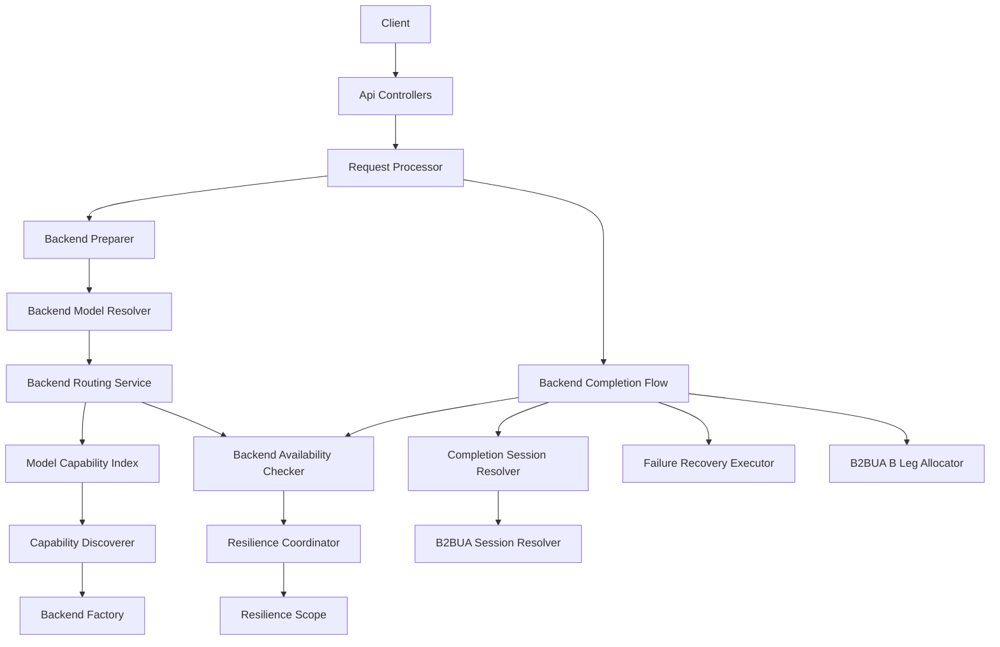

Boundary ownership:
- **BackendModelResolver** owns target resolution order (session hints, aliases, parsing, routing service lookup, static overrides).
- **Routing parameter propagation contract** (implemented in resolver + request synchronization boundary) owns parsing, precedence, and inheritance of URI-like model parameters.
- **BackendRoutingService** owns explicit-instance selection, backend-type round robin, and model-name discovery policy gates.
- **Unified routing entry point method** (implemented in resolver/routing boundary) is mandatory for any outbound inference call, including non-primary call types.
- **ModelCapabilityIndex** (new/extended) owns read-optimized `model -> candidate instances` state for request-path selection and model listing.
- **BackendAvailabilityChecker + ResilienceCoordinator** own candidate eligibility checks and cooldown/disablement gating for both selection-time filtering and pre-dispatch rechecks.
- **BackendReactivationControl** owns explicit reactivation lifecycle for permanently disabled instances and corresponding audit/diagnostic updates.
- **BackendCompletionFlow + CompletionSessionResolver + B2BUA collaborators** own session-safe execution semantics and outbound identity isolation.
- **CommandRoutingValidator** owns interactive-command routing input validation using the same parser/validation contracts as API/config paths.
- **Connector-internal scheduler boundary** (for example `gemini-oauth-auto` account selector) owns sub-resource/account-level rotation, temporary hold/wait, and provider identity selection.
- **Backend instance policy validator boundary** owns connector-family instance-count constraints and produces configuration-time validation failures.

### Technology Stack & Alignment

| Layer | Choice / Version | Role in Feature | Notes |
|------|------------------|-----------------|-------|
| Runtime | Python 3.10+ | In-memory routing state | Avoid blocking I/O on request path |
| API | FastAPI (async) | Entry points (`/v1/chat/completions`, `/v1/models`, diagnostics) | Routing must not block the event loop |
| DI Container | `ServiceCollection` | Register routing/index services | Must pass DI scanner |
| Initialization | Staged init + DI services module | Startup discovery | Best-effort, non-fatal |
| Resilience | `ResilienceCoordinator` | Cooldowns + disablement | Extended with model-not-found handler |

## System Flows

### Flow 1: Request Routing Selection

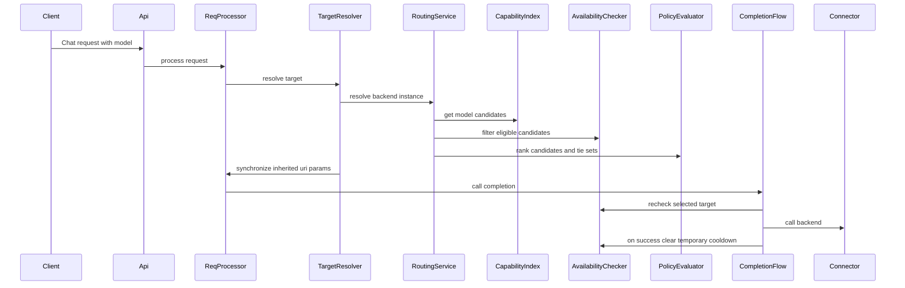

Key decisions:
- Selection is performed before any backend call to avoid wasted attempts.
- Availability filtering occurs before selection, with a pre-dispatch recheck to handle races.
- Errors distinguish “unknown model” (no candidates) vs “temporarily unavailable” (candidates exist but none eligible).
- Successful calls clear temporary cooldown for the selected `(instance, model)` without clearing permanent unsupported/disabled state.
- URI-like model parameters are inherited across selection/failover and materialized into outbound connector request parameters.
- Route parsing treats suffixes like `vendor/model:free` as model payload (model-only mode), while `backend:vendor/model:free` remains explicit backend mode.
- Preference policy ranking is applied for model-only multi-candidate routing; if absent, default selection is Round Robin.
- Equivalent-score candidates (for example equal cost) are selected via deterministic Round Robin.
- Failover stays within highest-preference equivalent set first, then proceeds to lower-preference sets.

### Flow 2: Startup Capability Discovery

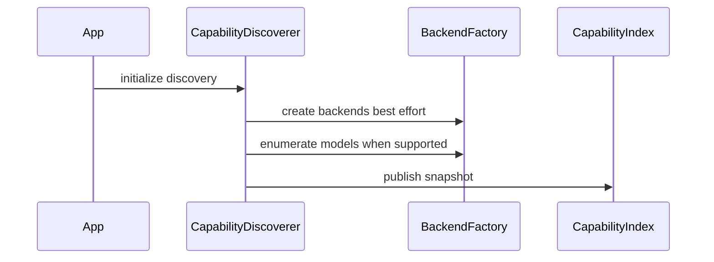

Key decisions:
- Discovery failures do not block startup; config hints are used as fallback input.
- Index updates are copy-on-write and safe under concurrency.

Capability refresh control-plane policy:
- Startup refresh: execute one best-effort refresh during initialization.
- Periodic refresh: optional scheduler with configurable interval; at most one refresh in-flight at a time.
- On-demand refresh: administrative trigger allowed, serialized with periodic refresh using the same lock.
- Failure handling: retain last known-good snapshot, emit diagnostics, and apply bounded backoff before next automatic retry.
- Consistency guarantee: readers always observe a complete immutable snapshot (old or new), never partial state.

## Requirements Traceability

| Requirement | Summary | Components | Interfaces | Flows |
|-------------|---------|------------|------------|-------|
| 1.1, 1.2, 1.3, 1.4, 1.5, 1.6, 1.7 | Unambiguous model addressing | `parse_model_backend`, `BackendModelResolver`, `BackendRoutingService` | `IBackendModelResolver` | Flow 1 |
| 2.1, 2.2, 2.3, 2.4 | `backend:model` round robin and availability gating | `BackendRoutingService`, `BackendAvailabilityChecker`, `FailureRecoveryExecutor` | `IBackendAvailabilityChecker` | Flow 1 |
| 3.1, 3.2, 3.3, 3.4 | Model-only routing and policy controls | `BackendRoutingService`, `BackendModelResolver`, `ModelCapabilityIndex` | `IBackendModelResolver` | Flow 1 |
| 4.1, 4.2, 4.3, 4.4, 4.5, 4.6 | Runtime availability state integration | `BackendAvailabilityChecker`, `ResilienceCoordinator`, `ProviderErrorClassifier`, model-support state store, reactivation control | `IResilienceCoordinator` | Flows 1, 8 |
| 5.1, 5.2, 5.3, 5.4, 5.5 | Capability discovery and indexing | `ModelCapabilityDiscoverer`, `ModelCapabilityIndex`, models listing integration | `IModelCapabilityDiscoverer`, `IModelCapabilityIndex` | Flow 2 |
| 6.1, 6.2, 6.3 | Observability and error differentiation | `ModelsController`, `DiagnosticsController`, `ProviderErrorClassifier`, routing error adapters, reactivation audit events | N/A | Flows 1, 2, 8 |
| 7.1, 7.2, 7.3, 7.4 | Performance/concurrency/safety | snapshot index, bounded failover attempts | `IBackendCompletionFlow` | Flow 1 |
| 8.1, 8.2, 8.3, 8.4 | Compatibility and migration validation | parser + config validators + command routing validator | N/A | Flows 1, 7 |
| 9.1, 9.2, 9.3, 9.4, 9.5 | Session-aware routing and B2BUA isolation | `B2BUASessionResolver`, `CompletionSessionResolver`, `BackendCompletionFlow`, B-leg allocator | `ICompletionSessionResolver` | Flow 3 |
| 10.1, 10.2, 10.3, 10.4, 10.5, 10.6 | Project-wide routing unification across all outbound call types | `BackendModelResolver`, `BackendRoutingService`, replacement flow, quality verifier flow, auxiliary flow, CI compliance gate | `IBackendModelResolver` | Flows 1, 4 |
| 11.1, 11.2, 11.3, 11.4, 11.5 | Connector autonomy and hierarchical routing composition | proxy routing boundary + connector-internal scheduler boundary | connector contract boundary | Flows 4, 5 |
| 12.1, 12.2, 12.3, 12.4, 12.5 | Single-instance policy for self-managed OAuth connectors | backend instance policy validator, backend instance discovery, routing policy guards | config validation boundary | Flows 1, 6 |
| 13.1, 13.2, 13.3, 13.4, 13.5 | First-class URI parameter routing and inheritance | `BackendModelResolver`, request synchronization, completion dispatch, connector adapters | `IBackendModelResolver` | Flows 1, 4, 9 |
| 14.1, 14.2, 14.3, 14.4, 14.5, 14.6, 14.7 | User-configurable preference ordering for multi-candidate model routing | `BackendRoutingService`, preference policy evaluator, diagnostics routing metadata | preference policy contract | Flows 1, 10 |

## Components and Interfaces

### Components Summary

| Component | Layer | Intent | Req Coverage | DI Lifetime | Contracts |
|----------|-------|--------|--------------|-------------|----------|
| BackendModelResolver | core services | Resolve effective backend/model target, URI params, and synchronize request payload | 1, 2, 3, 8, 10, 13 | Singleton | `IBackendModelResolver` |
| BackendRoutingService | core services | Explicit instance routing, backend RR, model discovery, and preference-policy ranking | 1, 2, 3, 7, 12.4, 14 | Singleton | Internal service |
| RoutingPreferencePolicyEvaluator | core services | Evaluate policy-based candidate ordering (cost/priority) and tie sets | 14 | Singleton | preference policy contract |
| ModelCapabilityIndex | core services | Read-optimized model-to-candidate snapshot index | 3, 5, 7 | Singleton | `IModelCapabilityIndex` |
| ModelCapabilityDiscoverer | core services | Build/refresh capability index from connector enumeration and config hints | 5 | Singleton | `IModelCapabilityDiscoverer` |
| ProviderErrorClassifier | core services | Normalize provider-specific failures into canonical routing categories | 4, 6 | Singleton | `IProviderErrorClassifier` |
| BackendAvailabilityChecker | completion-flow collaborator | Evaluate candidate eligibility against lifecycle + resilience state | 2, 4, 7 | Singleton | `IBackendAvailabilityChecker` |
| ModelSupportState | core services | Track permanent unsupported `(instance, model)` pairs for future filtering | 4 | Singleton | `IModelSupportState` |
| BackendReactivationControl | control-plane | Reactivate permanently disabled backend instances with explicit state transitions and diagnostics updates | 4, 6 | Singleton | control-plane contract |
| CompletionSessionResolver | completion-flow collaborator | Resolve session identity for backend calls with B2BUA-aware behavior | 9 | Singleton | `ICompletionSessionResolver` |
| BackendCompletionFlow | core orchestration | Execute attempts with bounded failover, usage, captures, identity-safe dispatch, and parameter inheritance | 2, 4, 7, 9, 10, 11, 13, 14.4 | Singleton | `IBackendCompletionFlow` |
| CommandRoutingValidator | command pipeline | Apply API-equivalent routing parsing/validation semantics to interactive command inputs | 8 | Singleton | command validation contract |
| Connector Internal Scheduler (e.g., Gemini OAuth Auto account selector) | connector-internal | Select provider identity/account and optional hold/wait behavior within one connector instance | 11 | Connector-owned | connector implementation contract |
| Backend Instance Policy Validator | config/validation | Enforce connector-family instance-count constraints and fail fast on invalid multi-instance configs | 12 | Startup-time service | config semantic validation contract |

### Unified Routing Entry Point

The implementation shall provide one standardized routing function/method in the routing boundary and require all outbound inference paths to use it.

Required adoption scope:
- Primary request routing.
- Random Model Replacement backend calls.
- Quality Verifier backend calls.
- Auxiliary backend calls (title generation, summarization, and similar sidecar calls).

Ingress routing contract:
- Every inference ingress surface (OpenAI-compatible chat, OpenAI-compatible responses, Anthropic-compatible messages, Gemini-compatible routes, and internal sidecar inference entry points) must resolve backend/model via the shared routing entry point before dispatch.
- Protocol adapters may transform request/response envelopes, but must not bypass shared routing semantics.
- Model replacement, verifier, and auxiliary planners are applied before dispatch and still route through the same resolver contract.

Behavioral contract:
- Resolve backend/model using the same addressing semantics and policy gates.
- Apply the same availability and resilience filtering rules.
- Parse and propagate URI-like model selector parameters as first-class inputs.
- Preserve session/B2BUA identity safety constraints for each call type.
- Emit comparable diagnostics/error classification metadata across all call categories.
- Stop at connector-instance boundary; do not reimplement connector-internal account scheduling in proxy services.

URI parameter propagation contract:
- Parse query-like parameter suffix from model selectors for all routing modes (`backend:model?x=y`, `backend-instance:model?x=y`, `model?x=y`, `vendor/model?x=y`).
- Routing-mode disambiguation is performed on route portion before query parsing (`<route>?<params>`), so selectors like `vendor/model:free?temperature=0.5` remain model-only.
- Preserve parsed parameters across candidate expansion, selection, retry, and failover for one logical request.
- Merge precedence: connector-enforced hardcoded/forced settings > explicit request parameter fields > URI-like model parameters > defaults.
- Request synchronization must provide inherited parameters to connector-facing request payloads, unless overridden by connector-enforced settings.

Composition rules:
- Proxy level decides connector instance + effective model contract.
- Connector level may decide provider account/identity and temporary hold/wait semantics.
- Proxy failover/cancellation limits still apply at request orchestration boundaries.
- Connector-internal decisions must surface enough metadata for observability without leaking credentials.
- Constrained self-managed OAuth connector families are resolved as single proxy instances and never proxy load-balanced across sibling instances.

Verification guardrails:
- Mandatory CI gate `routing-unification-compliance` executes required bypass-detection checks for outbound inference paths.
- Gate failure blocks merge for routing-related changes.
- Local developer workflow runs the same compliance checks pre-PR to reduce CI churn.

Compliance gate specification:
- Authoritative outbound call-surface inventory includes: primary request execution, Random Model Replacement, Quality Verifier, and auxiliary/sidecar inference calls.
- Static inspection rule: fail if outbound inference invocation sites bypass the shared routing entry point outside explicitly allowed adapter boundaries.
- Runtime contract rule: fail if any inventoried call surface executes without invoking the shared routing entry point.
- Drift prevention rule: auto-discover outbound inference call sites and fail if discovered sites are missing from the registered inventory.
- CI wiring: `routing-unification-compliance` is a required status check for merge on routing-related changes.
- Ownership: backend platform maintainers own the inventory list and update gate rules when new outbound call surfaces are introduced.

CI enforcement contract:
- Required status check identifier: `routing-unification-compliance`.
- Check implementation: one dedicated CI job with the same identifier that executes static + runtime bypass checks.
- Source-of-truth inventory artifact: `dev/routing/unified_routing_inventory.yaml` (single authoritative list of outbound call surfaces).
- Auto-discovery artifact: generated call-site inventory compared against source-of-truth inventory; mismatch is a hard failure.
- Branch protection policy must require this status check for merges touching outbound inference paths.
- Ownership: backend platform maintainers update inventory and gate rules when adding/removing call surfaces.

### Services Layer

#### BackendModelResolver

| Field | Detail |
|-------|--------|
| Intent | Resolve effective target (`backend`, `model`, `uri_params`) and keep request/extra_body synchronized |
| Requirements | 1.1, 1.2, 1.4, 1.5, 1.6, 1.7, 2.1, 2.2, 3.1, 3.4, 8.1, 8.2, 8.3, 10.1, 10.2, 10.3, 10.4, 13.1, 13.2, 13.5 |
| Interface | `IBackendModelResolver` |
| Inputs | request model string, optional backend hints from session/extra_body, routing policy state |
| Outputs | `BackendTarget` |

Interface contract:
- `resolve_target(request, context) -> BackendTarget`
- `synchronize_request_with_target(request, target) -> ChatRequest`

Behavioral rules:
- Applies aliases before backend parsing.
- Parses URI-like model-selector parameters and stores them in target metadata.
- Uses `:` as backend selector separator only when it appears before the first `/` in route portion.
- If first `:` appears after `/`, treats it as model identifier content (for example `vendor/model-name:free`).
- Delegates selection/discovery behavior to `BackendRoutingService`.
- Applies static route overrides after parsing and discovery.
- Preserves URI parameter set across candidate expansion and selected backend target materialization.
- Serves as the mandatory shared routing entry point for all outbound inference call categories.

#### BackendRoutingService

| Field | Detail |
|-------|--------|
| Intent | Resolve backend-instance target for explicit backend selectors and model-only requests |
| Requirements | 1.3, 2.1, 2.2, 2.3, 2.4, 3.1, 3.2, 3.3, 3.4, 7.2, 12.4, 14.1, 14.3, 14.5 |
| Interface | Internal service |

Key rules:
- `backend-instance:model` routes directly and never load-balances.
- `backend:model` round-robins across configured backend instances.
- `model` or `vendor/model` discovers candidates, applies policy gates, then applies preference-policy ranking when configured.
- If no preference policy is configured for model-only routing, default to Round Robin across eligible candidates.
- If multiple candidates have equivalent effective preference score, select with deterministic Round Robin within that equivalent set.
- Selection state remains concurrency-safe (lock-protected counters).

#### RoutingPreferencePolicyEvaluator

| Field | Detail |
|-------|--------|
| Intent | Evaluate configured preference policy for multi-candidate model-only routing |
| Requirements | 14.1, 14.2, 14.3, 14.5, 14.6, 14.7 |
| Interface | Preference policy contract |

Policy options:
- Cost-based preference.
- Explicit priority-based preference.

Tie and fallback rules:
- Equal effective score candidates form one equivalent set.
- Equivalent-set selection uses deterministic Round Robin.
- Missing cost/priority metadata uses deterministic fallback values defined by policy configuration.

Scope resolution rules:
- Resolve policy using deterministic precedence: model-pattern override > backend-family override > global default.
- If multiple model-pattern rules match, apply deterministic most-specific rule.

#### ModelCapabilityIndex and ModelCapabilityDiscoverer

| Field | Detail |
|-------|--------|
| Intent | Maintain capability snapshots for request-path candidate lookup and `/v1/models` canonical output |
| Requirements | 3.1, 3.2, 5.1, 5.2, 5.3, 5.4, 5.5, 7.3 |
| Interface | `IModelCapabilityIndex`, `IModelCapabilityDiscoverer` |

Data model (logical):
- `model_to_instances: dict[str, frozenset[str]]`
- `instance_to_models: dict[str, frozenset[str]]`

Normalization rules:
- Canonical identifiers are backend-agnostic `vendor/model` where known.
- Legacy keys may be retained as compatibility aliases only.
- Backend-prefixed `backend:model` identifiers are never the canonical index key.
- Alias and normalization collisions (`model` vs `vendor/model`) use deterministic tie-breaking rules with explicit diagnostics.

Deterministic normalization pipeline:
1. Source precedence: connector enumeration (authoritative) > validated config hints > compatibility aliases.
2. Alias resolution order: global aliases, then backend-scoped aliases, then identity fallback.
3. Canonicalization: normalize to `vendor/model` when determinable; preserve plain `model` as compatibility alias only.
4. Collision handling: prefer authoritative source; otherwise apply stable lexical tie-break on candidate instance ids and emit diagnostics.
5. Refresh merge semantics: publish generation-tagged copy-on-write snapshots where equivalent inputs produce equivalent snapshots; on refresh failure, retain last known-good snapshot.

#### BackendAvailabilityChecker

| Field | Detail |
|-------|--------|
| Intent | Enforce availability gating during candidate selection and prior to backend call dispatch |
| Requirements | 2.3, 2.4, 4.1, 4.2, 4.3, 4.4, 4.5, 7.1, 7.2 |
| Interface | `IBackendAvailabilityChecker` |

Checks:
1. Permanent backend disablement.
2. Scoped resilience availability (`instance`, `(instance, model)`).
3. Permanent unsupported `(instance, model)` via `ModelSupportState`.
4. Cooldown-derived rejection with retry metadata.

Success-state transition:
- On successful backend completion, clear temporary cooldown for the selected `(instance, model)`.
- Do not clear permanent unsupported/permanent disabled state during success recovery.
- Emit transition diagnostics for recovered-capacity visibility.

#### ModelSupportState

| Field | Detail |
|-------|--------|
| Intent | Persist permanent unsupported model facts for specific `(instance, model)` pairs |
| Requirements | 4.4, 4.5 |
| Interface | `IModelSupportState` |

Rules:
- Updated only from normalized classification outcomes produced by `IProviderErrorClassifier`.
- Read on request path during candidate filtering.
- Supports explicit reset hooks for administrative recovery scenarios.

#### ProviderErrorClassifier

| Field | Detail |
|-------|--------|
| Intent | Provide deterministic normalization of provider-specific error payloads |
| Requirements | 4.4, 4.5, 6.3 |
| Interface | `IProviderErrorClassifier` |

Contract:
- Input: raw provider error metadata + protocol adapter context.
- Output: canonical category/code (`unknown_model`, `temporarily_unavailable`, `unsupported_on_instance`, `policy_rejected`) and retryability flag.
- Precedence: explicit permanent model-not-found signals override temporary availability signals.
- Invariant: `ModelSupportState` writes occur only from classifier outputs marked as permanent unsupported.

#### BackendReactivationControl

| Field | Detail |
|-------|--------|
| Intent | Provide explicit reactivation lifecycle for permanently disabled backend instances |
| Requirements | 4.3, 6.2 |
| Interface | Control-plane contract |

Rules:
- Accept explicit reactivation commands for a target backend instance.
- Validate target instance identity and transition state from permanently disabled to active.
- Preserve other state dimensions unless explicitly requested (for example, do not implicitly clear unsupported-model state).
- Emit audit and diagnostics events for each reactivation transition.

#### CompletionSessionResolver and B2BUA collaborators

| Field | Detail |
|-------|--------|
| Intent | Preserve A-leg continuity while ensuring outbound backend attempts use B-leg identity when required |
| Requirements | 9.1, 9.2, 9.3, 9.4, 9.5 |
| Interface | `ICompletionSessionResolver` |

Rules:
- In B2BUA mode, request-provided session ids are not authoritative for continuity.
- A-leg identity is used for internal session loading and continuity.
- Per-attempt B-leg identity is allocated for outbound connector calls.
- Fail-open behavior preserves request execution while avoiding identity leakage.

Auxiliary identity isolation contract:
- Inputs: canonical A-leg identity, auxiliary call category/purpose, and attempt ordinal.
- Output: deterministic derived auxiliary effective session identity isolated from primary continuity state.
- Invariants: auxiliary identities never mutate primary session continuity and are not reused across independent auxiliary operations.
- Failure behavior: identity derivation failures follow fail-open handling without leaking primary internal identity fields.

Fail-open fallback policy:
- If auxiliary/B-leg identity derivation fails, connector-facing `session_id` is omitted when the connector/protocol allows omission.
- If connector/protocol requires non-empty session identity, use an opaque surrogate token that contains no reversible A-leg/internal identity material.
- Fallback choice is deterministic by connector capability contract (omit if allowed, surrogate otherwise).

#### CommandRoutingValidator

| Field | Detail |
|-------|--------|
| Intent | Enforce API-equivalent parser and validation semantics for interactive command routing/model inputs |
| Requirements | 8.1, 8.2, 8.3, 8.4 |
| Interface | Command pipeline contract |

Rules:
- Reuse canonical model parsing and backend-addressing validation rules from API/config paths.
- Reject ambiguous legacy syntax where explicit backend selection is required.
- Route validated command-derived inference calls through the shared routing entry point.

#### Connector Internal Scheduler Boundary

| Field | Detail |
|-------|--------|
| Intent | Encapsulate provider-account selection, internal round robin/affinity, and bounded hold/wait behavior within connector implementation |
| Requirements | 11.1, 11.2, 11.3, 11.4, 11.5 |
| Interface | Connector implementation contract |

Rules:
- Proxy routing selects connector instance/model and does not perform account-level scheduling for autonomous connectors.
- Connector-level scheduler may rotate or wait across provider identities/accounts when rate limited.
- Proxy orchestration enforces top-level cancellation/timeouts/failover boundaries around connector call lifecycle.
- Diagnostics separate proxy routing metadata from connector scheduler metadata and redact credential-bearing fields.

#### Backend Instance Policy Validator Boundary

| Field | Detail |
|-------|--------|
| Intent | Prevent invalid multi-instance proxy configurations for self-managed OAuth connector families |
| Requirements | 12.1, 12.2, 12.3, 12.4, 12.5 |
| Interface | Config semantic validation boundary |

Rules:
- Maintain one central constrained-family set (for example `gemini-oauth*`, `antigravity*`, `qwen-oauth`).
- Use one deterministic family matcher for explicit names and wildcard patterns.
- Normalize connector keys to canonical lowercase names before matching and resolve aliases to canonical connector family names.
- Precedence: explicit connector-name rules override wildcard rules; if multiple wildcard rules match, choose most-specific deterministic match.
- Validate final merged backend instance set (YAML, per-instance files, env, defaults) before runtime routing starts.
- Fail with actionable diagnostics if constrained families define more than one proxy instance.
- Provide migration guidance in validation details for consolidation to one instance.

#### Attempt Budget Policy

| Field | Detail |
|-------|--------|
| Intent | Enforce deterministic bounded attempts per outbound inference operation |
| Requirements | 7.4, 11.4 |
| Interface | `FailureHandlingConfig` + completion-flow enforcement |

Rules:
- `max_attempts_per_request` defines the maximum proxy-level attempts for one outbound inference operation.
- Counting: initial dispatch consumes 1; each failover dispatch to another backend instance increments by 1.
- Connector-internal account rotation/hold behavior does not increment proxy attempt count.
- Replacement/verifier/auxiliary operations each use the same attempt-budget semantics for their own outbound operation.
- Precedence: request timeout/cancellation preempts connector waits; budget is checked before each dispatch.

### Flow 3: B2BUA Session-Aware Backend Attempt Dispatch

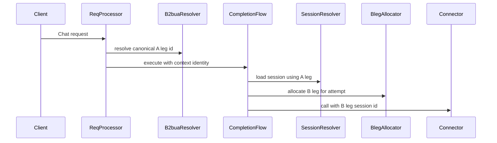

### Flow 4: Unified Routing for Non-Primary Call Types

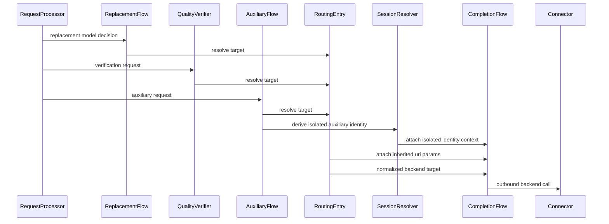

### Flow 5: Hierarchical Routing with Connector-Internal Scheduling

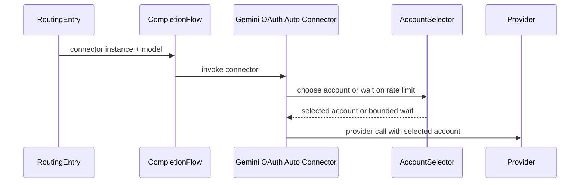

### Flow 6: Startup Validation of Single-Instance Connector Families

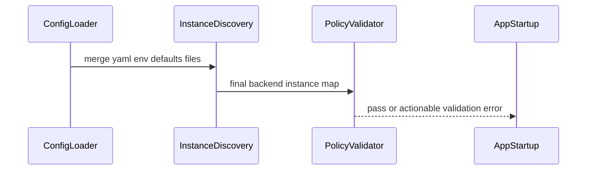

### Flow 7: Interactive Command Routing Validation Reuse

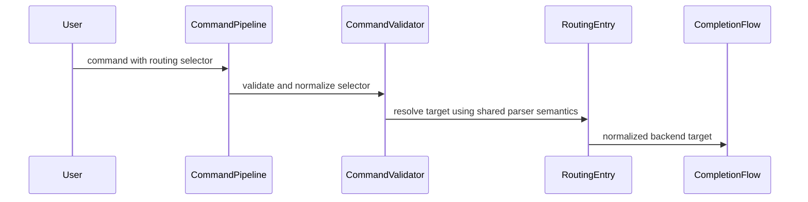

### Flow 8: Backend Reactivation Control Plane

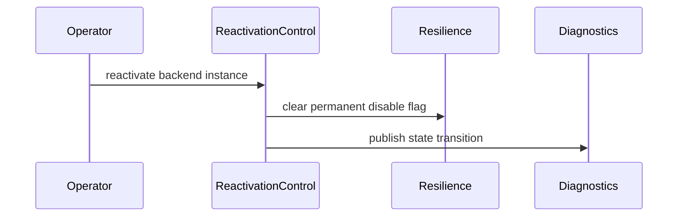

### Flow 9: URI Parameter Inheritance Across Routing Expansion and Failover

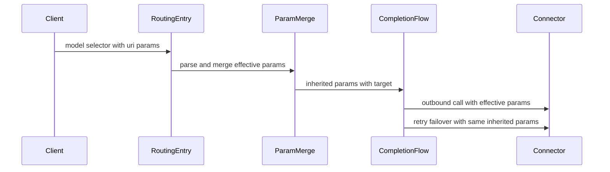

### Flow 10: Preference Policy Ranking and Equivalent-Set Tie Handling

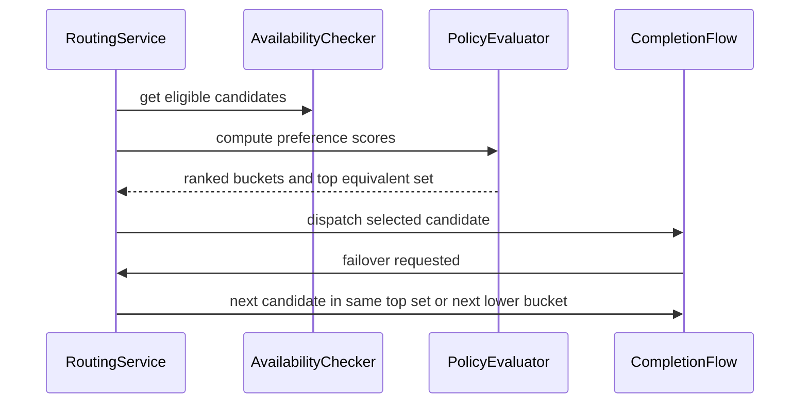

## Error Handling

Routing error taxonomy:
- **Unknown model**: no candidate instances exist for the requested model.
- **Temporarily unavailable**: candidate instances exist but all are filtered out due to cooldown/disabled/health.
- **Policy rejected**: routing method is disabled via `RoutingConfig`.
- **Unsupported on instance**: provider-normalized model-not-found signal for a specific `(instance, model)` updates permanent unsupported state.

Transport mapping:
- Unknown model: surfaced as `InvalidRequestError` or `RoutingError` with `details.code = "unknown_model"`.
- Temporarily unavailable: surfaced as `RateLimitExceededError` (if cooldown-driven) or `RoutingError` with `details.code = "temporarily_unavailable"`.
- Policy rejected: `RoutingError` (existing behavior).
- Attempt budget exhausted: surfaced as `RoutingError` with `details.code = "temporarily_unavailable"` and `details.reason = "attempt_budget_exhausted"`.

Canonical routing error envelope (internal):
- `code`: stable machine code (`unknown_model`, `temporarily_unavailable`, `policy_rejected`, `unsupported_on_instance`)
- `category`: deterministic class (`validation`, `availability`, `policy`)
- `retryable`: boolean
- `message`: human-readable summary
- `details`: structured metadata safe for diagnostics

Protocol adapter mappings:
- OpenAI-compatible APIs: map canonical envelope to OpenAI-style error schema while preserving canonical `details.code`.
- Anthropic-compatible APIs: map canonical envelope to Anthropic-style error schema with equivalent canonical `code`/`retryable` semantics.
- Gemini-compatible APIs: map canonical envelope to Gemini-style error schema with equivalent canonical `code`/`retryable` semantics.
- Invariant: protocol shape may differ, but canonical routing classification and retryability semantics must remain equivalent.

## Observability

### Models Endpoint
- `/v1/models` should emit backend-agnostic `vendor/model` identifiers derived from `ModelCapabilityIndex`.
- Compatibility option: support a query parameter to include backend-prefixed identifiers for legacy clients, without changing the canonical set stored in the index.

### Diagnostics Endpoint
- Extend `/v1/diagnostics` output to include:
  - instance availability state (disabled, cooldown remaining)
  - a summary mapping of `model -> eligible instances` with deterministic bounded output
  - separation of proxy routing decision metadata vs connector-internal scheduler metadata
  - applied preference policy metadata and equivalent-score tie-set summary for model-only routing

Deterministic diagnostics boundedness policy:
- Ordering: sort models by canonical model id (ascending), then instances by instance id (ascending).
- Limits: enforce hard caps for models returned and instances per model (configurable with deterministic defaults).
- Truncation: when caps are exceeded, include explicit `truncated` metadata with omitted counts.
- Selection method: deterministic prefix-after-sort only (no random sampling).

## Security Considerations
- Never emit secrets in diagnostics or model listing.
- Treat “auth failure” disablement as instance-scoped (not global across unrelated instances).

## Performance Considerations
- Request-path selection uses O(1) index lookups and filtering over a bounded candidate set.
- Index reads are lock-free; writes are copy-on-write under a single async lock.
- Enumeration/refresh is off the request path.

## Testing Strategy
- Unit tests:
  - BackendModelResolver and BackendRoutingService selection for all address variants
  - URI-like model-selector parameter parsing, inheritance, and precedence behavior
  - Preference policy ranking behavior (cost-based and priority-based)
  - Equivalent-score tie handling with deterministic Round Robin
  - Availability filtering behavior (cooldown, disabled, unsupported)
  - Capability index snapshot semantics and normalization rules
  - Capability refresh lifecycle policy (startup/periodic/on-demand, single in-flight, failure backoff)
  - B2BUA A-leg continuity and B-leg outbound identity allocation behavior
  - Auxiliary identity derivation and isolation invariants for sidecar calls
  - Attempt-budget counting and precedence behavior (failover, connector waits, cancellation/timeouts)
  - Shared routing entry point enforcement for replacement, quality verifier, and auxiliary call planners
  - Provider error normalization tests for model-not-found classification and `ModelSupportState` transitions
  - Canonical routing-error envelope mapping tests across protocol adapters
  - Backend reactivation control-plane state transition and diagnostics-event tests
  - Interactive command-path validator reuse tests for API-equivalent semantics
  - Hierarchical boundary tests ensuring proxy routing does not duplicate connector-internal account rotation logic
  - Instance policy validator tests for constrained connector families and clear validation errors
  - No-bypass guardrail checks that fail if direct outbound backend paths skip shared routing entry point
  - Mandatory CI compliance-gate checks that fail on routing-entry-point bypass
- Integration tests:
  - `/v1/models` emits backend-agnostic identifiers
  - `/v1/chat/completions` model-only request routes without backend selection
  - `/v1/responses` and compatibility protocol routes use the same routing semantics and resolver entry point
  - Interactive command surfaces reuse shared parser/validation/routing semantics
  - URI-like selector parameters (for example `model?temperature=0.5`) are propagated as effective connector handling parameters across routing modes and failover
  - Model-only routing honors configured preference policy and tie-set Round Robin semantics
  - Diagnostics include routing state summaries
  - Retry/failover path preserves A-leg continuity while rotating B-leg attempts
  - Replacement, quality verifier, and auxiliary outbound calls all resolve targets via the same routing entry point
  - `gemini-oauth-auto` retains internal account rotation/hold behavior while operating through unified proxy routing entry point
  - Observability distinguishes proxy routing decision metadata from connector-internal scheduling metadata
  - Backend reactivation transitions are reflected in diagnostics views
  - Startup configuration fails deterministically when constrained connector families are configured with multiple proxy instances

## Integration & Migration Notes
- `backend/model` (no `:`) is treated as model-only input, never backend selection (8.1).
- URI-like selector parameters (for example `vendor/model?temperature=0.5`) are first-class routing inputs and are inherited across routing expansion/failover.
- Model-only multi-candidate selection uses configured preference policy when provided; otherwise defaults to Round Robin.
- Equal effective preference score (for example equal cost) uses deterministic Round Robin, not first-found pinning.
- Preference policy configuration resolves deterministically by scope (`model pattern` > `backend family` > `global`).
- Configuration that expects backend addressing (failover routes, explicit overrides) must use `backend:model` (8.2).
- User-facing explicit-backend features must validate `backend:model` strictly (8.3).
- Interactive command surfaces must apply the same parser/validation rules as API/config paths (8.4).
- Self-managed OAuth connector families (`gemini-oauth*`, `antigravity*`, `qwen-oauth`) are treated as single-instance proxy families; legacy multi-instance configs must be consolidated.
