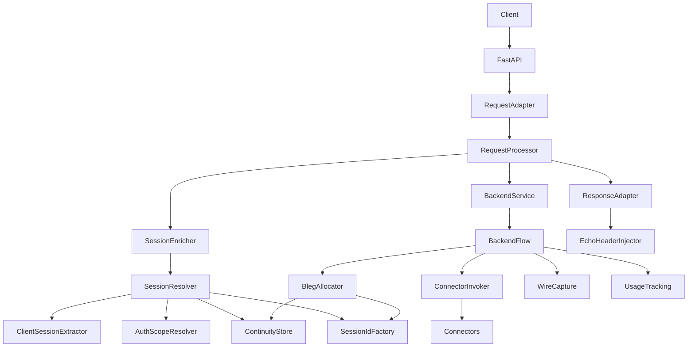
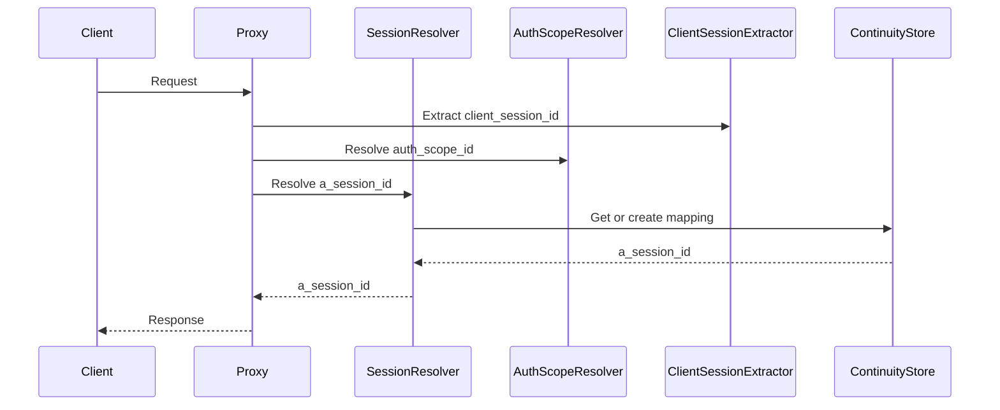
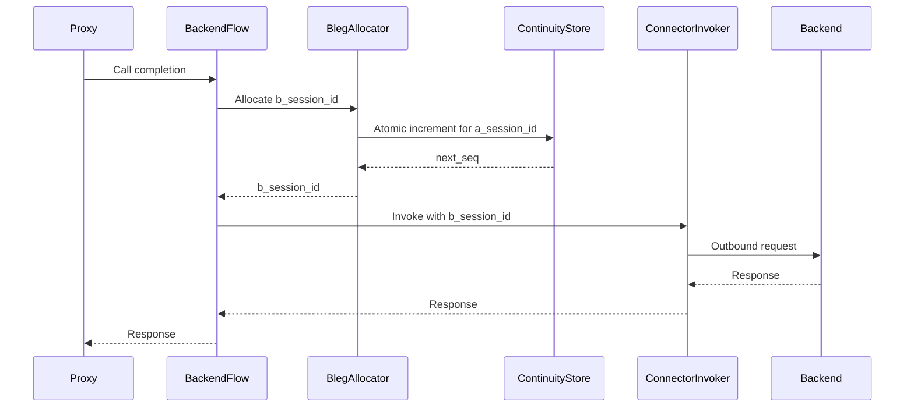
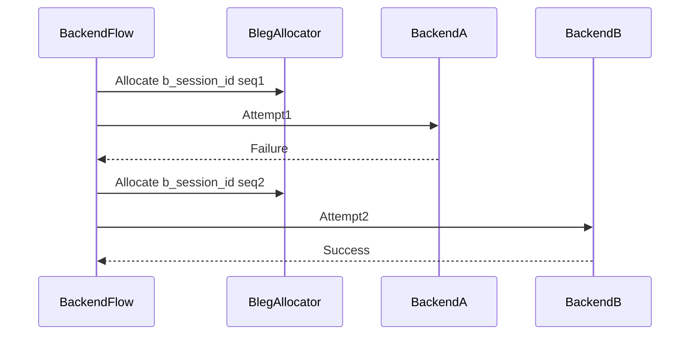
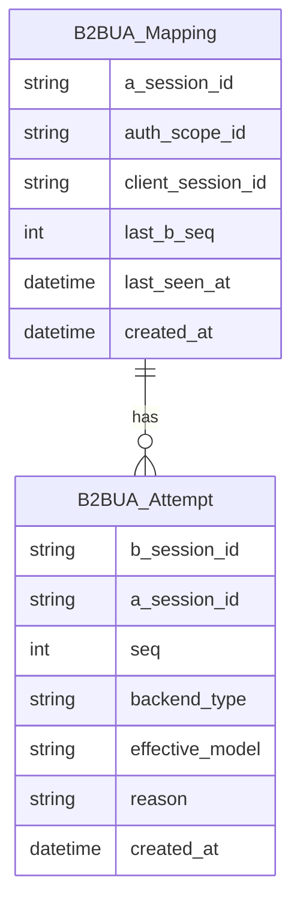

# Technical Design: B2BUA-like Session Handling

---
**Purpose**: Provide sufficient detail to ensure implementation consistency across different implementers, preventing interpretation drift.

**Project Context**: Universal LLM Proxy - FastAPI async service with staged initialization, DI containers, adapter pattern for LLM backends.
---

## Overview
This feature introduces **B2BUA-like session identity handling** for the LLM Proxy. The proxy terminates inbound client requests (A-leg), applies policy/transformations, and initiates outbound backend attempts (B-legs). To support strict identifier isolation and reliable diagnostics, the system will generate **internal A-leg session IDs** and **per-attempt B-leg session IDs**, maintain explicit mapping between them, and propagate both through observability paths (logs, wire captures, usage).

The design enforces a strict separation between **session identifiers** (logical chat-completion session identity, spanning requests) and **request identifiers** (per-request correlation identifiers). It also treats any client-provided session identifier as **untrusted metadata**, never canonical, and never forwarded upstream as a backend session/conversation identifier.

### Goals
- Provide explicit A-leg and B-leg session identities with internal-only generation and strict isolation.
- Provide continuity mapping from (`auth_scope_id`, `client_session_id`) to internal `a_session_id` with TTL and optional persistence.
- Allocate per-A-leg B-leg sequence numbers atomically (including multi-worker deployments when persistence is enabled).
- Ensure no identifier leaks across trust boundaries (client ↔ proxy ↔ backend).
- Enrich observability (echo header, logs, wire captures, usage) with both `a_session_id` and `b_session_id`.

### Non-Goals
- Standardizing provider-specific conversation/session semantics beyond “use b_session_id as the proxy’s backend-facing correlation identifier”.
- Building a long-term conversation database beyond existing session state facilities.
- Redefining cancellation keys (`SessionKey`) or request-level tracing semantics.

## Architecture

### Existing Architecture Analysis (extension)
- `RequestContext.session_id` currently flows through session resolution, backend orchestration, wire capture, and usage tracking. Multiple paths treat client inputs (e.g., `x-session-id`, body `session_id`) as authoritative.
- Backend orchestration already supports multi-attempt failover (`BackendCompletionFlow`), but has no first-class per-attempt identity: a single session identifier is reused across attempts.
- Observability code paths sometimes fall back to `request_id` as a session-like identifier (`StreamSessionIdResolver`, `WireCaptureCoordinator`), which violates the explicit session-vs-request separation required by this feature.
- SSO middleware currently gates requests but does not inject a stable token identity into request context; continuity scoping needs an explicit `auth_scope_id` injection mechanism.

### Architecture Pattern & Boundary Map
**Selected pattern**: Dedicated identity + mapping service with DI-managed collaborators (hybrid staged migration).

**Domain/feature boundaries**:
- **Ingress identity resolution**: resolve/create `a_session_id` and store `client_session_id` as metadata.
- **Backend-attempt identity**: allocate `b_session_id` per attempt, record attempt metadata, and inject b-leg identifiers at the connector boundary.
- **Observability**: emit/record both IDs without request_id substitution.



**Steering compliance**:
- Uses staged initialization and DI-managed services.
- Keeps orchestrators thin and introduces focused collaborators at clear boundaries.
- Avoids open-ended dicts at cross-layer boundaries, using typed models and `RequestContext.extensions` only as a migration bridge.

### Technology Stack

| Layer | Choice / Version | Role in Feature | Notes |
|-------|------------------|-----------------|-------|
| Runtime | Python 3.10+ / FastAPI (async) | Core request handling | Async/await for I/O |
| DI | `src/core/di/container.py` | Service wiring | New services registered in CoreServicesStage/Infrastructure |
| Config | `src/core/config/models/` | Feature gating and defaults | CLI > ENV > YAML precedence |
| Persistence (optional) | SQLModel / SQLite | Continuity mapping + atomic seq | Required for multi-worker atomicity |
| Wire capture | CBOR (`cbor2`) | Capture metadata enrichment | Add explicit a and b session fields |

## System Flows

### Flow F1: Ingress session resolution (A-leg)


Key decisions:
- `client_session_id` is stored as metadata only and never becomes canonical identity.
- Continuity mapping is scoped by `auth_scope_id` (token identity in multi-user mode; implicit single scope in localhost mode).

### Flow F2: Backend attempt (B-leg allocation and injection)


Key decisions:
- B-legs are allocated **per backend attempt**, not per inbound request.
- Connector-facing correlation uses `b_session_id`; proxy session state remains keyed by `a_session_id`.

### Flow F3: Failover creates multiple B-legs under one A-leg


Key decisions:
- Each attempt increments `<seq>` atomically for the A-leg.
- Attempt records are retained until expiration for diagnostics.

## Identity Contract & Boundary Rules

This section is the **canonical contract** for where each identifier may appear. It exists to prevent accidental A-leg/B-leg mixing and identifier leaks during staged migration.

### Canonical identifier meanings
- `a_session_id`: internal, proxy-generated A-leg session identity. This is the only identifier permitted to key **session-scoped state**.
- `b_session_id`: internal, proxy-generated B-leg session identity allocated **per backend attempt**. This is the only identifier permitted to correlate with upstream provider “conversation/session” mechanisms.
- `client_session_id`: any client-provided session identifier captured as **untrusted metadata only**; never canonical and never forwarded to backends as a correlation id.
- `auth_scope_id`: internal identifier representing the caller’s authentication scope. In multi-user mode it is derived from the validated bearer token record identity (`token_id`); in localhost mode it is a single implicit scope.

### Boundary mapping matrix

| Boundary / consumer | Field / carrier | Value | Prohibitions / notes |
|---|---|---|---|
| Core request processing | `RequestContext.session_id` | `a_session_id` (when B2BUA enabled) | Must never contain `client_session_id` in B2BUA mode. |
| Session-scoped state store | `Session.id` / repository key | `a_session_id` | Must never be keyed by `b_session_id` or `request_id`. |
| Backend-attempt boundary | Backend attempt context (new) | `a_session_id` + `b_session_id` + `b_seq` | `b_session_id` allocated immediately before each outbound attempt. |
| Connector boundary (canonical) | `ConnectorRequestContext.session_id` | `b_session_id` | Never pass `client_session_id` to connectors; keep it in proxy-only state. |
| Connector boundary (diagnostics) | `ConnectorRequestContext.extensions["b2bua"]` | `{ "a_session_id": ..., "b_session_id": ..., "b_seq": ... }` | Must omit `client_session_id` to prevent accidental upstream propagation by connectors. |
| Outbound provider request payload | request/provider “session_id” fields | `b_session_id` (or derived) | Must never use `a_session_id` or `client_session_id`. |
| Response header echo (diagnostic) | `x-b2bua-session-id` (configurable name) | `a_session_id` | Emitted only when enabled; ignored inbound for identity. |
| Structured logs | log fields | `a_session_id`, `b_session_id`, `b_seq` | Must not substitute `request_id` for missing session ids. |
| Wire capture metadata | capture meta fields | `a_session_id` and `b_session_id` (distinct) | Must not use `request_id` as a surrogate “session id” in B2BUA mode. |
| Usage tracking | `UsageRecord.session_id` | `a_session_id` | Per-attempt usage must also store `b_session_id` or `b_seq` for PTB/BTP legs. |

### Identity carriers (typed-first; no leaks)
To avoid leaking `client_session_id` into connector-facing `extensions`, prefer **typed identity** on `RequestContext` rather than storing identity inside `RequestContext.extensions`.

**Design contract**:
- Add `RequestContext.b2bua_identity: B2buaIdentity | None` (proxy-only; not projected to connectors by default).
- `B2buaIdentity.client_session_id` is proxy-only and must not be copied into `ConnectorRequestContext.extensions`.

## Auth Scope Derivation & Injection

### Source of `auth_scope_id`
- **Multi-user (SSO) mode**: `auth_scope_id` is derived from the validated bearer token record identity (`TokenValidationResult.token_id`). The raw bearer token value is never used as an identifier.
- **Localhost mode**: `auth_scope_id` is a single implicit constant scope (for example, `"localhost"`).

### Transport-to-domain injection contract
The current SSO middleware gates requests but does not provide token identity to core services. This feature requires an explicit injection contract so `B2BUASessionResolver` can reliably scope continuity.

**Design contract (FastAPI)**:
- On successful authentication, `SSOMiddlewareAdapter` writes token identity into a proxy-internal location accessible to domain services, for example:
  - `request.state.request_state["auth_scope_id"] = <token_id>`
  - `request.state.request_state["user_id"] = <user_id>` (optional for session-scoped state, not for continuity)
- `fastapi_to_domain_request_context()` already maps `request.state.request_state` into `RequestContext.state`; `IAuthScopeResolver` reads from `RequestContext.state` and derives `auth_scope_id`.
- If `auth_scope_id` is missing in multi-user mode, `B2BUASessionResolver` must treat continuity as unavailable and create a new `a_session_id` per request (Requirement 4.10).

**Implementation note (required refactor)**:
- `AuthMiddleware.__call__()` currently returns only “sandbox response or None” and does not expose `token_id`/`user_id`. To satisfy the injection contract, the SSO integration must be extended to surface `TokenValidationResult` on success (for example, by returning a typed decision object from the middleware or by exposing a separate `authenticate(...) -> TokenValidationResult | SandboxResponse` method used by the adapter).

## B-leg Sequence Allocation Modes & Enforcement

### Allocation modes
- **In-memory (single-process)**: maintain `last_b_seq` in an in-memory mapping store and allocate `<seq>` using an async-safe critical section (for example, per-`a_session_id` lock). Correct under concurrency **within one process only**.
- **Persistent (multi-worker safe)**: maintain `last_b_seq` in a persistent mapping store (SQLModel-backed). Allocate `<seq>` using a transactional atomic increment so concurrent workers cannot allocate the same value.

### Enforcement and startup validation
Atomic `<seq>` allocation across multiple worker processes cannot be guaranteed with an in-memory store.

**Design contract**:
- Configuration must allow operators to declare whether multi-worker safety is required (for example, `session.b2bua.require_persistent_mapping_store: bool` or `session.b2bua.deployment_mode: "single-process"|"multi-worker"`).
- If B2BUA is enabled and multi-worker mode is selected, the application must refuse to start unless the persistent mapping store is enabled and correctly configured.

## Requirements Traceability

Canonical requirement ID format used in this design: `N.M` where `N` is the top-level Requirement number from `requirements.md` and `M` is the numbered Acceptance Criteria within that requirement.

| Requirement | Summary | Components | Interfaces | Flows |
|-------------|---------|------------|------------|-------|
| 1.1 | Assign internal A-leg id | SessionResolver, SessionIdFactory | `ISessionResolver` | F1 |
| 1.2 | Assign per-attempt B-leg id | BackendFlow, BlegAllocator | `IBlegAllocator` | F2 |
| 1.3 | Associate multiple attempts to same A-leg | ContinuityStore, BackendFlow | `IB2buaMappingStore` | F2, F3 |
| 1.4 | Support zero to many B-legs | BackendFlow, BlegAllocator | `IBlegAllocator` | F2, F3 |
| 1.5 | No backend call means no B-leg | BackendFlow | `IBackendCompletionFlow` | F2 |
| 1.6 | Maintain A to B mapping | ContinuityStore | `IB2buaMappingStore` | F2 |
| 1.7 | Keep request_id distinct | RequestContext, Observability | n/a | F1, F2 |
| 1.8 | Never derive session ids from request_id | SessionResolver, BlegAllocator | `ISessionResolver`, `IBlegAllocator` | F1, F2 |
| 2.1 | A-leg id format | SessionIdFactory | `ISessionIdFactory` | F1 |
| 2.2 | B-leg id format | SessionIdFactory | `ISessionIdFactory` | F2 |
| 2.3 | B-leg embeds A uuid | SessionIdFactory | `ISessionIdFactory` | F2 |
| 2.4 | Seq starts at 1 | BlegAllocator | `IBlegAllocator` | F2 |
| 2.5 | Atomic seq under concurrency | ContinuityStore | `IB2buaMappingStore` | F2, F3 |
| 2.6 | Header safe ids | SessionIdFactory | `ISessionIdFactory` | F1, F2 |
| 2.7 | Preserve last seq while mapping active | ContinuityStore | `IB2buaMappingStore` | F2 |
| 2.8 | Persist last seq when persistence enabled | PersistentMappingStore | `IB2buaMappingStore` | F2 |
| 3.1 | Store client id as metadata | ClientSessionExtractor, SessionResolver | `IClientSessionIdExtractor` | F1 |
| 3.2 | Do not derive internal ids from client id | SessionIdFactory, SessionResolver | `ISessionIdFactory` | F1 |
| 3.3 | Do not forward client id upstream | BackendFlow | n/a | F2 |
| 3.4 | Ignore inbound echo header | ClientSessionExtractor | `IClientSessionIdExtractor` | F1 |
| 3.5 | Client id precedence order | ClientSessionExtractor | `IClientSessionIdExtractor` | F1 |
| 3.6 | Conflict diagnostic signal | ClientSessionExtractor, Observability | `IClientSessionIdExtractor` | F1 |
| 3.7 | Empty client id treated absent | ClientSessionExtractor | `IClientSessionIdExtractor` | F1 |
| 4.1 | Scope continuity to auth_scope and client id | SessionResolver | `ISessionResolver`, `IAuthScopeResolver` | F1 |
| 4.2 | Reuse a_session_id when mapping active | ContinuityStore | `IB2buaMappingStore` | F1 |
| 4.3 | Different auth scope creates new A-leg | ContinuityStore | `IB2buaMappingStore` | F1 |
| 4.4 | Localhost implicit auth scope | AuthScopeResolver | `IAuthScopeResolver` | F1 |
| 4.5 | Expiration policy for mapping | ContinuityStore | `IB2buaMappingStore` | F1 |
| 4.6 | New A-leg after expiration | ContinuityStore | `IB2buaMappingStore` | F1 |
| 4.7 | Sliding expiration while active | ContinuityStore | `IB2buaMappingStore` | F1 |
| 4.8 | Persistence across restarts when enabled | PersistentMappingStore | `IB2buaMappingStore` | F1 |
| 4.9 | No client id means new A-leg by default | SessionResolver | `ISessionResolver` | F1 |
| 4.10 | No auth scope means no reuse outside localhost | AuthScopeResolver, SessionResolver | `IAuthScopeResolver` | F1 |
| 5.1 | Create B-leg per attempt | BackendFlow, BlegAllocator | `IBlegAllocator` | F2 |
| 5.2 | Failover creates new B-leg per attempt | BackendFlow | `IBackendCompletionFlow` | F3 |
| 5.3 | Follow-up calls create new B-leg | BackendFlow | `IBackendCompletionFlow` | F2 |
| 5.4 | Record per B-leg metadata | ContinuityStore | `IB2buaMappingStore` | F2 |
| 5.5 | Retain failed attempt record until expiry | ContinuityStore | `IB2buaMappingStore` | F3 |
| 5.6 | Session-scoped internals keyed by a_session_id | BackendFlow, BackendManager | n/a | F2 |
| 6.1 | Do not include a_session_id in outbound | BackendFlow, ConnectorInvoker | n/a | F2 |
| 6.2 | Do not include client_session_id in outbound | BackendFlow | n/a | F2 |
| 6.3 | Use b_session_id for backend correlation | BackendFlow, SessionIdFactory | `ISessionIdFactory` | F2 |
| 6.4 | Prevent propagation of client ids in connectors | BackendFlow | n/a | F2 |
| 6.5 | Populate backend session fields from b_session_id | BackendFlow | n/a | F2 |
| 7.1 | Echo A-leg id when enabled | EchoHeaderInjector | `ISessionEchoService` | F1 |
| 7.2 | No echo when disabled | EchoHeaderInjector | `ISessionEchoService` | F1 |
| 7.3 | Stable echo for streaming | EchoHeaderInjector | `ISessionEchoService` | F1 |
| 7.4 | Logs include a and b ids per attempt | BackendFlow | n/a | F2 |
| 7.5 | Captures include a and b ids | WireCapture | `IWireCapture` | F2 |
| 7.6 | Usage attributed to a_session_id with per-attempt metadata | UsageTracking | `IUsageTrackingService` | F2 |
| 7.7 | No request_id substitution in observability | WireCapture, UsageTracking | n/a | F2 |
| 7.8 | Capture stores ids as distinct fields | WireCapture | `IWireCapture` | F2 |
| 7.9 | Omit ids on error rather than using request_id | Observability | n/a | F2 |
| 7.10 | Persist b_session_id or seq for backend legs | UsageTracking | `IUsageTrackingService` | F2 |
| 8.1 | Config enable or disable feature | Config, DI wiring | n/a | F1, F2 |
| 8.2 | When enabled apply all requirements | Config, DI wiring | n/a | F1, F2 |
| 8.3 | When disabled do not enforce separation | Config, legacy behavior | n/a | F1, F2 |
| 8.4 | Config mapping expiration | Config, ContinuityStore | n/a | F1 |
| 8.5 | Config persistence across restarts | Config, PersistentMappingStore | n/a | F1 |
| 8.6 | Config echo enable toggle | Config, EchoHeaderInjector | n/a | F1 |
| 8.7 | Config echo header name | Config, EchoHeaderInjector | n/a | F1 |
| 9.1 | Session-scoped state keyed by a_session_id | SessionEnricher, SessionService | `ISessionService` | F1 |
| 9.2 | Inbound processing uses a_session_id | SessionEnricher | `ISessionEnricher` | F1 |
| 9.3 | Outbound attempts use a_session_id for state | BackendFlow | n/a | F2 |
| 9.4 | Follow-ups reuse session state | BackendFlow | n/a | F2 |
| 9.5 | Support user id and project and language in state | Session, SessionEnricher | `ISessionService` | F1 |
| 9.6 | State not partitioned by b_session_id | BackendFlow | n/a | F2 |
| 9.7 | request_id not used as session state key | SessionResolver, Observability | n/a | F1 |

## Components and Interfaces

**DI Registration Strategy**
- Session resolver selection is configuration-driven:
  - If `session.b2bua.enabled` is true, register `B2BUASessionResolver` as `ISessionResolver`.
  - Otherwise, retain existing resolver wiring (e.g., `IntelligentSessionResolver`).
- Mapping store has two implementations:
  - In-memory store (single-process)
  - Persistent store (SQLModel-backed) for cross-process atomicity and restart continuity

### Services Layer (`src/core/services/`)

#### B2BUASessionResolver

| Field | Detail |
|-------|--------|
| Intent | Resolve internal `a_session_id` and store `client_session_id` metadata |
| Requirements | 1.1, 1.8, 3.1, 3.2, 3.3, 3.4, 3.5, 3.6, 3.7, 4.1, 4.2, 4.3, 4.4, 4.5, 4.6, 4.7, 4.8, 4.9, 4.10, 9.1, 9.2, 9.7 |
| Interface | `ISessionResolver` (`src/core/interfaces/session_resolver_interface.py`) |
| DI Lifetime | Singleton |

**Responsibilities & Constraints**
- Extract `client_session_id` (precedence order) and sanitize for logging.
- Resolve `auth_scope_id` (token identity in multi-user mode, implicit scope in localhost mode).
- Resolve or create `a_session_id` using continuity store and expiration policy.
- Set `RequestContext.session_id` to the internal `a_session_id` (never leave client ids in `context.session_id` when B2BUA is enabled).
- Store identity metadata in `RequestContext.b2bua_identity` (preferred). If `RequestContext.extensions` is used as a migration bridge, it must contain only **connector-safe** diagnostics (no `client_session_id`) because `extensions` are projected to `ConnectorRequestContext`.

**Dependencies (via DI)**
- `IClientSessionIdExtractor`
- `IAuthScopeResolver`
- `IB2buaMappingStore`
- `ISessionIdFactory`

##### Service Interface
```python
from abc import ABC, abstractmethod
from src.core.domain.request_context import RequestContext

class IClientSessionIdExtractor(ABC):
    @abstractmethod
    def extract_client_session_id(self, context: RequestContext) -> str | None:
        ...

class IAuthScopeResolver(ABC):
    @abstractmethod
    async def resolve_auth_scope_id(self, context: RequestContext) -> str | None:
        ...
```

#### BlegAllocator

| Field | Detail |
|-------|--------|
| Intent | Allocate per-attempt `b_session_id` with atomic per-A-leg sequence |
| Requirements | 1.2, 1.3, 1.4, 1.5, 1.6, 2.2, 2.3, 2.4, 2.5, 2.6, 2.7, 2.8, 5.1, 5.2, 5.3, 5.4, 5.5, 6.3, 7.4, 7.5 |
| Interface | `IBlegAllocator` (new) |
| DI Lifetime | Singleton |

**Responsibilities & Constraints**
- For a given `a_session_id`, atomically allocate the next `<seq>` (starting at 1).
- Create `b_session_id = llm-b2bua-b-<a-uuid>-<seq>` and record attempt metadata.
- Ensure atomicity under async concurrency; require persistent store for multi-worker deployments.

##### Service Interface
```python
from abc import ABC, abstractmethod
from dataclasses import dataclass

@dataclass(frozen=True)
class BlegAllocation:
    b_session_id: str
    seq: int

class IBlegAllocator(ABC):
    @abstractmethod
    async def allocate(self, a_session_id: str, *, reason: str) -> BlegAllocation:
        ...
```

#### EchoHeaderInjector

| Field | Detail |
|-------|--------|
| Intent | Echo A-leg id to clients as diagnostic-only response header |
| Requirements | 7.1, 7.2, 7.3, 8.6, 8.7 |
| Interface | `ISessionEchoService` (new) |
| DI Lifetime | Singleton |

**Responsibilities & Constraints**
- Use config default header name `x-b2bua-session-id`.
- Emit header only when enabled.
- Never read inbound echo header for identity.

##### Service Interface
```python
from abc import ABC, abstractmethod
from src.core.domain.request_context import RequestContext

class ISessionEchoService(ABC):
    @abstractmethod
    def maybe_get_echo_header(self, context: RequestContext | None) -> tuple[str, str] | None:
        ...
```

### Backend Orchestration Integration (`src/core/services/backend_completion_flow/`)

#### BackendCompletionFlow (integration changes)
**Key change**: Introduce an explicit “backend attempt context” concept and allocate a fresh `b_session_id` per attempt.

**Rules**
- A-leg identity (session state key, per-session backend cache key): `a_session_id` (from `RequestContext.session_id` in B2BUA mode).
- B-leg identity (provider correlation id, connector-facing context, outbound request fields): `b_session_id`.

**Backend attempt context**
- Each outbound attempt must operate on an **attempt-scoped context object** that carries `b_session_id`/`b_seq` without mutating the shared A-leg context.
- Rationale: A single A-leg may create multiple B-legs, including under concurrency (Requirement 2.5). Attempt-scoped context avoids races where a single `RequestContext` would otherwise be overwritten with different `b_session_id` values.
- Minimal contract:
  - A-leg context: `RequestContext.session_id == a_session_id`
  - Attempt context: `RequestContext.session_id == a_session_id` and `RequestContext.b2bua_identity` contains `b_session_id` and `b_seq`

**Injection points**
- Immediately before invoking a backend attempt, allocate B-leg and:
  - Overwrite outbound request session fields with `b_session_id` (including `request.session_id` and `extra_body.session_id`).
  - Pass `b_session_id` to connector-facing context projection (canonical connectors) by ensuring `ConnectorRequestContext.session_id == b_session_id` for the attempt.
  - Populate `ConnectorRequestContext.extensions["b2bua"]` with a connector-safe subset for diagnostics: `a_session_id`, `b_session_id`, `b_seq` (and never `client_session_id`).
  - Ensure `RequestContext.session_id` remains `a_session_id` and is never temporarily overwritten with `b_session_id`.
  - Emit structured logs containing both `a_session_id` and `b_session_id`.

## Data Models

### Domain Model (`src/core/domain/`)
Introduce a typed identity container (domain-level) to avoid ad-hoc dict usage:
- `B2buaIdentity`:
  - `a_session_id: str`
  - `b_session_id: str | None`
  - `client_session_id: str | None`
  - `auth_scope_id: str | None`
  - `b_seq: int | None`
  
**Attachment rule**:
- The canonical carrier for `B2buaIdentity` is `RequestContext.b2bua_identity` (proxy-only). Only a redacted subset may be copied into `ConnectorRequestContext.extensions` (see Identity Contract & Boundary Rules).

### Persistence Model (optional)
When persistence is enabled, introduce tables for continuity mapping and B-leg attempts (exact schema is implementation choice; this design requires these logical fields and invariants).



**Invariants**
- `a_session_id` always matches `llm-b2bua-<a-uuid>`.
- `b_session_id` always matches `llm-b2bua-b-<a-uuid>-<seq>`.
- `seq` is unique per `a_session_id` and strictly increasing.

### Wire Capture Metadata
Extend capture metadata to store both IDs distinctly:
- Add `a_session_id` and `b_session_id` as explicit fields (distinct values, not a combined string).
- Preserve backward compatibility by continuing to populate existing `session_id`/`sid` with `a_session_id` while B2BUA is enabled, but treat `a_session_id`/`b_session_id` as the canonical fields for correlation.
- When B2BUA is enabled, do not fall back to `request_id` as a surrogate “session id” for capture metadata.
- Ensure ingress wire capture observes the resolved internal `a_session_id` (i.e., session resolution must happen before inbound capture metadata is finalized).

### Usage Tracking Schema
Evolve usage persistence to attribute to A-leg while retaining per-attempt metadata:
- Keep `session_id` as `a_session_id` for grouping and session metrics.
- Add `b_session_id` (or `b_seq`) to usage records for backend-attempt legs (PTB/BTP).

## Error Handling

### Error Hierarchy
All errors extend `LLMProxyError`.

| Error Type | HTTP Status | Use Case |
|------------|-------------|----------|
| `SessionIdentityError` | 500 | Identity/mapping internal failures |
| `SessionMappingStoreError` | 500 | Mapping persistence failures |
| `AuthScopeResolutionError` | 500 | Missing or inconsistent auth scope injection |

### Error Strategy
- Fail-open safely where possible:
  - If continuity lookup fails, create a new `a_session_id` and proceed.
  - If B-leg allocation fails, omit `b_session_id` and proceed only if backend correlation is optional for the selected provider path; otherwise raise `SessionIdentityError`.
- Never substitute `request_id` for missing `a_session_id` or `b_session_id` in observability outputs when B2BUA is enabled.

## Testing Strategy

### Unit Tests (`tests/unit/`)
- `B2BUASessionResolver`:
  - Client session id extraction precedence and conflict diagnostics (3.5, 3.6, 3.7).
  - Continuity scoping by `auth_scope_id` and localhost implicit scope (4.1-4.4).
  - Expiration and sliding TTL behavior (4.5-4.7).
- `IBlegAllocator` implementations:
  - Monotonic seq allocation (2.4) and uniqueness under concurrency (2.5).
  - Persistence of last seq across restarts when enabled (2.8).
- “No request_id fallback”:
  - Stream/session-id resolvers and capture coordinator omit ids rather than substituting request_id (7.7, 7.9).

### Integration Tests (`tests/integration/`)
- End-to-end request with:
  - Echo header presence/absence based on config (7.1-7.3, 8.6-8.7).
  - Failover producing multiple B-legs under one A-leg (5.2).
  - Wire capture entries containing both A-leg and B-leg metadata (7.5, 7.8).
  - Usage records attributed to A-leg with per-attempt B-leg metadata (7.6, 7.10).

## Security Considerations
- Treat all client-provided session identifiers as untrusted input; never accept inbound echo header as identity input (3.4, NFR 4).
- Ensure outbound payload/session fields are overwritten with `b_session_id` and never carry `a_session_id` or `client_session_id` (6.1-6.5).
- Scope continuity mapping to `auth_scope_id` to prevent cross-token session fixation and session confusion (4.1-4.3).

## Migration Notes
- Rollout is controlled by `session.b2bua.enabled` (8.1-8.3).
- A staged migration is expected:
  1. Introduce identity and mapping services behind config.
  2. Migrate backend attempt boundary and connector context projection first (highest leak risk).
  3. Migrate capture and usage schemas with backward-compatible metadata additions and tooling updates.
