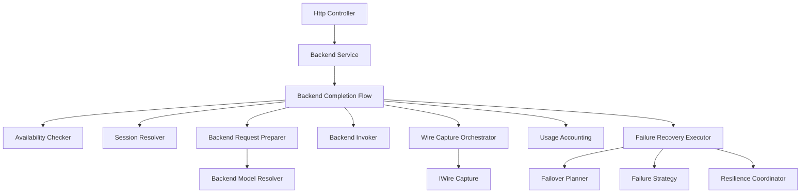
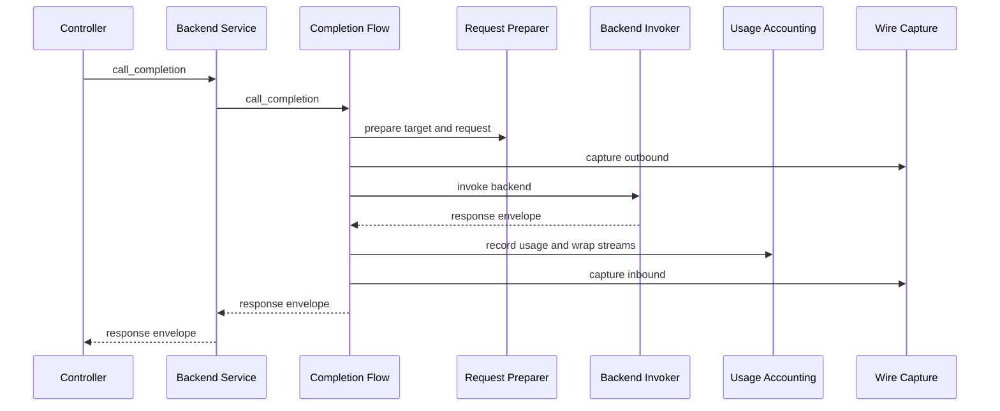
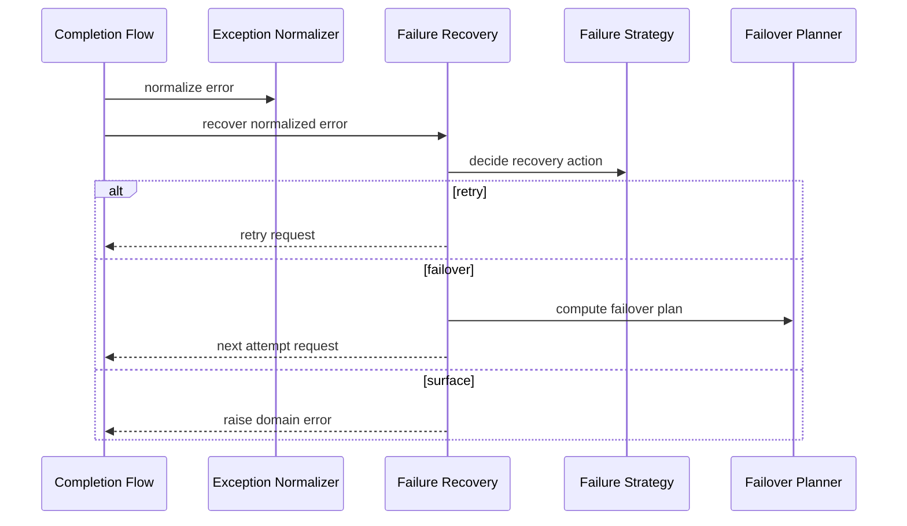

# Design Document: Backend Completion Flow Architecture Refactoring

---
**Purpose**: Provide an implementation-ready technical design to refactor backend completion orchestration into a layered, modular, SOLID-compliant structure without moving responsibilities into a new god object/god module, while preserving all existing runtime behavior and tests.

**Project Context**: Universal LLM Proxy - FastAPI async service with staged initialization, DI containers, adapter pattern for LLM backends.
---

## Overview

This refactoring decomposes the current backend completion orchestration centered in `BackendCompletionFlow` into cohesive collaborators with explicit interfaces and DI wiring. The system is currently behavior-correct (tests green), but development and testing remain difficult due to boundary leaks (transport exceptions in core) and a large orchestration module that concentrates multiple responsibilities.

The design keeps the public contract stable (`IBackendService`, `IBackendCompletionFlow`) and focuses on architectural correctness: strict layer boundaries, explicit ownership, dependency inversion, and testability via stable seams. This is explicitly not a “move code into another god object/module” effort: the orchestrator becomes a coordinator that delegates to well-scoped collaborators.

### Goals
- Enforce strict layer boundaries: backend orchestration depends on domain models and core interfaces, not FastAPI/Starlette.
- Decompose backend completion orchestration into cohesive collaborators with explicit DI-owned interfaces.
- Remove production boundary leaks used only for tests (e.g., “parent service” shims and private-method reach-through).
- Keep behavior, contracts, observability (wire capture), and accounting (usage) unchanged and validated by the full test suite.
- Meet maintainability gates: no orchestration module > 1000 lines; no method complexity > 50.

### Non-Goals
- No user-facing feature changes or semantic changes to routing, failover, streaming, capture, or usage tracking.
- No config schema or precedence changes.
- No protocol changes for OpenAI/Anthropic/Gemini endpoints.
- No refactoring of unrelated large modules outside backend completion orchestration.

## Architecture

### Existing Architecture Analysis

Current backend completion orchestration is implemented as a large service module (`src/core/services/backend_completion_flow.py`) that coordinates:
- target resolution and request synchronization
- session lookup and per-session backend selection
- backend acquisition, availability checks, and backend request preparation
- wire capture outbound/inbound integration
- usage tracking/wrapping for streaming and non-streaming responses
- failure handling (normalization, retry, failover planning/execution, complex failover routes)
- resilience bookkeeping and planning-phase counter updates

Architectural problems to address (without changing behavior):
- Transport/framework types are treated as first-class errors in orchestration (FastAPI HTTP exception types).
- Tests rely on overriding legacy private methods by passing a “parent service” reference into the orchestrator.
- Some compatibility seams rely on private-method access across components instead of explicit contracts.
- The module size makes change locality poor: future changes tend to require edits across the orchestrator instead of a single focused collaborator.

### Architecture Pattern & Boundary Map

**Selected pattern**: Orchestrator plus phase handlers (focused collaborators).

**Boundary decisions**:
- Transport (FastAPI controllers/handlers) owns HTTP status mapping; core orchestration owns domain errors only.
- `BackendCompletionFlow` remains the orchestration entrypoint but delegates substantive logic to collaborators.
- Collaborators are internal services with interfaces in `src/core/interfaces/` and are DI-constructed.



**Why this solves “god module” risk**:
- Each collaborator owns one cohesive area (SRP) and can be unit tested in isolation.
- The orchestrator coordinates ordering and shared context only (composition root for the flow).
- Maintainability gates apply to each module and component, preventing a new monolith from forming.

### Technology Stack

| Layer | Choice / Version | Role in Feature | Notes |
|-------|------------------|-----------------|-------|
| Runtime | Python 3.10+ | Core runtime | Async/await only |
| Web | FastAPI (async) | Transport/controllers | Must not leak into core services |
| DI Container | `src/core/di/container.py` | Service registration | Factories for complex wiring |
| Initialization | Staged init (`src/core/app/stages/`) | Startup ordering | Update both primary and fallback wiring |
| Errors | `LLMProxyError` hierarchy | Domain error model | Transport maps to HTTP |

## System Flows

### Main completion flow (happy path)



Flow-level decisions:
- Orchestrator keeps ordering stable (prepare -> outbound capture -> invoke -> usage/capture inbound -> return).
- Errors are normalized to domain exceptions inside orchestration; controllers handle HTTP conversion.

### Failure handling (retry and failover)



## Requirements Traceability

| Requirement | Summary | Components | Interfaces | Flows |
|-------------|---------|------------|------------|-------|
| 1.1 | Domain error model used in orchestration | Completion Flow, Exception Normalizer | `IExceptionNormalizer` | Failure |
| 1.2 | No FastAPI imports in orchestration | Completion Flow and collaborators | N/A | All |
| 1.3 | HTTP conversion stays in transport | Controllers, exception adapters | N/A | All |
| 1.4 | Orchestration uses domain models only | Completion Flow and collaborators | `IBackendCompletionFlow` | All |
| 2.1 | Decompose into cohesive collaborators | All new collaborators | New `I*` seams | All |
| 2.2 | Orchestrator delegates | Completion Flow | `IBackendCompletionFlow` | All |
| 2.3 | Size/complexity gates | All new modules | N/A | N/A |
| 2.4 | Remove test shims | Completion Flow, tests | `IFailureHandlingStrategy` | Failure |
| 2.5 | Orchestrator entrypoint size gate | Completion Flow + collaborators | `IBackendCompletionFlow` | All |
| 2.6 | Collaborator module size gate | Collaborators | New `I*` seams | N/A |
| 2.7 | Collaborator complexity gates | Collaborators | New `I*` seams | N/A |
| 3.1 | DI-owned construction | DI wiring | N/A | N/A |
| 3.2 | Depend on interfaces | All collaborators | `src/core/interfaces/` | N/A |
| 3.3 | Consistent wiring across roots | DI + stage fallback | N/A | N/A |
| 3.4 | Optional infra stays optional | Capture/usage/resilience | Existing optional interfaces | All |
| 4.1 | Failure decisions via explicit seam | Failure Recovery | `IFailureHandlingStrategy` | Failure |
| 4.2 | No production-only test parameters | Completion Flow | N/A | N/A |
| 4.3 | Mock via injected interfaces | Tests/builders | `src/core/interfaces/` | N/A |
| 4.4 | Preserve or replace test seams | Tests | N/A | All |
| 5.1 | Preserve `IBackendService` contract | Backend Service | `IBackendService` | All |
| 5.2 | Preserve wire capture format/behavior | Wire Capture Orchestrator | `IWireCapture` | All |
| 5.3 | Preserve usage behavior | Usage Accounting | `IUsageTrackingService` | All |
| 5.4 | Preserve failover semantics | Failure Recovery | `IFailoverPlanner` | Failure |
| 5.5 | Full suite green | All | pytest | All |
| 6.1 | Remove stub modules | Build/cleanup | N/A | N/A |
| 6.2 | No stub wiring | DI | N/A | N/A |
| 6.3 | No private-method reach-through | Backend Service and planners | `IFailoverPlanner` | N/A |
| 7.1 | Change locality via collaborators | All collaborators | New `I*` seams | N/A |
| 7.2 | Responsibility map documented | Design doc | N/A | N/A |
| 7.3 | Tooling gates enforced | Docs + CI usage | N/A | N/A |
| 8.1 | No non-streaming latency regression | Orchestration subsystem | N/A | Main |
| 8.2 | No streaming first-byte regression | Orchestration subsystem | N/A | Streaming |
| 8.3 | Preserve resilience semantics | Availability and recovery | `IResilienceCoordinator` | Failure |
| 8.4 | Preserve security properties | Capture and error paths | `IWireCapture` | All |

## Components and Interfaces

### Component Summary

| Component | Domain | Intent | Requirements | DI Lifetime |
|-----------|--------|--------|--------------|------------|
| BackendCompletionFlow | Orchestration | Coordinates completion flow; delegates to collaborators | 1.1-1.4, 2.2, 5.1 | Singleton |
| BackendAvailabilityChecker | Availability | Applies disabled-backend and resilience availability gates | 1.4, 2.1, 5.4 | Singleton |
| CompletionSessionResolver | Session | Resolves session and backend session key inputs | 2.1, 4.3, 5.1 | Singleton |
| BackendRequestPreparer | Request prep | Applies config/reasoning/URI params and builds backend kwargs | 2.1, 5.1 | Singleton |
| WireCaptureOrchestrator | Observability | Captures outbound/inbound traffic and error payloads | 2.1, 5.2 | Singleton |
| UsageAccountingOrchestrator | Accounting | Wraps streaming/non-streaming responses for usage tracking | 2.1, 5.3 | Singleton |
| FailureRecoveryExecutor | Failure handling | Implements retry/failover execution using strategy + planner | 2.1, 4.1, 5.4 | Singleton |

### Services Layer (`src/core/services/`)

#### BackendCompletionFlow

| Field | Detail |
|-------|--------|
| Intent | Coordinate the completion flow and preserve the public orchestration contract |
| Requirements | 1.1-1.4, 2.2, 3.1, 5.1 |
| Interface | `IBackendCompletionFlow` |
| DI Lifetime | Singleton |

**Responsibilities & Constraints**
- Owns ordering and shared context only; delegates substantial work to collaborators.
- Does not import or raise transport/framework exception types.
- Normalizes unexpected exceptions into domain errors before handing to recovery logic.

**Dependencies (via DI)**
- `IBackendModelResolver`, `IStreamSessionIdResolver`, `IExceptionNormalizer`, `IPlanningPhaseManager`
- New internal collaborators: `IBackendAvailabilityChecker`, `ICompletionSessionResolver`, `IBackendRequestPreparer`, `IWireCaptureOrchestrator`, `IUsageAccountingOrchestrator`, `IFailureRecoveryExecutor`

#### IBackendAvailabilityChecker

```python
from abc import ABC, abstractmethod

class IBackendAvailabilityChecker(ABC):
    @abstractmethod
    async def check(self, backend_type: str, model: str, allow_failover: bool) -> None:
        """Raise a domain error when the backend/model is not available."""
        ...
```

#### IFailureRecoveryExecutor

```python
from abc import ABC, abstractmethod
from src.core.domain.chat import ChatRequest
from src.core.domain.request_context import RequestContext
from src.core.domain.responses import ResponseEnvelope, StreamingResponseEnvelope

class IFailureRecoveryExecutor(ABC):
    @abstractmethod
    async def recover(
        self,
        request: ChatRequest,
        context: RequestContext | None,
        error: Exception,
        backend_type: str,
        model: str,
        is_streaming: bool,
        content_started: bool,
        attempted_backends: list[str],
        start_time: float,
        allow_failover: bool,
    ) -> ResponseEnvelope | StreamingResponseEnvelope:
        """Return a recovered response or raise a domain error to surface."""
        ...
```

#### IWireCaptureOrchestrator

```python
from abc import ABC, abstractmethod
from typing import Any
from src.core.domain.chat import ChatRequest
from src.core.domain.request_context import RequestContext

class IWireCaptureOrchestrator(ABC):
    @abstractmethod
    async def capture_outbound(
        self,
        context: RequestContext | None,
        request: ChatRequest,
        backend_type: str,
        model: str,
        key_name: str | None,
    ) -> None:
        """Best-effort capture of outbound request."""
        ...

    @abstractmethod
    async def capture_inbound(
        self,
        context: RequestContext | None,
        session_id: str | None,
        backend_type: str,
        model: str,
        key_name: str | None,
        payload: Any,
    ) -> None:
        """Best-effort capture of inbound response or error payload."""
        ...
```

### DI Registration Strategy

- All new collaborators are registered as `Singleton` services.
- Each collaborator is bound to an `I*` interface in `src/core/interfaces/`.
- Wiring is updated in both:
  - Primary composition root: `src/core/di/services.py`
  - Staged fallback wiring: `src/core/app/stages/backend.py`
- The existing `BackendCompletionFlow` factory remains the entrypoint but resolves collaborators via DI rather than embedding large logic.

## Error Handling

### Error Strategy
- Backend orchestration raises only domain exceptions rooted in `LLMProxyError`.
- Any “foreign” exception (including status-code-carrying exceptions originating from libraries) is normalized via `IExceptionNormalizer` without importing FastAPI/Starlette types.
- Transport/controller layers map domain errors to HTTP using existing adapters (`src/core/transport/fastapi/exception_adapters.py`) and error handlers (`src/core/app/error_handlers.py`).

### Resilience bookkeeping policy
- Resilience tracking (`IResilienceCoordinator`) is invoked only for backend invocation failures and domain errors representing backend-side issues.
- Client input errors and transport-layer HTTP exceptions must not be recorded as backend failures; this is enforced by normalization and explicit “recordable failure” checks in the failure-handling component.

## Testing Strategy

### Unit Tests
- Add unit tests for each new collaborator using injected/mocked dependencies (no FastAPI types in the SUT).
- Update existing tests that mock private methods on `BackendService` to inject `IFailureHandlingStrategy` (or a dedicated failure recovery seam) instead of using a “parent service” shim.

### Integration Tests
- Keep existing integration tests unchanged; validate DI wiring via the existing staged init flows.

### Verification
- Enforce maintainability gates using existing tooling:
  - `scripts/analyze_complexity.py` for complexity ceilings
  - `wc -l` for module size gates
- Run full test suite (`./.venv/Scripts/python.exe -m pytest`) as the primary regression gate.

## Migration Notes

- Preserve import compatibility by keeping `BackendCompletionFlow` as the DI-resolved entrypoint implementing `IBackendCompletionFlow`.
- Move extracted collaborators into new modules with stable interfaces; ensure `src/core/services/backend_completion_flow.py` no longer exceeds module size limits.
- Remove unused stub modules and eliminate private-method reach-through by expanding explicit interface contracts where needed.

## Implementation Guardrails (Agent Instructions)

These guardrails exist to increase the chance this third attempt produces the intended architecture (loose coupling, strong boundaries, SOLID), rather than a reshuffled monolith. They are treated as non-negotiable.

### Hard “Do Not” Rules

- Do not solve line-count gates by splitting files while keeping the same monolithic orchestration responsibility; decomposition must be by *real collaborators* with clear ownership and interfaces.
- Do not introduce a new top-level “flow”/“manager”/“engine” class that re-aggregates the responsibilities currently in `BackendCompletionFlow`.
- Do not preserve legacy test behavior by adding production shims (for example `parent_service`, test-only flags, or private-method delegation).
- Do not import or raise FastAPI/Starlette types in core/service orchestration code; convert to domain errors and rely on existing transport adapters/handlers for HTTP mapping.
- Do not call across collaborator boundaries via private members; if a behavior is required, make it a contract on the relevant interface.
- Do not add “constructor fallback creation” patterns; all dependencies must come from DI.

### Mandatory “Definition of Done” Checks (for each PR / task group)

- Run `./.venv/Scripts/python.exe -m pytest` with zero failures.
- Run `./.venv/Scripts/python.exe scripts/analyze_complexity.py` and confirm all constraints in `requirements.md` are satisfied.
- Run `wc -l` on modules introduced or modified by this refactor and confirm all size gates are satisfied.
- Confirm no transport/framework imports exist in orchestration modules (a dedicated unit test should enforce this).
