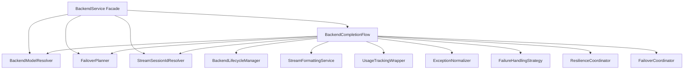
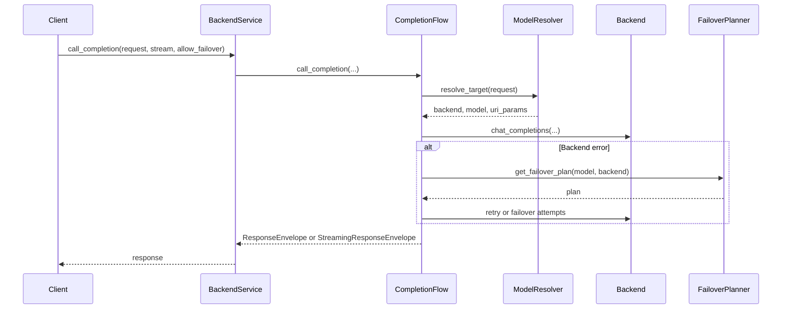

# Design Document: BackendService God Object Refactoring

## Overview

This design refactors `BackendService` into a small façade that delegates to focused collaborators, preserving all existing behavior and contracts while materially reducing size and cyclomatic complexity.

**Purpose**: Improve maintainability and testability of backend orchestration while keeping runtime behavior, error semantics, and observability stable.

**Impact**:
- `BackendService.call_completion` complexity drops from 180 (radon CC) to a small delegating wrapper.
- `src/core/services/backend_service.py` is reduced to ≤ 500 lines.
- Responsibility boundaries become explicit and DI-owned, removing runtime fallback instantiation.

### Goals

- Reduce `src/core/services/backend_service.py` to a ≤ 500-line façade.
- Centralize dependency construction in DI wiring (remove runtime fallbacks in `BackendService.__init__`).
- Preserve all existing behavior and tests.
- Avoid introducing new “god object” replacements.

### Non-Goals

- Feature changes, config/schema changes, or protocol changes.
- Refactoring other high-complexity modules outside BackendService scope.
- Performance tuning beyond “no regression” validation.

## Architecture

### Existing Architecture Analysis

**Current hotspots (verified):**
- `src/core/services/backend_service.py`: 2109 lines.
- `BackendService.call_completion`: CC 180 (radon via `scripts/analyze_complexity.py`); one method mixes session resolution, backend init, retry/failover loops, wire capture integration, usage tracking integration, and response shaping.
- Multiple extracted services already exist and are registered in DI (`src/core/di/services.py`), but `BackendService.__init__` still supports optional injection + runtime fallback creation.
- Streaming session-id resolution logic is duplicated across `BackendService` and `BufferedWireCaptureService`.

**Existing patterns to preserve (steering-aligned):**
- Staged initialization wires DI via `CoreServicesStage` calling `register_core_services(...)`.
- Interfaces in `src/core/interfaces/` provide test seams.
- Factory functions in DI are used for complex wiring.

### Architecture Pattern & Boundary Map

**Selected pattern**: Facade + Orchestrator + Focused Services.

**Boundary decisions**:
- `BackendService` remains the stable entrypoint (`IBackendService`) and retains test-facing wrapper methods.
- Completion orchestration moves to a dedicated `BackendCompletionFlow` service.
- Target resolution and failover plan selection/filtering move to dedicated services.
- Streaming session-id resolution is centralized to eliminate duplication.

### System Flows

#### Completion flow (high level)

## Requirements Traceability

| Requirement | Summary | Components | Interfaces | Flows |
|-------------|---------|------------|------------|-------|
| 1.1 | Move orchestration out of BackendService.call_completion | BackendCompletionFlow, BackendService | `IBackendCompletionFlow`, `IBackendService` | Completion flow |
| 1.2 | Reduce complexity/MI targets for backend_service.py | BackendService, BackendCompletionFlow | - | Completion flow |
| 1.3 | backend_service.py ≤ 500 lines | BackendService | - | - |
| 1.4 | No new god objects | BackendCompletionFlow and new services | - | - |
| 2.1 | Remove runtime fallback instantiation | BackendService, DI wiring | - | - |
| 2.2 | Depend on interfaces | New services | New `I*` interfaces | - |
| 2.3 | Register collaborators in DI | DI wiring | - | - |
| 3.1 | Preserve IBackendService contract | BackendService | `IBackendService` | Completion flow |
| 3.2 | Preserve observable behavior | All components | All | Completion flow |
| 3.3 | Preserve helper wrappers used by tests | BackendService | - | Completion flow |
| 3.4 | Preserve streaming SSE bytes | BackendService, StreamFormattingService | `IStreamFormattingService` | Streaming |
| 4.1-4.2 | Test suite + characterization/unit tests | New services + tests | - | - |
| 5.1-5.2 | Lifecycle ownership preserved | BackendCompletionFlow | `IBackendLifecycleManager` | Completion flow |
| 6.1-6.2 | Preserve target resolution behavior | BackendModelResolver | `IBackendModelResolver` | Completion flow |
| 7.1-7.3 | Preserve failover behavior | FailoverPlanner, BackendCompletionFlow | `IFailoverPlanner` | Completion flow |
| 8.1-8.2 | Shared stream session-id algorithm | StreamSessionIdResolver | `IStreamSessionIdResolver` | Completion flow |
| 9.1 | Preserve exception normalization | CompletionFlow integration | `IExceptionNormalizer` | Completion flow |
| 10.1 | Preserve failure-handling semantics | CompletionFlow integration | `IFailureHandlingStrategy` | Completion flow |
| 11.1-11.2 | Preserve wire capture + usage tracking | CompletionFlow integration | `IWireCapture`, `IUsageTrackingService` | Completion flow |
| 12.1-12.3 | Non-functional | All | - | - |

## Components and Interfaces

### Component Summary

| Component | Layer | Intent | Req Coverage | DI Lifetime | Contracts |
|-----------|-------|--------|--------------|-------------|-----------|
| BackendService | `src/core/services/` | Public façade + test-facing wrappers | 1.1-1.3, 2.1, 3.1-3.4 | Singleton | `IBackendService` |
| BackendCompletionFlow | `src/core/services/` | Owns completion orchestration (ex-call_completion) | 1.1, 3.2, 5.1, 7.3, 9.1-11.2 | Singleton | `IBackendCompletionFlow` |
| BackendModelResolver | `src/core/services/` | Owns target resolution + request sync | 6.1-6.2 | Singleton | `IBackendModelResolver` |
| FailoverPlanner | `src/core/services/` | Owns failover plan selection + health filtering | 7.1-7.2 | Singleton | `IFailoverPlanner` |
| StreamSessionIdResolver | `src/core/services/` | Owns stable session-id resolution for streaming capture/buffering | 8.1-8.2 | Singleton | `IStreamSessionIdResolver` |

### Key contract notes

- New interfaces should be small and aligned to existing interface styles (Protocol vs ABC as appropriate).
- BackendService keeps the helper methods used in tests as wrappers delegating to the new services.
- CompletionFlow must not depend on `IBackendService` to avoid circular dependencies; for failover retries it calls its own internal “invoke backend” path with `allow_failover=False` semantics.

### DI Registration Strategy

- Register new services and interfaces in `src/core/di/services.py` (the existing composition root used by staged initialization).
- BackendService’s factory resolves all required dependencies explicitly; no runtime fallback creation in `BackendService.__init__`.
- All new services are singletons (stateless orchestration + config-driven behavior).

## Testing Strategy

- Preserve and rely on existing unit/integration/property tests that assert behavior via `BackendService` and its helper methods.
- Add characterization tests around the extracted responsibilities (resolution + failover planner + stream session-id resolution) to prevent accidental behavioral drift during extraction.
- Add focused unit tests for the new collaborators (mocking external backends and side-effect services).

## Migration Notes

Extraction order (lowest risk first):
1. Stream session-id resolver and shared usage (BackendService + buffered wire capture).
2. Backend/model resolution service and delegation wrappers.
3. Failover planner service and delegation wrappers.
4. Completion flow orchestration extraction, leaving BackendService as façade.
