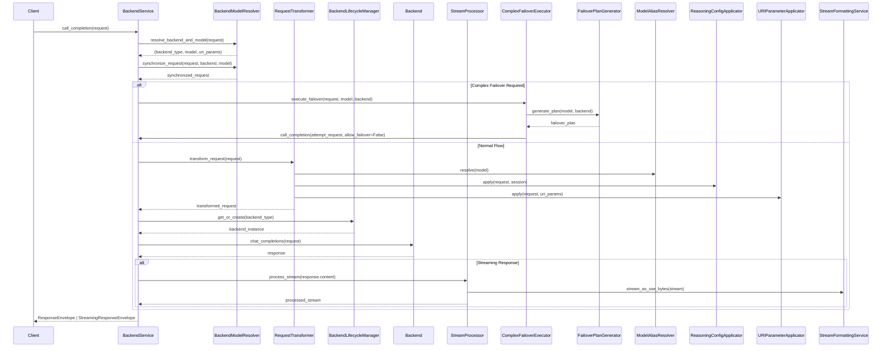
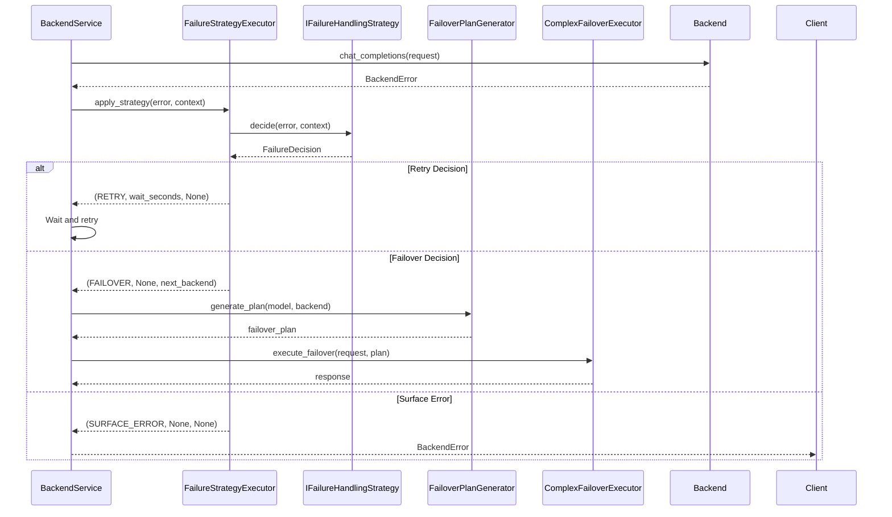

# Design Document: BackendService God Object Refactoring

## Overview

This design document specifies the technical architecture for refactoring the `BackendService` God Object into focused, single-responsibility services following SOLID principles. The refactoring decomposes a monolithic ~2109-line class into an orchestration layer (BackendService) and 6 new specialized services, while preserving all existing public APIs and ensuring zero test regressions.

**Purpose**: This refactoring delivers improved maintainability, testability, and adherence to SOLID principles to developers working with the LLM proxy codebase.

**Users**: Developers maintaining and extending the backend service layer will benefit from clearer separation of concerns and easier testing.

**Impact**: Changes the current monolithic BackendService by extracting responsibilities into dedicated services, reducing BackendService from ~2109 lines to <500 lines of orchestration code.

### Goals

- Decompose BackendService into focused services following Single Responsibility Principle
- Preserve all existing public APIs and test compatibility
- Achieve zero test failures after refactoring
- Reduce BackendService to orchestration-only responsibilities (<500 lines)
- Establish proper dependency injection for all services
- Maintain backward compatibility through wrapper methods

### Non-Goals

- Modifying the public API of BackendService
- Changing the behavior of existing features
- Adding new features or capabilities
- Modifying the wire capture format
- Changing the error hierarchy or exception types
- Modifying configuration schemas or precedence
- Performance optimization (refactoring only, no performance changes)

## Architecture

### Existing Architecture Analysis

**Current State**:
- BackendService (`src/core/services/backend_service.py`) is ~2109 lines
- Constructor has 18+ optional parameters with inline instantiation
- Mixed responsibilities: lifecycle, failover, resolution, transformation, processing, exception handling
- Some services exist but are partially integrated (BackendLifecycleManager, FailoverCoordinator, ExceptionNormalizer)
- Tests access private methods directly

**Existing Patterns**:
- Service-based architecture with DI container (`ServiceCollection`)
- Staged initialization (`src/core/app/stages/`)
- Interface-based design (`I*` naming convention)
- Factory-based service registration for complex dependencies

**Integration Points**:
- BackendService used by `BackendProcessor` (`src/core/services/backend_processor.py`)
- Registered in DI container at `CoreServicesStage`
- Public API defined in `IBackendService` interface

### Architecture Pattern & Boundary Map

**Selected Pattern**: Service-Based Decomposition

**Rationale**:
- Aligns with existing service-based architecture
- Enables SOLID compliance (SRP, DIP, ISP)
- Supports independent testing and maintenance
- Fits existing DI container patterns

**Domain Boundaries**:
- **Orchestration Layer**: BackendService coordinates extracted services
- **Resolution Layer**: BackendModelResolver handles backend/model resolution
- **Transformation Layer**: RequestTransformer coordinates request transformations
- **Processing Layer**: StreamProcessor handles stream processing
- **Failure Layer**: FailureStrategyExecutor and failover services handle failures
- **Lifecycle Layer**: BackendLifecycleManager (existing) handles backend lifecycle

**Architecture Integration**:
- Selected pattern: Service-based decomposition with interface-based communication
- Domain boundaries: Clear separation between orchestration and implementation
- Existing patterns preserved: DI, staged initialization, interface-based design
- New components rationale: Each service addresses a single responsibility from BackendService
- Steering compliance: Follows SOLID principles, DRY, proper DI usage, established OOP patterns

```mermaid
graph TB
    BackendService[BackendService Orchestration]
    BackendModelResolver[BackendModelResolver]
    RequestTransformer[RequestTransformer]
    StreamProcessor[StreamProcessor]
    FailureStrategyExecutor[FailureStrategyExecutor]
    FailoverPlanGenerator[FailoverPlanGenerator]
    ComplexFailoverExecutor[ComplexFailoverExecutor]
    BackendLifecycleManager[BackendLifecycleManager]
    FailoverCoordinator[FailoverCoordinator]
    ExceptionNormalizer[ExceptionNormalizer]
    
    BackendService --> BackendModelResolver
    BackendService --> RequestTransformer
    BackendService --> StreamProcessor
    BackendService --> FailureStrategyExecutor
    BackendService --> FailoverPlanGenerator
    BackendService --> ComplexFailoverExecutor
    BackendService --> BackendLifecycleManager
    BackendService --> FailoverCoordinator
    BackendService --> ExceptionNormalizer
    
    BackendModelResolver --> BackendRoutingService
    BackendModelResolver --> ModelAliasResolver
    BackendModelResolver --> PlanningPhaseManager
    BackendModelResolver --> BackendLifecycleManager
    
    RequestTransformer --> ModelAliasResolver
    RequestTransformer --> ReasoningConfigApplicator
    RequestTransformer --> URIParameterApplicator
    
    StreamProcessor --> StreamFormattingService
    
    FailureStrategyExecutor --> IFailureHandlingStrategy
    FailureStrategyExecutor --> BackendRoutingService
    
    FailoverPlanGenerator --> FailoverCoordinator
    FailoverPlanGenerator --> BackendLifecycleManager
    
    ComplexFailoverExecutor --> FailoverCoordinator
    ComplexFailoverExecutor --> BackendLifecycleManager
    ComplexFailoverExecutor --> BackendModelResolver
```



### Technology Stack

| Layer | Choice / Version | Role in Feature | Notes |
|-------|------------------|-----------------|-------|
| Runtime | Python 3.10+ / FastAPI (async) | Core framework | Use `async/await` for all I/O |
| DI Container | `ServiceCollection` (`src/core/di/container.py`) | Service registration | Singleton lifetime for all new services |
| Initialization | Staged (`src/core/app/stages/core_services.py`) | Service bootstrap | Register in CoreServicesStage after dependencies |
| Interfaces | `src/core/interfaces/` (`I*` naming) | Service contracts | All new services have interfaces |
| Error Handling | `LLMProxyError` hierarchy | Exception handling | Preserve existing error types |
| Testing | pytest | Test framework | Unit tests for each new service |

## System Flows

### Request Processing Flow



### Failure Handling Flow



## Requirements Traceability

| Requirement | Summary | Components | Interfaces | Flows |
|-------------|---------|------------|------------|-------|
| 1.1 | BackendLifecycleManager extraction | BackendLifecycleManager (existing) | IBackendLifecycleManager | Request Processing |
| 1.2 | FailoverCoordinator extraction | FailoverCoordinator (existing), FailoverPlanGenerator, ComplexFailoverExecutor | IFailoverCoordinator, IFailoverPlanGenerator, IComplexFailoverExecutor | Failure Handling |
| 1.3 | BackendModelResolver extraction | BackendModelResolver | IBackendModelResolver | Request Processing |
| 1.4 | RequestTransformer extraction | RequestTransformer | IRequestTransformer | Request Processing |
| 1.5 | ExceptionNormalizer extraction | ExceptionNormalizer (existing) | IExceptionNormalizer | Request Processing |
| 1.6 | StreamProcessor extraction | StreamProcessor | IStreamProcessor | Request Processing |
| 1.7 | FailureStrategyExecutor extraction | FailureStrategyExecutor | IFailureStrategyExecutor | Failure Handling |
| 1.8 | BackendService orchestration | BackendService (refactored) | IBackendService | Request Processing, Failure Handling |
| 2.1-2.7 | DI and loose coupling | All new services | All I* interfaces | DI Registration |
| 3.1-3.8 | Public API preservation | BackendService | IBackendService | All flows |
| 4.1-4.6 | Test coverage | All services | All interfaces | Testing Strategy |
| 5.1-5.6 | Backend lifecycle | BackendLifecycleManager | IBackendLifecycleManager | Request Processing |
| 6.1-6.5 | Failover coordination | FailoverPlanGenerator, ComplexFailoverExecutor | IFailoverPlanGenerator, IComplexFailoverExecutor | Failure Handling |
| 7.1-7.5 | Backend/model resolution | BackendModelResolver | IBackendModelResolver | Request Processing |
| 8.1-8.5 | Request transformation | RequestTransformer | IRequestTransformer | Request Processing |
| 9.1-9.6 | Stream processing | StreamProcessor | IStreamProcessor | Request Processing |
| 10.1-10.5 | Exception normalization | ExceptionNormalizer | IExceptionNormalizer | Request Processing |
| 11.1-11.5 | Failure strategy | FailureStrategyExecutor | IFailureStrategyExecutor | Failure Handling |
| 12.1-12.6 | Code organization | All services | All interfaces | All flows |

## Components and Interfaces

### Component Summary

| Component | Layer | Intent | Req Coverage | DI Lifetime | Contracts |
|-----------|-------|--------|--------------|-------------|-----------|
| BackendService | `src/core/services/` | Orchestrates backend operations | 1.8, 3.1-3.8 | Singleton | IBackendService |
| BackendModelResolver | `src/core/services/` | Resolves backend and model from request | 1.3, 7.1-7.5 | Singleton | IBackendModelResolver |
| RequestTransformer | `src/core/services/` | Coordinates request transformations | 1.4, 8.1-8.5 | Singleton | IRequestTransformer |
| StreamProcessor | `src/core/services/` | Processes streaming responses | 1.6, 9.1-9.6 | Singleton | IStreamProcessor |
| FailureStrategyExecutor | `src/core/services/` | Executes failure handling strategy | 1.7, 11.1-11.5 | Singleton | IFailureStrategyExecutor |
| FailoverPlanGenerator | `src/core/services/` | Generates failover plans | 1.2, 6.1-6.5 | Singleton | IFailoverPlanGenerator |
| ComplexFailoverExecutor | `src/core/services/` | Executes complex failover logic | 1.2, 6.1-6.5 | Singleton | IComplexFailoverExecutor |

### Services Layer (`src/core/services/`)

#### BackendService (Refactored)

| Field | Detail |
|-------|--------|
| Intent | Orchestrates backend operations by coordinating extracted services |
| Requirements | 1.8, 3.1-3.8, 12.1-12.6 |
| Interface | `IBackendService` in `src/core/interfaces/backend_service.py` |
| DI Lifetime | Singleton |

**Responsibilities & Constraints**
- Coordinates extracted services to fulfill `IBackendService` contract
- Preserves all public API methods unchanged
- Maintains wrapper methods for backward compatibility
- Single responsibility: Orchestration only (no business logic)

**Dependencies (via DI)**
- Inbound: All extracted services injected via constructor
- Outbound: Delegates to BackendModelResolver, RequestTransformer, StreamProcessor, FailureStrategyExecutor, FailoverPlanGenerator, ComplexFailoverExecutor, BackendLifecycleManager, FailoverCoordinator, ExceptionNormalizer
- External: None

**Contracts**: Service [✓]

##### Service Interface
```python
from abc import ABC, abstractmethod
from src.core.domain.chat import ChatRequest
from src.core.domain.request_context import RequestContext
from src.core.domain.responses import ResponseEnvelope, StreamingResponseEnvelope

class IBackendService(ABC):
    @abstractmethod
    async def call_completion(
        self,
        request: ChatRequest,
        stream: bool = False,
        allow_failover: bool = True,
        context: RequestContext | None = None,
    ) -> ResponseEnvelope | StreamingResponseEnvelope:
        """Call the LLM backend for a completion."""
        ...
    
    @abstractmethod
    async def validate_backend_and_model(
        self, backend: str, model: str
    ) -> tuple[bool, str | None]:
        """Validate that a backend and model combination is valid."""
        ...
    
    @abstractmethod
    async def chat_completions(
        self, request: ChatRequest, **kwargs: Any
    ) -> ResponseEnvelope | StreamingResponseEnvelope:
        """Handle chat completions with the LLM."""
        ...
    
    @abstractmethod
    def get_backend(self, backend_type: str) -> LLMBackend:
        """Get a backend instance synchronously (for testing purposes)."""
        ...
    
    @abstractmethod
    def get_active_backends(self) -> dict[str, LLMBackend]:
        """Get all active backend instances."""
        ...
```

- Preconditions: Request must be valid ChatRequest, context optional
- Postconditions: Returns ResponseEnvelope or StreamingResponseEnvelope, preserves all existing behavior
- Invariants: Public API unchanged, wrapper methods delegate correctly

##### DI Registration (in CoreServicesStage)
```python
def _backend_service_factory(provider: IServiceProvider) -> BackendService:
    return BackendService(
        backend_model_resolver=provider.get_required_service(IBackendModelResolver),
        request_transformer=provider.get_required_service(IRequestTransformer),
        stream_processor=provider.get_required_service(IStreamProcessor),
        failure_strategy_executor=provider.get_required_service(IFailureStrategyExecutor),
        failover_plan_generator=provider.get_required_service(IFailoverPlanGenerator),
        complex_failover_executor=provider.get_required_service(IComplexFailoverExecutor),
        backend_lifecycle_manager=provider.get_required_service(IBackendLifecycleManager),
        failover_coordinator=provider.get_required_service(IFailoverCoordinator),
        exception_normalizer=provider.get_required_service(IExceptionNormalizer),
        # ... other existing dependencies
    )

_add_singleton(IBackendService, implementation_factory=_backend_service_factory)
```

#### BackendModelResolver

| Field | Detail |
|-------|--------|
| Intent | Resolves backend type, effective model, and URI parameters from request and session |
| Requirements | 1.3, 7.1-7.5 |
| Interface | `IBackendModelResolver` in `src/core/interfaces/backend_model_resolver_interface.py` |
| DI Lifetime | Singleton |

**Responsibilities & Constraints**
- Resolves backend type from session, request, or default configuration
- Applies model aliases before backend parsing
- Handles backend routing and discovery
- Parses URI parameters from model string
- Applies static route overrides
- Synchronizes request with resolved backend/model

**Dependencies (via DI)**
- Inbound: BackendRoutingService, ModelAliasResolver, PlanningPhaseManager, IBackendLifecycleManager, ISessionService, IConfig
- Outbound: Calls BackendRoutingService.resolve_backend_instance(), ModelAliasResolver.resolve(), PlanningPhaseManager.apply_if_needed()
- External: None

**Contracts**: Service [✓]

##### Service Interface
```python
from abc import ABC, abstractmethod
from src.core.domain.chat import ChatRequest

class IBackendModelResolver(ABC):
    @abstractmethod
    async def resolve_backend_and_model(
        self, request: ChatRequest
    ) -> tuple[str, str, dict[str, Any]]:
        """Resolve backend type, effective model, and URI parameters.
        
        Returns:
            Tuple of (backend_type, effective_model, uri_params)
        """
        ...
    
    @abstractmethod
    def synchronize_request_with_target(
        self, request: ChatRequest, backend_type: str, effective_model: str
    ) -> ChatRequest:
        """Ensure request reflects resolved backend/model.
        
        Returns:
            Request updated with backend/model information
        """
        ...
```

- Preconditions: Request must be valid ChatRequest
- Postconditions: Returns resolved backend, model, and URI parameters; request synchronized
- Invariants: Model aliases applied before parsing, static route applied last

##### DI Registration
```python
def _backend_model_resolver_factory(provider: IServiceProvider) -> BackendModelResolver:
    return BackendModelResolver(
        routing_service=provider.get_required_service(BackendRoutingService),
        model_alias_resolver=provider.get_required_service(IModelAliasResolver),
        planning_phase_manager=provider.get_required_service(IPlanningPhaseManager),
        backend_lifecycle_manager=provider.get_required_service(IBackendLifecycleManager),
        session_service=provider.get_required_service(ISessionService),
        config=provider.get_required_service(IConfig),
    )

_add_singleton(IBackendModelResolver, implementation_factory=_backend_model_resolver_factory)
```

#### RequestTransformer

| Field | Detail |
|-------|--------|
| Intent | Coordinates request transformations (model aliases, reasoning config, URI parameters) |
| Requirements | 1.4, 8.1-8.5 |
| Interface | `IRequestTransformer` in `src/core/interfaces/request_transformer_interface.py` |
| DI Lifetime | Singleton |

**Responsibilities & Constraints**
- Coordinates model alias resolution
- Applies reasoning configuration
- Applies URI parameters
- Preserves transformation order: aliases → reasoning → URI parameters

**Dependencies (via DI)**
- Inbound: ModelAliasResolver, ReasoningConfigApplicator, URIParameterApplicator
- Outbound: Calls ModelAliasResolver.resolve(), ReasoningConfigApplicator.apply(), URIParameterApplicator.apply()
- External: None

**Contracts**: Service [✓]

##### Service Interface
```python
from abc import ABC, abstractmethod
from src.core.domain.chat import ChatRequest

class IRequestTransformer(ABC):
    @abstractmethod
    def apply_model_aliases(self, model: str) -> str:
        """Apply model alias resolution."""
        ...
    
    @abstractmethod
    def apply_reasoning_config(
        self, request: ChatRequest, session: Any
    ) -> ChatRequest:
        """Apply reasoning configuration from session."""
        ...
    
    @abstractmethod
    def apply_uri_parameters(
        self,
        request: ChatRequest,
        uri_params: dict[str, Any],
        backend_type: str,
        session: Any | None = None,
    ) -> ChatRequest:
        """Apply URI parameters with precedence resolution."""
        ...
    
    @abstractmethod
    def transform_request(
        self,
        request: ChatRequest,
        uri_params: dict[str, Any],
        backend_type: str,
        session: Any | None = None,
    ) -> ChatRequest:
        """Apply all transformations in correct order."""
        ...
```

- Preconditions: Request must be valid ChatRequest, session optional
- Postconditions: Returns transformed request with all transformations applied
- Invariants: Transformation order preserved (aliases → reasoning → URI params)

##### DI Registration
```python
def _request_transformer_factory(provider: IServiceProvider) -> RequestTransformer:
    return RequestTransformer(
        model_alias_resolver=provider.get_required_service(IModelAliasResolver),
        reasoning_config_applicator=provider.get_required_service(IReasoningConfigApplicator),
        uri_parameter_applicator=provider.get_required_service(IURIParameterApplicator),
    )

_add_singleton(IRequestTransformer, implementation_factory=_request_transformer_factory)
```

#### StreamProcessor

| Field | Detail |
|-------|--------|
| Intent | Processes streaming responses (SSE encoding, session ID resolution, token validation) |
| Requirements | 1.6, 9.1-9.6 |
| Interface | `IStreamProcessor` in `src/core/interfaces/stream_processor_interface.py` |
| DI Lifetime | Singleton |

**Responsibilities & Constraints**
- Converts domain chunks to SSE-encoded bytes
- Resolves stream session ID from context/request
- Validates completion tokens
- Integrates with StreamFormattingService

**Dependencies (via DI)**
- Inbound: IStreamFormattingService
- Outbound: Calls StreamFormattingService.stream_as_sse_bytes(), StreamFormattingService.is_valid_completion_token()
- External: None

**Contracts**: Service [✓]

##### Service Interface
```python
from abc import ABC, abstractmethod
from collections.abc import AsyncIterator
from src.core.domain.chat import ChatRequest
from src.core.domain.request_context import RequestContext

class IStreamProcessor(ABC):
    @abstractmethod
    def stream_as_sse_bytes(
        self, stream: AsyncIterator[Any]
    ) -> AsyncIterator[bytes]:
        """Convert domain chunks to SSE-encoded bytes."""
        ...
    
    @abstractmethod
    def resolve_stream_session_id(
        self,
        session_id: str | None,
        context: RequestContext | None,
        request: ChatRequest,
    ) -> str:
        """Resolve stable identifier for streaming capture."""
        ...
    
    @abstractmethod
    def is_valid_completion_token(self, chunk: Any) -> bool:
        """Check if chunk contains valid completion content."""
        ...
```

- Preconditions: Stream must be valid AsyncIterator, context/request optional
- Postconditions: Returns SSE-encoded bytes stream, valid session ID, token validation result
- Invariants: SSE format matches current implementation, session ID resolution preserves behavior

##### DI Registration
```python
def _stream_processor_factory(provider: IServiceProvider) -> StreamProcessor:
    return StreamProcessor(
        stream_formatting_service=provider.get_required_service(IStreamFormattingService),
    )

_add_singleton(IStreamProcessor, implementation_factory=_stream_processor_factory)
```

#### FailureStrategyExecutor

| Field | Detail |
|-------|--------|
| Intent | Executes failure handling strategy to decide retry/failover/surface error |
| Requirements | 1.7, 11.1-11.5 |
| Interface | `IFailureStrategyExecutor` in `src/core/interfaces/failure_strategy_executor_interface.py` |
| DI Lifetime | Singleton |

**Responsibilities & Constraints**
- Applies failure handling strategy
- Finds available backend alternatives
- Returns failure decision (retry/failover/surface error)
- Preserves existing failure decision logic

**Dependencies (via DI)**
- Inbound: IFailureHandlingStrategy, BackendRoutingService
- Outbound: Calls IFailureHandlingStrategy.decide(), BackendRoutingService.find_alternative_instances()
- External: None

**Contracts**: Service [✓]

##### Service Interface
```python
from abc import ABC, abstractmethod
from src.core.common.exceptions import BackendError
from src.core.interfaces.failure_strategy_interface import FailureDecision

class IFailureStrategyExecutor(ABC):
    @abstractmethod
    async def apply_failure_strategy(
        self,
        error: BackendError,
        model: str,
        backend_type: str,
        attempted_backends: list[str],
        start_time: float,
        is_streaming: bool,
        content_started: bool,
    ) -> tuple[FailureDecision, float | None, str | None]:
        """Apply failure handling strategy.
        
        Returns:
            Tuple of (decision, wait_seconds, next_backend)
        """
        ...
```

- Preconditions: Error must be BackendError, context must be valid
- Postconditions: Returns failure decision with optional wait time and next backend
- Invariants: Decision logic matches current implementation

##### DI Registration
```python
def _failure_strategy_executor_factory(provider: IServiceProvider) -> FailureStrategyExecutor:
    return FailureStrategyExecutor(
        failure_strategy=provider.get_service(IFailureHandlingStrategy),
        routing_service=provider.get_service(BackendRoutingService),
    )

_add_singleton(IFailureStrategyExecutor, implementation_factory=_failure_strategy_executor_factory)
```

#### FailoverPlanGenerator

| Field | Detail |
|-------|--------|
| Intent | Generates failover plans and filters unhealthy backends |
| Requirements | 1.2, 6.1-6.5 |
| Interface | `IFailoverPlanGenerator` in `src/core/interfaces/failover_plan_generator_interface.py` |
| DI Lifetime | Singleton |

**Responsibilities & Constraints**
- Generates ordered failover plan from failover coordinator or strategy
- Filters out unhealthy backends using circuit breaker
- Handles permanently disabled backends
- Returns filtered failover plan

**Dependencies (via DI)**
- Inbound: IFailoverCoordinator, IBackendLifecycleManager, IConfig, IApplicationState, IFailoverStrategy (optional)
- Outbound: Calls IFailoverCoordinator.get_failover_attempts(), IBackendLifecycleManager.get_disabled_backends(), IBackendLifecycleManager.get_active_backends()
- External: None

**Contracts**: Service [✓]

##### Service Interface
```python
from abc import ABC, abstractmethod

class IFailoverPlanGenerator(ABC):
    @abstractmethod
    def get_failover_plan(
        self, model: str, backend_type: str
    ) -> list[tuple[str, str]]:
        """Return ordered plan of (backend, model) attempts."""
        ...
    
    @abstractmethod
    def filter_unhealthy_backends(
        self, plan: list[tuple[str, str]]
    ) -> list[tuple[str, str]]:
        """Filter out backends with unhealthy API endpoints."""
        ...
```

- Preconditions: Model and backend_type must be valid strings
- Postconditions: Returns ordered failover plan, filtered plan excludes unhealthy backends
- Invariants: Plan order preserved, fallback to original plan if all filtered

##### DI Registration
```python
def _failover_plan_generator_factory(provider: IServiceProvider) -> FailoverPlanGenerator:
    return FailoverPlanGenerator(
        failover_coordinator=provider.get_required_service(IFailoverCoordinator),
        backend_lifecycle_manager=provider.get_required_service(IBackendLifecycleManager),
        config=provider.get_required_service(IConfig),
        app_state=provider.get_service(IApplicationState),
        failover_strategy=provider.get_service(IFailoverStrategy),
    )

_add_singleton(IFailoverPlanGenerator, implementation_factory=_failover_plan_generator_factory)
```

#### ComplexFailoverExecutor

| Field | Detail |
|-------|--------|
| Intent | Executes complex failover logic with plan attempts |
| Requirements | 1.2, 6.1-6.5 |
| Interface | `IComplexFailoverExecutor` in `src/core/interfaces/complex_failover_executor_interface.py` |
| DI Lifetime | Singleton |

**Responsibilities & Constraints**
- Executes complex failover for models with configured routes
- Attempts failover plan with recursive calls to BackendService
- Handles errors during failover attempts
- Returns first successful response or raises BackendError

**Dependencies (via DI)**
- Inbound: IFailoverCoordinator, IBackendLifecycleManager, IBackendModelResolver, IBackendService (for recursive calls)
- Outbound: Calls IBackendService.call_completion() recursively, IBackendModelResolver methods
- External: None

**Contracts**: Service [✓]

##### Service Interface
```python
from abc import ABC, abstractmethod
from src.core.domain.chat import ChatRequest
from src.core.domain.request_context import RequestContext
from src.core.domain.responses import ResponseEnvelope, StreamingResponseEnvelope

class IComplexFailoverExecutor(ABC):
    @abstractmethod
    async def execute_complex_failover(
        self,
        request: ChatRequest,
        effective_model: str,
        backend_type: str,
        effective_failover_routes: dict[str, Any],
        stream: bool,
        context: RequestContext | None,
    ) -> ResponseEnvelope | StreamingResponseEnvelope:
        """Execute complex failover strategy for models with configured routes."""
        ...
    
    @abstractmethod
    async def attempt_failover_plan(
        self,
        request: ChatRequest,
        plan: list[tuple[str, str]],
        stream: bool,
        backend_type: str,
        context: RequestContext | None = None,
    ) -> ResponseEnvelope | StreamingResponseEnvelope:
        """Attempt failover using the provided plan."""
        ...
```

- Preconditions: Request must be valid, plan must be non-empty
- Postconditions: Returns first successful response or raises BackendError if all fail
- Invariants: Recursive calls use `allow_failover=False`, errors wrapped in BackendError

##### DI Registration
```python
def _complex_failover_executor_factory(provider: IServiceProvider) -> ComplexFailoverExecutor:
    return ComplexFailoverExecutor(
        failover_coordinator=provider.get_required_service(IFailoverCoordinator),
        backend_lifecycle_manager=provider.get_required_service(IBackendLifecycleManager),
        backend_model_resolver=provider.get_required_service(IBackendModelResolver),
        backend_service=provider.get_required_service(IBackendService),  # For recursive calls
    )

_add_singleton(IComplexFailoverExecutor, implementation_factory=_complex_failover_executor_factory)
```

## Data Models

### Domain Model (`src/core/domain/`)

**No Changes Required**: Existing domain models (`ChatRequest`, `ResponseEnvelope`, `StreamingResponseEnvelope`, `RequestContext`) remain unchanged.

### Configuration Model (`src/core/config/`)

**No Changes Required**: No new configuration options needed. Existing configuration structures are sufficient.

## Error Handling

### Error Hierarchy

All errors extend `LLMProxyError` from `src/core/common/exceptions.py`. No changes to error hierarchy.

| Error Type | HTTP Status | Use Case |
|------------|-------------|----------|
| `BackendError` | 502 | Backend failures (preserved) |
| `RateLimitExceededError` | 429 | Rate limiting (preserved) |
| `AuthenticationError` | 401 | Auth failures (preserved) |

### Error Strategy

- Catch specific exceptions, never bare `except Exception`
- Log with `exc_info=True` for stack traces
- Preserve existing error messages and types
- ExceptionNormalizer handles provider-specific exception normalization

## Testing Strategy

### Test Organization

Tests mirror source structure under `tests/`:
- `tests/unit/core/services/` - Unit tests for new services
- `tests/integration/` - Cross-component integration tests
- `tests/property/` - Property-based tests for API stability

### Unit Tests (`tests/unit/core/services/`)

**New Test Files**:
- `test_backend_model_resolver.py` - BackendModelResolver logic with mocked dependencies
- `test_request_transformer.py` - RequestTransformer coordination logic
- `test_stream_processor.py` - StreamProcessor SSE encoding and session ID resolution
- `test_failure_strategy_executor.py` - FailureStrategyExecutor decision logic
- `test_failover_plan_generator.py` - FailoverPlanGenerator plan generation and filtering
- `test_complex_failover_executor.py` - ComplexFailoverExecutor failover execution

**Characterization Tests**:
- `test_backend_service_characterization.py` - Verify behavior preservation after refactoring
- Tests verify exact behavior matches current implementation
- Cover edge cases and error scenarios

**Existing Tests**:
- All tests in `test_backend_service*.py` must pass without modification
- Tests access private methods via wrapper methods (preserved)

### Integration Tests (`tests/integration/`)

- DI container wiring verification for all new services
- End-to-end request flow with refactored BackendService
- Failover flow integration tests

### Property Tests (`tests/property/`)

- API stability verification (`test_backend_service_api_preservation.py`)
- Invariant preservation under random inputs
- Behavior equivalence between old and new implementation

### Test Commands
```bash
# Unit tests for new services
./.venv/Scripts/python.exe -m pytest tests/unit/core/services/test_backend_model_resolver.py -v
./.venv/Scripts/python.exe -m pytest tests/unit/core/services/test_request_transformer.py -v
./.venv/Scripts/python.exe -m pytest tests/unit/core/services/test_stream_processor.py -v
./.venv/Scripts/python.exe -m pytest tests/unit/core/services/test_failure_strategy_executor.py -v
./.venv/Scripts/python.exe -m pytest tests/unit/core/services/test_failover_plan_generator.py -v
./.venv/Scripts/python.exe -m pytest tests/unit/core/services/test_complex_failover_executor.py -v

# Existing BackendService tests (must pass)
./.venv/Scripts/python.exe -m pytest tests/unit/core/services/test_backend_service*.py -v

# Full suite
./.venv/Scripts/python.exe -m pytest -m "not slow"
```

## Stage Registration

**Registration Stage**: `CoreServicesStage` (`src/core/app/stages/core_services.py`)

**Stage Dependencies**:
1. InfrastructureStage (provides DI container)
2. CoreServicesStage registers new services before BackendService

**Registration Order**:
1. Register BackendModelResolver
2. Register RequestTransformer
3. Register StreamProcessor
4. Register FailureStrategyExecutor
5. Register FailoverPlanGenerator
6. Register ComplexFailoverExecutor
7. Register refactored BackendService (depends on all above)

## Performance & Scalability

**Performance Impact**: Negligible (< 0.1ms per request)
- Additional service calls are in-process method calls
- No network I/O added
- Services are singletons (no object creation overhead)

**Scalability**: No changes
- Refactoring preserves existing scalability characteristics
- No new bottlenecks introduced

## Security Considerations

**No Changes Required**:
- API key handling preserved through existing services
- Input validation preserved through existing validation
- Authentication flow unchanged
- Error messages preserved (no information leakage)

## Invariants and Gotchas to Preserve

### Critical Invariants

1. **Model Alias Order**: Model aliases MUST be applied before backend parsing
2. **Static Route Override**: Static route override MUST be applied after all resolution
3. **Transformation Order**: Request transformations MUST follow: aliases → reasoning → URI params
4. **Failover Recursion**: Complex failover MUST call BackendService with `allow_failover=False` to prevent infinite loops
5. **Session ID Resolution**: Stream session ID resolution MUST preserve current fallback logic (context → request → extra_body → request_id → uuid)
6. **Error Wrapping**: All failover errors MUST be wrapped in BackendError with appropriate messages

### Gotchas

1. **Backend Lifecycle**: Per-session backends use cache keys like `"{backend_type}:{session_id}"` - preserve this logic
2. **Planning Phase**: Planning phase manager modifies session state - preserve side effects
3. **Wire Capture**: Wire capture depends on session_id resolution - preserve exact behavior
4. **Usage Tracking**: Usage tracking wrapper depends on stream formatting - preserve integration
5. **Test Access**: Tests access private methods - wrapper methods must preserve exact signatures

## Migration Strategy

### Phased Approach

1. **Phase 1**: Create interfaces and service skeletons
2. **Phase 2**: Extract BackendModelResolver (simplest extraction)
3. **Phase 3**: Extract RequestTransformer (coordination service)
4. **Phase 4**: Extract StreamProcessor (stream handling)
5. **Phase 5**: Extract FailureStrategyExecutor (failure handling)
6. **Phase 6**: Extract FailoverPlanGenerator and ComplexFailoverExecutor (failover logic)
7. **Phase 7**: Refactor BackendService constructor (remove optional params)
8. **Phase 8**: Verify all tests pass, remove wrapper methods if desired (optional)

### Rollback Plan

- Each phase committed separately
- Git tags after each successful phase
- Can rollback to any phase if issues arise
- Wrapper methods enable gradual migration

## Supporting References

- Research findings: `.kiro/specs/backend-service-god-object-refactoring/research.md`
- Gap analysis: `.kiro/specs/backend-service-god-object-refactoring/gap-analysis.md`
- Existing BackendService: `src/core/services/backend_service.py`
- DI registration patterns: `src/core/di/services.py:2821-3003`
- Test patterns: `tests/unit/core/services/test_backend_service*.py`
