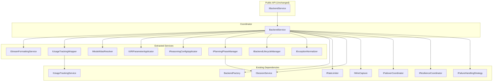

# Design Document: BackendService Refactoring

## Overview

This design document describes the refactoring of the `BackendService` class from a monolithic "God Object" into a set of focused, single-responsibility services. The current `BackendService` (~3200 lines) handles too many concerns including stream formatting, usage tracking, model aliasing, URI parameter resolution, reasoning configuration, planning phase management, backend lifecycle, and exception normalization.

The refactoring follows SOLID principles, particularly:
- **SRP**: Each new service has one clear responsibility
- **OCP**: Services are open for extension via interfaces
- **LSP**: All implementations are substitutable for their interfaces
- **ISP**: Interfaces are focused and minimal
- **DIP**: High-level modules depend on abstractions

## Architecture

The refactored architecture decomposes `BackendService` into a coordinator that delegates to specialized services:



## Components and Interfaces

### 1. IStreamFormattingService

**Location**: `src/core/interfaces/stream_formatting_interface.py`
**Implementation**: `src/core/services/stream_formatting_service.py`

**Responsibility**: Convert domain chunks to SSE-encoded bytes and validate completion tokens.

```python
from abc import ABC, abstractmethod
from typing import Any, AsyncIterator

class IStreamFormattingService(ABC):
    @abstractmethod
    def stream_as_sse_bytes(self, stream: AsyncIterator[Any]) -> AsyncIterator[bytes]:
        """Convert domain chunks to SSE-encoded bytes."""
    
    @abstractmethod
    def is_valid_completion_token(self, chunk: Any) -> bool:
        """Check if chunk contains valid completion content."""
    
    @abstractmethod
    def format_chunk_as_sse(self, content: Any) -> bytes:
        """Format a single chunk as SSE bytes."""
    
    @abstractmethod
    def chunk_signals_done(self, content: Any, metadata: dict[str, Any] | None) -> bool:
        """Check if chunk signals stream completion."""
```

### 2. IUsageTrackingWrapper

**Location**: `src/core/interfaces/usage_tracking_wrapper_interface.py`
**Implementation**: `src/core/services/usage_tracking_wrapper.py`

**Responsibility**: Wrap streams to track usage metrics (TTFT, TPS, completion tokens).

```python
from abc import ABC, abstractmethod
from typing import Any, AsyncIterator

class IUsageTrackingWrapper(ABC):
    @abstractmethod
    def wrap_stream_for_usage(
        self,
        stream: AsyncIterator[Any],
        ctp_record_id: str | None,
        ptb_record_id: str | None,
        start_time: float,
        token_validator: Any,
    ) -> AsyncIterator[Any]:
        """Wrap stream to track usage metrics."""
```

### 3. IModelAliasResolver

**Location**: `src/core/interfaces/model_alias_resolver_interface.py`
**Implementation**: `src/core/services/model_alias_resolver.py`

**Responsibility**: Apply regex-based model name transformations.

```python
from abc import ABC, abstractmethod
from typing import Any

class IModelAliasResolver(ABC):
    @abstractmethod
    def resolve(self, model: str, aliases: list[Any] | None) -> str:
        """Apply model aliases and return resolved model name."""
```

### 4. IURIParameterApplicator

**Location**: `src/core/interfaces/uri_parameter_applicator_interface.py`
**Implementation**: `src/core/services/uri_parameter_applicator.py`

**Responsibility**: Resolve and apply URI parameters with proper precedence.

```python
from abc import ABC, abstractmethod
from typing import Any
from src.core.domain.chat import ChatRequest

class IURIParameterApplicator(ABC):
    @abstractmethod
    def apply(
        self,
        request: ChatRequest,
        uri_params: dict[str, Any],
        backend_type: str,
        session: Any | None,
        config: Any,
    ) -> ChatRequest:
        """Apply URI parameters to request with precedence resolution."""
```

### 5. IReasoningConfigApplicator

**Location**: `src/core/interfaces/reasoning_config_applicator_interface.py`
**Implementation**: `src/core/services/reasoning_config_applicator.py`

**Responsibility**: Apply reasoning configuration from session to requests.

```python
from abc import ABC, abstractmethod
from typing import Any
from src.core.domain.chat import ChatRequest

class IReasoningConfigApplicator(ABC):
    @abstractmethod
    def apply(self, request: ChatRequest, session: Any) -> ChatRequest:
        """Apply reasoning configuration from session to request."""
```

### 6. IPlanningPhaseManager

**Location**: `src/core/interfaces/planning_phase_manager_interface.py`
**Implementation**: `src/core/services/planning_phase_manager.py`

**Responsibility**: Manage planning phase model overrides and counter tracking.

```python
from abc import ABC, abstractmethod
from typing import Any

class IPlanningPhaseManager(ABC):
    @abstractmethod
    async def apply_if_needed(
        self, session: Any, default_backend: str
    ) -> None:
        """Apply planning phase model override if conditions are met."""
    
    @abstractmethod
    async def update_counters(self, session_id: str, response: Any) -> None:
        """Update planning phase counters after completion."""
    
    @abstractmethod
    def count_file_writes(self, response: Any) -> int:
        """Count file write tool calls in response."""
```

### 7. IBackendLifecycleManager

**Location**: `src/core/interfaces/backend_lifecycle_manager_interface.py`
**Implementation**: `src/core/services/backend_lifecycle_manager.py`

**Responsibility**: Manage backend instance creation, caching, and shutdown.

```python
from abc import ABC, abstractmethod
from typing import Any
from src.connectors.base import LLMBackend

class IBackendLifecycleManager(ABC):
    @abstractmethod
    async def get_or_create(
        self, backend_type: str, session_id: str | None = None
    ) -> LLMBackend:
        """Get existing backend or create new one."""
    
    @abstractmethod
    async def shutdown(self, backend: LLMBackend) -> None:
        """Shutdown backend with proper cleanup."""
    
    @abstractmethod
    def discard(
        self, backend_type: str, session_id: str | None, reason: str
    ) -> None:
        """Discard and disable a backend instance."""
    
    @abstractmethod
    def is_disabled(self, backend_type: str) -> bool:
        """Check if backend is permanently disabled."""
    
    @abstractmethod
    def get_active_backends(self) -> dict[str, LLMBackend]:
        """Get all active backend instances."""
```

### 8. IExceptionNormalizer

**Location**: `src/core/interfaces/exception_normalizer_interface.py`
**Implementation**: `src/core/services/exception_normalizer.py`

**Responsibility**: Translate provider exceptions to domain-specific errors.

```python
from abc import ABC, abstractmethod

class IExceptionNormalizer(ABC):
    @abstractmethod
    def normalize(self, exc: Exception, backend_type: str) -> Exception:
        """Translate provider exception to domain error."""
```

## Data Models

No new data models are required. The refactoring uses existing domain models:

- `ChatRequest`: Request payload for chat completions
- `ResponseEnvelope`: Non-streaming response wrapper
- `StreamingResponseEnvelope`: Streaming response wrapper
- `ProcessedResponse`: Processed chunk from response processor
- `BackendError`, `RateLimitExceededError`, `InvalidRequestError`: Domain exceptions

## Correctness Properties

*A property is a characteristic or behavior that should hold true across all valid executions of a system-essentially, a formal statement about what the system should do. Properties serve as the bridge between human-readable specifications and machine-verifiable correctness guarantees.*

### Property 1: SSE Format Consistency
*For any* valid domain chunk (ProcessedResponse, dict, str, or bytes), formatting it as SSE SHALL produce bytes starting with "data: " and ending with "\n\n".
**Validates: Requirements 5.1, 5.3**

### Property 2: Done Marker Detection
*For any* chunk containing "[DONE]" or finish_reason, the stream formatter SHALL detect it as signaling completion.
**Validates: Requirements 5.4**

### Property 3: Valid Token Identification
*For any* chunk, the token validator SHALL return true only if the chunk contains actual content (not empty, not [DONE], not keepalive).
**Validates: Requirements 5.2**

### Property 4: Usage Accumulation
*For any* stream with usage data in chunks, the usage wrapper SHALL accumulate and report the final usage on completion.
**Validates: Requirements 6.2, 6.3**

### Property 5: Model Alias Round-Trip
*For any* model name and alias configuration, applying aliases and then checking if the result matches the expected pattern SHALL be consistent.
**Validates: Requirements 7.1, 7.2**

### Property 6: Alias Graceful Degradation
*For any* invalid regex pattern in aliases, the resolver SHALL return the original model name without throwing.
**Validates: Requirements 7.3, 7.4**

### Property 7: Parameter Precedence
*For any* conflicting parameter values from different sources, the applicator SHALL apply session > URI > headers > config precedence.
**Validates: Requirements 8.1, 8.2**

### Property 8: Parameter Type Coercion
*For any* parameter value, the applicator SHALL coerce to the correct type (float for temperature/top_p, int for top_k, str for reasoning_effort).
**Validates: Requirements 8.3**

### Property 9: Reasoning Config Application
*For any* session with reasoning configuration, applying it to a request SHALL update the request with the configured parameters.
**Validates: Requirements 9.1, 9.2**

### Property 10: Planning Phase Transition
*For any* session in planning phase that exceeds max_turns or max_file_writes, the manager SHALL restore the original route.
**Validates: Requirements 10.1, 10.3**

### Property 11: File Write Counting
*For any* response with tool calls, the manager SHALL correctly count file write operations.
**Validates: Requirements 10.4**

### Property 12: Backend Cache LRU
*For any* sequence of backend requests exceeding the cache limit, the lifecycle manager SHALL evict the least recently used backend.
**Validates: Requirements 11.1**

### Property 13: Exception Translation
*For any* HTTPException with status 429, the normalizer SHALL produce a RateLimitExceededError with preserved retry-after.
**Validates: Requirements 12.1, 12.4**

### Property 14: API Signature Preservation
*For any* call to BackendService public methods, the signature and return type SHALL match the IBackendService interface.
**Validates: Requirements 3.1-3.6**

## Error Handling

Each extracted service follows consistent error handling:

1. **StreamFormattingService**: Catches encoding errors, logs at DEBUG, returns safe fallback bytes
2. **UsageTrackingWrapper**: Catches tracking errors in finally block, logs at ERROR, does not propagate
3. **ModelAliasResolver**: Catches regex errors, logs at WARNING, returns original model
4. **URIParameterApplicator**: Catches validation/resolution errors, logs at ERROR, returns original request
5. **ReasoningConfigApplicator**: Catches config errors, logs at DEBUG, returns original request
6. **PlanningPhaseManager**: Catches session errors, logs at WARNING, continues without planning phase
7. **BackendLifecycleManager**: Catches shutdown errors, logs at EXCEPTION level, continues cleanup
8. **ExceptionNormalizer**: Never throws, always returns a normalized exception

## Testing Strategy

### Unit Testing

Each extracted service will have dedicated unit tests:

- `tests/unit/core/services/test_stream_formatting_service.py`
- `tests/unit/core/services/test_usage_tracking_wrapper.py`
- `tests/unit/core/services/test_model_alias_resolver.py`
- `tests/unit/core/services/test_uri_parameter_applicator.py`
- `tests/unit/core/services/test_reasoning_config_applicator.py`
- `tests/unit/core/services/test_planning_phase_manager.py`
- `tests/unit/core/services/test_backend_lifecycle_manager.py`
- `tests/unit/core/services/test_exception_normalizer.py`

### Property-Based Testing

Property-based tests will use **Hypothesis** (already used in the project) to verify correctness properties:

- Each property test will run a minimum of 100 iterations
- Tests will be tagged with the format: `**Feature: backend-service-refactoring, Property {number}: {property_text}**`
- Generators will be designed to produce valid domain objects

### Regression Testing

All existing tests in `tests/unit/core/services/test_backend_service*.py` must pass without modification after refactoring.

## Implementation Notes

### Refactored BackendService Constructor

```python
class BackendService(IBackendService):
    def __init__(
        self,
        factory: BackendFactory,
        rate_limiter: IRateLimiter,
        config: IConfig,
        session_service: ISessionService,
        app_state: IApplicationState,
        # Existing optional dependencies
        backend_config_provider: IBackendConfigProvider | None = None,
        failover_coordinator: IFailoverCoordinator | None = None,
        failover_strategy: IFailoverStrategy | None = None,
        wire_capture: IWireCapture | None = None,
        routing_service: BackendRoutingService | None = None,
        resilience_coordinator: IResilienceCoordinator | None = None,
        failure_handling_strategy: IFailureHandlingStrategy | None = None,
        usage_tracking_service: IUsageTrackingService | None = None,
        # NEW extracted service dependencies
        stream_formatting_service: IStreamFormattingService | None = None,
        usage_tracking_wrapper: IUsageTrackingWrapper | None = None,
        model_alias_resolver: IModelAliasResolver | None = None,
        uri_parameter_applicator: IURIParameterApplicator | None = None,
        reasoning_config_applicator: IReasoningConfigApplicator | None = None,
        planning_phase_manager: IPlanningPhaseManager | None = None,
        backend_lifecycle_manager: IBackendLifecycleManager | None = None,
        exception_normalizer: IExceptionNormalizer | None = None,
    ):
        # ... initialization with fallback to default implementations
```

### Backward Compatibility

To maintain backward compatibility:

1. All new dependencies are optional with `None` default
2. When `None`, BackendService creates default implementations internally
3. This allows gradual migration and doesn't break existing instantiation code
4. DI container will be updated to inject the new services

### File Organization

```
src/core/
├── interfaces/
│   ├── stream_formatting_interface.py      # NEW
│   ├── usage_tracking_wrapper_interface.py # NEW
│   ├── model_alias_resolver_interface.py   # NEW
│   ├── uri_parameter_applicator_interface.py # NEW
│   ├── reasoning_config_applicator_interface.py # NEW
│   ├── planning_phase_manager_interface.py # NEW
│   ├── backend_lifecycle_manager_interface.py # NEW
│   └── exception_normalizer_interface.py   # NEW
├── services/
│   ├── stream_formatting_service.py        # NEW
│   ├── usage_tracking_wrapper.py           # NEW
│   ├── model_alias_resolver.py             # NEW
│   ├── uri_parameter_applicator.py         # NEW
│   ├── reasoning_config_applicator.py      # NEW
│   ├── planning_phase_manager.py           # NEW
│   ├── backend_lifecycle_manager.py        # NEW
│   ├── exception_normalizer.py             # NEW
│   └── backend_service.py                  # MODIFIED (reduced from ~3200 to ~800 lines)
└── di/
    └── services.py                         # MODIFIED (register new services)
```
