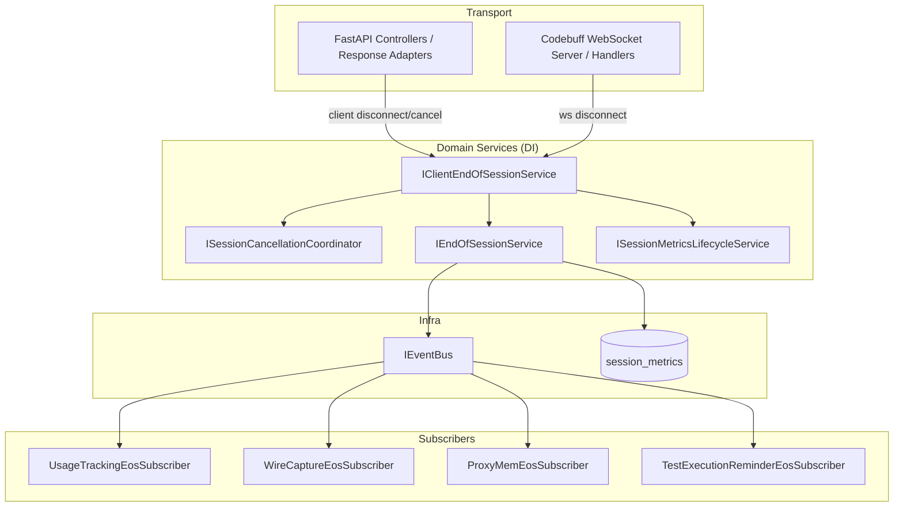
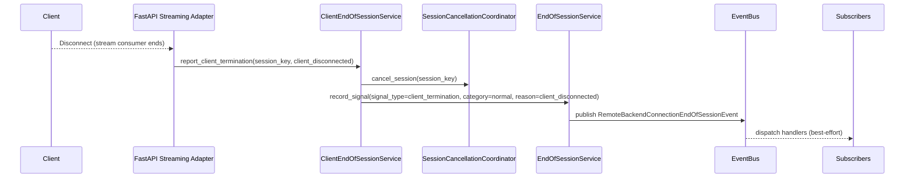
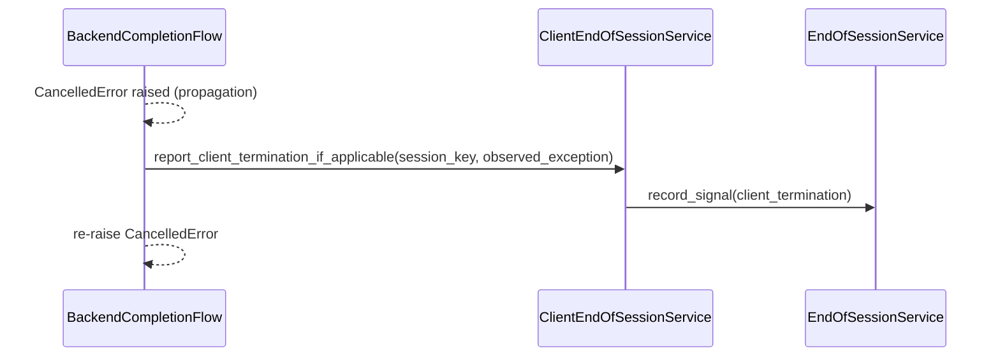
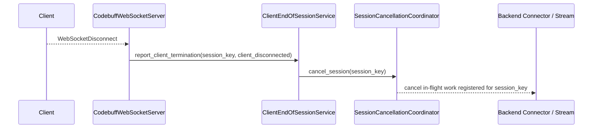

# Client End-of-Session Handling Design

## Overview
This feature introduces a first-class, session-scoped client-termination lifecycle that (a) detects client-side termination across transports, (b) cancels all in-flight and scheduled backend/agentic work for the affected session, and (c) guarantees End-of-Session (EoS) emission so subsystems (usage, wire capture, ProxyMem, steering) finalize consistently.

The design extends the existing EoS architecture established in `end-of-session-events` by adding a client-termination signal source and a session-wide cancellation coordinator. The implementation is designed to reduce transport coupling by keeping “disconnect detection” in transport adapters while normalizing and dispatching domain signals via DI-managed services.

### Goals
- Provide a normalized client termination signal with a standardized termination reason.
- Ensure client termination cannot bypass EoS emission and subscriber-driven finalization.
- Cancel in-flight backend calls and prevent new backend work (retry/failover/recovery/agentic steps) after client termination.
- Support HTTP-based endpoints and Codebuff WebSocket sessions.
- Preserve SOLID boundaries, strong session isolation, and explicit state ownership via DI-managed services.

### Non-Goals
- Changing frontend protocol semantics or introducing new client-facing cancellation APIs beyond those already present.
- Refactoring Codebuff prompt handling to route through the full core request processor (optional follow-up).
- Introducing new external dependencies or new persistence stores.
- Changing the canonical error-termination classification model (client termination remains “normal” termination category).

## Architecture

### Existing Architecture Analysis
- Streaming and non-streaming responses share a unified processing path via the stream normalizer/pipeline, but client disconnect detection is currently localized (for example, explicit polling in the Responses controller and `GeneratorExit` handling in a streaming orchestrator).
- Upstream cancellation is expressed primarily via `StreamingResponseEnvelope.cancel_callback` and ad-hoc markers (`cancel_reason`) rather than a session-scoped cancellation contract.
- The EoS system emits a single event per session using a DB claim on session metrics plus an in-memory hot-path dedupe cache; subsystems react through event bus subscribers.
- Backend orchestration re-raises cancellation exceptions, which can bypass EoS emission unless client termination is explicitly recorded before propagation.
- Codebuff WebSocket request flow is transport-specific and does not consistently integrate with the core cancellation/EoS lifecycle.

### Architecture Pattern & Boundary Map
**Architecture Integration**:
- Selected pattern: Internal event-driven lifecycle with a centralized “client termination reporter” feeding the existing EoS publisher, plus a session-scoped cancellation coordinator acting as the single source of truth for “session cancelled”.
- Domain/feature boundaries:
  - Transport layers detect disconnect/cancel and report a typed client termination signal.
  - Domain services normalize termination reasons, orchestrate cancellation, and emit EoS.
  - Subsystem behaviors remain in existing EoS subscribers (no duplication).
- Existing patterns preserved: DI-managed services, staged initialization, adapter layers, EoS pub/sub model, fail-open event dispatch.
- New components rationale:
  - Cancellation coordinator: prevents token waste and blocks follow-up backend calls after termination.
  - Client termination service: standardizes reasons, dedupes signals, and bridges to EoS emission.
- Steering compliance: SRP (separate detection/normalization/cancellation), explicit state ownership, and strong session isolation using a typed session key.

### Technology Stack & Alignment

| Layer | Choice / Version | Role in Feature | Notes |
|-------|------------------|-----------------|-------|
| Runtime | Python 3.10+ / FastAPI (async) | Cancellation + lifecycle | Use `async/await` for all I/O |
| DI Container | `src/core/di/container.py` | Service lifetimes | Cancellation coordinator is explicit state holder |
| Initialization | Staged init | Subscriber startup | Align with `src/core/app/lifecycle.py` patterns |
| Events | `src/core/services/event_bus.py` | EoS dispatch | Existing async pub/sub model |
| Persistence | `session_metrics` | EoS idempotency | Restart-safe “at most once” when available |
| Wire capture | CBOR capture | EoS metadata | Subscriptions remain unchanged; event reason becomes standardized |

## System Flows

### HTTP Streaming Disconnect → Cancellation → EoS

### Backend Cancellation Exception Propagation → EoS

### Codebuff WebSocket Disconnect → Cancellation → EoS

## Requirements Traceability

| Requirement | Summary | Components | Interfaces | Flows |
|-------------|---------|------------|------------|-------|
| 1.1 | Detect dropped client connection | Transport adapters, ClientEndOfSessionService | `IClientEndOfSessionService` | HTTP Streaming Disconnect |
| 1.2 | Detect explicit client cancellation when available | Transport adapters, ClientEndOfSessionService | `IClientEndOfSessionService` | HTTP Streaming Disconnect |
| 1.3 | Support all frontend protocols including Codebuff | Transport adapters, Codebuff adapter | `IClientEndOfSessionService` | Codebuff Disconnect |
| 1.4 | Support streaming and non-streaming | Transport adapters, cancellation coordinator | `IClientEndOfSessionService`, `ISessionCancellationCoordinator` | HTTP Streaming Disconnect |
| 1.5 | Continuously evaluate termination while active | Transport monitors, cancellation coordinator | `ISessionCancellationCoordinator` | HTTP Streaming Disconnect |
| 1.6 | Do not attribute without session context | Client termination signal contract | `ClientEndOfSessionSignal` | All |
| 1.7 | Detect Codebuff disconnect as termination | Codebuff adapter | `IClientEndOfSessionService` | Codebuff Disconnect |
| 2.1 | Produce normalized client end-of-session signal | ClientEndOfSessionService | `IClientEndOfSessionService` | All |
| 2.2 | Include session identifier and timestamp | Signal contract | `ClientEndOfSessionSignal` | All |
| 2.3 | Include termination reason | Signal contract | `ClientTerminationReason` | All |
| 2.4 | Standardize reason set | Reason enum | `ClientTerminationReason` | All |
| 2.5 | Normalize multiple signals to one | ClientEndOfSessionService + EoS dedupe | `IClientEndOfSessionService`, `IEndOfSessionService` | All |
| 2.6 | Do not produce duplicates | ClientEndOfSessionService idempotency | `IClientEndOfSessionService` | All |
| 2.7 | Map legacy markers to standardized reasons | Reason mapper | `IClientTerminationReasonMapper` | All |
| 3.1 | Mark session ended on client signal | Cancellation coordinator + EoS | `ISessionCancellationCoordinator`, `IEndOfSessionService` | All |
| 3.2 | Emit EoS event on client termination | EoS publisher | `IEndOfSessionService` | All |
| 3.3 | Record category as normal | EoS signal contract | `EndOfSessionSignal` | All |
| 3.4 | Include client termination reason in EoS | EoS reason standardization | `IEndOfSessionService` | All |
| 3.5 | Prevent duplicate EoS | EoS idempotency | `IEndOfSessionService` | All |
| 3.6 | Emit even if stream does not complete | Transport disconnect reporting | `IClientEndOfSessionService` | HTTP Streaming Disconnect |
| 3.7 | Record signal type as client termination | EoS signal type extension | `EndOfSessionSignalType` | All |
| 3.8 | Emit EoS even when cancellation is exception-based | BackendFlow integration | `IClientEndOfSessionService` | Cancellation Exception |
| 3.9 | Fail-open when persistence unavailable | Metrics lifecycle + in-process dedupe | `ISessionMetricsLifecycleService`, `IEndOfSessionService` | All |
| 3.10 | Persist idempotency state when enabled | Session metrics lifecycle | `ISessionMetricsLifecycleService` | All |
| 4.1 | Cancel in-flight backend work | Cancellation coordinator | `ISessionCancellationCoordinator` | All |
| 4.2 | Stop initiating additional backend work | Cancellation gate at backend call sites | `ISessionCancellationGate` | All |
| 4.3 | Cancel agentic/steering workflows | Cancellation coordinator registrations | `ISessionCancellationCoordinator` | All |
| 4.4 | Prevent retries/failover/follow-up calls | Cancellation gate integrated into recovery flows | `ISessionCancellationGate` | All |
| 4.5 | Treat uncancellable outcomes as non-deliverable | Transport adapters + cancellation coordinator | `ISessionCancellationCoordinator` | HTTP Streaming Disconnect |
| 4.6 | Scope cancellation to session | Session key contract | `SessionKey` | All |
| 4.7 | Prevent internal recovery workflows after termination | Cancellation gate | `ISessionCancellationGate` | All |
| 4.8 | Cancel backend work on Codebuff termination | Codebuff adapter + cancellation coordinator | `ISessionCancellationCoordinator` | Codebuff Disconnect |
| 5.1 | Finalize usage on client termination EoS | Existing subscriber | `IEventBus` | All |
| 5.2 | Finalize wire capture and record reason | Existing subscriber | `IEventBus` | All |
| 5.3 | Finalize ProxyMem with termination reason | Existing subscriber + reason standardization | `IEventBus` | All |
| 5.4 | Fault-isolate subsystem finalization | EventBus handler isolation | `IEventBus` | All |
| 5.5 | Emit EoS even when no backend response | Client termination reporting + session metrics init | `IClientEndOfSessionService`, `ISessionMetricsLifecycleService` | All |
| 6.1 | Log reason with session id | ClientEndOfSessionService logging | `IClientEndOfSessionService` | All |
| 6.2 | Make reason available to metrics/accounting | EoS reason standardization + subscribers | `IEndOfSessionService` | All |
| 6.3 | Record backend cancellation due to client termination | Cancellation coordinator metadata | `ISessionCancellationCoordinator` | All |
| 6.4 | Distinguish client termination from backend error | EoS signal type + category rules | `EndOfSessionSignalType` | All |

## Components and Interfaces

### Component Summary

| Component | Responsibility | DI Lifetime |
|----------|----------------|------------|
| `ClientEndOfSessionService` | Normalize/report client termination, orchestrate cancellation, trigger EoS | Singleton |
| `SessionCancellationCoordinator` | Session-scoped cancellation state, task registration, cancellation gate | Singleton |
| `SessionMetricsLifecycleService` | Ensure `session_metrics` existence and lifecycle updates | Scoped (per request/session) |
| `ClientTerminationReasonMapper` | Map legacy/transport markers to standardized reasons | Singleton |
| Transport adapters (HTTP / Codebuff) | Detect disconnect/cancel and call `IClientEndOfSessionService` | Existing transport lifetimes |

### Data Contracts

#### `SessionKey`
A typed key that prevents cross-session leakage and supports multi-transport isolation.

- Fields:
  - `protocol: str` (for example, `http`, `codebuff`)
  - `session_id: str` (canonical session identifier for the protocol)
  - `request_id: str | None` (optional correlation identifier)

#### `ClientTerminationReason`
Enum values:
- `client_disconnected`
- `client_cancelled`
- `unknown_client_termination`

#### `ClientEndOfSessionSignal`
Typed signal reported by transports to domain services.

- Fields:
  - `session_key: SessionKey`
  - `observed_at: datetime`
  - `reason: ClientTerminationReason`
  - `details: str | None` (bounded diagnostic detail; no secrets)

### Service Interfaces (Contracts)

#### `IClientEndOfSessionService`
- Responsibilities:
  - Accept `ClientEndOfSessionSignal` reports from transports.
  - Deduplicate multiple reports for the same session.
  - Cancel all registered work for the session.
  - Emit an EoS signal/event with client-termination signal type and standardized reason.
- Key operations (contract-level):
  - `report_client_termination(signal: ClientEndOfSessionSignal) -> None`
  - `report_client_termination_if_applicable(session_key: SessionKey, observed_exception: BaseException) -> None`

#### `ISessionCancellationCoordinator`
- Responsibilities:
  - Maintain explicit “cancelled” state per `SessionKey`.
  - Allow cancellable work to register under a session key.
  - Provide a “cancellation gate” used by any component that can initiate backend work.
- Key operations (contract-level):
  - `is_cancelled(session_key: SessionKey) -> bool`
  - `cancel_session(session_key: SessionKey, reason: ClientTerminationReason) -> None`
  - `register_cancellable(session_key: SessionKey, handle: ICancellable) -> None`

#### `ISessionCancellationGate`
- Responsibilities:
  - Provide a low-friction guard for “do not start new backend work if cancelled”.
- Key operations:
  - `ensure_not_cancelled(session_key: SessionKey) -> None` (raises a domain cancellation exception)

#### `ISessionMetricsLifecycleService`
- Responsibilities:
  - Ensure `session_metrics` exists for the session before EoS claims.
  - Provide fail-open semantics for persistence unavailability per 3.9/3.10.

#### `IClientTerminationReasonMapper`
- Responsibilities:
  - Map existing cancellation markers (for example, `client_disconnect`, `stream_cancelled`, `user_cancelled`) and transport signals (`GeneratorExit`) into standardized `ClientTerminationReason`.

### Integration Points (Non-Exhaustive)

#### HTTP Transports
- Streaming response adapters report disconnect on stream termination (`GeneratorExit`) and/or request-level disconnect detection (`request.is_disconnected()`), calling `IClientEndOfSessionService`.
- Non-streaming requests ensure session metrics exist early and use the cancellation gate before initiating backend calls.

#### Backend Orchestration and Recovery Flows
Components that can initiate additional backend calls must consult `ISessionCancellationGate` before doing so, including:
- Failover/retry execution
- Tool-call retry coordination
- Empty-stream recovery retries
- Angel verification and any other “follow-up backend call” workflow

#### Codebuff
- The WebSocket server reports disconnect as `client_disconnected` through `IClientEndOfSessionService`.
- Codebuff prompt streaming registers in-flight backend work with `ISessionCancellationCoordinator` so the disconnect path can cancel it.

## Persistence and Idempotency
- Primary: reuse the existing EoS persistence mechanism (session metrics atomic claim) for client termination (3.10).
- Fallback: when persistence is unavailable, ensure in-process “at most once” emission using explicit in-memory dedupe and log persistence unavailability (3.9).
- Session metrics creation should occur at the earliest stable point where a `SessionKey` is available (for HTTP: request context creation; for Codebuff: after identify/handshake).

## Observability and Security
- All client termination events are logged with session correlation identifiers and the standardized `ClientTerminationReason` (6.1).
- The EoS event `reason` field should be standardized to the same reason values so downstream subscribers can record consistent metadata (6.2).
- Cancellation operations must be scoped by `SessionKey` and must not allow cross-session cancellation or leakage (NFR 3).
- No termination reporting or metadata may include API keys or authorization headers.

## Open Questions
- Where is `session_metrics` reliably created today for HTTP requests and for Codebuff sessions? The design assumes a deterministic “session start” point for persistence (3.10).
- Should Codebuff session identifiers be namespaced (for example, `codebuff:<id>`) or modeled as `SessionKey.protocol` to prevent collisions with HTTP sessions?
- Which agentic flows beyond tool-call retry and Angel verification can initiate backend calls and therefore must consult the cancellation gate?

## References
- `.kiro/specs/client-end-of-session-handling/research.md`
- `.kiro/specs/end-of-session-events/design.md`
- `src/core/services/end_of_session_service.py`
- `src/core/app/controllers/responses_controller.py`
- `src/codebuff/server.py`

