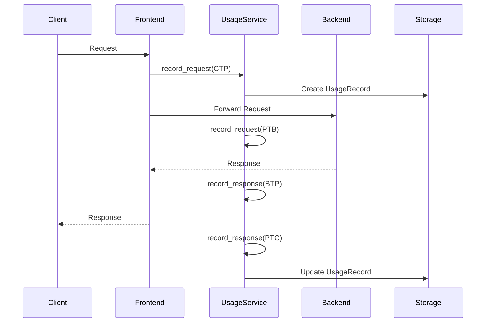

# Design Document: Detailed Usage Tracking and Statistics

## Overview

This design document describes the architecture and implementation of a comprehensive usage tracking and statistics system for the LLM proxy. The system extends the existing `UsageTrackingService` and `MetricsService` to provide multi-dimensional tracking, persistent storage, and real-time statistics across all proxy components.

The design follows SOLID principles, integrating with the existing dependency injection framework and maintaining backward compatibility with current usage tracking functionality.

## Architecture

The usage tracking system follows a layered architecture:

```
┌─────────────────────────────────────────────────────────────────┐
│                      API Layer (REST Endpoints)                  │
│  /v1/usage/stats, /v1/usage/recent, /v1/usage/export            │
└─────────────────────────────────────────────────────────────────┘
                              │
┌─────────────────────────────────────────────────────────────────┐
│                    Service Layer                                 │
│  UsageTrackingService, StatisticsAggregationService,            │
│  RollingWindowService, UsageExportService                       │
└─────────────────────────────────────────────────────────────────┘
                              │
┌─────────────────────────────────────────────────────────────────┐
│                    Domain Layer                                  │
│  UsageRecord, SessionMetrics, TimingMetrics,                    │
│  StatusCodeMetrics, AggregatedStats                             │
└─────────────────────────────────────────────────────────────────┘
                              │
┌─────────────────────────────────────────────────────────────────┐
│                    Repository Layer                              │
│  IUsageRepository, ISessionRepository, IStatisticsRepository    │
└─────────────────────────────────────────────────────────────────┘
                              │
┌─────────────────────────────────────────────────────────────────┐
│                    Storage Layer                                 │
│  SQLite (default), JSON file backup, In-memory cache            │
└─────────────────────────────────────────────────────────────────┘
```

## Components and Interfaces

### 1. Domain Models

#### UsageRecord

The core data structure for tracking individual request/response cycles with full observability of verbatim and mutated traffic:

```python
@dataclass
class UsageRecord:
    id: str
    timestamp: datetime
    session_id: str
    turn_number: int
    
    # Traffic identification
    backend_type: str
    model: str
    frontend_type: str
    leg: TrafficLeg  # CTP, PTC, PTB, BTP
    
    # PROXY-CALCULATED TOKEN METRICS (verbatim - before mutations)
    # Measured at frontend ingress (client request) and backend ingress (backend response)
    verbatim_prompt_tokens: int      # Client request BEFORE proxy modifications
    verbatim_completion_tokens: int  # Backend response BEFORE proxy modifications
    
    # PROXY-CALCULATED TOKEN METRICS (mutated - after mutations)
    # Measured at backend egress (to backend) and frontend egress (to client)
    mutated_prompt_tokens: int       # Request sent TO backend AFTER proxy modifications
    mutated_completion_tokens: int   # Response sent TO client AFTER proxy modifications
    
    # Computed totals (can use either verbatim or mutated based on context)
    total_tokens: int
    
    # BACKEND-REPORTED VALUES (separate from proxy calculations, for reconciliation)
    # These are the values reported by the remote LLM inference API
    # Uses OpenRouterUsage to capture ALL fields per OpenRouter docs:
    # - prompt_tokens, completion_tokens, total_tokens
    # - completion_tokens_details: { reasoning_tokens }
    # - prompt_tokens_details: { cached_tokens, audio_tokens }
    # - cost (USD per request)
    # - cost_details: { upstream_inference_cost }
    backend_reported_usage: OpenRouterUsage | None
    
    # Request/response metadata
    http_status_code: int | None
    tool_call_count: int
    tool_names: list[str]
    
    # Timing metrics
    ttft_ms: float | None  # Time to first token
    proxy_processing_ms: float  # Proxy overhead
    total_duration_ms: float
    
    # Context
    user_agent: str | None
    app_title: str | None
    proxy_user: str | None
```

#### TrafficLeg Enum
```python
class TrafficLeg(Enum):
    CLIENT_TO_PROXY = "CTP"
    PROXY_TO_BACKEND = "PTB"
    BACKEND_TO_PROXY = "BTP"
    PROXY_TO_CLIENT = "PTC"
```

#### SessionMetrics
```python
@dataclass
class SessionMetrics:
    session_id: str
    start_time: datetime
    last_activity: datetime
    turn_count: int
    total_tokens: int
    total_tool_calls: int
    is_completed: bool
```

#### AggregatedStats
```python
@dataclass
class AggregatedStats:
    # Counts
    request_count: int
    response_count: int
    unique_sessions: int
    total_turns: int
    
    # Token metrics
    total_prompt_tokens: int
    total_completion_tokens: int
    total_tokens: int
    tokens_per_session: float  # Total tokens / unique sessions
    
    # Throughput metrics
    completion_tokens_per_second: float  # TPS for completion tokens
    total_tokens_per_second: float  # TPS for all tokens
    
    # Tool metrics
    total_tool_calls: int
    
    # Timing metrics
    ttft_stats: TimingStats  # Time to first token across ALL requests
    proxy_processing_stats: TimingStats
    duration_stats: TimingStats
    
    # Status code breakdown
    status_code_counts: dict[int, int]
    
    # Breakdown dimensions applied
    filters: dict[str, Any]
    
    # Time window for TPS calculation
    time_window_seconds: float
```

#### TimingStats
```python
@dataclass
class TimingStats:
    count: int
    min_ms: float
    max_ms: float
    avg_ms: float
    p50_ms: float
    p95_ms: float
    p99_ms: float
```

### 2. Service Interfaces

#### IUsageRecordingService
```python
class IUsageRecordingService(Protocol):
    async def record_request(
        self,
        session_id: str,
        backend_type: str,
        model: str,
        frontend_type: str,
        leg: TrafficLeg,
        prompt_tokens: int,
        user_agent: str | None = None,
        proxy_user: str | None = None,
    ) -> str:
        """Record an incoming request, returns record_id."""
        ...
    
    async def record_response(
        self,
        record_id: str,
        completion_tokens: int,
        http_status_code: int,
        tool_call_count: int = 0,
        tool_names: list[str] | None = None,
        ttft_ms: float | None = None,
        proxy_processing_ms: float = 0,
        total_duration_ms: float = 0,
        backend_reported_prompt_tokens: int | None = None,
        backend_reported_completion_tokens: int | None = None,
        backend_reported_cost: float | None = None,
    ) -> None:
        """Complete a usage record with response data."""
        ...
```

#### IStatisticsService
```python
class IStatisticsService(Protocol):
    async def get_aggregated_stats(
        self,
        filters: StatisticsFilter,
    ) -> AggregatedStats:
        """Get aggregated statistics with optional filters."""
        ...
    
    async def get_rolling_window_stats(
        self,
        window_minutes: int,
        filters: StatisticsFilter | None = None,
    ) -> AggregatedStats:
        """Get statistics for a rolling time window."""
        ...
    
    async def get_status_code_breakdown(
        self,
        filters: StatisticsFilter | None = None,
    ) -> dict[str, dict[int, int]]:
        """Get status code counts by backend:model."""
        ...
```

#### StatisticsFilter
```python
@dataclass
class StatisticsFilter:
    backend_type: str | None = None
    model: str | None = None
    frontend_type: str | None = None
    leg: TrafficLeg | None = None
    user_agent: str | None = None
    proxy_user: str | None = None
    
    # Date/time filters
    start_date: datetime | None = None
    end_date: datetime | None = None
    day_of_week: int | None = None  # 0=Monday, 6=Sunday
    hour_of_day: int | None = None  # 0-23
    
    # Status code filter
    http_status_code: int | None = None
```

### 3. Repository Interfaces

#### IUsageRecordRepository
```python
class IUsageRecordRepository(Protocol):
    async def add(self, record: UsageRecord) -> None:
        """Add a usage record."""
        ...
    
    async def update(self, record: UsageRecord) -> None:
        """Update an existing usage record."""
        ...
    
    async def get_by_id(self, record_id: str) -> UsageRecord | None:
        """Get a record by ID."""
        ...
    
    async def query(
        self,
        filters: StatisticsFilter,
        limit: int | None = None,
    ) -> list[UsageRecord]:
        """Query records with filters."""
        ...
    
    async def get_aggregated(
        self,
        filters: StatisticsFilter,
    ) -> AggregatedStats:
        """Get aggregated statistics."""
        ...
```

### 4. In-Memory Storage with Periodic Persistence

The system uses a thread-safe in-memory data structure as the primary storage, with periodic persistence to disk. This design prioritizes low-latency recording while ensuring durability.

#### InMemoryUsageStore
```python
class InMemoryUsageStore:
    """Thread-safe in-memory storage with periodic disk persistence.
    
    Uses threading.RLock for concurrent access safety.
    Persists to disk at configurable intervals when dirty.
    """
    
    def __init__(
        self,
        persistence_path: Path,
        flush_interval_seconds: float = 30.0,
        max_records_in_memory: int = 100000,
    ):
        self._lock = threading.RLock()
        self._records: dict[str, UsageRecord] = {}
        self._sessions: dict[str, SessionMetrics] = {}
        self._dirty: bool = False
        self._persistence_path = persistence_path
        self._flush_interval = flush_interval_seconds
        self._flush_thread: threading.Thread | None = None
        self._shutdown_event = threading.Event()
    
    def add_record(self, record: UsageRecord) -> None:
        """Thread-safe record addition."""
        with self._lock:
            self._records[record.id] = record
            self._dirty = True
    
    def get_records(self, filters: StatisticsFilter) -> list[UsageRecord]:
        """Thread-safe filtered query."""
        with self._lock:
            return [r for r in self._records.values() if self._matches(r, filters)]
    
    def start_persistence_thread(self) -> None:
        """Start background thread for periodic persistence."""
        ...
    
    def flush_to_disk(self) -> None:
        """Persist current state to disk if dirty."""
        with self._lock:
            if not self._dirty:
                return
            # Serialize and write to disk
            self._dirty = False
    
    def load_from_disk(self) -> None:
        """Load persisted state on startup."""
        ...
```

#### Persistence Format
The in-memory store persists to a single JSON file with the following structure:
```json
{
    "version": 1,
    "last_flush": "2025-12-02T10:30:00Z",
    "records": [...],
    "sessions": [...],
    "aggregated_stats": {...}
}
```

For larger deployments, SQLite can be used as an alternative persistence backend:

### 5. SQLite Persistence (Optional)

The system can optionally use SQLite for persistent storage with the following schema:

```sql
CREATE TABLE usage_records (
    id TEXT PRIMARY KEY,
    timestamp TEXT NOT NULL,
    session_id TEXT NOT NULL,
    turn_number INTEGER NOT NULL,
    backend_type TEXT NOT NULL,
    model TEXT NOT NULL,
    frontend_type TEXT NOT NULL,
    leg TEXT NOT NULL,
    prompt_tokens INTEGER NOT NULL,
    completion_tokens INTEGER NOT NULL,
    total_tokens INTEGER NOT NULL,
    backend_reported_prompt_tokens INTEGER,
    backend_reported_completion_tokens INTEGER,
    backend_reported_cost REAL,
    http_status_code INTEGER,
    tool_call_count INTEGER NOT NULL DEFAULT 0,
    tool_names TEXT,  -- JSON array
    ttft_ms REAL,
    proxy_processing_ms REAL NOT NULL,
    total_duration_ms REAL NOT NULL,
    user_agent TEXT,
    app_title TEXT,
    proxy_user TEXT
);

CREATE INDEX idx_usage_timestamp ON usage_records(timestamp);
CREATE INDEX idx_usage_session ON usage_records(session_id);
CREATE INDEX idx_usage_backend ON usage_records(backend_type);
CREATE INDEX idx_usage_model ON usage_records(model);
CREATE INDEX idx_usage_status ON usage_records(http_status_code);

CREATE TABLE sessions (
    session_id TEXT PRIMARY KEY,
    start_time TEXT NOT NULL,
    last_activity TEXT NOT NULL,
    turn_count INTEGER NOT NULL,
    total_tokens INTEGER NOT NULL,
    total_tool_calls INTEGER NOT NULL,
    is_completed INTEGER NOT NULL DEFAULT 0
);
```

## Data Models

### Request Flow Data Capture



### Four Measurement Points for Full Traffic Observability

The system captures token counts at four distinct measurement points to provide full observability of both verbatim (original) and mutated (modified) traffic:

```text
                    VERBATIM                              MUTATED
                    (before proxy mutations)              (after proxy mutations)
                    
CLIENT ──────────────────────────────────────────────────────────────────> BACKEND

  [1] FRONTEND INGRESS                    [2] BACKEND EGRESS
      verbatim_prompt_tokens                  mutated_prompt_tokens
      (original client request)               (request sent to backend)
      
                         PROXY MUTATIONS
                         (command injection, content filtering,
                          model replacement, etc.)

  [4] FRONTEND EGRESS                     [3] BACKEND INGRESS  
      mutated_completion_tokens               verbatim_completion_tokens
      (response sent to client)               (original backend response)
      
CLIENT <────────────────────────────────────────────────────────────────── BACKEND
```

Additionally, backend-reported usage is captured separately:

```text
[5] BACKEND-REPORTED VALUES (from remote LLM API response metadata)
    backend_reported_prompt_tokens
    backend_reported_completion_tokens
    backend_reported_cost
```

This enables:
- Comparing what client sent vs what backend received (mutation impact on prompts)
- Comparing what backend returned vs what client received (mutation impact on responses)
- Reconciling proxy calculations with backend billing (proxy vs backend-reported)

### Timing Measurement Points

```text
Client Request ─┬─> [T0: Request Received]
                │
                ├─> [T1: Proxy Processing Start]
                │
                ├─> [T2: Backend Request Sent]
                │
                ├─> [T3: First Token Received] ──> TTFT = T3 - T0
                │
                ├─> [T4: Response Complete]
                │
                └─> [T5: Client Response Sent]

Proxy Processing Time = (T2 - T1) + (T5 - T4)
Total Duration = T5 - T0
```


## Correctness Properties

*A property is a characteristic or behavior that should hold true across all valid executions of a system-essentially, a formal statement about what the system should do. Properties serve as the bridge between human-readable specifications and machine-verifiable correctness guarantees.*

Based on the acceptance criteria analysis, the following correctness properties must be verified through property-based testing:

### Property 1: Verbatim Token Recording at Ingress Points
*For any* request received at a frontend connector, the recorded UsageRecord SHALL contain verbatim_prompt_tokens measured BEFORE any proxy modifications. *For any* response received from a backend connector, the recorded UsageRecord SHALL contain verbatim_completion_tokens measured BEFORE any proxy modifications.
**Validates: Requirements 1.1, 1.3**

### Property 2: Mutated Token Recording at Egress Points
*For any* request sent to a backend connector, the recorded UsageRecord SHALL contain mutated_prompt_tokens measured AFTER all proxy modifications. *For any* response sent to a client, the recorded UsageRecord SHALL contain mutated_completion_tokens measured AFTER all proxy modifications.
**Validates: Requirements 1.2, 1.4**

### Property 3: Token Association Correctness
*For any* recorded UsageRecord, the backend_type and model fields SHALL be non-empty strings that match the actual backend and model used for the request.
**Validates: Requirements 1.5, 1.6**

### Property 4: Request/Response Counter Consistency
*For any* sequence of N requests processed by the proxy, the request_count in aggregated statistics SHALL equal N, and the response_count SHALL equal the number of successfully completed responses.
**Validates: Requirements 2.1, 2.2, 2.3, 2.4**

### Property 5: Tool Call Count Accuracy
*For any* response containing tool calls, the recorded tool_call_count SHALL equal the actual number of tool calls in the response, and tool_names SHALL contain exactly the names of tools called.
**Validates: Requirements 3.1, 3.2, 3.3**

### Property 6: Tool Call Aggregation Correctness
*For any* set of UsageRecords, the aggregated tool_call_count per session/backend/model SHALL equal the sum of individual tool_call_count values for that grouping.
**Validates: Requirements 3.4**

### Property 7: Session Uniqueness Tracking
*For any* set of requests with session IDs, the unique_sessions count SHALL equal the number of distinct session_id values in the recorded UsageRecords.
**Validates: Requirements 4.1**

### Property 8: Turn Counter Accuracy
*For any* session, the turn_count SHALL equal the number of UsageRecords with that session_id.
**Validates: Requirements 4.2**

### Property 9: Tokens Per Session Calculation
*For any* set of UsageRecords, the tokens_per_session statistic SHALL equal total_tokens divided by unique_sessions (or 0 if no sessions).
**Validates: Requirements 4.3**

### Property 10: Tokens Per Second (TPS) Calculation
*For any* time window with UsageRecords, the completion_tokens_per_second SHALL equal total_completion_tokens divided by time_window_seconds, and total_tokens_per_second SHALL equal total_tokens divided by time_window_seconds.
**Validates: Requirements 5.5 (throughput tracking)**

### Property 11: Timing Metrics Validity
*For any* recorded UsageRecord with timing data, ttft_ms (if present) SHALL be non-negative, proxy_processing_ms SHALL be non-negative, and total_duration_ms SHALL be greater than or equal to proxy_processing_ms.
**Validates: Requirements 5.1, 5.2, 5.3**

### Property 12: Timing Statistics Correctness
*For any* set of timing values, the calculated min SHALL be less than or equal to all values, max SHALL be greater than or equal to all values, and avg SHALL equal sum/count.
**Validates: Requirements 5.4**

### Property 13: Status Code Recording
*For any* backend response with an HTTP status code, the recorded http_status_code SHALL match the actual response status code.
**Validates: Requirements 6.1, 6.2**

### Property 14: Status Code Aggregation
*For any* set of UsageRecords, the status_code_counts breakdown SHALL accurately reflect the count of each status code per backend:model combination.
**Validates: Requirements 6.3**

### Property 15: Filter Correctness
*For any* StatisticsFilter applied to a query, all returned UsageRecords SHALL match ALL specified filter criteria (backend_type, model, frontend_type, leg, user_agent, proxy_user, date range, hour_of_day).
**Validates: Requirements 7.1, 7.2, 7.3, 7.4, 7.5, 7.6, 7.7, 7.8, 7.9**

### Property 16: Backend-Reported Usage Separation
*For any* backend response containing usage metadata, the recorded UsageRecord SHALL store the complete backend-reported usage in a dedicated `backend_reported_usage` field (as OpenRouterUsage), preserving all fields including: prompt_tokens, completion_tokens, total_tokens, reasoning_tokens, cached_tokens, audio_tokens, cost, and upstream_inference_cost.
**Validates: Requirements 8.1, 8.2, 8.3, 8.4, 8.5**

### Property 17: Date Range Filter Correctness
*For any* query with start_date and end_date filters, all returned UsageRecords SHALL have timestamps within the specified range (inclusive).
**Validates: Requirements 9.6**

### Property 18: Serialization Round-Trip Consistency
*For any* valid UsageRecord, serializing to JSON and then deserializing SHALL produce an equivalent UsageRecord with all fields preserved.
**Validates: Requirements 10.1, 10.2, 10.3, 10.4**

### Property 19: API Filter Application
*For any* statistics API query with filters, the returned AggregatedStats SHALL reflect only the UsageRecords matching the filter criteria.
**Validates: Requirements 11.2, 11.3**

### Property 20: Thread-Safe Concurrent Access
*For any* sequence of concurrent add/query operations on the InMemoryUsageStore, all operations SHALL complete without data corruption, and the final state SHALL be consistent with some sequential ordering of the operations.
**Validates: Requirements 9.5 (concurrent access)**

### Property 21: Persistence Dirty Flag Correctness
*For any* sequence of add operations followed by flush_to_disk, the dirty flag SHALL be True before flush and False after flush, and subsequent queries SHALL return the same data before and after flush.
**Validates: Requirements 9.1, 9.2**

## Error Handling

### Recording Errors
- If token counting fails, record 0 tokens with an error flag
- If timing measurement fails, record -1 for the affected timing field
- If session ID is missing, use a generated placeholder with prefix "unknown-"

### Storage Errors
- If database write fails, queue the record for retry (max 3 attempts)
- If database is unavailable, fall back to in-memory storage with periodic flush attempts
- Log all storage errors with full context for debugging

### Query Errors
- Invalid filter parameters return HTTP 400 with descriptive error message
- Database query timeouts return HTTP 503 with retry-after header
- Malformed date ranges return HTTP 400 with expected format

### Serialization Errors
- Invalid JSON during import returns detailed validation errors
- Missing required fields are reported with field names
- Type mismatches are reported with expected vs actual types

## Testing Strategy

### Property-Based Testing Framework
The implementation will use **Hypothesis** (Python's property-based testing library) for all correctness properties. Each property test will run a minimum of 100 iterations with diverse generated inputs.

### Unit Tests
Unit tests will cover:
- Individual service method behavior
- Repository CRUD operations
- Filter parsing and validation
- Timing calculation edge cases
- JSON serialization/deserialization

### Property-Based Tests
Each correctness property will have a corresponding property-based test:

1. **Token Recording Tests**: Generate random token counts and verify recording
2. **Counter Tests**: Generate request sequences and verify counts
3. **Tool Call Tests**: Generate responses with varying tool calls
4. **Session Tests**: Generate multi-session request sequences
5. **Timing Tests**: Generate timing values and verify statistics
6. **Filter Tests**: Generate records and filters, verify query results
7. **Serialization Tests**: Generate UsageRecords and verify round-trip

### Test Data Generators
Custom Hypothesis strategies for:
- `UsageRecord` with valid field combinations
- `StatisticsFilter` with various filter combinations
- Request/response sequences with realistic patterns
- Timing values within realistic ranges

### Integration Tests
- End-to-end request flow with usage recording
- Database persistence and recovery
- API endpoint behavior with real HTTP requests
- Rolling window calculations over time

