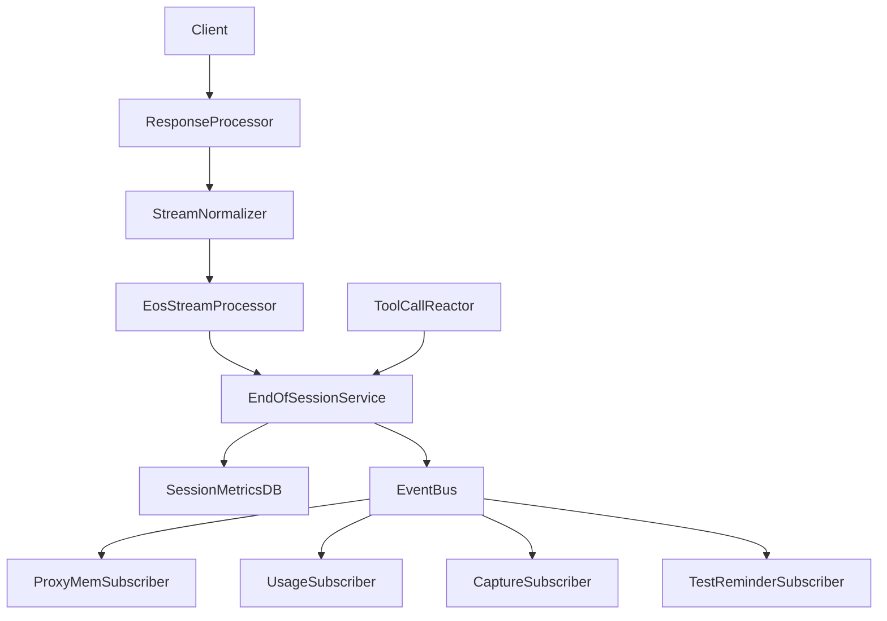
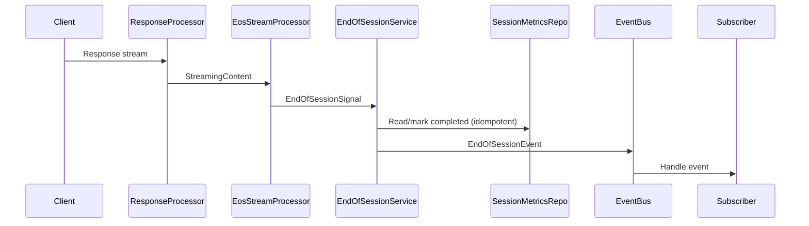

# End-of-Session Events Design

## Overview
This feature introduces a unified End-of-Session (EoS) event that normalizes completion signals across protocols and subsystems, enabling consistent session finalization. It creates a single publisher and subscriber model so internal services can react to session completion without duplicating detection logic.

Developers and operators use this to ensure ProxyMem, usage tracking, wire capture, and steering reminders receive a single, reliable signal for session completion. The design aligns with existing async, DI-driven patterns and uses the internal EventBus for decoupled dispatch.

### Goals
- Centralize completion detection and emit a single EoS event per session.
- Provide a subscription mechanism for subsystem behaviors to run on EoS.
- Normalize completion signals across streaming, non-streaming, and tool-call paths.
- Replace subsystem-specific EoS detection with event subscribers.
- Respect configuration controls and observability requirements.
- Persist EoS completion state in the database for restart-safe idempotency.

### Non-Goals
- Changing provider protocol semantics or response formats.
- Rewriting existing token accounting algorithms or usage schemas.
- Persisting EoS events to a new external store.
- Introducing new external dependencies or services.

## Architecture

### Existing Architecture Analysis
- The unified response pipeline (`UnifiedResponsePipeline`, `StreamNormalizer`) processes both streaming and non-streaming responses through the same stream processor chain.
- An async EventBus exists and is used by health checks, but is registered late in the lifecycle.
- Completion signals are already surfaced in streaming metadata (`finish_reason`, `[DONE]`, `message_stop`, `response.completed`).
- Tool-call completion signals are currently detected only in test execution reminder logic.
- Non-streaming responses are wrapped as single-chunk streams, enabling stream processors to observe completion for both modes.
- Session metrics are stored in `SessionMetricsTable` with an `is_completed` flag, which can be reused to persist EoS completion state.

### Architecture Pattern & Boundary Map
**Architecture Integration**:
- Selected pattern: Internal event-driven pub/sub with a centralized EoS publisher for dedupe and normalization.
- Domain boundaries: Detection and normalization live in EoS core services; subsystem behaviors are isolated in subscribers.
- Existing patterns preserved: DI registration, staged initialization, stream processor pipeline.
- New components rationale: A single EoS service is required to dedupe and gate events; stream and tool-call adapters provide source coverage.
- Steering compliance: Maintains SRP and decouples cross-cutting completion logic.



### Technology Stack & Alignment

| Layer | Choice / Version | Role in Feature | Notes |
|-------|------------------|-----------------|-------|
| Runtime | Python 3.10+ / FastAPI (async) | Core execution | Async I/O for event dispatch |
| DI Container | `src/core/di/container.py` | Service registration | Singleton services for EoS core |
| Streaming Pipeline | `StreamNormalizer` | Completion signal detection | Shared for streaming + non-streaming |
| Event Bus | `src/core/services/event_bus.py` | EoS event dispatch | Existing async pub/sub |
| Config | `src/core/config/` | EoS controls | Schema validation required |
| Wire Capture | CBOR | EoS capture metadata | Extend metadata fields |

## System Flows



Flow notes:
- The stream processor emits a normalized signal when a completion marker is observed.
- Tool-call completion emits the same signal via a tool-call handler path.
- The service dedupes per session and persists completion state in the DB before publishing.
- Non-streaming responses traverse the same pipeline via a single-chunk stream wrapper.
- Event dispatch uses a bounded timeout to avoid delaying response finalization.

## Requirements Traceability

| Requirement | Summary | Components | Interfaces | Flows |
|-------------|---------|------------|------------|-------|
| 1.1 | Mark session ended on configured condition | EndOfSessionService | IEndOfSessionService | EoS Stream Flow |
| 1.2 | Evaluate signals while active | EndOfSessionStreamProcessor | IStreamProcessor | EoS Stream Flow |
| 1.3 | Missing context keeps session active | EndOfSessionService | IEndOfSessionService | EoS Stream Flow |
| 1.4 | Terminal session state after end | SessionMetricsRepository | SessionMetricsRepository | EoS Stream Flow |
| 1.5 | Detect for all frontend protocols | EndOfSessionStreamProcessor | IStreamProcessor | EoS Stream Flow |
| 1.6 | Detect for streaming and non-streaming | EndOfSessionStreamProcessor, UnifiedResponsePipeline | IStreamProcessor | EoS Stream Flow |
| 2.1 | Emit EoS event on end | EndOfSessionService | IEndOfSessionService | EoS Stream Flow |
| 2.2 | Include session id and timestamp | EndOfSessionEvent | DomainEvent | EoS Stream Flow |
| 2.3 | No duplicate events | SessionMetricsRepository | SessionMetricsRepository | EoS Stream Flow |
| 2.4 | Emit before finalization | EndOfSessionStreamProcessor | IStreamProcessor | EoS Stream Flow |
| 2.5 | Consistent event type id | EndOfSessionEvent | DomainEvent | EoS Stream Flow |
| 2.6 | Emit for streaming and non-streaming | EndOfSessionService | IEndOfSessionService | EoS Stream Flow |
| 2.7 | Persist completion state in DB | EndOfSessionService, SessionMetricsRepository | SessionMetricsRepository | EoS Stream Flow |
| 2.8 | Bound emission delay | EndOfSessionService, EventBus | IEventBus | EoS Stream Flow |
| 3.1 | Register listener | EndOfSessionSubscriberRegistry | EventBus | EoS Dispatch Flow |
| 3.2 | Dispatch to listeners | EventBus | IEventBus | EoS Dispatch Flow |
| 3.3 | Unsubscribe | EndOfSessionSubscriberRegistry | EventBus | EoS Dispatch Flow |
| 3.4 | Same payload to all | EventBus | IEventBus | EoS Dispatch Flow |
| 3.5 | Startup registration | CoreServicesStage | ServiceCollection | Startup Flow |
| 4.1 | Listener failure isolated | EventBus | IEventBus | EoS Dispatch Flow |
| 4.2 | No session end revert | EndOfSessionService | IEndOfSessionService | EoS Stream Flow |
| 4.3 | Non-blocking listeners | EventBus | IEventBus | EoS Dispatch Flow |
| 4.4 | Failure surfaced | EventBus | IEventBus | EoS Dispatch Flow |
| 4.5 | Preserve payload | EventBus | IEventBus | EoS Dispatch Flow |
| 5.1 | Disable detection | EndOfSessionConfig | Config Models | Startup Flow |
| 5.2 | Disable emission | EndOfSessionConfig | Config Models | Startup Flow |
| 5.3 | Invalid config fails startup | Config Validation | AppConfig | Startup Flow |
| 5.4 | Apply settings consistently | EndOfSessionService | IEndOfSessionService | EoS Stream Flow |
| 5.5 | Expose defaults | EndOfSessionConfig | Config Models | Startup Flow |
| 6.1 | Normalize [DONE] sentinel | EndOfSessionStreamProcessor | IStreamProcessor | EoS Stream Flow |
| 6.2 | Normalize finish_reason | EndOfSessionStreamProcessor | IStreamProcessor | EoS Stream Flow |
| 6.3 | Normalize response.completed | EndOfSessionStreamProcessor | IStreamProcessor | EoS Stream Flow |
| 6.4 | Normalize completion tool call | EndOfSessionToolCallHandler | IToolCallHandler | EoS Tool Call Flow |
| 6.5 | Dedupe to single event | EndOfSessionService | IEndOfSessionService | EoS Stream Flow |
| 7.1 | ProxyMem completion | ProxyMemEosSubscriber | Event handler | EoS Dispatch Flow |
| 7.2 | Usage finalization | UsageTrackingEosSubscriber | Event handler | EoS Dispatch Flow |
| 7.3 | Wire capture metadata | WireCaptureEosSubscriber | Event handler | EoS Dispatch Flow |
| 7.4 | Test reminder steering | TestExecutionReminderEosSubscriber | Event handler | EoS Dispatch Flow |
| 7.5 | Use EoS event instead of markers | EndOfSessionService | IEndOfSessionService | EoS Stream Flow |
| 7.6 | Replace custom detection | Subscriber refactors | Event handlers | EoS Dispatch Flow |

## Components & Interface Contracts

**DI Registration Strategy**:
- EoS core services: Singleton
- EoS stream processor: Singleton, injected into StreamNormalizer chain
- Subscribers: Singleton, subscribe on startup

Summary table:
| Component | Layer | Intent | Req Coverage | DI Lifetime | Contracts |
|-----------|-------|--------|--------------|-------------|-----------|
| EndOfSessionService | `src/core/services/` | Normalize signals and emit EoS events | 1.1, 1.2, 1.3, 1.4, 1.5, 2.1, 2.2, 2.3, 2.4, 2.5, 2.6, 2.7, 2.8, 6.5 | Singleton | Service, Event |
| EndOfSessionStreamProcessor | `src/core/services/` | Detect completion markers in StreamingContent | 1.2, 1.5, 1.6, 6.1, 6.2, 6.3 | Singleton | Service |
| EndOfSessionToolCallHandler | `src/core/services/` | Detect completion tool calls | 6.4 | Singleton | Service |
| ProxyMemEosSubscriber | `src/core/memory/` | Mark session complete + queue analysis | 7.1 | Singleton | Event |
| UsageTrackingEosSubscriber | `src/core/services/` | Finalize usage + session metrics | 7.2 | Singleton | Event |
| WireCaptureEosSubscriber | `src/core/services/` | Record EoS metadata in CBOR capture | 7.3 | Singleton | Event |
| TestExecutionReminderEosSubscriber | `src/services/` | Emit steering message on dirty state | 7.4, 7.5, 7.6 | Singleton | Event |
| SessionMetricsRepository | `src/core/database/repositories/` | Persist EoS completion state | 2.7 | Singleton | Repository |

### Services Layer (`src/core/services/`)

#### EndOfSessionService

| Field | Detail |
|-------|--------|
| Intent | Normalize completion signals and emit a single End-of-Session event per session |
| Requirements | 1.1, 1.2, 1.3, 1.4, 1.5, 2.1, 2.2, 2.3, 2.4, 2.5, 2.6, 2.7, 2.8, 5.1, 5.2, 5.3, 5.4, 5.5, 6.5 |
| Interface | `IEndOfSessionService` in `src/core/interfaces/` |
| DI Lifetime | Singleton |

**Responsibilities & Constraints**
- Normalize and dedupe completion signals.
- Persist completion state in the database and use it to prevent duplicate emissions.
- Emit EoS events through EventBus with a bounded dispatch timeout to avoid blocking finalization.
- Maintain in-memory cache for hot-path dedupe, backed by DB for restart safety.
- On dispatch timeout, log and continue without blocking response finalization.

**Dependencies (via DI)**
- Inbound: `IEventBus`, `EndOfSessionConfig`, `SessionMetricsRepository`
- Outbound: EventBus publish
- External: None

**Contracts**: Service [x] / Event [x] / Middleware [ ]

##### Service Interface
```python
from abc import ABC, abstractmethod
from datetime import datetime
from enum import Enum
from dataclasses import dataclass

class EndOfSessionSignalType(str, Enum):
    DONE_SENTINEL = "done_sentinel"
    FINISH_REASON = "finish_reason"
    RESPONSE_COMPLETED = "response_completed"
    TOOL_COMPLETION = "tool_completion"

@dataclass(frozen=True)
class EndOfSessionSignal:
    session_id: str
    signal_type: EndOfSessionSignalType
    observed_at: datetime
    reason: str | None
    protocol: str | None
    request_id: str | None
    backend: str | None

class IEndOfSessionService(ABC):
    @abstractmethod
    async def record_signal(self, signal: EndOfSessionSignal) -> None:
        """Normalize a signal and emit EoS event once per session."""

    @abstractmethod
    def has_ended(self, session_id: str) -> bool:
        """Return True if EoS event has been emitted for session."""
```
- Preconditions: `session_id` present; emission enabled in config.
- Postconditions: At most one event emitted per session.
- Invariants: Once ended, additional signals do not emit new events.

##### DI Registration (CoreServicesStage)
```python
def _factory(provider: IServiceProvider) -> EndOfSessionService:
    event_bus = provider.get_required_service(IEventBus)
    config = provider.get_required_service(EndOfSessionConfig)
    session_repo = provider.get_required_service(SessionMetricsRepository)
    return EndOfSessionService(
        event_bus=event_bus,
        config=config,
        session_repository=session_repo,
    )

services.add_singleton(IEndOfSessionService, implementation_factory=_factory)
```

#### EndOfSessionStreamProcessor

| Field | Detail |
|-------|--------|
| Intent | Detect completion markers in StreamingContent and forward EoS signals |
| Requirements | 1.2, 1.5, 1.6, 6.1, 6.2, 6.3 |
| Interface | `IStreamProcessor` (existing) |
| DI Lifetime | Singleton |

**Responsibilities & Constraints**
- Observe StreamingContent for `[DONE]`, finish_reason, message_stop, response.completed.
- Map to `EndOfSessionSignal` and call `IEndOfSessionService`.
- Preserve content unchanged for downstream processors.

**Dependencies (via DI)**
- Inbound: `IEndOfSessionService`
- Outbound: none
- External: none

**Contracts**: Service [x] / Event [ ] / Middleware [ ]

##### Integration Notes
- Insert after ContentAccumulationProcessor and before MiddlewareApplicationProcessor to ensure metadata is stable.
- Stream metadata should include a stable session_id resolved upstream (use StreamSessionIdResolver); if missing, log and skip emission.

#### EndOfSessionToolCallHandler

| Field | Detail |
|-------|--------|
| Intent | Detect completion tool calls and forward EoS signals |
| Requirements | 6.4 |
| Interface | `IToolCallHandler` (existing) |
| DI Lifetime | Singleton |

**Responsibilities & Constraints**
- Detect completion tools (`attempt_completion`, `finish`, etc.).
- Call `IEndOfSessionService.record_signal` with signal_type TOOL_COMPLETION.
- Remain fail-open and not interfere with tool call processing.

**Dependencies (via DI)**
- Inbound: `IEndOfSessionService`, `CompletionSignalDetector`
- Outbound: none
- External: none

**Contracts**: Service [x] / Event [ ] / Middleware [ ]

### Persistence Layer (`src/core/database/`)

#### SessionMetricsRepository (EoS completion persistence)

| Field | Detail |
|-------|--------|
| Intent | Persist EoS completion state for restart-safe idempotency |
| Requirements | 2.7 |
| Interface | `SessionMetricsRepository` (existing) |
| DI Lifetime | Singleton |

**Responsibilities & Constraints**
- Upsert per-session completion state when EoS is recorded.
- Store the EoS emission timestamp and signal metadata for auditing.
- Serve idempotency checks so EndOfSessionService can avoid duplicate events.

**Dependencies (via DI)**
- Inbound: Database engine/session
- Outbound: none
- External: None

### Subsystem Subscribers

#### ProxyMemEosSubscriber

| Field | Detail |
|-------|--------|
| Intent | Mark ProxyMem sessions complete and queue analysis |
| Requirements | 7.1 |
| Interface | Event handler for `EndOfSessionEvent` |
| DI Lifetime | Singleton |

**Responsibilities & Constraints**
- Call `MemoryService.mark_session_complete` only when memory is enabled for session.
- Preserve idempotency if multiple EoS signals arrive.

#### UsageTrackingEosSubscriber

| Field | Detail |
|-------|--------|
| Intent | Finalize usage tracking and mark session metrics complete |
| Requirements | 7.2 |
| Interface | Event handler for `EndOfSessionEvent` |
| DI Lifetime | Singleton |

**Responsibilities & Constraints**
- Update session metrics completion status and persist finalization timestamps.
- Avoid blocking completion flow if persistence fails.

#### WireCaptureEosSubscriber

| Field | Detail |
|-------|--------|
| Intent | Record EoS occurrence in CBOR capture metadata |
| Requirements | 7.3 |
| Interface | Event handler for `EndOfSessionEvent` |
| DI Lifetime | Singleton |

**Responsibilities & Constraints**
- Append a capture entry with EoS metadata fields.
- Respect capture enablement and avoid blocking.

#### TestExecutionReminderEosSubscriber

| Field | Detail |
|-------|--------|
| Intent | Emit steering reminder when EoS is reached and session is dirty |
| Requirements | 7.4, 7.5, 7.6 |
| Interface | Event handler for `EndOfSessionEvent` |
| DI Lifetime | Singleton |

**Responsibilities & Constraints**
- Reuse existing dirty-state tracking logic.
- Replace local completion detection with EoS event subscription.

## Data Models

### Domain Model (`src/core/domain/`)
- **EndOfSessionEvent** (dataclass, extends `DomainEvent`)
  - `event_type = "end_of_session"`
  - Fields: `session_id`, `signal_type`, `reason`, `protocol`, `request_id`, `backend`
- **EndOfSessionSignal** (dataclass)
  - Normalized signal input for the EoS service.
- **EndOfSessionSignalType** (Enum)
  - Canonical signal types for dedupe and auditing.

### Configuration Model (`src/core/config/`)
- New `EndOfSessionConfig` with:
  - `enabled: bool` (global toggle)
  - `emit_events: bool` (emit vs detect only)
  - `detect_stream_signals: bool`
  - `detect_tool_completion: bool`
  - `emission_ttl_seconds: int`
  - `dispatch_timeout_seconds: float`
- Schema updates in `config/schemas/` and CLI overrides in `src/core/cli_support/`.

### Session Metrics Persistence (`src/core/database/models/usage.py`)
- Extend `SessionMetricsTable` with:
  - `eos_emitted_at: datetime | None`
  - `eos_signal_type: str | None`
  - `eos_reason: str | None`
- Use `is_completed` plus `eos_emitted_at` to enforce restart-safe idempotency.

### Wire Capture Metadata
- Extend `CaptureMetadata` with optional fields:
  - `eos: bool`
  - `eos_reason: str | None`
  - `eos_signal: str | None`

## Error Handling

### Error Hierarchy
All errors extend `LLMProxyError`.

| Error Type | HTTP Status | Use Case |
|------------|-------------|----------|
| `EndOfSessionConfigError` | 500 | Invalid EoS config |
| `EndOfSessionEmissionError` | 500 | Failed emission | 
| `EndOfSessionPersistenceError` | 500 | Failed to persist EoS state |

### Error Strategy
- EoS signal processing fails open; errors are logged with `exc_info=True`.
- Subscriber failures are isolated by EventBus behavior.
- Persistence failures prevent EoS emission and are logged with correlation IDs to preserve idempotency guarantees.
- Dispatch timeouts are logged; emission is considered complete once the EventBus publish is initiated within the timeout window.

## Testing Strategy

### Unit Tests (`tests/unit/`)
- EoS service dedupe with DB persistence and restart safety
- Stream processor detection of `[DONE]`, finish_reason, response.completed
- Tool-call handler detection and gating
- Subscriber behaviors with mocks
- Dispatch timeout behavior for event emission

### Integration Tests (`tests/integration/`)
- DI registration and event bus wiring
- Unified pipeline emits EoS on non-streaming responses
- Subscriber side effects for ProxyMem and usage tracking
- Session metrics updated with EoS completion state

### Property Tests (`tests/property/`)
- Dedupe invariants under random signal ordering

## Security Considerations
- EoS events never include API keys or authorization headers.
- Payload fields are restricted to identifiers and completion metadata.

## Performance & Scalability
- EoS processing adds constant-time checks per chunk.
- Event emission is async with bounded dispatch time to avoid response delays.
- In-memory dedupe cache is bounded; persistent state lives in DB with standard retention policies.

## Legacy EoS Detection Inventory & Migration
The following in-place completion detectors must be replaced with EoS event subscribers to avoid duplicated or inconsistent completion handling:

- `src/services/test_execution_reminder/test_execution_reminder_handler.py`: Detects completion via tool names and finish_reason; replace with TestExecutionReminderEosSubscriber.
- `src/services/test_execution_reminder/completion_signal_detector.py`: Custom completion signal logic; remove from the tool call path once EoS events are in place.
- `src/core/services/usage_tracking_wrapper.py`: Finalizes usage on stream exhaustion; keep timing logic but move session completion marking to UsageTrackingEosSubscriber.
- `src/core/services/cbor_wire_capture_service.py`: Uses stream end markers; add EoS metadata only from WireCaptureEosSubscriber (do not infer EoS from stream end).
- `src/core/services/structured_wire_capture_service.py`: Same stream-end markers; rely on EoS subscriber for completion metadata.

Audit any additional completion checks in usage/billing or steering extensions and ensure they consume End-of-Session events rather than protocol-specific markers.

### Rollout Strategy (Hybrid Migration)
- Phase 1: Introduce EoS core services and subscribers with EoS disabled by default.
- Phase 2: Enable EoS and disable legacy completion detectors in the listed subsystems (no dual-triggering).
- Phase 3: Remove legacy detection code once EoS events are stable in production.

## Stage Registration
- Register EventBus in CoreServicesStage to ensure availability for EoS.
- Register EndOfSessionService and EndOfSessionStreamProcessor in streaming registrations.
- Register subscribers during CoreServicesStage or SteeringStage with explicit start/stop hooks.
- Ensure SessionMetricsRepository is available in DI for EndOfSessionService persistence.

## Supporting References
- `src/core/services/response_processor_service.py`
- `src/core/services/streaming/stream_normalizer.py`
- `src/core/services/event_bus.py`
- `src/services/test_execution_reminder/`
