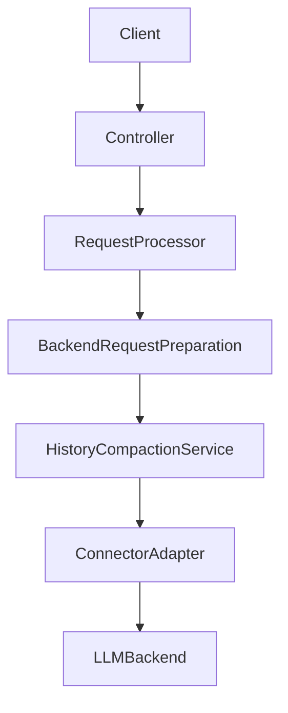
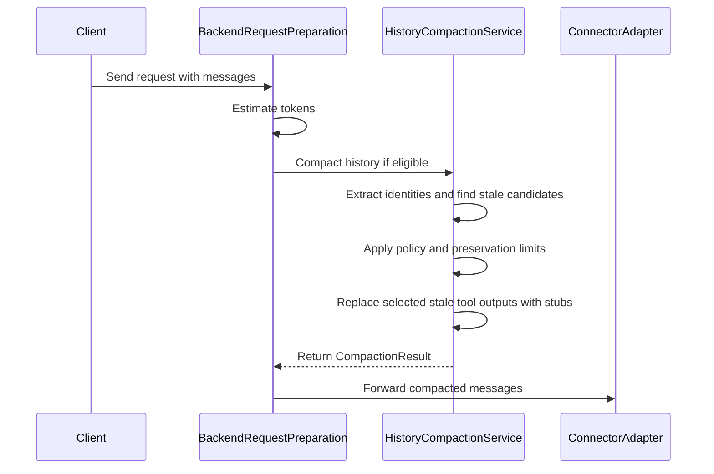

# Design Document

## Overview
This feature hardens the existing history compaction behavior that reduces oversized prompts by replacing stale tool result messages with explicit stubs before dispatch to LLM backends. The focus is correctness and safety in agentic workflows, especially for paginated file reads and other tools where arguments select a specific slice of a resource.

Proxy operators and developers use this to keep long agent sessions within context limits while preserving the latest evidence and ensuring the model can interpret compaction accurately. The impact is limited to the outbound request preparation path: message histories may be rewritten (tool outputs stubbed) under policy and token-budget governance, without changing connector behavior.

### Goals
- Correctly identify and correlate tool result messages by stable resource identities, including selection parameters for paginated reads.
- Ensure compaction is safe-by-default when enabled: unknown or unpermitted tool outputs remain unchanged.
- Make stubs unambiguous and idempotent across client-submitted histories (no reliance on metadata-only markers).
- Align token threshold semantics and support incremental compaction under preservation limits.
- Ensure diagnostics and metrics do not leak identifiers when redaction is enabled and do not report negative savings.

### Non-Goals
- Summarization of tool outputs beyond stub replacement.
- Compaction of user/system/assistant messages, including assistant reasoning content.
- Connector-specific compaction logic or provider-specific formats.
- Introducing new external dependencies for tokenization or parsing.

## Architecture

### Existing Architecture Analysis (if applicable)
- Current compaction implementation exists as a service invoked during request preparation before backend translation:
  - `src/core/services/backend_request_preparation_service.py`
  - `src/core/services/history_compaction_service.py`
- Resource identity extraction and stub generation are in the domain layer:
  - `src/core/domain/compaction.py`
  - `src/core/domain/configuration/compaction_config.py`
- Message `metadata` is not serialized by `ChatMessage.to_dict()` (`src/core/domain/chat.py`), so any idempotency marker based solely on metadata is not stable across client round-tripping.

### Architecture Pattern & Boundary Map
**Selected pattern**: Service-based, fail-open outbound transformation invoked prior to connector translation, preserving staged init and adapter isolation.

**Boundary rules**:
- Compaction operates only on tool result messages (`role="tool"` with a `tool_call_id`).
- Connectors receive a history that is already compacted; connectors remain unaware of compaction internals.
- Cross-layer contracts remain Pydantic domain models (`ChatMessage`, `CompactionConfig`, `CompactionResult`).

### Technology Stack

| Layer | Choice / Version | Role in Feature | Notes |
|-------|------------------|-----------------|-------|
| Runtime | Python 3.10+ / FastAPI (async) | Core framework | No blocking I O in compaction |
| DI Container | `src/core/di/container.py` | Service registration | Compaction service remains singleton |
| Initialization | Staged (`src/core/app/stages/`) | Service bootstrap | No new stages required |
| Config | Pydantic model + schema | Policy surface | CLI > ENV > YAML precedence |
| Logging | stdlib logging + structlog | Diagnostics | Must support redaction when enabled |

## System Flows

Key decision points:
- Compaction is only attempted when enabled and the token estimate meets the configured threshold (4.1, 4.2).
- Candidate selection is incremental and policy-limited (4.3, 2.7, 5.1).
- Fail-open returns the original history unchanged (6.5).

## Requirements Traceability

This design uses `N.M` requirement IDs where `N` is the top-level requirement number and `M` is the acceptance criterion number within that requirement (design-principles rule).

| Requirement | Summary | Components | Interfaces | Flows |
|-------------|---------|------------|------------|-------|
| 1.1 | Identity reflects output-affecting args | ResourceIdentityExtractor | N A | System flow |
| 1.2 | Identity stable across arg encoding | ResourceIdentityExtractor | N A | System flow |
| 1.3 | File selection params included | ResourceIdentityExtractor | N A | System flow |
| 1.4 | Different slices not marked stale | HistoryCompactionService | `IHistoryCompactionService` | System flow |
| 1.5 | Missing identity preserved | HistoryCompactionService | `IHistoryCompactionService` | System flow |
| 1.6 | Ambiguity preserved + diagnostics | HistoryCompactionService | `IHistoryCompactionService` | System flow |
| 2.1 | Stale detection by identity | HistoryCompactionService | `IHistoryCompactionService` | System flow |
| 2.2 | Latest preserved | HistoryCompactionService | `IHistoryCompactionService` | System flow |
| 2.3 | Non-tool messages unchanged | HistoryCompactionService | `IHistoryCompactionService` | System flow |
| 2.4 | Preserve ordering and tool linkage | HistoryCompactionService | `IHistoryCompactionService` | System flow |
| 2.5 | Do not recompact stubbed messages | CompactionStubDetector | N A | System flow |
| 2.6 | Stub recognition without metadata | CompactionStubDetector | N A | System flow |
| 2.7 | Preserve last N results | HistoryCompactionService | `IHistoryCompactionService` | System flow |
| 3.1 | Stub replaces compacted output | StubBuilder | N A | System flow |
| 3.2 | Stub includes identity detail | StubBuilder | N A | System flow |
| 3.3 | Stub includes selection params | StubBuilder | N A | System flow |
| 3.4 | Keep at least one stub + latest full | HistoryCompactionService | `IHistoryCompactionService` | System flow |
| 3.5 | Stub failure preserves original | HistoryCompactionService | `IHistoryCompactionService` | System flow |
| 3.6 | Stub format unambiguous | StubBuilder, CompactionStubDetector | N A | System flow |
| 4.1 | Threshold boundary semantics | BackendRequestPreparation, TokenBudgetConfig | N A | System flow |
| 4.2 | Below threshold no changes | BackendRequestPreparation, TokenBudgetConfig | N A | System flow |
| 4.3 | Incremental compaction under limits | HistoryCompactionService | `IHistoryCompactionService` | System flow |
| 4.4 | Warn when cannot reduce below max | BackendRequestPreparation | N A | System flow |
| 4.5 | Disabled compaction forwards unchanged | BackendRequestPreparation | N A | System flow |
| 5.1 | Explicit eligibility policies | CompactionPolicies, HistoryCompactionService | N A | System flow |
| 5.2 | Empty explicit permits means no compaction | CompactionPolicies | N A | System flow |
| 5.3 | Unknown tool preserved | CompactionPolicies | N A | System flow |
| 5.4 | Denied tool preserved | CompactionPolicies | N A | System flow |
| 5.5 | Configure by category and name | CompactionConfig, CompactionPolicies | N A | N A |
| 5.6 | Policy evaluated per request | CompactionPolicies | N A | N A |
| 6.1 | Diagnostics include counts and estimates | CompactionResult | `IHistoryCompactionService` | System flow |
| 6.2 | Removed content not emitted | HistoryCompactionService | `IHistoryCompactionService` | System flow |
| 6.3 | Identifier redaction in stubs and diagnostics | StubBuilder, DiagnosticsRedactor | N A | System flow |
| 6.4 | Clamp negative savings to zero | HistoryCompactionService | `IHistoryCompactionService` | N A |
| 6.5 | Fail-open on errors | HistoryCompactionService | `IHistoryCompactionService` | System flow |
| 7.1 | Apply compaction to other tool types with identity | ResourceIdentityExtractor, HistoryCompactionService | N A | N A |
| 7.2 | Search identity is query plus scope | ResourceIdentityExtractor | N A | N A |
| 7.3 | Directory identity is dir plus filters | ResourceIdentityExtractor | N A | N A |
| 7.4 | Uncorrelatable outputs preserved | HistoryCompactionService | `IHistoryCompactionService` | N A |
| 7.5 | Scope not treated as query | ResourceIdentityExtractor | N A | N A |

## Components and Interfaces

**DI Registration Strategy**
- Existing bindings remain: `IHistoryCompactionService` -> `HistoryCompactionService` (singleton).
- New helpers remain pure domain utilities and do not require DI unless they need configuration (preferred: pass config into service, keep helpers stateless).

| Component | Layer | Intent | Requirements | DI Lifetime |
|-----------|-------|--------|--------------|------------|
| HistoryCompactionService | `src/core/services/` | Policy-driven compaction with incremental selection | 1.4-1.6, 2.1-2.7, 3.4-3.5, 4.3, 6.4-6.5 | Singleton |
| ResourceIdentityExtractor | `src/core/domain/` | Stable identity extraction including selection params | 1.1-1.3, 7.2-7.5 | N A |
| CompactionStubDetector | `src/core/domain/` | Recognize existing stubs without metadata | 2.5-2.6, 3.6 | N A |
| StubBuilder | `src/core/domain/` | Versioned stub format including identity details | 3.1-3.3, 3.6, 6.3 | N A |
| DiagnosticsRedactor | `src/core/domain/` | Redact identifiers for logs and metrics | 6.3 | N A |

### Services Layer (`src/core/services/`)

#### HistoryCompactionService

| Field | Detail |
|-------|--------|
| Intent | Apply conservative, incremental compaction of stale tool results under token budget and preservation limits |
| Requirements | 1.4-1.6, 2.1-2.7, 3.4-3.5, 4.3, 6.4-6.5 |
| Interface | `IHistoryCompactionService` (`src/core/interfaces/history_compaction_interface.py`) |
| DI Lifetime | Singleton |

**Responsibilities & Constraints**
- Identify tool result messages and correlate them by `ResourceIdentity`.
- Apply eligibility policy (category and tool name) with conservative defaults when enabled.
- Compute staleness per identity and preserve the last `preserve_last_n_results` tool results unmodified.
- Select which stale messages to stub incrementally until below threshold or no eligible candidates remain (4.3).
- Ensure idempotency: do not recompact messages already in stub form even if metadata is absent (2.5, 2.6).
- Fail open on any compaction error: return original messages unchanged and record diagnostics (6.5).

**Compaction candidate selection (contract-level)**
- A “candidate” is a tool result message that:
  - has an extractable `ResourceIdentity` (1.1, 1.5),
  - is not among the preserved most recent `preserve_last_n_results` occurrences (2.7),
  - is eligible by policy (5.1-5.4),
  - is not already a compaction stub (2.5-2.6).
- Selection order is defined by estimated savings (largest estimated savings first) to reduce modification count while meeting threshold (4.3).

**Dependencies**
- `CompactionConfig` passed in by caller.
- Token estimate passed in by caller; the service may update internal savings estimates but does not require provider tokenization.

### Domain Layer (`src/core/domain/`)

#### ResourceIdentityExtractor

| Field | Detail |
|-------|--------|
| Intent | Extract stable resource identity from tool name and tool call arguments |
| Requirements | 1.1-1.3, 7.2-7.5 |

**Identity contract**
- `ResourceIdentity` includes:
  - `tool_name` (normalized)
  - `primary_key` (normalized file path, command signature, query)
  - `secondary_keys` (normalized selection parameters and scope qualifiers)

**Selection parameter handling**
- For file reads, include all recognized selection parameters as secondary keys when present:
  - offset-like: `offset`, `start_line`, `from_line`, `line_offset`
  - limit-like: `limit`, `max_lines`, `end_line`, `count`, `length`, `chunk_size`
  - index-like: `index`, `page`, `cursor`
- Selection parameters must be normalized for stable identity (1.2):
  - JSON-string and dict argument encodings yield equivalent identities.
  - Numeric strings are parsed to integers where applicable.
  - Key ordering in `secondary_keys` is deterministic.
- Missing vs default semantics must be conservative:
  - Unless the tool contract is explicitly known, treat “missing” as distinct from “explicit default” (for example, treat `{offset: 0}` as distinct from `{}`) to avoid incorrectly compacting outputs that may differ due to implicit defaults or server-side behavior.

**Identity equivalence rules (contract-level)**
- The extractor must not rely solely on a tool-name category to decide which arguments are identity-relevant.
  - Category can guide which argument keys to consider, but the final identity must be derived from the actual argument keys present and their normalized values (1.1, 7.4).
- If a tool uses multiple “slice” schemes, identity should include whichever scheme is present:
  - Example: a file-read tool may accept `{offset, limit}` or `{index, chunk_size}`; if both are present, include both (do not drop one).
  - This supports tools shaped like `read_file(filename, offset, index)` where both parameters materially affect the output.

**Search identity handling**
- Resource identity for search-type tools combines query and scope parameters (7.2) and must not treat scope as the query (7.5).
- At minimum, the identity must include:
  - the query component (pattern/text/regex),
  - the scope component (file path, directory, repo root),
  - and any filter/flags that materially change results (for example: glob, regex vs literal, case sensitivity, include/exclude patterns, include_hidden).

#### StubBuilder

| Field | Detail |
|-------|--------|
| Intent | Generate a versioned, unambiguous stub string including identity detail |
| Requirements | 3.1-3.3, 3.6, 6.3 |

**Stub format**
- Stubs are plain strings to preserve connector compatibility.
- **Backwards compatibility requirement**: the implementation already emits legacy stubs that start with the unversioned prefix `[COMPACTED]` (v0).
- New stubs must begin with a stable prefix and version marker, for example:
  - `[COMPACTED][llm-proxy][v1] ...`
- The stub must include:
  - an identifier representation (raw or masked depending on redaction) (6.3),
  - selection parameter names and values when present (3.3),
  - a statement that newer output exists later in the conversation (3.1).

#### CompactionStubDetector

| Field | Detail |
|-------|--------|
| Intent | Determine whether a tool result message is already a compaction stub without relying on message metadata |
| Requirements | 2.5-2.6, 3.6 |

**Detection contract**
- A message is considered a compaction stub when:
  - role is `tool`,
  - content is a string and begins with the agreed stub prefix.
- This intentionally avoids relying on `metadata`, which is not stable across client submission.
- The detector must recognize both legacy stubs (v0) and versioned stubs (v1+):
  - v0: begins with `[COMPACTED]`
  - v1+: begins with `[COMPACTED][llm-proxy][vN]` where `N` is an integer
- Detection should be tolerant to allow safe idempotency:
  - False-positive stub detection is acceptable (it merely avoids further compaction),
  - False-negative stub detection is not acceptable (it causes re-compaction and violates 2.5–2.6).

#### DiagnosticsRedactor

| Field | Detail |
|-------|--------|
| Intent | Produce redacted identifier strings for logs and metrics when redaction is enabled |
| Requirements | 6.3 |

**Redaction contract**
- When `redact_resource_identifiers` is enabled, identifiers in:
  - stubs,
  - structured log context,
  - metrics labels or fields,
  must not contain unredacted file paths or full command strings.
- Redaction uses a masking scheme (for example, stable hash plus minimal hint such as basename) rather than secret-pattern-only redaction.

## Data Models

### Configuration Model (`src/core/domain/configuration/compaction_config.py`)

Add or refine configuration semantics to satisfy policy requirements:
- `allowed_tool_categories` and `denied_tool_categories` remain.
- Add tool-name allow and deny lists to support 5.5:
  - `allowed_tool_names: list[str]`
  - `denied_tool_names: list[str]`
- Add a compatibility toggle to control the meaning of an empty allowlist:
  - `allow_all_if_allowlist_empty: bool`
  - Default should be conservative when compaction is enabled (5.2); if compatibility is required, operators may explicitly set the toggle.
- Ensure `preserve_last_n_results` and `max_stubs_per_resource` are enforced by the service (2.7, 4.3).
- Ensure `stub_template` is applied by StubBuilder and supports inclusion of selection parameters (3.2-3.3).

Schema and config surface updates:
- Schema: `config/schemas/app_config.schema.yaml`
- YAML example: `config/config.example.yaml`
- Env and CLI exposure may remain minimal; YAML should be the primary configuration surface for advanced policy.

### Compaction Result Diagnostics (`src/core/interfaces/history_compaction_interface.py`)
- Ensure metrics fields never report negative savings (6.4).
- Ensure `stale_resources` and any log context fields respect redaction settings (6.3).
- Redaction responsibility must be explicit at the contract boundary:
  - When redaction is enabled, `CompactionResult` must not retain or expose unredacted resource identifiers in any field intended for logging/metrics (including `stale_resources` and `to_log_context()` output).
  - Prefer storing only redacted identifiers in `CompactionResult.stale_resources` when redaction is enabled to avoid “accidental” leakage by callers that log the dataclass or attach `stale_resources` to telemetry.

## Error Handling

### Error Strategy
- Compaction is non-critical and must fail open (6.5):
  - If compaction fails, forward the original messages unchanged.
- Compaction should record diagnostics on failures without logging removed tool outputs (6.2, 6.5).
- Any internal exceptions should be handled in a narrow scope; top-level fail-open is permitted to preserve availability, but the design expects component-level validation to prevent frequent failures.

## Testing Strategy

### Unit Tests (`tests/unit/`)
- Identity extraction:
  - `index`/`page`/`cursor`/`chunk_size` in file-read identities (1.3-1.4).
  - Stable identity across JSON string vs dict and numeric strings (1.2).
  - Search identity uses query plus scope and does not use scope as query (7.2, 7.5).
- Stub format and detection:
  - Stub includes selection parameters and has stable version marker (3.2-3.3, 3.6).
  - Stub recognized without metadata (2.6).
- Policy defaults:
  - Enabled with empty allowlists results in no compaction unless explicitly configured (5.2-5.3).
- Accounting:
  - Negative savings clamped to zero (6.4).

### Integration Tests (`tests/integration/`)
- Verify request preparation returns compacted history under threshold conditions and policies (4.1-4.3).
- Verify redaction affects both stubs and diagnostics fields (`stale_resources`) when enabled (6.3).
