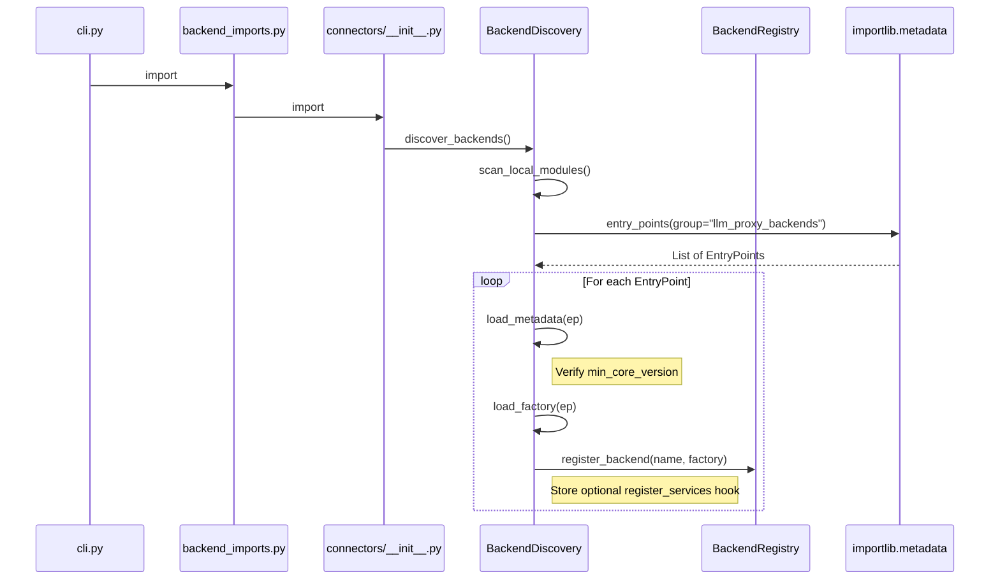
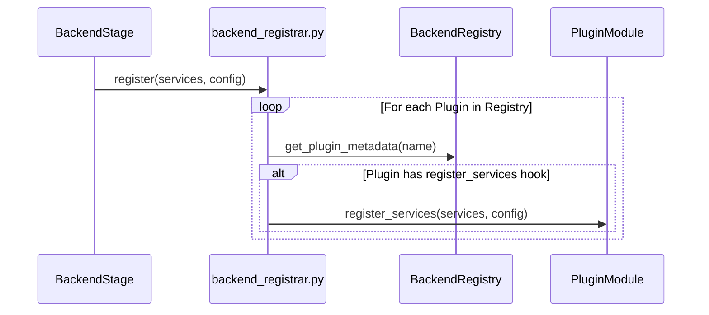

# Technical Design: OAuth Connectors Extraction

## Overview
This design outlines extracting OAuth-based (and other sensitive) backend connectors from the core `llm-interactive-proxy` distribution into an external plugin distribution, while keeping the core proxy functional and backward compatible.

## Goals
- Relocate sensitive or vendor-specific OAuth connectors to an external package.
- Implement a pluggable backend discovery mechanism in core.
- Maintain backward compatibility for existing configurations.
- Ensure a seamless installation experience via `pip install llm-interactive-proxy[oauth]`.

## Requirements Traceability
| ID | Component | Note |
|----|-----------|------|
| 1.1-1.5 | Backend discovery | Internal + entry point discovery |
| 2.1-2.2 | External plugin distribution | Extracted backends provided out-of-tree |
| 2.3 | Plugin API surface | Stable imports/contract for plugins |
| 2.5 | DI registration hook | Optional registration for plugin services |
| 2.6 | Compatibility Check | Version verification during discovery |
| 3.2-3.5 | Validation + request handling | Actionable warnings/errors for missing backends |
| 5.1-5.3 | Packaging | `oauth` extra + dependency split |

## Architecture Pattern: Plugin (Adapter)
The system uses the **Adapter** pattern for backends and the **Plugin** pattern for discovery.

### System Flows

#### Discovery Flow (Module Import Time)


#### DI Registration Flow (App Startup)


## Component Specifications

### 1. Backend Discovery (Entry Points)
A utility service (likely in `src/core/services/backend_discovery.py`) or integrated into `src/connectors/__init__.py`.

**Responsibility**:
- Scan `entry_points` for the `llm_proxy_backends` group.
- **Compatibility Verification**: Check `min_core_version` against core version before loading.
- **Metadata Tracking**: Track whether a backend came from a plugin and if it has a DI hook.
- Handle registration with `BackendRegistry`.

**Interface**:
```python
class BackendDiscovery:
    @staticmethod
    def discover_external_backends() -> None:
        """Scan entry points and register external backends."""
```

### 2. BackendValidationService Enhancement
**Logic**:
- Define `KNOWN_OAUTH_BACKENDS` list (Requirement 2.1).
- If configured backend is missing, and it's in `KNOWN_OAUTH_BACKENDS`, emit: `"Backend '{name}' requires OAuth support. Install it with: pip install llm-interactive-proxy[oauth]"`.

### 3. DI Hook Specification
Plugins may optionally expose a top-level function in the module pointed to by the entry point:
`def register_services(services: ServiceCollection, config: AppConfig) -> None`

The `src/core/di/registrations/backend.py` will be updated to:
1. Try-import `src.connectors.openai_codex` and `src.connectors.gemini_base` conditionally.
2. Iterate through registered backends and call `register_services` if the backend provides it.

### 4. External Package: llm-proxy-oauth-connectors
**Structure**:
```
llm-proxy-oauth-connectors/
├── pyproject.toml
├── src/
│   └── llm_proxy_oauth_connectors/
│       ├── __init__.py          # Registration hook
│       ├── anthropic_oauth.py
│       ├── gemini_oauth/
│       └── ...
```

**Entry Point Configuration**:
```toml
[project.entry-points."llm_proxy_backends"]
anthropic-oauth = "llm_proxy_oauth_connectors.anthropic_oauth:AnthropicOAuthBackend"
gemini-oauth-auto = "llm_proxy_oauth_connectors.gemini_oauth_auto.connector:GeminiOAuthAutoConnector"
```

## Data Models
No changes to existing `BackendConfig` or `BackendSettings`.

## Security Considerations
- **DMCA Mitigation**: Moving OAuth logic to a separate repository reduces exposure of sensitive protocol implementations in the main repo.
- **Dependency Safety**: External connectors must strictly follow the `LLMBackend` interface to prevent arbitrary code execution during discovery (though they run in the same process).

## Testing Strategy
- **Mock Discovery**: Use `unittest.mock` to simulate `importlib.metadata.entry_points` in core tests.
- **Integration Test**: A specialized test in core that attempts to load a "dummy" backend from a local file-based entry point.
- **Package Test**: The external package will have its own CI suite mirroring the core's connector tests.
