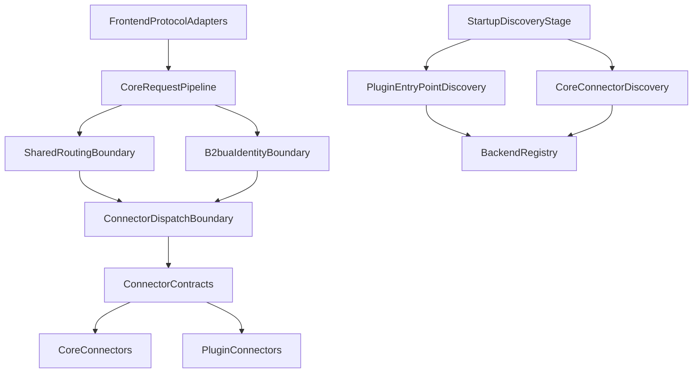
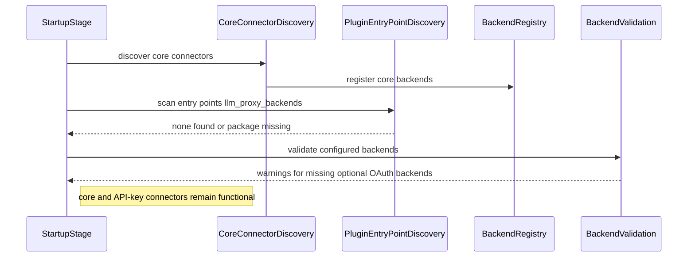
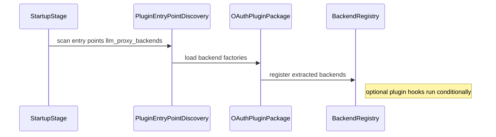
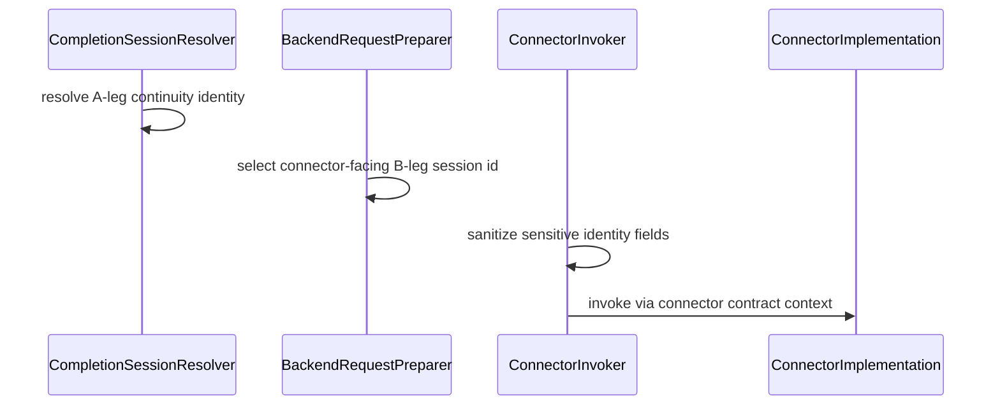
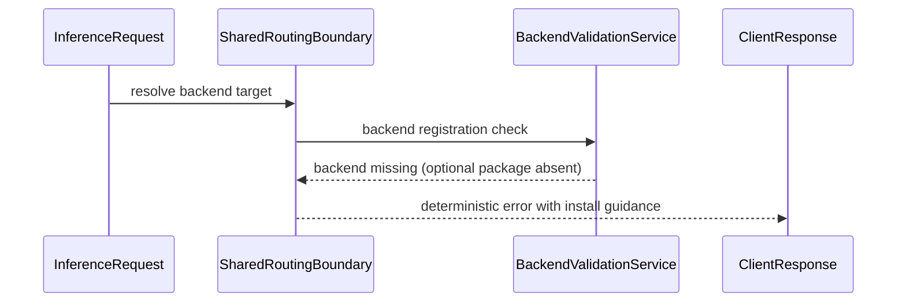

# Design Document: oauth-connectors-extraction

## Overview

This design updates the extraction architecture so OAuth/sensitive connectors can be delivered as an optional external Python package while preserving:
- proxy-core stability
- unified routing behavior
- B2BUA identity isolation
- non-OAuth connector functionality when optional package is absent

The design is contract-first: extraction success is defined by strict dependency boundaries, deterministic fail-open behavior for optional plugins, and regression-proof verification.

## Goals

- Deliver extracted OAuth connectors as separate package (`llm-interactive-proxy-oauth-connectors`) installable via pip.
- Keep `llm-interactive-proxy` functional without optional package installed.
- Preserve one shared routing boundary for all outbound inference surfaces.
- Preserve B2BUA A-leg/B-leg identity contracts at connector dispatch boundary.
- Enforce core independence from concrete backend and frontend connector implementations.
- Preserve constrained single-instance policy for self-managed OAuth families.

## Non-Goals

- Replacing existing unified routing stack (`BackendModelResolver` + `BackendRoutingService`).
- Reworking protocol payload schemas for OpenAI/Anthropic/Gemini/Responses APIs.
- Introducing separate process isolation for plugins (plugins still execute in-process).

## Architecture Pattern and Boundaries

Selected pattern: **Layered Core + Optional Plugin Boundary + Canonical Dispatch Boundary**

### Boundary Map

### Layer Responsibilities

1. **Frontend protocol adapters**
   - Convert transport-specific payloads into canonical request context/domain objects.
   - Must not embed backend-specific routing/session policy.
2. **Core policy/services**
   - Own routing, resilience, session continuity, validation, failover policy.
   - Depend on abstractions and contracts, not concrete plugin modules.
3. **Connector boundary**
   - Accepts connector contracts (`ConnectorRequestContext`, canonical request shape).
   - Enforces B2BUA field sanitization and B-leg projection for connector-facing session identity.
4. **Plugin package boundary**
   - Optional set of extracted connectors discovered via entry points.
   - Absent or partially broken plugin loading must not break core startup.

## Component Design

### 1) Plugin Discovery Boundary

**Intent:** load optional external connectors only when package is installed/available.

**Primary contracts:**
- Entry-point group: `llm_proxy_backends`
- Discovery behavior:
  - no entry points -> no-op (valid state)
  - entry-point load failure -> warning + continue
  - successful load -> register backend factory in `BackendRegistry`

**Integration point:**
- Startup discovery path currently rooted in `src/connectors/__init__.py` and `src/core/services/backend_imports.py`.
- Design extends that flow with external entry-point discovery, keeping startup order deterministic.

### 2) Stable Plugin API Surface

**Intent:** external package consumes only supported APIs, not deep internals.

**Required public contract surface (minimum):**
- backend contract type (`LLMBackend`/canonical connector contract)
- configuration models required for registration/context
- supported registration hooks (backend factory and optional service-registration hook)

**Compatibility contract:**
- plugin compatibility must be checked before activation (for example minimum supported core version metadata).
- incompatible plugins are skipped with warning; startup remains healthy.

### 3) Core Routing and Dispatch Boundary Preservation

**Intent:** extraction must not alter routing semantics.

**Authoritative routing components (already present):**
- `src/core/services/backend_model_resolver.py`
- `src/core/services/backend_routing_service.py`
- `dev/scripts/check_routing_unification_compliance.py`

**Dispatch boundary (already present):**
- `src/core/services/connector_invoker.py`
- `src/core/services/backend_completion_flow/backend_request_preparer.py`

These remain mandatory route-to-dispatch path for both core and plugin connectors.

### 4) B2BUA Identity Isolation Contract

**Intent:** keep proxy-internal continuity identity private while preserving connector correlation.

**Current enforcement points to preserve:**
- `CompletionSessionResolver`: A-leg for internal continuity/session load.
- `BackendRequestPreparer` + `ConnectorInvoker`: B-leg for connector-facing `session_id`.
- `ConnectorInvoker._project_context`: strips sensitive A-leg/client/auth-scope fields from connector context.

### 5) Frontend Adapter Independence Contract

**Intent:** protocol adapters remain thin translators over core service interfaces.

**Expected path:**
- Adapter/controller -> canonical request translation -> request processor / shared routing boundary -> connector dispatch.

**Rule:** adding or changing protocol adapter must not require core business-logic changes in routing/session/resilience layers.

### 6) Constrained Connector-Family Policy Continuity

**Intent:** keep single-instance policy for self-managed OAuth families after extraction.

**Policy source-of-truth (already present):**
- `src/core/config/constrained_backend_policy.py`
- `src/core/config/semantic_validation.py`

The extraction must keep these policy checks active regardless of connector origin (core vs plugin).

## System Flows

### Flow A: Startup Without OAuth Package Installed

### Flow B: Startup With OAuth Package Installed

### Flow C: B2BUA-Aware Dispatch (Core and Plugin Connectors)

### Flow D: Missing Extracted Backend at Runtime

## Requirements Traceability

| Requirement IDs | Design Elements |
|---|---|
| 1.1-1.4 | Optional package boundary, install UX, dependency split |
| 2.1-2.6 | Plugin discovery boundary and startup ordering |
| 3.1-3.5 | Core-to-backend abstraction boundary, no hard imports |
| 4.1-4.4 | Frontend adapter to canonical-core boundary |
| 5.1-5.6 | Package-absent fail-open behavior and deterministic errors |
| 6.1-6.6 | Shared routing boundary and compliance gate preservation |
| 7.1-7.5 | B2BUA A-leg/B-leg isolation and context sanitization |
| 8.1-8.4 | Constrained connector-family policy continuity |
| 9.1-9.4 | Stable plugin API + compatibility handling |
| 10.1-10.4 | Layered architecture, SOLID/DRY constraints |
| 11.1-11.5 | Verification matrix and regression safety |

## Error Handling and Diagnostics

- Plugin discovery failures are warnings, not fatal startup errors.
- Missing optional extracted backends produce actionable diagnostics with install guidance.
- Request-time targeting of unavailable extracted backends returns deterministic handled errors.
- Diagnostics distinguish proxy-level routing and connector-internal scheduling scopes.

## Testing and Verification Strategy

### Core Verification Matrix
1. **Core-only mode** (no oauth package installed)
   - startup succeeds
   - API-key connectors functional
   - missing extracted connector references produce warnings/handled errors
2. **Core + oauth package mode**
   - plugin discovery registers extracted backends
   - routing/dispatch paths remain unified
3. **Fault mode**
   - broken plugin entry point does not crash startup
   - non-extracted connectors remain functional

### Regression Guardrails
- Keep routing unification compliance check mandatory.
- Keep B2BUA identity boundary tests asserting no A-leg leakage to connector-facing context.
- Add anti-coupling checks for forbidden import dependencies from core into extracted connectors.

## Design Constraints

- Keep asynchronous request path non-blocking.
- Keep startup deterministic and fail-open for optional plugin failures.
- Avoid introducing duplicate routing/session logic in adapters or connectors.
- Preserve backward-compatible configuration semantics for backend names while surfacing clear migration guidance.
