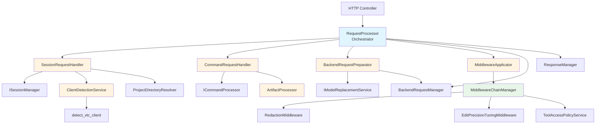
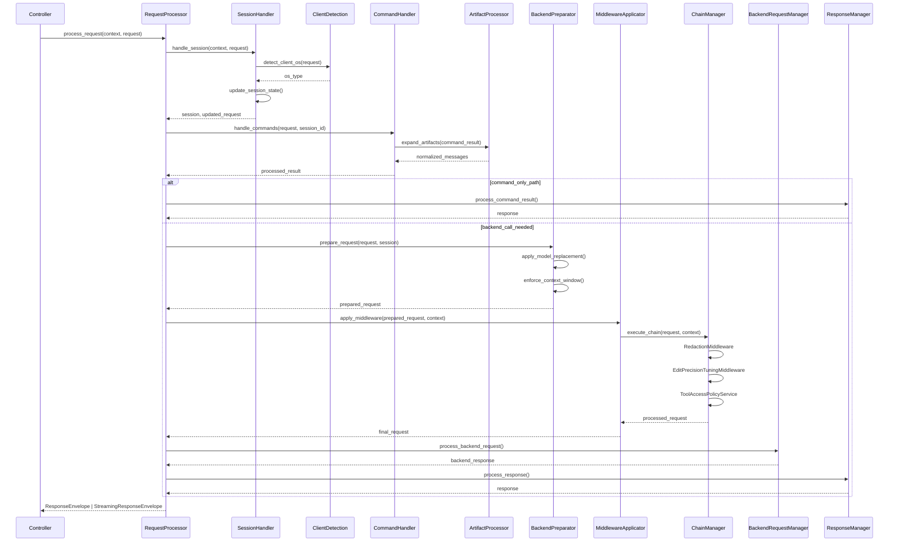

# Design Document: Request Processor Refactoring

---
**Purpose**: Decompose monolithic RequestProcessor into focused, single-responsibility components following SOLID principles while maintaining backward compatibility.

**Project Context**: Universal LLM Proxy - FastAPI async service with staged initialization, DI containers, adapter pattern for LLM backends.
---

## Overview

This refactoring decomposes the `RequestProcessor` God Object (1485 lines, complexity 214) into focused handler components, implementing a middleware chain pattern for extensibility. The refactoring maintains backward compatibility with existing interfaces and tests while significantly improving maintainability and testability.

**Purpose**: This feature delivers improved code maintainability and extensibility to developers maintaining the request processing pipeline.

**Users**: Developers maintaining and extending the request processing pipeline will benefit from clearer component boundaries and easier testing.

**Impact**: Changes the current monolithic RequestProcessor implementation by extracting 8-10 focused components, reducing complexity from 214 to < 20, and enabling middleware extensibility without core code modifications.

### Goals
- Reduce `process_request()` cyclomatic complexity from 214 to < 20
- Extract 8-10 focused handler components with single responsibilities
- Implement middleware chain pattern for extensibility
- Maintain 100% backward compatibility with existing interfaces and tests
- Improve testability through better component boundaries
- Achieve maintainability index > 20 (currently 0.00)

### Non-Goals
- Changing the `IRequestProcessor` interface contract
- Modifying existing middleware implementations
- Changing request/response domain models
- Altering error handling behavior or exception types
- Performance optimizations beyond complexity reduction
- Adding new features (refactoring only)

## Architecture

### Existing Architecture Analysis

**Current State**:
- RequestProcessor registered in `ProcessorStage` (stage 7)
- Depends on: CommandStage, BackendStage
- Uses factory pattern for complex initialization
- Singleton lifetime for RequestProcessor instance
- Interface binding: `IRequestProcessor` → `RequestProcessor`

**Current Request Flow**:
1. Session resolution and state management
2. Client detection (OS, VTC)
3. Project directory resolution
4. Memory context injection
5. Command processing
6. Artifact expansion/compression
7. Model replacement
8. Context window enforcement
9. Request redaction middleware
10. Edit precision tuning middleware
11. Tool access control filtering
12. Backend call
13. Response processing

**Integration Points**:
- DI container: `ServiceCollection` in `src/core/di/services.py`
- Stage registration: `src/core/app/stages/processor.py`
- Interface contracts: `src/core/interfaces/request_processor_interface.py`
- Domain models: `src/core/domain/` (ChatRequest, ProcessedResult, RequestContext)

### Architecture Pattern & Boundary Map

**Selected Pattern**: Composition with Handler Delegation

**Rationale**:
- RequestProcessor becomes thin orchestrator (orchestration pattern)
- Handler components follow single responsibility principle
- Middleware chain enables open/closed principle compliance
- Clear boundaries between orchestration and processing logic

**Architecture Diagram**:


**Domain/Feature Boundaries**:
- **Orchestration Layer**: RequestProcessor coordinates handler execution
- **Handler Layer**: Focused components with single responsibilities
- **Middleware Layer**: Chain manager executes middleware in order
- **Service Layer**: Existing services (ISessionManager, ICommandProcessor, etc.)
- **Domain Layer**: Shared models (ChatRequest, ProcessedResult, RequestContext)

**Existing Patterns Preserved**:
- Dependency Injection via ServiceCollection
- Interface-based design (I* naming)
- Factory pattern for complex initialization
- Singleton lifetime for stateless services
- Async/await for all I/O operations
- Error hierarchy (LLMProxyError base)

**New Components Rationale**:
- **SessionRequestHandler**: Isolates session management concerns
- **CommandRequestHandler**: Isolates command processing concerns
- **BackendRequestPreparator**: Isolates request transformation concerns
- **MiddlewareApplicator**: Isolates middleware application concerns
- **ArtifactProcessor**: Isolates artifact processing concerns
- **ClientDetectionService**: Isolates client detection concerns
- **MiddlewareChainManager**: Enables extensible middleware execution

**Steering Compliance**:
- ✅ Single Responsibility Principle: Each component has one clear purpose
- ✅ Open/Closed Principle: Middleware chain enables extension without modification
- ✅ Dependency Inversion Principle: Components depend on interfaces
- ✅ Interface Segregation Principle: Focused interfaces per component
- ✅ DRY: Reuse existing services and utilities
- ✅ Async patterns: All handlers use async/await

### Technology Stack

| Layer | Choice / Version | Role in Feature | Notes |
|-------|------------------|-----------------|-------|
| Runtime | Python 3.10+ / FastAPI (async) | Core framework | Use `async/await` for all I/O |
| DI Container | `ServiceCollection` | Service registration | Singleton lifetime for handlers |
| Initialization | Staged (`ProcessorStage`) | Service bootstrap | Register in stage 7 |
| Interfaces | `I*` naming convention | Component boundaries | New interfaces in `src/core/interfaces/` |
| Domain Models | Pydantic v2 | Request/response models | Reuse existing ChatRequest, ProcessedResult |
| Error Handling | `LLMProxyError` hierarchy | Exception propagation | Preserve existing error types |
| Logging | Python logging + structlog | Observability | Preserve existing log messages |

## System Flows

### Request Processing Flow (Refactored)



**Key Flow Decisions**:
- **Sequential Execution**: Handlers execute in fixed order (session → command → backend prep → middleware → backend call)
- **Short-Circuiting**: Command-only path returns early without backend call
- **Error Propagation**: Errors propagate up the chain, preserving existing behavior
- **Context Passing**: RequestContext and ProcessingContext flow through all handlers

## Requirements Traceability

| Requirement | Summary | Components | Interfaces | Flows |
|-------------|---------|------------|------------|-------|
| 1.1-1.10 | Request Processor Decomposition | RequestProcessor, SessionRequestHandler, CommandRequestHandler, BackendRequestPreparator, MiddlewareApplicator, ArtifactProcessor, ClientDetectionService | IRequestProcessor, ISessionRequestHandler, ICommandRequestHandler, IBackendRequestPreparator, IMiddlewareApplicator, IArtifactProcessor, IClientDetectionService | Main request flow |
| 2.1-2.10 | Middleware Chain Pattern | MiddlewareChainManager, MiddlewareApplicator | IMiddlewareChainManager, IMiddlewareApplicator | Middleware execution flow |
| 3.1-3.8 | Complexity Reduction | All handler components | All handler interfaces | Achieved through delegation |
| 4.1-4.10 | Session Management Extraction | SessionRequestHandler | ISessionRequestHandler | Session handling flow |
| 5.1-5.10 | Command Processing Extraction | CommandRequestHandler, ArtifactProcessor | ICommandRequestHandler, IArtifactProcessor | Command processing flow |
| 6.1-6.10 | Backend Request Preparation Extraction | BackendRequestPreparator | IBackendRequestPreparator | Backend preparation flow |
| 7.1-7.10 | Middleware Application Extraction | MiddlewareApplicator, MiddlewareChainManager | IMiddlewareApplicator, IMiddlewareChainManager | Middleware application flow |
| 8.1-8.10 | Artifact Processing Extraction | ArtifactProcessor | IArtifactProcessor | Artifact processing flow |
| 9.1-9.10 | Client Detection Extraction | ClientDetectionService | IClientDetectionService | Client detection flow |
| 10.1-10.10 | Backward Compatibility | RequestProcessor | IRequestProcessor | All flows |
| 11.1-11.10 | Testability Improvements | All components | All interfaces | Test isolation |
| 12.1-12.10 | Component Integration | RequestProcessor | IRequestProcessor | Main request flow |

## Components and Interfaces

**DI Registration Strategy**: All new handler components registered as Singletons in `ProcessorStage`. Factory pattern used for complex initialization with dependencies.

| Component | Layer | Intent | Req Coverage | DI Lifetime | Contracts |
|-----------|-------|--------|--------------|-------------|-----------|
| RequestProcessor | `src/core/services/` | Orchestrates request processing pipeline | 1, 3, 10, 12 | Singleton | IRequestProcessor |
| SessionRequestHandler | `src/core/services/` | Handles session resolution and state management | 1, 4 | Singleton | ISessionRequestHandler |
| CommandRequestHandler | `src/core/services/` | Processes embedded commands | 1, 5 | Singleton | ICommandRequestHandler |
| BackendRequestPreparator | `src/core/services/` | Prepares requests for backend calls | 1, 6 | Singleton | IBackendRequestPreparator |
| MiddlewareApplicator | `src/core/services/` | Applies request middleware in chain | 1, 2, 7 | Singleton | IMiddlewareApplicator |
| ArtifactProcessor | `src/core/services/` | Expands/compresses tool output artifacts | 1, 8 | Singleton | IArtifactProcessor |
| ClientDetectionService | `src/core/services/` | Detects client OS and VTC mode | 1, 9 | Singleton | IClientDetectionService |
| MiddlewareChainManager | `src/core/services/` | Manages middleware chain execution | 2, 7 | Singleton | IMiddlewareChainManager |

### Services Layer (`src/core/services/`)

#### RequestProcessor

| Field | Detail |
|-------|--------|
| Intent | Thin orchestrator that coordinates handler components in correct order |
| Requirements | 1.1-1.10, 3.1-3.8, 10.1-10.10, 12.1-12.10 |
| Interface | `IRequestProcessor` in `src/core/interfaces/request_processor_interface.py` |
| DI Lifetime | Singleton |

**Responsibilities & Constraints**
- **Primary responsibility**: Orchestrate handler execution in correct order
- **Single Responsibility**: Coordination only, no business logic
- **Data ownership**: None (delegates to handlers)
- **Invariants**: Must preserve IRequestProcessor interface contract

**Dependencies (via DI)**
- **Inbound**: 
  - `ISessionRequestHandler` - Session handling
  - `ICommandRequestHandler` - Command processing
  - `IBackendRequestPreparator` - Backend preparation
  - `IMiddlewareApplicator` - Middleware application
  - `IBackendRequestManager` - Backend call execution
  - `IResponseManager` - Response processing
  - `IApplicationState` (optional) - Application state access
- **Outbound**: All handler components
- **External**: None

**Contracts**: Service [✓]

##### Service Interface
```python
from abc import ABC, abstractmethod
from typing import Any

from src.core.domain.chat import ChatRequest
from src.core.domain.request_context import RequestContext
from src.core.domain.responses import ResponseEnvelope, StreamingResponseEnvelope
from src.core.interfaces.model_bases import DomainModel, InternalDTO

class IRequestProcessor(ABC):
    @abstractmethod
    async def process_request(
        self,
        context: RequestContext,
        request_data: DomainModel | InternalDTO | dict[str, Any],
    ) -> ResponseEnvelope | StreamingResponseEnvelope:
        """Process an incoming chat completion request.
        
        Preconditions:
            - request_data must be ChatRequest or compatible dict
            - context must contain valid session_id or request_id
        
        Postconditions:
            - Returns ResponseEnvelope or StreamingResponseEnvelope
            - Session state updated if modified
            - Request processed through all handlers in order
        
        Invariants:
            - Interface contract preserved (backward compatibility)
            - Error types match existing implementation
        """
        ...
```

##### DI Registration (in ProcessorStage)
```python
def request_processor_factory(provider: IServiceProvider) -> RequestProcessor:
    session_handler = provider.get_required_service(ISessionRequestHandler)
    command_handler = provider.get_required_service(ICommandRequestHandler)
    backend_preparator = provider.get_required_service(IBackendRequestPreparator)
    middleware_applicator = provider.get_required_service(IMiddlewareApplicator)
    backend_request_manager = provider.get_required_service(IBackendRequestManager)
    response_manager = provider.get_required_service(IResponseManager)
    app_state = provider.get_service(IApplicationState)
    
    return RequestProcessor(
        session_handler=session_handler,
        command_handler=command_handler,
        backend_preparator=backend_preparator,
        middleware_applicator=middleware_applicator,
        backend_request_manager=backend_request_manager,
        response_manager=response_manager,
        app_state=app_state,
    )

services.add_singleton(RequestProcessor, implementation_factory=request_processor_factory)
services.add_singleton_factory(
    IRequestProcessor,
    implementation_factory=lambda p: p.get_required_service(RequestProcessor),
)
```

**Implementation Notes**:
- **Orchestration Logic**: Coordinates handler execution in sequence
- **Error Handling**: Propagates errors from handlers without modification
- **Short-Circuiting**: Returns early if command-only path detected
- **Complexity Target**: < 20 cyclomatic complexity for `process_request()`

#### SessionRequestHandler

| Field | Detail |
|-------|--------|
| Intent | Handles session resolution, agent updates, and state management |
| Requirements | 1.2, 4.1-4.10 |
| Interface | `ISessionRequestHandler` in `src/core/interfaces/` |
| DI Lifetime | Singleton |

**Responsibilities & Constraints**
- **Primary responsibility**: Session resolution and state management
- **Single Responsibility**: Session concerns only
- **Data ownership**: Session state updates
- **Invariants**: Must preserve existing session state structure

**Dependencies (via DI)**
- **Inbound**:
  - `ISessionManager` - Session CRUD operations
  - `IClientDetectionService` - Client OS/VTC detection
  - `IApplicationState` (optional) - Application state access
  - `ProjectDirectoryResolutionService` (optional) - Project directory resolution
- **Outbound**: ISessionManager, IClientDetectionService
- **External**: None

**Contracts**: Service [✓]

##### Service Interface
```python
from abc import ABC, abstractmethod

from src.core.domain.chat import ChatRequest
from src.core.domain.request_context import RequestContext

class ISessionRequestHandler(ABC):
    @abstractmethod
    async def handle_session(
        self,
        context: RequestContext,
        request: ChatRequest,
    ) -> tuple[Any, ChatRequest]:
        """Handle session resolution and state updates.
        
        Preconditions:
            - context must be valid RequestContext
            - request must be valid ChatRequest
        
        Postconditions:
            - Returns tuple of (session, updated_request)
            - Session state updated if client OS/VTC detected
            - Request updated with session agent if different
        
        Invariants:
            - Session state structure preserved
            - Request remains valid ChatRequest
        """
        ...
```

##### DI Registration
```python
def session_handler_factory(provider: IServiceProvider) -> SessionRequestHandler:
    session_manager = provider.get_required_service(ISessionManager)
    client_detection = provider.get_required_service(IClientDetectionService)
    app_state = provider.get_service(IApplicationState)
    project_dir_service = provider.get_service(ProjectDirectoryResolutionService)
    
    return SessionRequestHandler(
        session_manager=session_manager,
        client_detection=client_detection,
        app_state=app_state,
        project_dir_service=project_dir_service,
    )

services.add_singleton(ISessionRequestHandler, implementation_factory=session_handler_factory)
```

**Implementation Notes**:
- **Session Resolution**: Resolves session ID from context or creates new
- **Agent Updates**: Updates session agent if incoming agent differs
- **Client Detection**: Delegates to ClientDetectionService for OS/VTC detection
- **State Propagation**: Updates RequestContext with session state

#### CommandRequestHandler

| Field | Detail |
|-------|--------|
| Intent | Processes embedded commands and handles artifact expansion |
| Requirements | 1.3, 5.1-5.10 |
| Interface | `ICommandRequestHandler` in `src/core/interfaces/` |
| DI Lifetime | Singleton |

**Responsibilities & Constraints**
- **Primary responsibility**: Command processing and artifact handling
- **Single Responsibility**: Command and artifact concerns only
- **Data ownership**: ProcessedResult with modified messages
- **Invariants**: Must preserve ProcessedResult structure

**Dependencies (via DI)**
- **Inbound**:
  - `ICommandProcessor` - Command execution
  - `IArtifactProcessor` - Artifact expansion/compression
  - `IApplicationState` (optional) - Global command disable check
  - `ISessionManager` (optional) - Command recording
- **Outbound**: ICommandProcessor, IArtifactProcessor
- **External**: None

**Contracts**: Service [✓]

##### Service Interface
```python
from abc import ABC, abstractmethod

from src.core.domain.chat import ChatRequest
from src.core.domain.processed_result import ProcessedResult
from src.core.domain.request_context import RequestContext

class ICommandRequestHandler(ABC):
    @abstractmethod
    async def handle_commands(
        self,
        request: ChatRequest,
        session_id: str,
        context: RequestContext,
    ) -> ProcessedResult:
        """Process embedded commands in request.
        
        Preconditions:
            - request must be valid ChatRequest
            - session_id must be valid string
            - context must be valid RequestContext
        
        Postconditions:
            - Returns ProcessedResult with execution status
            - Artifacts expanded if truncated tool outputs found
            - Command results included if commands executed
        
        Invariants:
            - ProcessedResult structure preserved
            - Original messages preserved if no commands found
        """
        ...
    
    @abstractmethod
    def should_process_command_only(
        self,
        result: ProcessedResult,
    ) -> bool:
        """Determine if command-only path should be taken.
        
        Returns True if command executed but no modified messages.
        """
        ...
```

##### DI Registration
```python
def command_handler_factory(provider: IServiceProvider) -> CommandRequestHandler:
    command_processor = provider.get_required_service(ICommandProcessor)
    artifact_processor = provider.get_required_service(IArtifactProcessor)
    app_state = provider.get_service(IApplicationState)
    session_manager = provider.get_service(ISessionManager)
    
    return CommandRequestHandler(
        command_processor=command_processor,
        artifact_processor=artifact_processor,
        app_state=app_state,
        session_manager=session_manager,
    )

services.add_singleton(ICommandRequestHandler, implementation_factory=command_handler_factory)
```

**Implementation Notes**:
- **Command Processing**: Delegates to ICommandProcessor
- **Artifact Expansion**: Delegates to IArtifactProcessor for tool output expansion
- **Command-Only Path**: Detects when backend call should be skipped
- **Cline Special Handling**: Handles tool_calls formatting for Cline agent

#### BackendRequestPreparator

| Field | Detail |
|-------|--------|
| Intent | Prepares requests for backend calls with model replacement and token limits |
| Requirements | 1.4, 6.1-6.10 |
| Interface | `IBackendRequestPreparator` in `src/core/interfaces/` |
| DI Lifetime | Singleton |

**Responsibilities & Constraints**
- **Primary responsibility**: Request transformation for backend calls
- **Single Responsibility**: Backend preparation concerns only
- **Data ownership**: Transformed ChatRequest
- **Invariants**: Must preserve request structure and metadata

**Dependencies (via DI)**
- **Inbound**:
  - `IModelReplacementService` (optional) - Model replacement
  - `IBackendRequestManager` - Final backend preparation
  - `IApplicationState` - Model defaults and context window config
- **Outbound**: IModelReplacementService, IBackendRequestManager
- **External**: Token counting utilities

**Contracts**: Service [✓]

##### Service Interface
```python
from abc import ABC, abstractmethod

from src.core.domain.chat import ChatRequest

class IBackendRequestPreparator(ABC):
    @abstractmethod
    async def prepare_request(
        self,
        request: ChatRequest,
        session: Any,
        context: RequestContext,
    ) -> ChatRequest | None:
        """Prepare request for backend call.
        
        Preconditions:
            - request must be valid ChatRequest
            - session must be valid session object
        
        Postconditions:
            - Returns prepared ChatRequest or None if validation fails
            - Model replacement applied if configured
            - Context window limits enforced
            - Raises InvalidRequestError if limits exceeded
        
        Invariants:
            - Request structure preserved
            - Metadata preserved in extra_body
        """
        ...
```

##### DI Registration
```python
def backend_preparator_factory(provider: IServiceProvider) -> BackendRequestPreparator:
    model_replacement = provider.get_service(IModelReplacementService)
    backend_request_manager = provider.get_required_service(IBackendRequestManager)
    app_state = provider.get_required_service(IApplicationState)
    
    return BackendRequestPreparator(
        model_replacement=model_replacement,
        backend_request_manager=backend_request_manager,
        app_state=app_state,
    )

services.add_singleton(IBackendRequestPreparator, implementation_factory=backend_preparator_factory)
```

**Implementation Notes**:
- **Model Replacement**: Applies replacement if configured and active
- **Token Enforcement**: Validates input tokens and total tokens against limits
- **CLI Override**: Applies CLI context window override if set
- **Error Handling**: Raises InvalidRequestError with suggestions on limit exceed

#### MiddlewareApplicator

| Field | Detail |
|-------|--------|
| Intent | Applies request middleware via chain pattern |
| Requirements | 1.5, 2.1-2.10, 7.1-7.10 |
| Interface | `IMiddlewareApplicator` in `src/core/interfaces/` |
| DI Lifetime | Singleton |

**Responsibilities & Constraints**
- **Primary responsibility**: Middleware application via chain
- **Single Responsibility**: Middleware orchestration only
- **Data ownership**: Processed ChatRequest
- **Invariants**: Must preserve middleware execution order

**Dependencies (via DI)**
- **Inbound**:
  - `IMiddlewareChainManager` - Chain execution
  - `IApplicationState` - Configuration access
  - `ToolAccessPolicyService` (optional) - Tool filtering
- **Outbound**: IMiddlewareChainManager
- **External**: None

**Contracts**: Service [✓]

##### Service Interface
```python
from abc import ABC, abstractmethod

from src.core.domain.chat import ChatRequest
from src.core.domain.request_context import RequestContext

class IMiddlewareApplicator(ABC):
    @abstractmethod
    async def apply_middleware(
        self,
        request: ChatRequest,
        context: RequestContext,
        session: Any,
    ) -> ChatRequest:
        """Apply request middleware via chain pattern.
        
        Preconditions:
            - request must be valid ChatRequest
            - context must be valid RequestContext
        
        Postconditions:
            - Returns processed ChatRequest after all middleware
            - Middleware executed in registration order
            - Errors logged but processing continues (fail-open)
        
        Invariants:
            - Middleware execution order preserved
            - Request remains valid ChatRequest
        """
        ...
```

##### DI Registration
```python
def middleware_applicator_factory(provider: IServiceProvider) -> MiddlewareApplicator:
    chain_manager = provider.get_required_service(IMiddlewareChainManager)
    app_state = provider.get_required_service(IApplicationState)
    tool_access_policy = provider.get_service(ToolAccessPolicyService)
    
    return MiddlewareApplicator(
        chain_manager=chain_manager,
        app_state=app_state,
        tool_access_policy=tool_access_policy,
    )

services.add_singleton(IMiddlewareApplicator, implementation_factory=middleware_applicator_factory)
```

**Implementation Notes**:
- **Chain Execution**: Delegates to MiddlewareChainManager for execution
- **Tool Access Control**: Applies tool filtering after middleware chain
- **Error Handling**: Fail-open strategy (log and continue)
- **Configuration**: Respects app config and session overrides

#### MiddlewareChainManager

| Field | Detail |
|-------|--------|
| Intent | Manages middleware chain execution with ordered processing |
| Requirements | 2.1-2.10, 7.1-7.10 |
| Interface | `IMiddlewareChainManager` in `src/core/interfaces/` |
| DI Lifetime | Singleton |

**Responsibilities & Constraints**
- **Primary responsibility**: Execute middleware in ordered chain
- **Single Responsibility**: Chain execution only
- **Data ownership**: Middleware registration list
- **Invariants**: Must preserve execution order dependencies

**Dependencies (via DI)**
- **Inbound**: `IRequestMiddleware` implementations (via registration)
- **Outbound**: IRequestMiddleware implementations
- **External**: None

**Contracts**: Service [✓]

##### Service Interface
```python
from abc import ABC, abstractmethod
from typing import Any

from src.core.domain.chat import ChatRequest
from src.core.interfaces.request_processor_interface import IRequestMiddleware

class IMiddlewareChainManager(ABC):
    @abstractmethod
    def register_middleware(
        self,
        middleware: IRequestMiddleware,
        order: int | None = None,
    ) -> None:
        """Register middleware in chain with optional order.
        
        Preconditions:
            - middleware must implement IRequestMiddleware
            - order must be positive integer if provided
        
        Postconditions:
            - Middleware added to chain
            - Order preserved if specified
        """
        ...
    
    @abstractmethod
    async def execute_chain(
        self,
        request: ChatRequest,
        context: dict[str, Any] | None = None,
    ) -> ChatRequest:
        """Execute middleware chain in registration order.
        
        Preconditions:
            - request must be valid ChatRequest
        
        Postconditions:
            - Returns processed ChatRequest
            - All middleware executed in order
            - Errors logged but chain continues (fail-open)
        
        Invariants:
            - Execution order preserved
            - Request remains valid ChatRequest
        """
        ...
```

##### DI Registration
```python
def chain_manager_factory(provider: IServiceProvider) -> MiddlewareChainManager:
    # Middleware registered via configuration or explicit registration
    return MiddlewareChainManager()

services.add_singleton(IMiddlewareChainManager, implementation_factory=chain_manager_factory)
```

**Implementation Notes**:
- **Order Preservation**: Executes middleware in registration order
- **Error Handling**: Fail-open (log error, continue to next middleware)
- **Short-Circuiting**: Supports middleware returning response directly
- **Configuration**: Supports enabling/disabling middleware via config

#### ArtifactProcessor

| Field | Detail |
|-------|--------|
| Intent | Expands/compresses artifact previews in tool outputs |
| Requirements | 1.6, 8.1-8.10 |
| Interface | `IArtifactProcessor` in `src/core/interfaces/` |
| DI Lifetime | Singleton |

**Responsibilities & Constraints**
- **Primary responsibility**: Artifact expansion and compression
- **Single Responsibility**: Artifact processing only
- **Data ownership**: Normalized message list
- **Invariants**: Must preserve message structure and Pydantic models

**Dependencies (via DI)**
- **Inbound**: None (pure utility)
- **Outbound**: None
- **External**: File system (for artifact reading)

**Contracts**: Service [✓]

##### Service Interface
```python
from abc import ABC, abstractmethod
from typing import Any

class IArtifactProcessor(ABC):
    @abstractmethod
    def expand_artifacts(
        self,
        messages: list[Any],
    ) -> list[Any]:
        """Expand truncated artifact references to preview content.
        
        Preconditions:
            - messages must be list of message objects/dicts
        
        Postconditions:
            - Returns normalized messages with expanded artifacts
            - Previously expanded previews compressed
            - Trailing tool messages expanded
        
        Invariants:
            - Message structure preserved
            - Pydantic models preserved if present
        """
        ...
    
    @abstractmethod
    def compress_artifacts(
        self,
        messages: list[Any],
    ) -> list[Any]:
        """Compress previously expanded artifact previews.
        
        Preconditions:
            - messages must be list of message objects/dicts
        
        Postconditions:
            - Returns messages with compressed artifact previews
        
        Invariants:
            - Message structure preserved
        """
        ...
```

##### DI Registration
```python
def artifact_processor_factory(provider: IServiceProvider) -> ArtifactProcessor:
    return ArtifactProcessor()

services.add_singleton(IArtifactProcessor, implementation_factory=artifact_processor_factory)
```

**Implementation Notes**:
- **Path Conversion**: Handles Windows/Unix path conversion
- **File I/O**: Reads artifact files with encoding error handling
- **Limits**: Enforces max lines and characters per artifact
- **Message Format**: Preserves dict and Pydantic model formats

#### ClientDetectionService

| Field | Detail |
|-------|--------|
| Intent | Detects client OS and VTC mode from request messages |
| Requirements | 1.7, 9.1-9.10 |
| Interface | `IClientDetectionService` in `src/core/interfaces/` |
| DI Lifetime | Singleton |

**Responsibilities & Constraints**
- **Primary responsibility**: Client capability detection
- **Single Responsibility**: Detection logic only
- **Data ownership**: None (pure detection)
- **Invariants**: Must be fail-safe (return None on errors)

**Dependencies (via DI)**
- **Inbound**:
  - `IApplicationState` (optional) - VTC patterns configuration
- **Outbound**: None
- **External**: `detect_vtc_client()` function

**Contracts**: Service [✓]

##### Service Interface
```python
from abc import ABC, abstractmethod

from src.core.domain.chat import ChatRequest

class IClientDetectionService(ABC):
    @abstractmethod
    def detect_client_os(
        self,
        request: ChatRequest,
    ) -> str | None:
        """Detect client OS from request messages.
        
        Preconditions:
            - request must be valid ChatRequest
        
        Postconditions:
            - Returns "windows", "macos", "linux", or None
            - None returned if no OS indicators found
        
        Invariants:
            - Returns None on errors (fail-safe)
        """
        ...
    
    @abstractmethod
    async def detect_vtc_mode(
        self,
        agent: str | None,
        session_id: str,
    ) -> bool:
        """Detect if VTC mode should be enabled.
        
        Preconditions:
            - agent must be string or None
            - session_id must be valid string
        
        Postconditions:
            - Returns True if VTC patterns match, False otherwise
        
        Invariants:
            - Returns False on errors (fail-safe)
        """
        ...
```

##### DI Registration
```python
def client_detection_factory(provider: IServiceProvider) -> ClientDetectionService:
    app_state = provider.get_service(IApplicationState)
    
    return ClientDetectionService(app_state=app_state)

services.add_singleton(IClientDetectionService, implementation_factory=client_detection_factory)
```

**Implementation Notes**:
- **OS Detection**: Analyzes request messages for OS indicators
- **VTC Detection**: Uses existing `detect_vtc_client()` function
- **Pattern Matching**: Uses existing regex patterns
- **Fail-Safe**: Returns None/False on errors without raising

## Data Models

### Domain Model (`src/core/domain/`)

**Existing Models (Reused)**:
- `ChatRequest` - Request domain model (no changes)
- `ProcessedResult` - Command processing result (no changes)
- `RequestContext` - Request context (no changes)
- `ResponseEnvelope` - Non-streaming response (no changes)
- `StreamingResponseEnvelope` - Streaming response (no changes)

**No New Domain Models Required**: Refactoring uses existing domain models without modification.

### Handler Result Models

**Session Handling Result**:
- Returns tuple: `(session: Any, updated_request: ChatRequest)`
- Session object from ISessionManager
- Updated ChatRequest with session agent applied

**Command Processing Result**:
- Returns `ProcessedResult` (existing domain model)
- Contains: `command_executed`, `modified_messages`, `command_results`

**Backend Preparation Result**:
- Returns `ChatRequest | None`
- None returned if validation fails (should raise InvalidRequestError instead)

**Middleware Application Result**:
- Returns `ChatRequest`
- Processed request after all middleware applied

**Artifact Processing Result**:
- Returns `list[Any]` (normalized messages)
- Messages with expanded/compressed artifacts

**Client Detection Result**:
- OS detection: `str | None` ("windows", "macos", "linux", or None)
- VTC detection: `bool` (True if VTC mode should be enabled)

### Configuration Model (`src/core/config/`)

**No Configuration Changes Required**: Refactoring uses existing configuration sources:
- `AppConfig` - Application configuration (no changes)
- `edit_precision` config - Edit precision settings (no changes)
- `auth.redact_api_keys_in_prompts` - Redaction settings (no changes)
- `vtc_client_patterns` - VTC detection patterns (no changes)

## Error Handling

### Error Hierarchy
All errors extend `LLMProxyError` from `src/core/common/exceptions.py`.

| Error Type | HTTP Status | Use Case |
|------------|-------------|----------|
| `InvalidRequestError` | 400/422 | Token limit exceeded, invalid request format |
| `BackendError` | 502 | Backend call failures |
| `LLMProxyError` | 500 | Unexpected errors during processing |

### Error Strategy

**Handler Error Handling**:
- **SessionRequestHandler**: Raises `LLMProxyError` subclasses on session failures
- **CommandRequestHandler**: Raises `LLMProxyError` subclasses on command failures
- **BackendRequestPreparator**: Raises `InvalidRequestError` on validation failures
- **MiddlewareApplicator**: Fail-open (log warning, continue processing)
- **ArtifactProcessor**: Fail-safe (log warning, skip expansion)
- **ClientDetectionService**: Fail-safe (return None/False on errors)

**Error Propagation**:
- Errors propagate up through handler chain
- RequestProcessor re-raises errors without modification
- Existing error handling behavior preserved

**Middleware Chain Error Handling**:
- Fail-open strategy: Log error, continue to next middleware
- Critical errors (InvalidRequestError) propagate immediately
- Non-critical errors logged but processing continues

### Health-Aware Integration
Not applicable - RequestProcessor does not affect backend health directly.

## Testing Strategy

> **TDD Approach**: Write test -> Fail -> Code -> Pass. Run related tests first, then full suite.

### Test Organization

**Component-Level Unit Tests** (`tests/unit/core/services/`):
- `test_session_request_handler.py` - SessionRequestHandler tests
- `test_command_request_handler.py` - CommandRequestHandler tests
- `test_backend_request_preparator.py` - BackendRequestPreparator tests
- `test_middleware_applicator.py` - MiddlewareApplicator tests
- `test_artifact_processor.py` - ArtifactProcessor tests
- `test_client_detection_service.py` - ClientDetectionService tests
- `test_middleware_chain_manager.py` - MiddlewareChainManager tests

**Integration Tests** (`tests/integration/`):
- `test_request_processor_integration.py` - End-to-end request flow
- `test_middleware_chain_integration.py` - Middleware chain execution

**Updated Tests** (`tests/unit/core/`):
- `test_request_processor.py` - Updated to mock handler components
- `test_request_processor_os_detection.py` - Migrated to ClientDetectionService tests
- `test_request_processor_truncated_outputs.py` - Migrated to ArtifactProcessor tests
- `test_request_processor_tool_filtering.py` - Updated to test MiddlewareApplicator

### Unit Tests (`tests/unit/`)

**SessionRequestHandler Tests**:
- [ ] Session resolution from context
- [ ] Session agent updates
- [ ] Client OS detection delegation
- [ ] VTC detection delegation
- [ ] Project directory resolution delegation
- [ ] Session state propagation to context
- [ ] Error handling for session failures

**CommandRequestHandler Tests**:
- [ ] Command processing delegation
- [ ] Artifact expansion delegation
- [ ] Command-only path detection
- [ ] Cline agent special handling
- [ ] Global command disable check
- [ ] Error handling for command failures

**BackendRequestPreparator Tests**:
- [ ] Model replacement application
- [ ] Context window enforcement
- [ ] Token limit validation
- [ ] CLI override application
- [ ] InvalidRequestError on limit exceed
- [ ] Error handling for preparation failures

**MiddlewareApplicator Tests**:
- [ ] Middleware chain execution
- [ ] Tool access control application
- [ ] Error handling (fail-open)
- [ ] Configuration-based middleware enabling
- [ ] Session override handling

**ArtifactProcessor Tests**:
- [ ] Artifact expansion with limits
- [ ] Artifact compression
- [ ] Path conversion (Windows/Unix)
- [ ] File I/O error handling
- [ ] Message format preservation

**ClientDetectionService Tests**:
- [ ] OS detection from messages
- [ ] VTC detection from agent
- [ ] Multimodal message handling
- [ ] Fail-safe error handling

**MiddlewareChainManager Tests**:
- [ ] Middleware registration
- [ ] Ordered execution
- [ ] Error handling (fail-open)
- [ ] Short-circuiting support
- [ ] Optional middleware skipping

### Integration Tests (`tests/integration/`)

**Request Processing Integration**:
- [ ] End-to-end request flow with all handlers
- [ ] Handler coordination and data flow
- [ ] Error propagation through handlers
- [ ] Short-circuiting behavior
- [ ] Backward compatibility verification

**Middleware Chain Integration**:
- [ ] Middleware execution order
- [ ] Request transformation through chain
- [ ] Error handling in chain
- [ ] Configuration-based middleware enabling

### Test Commands
```bash
# Component unit tests
./.venv/Scripts/python.exe -m pytest tests/unit/core/services/test_session_request_handler.py -v

# Updated RequestProcessor tests
./.venv/Scripts/python.exe -m pytest tests/unit/core/test_request_processor.py -v

# Integration tests
./.venv/Scripts/python.exe -m pytest tests/integration/test_request_processor_integration.py -v

# Full suite (excluding slow tests)
./.venv/Scripts/python.exe -m pytest -m "not slow" tests/unit/core/services/ tests/integration/
```

## Stage Registration

**Registration Stage**: `ProcessorStage` (stage 7)

**Stage Dependencies**: 
- Depends on: `CommandStage`, `BackendStage`
- Must complete before: `ControllerStage`

**Registration Order**:
1. Register handler components (SessionRequestHandler, CommandRequestHandler, etc.)
2. Register MiddlewareChainManager
3. Register RequestProcessor (depends on handlers)
4. Register interface bindings

**Validation Requirements**:
- All handler dependencies must be available
- Middleware implementations must be registered
- RequestProcessor factory must succeed

## Performance & Scalability

**Performance Targets**:
- No degradation in request processing latency
- Additional abstraction overhead: < 5ms per request
- Memory overhead: Negligible (stateless components)

**Optimization Considerations**:
- Handler components are stateless (singleton safe)
- Middleware chain execution is sequential (no parallelization needed)
- Token counting may be expensive but already exists
- Artifact file I/O is infrequent (only for truncated outputs)

## Security Considerations

**Security Preservation**:
- API key redaction must remain first in middleware chain
- Command filtering must preserve existing behavior
- Tool access control must remain last in middleware chain
- Input validation must preserve existing checks
- No new attack surfaces introduced

**Security Validation**:
- All security checks preserved in extracted components
- Redaction middleware execution order maintained
- Tool access control execution order maintained

## Migration Strategy

### Backward Compatibility
- **Interface Preservation**: `IRequestProcessor` interface unchanged
- **Method Signatures**: All public methods maintain existing signatures
- **Return Types**: Match existing return type annotations
- **Exception Types**: Same exception hierarchy
- **Test Compatibility**: All existing tests pass without modification

### Rollout Plan
1. **Phase 1**: Extract utility components (ArtifactProcessor, ClientDetectionService)
2. **Phase 2**: Extract handler components (SessionRequestHandler, CommandRequestHandler)
3. **Phase 3**: Extract remaining handlers (BackendRequestPreparator, MiddlewareApplicator)
4. **Phase 4**: Implement MiddlewareChainManager
5. **Phase 5**: Refactor RequestProcessor to orchestrate components
6. **Phase 6**: Validate all tests pass, measure complexity reduction

### Risk Mitigation
- Incremental extraction with validation at each phase
- Comprehensive test coverage before and after
- Performance benchmarking before/after
- Feature flags not needed (internal refactoring)

## Supporting References

### Code Locations
- Current RequestProcessor: `src/core/services/request_processor_service.py`
- Interfaces: `src/core/interfaces/request_processor_interface.py`
- DI Registration: `src/core/app/stages/processor.py`
- Domain Models: `src/core/domain/chat.py`, `src/core/domain/processed_result.py`

### Related Specifications
- BackendService refactoring: Similar God Object refactoring pattern
- Middleware pattern: Existing IRequestMiddleware interface usage
- Handler pattern: Similar to command handlers in `src/core/commands/handlers/`

### Research Notes
- Detailed discovery findings: See `research.md`
- Gap analysis: See `gap-analysis.md`
- Complexity analysis: See initial complexity report
