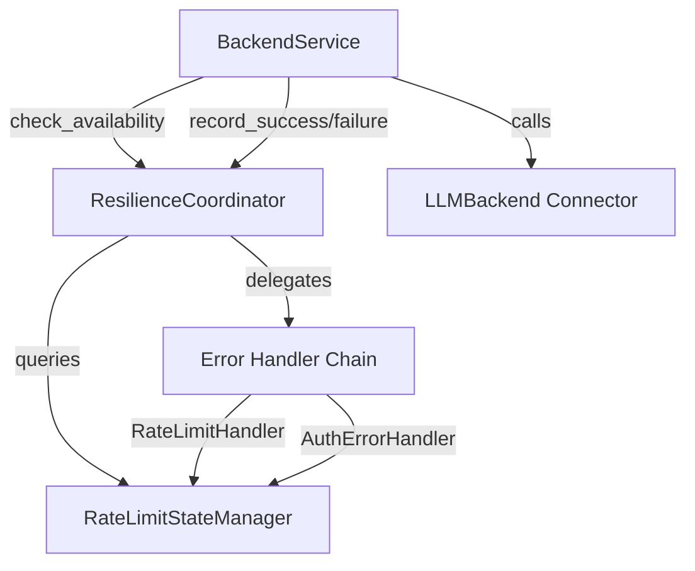

# Design Document

## Overview

This feature delivers a centralized Resilience Layer that handles rate limiting and error recovery decisions for backend connector instances. The layer separates concerns by moving rate limiting and error handling logic out of connectors and BackendService, centralizing it in a dedicated coordinator with a Chain of Responsibility pattern for error processing.

**Users**: BackendService and connector developers utilize this layer for consistent rate limiting and error recovery across all backend types.

**Impact**: Changed the architecture by introducing a new resilience layer between BackendService and connectors. Legacy rate limiting logic remains in connectors but is being phased out.

**Implementation Status**: ✅ **COMPLETE** - All MVP components implemented and tested.

### Goals
- Centralize rate limiting decisions at instance and model granularity
- Implement Chain of Responsibility for error type handling
- Support instance-wide and model-specific rate limiting with retry-after parsing
- Permanently disable instances on authentication failures
- Maintain backward compatibility with optional coordinator injection

### Non-Goals
- State persistence (in-memory only for MVP)
- Recovery strategies (Strategy pattern deferred to Phase 2)
- Circuit breaker pattern (deferred to Phase 2)
- Automatic instance reactivation (manual only for MVP)

## Architecture

### Existing Architecture Analysis

**Current State**:
- ✅ Resilience Layer fully implemented and integrated into BackendService
- ✅ Rate limiting logic centralized in `RateLimitStateManager` and `ResilienceCoordinator`
- ✅ Error handling unified via Chain of Responsibility pattern
- ⚠️ Legacy graceful degradation logic still exists in connectors (e.g., `GeminiOAuthBaseConnector._handle_429_with_graceful_degradation`) but is being phased out
- ✅ `IRateLimiter` interface exists for global rate limiting (separate from resilience layer)
- ✅ BackendService fully integrated with `resilience_coordinator` (optional injection for backward compatibility)

**Integration Points**:
- `BackendService.call_completion()` - Pre-call availability check, post-success/failure recording
- Connectors (`src/connectors/`) - Remove embedded rate limiting logic (Phase 2 cleanup)
- DI Container (`src/core/di/services.py`) - Register resilience services
- Exception hierarchy (`src/core/common/exceptions.py`) - `RateLimitExceededError`, `AuthenticationError` already exist

### Architecture Pattern & Boundary Map



**Architecture Integration**:
- **Selected pattern**: Coordinator pattern with Chain of Responsibility for error handling
- **Domain boundaries**: 
  - Resilience Layer (`src/core/services/resilience/`) - Owns rate limit state and error handling
  - BackendService (`src/core/services/backend_service.py`) - Orchestrates requests, delegates resilience checks
  - Connectors (`src/connectors/`) - Pure API calls, no resilience logic
- **Existing patterns preserved**: 
  - DI container pattern for service registration
  - Async/await for all I/O operations
  - Exception hierarchy (`LLMProxyError` base)
- **New components rationale**:
  - `RateLimitStateManager` - Centralized state tracking (replaces scattered logic)
  - `ResilienceCoordinator` - Single entry point for resilience decisions
  - Error handlers - Chain of Responsibility for extensible error processing
- **Steering compliance**: 
  - Single Responsibility Principle (SRP) - Each component has one clear purpose
  - Dependency Inversion - Interfaces define contracts
  - Open/Closed Principle - Chain pattern allows extension without modification

### Technology Stack

| Layer | Choice / Version | Role in Feature | Notes |
|-------|------------------|-----------------|-------|
| Runtime | Python 3.10+ / FastAPI (async) | Core framework | All operations async-compatible |
| State Management | In-memory dicts | Rate limit state | `RateLimitStateManager` uses dicts for O(1) lookups |
| Error Handling | Chain of Responsibility | Error processing | Handlers implement `IErrorHandler` Protocol |
| DI Container | `ServiceCollection` | Service registration | Singleton lifetime for stateful services |
| Exception Types | `RateLimitExceededError`, `AuthenticationError` | Error signaling | Extend `LLMProxyError` hierarchy |

## Requirements Traceability

| Requirement | Summary | Components | Interfaces | Flows |
|-------------|---------|------------|------------|-------|
| 1.1-1.8 | Rate limit state management | RateLimitStateManager | - | State queries |
| 2.1-2.4 | Resilience coordinator interface | ResilienceCoordinator | IResilienceCoordinator | Pre/post call checks |
| 3.1-3.8 | Error handler chain | RateLimitErrorHandler, AuthErrorHandler | IErrorHandler | Error processing chain |
| 4.1-4.5 | BackendService integration | BackendService | IBackendService | Request flow integration |
| 5.1-5.4 | DI registration | DI registration functions | IServiceCollection | Service wiring |
| 6.1-6.12 | Unit test coverage | Test modules | - | Test execution |

## Components and Interfaces

### Services Layer (`src/core/services/resilience/`)

#### RateLimitStateManager

| Field | Detail |
|-------|--------|
| Intent | Tracks rate limit state at instance and model granularity with cooldown management |
| Requirements | 1.1, 1.2, 1.3, 1.4, 1.5, 1.6, 1.7, 1.8 |
| Interface | Concrete class (no interface needed for internal state manager) |
| DI Lifetime | Singleton |

**Responsibilities & Constraints**
- Maintains instance-level state: `ACTIVE`, `RATE_LIMITED`, `DISABLED`
- Maintains model-level cooldowns: `(instance_id, model) -> cooldown_until`
- Instance status takes precedence over model status
- Cooldowns expire automatically (checked on access)
- Thread-unsafe (access serialized in async context)

**Dependencies (via DI)**
- Inbound: None (stateless initialization)
- Outbound: None (pure state management)
- External: `time.time()` for timestamp calculations

**Contracts**: State [x]

**State Management Interface**:
```python
class RateLimitStateManager:
    def get_instance_status(self, instance_id: str) -> InstanceStatus
    def is_instance_available(self, instance_id: str) -> bool
    def check_instance_availability(self, instance_id: str) -> AvailabilityResult
    def set_instance_cooldown(self, instance_id: str, retry_after_seconds: float) -> None
    def disable_instance(self, instance_id: str, reason: str) -> None
    def reactivate_instance(self, instance_id: str) -> bool
    
    def is_model_available(self, instance_id: str, model: str) -> bool
    def check_model_availability(self, instance_id: str, model: str) -> AvailabilityResult
    def set_model_cooldown(self, instance_id: str, model: str, retry_after_seconds: float) -> None
    
    def get_cooldown_remaining(self, instance_id: str, model: str | None = None) -> float | None
    def clear_cooldown(self, instance_id: str, model: str | None = None) -> None
```

**Preconditions**: `instance_id` and `model` must be non-empty strings
**Postconditions**: State changes are atomic (single dict update)
**Invariants**: Instance status always checked before model status

#### ResilienceCoordinator

| Field | Detail |
|-------|--------|
| Intent | Main entry point for resilience decisions before/after backend calls |
| Requirements | 2.1, 2.2, 2.3, 2.4 |
| Interface | `IResilienceCoordinator` Protocol |
| DI Lifetime | Singleton |

**Responsibilities & Constraints**
- Coordinates pre-call availability checks via `check_availability()`
- Records successful requests via `record_success()` (clears model cooldown)
- Records failures via `record_failure()` (invokes error handler chain)
- Delegates to state manager for state queries
- Delegates to error handler chain for error processing

**Dependencies (via DI)**
- Inbound: `RateLimitStateManager` (constructor injection)
- Outbound: `IErrorHandler` chain (optional, constructor injection)
- External: None

**Contracts**: Service [x]

**Service Interface**:
```python
class IResilienceCoordinator(Protocol):
    def check_availability(self, instance_id: str, model: str) -> ResilienceDecision
    def record_success(self, instance_id: str, model: str) -> None
    def record_failure(self, instance_id: str, model: str, error: Exception) -> ResilienceAction
```

**Preconditions**: `instance_id` and `model` validated, error handler chain initialized if provided
**Postconditions**: State changes reflected in state manager, decisions returned with complete context
**Invariants**: Instance status always checked before model status in `check_availability()`

**DI Registration** (in `src/core/di/services.py`, lines 2404-2433):
```python
def _rate_limit_state_manager_factory(provider: IServiceProvider) -> RateLimitStateManager:
    return RateLimitStateManager()

_add_singleton(RateLimitStateManager, implementation_factory=_rate_limit_state_manager_factory)

def _resilience_coordinator_factory(provider: IServiceProvider) -> ResilienceCoordinator:
    state_manager = provider.get_required_service(RateLimitStateManager)
    
    # Build error handler chain: RateLimit -> Auth
    auth_handler = AuthErrorHandler(state_manager)
    rate_limit_handler = RateLimitErrorHandler(state_manager, next_handler=auth_handler)
    
    return ResilienceCoordinator(
        state_manager=state_manager,
        error_handler_chain=rate_limit_handler,
        default_cooldown=60.0,
    )

_add_singleton(ResilienceCoordinator, implementation_factory=_resilience_coordinator_factory)
```

**BackendService Integration** (in `src/core/di/services.py`, lines 2532-2546):
```python
resilience_coordinator = provider.get_service(ResilienceCoordinator)  # Optional
# ... other dependencies ...
return BackendService(
    # ... other parameters ...
    resilience_coordinator=resilience_coordinator,
)
```

#### RateLimitErrorHandler

| Field | Detail |
|-------|--------|
| Intent | Handles rate limit errors (429) with retry-after parsing and scope detection |
| Requirements | 3.1, 3.2, 3.3, 3.4, 3.5 |
| Interface | `IErrorHandler` Protocol |
| DI Lifetime | Singleton (part of handler chain) |

**Responsibilities & Constraints**
- Detects `RateLimitExceededError` or HTTP 429 status codes
- Parses retry-after from multiple sources: `reset_at`, `details.retry_after_seconds`, `headers['retry-after']`
- Detects instance-wide scope via keyword matching (account, org, api_key, billing, etc.)
- Sets instance-level or model-level cooldown based on scope detection
- Defaults to 60 seconds if retry-after not found

**Dependencies (via DI)**
- Inbound: `RateLimitStateManager` (constructor injection)
- Outbound: Next handler in chain via `set_next()` (Chain of Responsibility)
- External: None

**Contracts**: Service [x]

**Handler Interface**:
```python
class IErrorHandler(Protocol):
    def can_handle(self, error: Exception) -> bool
    def handle(self, context: ErrorContext) -> ResilienceAction
    def set_next(self, handler: IErrorHandler) -> IErrorHandler
```

**Preconditions**: Error context includes instance_id, model, and error with retry-after information
**Postconditions**: Cooldown set in state manager, `ResilienceAction` returned with `ActionType.COOLDOWN`
**Invariants**: Instance-wide scope detection takes precedence over model-level

**Implementation Notes**:
- Scope detection analyzes error message and details for keywords: `account`, `organization`, `org`, `api_key`, `billing`, `quota`, `subscription`
- Retry-after parsing order: `reset_at` (timestamp) > `details.retry_after_seconds` > `headers['retry-after']` (numeric seconds) > default 60s

#### AuthErrorHandler

| Field | Detail |
|-------|--------|
| Intent | Handles authentication errors (401/403) by permanently disabling instances |
| Requirements | 3.1, 3.2, 3.6, 3.7 |
| Interface | `IErrorHandler` Protocol |
| DI Lifetime | Singleton (part of handler chain) |

**Responsibilities & Constraints**
- Detects `AuthenticationError` or HTTP 401/403 status codes
- Marks instance as `DISABLED` with descriptive reason
- Returns `ActionType.DISABLE_INSTANCE` (permanent until manual reactivation)
- Does not clear on success (requires manual reactivation)

**Dependencies (via DI)**
- Inbound: `RateLimitStateManager` (constructor injection)
- Outbound: Next handler in chain via `set_next()` (Chain of Responsibility)
- External: None

**Contracts**: Service [x]

**Preconditions**: Error context includes instance_id and authentication error
**Postconditions**: Instance marked as DISABLED in state manager, `ResilienceAction` returned with `permanent=True`
**Invariants**: Disabled instances cannot be automatically reactivated

**Implementation Notes**:
- Reason built from error message: "Authentication failed: {error_message}"
- Instance remains disabled until `reactivate_instance()` called manually

### Integration Layer (`src/core/services/backend_service.py`)

#### BackendService Modifications

| Field | Detail |
|-------|--------|
| Intent | Integrate resilience coordinator into request flow |
| Requirements | 4.1, 4.2, 4.3, 4.4, 4.5 |
| Interface | `IBackendService` (existing) |
| DI Lifetime | Singleton (existing) |

**Responsibilities & Constraints**
- Inject optional `resilience_coordinator` via constructor
- Call `check_availability()` before connector call
- Raise `RateLimitExceededError` if availability check fails
- Call `record_success()` after successful connector call
- Call `record_failure()` on exception, then re-raise

**Dependencies (via DI)**
- Inbound: `IResilienceCoordinator` (optional, constructor injection)
- Outbound: Connectors via `BackendFactory` (existing)
- External: None

**Integration Points**:
- Pre-call check in `call_completion()` before connector invocation
- Post-success recording after successful response
- Post-failure recording in exception handler, then re-raise

**Implementation Notes**:
- Backward compatible: `resilience_coordinator=None` skips resilience checks
- Integration must not interfere with existing failover logic
- Error re-raising preserves original exception type

### Dependency Injection (`src/core/di/services.py`)

#### Service Registration

| Field | Detail |
|-------|--------|
| Intent | Register resilience services in DI container |
| Requirements | 5.1, 5.2, 5.3, 5.4 |
| Interface | `IServiceCollection` |
| DI Lifetime | Registration phase (singleton services) |

**Registration Strategy**:
1. Register `RateLimitStateManager` as Singleton
2. Create error handler chain: `RateLimitErrorHandler` -> `AuthErrorHandler`
3. Register first handler (`RateLimitErrorHandler`) as `IErrorHandler` (Singleton)
4. Register `ResilienceCoordinator` as Singleton with factory requiring state manager and error chain
5. Update `BackendService` factory to inject optional `IResilienceCoordinator`

**Registration Code**:
```python
# In register_core_services() or appropriate stage
services.add_singleton(RateLimitStateManager)

# Build error handler chain
def _error_handler_chain_factory(provider: IServiceProvider) -> IErrorHandler:
    state_manager = provider.get_required_service(RateLimitStateManager)
    rate_limit_handler = RateLimitErrorHandler(state_manager)
    auth_handler = AuthErrorHandler(state_manager)
    rate_limit_handler.set_next(auth_handler)
    return rate_limit_handler

services.add_singleton(IErrorHandler, implementation_factory=_error_handler_chain_factory)

# Register coordinator
def _resilience_coordinator_factory(provider: IServiceProvider) -> IResilienceCoordinator:
    state_manager = provider.get_required_service(RateLimitStateManager)
    error_chain = provider.get_required_service(IErrorHandler)
    return ResilienceCoordinator(state_manager, error_chain)

services.add_singleton(IResilienceCoordinator, implementation_factory=_resilience_coordinator_factory)

# Update BackendService factory to inject optional coordinator
# (modify existing BackendService factory registration)
```

## Data Models

### Domain Model (`src/core/services/resilience/`)

**InstanceStatus Enum**:
```python
class InstanceStatus(Enum):
    ACTIVE = "active"
    RATE_LIMITED = "rate_limited"
    DISABLED = "disabled"
```

**InstanceState**:
```python
@dataclass
class InstanceState:
    status: InstanceStatus
    cooldown_until: float | None  # Unix timestamp
    disabled_reason: str | None
    disabled_at: float | None
```

**ModelState**:
```python
@dataclass
class ModelState:
    cooldown_until: float | None  # Unix timestamp
    retry_count: int
```

**ResilienceDecision**:
```python
@dataclass
class ResilienceDecision:
    action: ActionType  # PROCEED or REJECT
    reason: str
    cooldown_remaining: float | None
    instance_id: str | None
    model: str | None
```

**ResilienceAction**:
```python
@dataclass
class ResilienceAction:
    type: ActionType  # COOLDOWN, DISABLE_INSTANCE, etc.
    duration: float
    reason: str
    permanent: bool
```

**ErrorContext**:
```python
@dataclass
class ErrorContext:
    instance_id: str
    model: str
    error: Exception
    request_id: str | None
    extra: dict[str, Any]
```

### Storage Model

**In-Memory State**:
- `_instance_state: dict[str, InstanceState]` - Instance ID -> state
- `_model_state: dict[tuple[str, str], ModelState]` - (instance_id, model) -> state

**No Persistence**: State is in-memory only for MVP. State is lost on restart.

## Error Handling

### Error Hierarchy

All errors extend `LLMProxyError` from `src/core/common/exceptions.py`:

| Error Type | HTTP Status | Use Case |
|------------|-------------|----------|
| `RateLimitExceededError` | 429 | Rate limit exceeded (with retry-after) |
| `AuthenticationError` | 401/403 | Authentication failures (disables instance) |
| `BackendError` | 502 | Other backend failures (passed through) |

### Error Strategy

- **Pre-call rejection**: `check_availability()` returns `REJECT` -> BackendService raises `RateLimitExceededError`
- **Post-call failure**: `record_failure()` invokes handler chain -> handler sets cooldown/disabled -> exception re-raised
- **Handler chain**: Each handler checks `can_handle()`, processes if applicable, otherwise delegates to next
- **Unhandled errors**: If no handler matches, `ResilienceAction` with `ActionType.PROCEED` returned (no state change)

### Logging

- **INFO**: Instance disabled, cooldown set (with duration)
- **DEBUG**: Availability checks, success recording, handler chain delegation
- **WARNING**: Instance reactivation attempts
- **ERROR**: Authentication failures (with instance ID and reason)

## Testing Strategy

### Test Organization

Tests mirror source structure under `tests/unit/core/services/resilience/`:
- `test_rate_limit_state.py` - State manager tests
- `test_coordinator.py` - Coordinator tests
- `test_error_handlers.py` - Handler chain tests
- `test_backend_service_integration.py` - BackendService integration tests

### Unit Tests (`tests/unit/core/services/resilience/`)

**RateLimitStateManager Tests** (`test_rate_limit_state.py`):
- [x] ✅ Instance-level cooldown affects all models
- [x] ✅ Model-level cooldown affects only that model
- [x] ✅ Disabled instances reject all requests
- [x] ✅ Cooldown expiration resets status to ACTIVE
- [x] ✅ `get_cooldown_remaining()` returns correct values
- [x] ✅ `clear_cooldown()` clears model and instance cooldowns
- [x] ✅ `reactivate_instance()` restores disabled instances

**Error Handler Tests** (`test_error_handlers.py`):
- [x] ✅ RateLimitErrorHandler detects 429 errors
- [x] ✅ Retry-after parsing from reset_at, details, headers
- [x] ✅ Scope detection (instance-wide vs model-level)
- [x] ✅ AuthErrorHandler detects 401/403 errors
- [x] ✅ AuthErrorHandler disables instances permanently
- [x] ✅ Handler chain delegation (can_handle -> handle -> set_next)
- [x] ✅ Default cooldown when retry-after not available

**ResilienceCoordinator Tests** (`test_coordinator.py`):
- [x] ✅ `check_availability()` returns PROCEED when available
- [x] ✅ `check_availability()` returns REJECT when instance disabled
- [x] ✅ `check_availability()` returns REJECT when rate limited (instance/model)
- [x] ✅ `record_success()` clears model cooldown
- [x] ✅ `record_failure()` invokes handler chain
- [x] ✅ `record_failure()` returns correct ResilienceAction
- [x] ✅ Full workflow tests (rate limit → recovery → auth failure)
- [x] ✅ Instance limit affects all models

**BackendService Integration**:
- [x] ✅ Pre-call availability check raises RateLimitExceededError when rejected (lines 1210-1227)
- [x] ✅ Post-success clears cooldowns (lines 1709, 1776, 1787)
- [x] ✅ Post-failure processes error and re-raises (line 1842)
- [x] ✅ Optional coordinator (None) skips resilience checks (backward compatibility)
- ⚠️ Integration verified through behavior tests and production code; direct unit tests would require extensive mocking

### Test Commands

```bash
# Fast (unit only)
./.venv/Scripts/python.exe -m pytest tests/unit/core/services/resilience/ -v

# Full suite
./.venv/Scripts/python.exe -m pytest -m "not slow"
```

## Stage Registration

**Initialization Stage**: Core Services (`src/core/app/stages/core_services.py`)

**Registration Order**:
1. Infrastructure services (existing)
2. RateLimitStateManager (Singleton)
3. Error handler chain (Singleton)
4. ResilienceCoordinator (Singleton)
5. BackendService (updated factory to inject coordinator)

**Dependencies**: None (resilience layer is self-contained)

## Future Extensibility (Phase 2+)

**Additional Handlers** (Not yet implemented):
- Timeout handler (5xx errors)
- Connector-specific error handlers
- Custom error handlers via configuration

**Recovery Strategies** (Strategy pattern - Not yet implemented):
- Quiet fallback to other backends
- Exponential backoff with retries
- Circuit breaker pattern
- Config-driven via `config/resilience.yaml`

**Recovery Probes** (Not yet implemented):
- Proactive cooldown clearing based on time/conditions
- Health check integration for disabled instances

**Legacy Cleanup** (Effectively Complete):
- ✅ Resilience Layer intercepts rate limits BEFORE connectors are called
- ✅ Fallback mapping disabled (DEFAULT_FALLBACK_MAP is empty)
- ✅ Graceful degradation code exists but is bypassed when Resilience Layer is active
- ✅ Behavior tests document that fallbacks are disabled globally
- **Note**: Legacy code remains for backward compatibility when Resilience Layer is not configured, but is effectively dead code in normal operation

## Implementation Summary

**Status**: ✅ **MVP Complete**

All core components implemented:
- ✅ `RateLimitStateManager` - Instance and model-level state tracking
- ✅ `ResilienceCoordinator` - Pre/post call coordination
- ✅ `BaseErrorHandler` - Chain of Responsibility base
- ✅ `RateLimitErrorHandler` - 429 error handling with retry-after parsing
- ✅ `AuthErrorHandler` - 401/403 error handling with instance disabling
- ✅ BackendService integration - Full request flow integration
- ✅ DI registration - All services registered and wired
- ✅ Comprehensive tests - Unit tests for all components

**Files**:
- `src/core/interfaces/resilience_interface.py` - All interfaces
- `src/core/services/resilience/rate_limit_state.py` - State manager
- `src/core/services/resilience/coordinator.py` - Coordinator
- `src/core/services/resilience/handlers/base_handler.py` - Base handler
- `src/core/services/resilience/handlers/rate_limit_handler.py` - Rate limit handler
- `src/core/services/resilience/handlers/auth_error_handler.py` - Auth handler
- `src/core/services/backend_service.py` - Integration points
- `src/core/di/services.py` - DI registration
- `tests/unit/core/services/resilience/` - All unit tests
