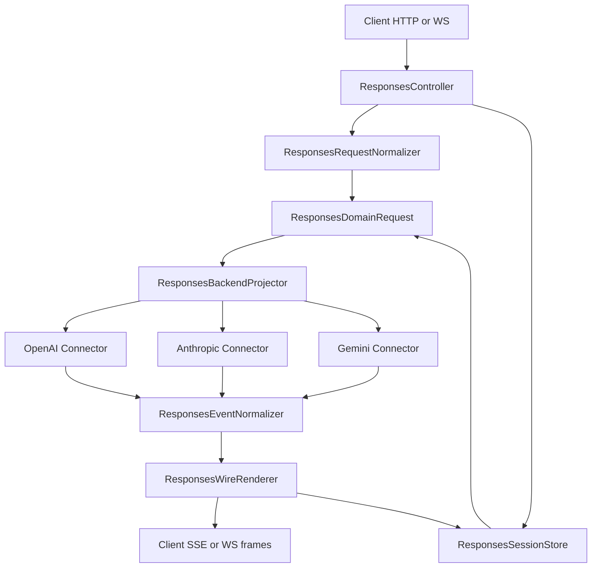
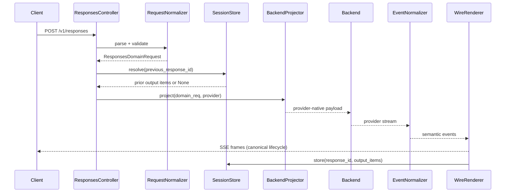
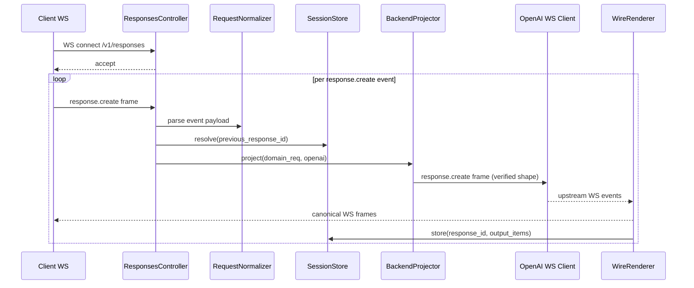
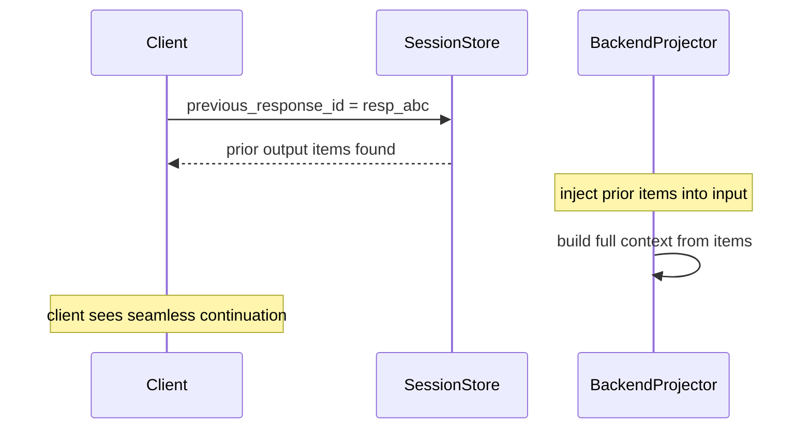

# Design Document: Responses API Frontend Compliance

## Overview

This feature makes the proxy's client-facing Responses API frontend (`/v1/responses`)
fully compliant with the OpenAI Responses API specification while preserving the
proxy's role as a translation layer to multiple backend API flavors. The current
implementation is built on a chat-completions abstraction (`CanonicalChatRequest`)
that loses Responses-native item structure, implements `previous_response_id` as a
connection-local cache, emits non-standard SSE/WebSocket event names, and sends
malformed upstream WebSocket frames.

**Users**: Any client using the OpenAI Responses API SDK or compatible tooling routed
through the proxy — including agent frameworks (Codex, OpenCode) and structured-output
clients.

**Impact**: Replaces the lossy Responses→Chat translation path with a first-class
Responses domain model, a persistent session store, a canonical event state machine,
and per-provider/backend-flavor projectors so clients can speak Responses API to the
proxy while the proxy adapts to native Responses backends, legacy OpenAI-style
surfaces, Anthropic, and Gemini. Existing chat completions paths are unaffected.

### Goals

- Fix upstream WebSocket `response.create` envelope (immediate connection drop fix)
- Introduce `ResponsesDomainRequest` preserving typed input/output items end-to-end
- Implement persistent `ResponsesSessionStore` for `previous_response_id` resolution
- Implement `ResponsesWireRenderer` emitting canonical SSE/WS lifecycle events
- Implement per-provider/backend-flavor `ResponsesBackendProjector` for native
  Responses, legacy OpenAI-style, Anthropic, and Gemini paths
- Surface explicit provider limitation errors instead of silent semantic degradation

### Non-Goals

- Realtime Audio API (separate WebSocket protocol)
- Assistants API / Threads (different resource model)
- Multi-process distributed session store (interface is designed for it; implementation is single-process)
- Changing existing chat completions (`/v1/chat/completions`) paths
- Full Responses API feature parity for every optional field on day one

---

## Architecture

### Existing Architecture Analysis

The current pipeline:

```
Client → ResponsesController → responses_to_domain_request()
       → CanonicalChatRequest → TranslationService → Backend connector
       → ProcessedResponse stream → wire_stream_emitter → SSE/WS frames
```

Problems:
- `responses_to_domain_request` flattens `input` items into `messages` immediately
- `CanonicalChatRequest` has no concept of Responses item types or item ids
- `wire_stream_emitter` invents proxy-specific event names
- WS handler uses a per-connection `response_cache` dict
- Upstream WS client sends malformed `response.create` frames

### New Architecture

```
Client → ResponsesController
       → ResponsesRequestNormalizer  (parse + validate, no flattening)
       → ResponsesDomainRequest      (typed items preserved)
       → ResponsesBackendProjector   (per-provider: OpenAI / Anthropic / Gemini)
       → Backend connector
       → ResponsesEventNormalizer    (provider stream → semantic events)
       → ResponsesWireRenderer       (semantic events → canonical SSE/WS frames)
       → Client
```

Session continuity:
```
ResponsesController → ResponsesSessionStore.resolve(previous_response_id)
                    → inject prior output items into ResponsesDomainRequest
ResponsesController → ResponsesSessionStore.store(response_id, output_items)
```

### Architecture Pattern & Boundary Map



### Technology Stack

| Layer | Choice | Role | Notes |
|-------|--------|------|-------|
| Framework | FastAPI async | HTTP + WebSocket transport | Unchanged |
| Domain model | Pydantic v2 | `ResponsesDomainRequest`, item types | New models |
| Session store | In-process dict with TTL (phase 1) | `previous_response_id` resolution | Interface allows DB backend later |
| DI | `ServiceCollection` | Wire `ResponsesSessionStore`, projectors | Registered in `ProcessorStage` |
| Error model | `LLMProxyError` hierarchy | Typed proxy exceptions | New `ResponsesProtocolError` subclass |
| Streaming | `AsyncGenerator` | Semantic event pipeline | Unchanged transport |

---

## System Flows

### HTTP Request Flow



### WebSocket Flow



### Multi-Turn Conversation Flow



---

## Requirements Traceability

| Requirement | Summary | Components | Key Flows |
|-------------|---------|------------|-----------|
| 1.1, 1.2 | Transport-correct request framing | `RequestNormalizer`, WS handler | HTTP + WS request flows |
| 1.3–1.6 | Validation and error classification | `RequestNormalizer`, `ResponsesProtocolError` | Error handling |
| 2.1–2.6 | Response object compliance, item fidelity | `ResponsesDomainRequest`, `WireRenderer` | HTTP response flow |
| 3.1–3.7 | Conversation linkage, `previous_response_id` | `ResponsesSessionStore` | Multi-turn flow |
| 4.1–4.5 | Tool item structure and linkage | `ResponsesDomainRequest`, `BackendProjector` | All flows |
| 5.1–5.9 | Canonical SSE/WS event lifecycle | `EventNormalizer`, `WireRenderer` | Streaming flows |
| 6.1–6.7 | Cross-backend translation, limitation disclosure | `BackendProjector` per provider | All backend paths |
| 7.1–7.5 | Error compatibility, operational predictability | `ResponsesProtocolError`, transport adapters | Error flows |

---

## Components and Interfaces

### Summary Table

| Component | Layer | Intent | Req Coverage | Key Dependencies |
|-----------|-------|--------|--------------|-----------------|
| `ResponsesRequestNormalizer` | Domain | Parse + validate Responses request, no flattening | 1.1–1.6 | `ResponsesDomainRequest` |
| `ResponsesDomainRequest` | Domain | First-class typed item model | 2.1–2.6, 4.1–4.5 | Pydantic v2 |
| `ResponsesSessionStore` | Service | Persistent response history for linkage | 3.1–3.5 | DI container |
| `ResponsesBackendProjector` | Connector | Per-provider translation from domain model | 6.1–6.5 | Backend connectors |
| `ResponsesEventNormalizer` | Adapter | Provider stream → semantic events | 5.1–5.6 | `AsyncGenerator` |
| `ResponsesWireRenderer` | Transport | Semantic events → canonical SSE/WS frames | 5.1–5.6 | `ResponsesEventNormalizer` |
| `ResponsesProtocolError` | Domain | Typed error hierarchy for Responses failures | 7.1–7.5 | `LLMProxyError` |
| WS upstream fix | Connector | Correct `response.create` envelope | 1.2 | `openai_websocket_client.py` |

---

### Domain Layer

#### `ResponsesDomainRequest`

| Field | Detail |
|-------|--------|
| Intent | First-class Responses request model preserving typed input items |
| Requirements | 2.3, 4.1–4.5 |

**Responsibilities & Constraints**
- Holds `input: list[ResponsesInputItem]` — never flattened to messages
- Holds `instructions: str | None` separately from input
- Holds `previous_response_id: str | None` for session linkage
- Holds `tools: list[ResponsesTool] | None`
- Holds `stream: bool`, `model: str`, and all standard Responses parameters
- Is immutable after construction (Pydantic frozen model)

**Service Interface**
```python
class ResponsesContentPart(BaseModel):
    type: str  # "input_text", "output_text", "image", "file", "refusal"
    text: str | None = None
    refusal: str | None = None
    image_url: dict[str, Any] | None = None
    model_config = {"extra": "allow"}

class ResponsesInputItem(BaseModel):
    """Discriminated union over Responses API input item types."""
    id: str | None = None
    type: str  # "message", "function_call", "function_call_output", "reasoning", "item_reference"
    # message fields
    role: str | None = None          # "user", "assistant", "system", "developer"
    content: list[ResponsesContentPart] | str | None = None
    status: str | None = None        # "completed", "incomplete", "in_progress"
    # function_call fields
    call_id: str | None = None
    name: str | None = None
    arguments: str | None = None
    # function_call_output fields
    output: str | None = None
    acknowledged_safety_checks: list[dict[str, Any]] | None = None
    # item_reference fields
    item_id: str | None = None
    model_config = {"extra": "allow"}

class ResponsesDomainRequest(BaseModel):
    model: str
    input: list[ResponsesInputItem] = []
    instructions: str | None = None
    previous_response_id: str | None = None
    # conversation and previous_response_id are mutually exclusive
    conversation: str | None = None
    tools: list[dict[str, Any]] | None = None
    tool_choice: str | dict[str, Any] | None = None
    parallel_tool_calls: bool | None = None
    stream: bool = False
    temperature: float | None = None
    max_output_tokens: int | None = None
    max_tool_calls: int | None = None
    response_format: dict[str, Any] | None = None
    reasoning: dict[str, Any] | None = None
    truncation: str | None = None
    include: list[str] | None = None
    store: bool | None = None
    metadata: dict[str, str] | None = None
    service_tier: str | None = None
    model_config = {"extra": "allow", "frozen": True}

    @model_validator(mode="after")
    def validate_conversation_exclusivity(self) -> "ResponsesDomainRequest":
        if self.previous_response_id and self.conversation:
            raise ValueError(
                "previous_response_id and conversation are mutually exclusive"
            )
        return self
```

---

#### `ResponsesRequestNormalizer`

| Field | Detail |
|-------|--------|
| Intent | Parse and validate Responses API request payload without flattening items |
| Requirements | 1.1–1.6 |

**Responsibilities & Constraints**
- Accepts raw dict (HTTP body or WS event payload)
- Validates required fields (`model`)
- Normalizes `input` string shorthand to `[{type: "message", role: "user", content: [{type: "input_text", text: ...}]}]`
- Does NOT convert `input` to `messages`
- Raises `ResponsesProtocolError` with client-visible code for validation failures

**Service Interface**
```python
class ResponsesRequestNormalizer:
    def normalize(
        self, raw: dict[str, Any]
    ) -> ResponsesDomainRequest:
        """Parse and validate. Raises ResponsesProtocolError on invalid input."""
        ...
```

---

### Service Layer

#### `ResponsesSessionStore`

| Field | Detail |
|-------|--------|
| Intent | Persistent response history for `previous_response_id` resolution |
| Requirements | 3.1–3.5 |

**Responsibilities & Constraints**
- Stores completed response output items keyed by response id
- Resolves `previous_response_id` to prior output items
- TTL-based expiry (default 1 hour, configurable)
- Thread-safe for async access
- Phase 1: in-process dict with TTL; interface allows external store later

**Service Interface**
```python
class IResponsesSessionStore(Protocol):
    async def store(
        self,
        response_id: str,
        output_items: list[ResponsesOutputItem],
        ttl_seconds: int = 3600,
    ) -> None: ...

    async def resolve(
        self,
        previous_response_id: str,
    ) -> list[ResponsesOutputItem] | None:
        """Returns None if not found (caller should surface contract-compatible error)."""
        ...

class InMemoryResponsesSessionStore:
    """Phase 1 implementation. Replace with DB-backed store for multi-process."""
    ...
```

**State Management**
- State model: `dict[str, tuple[list[ResponsesOutputItem], float]]` (id → items, expiry)
- Concurrency: `asyncio.Lock` per store instance
- Persistence: in-memory only in phase 1; no cross-restart durability

---

### Connector Layer

#### `ResponsesBackendProjector`

| Field | Detail |
|-------|--------|
| Intent | Translate `ResponsesDomainRequest` to provider-native wire payload |
| Requirements | 6.1–6.5 |

**Responsibilities & Constraints**
- One projector per provider family: `OpenAIResponsesProjector`, `AnthropicResponsesProjector`, `GeminiResponsesProjector`
- `OpenAIResponsesProjector`: passes `input`, `instructions`, `previous_response_id` natively; no flattening
- `AnthropicResponsesProjector`: projects items to Anthropic `messages` + `system`; preserves tool-call linkage via `tool_use`/`tool_result` blocks; stores prior context from session store
- `GeminiResponsesProjector`: projects items to Gemini `contents`; maps function calls to `functionCall`/`functionResponse` parts
- Each projector returns `(provider_payload, capability_flags)` where `capability_flags` lists features that could not be preserved
- If `capability_flags` is non-empty and the feature is required, raises `ResponsesProtocolError` with `provider_limitation` code

**Service Interface**
```python
class IResponsesBackendProjector(Protocol):
    def project(
        self,
        request: ResponsesDomainRequest,
        prior_items: list[ResponsesOutputItem] | None,
    ) -> tuple[dict[str, Any], list[str]]:
        """Returns (provider_payload, unsupported_features)."""
        ...
```

---

#### `ResponsesEventNormalizer`

| Field | Detail |
|-------|--------|
| Intent | Normalize provider-specific stream chunks into semantic Responses events |
| Requirements | 5.1–5.6 |

**Responsibilities & Constraints**
- Accepts `AsyncGenerator` of provider-specific chunks (`ProcessedResponse` or raw dicts)
- Emits `ResponsesSemanticEvent` objects (typed, provider-neutral)
- Handles OpenAI native (already Responses events), Anthropic SSE, Gemini SSE
- Guarantees terminal event emission even on upstream error

**Semantic Event Types**
```python
class ResponsesSemanticEventType(str, Enum):
    RESPONSE_CREATED = "response_created"
    RESPONSE_IN_PROGRESS = "response_in_progress"
    OUTPUT_ITEM_ADDED = "output_item_added"
    CONTENT_PART_ADDED = "content_part_added"
    TEXT_DELTA = "text_delta"
    TEXT_DONE = "text_done"
    TOOL_CALL_ARGS_DELTA = "tool_call_args_delta"
    TOOL_CALL_ARGS_DONE = "tool_call_args_done"
    CONTENT_PART_DONE = "content_part_done"
    OUTPUT_ITEM_DONE = "output_item_done"
    RESPONSE_COMPLETED = "response_completed"
    RESPONSE_FAILED = "response_failed"
    RESPONSE_INCOMPLETE = "response_incomplete"
    # Passthrough: unknown/built-in tool events forwarded as-is
    PASSTHROUGH = "passthrough"

class ResponsesSemanticEvent(BaseModel):
    type: ResponsesSemanticEventType
    response_id: str
    sequence_number: int          # monotonic per stream, required on all wire frames
    output_index: int | None = None   # official field name (not item_index)
    content_index: int | None = None  # official field name (not part_index)
    item_id: str | None = None
    delta: str | None = None
    text: str | None = None
    item: dict[str, Any] | None = None
    part: dict[str, Any] | None = None
    response: dict[str, Any] | None = None
    error: dict[str, Any] | None = None
    raw: dict[str, Any] | None = None  # for PASSTHROUGH events
```

**Wire field mapping** (semantic → official SSE JSON keys):

| Semantic field | Wire JSON key | Notes |
|---------------|---------------|-------|
| `output_index` | `output_index` | Required on item/content/delta events |
| `content_index` | `content_index` | Required on content/delta events |
| `item_id` | `item_id` | Present on item events |
| `sequence_number` | `sequence_number` | Required on ALL events, monotonic from 0 |
| `delta` | `delta` | Text delta string |
| `text` | `text` | Finalized text on done events |

---

#### `ResponsesWireRenderer`

| Field | Detail |
|-------|--------|
| Intent | Render semantic events into canonical Responses API SSE or WebSocket frames |
| Requirements | 5.1–5.6, 1.2 |

**Responsibilities & Constraints**
- Accepts `AsyncGenerator[ResponsesSemanticEvent, None]`
- Emits `sequence_number` on every frame, monotonically increasing from 0 per stream
- Uses official wire field names: `output_index`, `content_index`, `item_id` (not proxy-local names)
- For SSE: yields `data: {...}\n\n` strings; terminal sequence per HTTP SSE transport:
  `response.created` → `response.in_progress` → item/content/delta events → `response.completed`/`response.failed`/`response.incomplete` → `data: [DONE]\n\n`
  Note: `response.done` is a Realtime API concept; HTTP SSE Responses API terminates with typed Responses stream events plus `[DONE]`.
- For WS: yields JSON-serializable dicts; if the transport is the proxy's `/v1/responses` WebSocket mode, use the same typed Responses stream event catalog unless live verification proves a different upstream/downstream contract. Do not substitute Realtime `response.done` semantics unless the transport is explicitly Realtime.
- Forwards `PASSTHROUGH` semantic events as-is to support unknown/built-in tool events (file_search, code_interpreter, web_search, audio, etc.)
- Guarantees a terminal event is always the final frame even on upstream error
- Stores completed response output items in `IResponsesSessionStore` after terminal event

**Service Interface**
```python
class ResponsesWireRenderer:
    def __init__(
        self,
        session_store: IResponsesSessionStore,
        transport: Literal["sse", "websocket"] = "sse",
    ) -> None: ...

    async def render(
        self,
        events: AsyncGenerator[ResponsesSemanticEvent, None],
        response_id: str,
    ) -> AsyncGenerator[str | dict[str, Any], None]:
        """Yields SSE strings or WS dicts with transport-correct terminal behavior."""
        ...
```

---

#### `ResponsesProtocolError`

| Field | Detail |
|-------|--------|
| Intent | Typed error hierarchy for Responses API protocol failures |
| Requirements | 7.1–7.5 |

```python
class ResponsesProtocolError(LLMProxyError):
    """Base for all Responses API protocol errors."""
    def __init__(
        self,
        message: str,
        code: str,
        param: str | None = None,
        status_code: int = 400,
    ) -> None: ...

class ResponsesValidationError(ResponsesProtocolError):
    """Client request validation failure."""

class ResponsesPreviousResponseNotFoundError(ResponsesProtocolError):
    """previous_response_id not found in session store."""
    def __init__(self, response_id: str) -> None: ...

class ResponsesProviderLimitationError(ResponsesProtocolError):
    """Requested feature cannot be preserved for selected backend."""
    def __init__(self, feature: str, provider: str) -> None: ...
```

---

### Connector Fix

#### Upstream WebSocket `response.create` Envelope

**File**: `src/connectors/openai_websocket_client.py`

**Status**: NEEDS VERIFICATION before implementation.

Three different surfaces must not be conflated:

- **HTTP `/responses`**: request bodies are flat top-level JSON (`model`, `input`, etc.)
- **Realtime WebSocket**: `response.create` is nested under `response`
- **Proxy upstream `/v1/responses` WebSocket mode**: still requires live verification

Supporting implementation evidence:
- The official `openai-python` SDK is authoritative for HTTP `/responses` and Realtime
- OpenCode corroborates the HTTP `ResponseStreamEvent` family, but does not provide
  evidence for the beta `/v1/responses` WebSocket surface

**Verified authoritative evidence so far**:
- The installed official `openai-python` SDK (`openai==1.84.0`) defines Realtime
  `ResponseCreateEvent` as nested under `response`
- The same SDK does **not** define a separate typed non-Realtime `/responses` WebSocket
  client event in `types/responses/`

Therefore, nested is proven for Realtime, flat is proven for HTTP `/responses`, and the
proxy's specific upstream `/responses` WebSocket mode still requires live verification
before we change framing.

**Task 1 must begin with a verification step**: capture a raw frame for the exact
`wss://api.openai.com/v1/responses` + `OpenAI-Beta: responses-websocket-mode=...` surface
used by the proxy. Do not infer the answer from HTTP `/responses` or Realtime alone.

**Current code**:
```python
payload = {"type": "response.create", **request_payload}
await self._ws.send(json.dumps(payload))
```

**Candidate fix (nested — apply only if verified)**:
```python
payload = {"type": "response.create", "response": request_payload}
await self._ws.send(json.dumps(payload))
```

**Candidate fix (flat — apply only if current shape is wrong in a different way)**:
```python
# Remove stream/background from payload before sending; keep model/input/etc at top level
payload = {"type": "response.create", **{k: v for k, v in request_payload.items() if k not in ("stream",)}}
await self._ws.send(json.dumps(payload))
```

**Transport matrix**

| Transport | Typed terminal event | Sentinel | Source of truth |
|-----------|----------------------|----------|-----------------|
| HTTP `/responses` SSE | `response.completed` / `response.failed` / `response.incomplete` | `[DONE]` | `types/responses/response_stream_event.py` + `openai/_streaming.py` |
| Realtime WebSocket | `response.done` | none | `types/beta/realtime/response_done_event.py` |
| Proxy upstream `/v1/responses` WebSocket mode | verify live | verify live | live capture required |

Implementation rule: all renderer and controller logic must be driven by the typed HTTP
Responses streaming event catalog unless a transport is explicitly identified as Realtime
or live verification proves that the beta `/v1/responses` WebSocket surface uses a
different contract.

---

## Data Models

### `ResponsesOutputItem`

Stored in `ResponsesSessionStore` after each completed response:

```python
class ResponsesOutputItem(BaseModel):
    id: str
    type: str  # "message", "function_call", "reasoning"
    role: str | None = None
    status: str  # "completed", "incomplete", "failed"
    content: list[ResponsesContentPart] | None = None
    call_id: str | None = None
    name: str | None = None
    arguments: str | None = None
    model_config = {"extra": "allow"}
```

### Session Store Entry

```python
# Internal store shape
_store: dict[str, tuple[list[ResponsesOutputItem], float]]
# key: response_id
# value: (output_items, expiry_unix_timestamp)
```

---

## Error Handling

| Error Condition | Error Class | HTTP Status | WS Frame |
|----------------|-------------|-------------|----------|
| Missing required field | `ResponsesValidationError` | 400 | `type: "error"` frame with OpenAI-compatible fields |
| Invalid field combination | `ResponsesValidationError` | 400 | same |
| `previous_response_id` not found | `ResponsesPreviousResponseNotFoundError` | 400 | `type: "error"` frame with contract-compatible code |
| Provider cannot represent feature | `ResponsesProviderLimitationError` | 400 | `type: "error"` frame with contract-compatible code |
| Upstream rejection | mapped from upstream error | 4xx/5xx | `type: "error"` frame or `response.failed` event |
| Upstream unavailable | `BackendUnavailableError` | 503 | `type: "error"` frame or `response.failed` event |
| Stream failure mid-stream | — | — | `response.failed` terminal event (transport-specific finalization follows) |

All errors preserve `request_id` in the response for correlation (Requirement 7.3).
For streaming transports, the proxy must use the official OpenAI streaming error shape,
including `type`, `code`, `message`, `param`, and `sequence_number`, instead of a
proxy-invented nested error object.

---

## Testing Strategy

### Unit Tests

- `ResponsesRequestNormalizer`: valid inputs, missing model, invalid combinations, string `input` shorthand, array `input` items
- `ResponsesDomainRequest`: item type preservation, content part ordering, frozen model invariants
- `InMemoryResponsesSessionStore`: store/resolve round-trip, TTL expiry, missing id returns None
- `ResponsesBackendProjector` (each provider): item-to-messages projection, tool-call linkage, unsupported feature detection
- `ResponsesEventNormalizer` (each provider): chunk-to-semantic-event mapping, `sequence_number`, passthrough of unknown events, terminal event guarantee
- `ResponsesWireRenderer`: SSE frame ordering, WS frame ordering, official `output_index` / `content_index` keys, and transport-correct terminal behavior

### Integration Tests

- HTTP streaming: full SSE lifecycle from request through transport-correct terminal event and `[DONE]` sentinel if the official endpoint uses it
- WebSocket: verify upstream `response.create` frame shape, then assert canonical lifecycle events through the transport-correct terminal event
- Multi-turn: `previous_response_id` resolved from session store across two requests
- Provider limitation: Anthropic path with unsupported feature returns `provider_limitation` error
- Upstream WS envelope: verify `response.create` frame shape sent to OpenAI
- Unknown/built-in tool events: assert passthrough without loss of fields or ordering

### Contract Tests

- Pin canonical SSE event ordering and `sequence_number` progression against a reference fixture
- Pin WS frame shapes against verified upstream and downstream fixtures
- Pin error response shapes for each error code

---

## Migration Notes

### What Changes

| File | Change |
|------|--------|
| `src/connectors/openai_websocket_client.py` | Verify `response.create` envelope shape against live OpenAI WS behavior; fix only if current shape differs |
| `src/core/domain/translators/responses/request.py` | Replace `responses_to_domain_request` with `ResponsesRequestNormalizer` |
| `src/core/domain/translators/responses/wire_stream_emitter.py` | Replace with `ResponsesEventNormalizer` + `ResponsesWireRenderer` |
| `src/core/app/controllers/responses_controller.py` | Replace `response_cache` dict with `IResponsesSessionStore`; use new normalizer and renderer |
| `src/core/domain/` | Add `responses_domain.py` with new item models |
| `src/core/services/` | Add `responses_session_store.py` |
| `src/core/interfaces/responses_projector.py` | Add `IResponsesBackendProjector` protocol |
| `src/connectors/responses/` | Add per-provider projector implementations (`openai.py`, `anthropic.py`, `gemini.py`) |
| `src/core/common/exceptions.py` | Add `ResponsesProtocolError` hierarchy |
| `src/core/di/registrations/` | Register `IResponsesSessionStore` |

### What Is Preserved

- All existing chat completions paths (`/v1/chat/completions`) are untouched
- `CanonicalChatRequest` remains for chat paths
- Existing Anthropic and Gemini chat translators are untouched
- Existing `ResponsesRequest` Pydantic model (used for HTTP body parsing) is kept as the HTTP input model; `ResponsesRequestNormalizer` wraps it

### Rollout Order

1. Verify upstream WS envelope shape and fix if needed (may unblock WS traffic immediately)
2. Add `ResponsesDomainRequest` and `ResponsesRequestNormalizer`
3. Add `ResponsesSessionStore` and wire into controller
4. Add `ResponsesEventNormalizer` and `ResponsesWireRenderer`
5. Add `OpenAIResponsesProjector` (native path)
6. Add `AnthropicResponsesProjector`
7. Add `GeminiResponsesProjector`
8. Update controller to use all new components
9. Update tests and remove broken `.broken` test file
