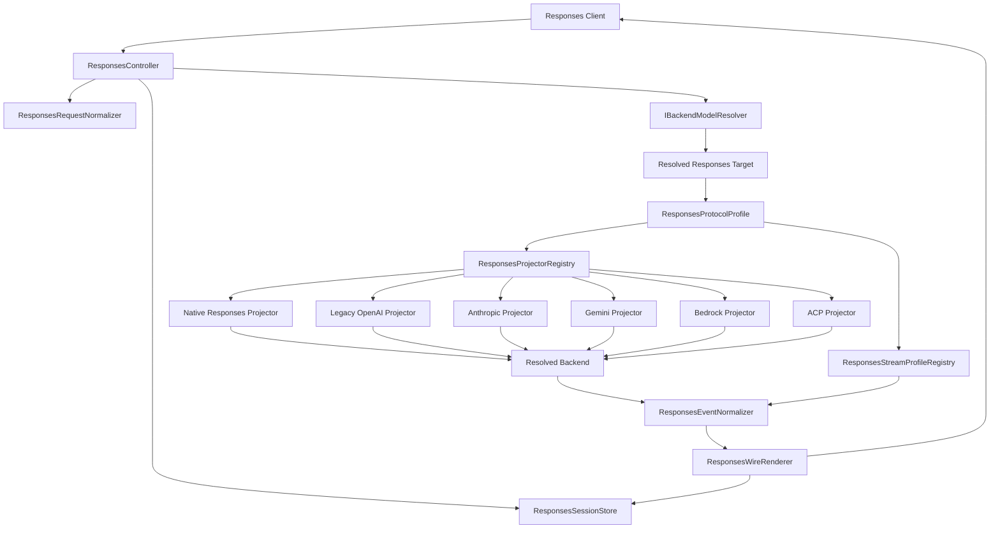
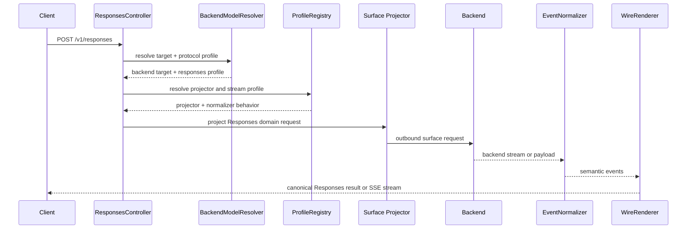
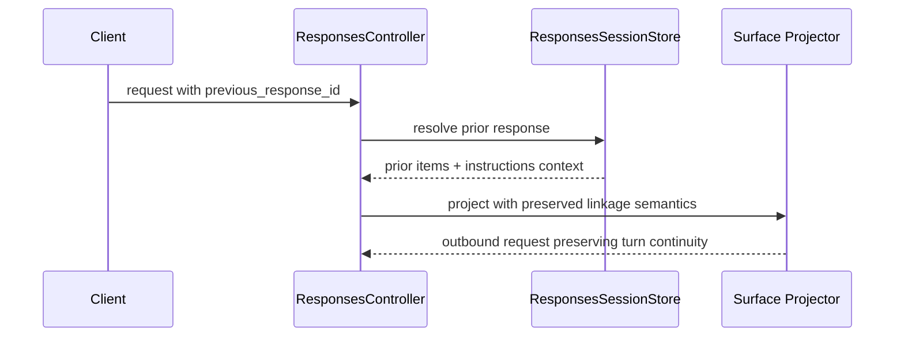

# Design Document: Responses API Protocol Matrix Compliance

## Overview
This feature redefines the proxy's Responses API frontend as a protocol-centric translation surface. The current implementation resolves a backend target and then chooses projectors from concrete backend-name checks, which breaks portability and causes immediate routing failures for backend instances that speak a compatible surface but do not have an expected name.

**Purpose**: Deliver Responses API compatibility across six outbound API surfaces without coupling translation logic to backend identifiers.

**Users**: Official Responses SDK users, agent frameworks, and proxy operators validating cross-protocol compatibility.

**Impact**: Replaces backend-name-based projector selection with resolved protocol-surface selection, extends the translation matrix to Bedrock and ACP, and raises the verification bar to real proxy process plus official client testing.

### Goals
- Introduce a first-class outbound protocol-surface descriptor for Responses routing
- Select request projectors and event normalizers from protocol surface, not backend name
- Support the full matrix: native Responses, legacy OpenAI, Anthropic, Gemini, Bedrock, ACP
- Preserve Responses request, streaming, and multi-turn semantics across surfaces
- Prove compatibility with live-through-proxy official-client verification

### Non-Goals
- Realtime Audio API
- Assistants API / Threads
- Unbounded support for every optional vendor-specific parameter
- Replacing existing non-Responses frontend routing behavior outside the required integration points

## Architecture

### Existing Architecture Analysis
The current `ResponsesController` resolves a `BackendTarget` and then hardcodes projector selection from `target.backend`. This is the main coupling defect. `BackendCapabilityDescriptor` currently exposes only coarse `protocol_family` values and does not capture the finer-grained outbound surface needed by `/v1/responses`.

### Architecture Pattern & Boundary Map
Selected pattern: protocol-surface registry with shared routing metadata.



**Architecture Integration**
- Selected pattern: resolved target plus protocol profile plus registry lookup
- Domain boundaries: routing decides target and surface; controller orchestrates; projectors translate; normalizers interpret stream semantics
- Existing patterns preserved: DI container, async FastAPI pipeline, session store, typed domain models
- New components rationale: the missing boundary is a protocol-surface descriptor that decouples compatibility behavior from backend identity

### Technology Stack

| Layer | Choice / Version | Role in Feature | Notes |
|-------|------------------|-----------------|-------|
| Backend / Services | FastAPI async plus existing DI | Controller and transport orchestration | Existing stack |
| Domain | Pydantic v2 | Protocol profile and target metadata | Extend current models |
| Routing | `IBackendModelResolver` | Resolve backend identity and Responses surface | Extend return contract |
| Translation | `IResponsesBackendProjector` | Surface-specific request projection | Reuse interface |
| Streaming | `ResponsesEventNormalizer` plus `ResponsesWireRenderer` | Surface-specific semantic normalization and canonical Responses output | Driven by profile |
| Testing | pytest plus real proxy subprocess plus official client SDK | Regression and E2E verification | New E2E layer |

## System Flows

### HTTP Request Flow


### Multi-Turn Flow


## Requirements Traceability

| Requirement | Summary | Components | Interfaces | Flows |
|-------------|---------|------------|------------|-------|
| 1 | Protocol-centric routing | Protocol profile model, resolver, registry | resolver contract, registry lookup | HTTP request flow |
| 2 | Six-surface translation matrix | six projectors, capability metadata | projector interface | HTTP request flow |
| 3 | Responses contract preservation | request normalizer, wire renderer | domain models, renderer contracts | HTTP request flow |
| 4 | Multi-turn and tool continuity | session store, projectors | session store, projector contract | multi-turn flow |
| 5 | Streaming equivalence | stream profile registry, event normalizer | semantic event contract | HTTP request flow |
| 6 | Error and limitation disclosure | limitation error mapping | error hierarchy | HTTP and stream flows |
| 7 | Live verification | E2E harness, operator playbook | test harness interfaces | verification flows |

## Components and Interfaces

### Routing Layer

#### `ResponsesProtocolProfile`
| Field | Detail |
|-------|--------|
| Intent | Identify the outbound API surface required for Responses compatibility behavior |
| Requirements | 1, 2, 5, 6 |

**Responsibilities & Constraints**
- Enumerates the six supported surfaces
- Is independent from concrete backend names
- Drives both projector selection and stream normalization

##### Service Interface
```python
class ResponsesProtocolProfile(str, Enum):
    RESPONSES_NATIVE = "responses_native"
    OPENAI_LEGACY = "openai_legacy"
    ANTHROPIC = "anthropic"
    GEMINI = "gemini"
    BEDROCK = "bedrock"
    ACP = "acp"
```

#### `ResolvedResponsesTarget`
| Field | Detail |
|-------|--------|
| Intent | Carry backend identity plus protocol-surface metadata needed by Responses paths |
| Requirements | 1, 2, 6 |

**Responsibilities & Constraints**
- Extends or wraps `BackendTarget`
- Includes `backend`, `model`, `uri_params`, and `responses_profile`
- May include surface capability flags for limitation checks

### Translation Layer

#### `ResponsesProjectorRegistry`
| Field | Detail |
|-------|--------|
| Intent | Resolve the correct `IResponsesBackendProjector` from `ResponsesProtocolProfile` |
| Requirements | 1, 2 |

**Responsibilities & Constraints**
- Single source of truth for surface-to-projector mapping
- Replaces controller-side backend string branching
- Fails explicitly for unsupported or unconfigured surfaces

#### Surface Projectors
| Component | Intent | Requirements |
|-----------|--------|--------------|
| Native Responses projector | Pass through Responses-native semantics | 2, 3, 5 |
| Legacy OpenAI projector | Translate to chat/messages-style legacy surface | 2, 3, 4, 5 |
| Anthropic projector | Translate to Anthropic messages/tool semantics | 2, 3, 4, 5 |
| Gemini projector | Translate to Gemini contents/function semantics | 2, 3, 4, 5 |
| Bedrock projector | Translate to Bedrock-compatible request semantics | 2, 3, 4, 5 |
| ACP projector | Translate to ACP-compatible agent/task semantics | 2, 3, 4, 5 |

### Streaming Layer

#### `ResponsesStreamProfileRegistry`
| Field | Detail |
|-------|--------|
| Intent | Resolve surface-specific stream interpretation behavior from `ResponsesProtocolProfile` |
| Requirements | 1, 5 |

**Responsibilities & Constraints**
- Uses the same profile key as request projection
- Prevents request/stream semantic drift
- Supplies `ResponsesEventNormalizer` with surface-specific interpretation rules

### Session and Errors

#### `ResponsesSessionStore`
| Field | Detail |
|-------|--------|
| Intent | Preserve multi-turn continuity through durable response linkage |
| Requirements | 4 |

#### `ResponsesProviderLimitationError`
| Field | Detail |
|-------|--------|
| Intent | Surface contract-incompatible gaps explicitly by feature and profile |
| Requirements | 2, 6 |

## Data Models

### Domain Model
- `ResponsesProtocolProfile`
- `ResolvedResponsesTarget`
- existing `ResponsesDomainRequest`
- existing `ResponsesOutputItem`
- surface capability flags for profile-specific limitation disclosure

### Data Contracts & Integration
- Routing contract: resolver returns profile-aware target
- Translation contract: projector returns outbound payload plus capability flags
- Streaming contract: stream normalizer consumes surface profile and emits canonical semantic events

## Error Handling

### Error Strategy
- Validation failures remain validation errors
- Unsupported but expected gaps become explicit limitation errors keyed by feature plus profile
- Misconfiguration of surface metadata becomes server-side configuration errors
- Upstream failures remain service failures and retain request correlation

### Monitoring
- Log resolved backend identity and resolved protocol profile separately
- Emit metrics by profile, not only by backend name
- Preserve request IDs across limitation and upstream failure paths

## Testing Strategy

### Unit Tests
- profile resolution from routing metadata
- projector registry selection by profile
- stream profile selection by profile
- limitation detection by feature/profile matrix

### Integration Tests
- controller uses resolved profile rather than backend name
- session linkage survives across translated profiles
- streaming and non-streaming semantic equivalence for each profile
- explicit limitation and validation error mapping

### E2E / Live Proxy Tests
- start real proxy instance
- drive `/v1/responses` through an official Responses-compatible client
- cover one scenario per profile: native Responses, legacy OpenAI, Anthropic, Gemini, Bedrock, ACP
- verify response object shape, stream lifecycle, multi-turn continuity, and limitation disclosure

### Performance / Operational
- verify profile lookup adds no material routing overhead
- verify translated streaming remains stable under long-running responses
