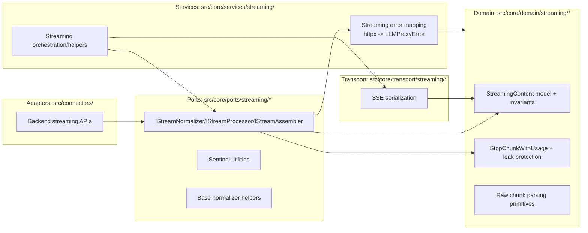
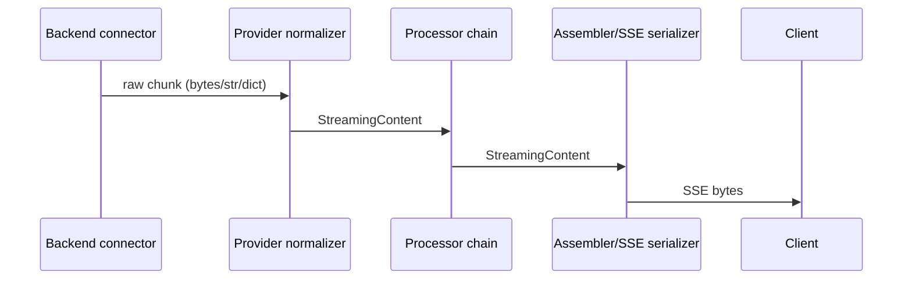

# Design: Streaming Contracts God Object Refactoring

## Overview

This refactor decomposes `src/core/ports/streaming_contracts.py` into smaller, cohesive modules with clear responsibilities and strict dependency direction, while preserving the existing public import surface (`src.core.ports.streaming_contracts`) and streaming behavior relied on by connectors, services, and the test suite.

The end-state turns `src/core/ports/streaming_contracts.py` into a compatibility facade (re-exports only) and moves behavior-heavy logic into appropriately layered components (domain/ports/services/transport) with DI-friendly seams where stateful collaborators are introduced.

### Goals
- Decompose the `streaming_contracts.py` “God Object” into focused components without relocating the same complexity into a new monolith.
- Enforce streaming-layer boundaries (contracts/ports are free of transport/vendor dependencies).
- Preserve existing runtime behavior, import paths, and streaming regressions coverage.
- Ensure size/complexity constraints from `requirements.md` are satisfied and remain enforceable.

### Non-Goals
- Changing client-visible streaming semantics, SSE format, done markers, tool-call behavior, or usage accounting.
- Redesigning the entire streaming subsystem (for example replacing the existing orchestrator/assembler pipeline).
- Introducing new features or changing API endpoints.

## Architecture

### Existing Architecture Analysis

**Current problem shape**: `src/core/ports/streaming_contracts.py` mixes at least five concerns:
1. Domain model semantics (`StreamingContent`, stop-chunk usage protection).
2. Provider/format parsing (`StreamingContent.from_raw` heuristics for OpenAI/Anthropic/Gemini + SSE parsing).
3. Transport serialization (`StreamingContent.to_bytes` SSE formatting and tool-call sanitization).
4. Error mapping to `LLMProxyError` including `httpx` exception mapping.
5. Interfaces/protocols for the streaming pipeline and sentinel utilities.

This violates cross-layer boundaries and creates tight coupling:
- “Ports/contracts” imports `httpx` and encodes vendor error types.
- A single dataclass (`StreamingContent`) owns complex parsing + serialization logic, making unit testing brittle and inflating cyclomatic complexity.
- Multiple other modules (assemblers/processors/connectors/tests) import a broad surface area from the same module, making changes risky.

### Architecture Pattern & Boundary Map

**Selected pattern**: “Hexagonal / Clean layering” with:
- **Domain**: streaming chunk model and invariants.
- **Ports**: interfaces for normalizers/processors/assemblers, plus shared utilities with no transport/vendor types.
- **Services**: orchestration and error normalization logic that may depend on vendor libs (`httpx`).
- **Transport**: SSE formatting/serialization as a boundary concern.

### Technology Stack

| Layer | Choice / Version | Role in Feature | Notes |
|------:|------------------|-----------------|-------|
| Runtime | Python 3.10+ / FastAPI (async) | Runtime | No blocking I/O in async paths |
| Errors | `LLMProxyError` hierarchy | Stable error semantics | Map `httpx` errors in services layer |
| Streaming | Async iterators | Chunk flow | Preserve SSE and done-marker semantics |
| DI | `ServiceCollection` | Optional for stateful collaborators | Prefer DI where stateful services emerge |

## Components and Interfaces

### Component Summary

| Component | Location | Responsibility | Notes |
|----------|----------|----------------|-------|
| Compatibility facade | `src/core/ports/streaming_contracts.py` | Re-export public symbols | Must be <600 LOC; no `httpx` imports |
| StreamingContent | `src/core/domain/streaming/streaming_content.py` | Chunk model + invariants | Keep minimal; avoid format/provider logic |
| StopChunkWithUsage | `src/core/domain/streaming/stop_chunk_with_usage.py` | Usage stop-chunk protection | Preserve leak-prevention behavior |
| SentinelManager | `src/core/domain/streaming/sentinels.py` (or ports util) | Done marker creation/detection | Keep simple and shared |
| Streaming interfaces | `src/core/ports/streaming/interfaces.py` | `StreamProducer`, `IStream*` ABIs | Pure ABC/Protocol types |
| Base normalizer | `src/core/ports/streaming/normalizer_base.py` | Shared validation/helpers | No provider parsing logic |
| Raw chunk parsing | `src/core/domain/streaming/parsing/*` | Type-based parsing helpers | Strategy/chain-of-responsibility |
| SSE serializer | `src/core/transport/streaming/sse_serializer.py` | `StreamingContent -> bytes` | Owns framing + tool-call sanitization |
| Error mapping | `src/core/services/streaming/error_mapping.py` | `Exception -> LLMProxyError` | Owns `httpx` mapping; no ports imports |

### Interface Contracts

**IStreamNormalizer**: Converts provider-specific chunks into `StreamingContent` with stable metadata keys and no transport framing.

**IStreamProcessor**: Middleware that transforms `StreamingContent` and maintains per-stream isolation via `reset()`.

**IStreamAssembler**: Converts `StreamingContent` to a client-facing byte stream (SSE, JSON-lines, etc.).

## Key Design Decisions

### Decision 1: Make `streaming_contracts.py` a compatibility facade

- **Context**: Many modules and tests import symbols from `src.core.ports.streaming_contracts`.
- **Selected approach**: Keep the import surface stable by re-exporting symbols from their new homes.
- **Rationale**: Allows incremental refactor without widespread churn.
- **Risk**: Hidden circular imports if facade re-exports carelessly; mitigate by keeping facade “dumb” (imports only).

### Decision 2: Remove provider parsing from `StreamingContent.from_raw` via parser strategies

- **Context**: `from_raw` is currently a multi-provider parsing “mega-method”.
- **Selected approach**: Replace provider/format parsing branches with small parser strategies (bytes/SSE, OpenAI dict, Gemini dict, Anthropic events, ProcessedResponse, etc.) orchestrated by a single parsing entry point.
- **Rationale**: Enforces SRP and keeps each parser below complexity thresholds.
- **Compatibility**: Keep `StreamingContent.from_raw` as a thin wrapper delegating to the parsing entry point.

### Decision 3: Move SSE framing/serialization out of `StreamingContent.to_bytes`

- **Context**: SSE is a transport concern; `to_bytes` currently embeds deep tool-call sanitization and chunk normalization.
- **Selected approach**: Introduce a transport-layer serializer that owns SSE formatting decisions; keep `StreamingContent.to_bytes` as a thin delegator for backward compatibility.
- **Rationale**: Keeps domain model pure and reduces churn; concentrates transport logic where it belongs.

### Decision 4: Move `httpx`-specific error mapping to services layer

- **Context**: Ports/contracts should not import vendor/transport libraries.
- **Selected approach**: Keep error mapping as `src/core/services/streaming/error_mapping.py` and expose `handle_streaming_error` via facade re-export.
- **Rationale**: Preserves public API while restoring boundary direction.

## System Flows

## Requirements Traceability

| Requirement | Summary | Components |
|-------------|---------|------------|
| 1.x | Decomposition, size/complexity caps, no relocation | Facade + parsers + serializer split |
| 2.x | Boundary enforcement | Error mapping in services; no `httpx` in ports |
| 3.x | Backward compatibility | Facade re-exports; thin wrappers |
| 4.x | Semantics preservation | Stop chunk + SSE serializer + sentinel |
| 5.x | DI/test seams | Optional DI for stateful collaborators |
| 6.x | Verification/docs | Existing streaming tests + focused characterization |

## Testing Strategy

- Preserve and run the existing streaming-related unit/integration/property/regression suites that import from `src.core.ports.streaming_contracts`.
- Add characterization tests only where behavior was implicit (for example: stop-chunk usage emission path, done marker handling in serializer, tool-call sanitization).
- Add a small “complexity guard” verification step (script-based) to enforce per-file LOC and per-function CC thresholds for the new modules.

