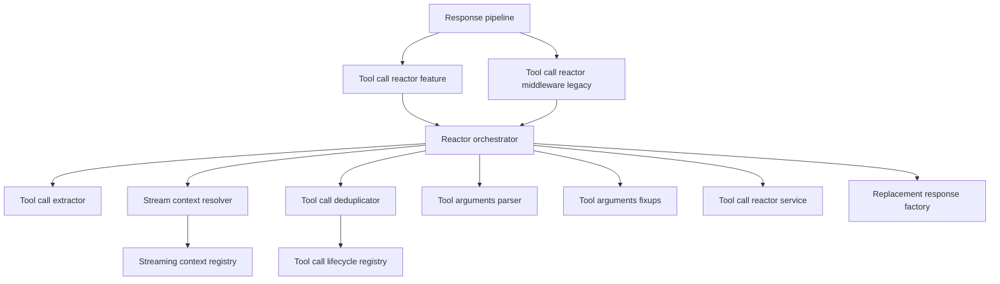
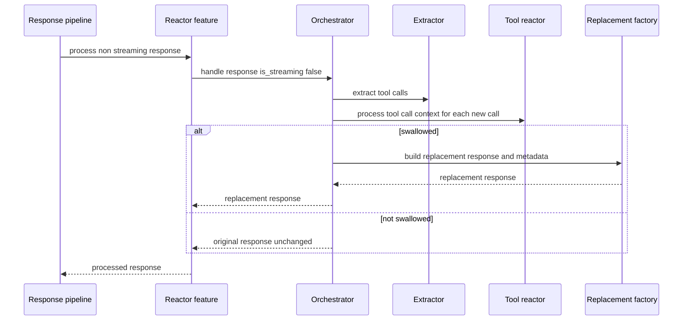
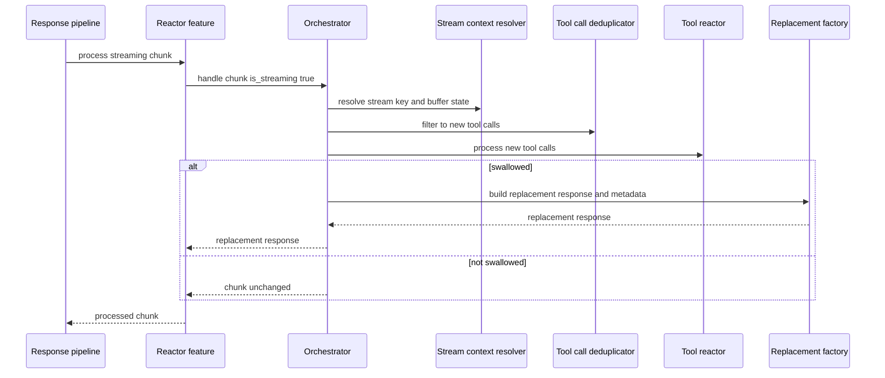

# Design Document

## Overview

This design refactors `src/core/services/tool_call_reactor_middleware.py` into a small, DI-managed subsystem that preserves existing runtime behavior while eliminating the current “God Object” and duplicated logic between `ToolCallReactorFeature` and the deprecated `ToolCallReactorMiddleware`. The design keeps the response-processing integration points stable and focuses on explicit boundaries, strong typing, and test seams.

The refactor is an internal architecture change for the Universal LLM Proxy’s response pipeline. It must remain compatible with existing streaming and non-streaming behavior, preserve swallow/steering behavior, and maintain the implicit metadata contract used by downstream retry and streaming components.

### Goals
- Preserve externally observable behavior of tool-call processing across streaming and non-streaming paths (1.1–1.6, 2.1–2.5, 5.1–5.4).
- Remove duplication by centralizing processing into a shared orchestrator used by both the feature and the legacy middleware (7.1, 7.2).
- Make the subsystem DI-constructible without requiring global mutable state (7.3).
- Enforce refactor quality gates: `<600 LOC` per production file and `CC < 50` per function/method via measurable tooling (8.1, 8.2).
- Improve testability by isolating extraction, parsing, fixups, dedup, and replacement creation into independently testable components (9.1–9.4).

### Non-Goals
- Changing tool-call policy semantics or handler registration behavior in `ToolCallReactorService`.
- Reworking the broader global streaming registry usage across the entire codebase beyond what is required to make the tool-call reactor subsystem DI-constructible.
- Redesigning VTC extraction behavior beyond explicit alignment decisions documented in this design.

## Architecture

### Existing Architecture Analysis
- `src/core/services/tool_call_reactor_middleware.py` contains both:
  - `ToolCallReactorFeature` (preferred `IResponseFeature`)
  - `ToolCallReactorMiddleware` (deprecated `IResponseMiddleware`, still wired for tests)
- Both implement similar responsibilities: tool-call extraction, normalization, parsing/repair, fixups, deduplication, lifecycle state handling, replacement response creation, and metadata shaping.
- Several downstream services rely on stable metadata keys and flags:
  - `src/core/services/backend_request_manager_service.py` uses `tool_call_swallowed` and related metadata to drive retry-on-swallow.
  - `src/core/services/streaming/content_accumulation_processor.py` uses `_steering_replacement` to reset accumulated content.
  - `src/core/services/steering_leak_protection.py` sanitizes internal steering keys if they leak into outbound content.

### Architecture Pattern & Boundary Map

**Architecture Integration**:
- Selected pattern: Thin pipeline adapters (`IResponseFeature`/`IResponseMiddleware`) delegating to a DI-managed orchestrator plus small collaborators.
- Domain/feature boundaries: extraction/normalization, stream-context access, dedup/lifecycle, argument parsing/fixups, and replacement response creation are owned by separate services.
- Existing patterns preserved: staged initialization, ServiceCollection DI, feature parity (feature + legacy wrapper), fail-open middleware behavior.
- New components rationale: each collaborator isolates a single responsibility to meet 7.1 and enable `<600 LOC`/`CC < 50` gates (8.1, 8.2).



### Technology Stack

| Layer | Choice / Version | Role in Feature | Notes |
|-------|------------------|-----------------|-------|
| Runtime | Python 3.10+ / FastAPI async | Response pipeline execution | No blocking I/O in feature path |
| DI Container | `src/core/di/container.py` | Service lifetimes + wiring | Factories in `src/core/di/services.py` |
| Response pipeline | `IResponseFeature` / `IResponseMiddleware` | Integration points | Keep existing contracts stable |
| Tool reactor | `IToolCallReactor` / `ToolCallReactorService` | Handler orchestration | Existing service; no semantic changes |
| Streaming state | `StreamingContextRegistry` | Tool-call buffering | Prefer DI access; avoid global requirement |
| Quality gates | `radon` / `xenon` (dev deps) | Complexity enforcement | Define a single configured threshold for 8.2 |

## System Flows

### Flow 1: Non-streaming tool-call handling



### Flow 2: Streaming tool-call handling with buffer state



## Requirements Traceability

| Requirement | Summary | Components | Interfaces | Flows |
|-------------|---------|------------|------------|-------|
| 1.1, 1.2, 1.3 | Bypass paths return unchanged | Orchestrator, Feature, Legacy middleware | `IToolCallReactorOrchestrator` | Flow 1, Flow 2 |
| 1.4 | Invoke reactor per new tool call | Orchestrator | `IToolCallReactor`, `IToolCallDeduplicator` | Flow 1, Flow 2 |
| 1.5 | Swallow produces replacement response | Replacement factory | `IReplacementResponseFactory` | Flow 1, Flow 2 |
| 1.6 | Legacy entry point preserved | Legacy middleware wrapper | `IResponseMiddleware` | Flow 1, Flow 2 |
| 2.1, 2.4 | Dedup and lifecycle scope | Deduplicator, lifecycle registry | `IToolCallDeduplicator` | Flow 2 |
| 2.2, 2.3, 2.5 | Streaming completeness and buffer ordering | Stream context resolver, orchestrator | `IToolCallStreamContextResolver` | Flow 2 |
| 3.1, 3.2, 3.3, 3.4 | Extraction and normalization robustness | Extractor, normalizer | `IToolCallExtractor`, `IToolCallNormalizer` | Flow 1, Flow 2 |
| 4.1, 4.2, 4.3, 4.4 | Argument parsing and telemetry | Arguments parser | `IToolArgumentsParser` | Flow 1, Flow 2 |
| 5.1, 5.2, 5.3, 5.4 | Steering replacement and non-leak behavior | Replacement factory | `IReplacementResponseFactory` | Flow 1, Flow 2 |
| 6.1, 6.2, 6.3 | Fail-open + processed marking | Orchestrator, marker | `IToolCallProcessedMarker` | Flow 1, Flow 2 |
| 7.1, 7.2 | Modular decomposition + test seams | All new services | New `I*` interfaces | All |
| 7.3, 7.4 | DI constructible and boundary-safe | Stream context resolver | `IToolCallBufferAccessor` | Flow 1, Flow 2 |
| 8.1, 8.2, 8.3 | LOC and CC gates | Subsystem packaging | N A | All |
| 9.1, 9.2, 9.3, 9.4 | Test strategy coverage | Tests + isolated services | N A | All |
| 10.1, 10.2 | Debuggable logs and signaling | Orchestrator, replacement factory | N A | All |
| 11.1 | Degraded mode without buffer | Stream context resolver | `IToolCallBufferAccessor` | Flow 2 |
| 12.1 | Avoid secret logging | Arguments parser, replacement factory | N A | All |

## Components and Interfaces

**DI Registration Strategy**:
- All new services are registered via factory functions in `src/core/di/services.py`.
- Default lifetime is `Singleton` unless explicitly stateful per request (none of the proposed services require per-request lifetime).

### Core Typed Contracts (Internal)

The refactor standardizes internal data exchange using typed dataclasses and Pydantic v2 models to avoid passing ad-hoc dict/list/str shapes between components. External/public integration points remain compatible (notably `ToolCallContext.tool_arguments` remains a legacy dictionary per existing interface), but the subsystem produces that dictionary only at the boundary from a typed internal contract.

#### ToolArgumentsEnvelope (Pydantic v2)

This model is the single internal representation for tool arguments across streaming/non-streaming paths. It enforces a **single** normalized argument shape: `normalized_args` is always a JSON-object-like dictionary.

Normalization rules:
- If parsed arguments are a JSON object → `normalized_arguments_json` is that object (as a compact JSON string).
- If parsed arguments are a JSON array → `normalized_arguments_json` is `{"__proxy_args_list__": <array>}` (as a compact JSON string).
- If parsing fails and only raw text exists → `normalized_arguments_json` is `{"__proxy_args_raw__": <raw_text>}` (as a compact JSON string).

```python
from __future__ import annotations

from typing import Literal

from pydantic import BaseModel, Field


class ToolArgumentsEnvelope(BaseModel):
    """Typed envelope for tool arguments passed through the reactor subsystem."""

    parse_outcome: Literal["success", "recovered", "failed"] = "failed"
    raw_arguments: str | None = None
    normalized_arguments_json: str = Field(default="{}")
    was_modified_by_fixups: bool = False
```

**External compatibility mapping**:
- When building `ToolCallContext`, the subsystem shall set:
  - `ToolCallContext.tool_arguments = json.loads(ToolArgumentsEnvelope.normalized_arguments_json)`
  - (Optionally) attach `parse_outcome` and fixup flags to reactor metadata to support observability without leaking secrets.

#### ToolCallBufferState Contract (ABC)

To maintain strict dependency direction, interfaces under `src/core/interfaces/` SHALL NOT import concrete service types from `src/core/services/`. The tool-call reactor subsystem therefore depends on an abstract buffer-state contract that can be backed by the existing streaming registry state via an adapter.

```python
from __future__ import annotations

from abc import ABC, abstractmethod
from src.core.domain.chat import ToolCall


class IToolCallBufferState(ABC):
    """Abstract view over per-stream tool-call buffering state."""

    @abstractmethod
    def consume_new_reactor_calls(self) -> list[ToolCall]:
        """Return newly detected tool calls for the reactor and advance the cursor."""
        ...

    @abstractmethod
    def mark_processed(self, signature: str) -> None:
        """Record that a tool call signature was processed by the reactor."""
        ...
```

Notes:
- `IToolCallBufferState` is an internal contract; its concrete adapter may wrap `ToolCallBufferState` from `src/core/services/streaming/stream_context_registry.py`.
- This keeps `src/core/interfaces/` free of dependencies on `src/core/services/`, supporting 7.4.

### Component Summary

| Component | Domain | Intent | Requirements | DI Lifetime | Key Interface |
|----------|--------|--------|--------------|------------|---------------|
| ToolCallReactorOrchestrator | `src/core/services/tool_call_reactor/` | Coordinates tool-call processing | 1.1–12.1 | Singleton | `IToolCallReactorOrchestrator` |
| ToolCallExtractor | `src/core/services/tool_call_reactor/` | Extract tool calls from response shapes | 3.1–3.4 | Singleton | `IToolCallExtractor` |
| ToolCallNormalizer | `src/core/services/tool_call_reactor/` | Normalize raw tool call objects | 3.1–3.4 | Singleton | `IToolCallNormalizer` |
| ToolCallStreamContextResolver | `src/core/services/tool_call_reactor/` | Resolve stream key and buffer state | 2.1–2.5, 7.3, 11.1 | Singleton | `IToolCallStreamContextResolver` |
| ToolCallDeduplicator | `src/core/services/tool_call_reactor/` | Dedup per stream and mark processed | 2.1–2.5, 6.3 | Singleton | `IToolCallDeduplicator` |
| ToolArgumentsParser | `src/core/services/tool_call_reactor/` | Parse and repair tool arguments | 4.1–4.4, 12.1 | Singleton | `IToolArgumentsParser` |
| ToolArgumentsFixupPipeline | `src/core/services/tool_call_reactor/` | Apply best-effort argument fixups | 4.1–4.4, 6.1 | Singleton | `IToolArgumentsFixupPipeline` |
| ReplacementResponseFactory | `src/core/services/tool_call_reactor/` | Build replacement response + metadata | 1.5, 5.1–5.4, 10.2 | Singleton | `IReplacementResponseFactory` |

### Services Layer (`src/core/services/`)

#### ToolCallReactorOrchestrator

| Field | Detail |
|-------|--------|
| Intent | Coordinate tool-call detection, dedup, invocation, and replacement creation |
| Requirements | 1.1, 1.2, 1.3, 1.4, 1.5, 2.1, 2.2, 2.3, 2.4, 2.5, 6.1, 6.2, 6.3, 10.1 |
| Interface | `IToolCallReactorOrchestrator` in `src/core/interfaces/` |
| DI Lifetime | Singleton |

**Responsibilities & Constraints**
- Owns the high-level flow only; all parsing, extraction, buffer access, and replacement shaping are delegated.
- Preserves the existing fail-open behavior: exceptions during reactor invocation do not terminate the request (6.1, 6.2).
- Ensures no duplicate processing per stream via the deduplicator (2.4, 6.3).

**Dependencies (via DI)**
- `IToolCallExtractor`, `IToolCallNormalizer`
- `IToolCallStreamContextResolver`, `IToolCallDeduplicator`
- `IToolArgumentsParser`, `IToolArgumentsFixupPipeline`
- `IToolCallReactor` (existing)
- `IReplacementResponseFactory`

##### Service Interface
```python
from __future__ import annotations

from abc import ABC, abstractmethod
from pydantic import BaseModel, ConfigDict, Field


class ToolCallReactorContext(BaseModel):
    """Typed view over reactor context data passed between layers.

    This replaces cross-layer ad-hoc dictionary passing. The legacy pipeline may
    still hold an untyped mapping; an adapter should construct this model at the boundary.
    """

    model_config = ConfigDict(arbitrary_types_allowed=True, extra="forbid")

    client_os: str | None = None
    stream_key: str | None = None
    buffer_state: object | None = None


class IToolCallReactorOrchestrator(ABC):
    @abstractmethod
    async def handle(
        self,
        response: object,
        session_id: str,
        context: ToolCallReactorContext,
        is_streaming: bool,
    ) -> object:
        """Return either the original response/chunk or a replacement response."""
        ...
```
- Preconditions: `ToolCallReactorContext` is constructed at the boundary; `buffer_state` may be absent (degraded mode).
- Postconditions: returned value is compatible with existing pipeline expectations (either unchanged response/chunk or a `ProcessedResponse` replacement).
- Invariants: swallow decisions produce metadata keys required by retry and streaming processors.

#### ToolCallStreamContextResolver

| Field | Detail |
|-------|--------|
| Intent | Resolve per-stream identifiers and locate tool-call buffer state |
| Requirements | 2.1, 2.3, 2.4, 7.3, 11.1 |
| Interface | `IToolCallStreamContextResolver` in `src/core/interfaces/` |
| DI Lifetime | Singleton |

**Responsibilities & Constraints**
- Prefers explicit stream identifiers from response metadata and context.
- Resolves `ToolCallBufferState` from context first and otherwise uses an injected registry (not global) so the subsystem does not require global mutable state (7.3).
- Supports safe degraded mode when buffer state is unavailable (11.1).

**No-Global Rule (Subsystem Constraint)**
- The tool-call reactor subsystem components SHALL NOT call `get_global_streaming_context_registry()` directly.
- Legacy/global access remains an outer-system concern and may continue to exist outside the subsystem, but all new/refactored tool-call reactor components must use injected access only.

##### Service Interface
```python
from __future__ import annotations

from abc import ABC, abstractmethod

from src.core.interfaces.tool_call_buffer_state import IToolCallBufferState


class IToolCallStreamContextResolver(ABC):
    @abstractmethod
    def resolve_stream_key(
        self, session_id: str, context: ToolCallReactorContext, response: object
    ) -> str:
        ...

    @abstractmethod
    def resolve_buffer_state(
        self, context: ToolCallReactorContext | None, stream_key: str
    ) -> IToolCallBufferState | None:
        ...
```

#### ReplacementResponseFactory

| Field | Detail |
|-------|--------|
| Intent | Build the replacement response and compatibility metadata for swallowed tool calls |
| Requirements | 1.5, 5.1, 5.2, 5.3, 5.4, 10.2, 12.1 |
| Interface | `IReplacementResponseFactory` in `src/core/interfaces/` |
| DI Lifetime | Singleton |

**Responsibilities & Constraints**
- Produces a client-safe response structure and avoids internal steering identifiers in client-visible IDs (5.2).
- Sets `_steering_replacement` to ensure streaming accumulation resets (5.2, 10.2).
- Preserves bounded original content and tool call summaries for retry-on-swallow (5.3, 5.4).
- Avoids logging raw arguments or secrets at INFO level or higher (12.1).

##### Service Interface
```python
from __future__ import annotations

from abc import ABC, abstractmethod
from pydantic import BaseModel, ConfigDict

from src.core.domain.chat import ToolCall


class ToolCallReactionMetadata(BaseModel):
    """Typed metadata emitted by the reactor for observability and retries."""

    model_config = ConfigDict(extra="forbid")

    reaction_type: str
    reactor_name: str | None = None


class IReplacementResponseFactory(ABC):
    @abstractmethod
    def build_replacement(
        self,
        original_response: object,
        replacement_content: str,
        original_tool_call: ToolCall,
        reaction_metadata: ToolCallReactionMetadata | None,
    ) -> object:
        """Return a response compatible with `MiddlewareApplicationManager`."""
        ...
```

## Data Models

### Compatibility Metadata Contract

The following metadata keys are treated as compatibility-critical internal contract between the tool-call reactor subsystem and downstream processing:
- `tool_call_swallowed` (bool)
- `steering_message` (str)
- `swallowed_tool_calls` (list of typed `ToolCall` models, serialized at the boundary)
- `swallowed_original_content` (str, bounded)
- `_steering_replacement` (bool)

The replacement response factory owns creation and shaping of this contract.

## Error Handling

### Error Strategy
- Tool-call processing remains fail-open (6.1, 6.2):
  - Exceptions during extraction/normalization/parsing/fixups do not crash the request.
  - Exceptions during reactor invocation are logged with `exc_info=True`, and processing continues or returns the original response.
- No new HTTP-facing errors are introduced by this refactor.

## Testing Strategy

### Unit Tests
- Extractor and normalizer: validate supported response shapes and skip behavior (3.1–3.4).
- Arguments parser and fixups: validate parse/repair outcomes and “do not crash” semantics (4.1–4.4, 12.1).
- Replacement response factory: validate metadata contract and `_steering_replacement` behavior (5.1–5.4, 10.2).
- Orchestrator: validate bypass conditions, dedup, and swallow flow decisions (1.1–2.5, 6.1–6.3).

### Integration and Regression Tests
- Preserve and extend coverage in:
  - `tests/integration/test_tool_call_reactor_wiring.py`
  - `tests/streaming_regression/test_streaming_features.py`
- Add targeted regression coverage for:
  - retry-on-swallow behavior path in `backend_request_manager_service.py`
  - VTC path parity decisions (vtc wrapper invocation vs feature bypass)

## Integration & Migration Notes

- `ToolCallReactorFeature` remains the production integration point; it becomes a thin delegate to `IToolCallReactorOrchestrator` (1.6).
- `ToolCallReactorMiddleware` remains for backward compatibility and tests; it delegates to the same orchestrator to eliminate logic duplication (1.6, 7.1).
- Subsystem is split into multiple files under a dedicated directory to satisfy 8.1; collaborators are kept small to satisfy 8.2.

## Quality Gates

The implementation phase SHALL include a measurable enforcement mechanism for the refactor quality gates:

### File Size Gate (8.1)
- Every production file in the refactored subsystem scope SHALL be `< 600` lines.
- Scope for this feature: all production files introduced/modified for the tool-call reactor subsystem (expected under `src/core/services/tool_call_reactor/` plus any remaining thin adapters).

### Cyclomatic Complexity Gate (8.2)
- No function/method in the subsystem scope SHALL have cyclomatic complexity `>= 50`.

**Proposed commands (developer workflow and CI-compatible)**:
- `./.venv/Scripts/python.exe scripts/check_loc_gate.py --max-lines 600 src/core/services/tool_call_reactor src/core/services/tool_call_reactor_middleware.py`
- `radon cc -s -n 50 src/core/services/tool_call_reactor`
- `radon cc -s -n 50 src/core/services/tool_call_reactor_middleware.py`

If the repo prefers `xenon`, a single equivalent gate SHALL be chosen and documented as the source of truth for the threshold.

## Open Questions / Risks

- VTC alignment: whether VTC should reuse the same argument parsing and fixup pipeline as the main feature (risk of behavior drift across clients).
- Type contract mismatch: `ToolCallContext.tool_arguments` is typed as a legacy dict; this design resolves it by enforcing `ToolArgumentsEnvelope.normalized_arguments_json` as the sole cross-component shape, with a single boundary conversion to the legacy dict when constructing `ToolCallContext`.
