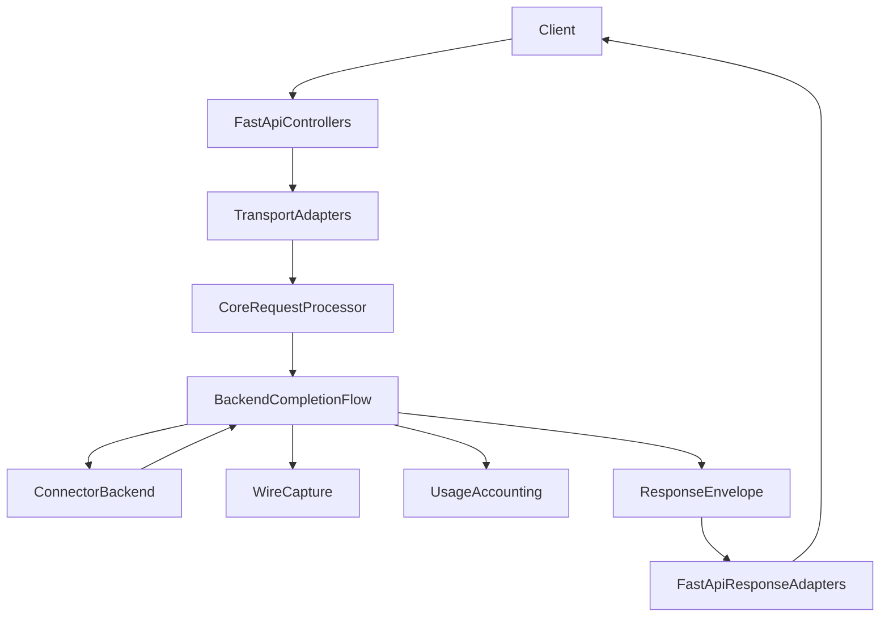
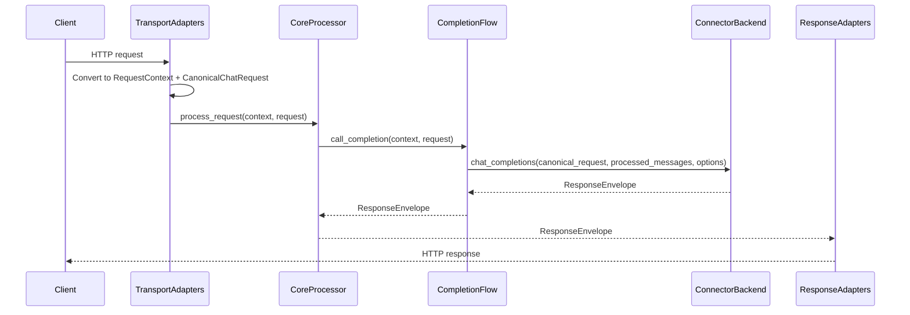
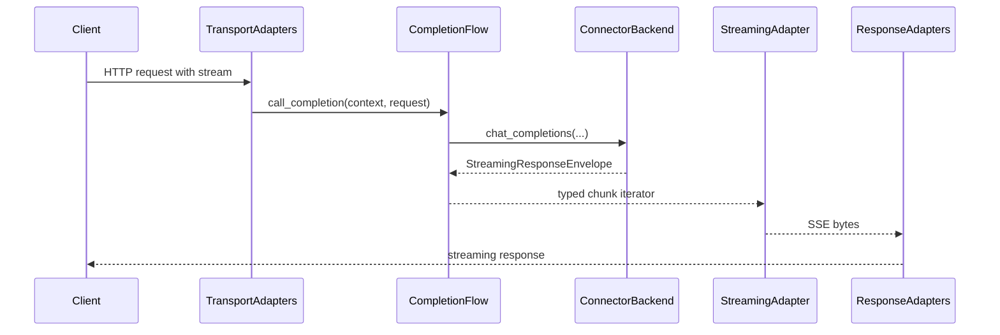

# Design Document

---
**Purpose**: Define a practical, low-risk design to harden typed contract boundaries across Transport ↔ Core ↔ Connector seams while preserving externally observable behavior.

**Project Context**: Universal LLM Proxy - async FastAPI application with staged initialization, DI-managed services, adapter pattern for connectors, and CBOR wire captures.
---

## Overview

This design hardens cross-layer boundary typing by (1) defining an explicit *boundary surface enforcement scope*, (2) tightening the highest-leverage seams (connector invocation, transport response/streaming adapters, wire-capture collaborator interfaces), and (3) concentrating any remaining legacy compatibility into explicitly named conversion points.

Given current codebase reality (widespread `Any` usage in `src/core/domain` utilities and translation code), enforcement is scoped to true cross-layer seams and canonical contract carriers, rather than treating the entire domain layer as a “boundary module”. This reduces refactor blast radius while still meeting the intent of typed contracts at cross-layer exchange points.

### Goals
- Make “boundary typing” enforceable and sustainable via a clear scope + guardrail.
- Ensure Transport ↔ Core ↔ Connector seams exchange canonical contracts or JSON-serializable typed values (`JsonValue`).
- Preserve external behavior: HTTP API shapes, error mapping, streaming semantics, capture compatibility.
- Centralize legacy dict compatibility at explicit conversion points.

### Non-Goals
- Rewriting all translation utilities to remove `Any` throughout `src/core/domain` internals.
- Redesigning the entire canonical request model in one step; legacy permissive request fields may remain where required (per 2.7), but must be confined and documented.
- Changing CBOR capture encoding, capture file format, or replay semantics.

## Requirements Traceability

| Requirement | Summary | Components | Interfaces | Flows |
|-------------|---------|------------|------------|-------|
| 1.1–1.5 | External behavior preserved | Compatibility adapters, regression tests, capture checks | Existing controller/service interfaces | Non-streaming + streaming request flows |
| 2.1–2.7 | Canonical contracts across seams | Boundary contract set + conversion points | `RequestContext`, `BackendTarget`, `UsageSummary`, envelopes | Transport-to-core, core-to-connector, response adaptation |
| 3.1–3.7 | Guardrails + enforcement | Enforcement scope + checker config + allowlist | Boundary type checker | CI / local verification |
| 4.1–4.4 | Connector seam hardened | Canonical connector API + compatibility adapter | Connector base/protocol | Backend invocation flow |
| 5.1–5.3 | Explicit conversion points | Centralized coercion at adapters only | Coercion helpers | Entry + connector boundary |
| 6.1–6.3 | Typed usage/metadata boundaries | UsageSummary and JSON-safe metadata at seams | Response processor contracts, adapter protocols | Response pipeline |
| 7.1–7.3 | Capture/replay alignment | Typed capture surfaces + decoder remains best-effort | Capture orchestrator contracts | Capture and replay |
| 8.1–8.3 | Contributor guidance | Updated docs + enforcement workflow | Typed contract guidance | N/A |

## Architecture

### Existing Architecture Analysis

- Request entry is through FastAPI controllers and adapter functions that construct `RequestContext` and normalize protocol payloads into canonical request models.
- Core processing is orchestrated by `RequestProcessor` and backend orchestration by `BackendCompletionFlow` collaborators.
- Transport response adaptation (including streaming/SSE) is layered under `src/core/transport/fastapi/adapters/`.
- Connector invocation is through `src/connectors/base.LLMBackend`, which currently accepts broad input types and untyped processed messages.
- A boundary type checker exists (`dev/scripts/check_boundary_types.py`) but currently treats `src/core/domain/` broadly as “boundary” and reports widespread violations, requiring scope reconciliation.

### Architecture Pattern & Boundary Map

**Selected pattern**: Boundary Contract Hardening with Compatibility Facades (Hybrid).

- **Boundary policy**: define what is considered a boundary surface (enforced) vs internal-only (not enforced).
- **Conversion policy**: conversions are permitted only at explicit adapter boundaries; core services operate on canonical contracts.
- **Compatibility policy**: legacy dict acceptance remains only behind explicitly named coercers/shims.

**Boundary contracts at each edge**
- TransportAdapters → CoreProcessor: `RequestContext` + `CanonicalChatRequest`
- CoreProcessor → CompletionFlow: `CanonicalChatRequest` + `RequestContext` + `BackendTarget`
- CompletionFlow → Connector: connector-facing request contract + typed processed messages + JSON-safe options
- CompletionFlow → Capture/Usage: canonical usage contracts (`UsageSummary`, `CanonicalUsageRecord`) and JSON-safe metadata
- ResponseEnv → ResponseAdapters: typed response envelopes + typed streaming chunk contracts

## Technology Stack

| Layer | Choice / Version | Role in Feature | Notes |
|-------|------------------|-----------------|-------|
| Runtime | Python 3.10 / FastAPI | Transport entry and response adaptation | No FastAPI types leak into connector contracts |
| Models | Pydantic v2 + dataclasses | Canonical contracts and DTOs | Prefer `JsonValue` for extension values |
| DI | `ServiceCollection` | Optional adapter/service registration | Preserve staged init ordering |
| Capture | CBOR (`cbor2`) | Wire capture fidelity | Preserve existing capture format |
| Type checking | mypy | Enforce boundary signatures | Guardrails reduce `Any` at seams |

## System Flows

### Non-streaming request flow (boundary conversions)

### Streaming request flow (typed chunk boundary)

## Components and Interfaces

### Summary Table

| Component | Layer | Intent | Requirements | Notes |
|----------|-------|--------|--------------|-------|
| Boundary surface scope | `dev/` | Define enforcement scope for guardrails | 3.1, 3.2 | Enables practical enforcement |
| Boundary type checker update | `dev/` | Enforce typed boundary signatures within scope | 3.3–3.7 | Must include connectors |
| Connector contract hardening | `src/connectors/` | Make connector seam typed and stable | 4.1–4.4 | Requires compatibility shim |
| Response/streaming seam typing | `src/core/interfaces/`, `src/core/transport/` | Remove `Any` from boundary signatures and chunk contracts | 2.5, 6.1–6.3 | Avoid per-chunk heavy conversions |
| Capture collaborator typing | `src/core/interfaces/` | Replace `Any`/`dict[str, Any]` with canonical contracts | 7.1–7.3 | Preserve CBOR fidelity |
| Legacy coercion utilities | `src/core/transport/` (or services) | Centralize dict→contract conversion at explicit boundaries | 5.1–5.3 | No “deep” coercion in core |

### Boundary Type Guardrails: Enforcement Specification (Design Decision)

**Decision**: Make boundary typing enforceable by defining an explicit “boundary surface enforcement scope” and an explicit exception/allowlist mechanism.

**Rationale**:
- The current guardrail script treats `src/core/domain/` broadly as “boundary”, which is not aligned with the intent of “cross-layer seams” and is not actionable at current scale (gap analysis: ~638 violations).
- Enforcement must focus on *actual seam surfaces* (interfaces, transport adapters, connector base API) and the *canonical contract carriers* that cross those seams.
- Exceptions must be explicit, minimal, and time-bounded to prevent permanent backsliding (2.7, 3.5).

**Enforcement scope definition (3.1, 3.2)**:
- Create a dedicated, versioned scope file at `dev/boundary_types_scope.json` containing:
  - `include_globs`: list of glob patterns
  - `exclude_globs`: list of glob patterns
  - `explicit_files`: list of exact files that must be enforced even if outside globs
- The documented initial scope is deliberately phased so the guardrail targets *connector boundary contracts* without requiring immediate refactors of all connector implementation internals:
  - `include_globs`:
    - `src/core/interfaces/**/*.py`
    - `src/core/transport/**/*.py`
    - `src/connectors/contracts/**/*.py`
  - `explicit_files` (canonical contract carriers used at seams):
    - `src/core/domain/request_context.py`
    - `src/core/domain/backend_target.py`
    - `src/core/domain/usage_summary.py`
    - `src/core/domain/responses.py`
    - `src/core/domain/streaming/contracts.py`
    - `src/connectors/base.py`
  - `exclude_globs` (internal-only modules not treated as seam contracts initially):
    - `src/core/domain/translation.py`
    - `src/core/domain/translation_utils/**/*.py`
    - `src/core/domain/translators/**/*.py`
    - `src/core/domain/**/tests/**/*.py`
    - `src/connectors/**/*.py`

**Scope precedence rules**
- `explicit_files` override `exclude_globs`.
- If a file matches both `include_globs` and `exclude_globs`, it is excluded unless also present in `explicit_files`.

**Phased connector enforcement (3.2, 4.1–4.4)**
- Phase 0/1: Enforce only the connector boundary API (`src/connectors/base.py`) and any new connector contract definitions under `src/connectors/contracts/**`.
- Phase 2+: Expand enforcement to selected connector implementations after they migrate to the canonical connector API, using time-bounded allowlist entries as needed (2.7, 3.5).

**Guardrail implementation contract (3.3–3.7)**:
- `dev/scripts/check_boundary_types.py` is updated to:
  - Load `dev/boundary_types_scope.json`.
  - Apply includes/excludes and enforce only files in the resulting set.
  - Exit non-zero on violations and print file:line:column messages (already supported).
- The developer documentation is updated to:
  - Describe `dev/boundary_types_scope.json` as the source of truth (3.1, 8.1).
  - Provide the canonical command to run the check (3.3).

**Exception / allowlist mechanism (2.7, 3.5)**:
- Create a dedicated allowlist file at `dev/boundary_types_allowlist.json` with entries:
  - `file`: exact path
  - `symbol`: optional function/class name (if applicable)
  - `violation`: e.g., `Any-in-signature`, `dict[str, Any]`
  - `reason`: short rationale
  - `expires_at`: RFC3339 timestamp (required)
  - `tracking`: issue/spec reference (required)
- The checker must treat allowlisted entries as permitted, and fail when `expires_at` is in the past.

**Why connectors are in-scope**
- The connector seam is an explicit cross-layer boundary (Core ↔ Connector) and must be enforced by scope (3.2) to satisfy 4.1–4.4.

### Connector-Facing Contracts

**Decision**: Introduce an explicit canonical connector contract and invoke connectors through a single adapter that preserves backward compatibility without leaking legacy shapes into core orchestration.

**Canonical connector API (4.1–4.3, 2.3)**:
- Define a canonical connector-facing request contract:
  - `ConnectorChatCompletionsRequest` (dataclass/InternalDTO) with:
    - `request: CanonicalChatRequest`
    - `processed_messages: Sequence[ChatMessage]`
    - `effective_model: str`
    - `identity: IAppIdentityConfig | None`
    - `cancellation_token: SessionKey | None`
    - `cancellation_coordinator: object | None` (typed to the smallest stable interface available)
    - `options: dict[str, JsonValue]` (connector options; replaces `**kwargs`)
- Define a canonical connector protocol/interface:
  - `ICanonicalChatCompletionsBackend.chat_completions(request: ConnectorChatCompletionsRequest) -> ResponseEnvelope | StreamingResponseEnvelope`

**Backward compatibility strategy (4.4, 5.1–5.2)**:
- Introduce `ConnectorInvoker` in core orchestration that:
  1. Builds `ConnectorChatCompletionsRequest` from canonical inputs.
  2. If backend implements `ICanonicalChatCompletionsBackend`, call the canonical method.
  3. Else call legacy `LLMBackend.chat_completions(...)` using:
     - `request_data=request` (canonical domain model, never a dict)
     - `processed_messages=list(processed_messages)` (still typed values)
     - `effective_model=effective_model`
     - `**kwargs` expanded from `options` (legacy-only escape hatch)
- This is the only permitted location where `options` are re-expanded into `**kwargs`, and it must be treated as a documented boundary exception under 2.7/3.5 with a deprecation plan.

**Migration plan (phased)**
- Phase 1: Add the canonical protocol + invoker; migrate first-party connectors to implement `ICanonicalChatCompletionsBackend`.
- Phase 2: Deprecate legacy kwargs expansion (warn in logs when used); progressively remove from first-party connectors.
- Phase 3: Remove legacy expansion entirely (requires explicit approval because it may affect third-party connectors).

### Response Processing and Streaming Chunk Contracts

**Decision**: Standardize the response-processing-to-transport seam on a single typed chunk contract with a minimal payload union and JSON-safe metadata.

**Canonical processed chunk contract (2.5, 6.1–6.3)**:
- Define a payload union for the boundary seam:
  - `ProcessedChunkContent = bytes | str | dict[str, JsonValue]`
- Define the processed chunk contract:
  - `ProcessedResponse` carries:
    - `content: ProcessedChunkContent | None`
    - `usage: UsageSummary | None`
    - `metadata: dict[str, JsonValue]`
- Constraints at the seam:
  - Connectors and core response processors must normalize any provider-specific or internal objects into `ProcessedChunkContent` before yielding across the seam.
  - Transport streaming adapters may treat `bytes` as already-serialized SSE payloads and may treat `dict[str, JsonValue]` as OpenAI-style chunk payloads to serialize.

**Allowed conversion points**
- Connector/raw stream → core streaming processing: provider-specific objects may exist internally, but must be normalized to `ProcessedChunkContent` before reaching `StreamingResponseEnvelope.content`.
- Response processor → transport adapter: no additional deep validation; only lightweight type checks and serialization.

**Performance constraints (NFR1.2)**
- No Pydantic model parsing per chunk in hot paths unless explicitly required for correctness.
- Prefer shallow coercion (e.g., bytes decode) and JSON-safe metadata merging.

**Canonical types for boundary usage**:
- `UsageSummary` for usage propagation and accumulation.
- `dict[str, JsonValue]` for metadata crossing seams.

### Capture Collaborator Contracts

**Design intent**:
- Replace capture collaborator signatures that accept `Any` or `dict[str, Any]` for canonical usage / EOS metadata with canonical contracts:
  - `CanonicalUsageRecord` (or `UsageSummary`) for usage.
  - `dict[str, JsonValue]` for structured metadata.
- Replace “identity context” `Any` with `IAppIdentityConfig | None` where possible; where not possible, treat it as a documented boundary exception (2.7, 3.5).

## Error Handling and Validation

- Boundary conversions from external input to canonical contracts validate input and raise structured errors consistent with the existing `LLMProxyError` hierarchy (1.3, NFR2.2).
- Legacy compatibility coercion remains best-effort only where current behavior is fail-open, and must not change client-visible error semantics (NFR2.3).

## Migration and Rollout Plan (Phased)

### Phase 0: Align policy and enforcement (3.1–3.7)
- Define and document boundary surface enforcement scope.
- Update boundary type checker to use that scope and include connectors.
- Add allowlist entries only with explicit rationale and a deprecation plan.

### Phase 1: Harden connector seam (4.1–4.4, 2.3)
- Introduce `ConnectorChatCompletionsRequest` + `ICanonicalChatCompletionsBackend`.
- Update core orchestration to invoke connectors via `ConnectorInvoker` only.
- Migrate first-party connectors to the canonical API; keep legacy invocation behind the invoker as a time-bounded exception.

### Phase 2: Harden response/streaming seams (2.5, 6.1–6.3)
- Update the response processor and transport streaming adapters to accept/yield `ProcessedResponse` with `ProcessedChunkContent` only.
- Ensure streaming performance is preserved by keeping per-chunk conversions minimal and avoiding per-chunk deep parsing (NFR1.2).

### Phase 3: Centralize legacy coercion (5.1–5.3)
- Remove acceptance of legacy dict contexts from core services; confine dict→contract conversion to explicit adapter points only.

### Phase 4: Optional follow-ups (2.7)
- Tighten remaining permissive legacy fields in canonical request/response models where feasible, promoting stable keys into typed fields or a single typed extension container.

## Testing Strategy

- Add or extend unit tests that assert boundary contracts are used at key seams (3.3, 4.1, 6.1).
- Add integration tests covering:
  - Supported protocol controllers (OpenAI/Responses/Anthropic/Gemini) for streaming and non-streaming paths (1.1–1.5).
  - Wire capture enabled path, ensuring capture compatibility and decode best-effort behavior (1.4, 7.1–7.3).
- Add tests for the boundary type checker behavior and allowlist mechanism (3.3–3.5).

## Risks and Mitigations

- **Risk**: Enforcement scope is too narrow and misses real boundary leaks.  
  **Mitigation**: Scope is explicit and documented; expand scope iteratively when seams are reclassified as boundaries.

- **Risk**: Connector compatibility breaks due to signature changes.  
  **Mitigation**: Compatibility adapter at connector boundary; phased migration with parallel support.

- **Risk**: Streaming regressions due to increased per-chunk processing.  
  **Mitigation**: Prefer shallow coercion and JSON-safe metadata; avoid per-chunk deep validation; add streaming regression tests (NFR1.2).

## Open Questions (for design review)

1. Which domain modules, if any, should be treated as boundary surfaces beyond the “canonical contract carriers” list (e.g., translation facade)? (3.1)
2. Which cancellation coordinator interface (if any) is stable enough to type at the connector seam without importing transport types? (4.1–4.3)
3. Which currently permissive request fields should be tightened in this effort vs deferred under 2.7? (2.7)
