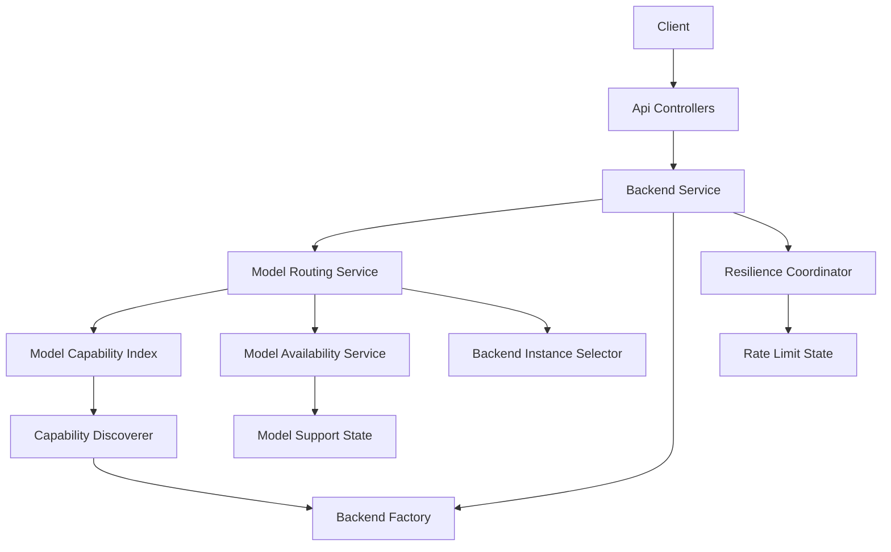
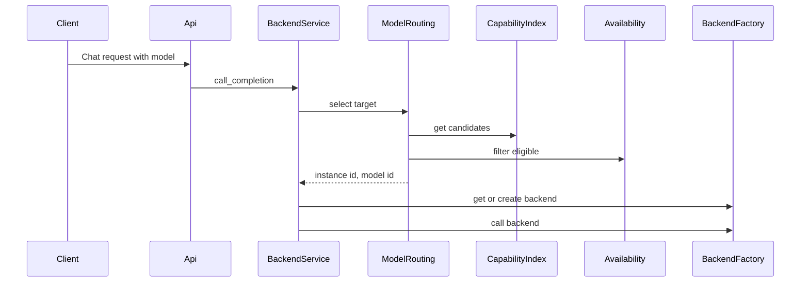
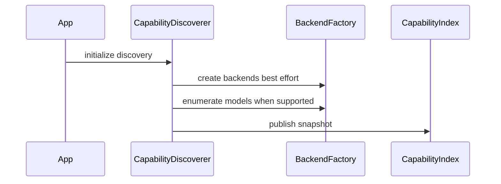

# Design Document

## Overview

This feature delivers dynamic, backend-agnostic model routing for the Universal LLM Proxy while preserving explicit backend addressing. Clients may request models as `model` or `vendor/model`, and the proxy selects an eligible backend instance at runtime using configured policies and runtime availability state. Explicit backend addressing remains supported via `backend:model` and `backend-instance:model`.

The design introduces a dedicated routing layer that unifies:
- model addressing semantics (backend selection uses `:` only)
- capability discovery (which instances can serve which models)
- availability filtering (rate limits, auth disablement, model-not-found)
- consistent selection and failover behavior

### Goals
- Provide unambiguous model addressing across the entire proxy (API, config, session commands).
- Support model-only routing (`model`, `vendor/model`) to dynamically pick an eligible backend instance.
- Support backend routing (`backend:model`) with default Round Robin across instances.
- Support explicit instance routing (`backend-instance:model`) without load balancing.
- Integrate runtime availability state to avoid wasting attempts on unavailable targets.
- Expose backend-agnostic model lists and routing diagnostics.

### Non-Goals
- Persisting routing/capability state across process restarts (in-memory only).
- Introducing new external dependencies for routing or locking.
- Automatic semantic normalization of vendor names across unrelated providers (e.g., mapping aliases like `google` vs `gemini` beyond the existing alias system).
- Full removal of legacy routing behavior in a single release; migration is additive and guarded by validation and compatibility rules.

## Architecture

### Existing Architecture Analysis

Relevant existing components:
- `BackendService` is the execution orchestrator and owns request routing, backend lifecycle, failover behavior, and resilience hooks.
- `BackendRoutingService` currently resolves:
  - `backend-instance` (explicit instance),
  - `backend` (Round Robin across instances),
  - `model-only` discovery (based on `BackendConfig.models` hints).
- The resilience layer (`ResilienceCoordinator` + `RateLimitStateManager`) tracks:
  - instance-wide cooldown,
  - (instance, model) cooldown,
  - permanent instance disablement on auth failures.
- `/models` endpoint currently enumerates backends and emits backend-prefixed identifiers for many backends.

Observed gaps relative to requirements:
- No shared “permanent model unsupported on instance” state exists for model-not-found signals.
- Candidate selection and failover selection do not consistently consult runtime availability state.
- `/models` is not backend-agnostic and is not driven by a capability index.

### Architecture Pattern & Boundary Map

Selected pattern: **Dedicated Routing Service + In-Memory Index (copy-on-write snapshots)**.

Rationale:
- Keeps routing decisions in one boundary that can be unit-tested independently.
- Enables O(1) model-to-candidate lookups and lock-free reads.
- Composes existing resilience and backend lifecycle patterns instead of duplicating them.

Boundary ownership:
- **ModelRoutingService** owns the routing decision contract and selection policy application.
- **ModelCapabilityIndex** owns the capability mapping and exposes read-only query operations on snapshots.
- **ModelAvailabilityService** owns eligibility filtering (cooldown/disabled/unsupported checks) and exposes “is eligible” queries for routing.
- **BackendInstanceSelector** owns pure Round Robin selection within a set of instance IDs (no model logic).
- **ResilienceCoordinator** remains the owner of temporary cooldown state and permanent instance disablement; routing consults it through ModelAvailabilityService.

### Technology Stack & Alignment

| Layer | Choice / Version | Role in Feature | Notes |
|------|------------------|-----------------|-------|
| Runtime | Python 3.10+ | In-memory routing state | Avoid blocking I/O on request path |
| API | FastAPI (async) | Entry points (`/v1/chat/completions`, `/v1/models`, diagnostics) | Routing must not block the event loop |
| DI Container | `ServiceCollection` | Register routing/index services | Must pass DI scanner |
| Initialization | Staged init + DI services module | Startup discovery | Best-effort, non-fatal |
| Resilience | `ResilienceCoordinator` | Cooldowns + disablement | Extended with model-not-found handler |

## System Flows

### Flow 1: Request Routing Selection

Key decisions:
- Selection is performed before any backend call to avoid wasted attempts.
- Availability filtering occurs before selection; errors distinguish “unknown model” vs “temporarily unavailable”.

### Flow 2: Startup Capability Discovery

Key decisions:
- Discovery failures do not block startup; config hints are used as fallback input.
- Index updates are copy-on-write and safe under concurrency.

## Requirements Traceability

| Requirement | Summary | Components | Interfaces | Flows |
|-------------|---------|------------|------------|-------|
| 1.1, 1.2, 1.3, 1.4, 1.5 | Unambiguous model addressing | Model parsing + routing layer | `IModelRoutingService` | Flow 1 |
| 2.1, 2.2, 2.3, 2.4 | `backend:model` RR across instances with availability filtering | ModelRoutingService, BackendInstanceSelector, ModelAvailabilityService | `IBackendInstanceSelector`, `IModelAvailabilityService` | Flow 1 |
| 3.1, 3.2, 3.3, 3.4 | Model-only routing with policy and routing policy enforcement | ModelRoutingService, ModelCapabilityIndex | `IModelCapabilityIndex` | Flow 1 |
| 4.1, 4.2, 4.3, 4.4, 4.5, 4.6 | Runtime availability integration | ModelAvailabilityService, ResilienceCoordinator, ModelSupportState | `IModelAvailabilityService` | Flow 1 |
| 5.1, 5.2, 5.3, 5.4 | Capability discovery and indexing | CapabilityDiscoverer, ModelCapabilityIndex | `IModelCapabilityDiscoverer`, `IModelCapabilityIndex` | Flow 2 |
| 6.1, 6.2, 6.3 | Observability and error differentiation | ModelsController, DiagnosticsController, routing errors | N/A (controller layer) | Flow 1 |
| 7.1, 7.2, 7.3, 7.4 | Performance and concurrency requirements | Index snapshots + bounded attempts | `IModelCapabilityIndex` | Flow 1 |
| 8.1, 8.2, 8.3 | Compatibility and migration | Model parsing rules + config validation | N/A | Flow 1 |

## Components and Interfaces

### Components Summary

| Component | Layer | Intent | Req Coverage | DI Lifetime | Contracts |
|----------|-------|--------|--------------|-------------|----------|
| ModelRoutingService | core services | Single entry point for selection and alternative enumeration | 1, 2, 3, 4, 7, 8 | Singleton | `IModelRoutingService` |
| ModelCapabilityIndex | core services | Read-optimized mapping from model to candidate instances | 3, 5, 7 | Singleton | `IModelCapabilityIndex` |
| ModelCapabilityDiscoverer | core services | Builds capability snapshots via best-effort enumeration and config hints | 5 | Singleton | `IModelCapabilityDiscoverer` |
| ModelAvailabilityService | core services | Filters candidates using runtime state and health | 2, 3, 4, 7 | Singleton | `IModelAvailabilityService` |
| BackendInstanceSelector | core services | Round Robin selection within a candidate set | 2, 3 | Singleton | `IBackendInstanceSelector` |
| ModelSupportState | core services | Permanent `(instance, model)` unsupported registry | 4 | Singleton | `IModelSupportState` |

### Services Layer

#### ModelRoutingService

| Field | Detail |
|-------|--------|
| Intent | Select a backend instance and effective model identifier for each request variant |
| Requirements | 1.1, 1.2, 1.3, 1.4, 1.5, 2.1, 2.2, 2.3, 2.4, 3.1, 3.2, 3.3, 3.4, 4.5, 6.3, 7.4, 8.1 |
| Interface | `IModelRoutingService` |
| Inputs | backend selector (optional), model identifier, excluded set, routing policy config |
| Outputs | selected instance id, effective model id, diagnostic metadata |

Interface contract:
- `select_target(backend_selector, model_id, excluded) -> RoutingSelection`
- `find_alternatives(model_id, excluded) -> list[RoutingSelection]`

Behavioral rules:
- Enforces routing policy flags (`disable_backend_ids`, `disable_backend_names`, `disable_model_names`).
- Uses `BackendInstanceSelector` for Round Robin within eligible candidates.
- Uses `ModelAvailabilityService` to filter candidates before selection.
- Distinguishes:
  - unknown model (no candidates in capability index or config hints),
  - temporarily unavailable (candidates exist but all filtered out by availability).

#### ModelCapabilityIndex

| Field | Detail |
|-------|--------|
| Intent | Provide constant-time candidate lookup for `model` and `vendor/model` identifiers |
| Requirements | 3.1, 3.3, 5.3, 7.3 |
| Interface | `IModelCapabilityIndex` |

Data model (logical):
- Snapshot contains:
  - `model_to_instances: dict[str, frozenset[str]]`
  - `instance_to_models: dict[str, frozenset[str]]`
- Read operations are lock-free.
- Update operations replace the snapshot under a single async lock.

Normalization rules:
- Store canonical model identifiers as `vendor/model` where known.
- Preserve plain model identifiers as additional lookup keys when necessary for compatibility.
- Never store backend-prefixed model identifiers (no `backend:` prefix) inside the index.

#### ModelCapabilityDiscoverer

| Field | Detail |
|-------|--------|
| Intent | Build capability snapshots from connectors and configuration hints |
| Requirements | 5.1, 5.2, 5.4 |
| Interface | `IModelCapabilityDiscoverer` |

Discovery sources (priority order):
1. Connector enumeration via `get_available_models_async` / `get_available_models` (authoritative when available).
2. Configuration hints (`BackendConfig.models`) as fallback when enumeration is unavailable or fails.

Discovery execution:
- Runs during startup as best-effort initialization and may optionally run periodically (configurable).
- Failures are logged; discovery must not crash startup.

#### ModelAvailabilityService

| Field | Detail |
|-------|--------|
| Intent | Determine whether an instance and model pair is eligible for selection |
| Requirements | 2.3, 4.1, 4.2, 4.3, 4.4, 4.5, 7.2 |
| Interface | `IModelAvailabilityService` |

Eligibility inputs:
- instance id
- model identifier

Eligibility checks (order):
1. Permanent instance disablement (auth failures) via resilience state.
2. Instance-wide cooldown via resilience state.
3. Permanent `(instance, model)` unsupported via `ModelSupportState`.
4. Model-specific cooldown via resilience state.
5. Health check status if backend instance exists and exposes `is_backend_functional`.

#### ModelSupportState

| Field | Detail |
|-------|--------|
| Intent | Store permanent “unsupported model on instance” facts to avoid future attempts |
| Requirements | 4.4, 4.5 |
| Interface | `IModelSupportState` |

Update rules:
- Only set on explicit model-not-found signals (domain error code or HTTP status mapped to model-not-found).
- Provide manual reset hooks (administrative) as an extension point.

#### BackendInstanceSelector

| Field | Detail |
|-------|--------|
| Intent | Round Robin selection among a candidate list under concurrency |
| Requirements | 2.1, 3.2, 7.2 |
| Interface | `IBackendInstanceSelector` |

Selection rule:
- Stable ordering of candidates, with a per-key counter protected by a lock.

## Error Handling

Routing error taxonomy:
- **Unknown model**: no candidate instances exist for the requested model.
- **Temporarily unavailable**: candidate instances exist but all are filtered out due to cooldown/disabled/health.
- **Policy rejected**: routing method is disabled via `RoutingConfig`.

Transport mapping:
- Unknown model: surfaced as `InvalidRequestError` or `RoutingError` with `details.code = "unknown_model"`.
- Temporarily unavailable: surfaced as `RateLimitExceededError` (if cooldown-driven) or `RoutingError` with `details.code = "temporarily_unavailable"`.
- Policy rejected: `RoutingError` (existing behavior).

## Observability

### Models Endpoint
- `/v1/models` should emit backend-agnostic `vendor/model` identifiers derived from `ModelCapabilityIndex`.
- Compatibility option: support a query parameter to include backend-prefixed identifiers for legacy clients, without changing the canonical set stored in the index.

### Diagnostics Endpoint
- Extend `/v1/diagnostics` output to include:
  - instance availability state (disabled, cooldown remaining)
  - a summary mapping of `model -> eligible instances` (bounded or sampled for size)

## Security Considerations
- Never emit secrets in diagnostics or model listing.
- Treat “auth failure” disablement as instance-scoped (not global across unrelated instances).

## Performance Considerations
- Request-path selection uses O(1) index lookups and filtering over a bounded candidate set.
- Index reads are lock-free; writes are copy-on-write under a single async lock.
- Enumeration/refresh is off the request path.

## Testing Strategy
- Unit tests:
  - ModelRoutingService selection for all address variants
  - Availability filtering behavior (cooldown, disabled, unsupported)
  - Capability index snapshot semantics and normalization rules
- Integration tests:
  - `/v1/models` emits backend-agnostic identifiers
  - `/v1/chat/completions` model-only request routes without backend selection
  - Diagnostics include routing state summaries

## Integration & Migration Notes
- `backend/model` (no `:`) is treated as model-only input, never backend selection (8.1).
- Configuration that expects backend addressing (failover routes, explicit overrides) must use `backend:model` (8.2).
- User-facing explicit-backend features must validate `backend:model` strictly (8.3).

