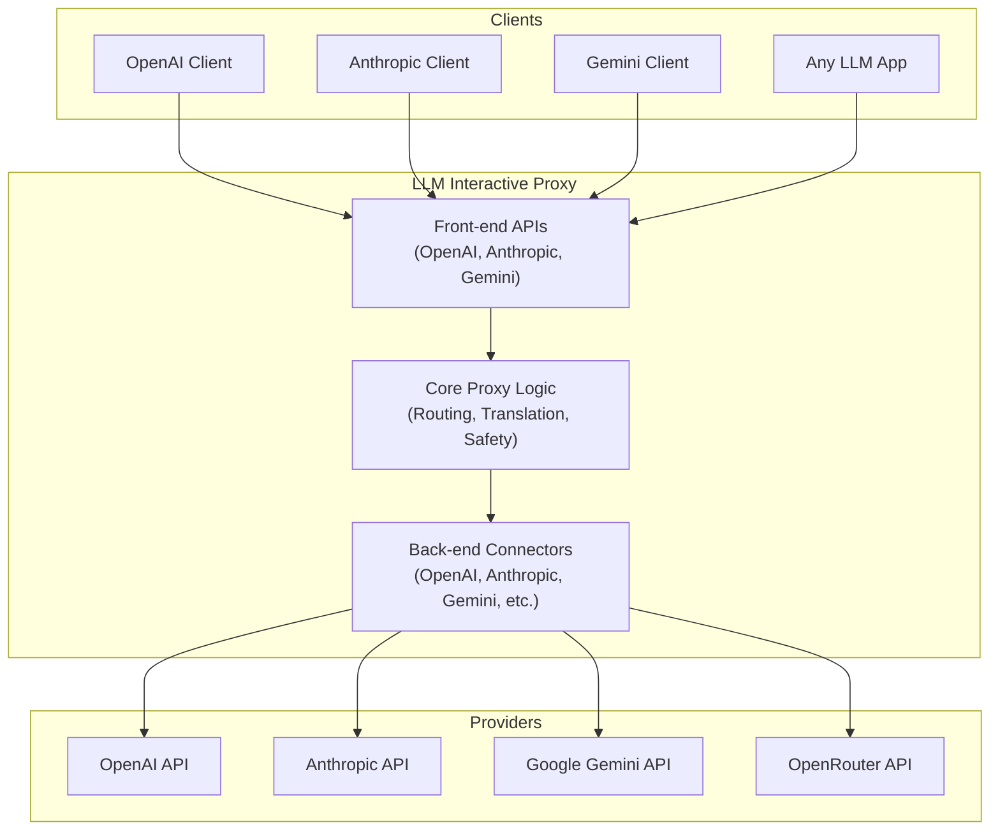

# LLM Interactive Proxy


[](https://codecov.io/gh/matdev83/llm-interactive-proxy)

[](LICENSE)

A swiss-army knife proxy for LLM-powered applications. Sits between any LLM-aware client and any backend, presenting multiple front-end APIs (OpenAI, Anthropic, Gemini) while routing to your chosen provider. Translate requests, override models, rotate API keys, prevent leaks, inspect traffic, and execute chat-embedded commands—all from a single drop-in gateway.

## Architecture



## Key Features

- **Connect Any App to Any Model**: Route requests from any LLM client to any backend, even across protocols
- **Codebuff WebSocket Server**: Real-time AI communication via WebSocket with session management, streaming responses, and file context support - [Quick Start](docs/user_guide/features/codebuff-quick-start.md)
- **Model Override**: Force applications to use your chosen model, regardless of hardcoded defaults
- **API Key Rotation**: Aggregate and auto-rotate API keys to maximize free-tier usage
- **Test Execution Reminder**: Automatically reminds agents to run tests before completing tasks (14+ languages)
- **LLM Assessment**: Detect conversation loops and stuck patterns with intelligent monitoring
- **Tool Access Control**: Fine-grained control over which tools LLMs can access
- **Dangerous Command Protection**: Block destructive git operations before they cause damage
- **File Access Sandboxing**: Restrict file operations to safe directories
- **Wire Capture & Debugging**: Inspect and analyze all traffic for debugging
- **Edit Precision Tuning**: Auto-adjust parameters when models struggle with precise edits
- **Angel Verification**: Real-time response verification with automatic correction
- **And 10+ more features** - See [User Guide](docs/user_guide/index.md) for complete list

## Quick Start

### Installation

```bash
# Clone the repository
git clone https://github.com/matdev83/llm-interactive-proxy.git
cd llm-interactive-proxy

# Create virtual environment
python -m venv .venv
source .venv/Scripts/activate  # Windows: .venv\Scripts\activate

# Install dependencies
pip install -e .[dev]
```

### Basic Usage

```bash
# Start the proxy with OpenAI backend
export OPENAI_API_KEY="your-key-here"
python -m src.core.cli --default-backend openai:gpt-4o

# Or with custom configuration
python -m src.core.cli --config config/my_config.yaml
```

For detailed setup instructions, see [Quick Start Guide](docs/user_guide/quick-start.md).

## Documentation

- **[User Guide](docs/user_guide/index.md)** - Feature documentation, configuration, backends, debugging
- **[Development Guide](docs/development_guide/index.md)** - Architecture, building, testing, contributing
- **[Configuration Guide](docs/user_guide/configuration.md)** - Complete parameter reference
- **[CHANGELOG](CHANGELOG.md)** - Version history and updates
- **[CONTRIBUTING](CONTRIBUTING.md)** - Contribution guidelines

## Supported Backends

- OpenAI (GPT-4, GPT-4o, GPT-3.5-turbo)
- Anthropic (Claude 3 family)
- Google Gemini (all variants)
- OpenRouter
- ZAI
- Qwen
- Custom backends

See [Backends Overview](docs/user_guide/backends/overview.md) for details.

## Support

- [GitHub Issues](https://github.com/matdev83/llm-interactive-proxy/issues) - Report bugs or request features
- [Discussions](https://github.com/matdev83/llm-interactive-proxy/discussions) - Ask questions and share ideas

## License

This project is licensed under the [MIT License](LICENSE).

## Development

```bash
# Run tests
python -m pytest

# Run linter
python -m ruff --fix check .

# Format code
python -m black .
```

See [Development Guide](docs/development_guide/index.md) for more details.
