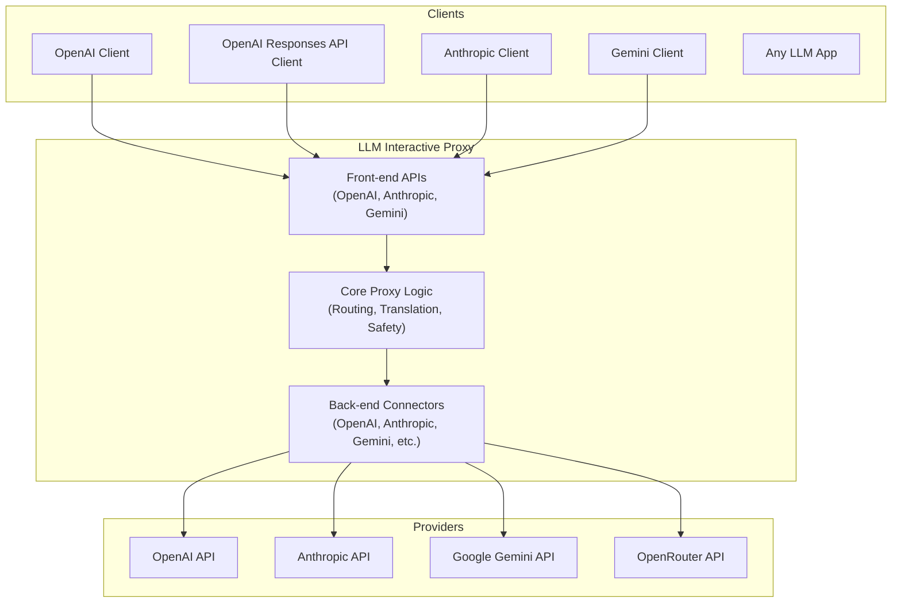

# LLM Interactive Proxy


[](https://codecov.io/gh/matdev83/llm-interactive-proxy)

[](LICENSE)

A swiss-army knife proxy that sits between your LLM client and provider—giving you a universal adapter, cost optimization, and full visibility with zero code changes.

## Why Use LLM Interactive Proxy?

Think of it as a universal adapter and control plane for your LLM stack:

- **Use any frontend with any backend**: Your OpenAI SDK app can call Anthropic, Claude desktop can hit Gemini, and any LLM tool can work with OpenRouter—no code changes required. The proxy handles protocol translation automatically.
- **Consolidate all your LLM subscriptions**: Connect your agents to GPT Plus/Pro, Gemini Advanced, Google AI Pro/Ultra, Qwen, GLM Code, and other premium plans through a single endpoint. Maximize the value of every subscription you already have without juggling multiple APIs.
- **Optimize costs without complexity**: Rotate multiple API keys to maximize free-tier allowances, switch to cheaper models automatically, or force specific models regardless of what apps request.
- **Keep your keys safe**: Prevent API keys from leaking to external services. Configure keys once in the proxy, not in every client.
- **See everything**: Capture and inspect every request and response in CBOR format. Debug issues, analyze usage patterns, and understand exactly what your LLM apps are doing.
- **Stay in control**: Restrict file access to safe directories, block dangerous git operations, control which tools LLMs can access, and enforce usage limits.

Zero changes to your client code. Just point it at the proxy and gain control, visibility, and flexibility.

## Key Capabilities

- **Universal Protocol Translation** — Use OpenAI SDK with Anthropic, Claude client with Gemini, any combo
- **Cost Optimization** — API key rotation, free-tier maximization, automatic model fallback
- **Full Observability** — Wire capture, usage tracking, token counting, performance metrics
- **Security & Control** — Key isolation, file sandboxing, dangerous command blocking, tool access control
- **Subscription Consolidation** — Leverage GPT Plus/Pro, Gemini Advanced, Google AI Pro/Ultra, and more through one endpoint
- **Flexible Deployment** — Single-user mode for development, multi-user mode for production

See [User Guide](docs/user_guide/index.md) for the complete feature list.

## Quick Start

### 1. Installation

```bash
git clone https://github.com/matdev83/llm-interactive-proxy.git
cd llm-interactive-proxy
python -m venv .venv
source .venv/Scripts/activate  # Windows: .venv\Scripts\activate
pip install -e .[dev]
```

### 2. Start the Proxy

```bash
export OPENAI_API_KEY="your-key-here"
python -m src.core.cli --default-backend openai:gpt-4o
```

### 3. Point Your Client at the Proxy

```python
# Instead of direct API calls:
from openai import OpenAI
client = OpenAI(api_key="your-key")

# Use the proxy (base_url only):
from openai import OpenAI
client = OpenAI(
    base_url="http://localhost:8000/v1",
    api_key="dummy-key"  # Proxy handles real authentication
)

# Now use normally - requests go through the proxy
response = client.chat.completions.create(
    model="gpt-4o",
    messages=[{"role": "user", "content": "Hello!"}]
)
```

That's it. All your existing code works unchanged—the proxy handles routing, translation, and monitoring transparently.

See [Quick Start Guide](docs/user_guide/quick-start.md) for detailed configuration.

## Architecture



## Documentation

- **[User Guide](docs/user_guide/index.md)** - Feature documentation, configuration, backends, debugging
- **[Development Guide](docs/development_guide/index.md)** - Architecture, building, testing, contributing
- **[Configuration Guide](docs/user_guide/configuration.md)** - Complete parameter reference
- **[CHANGELOG](CHANGELOG.md)** - Version history and updates
- **[CONTRIBUTING](CONTRIBUTING.md)** - Contribution guidelines

## Supported Front-end Interfaces

The proxy exposes multiple standard API surfaces, allowing you to use your favorite clients with any backend:

- **OpenAI Chat Completions** (`/v1/chat/completions`) - Compatible with OpenAI SDKs and most tools.
- **OpenAI Responses** (`/v1/responses`) - Optimized for structured output generation.
- **OpenAI Models** (`/v1/models`) - Unified model discovery across all backends.
- **[Anthropic Messages](docs/user_guide/backends/anthropic.md#using-anthropic-messages-api-directly)** (`/anthropic/v1/messages`) - Native support for Claude clients/SDKs.
- **Dedicated Anthropic Server** (`http://host:8001/v1/messages`) - Drop-in replacement for Anthropic API on a separate port (default: 8001).
- **Google Gemini v1beta** (`/v1beta/models`, `:generateContent`) - Native support for Gemini tools.

See [Front-End APIs Overview](docs/user_guide/backends/overview.md#front-end-apis) for more details.

## Supported Backends

- **[OpenAI (Legacy)](docs/user_guide/backends/openai.md)** (GPT-4, GPT-4o, o1, standard Chat Completions)
- **[OpenAI Responses API](docs/user_guide/backends/openai.md)** (Optimized for structured output generation)
- **[Anthropic](docs/user_guide/backends/anthropic.md)** (Claude 3.5 Sonnet, Opus, Haiku)
- **[Google Gemini](docs/user_guide/backends/gemini.md)** (API Key, OAuth, GCP, Vertex AI, Auto-OAuth)
- **[OpenRouter](docs/user_guide/backends/openrouter.md)** (Access to 100+ models)

- **[ZAI (Zhipu AI)](docs/user_guide/backends/zai.md)** (GLM models, including support for the GLM Coding Plan)
- **[Alibaba Qwen](docs/user_guide/backends/qwen.md)** (Coding-optimized LLM models)
- **[MiniMax](docs/user_guide/backends/minimax.md)** (Hailuo AI reasoning models)
- **[InternLM](docs/user_guide/backends/internlm.md)** (InternLM AI models with API key rotation)
- **[ZenMux](docs/user_guide/backends/zenmux.md)** (Unified model aggregator)
- **[Moonshot AI](docs/user_guide/backends/kimi-code.md)** (Kimi models, including Kimi Code for coding)
- **[Cline](docs/user_guide/backends/cline.md)** (Specialized debugging backend)
- **[Hybrid](docs/user_guide/features/hybrid-backend.md)** (Virtual backend for two-phase reasoning)
- **[Antigravity](docs/user_guide/backends/antigravity-oauth.md)** (Internal debugging backends for Gemini/Claude)

See [Backends Overview](docs/user_guide/backends/overview.md) for full details and configuration.

## Access Modes

The proxy supports two operational modes to enforce appropriate security boundaries:

- **Single User Mode** (default): For local development. Allows OAuth connectors, optional authentication, localhost-only binding.
- **Multi User Mode**: For production/shared deployments. Blocks OAuth connectors, requires authentication for remote access, allows any IP binding.

### Quick Examples

```bash
# Single User Mode (default) - local development
./.venv/Scripts/python.exe -m src.core.cli

# Multi User Mode - production deployment
./.venv/Scripts/python.exe -m src.core.cli --multi-user-mode --host=0.0.0.0 --api-keys key1,key2
```

See [Access Modes User Guide](docs/user_guide/access-modes.md) for detailed documentation.

## Support

- [GitHub Issues](https://github.com/matdev83/llm-interactive-proxy/issues) - Report bugs or request features
- [Discussions](https://github.com/matdev83/llm-interactive-proxy/discussions) - Ask questions and share ideas

## License

This project is licensed under the [GNU AGPL v3.0 or later](LICENSE).

## Development

```bash
# Run tests
python -m pytest

# Run linter
python -m ruff --fix check .

# Format code
python -m black .
```

See [Development Guide](docs/development_guide/index.md) for more details.
