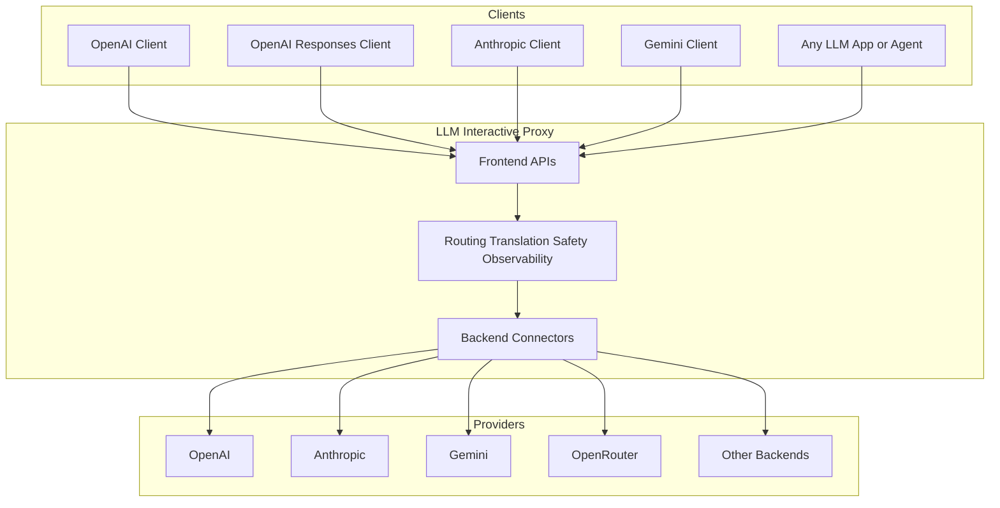

# LLM Interactive Proxy

[&cacheSeconds=300)](https://github.com/matdev83/llm-interactive-proxy/actions/workflows/ci.yml?query=branch%3Adev)
[](https://codecov.io/gh/matdev83/llm-interactive-proxy)


[](LICENSE)

Turn any compatible AI client into a safer, smarter, multi-provider agent platform.

`LLM Interactive Proxy` is a universal translation, routing, and control layer for modern AI clients. Point OpenAI-compatible apps, Anthropic tools, Gemini integrations, and agentic coding workflows at one local or shared endpoint, then gain routing, failover, built-in security, automated steering, session intelligence, observability, and cross-provider flexibility without rewriting your client.

If your current setup feels fragile, expensive, opaque, or locked to one vendor, this project is designed to change that.

It is a compatibility layer, a security layer, a traffic control plane, a debugging surface, and a workflow improver for serious agentic use.

- **Keep your existing clients** - Change the endpoint, not the app.
- **Mix providers freely** - Route across APIs, plans, OAuth accounts, model families, and protocol styles.
- **Control agents in production** - Add guardrails, rewrites, diagnostics, and policy at the proxy layer.
- **Debug with evidence** - Inspect exact wire traffic instead of guessing from symptoms.

| Without the proxy | With LLM Interactive Proxy |
| --- | --- |
| Each client is tied to one provider stack | One endpoint can serve many clients and many backend families |
| Provider switching often means code or config churn | Change routing instead of rewriting integrations |
| Agent safety is scattered across tools | Centralize redaction, tool controls, sandboxing, and command protection |
| Debugging depends on incomplete logs | Inspect exact wire traffic with captures and diagnostics |
| Token costs grow with long sessions | Use intelligent context compression and smarter routing to reduce spend |
| Protocol mismatch blocks experimentation | Use cross-protocol conversion to bridge Anthropic, OpenAI, Gemini, and more |

## At a glance

Beyond basic forwarding, the proxy adds cross-protocol translation, tool safety, routing and failover, session-oriented features (including B2BUA-style handling), boundary-level CBOR captures, and usage tracking. Longer narratives, use-case lists, and feature tours live in the [User Guide](docs/user_guide/index.md).

## Resilience Behavior

Recent resilience hardening adds safer retry and failover behavior by default:

- Shared async retry policy (`stamina`-backed) is used in major retry hotspots, with canonical `Retry-After` extraction.
- Routing availability now includes circuit-breaker and endpoint-health gates (when health checks are enabled), so unstable instances are temporarily excluded instead of repeatedly selected.
- Streaming recovery avoids retry/failover after meaningful output has already started, preventing duplicate output and tool-call corruption.

`resilience.circuit_breaker` is now a first-class config block in `config.yaml` for threshold/cooldown tuning.

## Dynamic Tool-Output Compression

The proxy supports strategy-based compression for `role="tool"` outputs during backend request preparation. It is disabled by default (`dynamic_compression.enabled: false`) with deterministic precedence (CLI > ENV > YAML > defaults), configured via `dynamic_compression.*`, `DYNAMIC_COMPRESSION_*`, or CLI flags (for example `--dynamic-compression-enabled`), and skips Gemini connector truncation when enabled to avoid double-reduction. Built-in strategies now include ANSI normalization, dedupe/grouping, unified-diff compaction, directory/listing summaries, search-result grouping, file-read detail/line-window reductions, failure-focused test/build reduction, diagnostics grouping (file/rule), JSON/NDJSON structural summarization, XML parseability-preserving safeguards, noisy-log dedupe with volatile-field normalization, and sensitive-field projection for env/cloud-style outputs. File-detail outputs can optionally include line numbers through `dynamic_compression.file_detail_include_line_numbers` (`DYNAMIC_COMPRESSION_FILE_DETAIL_INCLUDE_LINE_NUMBERS`, `--dynamic-compression-file-detail-include-line-numbers`, `--dynamic-compression-file-detail-exclude-line-numbers`).

## Quick Start

### 1. Clone and install

```bash
git clone https://github.com/matdev83/llm-interactive-proxy.git
cd llm-interactive-proxy
python -m venv .venv

# Windows
.venv\Scripts\activate

# Linux/macOS
source .venv/bin/activate

python -m pip install -e .[dev]
```

If you want OAuth-oriented optional connectors, install the `oauth` extra:

```bash
python -m pip install -e .[dev,oauth]
```

### 2. Export at least one provider credential

```bash
# Example: OpenAI
export OPENAI_API_KEY="your-key-here"
```

### 3. Start the proxy

```bash
python -m src.core.cli --default-backend openai:gpt-4o
```

The proxy listens on `http://localhost:8000` by default.

### 4. Point your client at the proxy instead of the vendor

```python
from openai import OpenAI

client = OpenAI(
    base_url="http://localhost:8000/v1",
    api_key="dummy-key",
)

response = client.chat.completions.create(
    model="gpt-4o",
    messages=[{"role": "user", "content": "Hello!"}],
)

print(response.choices[0].message.content)
```

See the full [Quick Start Guide](docs/user_guide/quick-start.md) for additional setup, auth, and backend examples.

### First user message appender (per session)
Optional once-per-session suffix on the first `user` message (HTTP chat): `auto_append_first_prompt_filename` in config (`.txt`/`.md`), `AUTO_APPEND_FIRST_PROMPT_FILENAME`, or `--auto-append-first-prompt-filename`. File must exist at startup; contents are read once into memory (restart to reload). At default log level, startup logs confirm load; each session logs once when the suffix is merged. Applied after redaction on the outbound request only (history stays pre-transform, like redaction). Skipped for auxiliary-routed calls.

## Supported Frontend Interfaces

The proxy exposes standard API surfaces so existing clients can often work with little or no code changes.

- **OpenAI Chat Completions** - `/v1/chat/completions`
- **OpenAI Responses** - `/v1/responses`
- **OpenAI Models** - `/v1/models`
- **Anthropic Messages** - `/anthropic/v1/messages`
- **Dedicated Anthropic server** - `http://host:<anthropic_port>/v1/messages` (only when `anthropic_port` / `--anthropic-port` / `ANTHROPIC_PORT` is set; often `8001`)
- **Google Gemini v1beta** - `/v1beta/models` and `:generateContent`
- **Diagnostics endpoint** - `/v1/diagnostics`
- **Backend reactivation endpoint** - `/v1/diagnostics/backends/{backend_instance}/reactivate`

See [Frontend API documentation](docs/user_guide/frontends/overview.md) for protocol details and compatibility notes.

## Supported Backends

The backend catalog keeps growing. Current documented backends include:

- [OpenAI](docs/user_guide/backends/openai.md)
- [Anthropic](docs/user_guide/backends/anthropic.md)
- [Google Gemini](docs/user_guide/backends/gemini.md)
- [OpenRouter](docs/user_guide/backends/openrouter.md)
- [Nvidia](docs/user_guide/backends/nvidia.md)
- [ZAI (Zhipu AI)](docs/user_guide/backends/zai.md)
- [Alibaba Qwen](docs/user_guide/backends/qwen.md)
- [MiniMax](docs/user_guide/backends/minimax.md)
- [InternLM](docs/user_guide/backends/internlm.md)
- [ZenMux](docs/user_guide/backends/zenmux.md)
- [Moonshot AI / Kimi Code](docs/user_guide/backends/kimi-code.md)
- [Hybrid backend](docs/user_guide/features/hybrid-backend.md)
- [Cline](docs/user_guide/backends/cline.md)
- [Antigravity OAuth](docs/user_guide/backends/antigravity-oauth.md)

See the full [Backends Overview](docs/user_guide/backends/overview.md) for configuration and provider-specific notes.

## Routing Selector Semantics

- `backend:model` selects an explicit backend family.
- `backend-instance:model` such as `openai.1:gpt-4o` targets a concrete backend instance.
- `model` and `vendor/model` are model-only selectors.
- `vendor/model:variant` remains model-only unless `:` appears before the first `/`.
- URI-style parameters in selectors such as `model?temperature=0.5` are parsed and propagated through routing metadata.
- Explicit-backend configuration and command surfaces such as `--static-route`, replacement targets, and one-off routing require strict `backend:model` format.

## Access Modes

The proxy supports two operational modes with different security assumptions:

- **Single User Mode** - Default local-development mode with localhost-first behavior and support for OAuth connectors.
- **Multi User Mode** - Shared or production mode with stronger authentication expectations and tighter connector rules.

Quick examples:

```bash
# Single User Mode
python -m src.core.cli

# Multi User Mode
python -m src.core.cli --multi-user-mode --host=0.0.0.0 --api-keys key1,key2
```

See [Access Modes](docs/user_guide/access-modes.md) for the security model and deployment guidance.

## Architecture



The proxy sits between the client and the provider, which is exactly why it can translate protocols, enforce policy, capture traffic, and route requests without forcing your app to change its calling pattern.

## Documentation Map

- **[Quick Start](docs/user_guide/quick-start.md)** - Get running fast
- **[User Guide](docs/user_guide/index.md)** - End-user documentation and feature catalog
- **[Configuration Guide](docs/user_guide/configuration.md)** - Flags, config, and operational settings
- **[Frontend Overview](docs/user_guide/frontends/overview.md)** - Choose the right API surface
- **[Backends Overview](docs/user_guide/backends/overview.md)** - Provider setup and switching
- **[Security Docs](docs/user_guide/security/authentication.md)** - Authentication and key-handling guidance
- **[Development Guide](docs/development_guide/index.md)** - Architecture, local development, testing, and contributing
- **[CHANGELOG](CHANGELOG.md)** - Release history
- **[CONTRIBUTING](CONTRIBUTING.md)** - Contribution guidelines

## Development

```bash
# Run the test suite
python -m pytest

# Lint and auto-fix
python -m ruff check --fix .

# Format
python -m black .
```

See the [Development Guide](docs/development_guide/index.md) for architecture, contribution workflow, and extra dev scripts.

## Support

[GitHub Issues](https://github.com/matdev83/llm-interactive-proxy/issues) and [Discussions](https://github.com/matdev83/llm-interactive-proxy/discussions).

## License

This project is licensed under the [GNU AGPL v3.0 or later](LICENSE).
