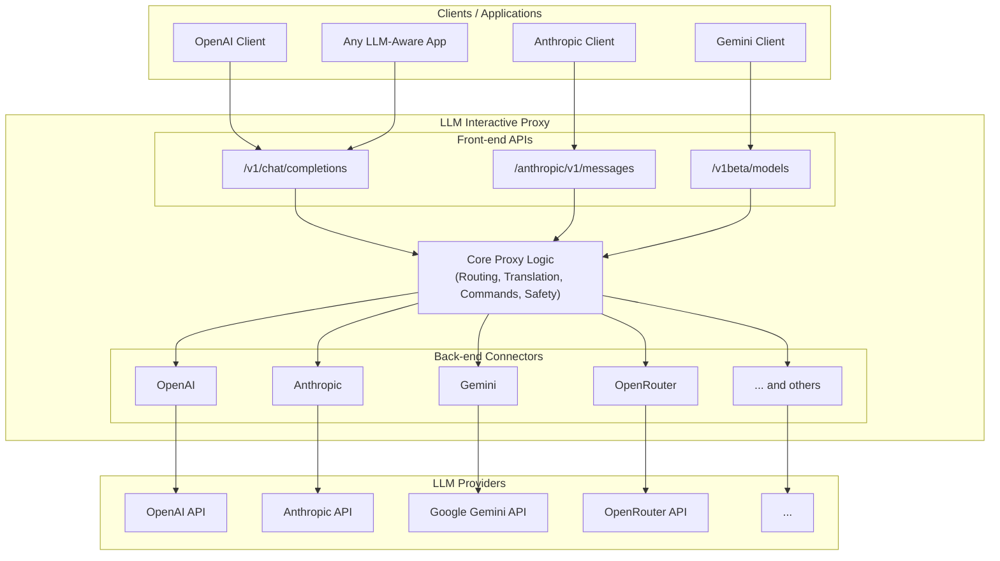

# LLM Interactive Proxy


[](https://codecov.io/gh/matdev83/llm-interactive-proxy)

[](LICENSE)


This project is a swiss-army knife for anyone working with language models and agentic workflows. It sits between any LLM-aware client and any LLM backend, presenting multiple front-end APIs (OpenAI, Anthropic, Gemini) while routing to whichever provider you choose. With the proxy you can translate, reroute, and augment requests on the fly, execute chat-embedded commands, override models, rotate API keys, prevent leaks, and inspect traffic -- all from a single drop-in gateway.

## Architecture



## Contents

- [Architecture](#architecture)
- [Use Cases](#use-cases)
- [Killer Features](#killer-features)
- [LLM Assessment System](#llm-assessment-system)
- [Tool Access Control](#tool-access-control)
- [Supported APIs (Front-Ends) and Providers (Back-Ends)](#supported-apis-front-ends-and-providers-back-ends)
- [Gemini Backends Overview](#gemini-backends-overview)
- [Hybrid Backend](#hybrid-backend)
- [Quick Start](#quick-start)
- [Using It Day-To-Day](#using-it-day-to-day)
- [Dangerous Command Protection](#dangerous-command-protection)
- [Security](#security)
- [Debugging (Wire Capture)](#debugging-wire-capture)
- [Optional Capabilities (Short List)](#optional-capabilities-short-list)
- [Example Config (minimal)](#example-config-minimal)
- [Popular Scenarios](#popular-scenarios)
- [Errors and Troubleshooting](#errors-and-troubleshooting)
- [Running Tests](#running-tests)
- [Support](#support)
- [License](#license)
- [Changelog](#changelog)

## Use Cases

- **Connect Any App to Any Model**: Seamlessly route requests from any LLM-powered application to any model, even across different protocols. Use clients like Anthropic's Claude Code CLI with a Gemini 2.5 Pro model, or Codex CLI with a Kimi K2 model.
- **Structured JSON Output**: Use the OpenAI Responses API for guaranteed JSON output that conforms to a specific schema, with automatic validation and repair.
- **Override Hardcoded Models**: Force an application to use a model of your choice, even if the developers didn't provide an option to change it.
- **Inspect and Debug Prompts**: Capture and analyze the exact prompts your agent sends to the LLM provider to debug and refine interactions.
- **Customize System Prompts**: Rewrite or modify an agent's system prompt to better suit your specific needs and improve its performance.
- **Leverage Your LLM Subscriptions**: Use your personal subscriptions, like OpenAI Plus/Pro or Anthropic Pro/MAX plans, with any third-party application, not just those developed by the LLM vendor.
- **Automated Model Tuning for Precision**: The proxy automatically detects when a model struggles with tasks like precise file edits and adjusts its parameters to improve accuracy on subsequent attempts. **Configuration (precedence: CLI > Env > YAML)**:
  - **CLI Flags**:
    - `--enable-edit-precision` / `--disable-edit-precision`: Enable or disable edit-precision tuning
    - `--edit-precision-temperature FLOAT`: Set target temperature for edit failures (default: 0.1)
    - `--edit-precision-min-top-p FLOAT`: Set minimum top_p value for edit failures (default: 0.3)
    - `--edit-precision-override-top-p`: Enable top_p override for edit failures
    - `--edit-precision-exclude-agents REGEX`: Exclude specific agents from edit-precision tuning
  - **Environment Variables**:
    - `EDIT_PRECISION_ENABLED=true|false` (default: true)
    - `EDIT_PRECISION_TEMPERATURE=0.1` (default: 0.1)
    - `EDIT_PRECISION_MIN_TOP_P=0.3`
    - `EDIT_PRECISION_OVERRIDE_TOP_P=false|true`
    - `EDIT_PRECISION_EXCLUDE_AGENTS_REGEX="<pattern>"`
    - `DISABLE_GEMINI_OAUTH_FALLBACK=true|false` (default: false) prevents Gemini OAuth connectors from automatically falling back to `gemini-2.5-flash` when the primary model is rate-limited.
  - **YAML** (`config.yaml`):
    ```yaml
    edit_precision:
      enabled: true
      temperature: 0.1
      min_top_p: 0.3
      override_top_p: false
      exclude_agents_regex: null
    ```
  - **Model-Specific Overrides**: Optionally configure per-model-family temperature overrides in `config/edit_precision_model_temperatures.yaml` (see Edit-Precision Tuning Examples section)
- **Model Name Rewrites (NEW)**: Dynamically rewrite model names using powerful regex-based rules. Route all GPT requests to OpenRouter, replace specific models with alternatives, or create catch-all fallbacks - all configurable via CLI, environment variables, or config files.
- **Planning-Phase Strong Model Overrides (NEW)**: Optionally route the first part of a session to a stronger model and override its parameters (e.g., temperature, top_p, reasoning effort, thinking budget) to maximize planning quality; automatically switch back to the default model after a set number of turns or file writes.
- **Automatic Tool Call Repair**: If a model generates invalid tool calls, the proxy automatically corrects them before they can cause errors in your agent.
- **LLM-Based Conversation Assessment**: Automatically detect when conversations become stuck in unproductive patterns using a smaller LLM to assess conversation quality. Inspired by Google's gemini-cli, this feature monitors conversation turns and provides steering messages when repetitive actions or cognitive loops are detected.
- **Automated Error Detection and Steering**: Detect when an LLM is stuck in a loop or fails to follow instructions, and automatically generate steering commands to get it back on track.
- **Block Harmful Tool Calls**: Prevent potentially destructive actions, such as deleting your git repository, by detecting and blocking harmful tool calls at the proxy level.
- **Tool Access Control (NEW)**: Fine-grained control over which tools LLMs can access and execute. Define allowed/blocked tool lists per model or agent using regex patterns, with both whitelist and blacklist modes. Filters tool definitions from requests and blocks disallowed tool calls in responses.
- **Maximize Free Tiers with API Key Rotation**: Aggregate all your API keys and use auto-rotation to seamlessly switch between them, allowing you to take full advantage of multiple free-tier allowances.

## LLM Assessment System

The proxy includes an intelligent conversation assessment system that monitors conversation quality and detects unproductive patterns, inspired by Google's gemini-cli project. This feature uses a smaller, faster LLM to periodically analyze conversation history and provide steering when the main conversation becomes stuck.

### Key Features

- **Automatic Pattern Detection**: Identifies repetitive tool calls, cognitive loops, and lack of progress
- **Event-Driven Assessment**: Triggers after configurable turn thresholds (default: 30 turns)
- **Confidence-Based Intervention**: Only intervenes when confidence is high (default: 0.9 threshold)
- **Dynamic Frequency Adjustment**: Adjusts assessment frequency based on confidence levels
- **Multi-Backend Support**: Works with any configured backend (OpenAI, Anthropic, Gemini, etc.)

### Configuration

**CLI Arguments**:
```bash
--enable-llm-assessment                    # Enable the assessment system
--llm-assessment-backend openai            # Backend to use for assessment
--llm-assessment-model gpt-4o-mini         # Model for assessment (recommend fast, cheap models)
--llm-assessment-turn-threshold 30         # Turns before first assessment (default: 30)
--llm-assessment-confidence-threshold 0.9  # Confidence threshold for intervention
--llm-assessment-history-window 20         # Recent turns to analyze (default: 20)
```

**Environment Variables**:
```bash
export LLM_ASSESSMENT_ENABLED=true
export LLM_ASSESSMENT_BACKEND=openai
export LLM_ASSESSMENT_MODEL=gpt-4o-mini
export LLM_ASSESSMENT_TURN_THRESHOLD=30
export LLM_ASSESSMENT_CONFIDENCE_THRESHOLD=0.9
export LLM_ASSESSMENT_HISTORY_WINDOW=20
```

**YAML Configuration**:
```yaml
llm_assessment:
  enabled: true
  backend: openai
  model: gpt-4o-mini
  turn_threshold: 30
  confidence_threshold: 0.9
  history_window: 20
  intervals:
    min: 5      # Minimum turns between assessments
    max: 15     # Maximum turns between assessments
    default: 3  # Default interval adjustment
```

### Use Cases

- **Long Coding Sessions**: Detect when an AI assistant gets stuck repeatedly calling the same tools
- **Complex Problem Solving**: Identify cognitive loops where the assistant expresses confusion or asks the same questions
- **Resource Conservation**: Automatically intervene in unproductive conversations to save API costs
- **Quality Assurance**: Ensure conversations maintain forward progress toward task completion

### Example Usage

```bash
# Basic setup with OpenAI for assessment
python -m src.core.cli \
  --enable-llm-assessment \
  --llm-assessment-backend openai \
  --llm-assessment-model gpt-4o-mini

# Custom thresholds for more sensitive detection
python -m src.core.cli \
  --enable-llm-assessment \
  --llm-assessment-backend anthropic \
  --llm-assessment-model claude-3-haiku-20240307 \
  --llm-assessment-turn-threshold 20 \
  --llm-assessment-confidence-threshold 0.8
```

The system operates transparently in the background, only intervening when it detects genuine unproductive patterns with high confidence. Assessment failures never break the main conversation flow.

## Tool Access Control

The proxy provides comprehensive tool access control, allowing you to define which tools LLMs can access and execute. This feature operates at two levels: filtering tool definitions from requests before they reach the LLM (preventing wasted turns), and blocking disallowed tool calls in responses (hard stop enforcement).

### Key Features

- **Flexible Pattern Matching**: Use regex patterns to match tool names, supporting both specific tools and pattern-based rules
- **Whitelist and Blacklist Modes**: Choose between "allow by default with exceptions" or "deny by default with exceptions"
- **Per-Model and Per-Agent Policies**: Define different tool access rules for different models or agents
- **Two-Layer Protection**: Filters tool definitions from requests AND blocks disallowed tool calls in responses
- **Precedence Rules**: Allowed patterns override blocked patterns; global policies override per-model policies
- **Observability**: Comprehensive logging and telemetry for policy evaluation and enforcement

### Configuration

Tool access policies are configured in the `tool_call_reactor_config.yaml` file under the `access_policies` section:

**CLI Arguments**:
```bash
--allowed-tools "read_.*,list_.*"      # Global allowed tool patterns
--blocked-tools "delete_.*,rm_.*"      # Global blocked tool patterns
--default-policy allow                 # Global default policy (allow or deny)
```

Example usage:
```bash
python -m src.core.cli \
  --allowed-tools "read_.*,list_.*,search_.*" \
  --blocked-tools "delete_.*,rm_.*" \
  --default-policy allow
```

**YAML Configuration**:
```yaml
session:
  tool_call_reactor:
    enabled: true
    access_policies:
      # Example 1: Block dangerous file operations for all models
      - name: block_dangerous_file_ops
        model_pattern: ".*"
        default_policy: allow
        blocked_patterns:
          - "delete_file"
          - "rm_.*"
          - "remove_directory"
        block_message: "File deletion operations are not allowed by policy."
        priority: 100
      
      # Example 2: Whitelist specific tools for a particular model
      - name: claude_limited_toolset
        model_pattern: "anthropic:claude-.*"
        agent_pattern: "production-agent"
        default_policy: deny
        allowed_patterns:
          - "read_file"
          - "list_directory"
          - "search_.*"
        block_message: "Only read-only tools are allowed for this model."
        priority: 50
      
      # Example 3: Block all tools for a specific model
      - name: no_tools_for_gpt4
        model_pattern: "openai:gpt-4-.*"
        default_policy: deny
        allowed_patterns: []
        blocked_patterns: []
        block_message: "Tool calling is disabled for this model."
        priority: 75
```

### Policy Configuration Fields

- **name**: Unique identifier for the policy
- **model_pattern**: Regex pattern for matching model names (required)
- **agent_pattern**: Optional regex pattern for matching agent identifiers
- **allowed_patterns**: List of regex patterns for allowed tools
- **blocked_patterns**: List of regex patterns for blocked tools
- **default_policy**: Default behavior when no patterns match - either "allow" or "deny" (required)
- **block_message**: Message returned when a tool is blocked (optional, has default)
- **priority**: Policy priority when multiple policies match (higher values take precedence, default: 0)

### Precedence Rules

1. **Pattern Precedence**: Allowed patterns override blocked patterns
2. **Policy Priority**: Higher priority policies take precedence when multiple policies match
3. **Global Override**: Global CLI/environment policies override per-model configuration policies (when implemented)
4. **Specificity**: More specific model patterns are preferred over generic patterns

### Use Cases

**Security and Safety**:
```yaml
# Prevent destructive file operations
- name: prevent_destructive_ops
  model_pattern: ".*"
  default_policy: allow
  blocked_patterns:
    - "delete_.*"
    - "rm_.*"
    - "remove_.*"
    - "drop_.*"
  block_message: "Destructive operations are not allowed."
```

**Read-Only Mode for Production**:
```yaml
# Allow only read operations in production
- name: production_readonly
  model_pattern: ".*"
  agent_pattern: "prod-.*"
  default_policy: deny
  allowed_patterns:
    - "read_.*"
    - "list_.*"
    - "get_.*"
    - "search_.*"
  block_message: "Only read operations are allowed in production."
```

**Model-Specific Restrictions**:
```yaml
# Restrict specific models to safe tools only
- name: restrict_experimental_model
  model_pattern: "experimental-.*"
  default_policy: deny
  allowed_patterns:
    - "read_file"
    - "list_directory"
  block_message: "Experimental models have limited tool access."
```

**Agent-Based Access Control**:
```yaml
# Different tools for different agents
- name: junior_agent_restrictions
  model_pattern: ".*"
  agent_pattern: "junior-.*"
  default_policy: allow
  blocked_patterns:
    - "execute_.*"
    - "deploy_.*"
    - "delete_.*"
  block_message: "Junior agents cannot execute, deploy, or delete."
```

### How It Works

1. **Request Filtering**: When a request with tool definitions arrives, the proxy evaluates each tool against applicable policies and removes disallowed tools before sending to the LLM
2. **Tool Choice Handling**: If `tool_choice` references a filtered tool, it's automatically adjusted to prevent errors
3. **Response Blocking**: When the LLM attempts to call a tool in its response, the proxy evaluates the tool call and blocks it if disallowed
4. **Metadata Tracking**: Policy evaluation metadata is stored in requests and responses for observability

### Observability

The proxy provides comprehensive logging and telemetry for tool access control:

```
# Request filtering logs
INFO: Filtered 2 tool definitions for model anthropic:claude-3-5-sonnet
DEBUG: Removed tools: delete_file, remove_directory

# Tool call blocking logs
INFO: Blocked tool call 'delete_file' by policy 'block_dangerous_file_ops' in session abc123
DEBUG: Block reason: Tool matches blocked pattern 'delete_.*'
```

Metadata is also included in `request.extra_body["tool_access"]` and response metadata for downstream consumers.

### Performance Considerations

- **Regex Compilation**: All regex patterns are compiled once during initialization and cached
- **Policy Selection**: Policies are pre-sorted by priority for efficient matching
- **Minimal Overhead**: Policy evaluation adds <1ms per request in typical configurations
- **Fail-Open**: If policy evaluation fails, the proxy defaults to allowing the tool to maintain availability

### Troubleshooting

**Tool definitions not being filtered**:
- Verify `tool_call_reactor.enabled: true` in configuration
- Check that your `model_pattern` matches the actual model name (use `.*` for all models)
- Review logs for policy loading errors during startup

**Tool calls not being blocked**:
- Ensure the Tool Access Control Handler is registered (check startup logs)
- Verify your patterns match the tool names exactly (patterns are case-insensitive)
- Check policy priority - higher priority policies override lower ones

**Regex pattern errors**:
- Test your regex patterns with a regex validator
- Escape special characters: `\.`, `\(`, `\)`, `\[`, `\]`, etc.
- Use `.*` for wildcard matching, not just `*`

**Performance issues**:
- Limit the number of policies (recommend <20 for optimal performance)
- Use specific patterns instead of complex regex when possible
- Monitor policy evaluation time in debug logs

### Best Practices

1. **Start with Blacklist Mode**: Use `default_policy: allow` with specific `blocked_patterns` for easier initial setup
2. **Use Specific Patterns**: Prefer specific tool names over broad wildcards when possible
3. **Test Policies**: Test new policies in a development environment before production
4. **Monitor Logs**: Review filtered tools and blocked calls regularly to refine policies
5. **Document Policies**: Add comments in your configuration explaining each policy's purpose
6. **Layer Security**: Combine tool access control with other safety features (dangerous-command prevention, loop detection)

## Think Tags Fix

Some models from less known vendors produce `<think>` tags inside plain message body instead of using standard reasoning/thinking token separation. This results in reasoning content being visible to users as part of the response.

### Problem Example
```
Model output: "<think>Let me analyze this step by step...</think>Here's the answer: 42."
User sees: "<think>Let me analyze this step by step...</think>Here's the answer: 42."
```

### Solution
The think tags fix feature detects and corrects such improperly marked reasoning streams:

```
Model output: "<think>Let me analyze this step by step...</think>Here's the answer: 42."
User sees: "Here's the answer: 42."
Developer access: "Let me analyze this step by step..." (in reasoning field/metadata)
```

### Configuration

Enable via CLI flag:
```bash
python -m src.core.cli --fix-think-tags
```

Enable via environment variable:
```bash
export FIX_THINK_TAGS_ENABLED=true
export FIX_THINK_TAGS_STREAMING_BUFFER_SIZE=4096  # Optional: buffer size for streaming
```

Enable via config file:
```yaml
session:
  fix_think_tags_enabled: true
  fix_think_tags_streaming_buffer_size: 4096  # Optional: default 4KB
```

### Features

- **Universal Backend Support**: Works with all connectors (OpenAI, Anthropic, Gemini, custom backends)
- **Streaming Support**: Handles think tags split across multiple streaming chunks with session-based buffering
- **Reasoning Preservation**: Preserves reasoning content in appropriate fields instead of discarding it
- **Multiple Response Formats**: 
  - OpenAI-style: Adds `reasoning` field to message
  - Dict responses: Adds reasoning to metadata
  - ProcessedResponse: Adds reasoning to metadata
- **Standards Compliant**: Follows established LLM API patterns for reasoning separation
- **Opt-in Feature**: Disabled by default, no impact on existing functionality

### Client Integration

Web UI example:
```javascript
// Show clean response with optional reasoning
if (response.message.reasoning) {
  showExpandableReasoning(response.message.reasoning);
}
displayMainResponse(response.message.content);
```

API client example:
```python
# Handle reasoning appropriately
if response.metadata.get("reasoning"):
    log_reasoning_for_debugging(response.metadata["reasoning"])
    show_thinking_if_requested(response.metadata["reasoning"])
display_clean_response(response.content)
```

## Dangerous Command Protection

The proxy includes built-in protection against dangerous git commands that could potentially destroy your work or repository history. This safety feature detects and blocks destructive git operations before they can cause damage.

### Key Features

- **Pattern-Based Detection**: Uses regex patterns to identify dangerous git commands
- **Real-Time Blocking**: Intercepts dangerous commands at the tool call level
- **Comprehensive Coverage**: Blocks 30+ dangerous git operations including:
  - `git reset --hard` (discards all local changes)
  - `git clean -f` (deletes untracked files)
  - `git push --force` (overwrites remote history)
  - `git branch -D` (force deletes branches)
  - `git restore .` (discards unstaged changes)
  - And many more destructive operations

### Configuration

**Configuration (precedence: CLI > Environment > Config File)**:

**CLI Flags**:
- `--disable-dangerous-git-commands-protection` to disable protection (overwrites config file and environment variable)

**Environment Variables**:
- `DANGEROUS_COMMAND_PREVENTION_ENABLED=true|false` (default: true)

**Config File** (`config.yaml`):
```yaml
session:
  dangerous_command_prevention_enabled: true
```

### Usage Examples

```bash
# Default: protection enabled
python -m src.core.cli --default-backend openai

# Explicitly disable protection
python -m src.core.cli --disable-dangerous-git-commands-protection

# Enable via environment variable
export DANGEROUS_COMMAND_PREVENTION_ENABLED=true
python -m src.core.cli

# Disable via environment variable
export DANGEROUS_COMMAND_PREVENTION_ENABLED=false
python -m src.core.cli
```

### Behavior

When a dangerous git command is detected, the proxy:
1. Blocks the tool call execution
2. Returns a descriptive steering message explaining why the command was blocked
3. Logs the blocked attempt for debugging and security auditing
4. Suggests safer alternatives when appropriate

### Example Blocked Commands

```bash
# These commands will be blocked:
git reset --hard HEAD
git clean -f
git push --force origin main
git restore .
git branch -D feature-branch
git filter-branch --prune-empty
```

**Note**: This protection is enabled by default for security. Only disable it if you understand the risks and need to execute these specific commands for legitimate reasons.

## Killer Features

### Compatibility

- Multiple front-ends, many providers: exposes OpenAI, Anthropic, and Gemini APIs while routing to OpenAI, Anthropic, Gemini, OpenRouter, ZAI, Qwen, and more
- **OpenAI Responses API**: Full support for the `/v1/responses` endpoint, enabling structured JSON output with schema validation.
- **Protocol Translation**: A powerful translation service that converts requests and responses between different API formats (e.g., OpenAI to Anthropic, Gemini to OpenAI).
- OpenAI compatibility: drop-in `/v1/chat/completions` for most clients and coding agents
- Streaming everywhere: consistent streaming and non-streaming support across providers
- Gemini OAuth personal gateway: use Google's free personal OAuth (CLI-style) through an OpenAI-compatible endpoint

### Reliability

- Failover routing: fall back to alternate models/providers on rate limits or outages
- Automated API key rotation: rotate across multiple keys to reduce throttling and extend free-tier allowances
- Rate limits and context: lightweight rate limiting and per-model context window enforcement

### Safety & Integrity

- Loop detection: detect repeated patterns and halt infinite loops
- Dangerous-command prevention: steer away from destructive shell actions
- Key hygiene: redact API keys in prompts and logs
- Stale token handling: automatic detection and recovery for expired OAuth tokens in backends like Gemini CLI, Anthropic, and OpenAI Codex
- Brute-force protection: per-IP tracking of invalid API keys with exponential back-off blocking
- Repair helpers: tool-call and JSON repair to fix malformed model outputs

### Control & Ergonomics

- **URI Model Parameters**: Specify model parameters directly in model strings using query syntax (e.g., `model?temperature=0.5&reasoning_effort=high`)
- **Model Name Rewrites**: Powerful regex-based model name transformation with configurable rules and precedence
- In-chat switching: change back-end and model on the fly with `!/backend(...)` and `!/model(...)`
- Force model override: static CLI parameter (`--force-model`) to override all client-requested models without modifying client code

### Observability

- Wire capture and audit: optional request/response capture file plus usage tracking
- Trusted IP bypass: optional authentication bypass for specified IP addresses or CIDR ranges (e.g., internal networks)

## Supported APIs (Front-Ends) and Providers (Back-Ends)

These are ready out of the box. Front-ends are the client-facing APIs the proxy exposes; back-ends are the providers the proxy calls.

### Front-ends

| API surface | Path(s) | Typical clients | Notes |
| - | - | - | - |
| OpenAI Chat Completions | `/v1/chat/completions` | Most OpenAI SDKs/tools, coding agents | Default front-end |
| OpenAI Responses | `/v1/responses` | Clients requiring structured JSON output | Provides JSON schema validation and repair |
| Anthropic Messages | `/anthropic/v1/messages` (+ `/anthropic/v1/models`, `/health`, `/info`) | Claude Code, Anthropic SDK | Also available on a dedicated port (see Setup) |
| Google Gemini v1beta | `/v1beta/models`, `:generateContent`, `:streamGenerateContent` | Gemini-compatible tools/SDKs | Translates to your chosen provider |

### Back-ends

| Backend ID | Provider | Authentication | Notes |
| - | - | - | - |
| `openai` | OpenAI | `OPENAI_API_KEY` | Standard OpenAI API |
| `openai-codex` | OpenAI (ChatGPT/Codex OAuth) | Local `.codex/auth.json` | Uses ChatGPT login token instead of API key |
| `anthropic` | Anthropic | `ANTHROPIC_API_KEY` | Claude models via Messages API |
| `anthropic-oauth` | Anthropic (OAuth) | Local OAuth token | Claude via OAuth credential flow |
| `gemini` | Google Gemini | `GEMINI_API_KEY` | Metered API key |
| `gemini-oauth-plan` | Google Gemini (CLI) | OAuth (no key) | Users with active Google One (or future equivalent) subscription |
| `gemini-oauth-free` | Google Gemini (CLI) | OAuth (no key) | Users with no active Google One (or future equivalent) subscription, allowing them to leverage free tier provided by google |
| `gemini-cli-cloud-project` | Google Gemini (GCP) | OAuth + `GOOGLE_CLOUD_PROJECT` (+ ADC) | Bills to your GCP project |
| `gemini-cli-acp` | Google Gemini (CLI Agent) | OAuth (no key) | Uses gemini-cli as an agent via Agent Control Protocol (ACP) |
| `openrouter` | OpenRouter | `OPENROUTER_API_KEY` | Access to many hosted models |
| `zai` | ZAI | `ZAI_API_KEY` | Zhipu/Z.ai access (OpenAI-compatible) |
| `zai-coding-plan` | ZAI Coding Plan | `ZAI_API_KEY` | Works with any supported front-end and coding agent |
| `minimax` | Minimax | `MINIMAX_API_KEY` | Minimax AI models (OpenAI-compatible) |
| `qwen-oauth` | Alibaba Qwen | Local `oauth_creds.json` | Qwen CLI OAuth; OpenAI-compatible endpoint |
| `hybrid` | Virtual (orchestrates two models) | Inherits from reasoning/execution backends | Two-phase approach: reasoning model + execution model |

For detailed OpenAI Codex backend configuration (capabilities, renderer overrides,
prompt and tool schema providers) see [`docs/openai_codex.md`](docs/openai_codex.md).

## Gemini Backends Overview

Choose the Gemini integration that fits your environment.

| Backend | Authentication | Cost | Best for |
| - | - | - | - |
| `gemini` | API key (`GEMINI_API_KEY`) | Metered (pay-per-use) | Production apps, high-volume usage |
| `gemini-oauth-plan` | OAuth (no API key) | Google One subscription plan for individuals | Users with active Google One (or future equivalent) subscription |
| `gemini-oauth-free` | OAuth (no API key) | Free tier with limits | Users with no active Google One (or future equivalent) subscription |
| `gemini-cli-cloud-project` | OAuth + `GOOGLE_CLOUD_PROJECT` (ADC/service account) | Billed to your GCP project | Enterprise, team workflows, central billing |
| `gemini-cli-acp` | OAuth (no API key) | Free tier with limits | AI agent workflows, project-aware coding tasks |

Notes

- `gemini-oauth-plan` is for users with an active Google One (or future equivalent) subscription tied to their personal account with oauth-based authentication.
- `gemini-oauth-free` is for users with no active Google One (or future equivalent) subscription, allowing them to leverage the free tier provided by Google to all personal accounts.
- For corporate accounts, the `gemini-cli-cloud-project` backend should be used.
- Personal OAuth uses credentials from the local Google CLI/Code Assist-style flow and does not require a `GEMINI_API_KEY`.
- The proxy now validates personal OAuth tokens on startup, watches the `oauth_creds.json` file for changes, and triggers the Gemini CLI in the background when tokens are close to expiring--no manual restarts required.
- Cloud Project requires `GOOGLE_CLOUD_PROJECT` and Application Default Credentials (or a service account file).
- **NEW**: ACP backend uses `gemini-cli` as an agent with full project directory awareness and tool usage capabilities via the Agent Control Protocol.

Quick setup

For `gemini` (API key)

```bash
export GEMINI_API_KEY="AIza..."
python -m src.core.cli --default-backend gemini
```

For `gemini-oauth-free` (free personal OAuth)

```bash
# Install and authenticate with the Google Gemini CLI (one-time):
gemini auth

# Then start the proxy using the personal OAuth backend
python -m src.core.cli --default-backend gemini-oauth-free
```

For `gemini-cli-cloud-project` (GCP-billed)

```bash
export GOOGLE_CLOUD_PROJECT="your-project-id"

# Provide Application Default Credentials via one of the following:
# Option A: User credentials (interactive)
gcloud auth application-default login

# Option B: Service account file
export GOOGLE_APPLICATION_CREDENTIALS="/absolute/path/to/service-account.json"

python -m src.core.cli --default-backend gemini-cli-cloud-project
```

For `gemini-cli-acp` (Agent Control Protocol)

```bash
# Install and authenticate with Google Gemini CLI (one-time)
npm install -g @google/gemini-cli
gemini login

# Set project directory (optional - defaults to current directory)
export GEMINI_CLI_WORKSPACE="/path/to/your/project"

# Start the proxy using gemini-cli as an agent
python -m src.core.cli --default-backend gemini-cli-acp

# Change project directory during conversation with slash command
!/project-dir(/path/to/another/project)
```

## Hybrid Backend

The hybrid backend is a powerful virtual backend that orchestrates two sequential LLM API calls to enhance response quality. It captures reasoning output from a "reasoning model" and uses that output to augment the prompt sent to an "execution model". This enables leveraging the reasoning capabilities of one model (e.g., a model with strong chain-of-thought abilities) to improve the output of another model (e.g., a faster or more specialized model).

### Key Benefits

- **Cost/Performance Optimization**: Use expensive reasoning models (o1-preview, DeepSeek-R1, MiniMax-M2) only for reasoning capture, then leverage faster/cheaper execution models for final output generation
- **Specialization Leverage**: Combine the reasoning strength of one model with the execution capabilities of another (e.g., o1's reasoning + GPT-4's code generation)
- **Enhanced Context**: Execution models receive high-quality chain-of-thought reasoning as context, improving output quality similar to few-shot prompting but more dynamic
- **Transparency**: Reasoning output provides insight into problem-solving approach, which can guide execution models toward better solutions
- **Flexibility**: Per-request execution model selection allows experimentation with different model combinations for different use cases

### How It Works

The hybrid backend follows a two-phase approach:

1. **Reasoning Phase**: Calls the reasoning model with maximum reasoning effort to capture high-quality chain-of-thought output. The proxy detects when reasoning is complete (via explicit tags like `</think>`, `</thinking>`, or finish_reason) and cancels the request to save costs.

2. **Execution Phase**: Augments the original prompt with the captured reasoning and calls the execution model with reasoning disabled. The execution model receives the reasoning as context (via system message or user message prefix, depending on model capabilities) and generates the final response.

### Model Specification Format

Specify both reasoning and execution models in a single request using the format:

```
hybrid:[reasoning-backend:reasoning-model,execution-backend:execution-model]
```

### Examples

**Basic Hybrid Request (Same Backend)**:

```bash
curl -X POST http://localhost:8000/v1/chat/completions \
  -H "Content-Type: application/json" \
  -d '{
    "model": "hybrid:[openai:o1-preview,openai:gpt-4]",
    "messages": [{"role": "user", "content": "Explain quantum computing"}],
    "stream": true
  }'
```

**Cross-Backend Hybrid Request**:

```bash
# Use MiniMax for reasoning, Qwen for execution
curl -X POST http://localhost:8000/v1/chat/completions \
  -H "Content-Type: application/json" \
  -d '{
    "model": "hybrid:[minimax:MiniMax-M2,qwen-oauth:qwen3-coder-plus]",
    "messages": [{"role": "user", "content": "Write a Python function to parse JSON"}],
    "stream": true
  }'
```

**With URI Parameters** (different parameters for each model):

```bash
curl -X POST http://localhost:8000/v1/chat/completions \
  -H "Content-Type: application/json" \
  -d '{
    "model": "hybrid:[openai:gpt-4?temperature=0.9,anthropic:claude-3?temperature=0.1]",
    "messages": [{"role": "user", "content": "Write a creative story"}]
  }'
```

### Configuration

The hybrid backend is enabled by default. To disable it:

**CLI Flag**:
```bash
python -m src.core.cli --disable-hybrid-backend
```

**Environment Variable**:
```bash
export DISABLE_HYBRID_BACKEND=true
python -m src.core.cli
```

**Config File** (`config.yaml`):
```yaml
disable_hybrid_backend: true
```

### Reasoning Detection

The hybrid backend uses a priority-based detection strategy to identify when reasoning is complete:

1. **Explicit Closing Tags** (Primary): `</think>`, `</thinking>`, `</reason>`, `</reasoning>`
2. **finish_reason** (Secondary): Response metadata indicating natural completion
3. **Content Transition Markers** (Tertiary): Phrases like "therefore,", "in conclusion,", etc.
4. **Safety Limits** (Fallback): Token/character limits to prevent runaway captures

### Adaptive Reasoning Injection

The hybrid backend uses an adaptive placement strategy based on model capabilities:

- **System Message Support** (OpenAI, Anthropic): Reasoning is injected as a system message with `<thinking>` tags
- **No System Message Support** (Gemini, others): Reasoning is prepended to the first user message with `<reasoning>` tags

### Error Handling

The hybrid backend provides clear error messages with phase indicators:

- **Invalid Format**: Returns HTTP 400 with format explanation and examples
- **Reasoning Phase Failure**: Returns HTTP 502 with "reasoning phase failed" indicator
- **Execution Phase Failure**: Returns HTTP 502 with "execution phase failed" indicator and reasoning output length

### Use Cases

- **Complex Problem Solving**: Use o1-preview for deep reasoning, then GPT-4 for clear explanation
- **Code Generation**: Use DeepSeek-R1 for algorithm design, then specialized coding model for implementation
- **Creative Writing**: Use high-temperature reasoning model for ideation, then low-temperature execution model for polished output
- **Cost Optimization**: Use expensive reasoning models sparingly, then cheaper execution models for bulk generation
- **Multi-Language**: Use reasoning model in one language, execution model in another for translation tasks

## Quick Start

1) Export provider keys (only for the back-ends you plan to use)

```bash
export OPENAI_API_KEY=...
export ANTHROPIC_API_KEY=...
export GEMINI_API_KEY=...
export OPENROUTER_API_KEY=...
export ZAI_API_KEY=...
export MINIMAX_API_KEY=...
# GCP-based Gemini back-end
export GOOGLE_CLOUD_PROJECT=your-project-id
```

2) Start the proxy

```bash
python -m src.core.cli --default-backend openai
```

Useful flags

- `--host 0.0.0.0` and `--port 8000` to change bind address
- `--config config/config.example.yaml` to load a saved config
- `--capture-file wire.log` to record requests/replies (see Debugging)
- `--disable-auth` for local only (forces host=127.0.0.1)
- `--disable-dangerous-git-commands-protection` to disable protection against dangerous git commands (overwrites config file and environment variable)
- `--force-model MODEL_NAME` to override all client-requested models (e.g., `--force-model gemini-2.5-pro`)
- `--force-context-window TOKENS` to override context window size for all models (e.g., `--force-context-window 8000`)
- `--strict-command-detection` to enable strict command detection (only process commands on last non-blank line)
- `--enable-pytest-compression` to enable pytest output compression
- `--enable-pytest-context-saving` to enable automatic addition of `-r fE` and `-q` flags to pytest commands
- `--fix-think-tags` to enable correction of improperly formatted `<think>` tags in model responses
- `--enable-edit-precision` / `--disable-edit-precision` to control automated edit-precision tuning
- `--edit-precision-temperature TEMP` to set target temperature for edit failures (default: 0.1)
- `--edit-precision-min-top-p FLOAT` to set minimum top_p for edit failures (default: 0.3)
- `--edit-precision-override-top-p` to enable top_p override for edit failures
- `--edit-precision-exclude-agents REGEX` to exclude specific agents from edit-precision tuning

3) Point your client at the proxy

- OpenAI-compatible tools: set `OPENAI_API_BASE=http://localhost:8000/v1` and `OPENAI_API_KEY` to your proxy key if auth is enabled
- Claude Code (Anthropic): set `ANTHROPIC_API_URL=http://localhost:8001` and `ANTHROPIC_API_KEY` to your proxy key
- Gemini clients: call the `/v1beta/...` endpoints on `http://localhost:8000`

Tip: Anthropic compatibility is exposed both at `/anthropic/...` on the main port and, if configured, on a dedicated Anthropic port (defaults to main port + 1). Override via `ANTHROPIC_PORT`.

## Using It Day-To-Day

- Switch back-end or model on the fly in the chat input:
  - `!/backend(openai)`
  - `!/model(gpt-4o-mini)`
  - `!/oneoff(openrouter:qwen/qwen3-coder)`
- Adjust reasoning behavior with reasoning alias commands:
  - `!/max`: Activate high reasoning mode (more thoughtful responses)
  - `!/medium`: Activate medium reasoning mode (balanced approach)
  - `!/low`: Activate low reasoning mode (faster, less intensive reasoning)
  - `!/no-think` (or `!/no-thinking`, `!/no-reasoning`, `!/disable-thinking`): Disable reasoning for direct, quick responses

### Strict Command Detection

The proxy supports configurable strict command detection to reduce false positives when commands are mentioned in conversation:

- **Default Mode**: Commands are processed anywhere in the last user message
- **Strict Mode**: Commands are only processed if they appear on the last non-blank line of the message

**Configuration Options** (CLI overrides environment variable and config file):

- **CLI Flag**: `--strict-command-detection` to enable strict mode
- **Environment Variable**: `STRICT_COMMAND_DETECTION=true`
- **Config File**: `strict_command_detection: true`

**Usage Examples**:

```bash
# Enable strict mode via CLI
python -m src.core.cli --strict-command-detection

# Enable via environment variable
export STRICT_COMMAND_DETECTION=true
python -m src.core.cli

# In config.yaml
strict_command_detection: true
```

**Behavior Comparison**:

- Default: `I tried !/help but it didn't work` → Command processed
- Strict: `I tried !/help but it didn't work` → Command ignored (conversation)
- Strict: `Some context\n!/help` → Command processed (last line)

- Automatic project directory detection is also available when you want the proxy to set
  `project_dir` on the very first client prompt.

### Automatic Project Directory Detection

Enable the proxy to inspect the initial user prompt and automatically set the session
project directory. The proxy calls a dedicated backend/model combination once and never
exposes the helper model response to the user session.

**Configuration Options** (CLI overrides environment variable and config file):

- **CLI Flag**: `--project-dir-resolution-model BACKEND:MODEL`
- **Environment Variable**: `PROJECT_DIR_RESOLUTION_MODEL=BACKEND:MODEL`
- **Config File**: `session.project_dir_resolution_model: "BACKEND:MODEL"`

When enabled, the proxy sends the first user prompt to the specified backend/model with
strict XML output instructions. If the helper model returns an absolute Windows or Linux
path, the proxy records it as the session `project_dir` and logs the detected value. If no
path is detected, the proxy logs the failure and continues without setting a directory.

- Keep your existing tools; just point them to the proxy endpoint.
- The proxy handles streaming, retries/failover (if enabled), and output repair.

## Intelligent Session Management

The proxy uses **message history fingerprinting** to automatically detect conversation continuity without requiring clients to send session IDs. This eliminates context loss issues common with stateless LLM clients.

### How It Works

1. **Automatic Session Detection**: When a client sends a request without an `x-session-id` header, the proxy analyzes the message history to determine if it's a continuation of an existing conversation or a genuinely new session.

2. **Message Fingerprinting**: The proxy computes a stable hash from the last 5 messages (configurable) to create a unique conversation fingerprint.

3. **Fuzzy Matching**: If an exact fingerprint match isn't found, the proxy uses fuzzy matching to detect if the current request's messages contain the history from a recent session.

4. **Multi-Conversation Support**: Different conversations from the same client (different fingerprints) automatically get different sessions.

5. **Long-Lived Sessions**: Sessions can resume after hours or days of inactivity (configurable max age: 7 days default).

### Benefits

- **Zero client changes required**: Works with any LLM client (Kilo Code, Cline, Cursor, etc.)
- **Prevents context loss**: Mid-conversation context is never lost due to missing session IDs
- **Concurrent conversations**: Same client can have multiple active conversations simultaneously
- **Transparent operation**: Clients don't need to know about the proxy's session management

### Configuration

```yaml
session:
  session_continuity:
    enabled: true                       # Enable intelligent session detection
    fuzzy_matching: true                # Enable fuzzy matching for continuations
    max_session_age_seconds: 604800     # 7 days
    fingerprint_message_count: 5        # Number of messages to fingerprint
    client_key_includes_ip: true        # Include client IP in fingerprinting
```

### Explicit Session Control

Clients can still explicitly control sessions by sending the `x-session-id` header, which takes precedence over automatic detection:

```bash
curl -H "x-session-id: my-custom-session-123" ...
```

## Security

- Do not store provider API keys in config files; use environment variables only.
- Common keys: `OPENAI_API_KEY`, `ANTHROPIC_API_KEY`, `GEMINI_API_KEY`, `OPENROUTER_API_KEY`, `ZAI_API_KEY`, `GOOGLE_CLOUD_PROJECT`.
- Optional proxy auth: set `LLM_INTERACTIVE_PROXY_API_KEY` and require clients to send `Authorization: Bearer <key>`.
- Built-in redaction masks API keys in prompts and logs.

## Debugging (Wire Capture)

The proxy can capture all HTTP traffic between clients and LLM backends for debugging and analysis. Wire capture records the exact requests and responses without logging contamination.

### Quick Start

```bash
# Enable wire capture via CLI
python -m src.core.cli --capture-file logs/wire_capture.log

# Or via configuration
logging:
  capture_file: "logs/wire_capture.log"
```

### Wire Capture Formats

The proxy has evolved through multiple wire capture formats. **Currently active: Buffered JSON Lines format.**

> [!] **Format Compatibility**: Different versions of the proxy use different wire capture formats. Check the format before processing files with external tools.

#### Buffered JSON Lines Format (Current Default)

High-performance format with structured JSON entries, one per line:

```json
{
  "timestamp_iso": "2025-01-10T15:58:41.039145+00:00",
  "timestamp_unix": 1736524721.039145,
  "direction": "outbound_request",
  "source": "127.0.0.1(Cline/1.0)",
  "destination": "qwen-oauth",
  "session_id": "session-123",
  "backend": "qwen-oauth",
  "model": "qwen3-coder-plus",
  "key_name": "primary",
  "content_type": "json",
  "content_length": 1247,
  "payload": {
    "messages": [{"role": "user", "content": "..."}],
    "model": "qwen3-coder-plus",
    "temperature": 0.7
  },
  "metadata": {
    "client_host": "127.0.0.1",
    "user_agent": "Cline/1.0",
    "request_id": "req_abc123"
  }
}
```

**Direction values**: `inbound_request`, `outbound_request`, `inbound_response`, `stream_start`, `stream_chunk`, `stream_end`

- `inbound_request`: Client → Proxy (request received from client)
- `outbound_request`: Proxy → Backend (request sent to LLM backend)
- `inbound_response`: Backend → Proxy (response received from backend)
- `stream_start`, `stream_chunk`, `stream_end`: Streaming response markers

#### Legacy Formats

<details>
<summary>Click to see legacy wire capture formats (for reference)</summary>

**Human-Readable Format** (legacy):

```
----- REQUEST 2025-01-10T15:58:41Z -----
client=127.0.0.1 agent=Cline/1.0 session=session-123 -> backend=qwen-oauth model=qwen3-coder-plus
{
  "messages": [...],
  "model": "qwen3-coder-plus"
}

----- REPLY 2025-01-10T15:58:42Z -----
client=127.0.0.1 agent=Cline/1.0 session=session-123 -> backend=qwen-oauth model=qwen3-coder-plus
{
  "choices": [...]
}
```

**Structured JSON Format** (legacy):

```json
{
  "timestamp": {
    "iso": "2025-01-10T15:58:41.123Z",
    "human_readable": "2025-01-10 15:58:41"
  },
  "communication": {
    "flow": "frontend_to_backend",
    "direction": "request",
    "source": "127.0.0.1",
    "destination": "qwen-oauth"
  },
  "metadata": {
    "session_id": "session-123",
    "backend": "qwen-oauth",
    "model": "qwen3-coder-plus",
    "byte_count": 1247
  },
  "payload": { ... }
}
```

</details>

#### Service Registration

- The active wire capture implementation is `BufferedWireCapture`.
- It is registered via the `CoreServicesStage` as the implementation for `IWireCapture`.
- Legacy DI registration of `StructuredWireCapture` has been removed to prevent format mismatch.
- Initialization is resilient in sync contexts: the background flush task starts lazily when an event loop is available.

### Configuration Options

```yaml
logging:
  capture_file: "logs/wire_capture.log"
  # Performance tuning
  capture_buffer_size: 65536          # 64KB buffer (default)
  capture_flush_interval: 1.0         # Flush every 1 second
  capture_max_entries_per_flush: 100  # Max entries per flush
  # Rotation
  capture_max_bytes: 104857600         # 100MB per file
  capture_max_files: 5                # Keep 5 rotated files
  capture_total_max_bytes: 524288000   # 500MB total cap
```

### Processing Wire Capture Files

```bash
# Count requests by backend
jq -r 'select(.direction=="outbound_request") | .backend' logs/wire_capture.log | sort | uniq -c

# Extract all user messages
jq -r 'select(.direction=="outbound_request") | .payload.messages[]? | select(.role=="user") | .content' logs/wire_capture.log

# Find failed requests (look for error responses)
jq 'select(.direction=="inbound_response" and (.payload.error or .payload.choices == null))' logs/wire_capture.log

# Calculate token usage by model
jq -r 'select(.direction=="inbound_response" and .payload.usage) | "\(.model) \(.payload.usage.total_tokens // (.payload.usage.prompt_tokens + .payload.usage.completion_tokens))"' logs/wire_capture.log
```

### Security Notes

- Wire capture respects prompt redaction settings - API keys in prompts are masked
- The `key_name` field shows which environment variable was used, not the actual key
- Capture files may contain sensitive conversation data - secure appropriately
- Consider using `capture_total_max_bytes` to prevent unbounded disk usage

### Authentication & Brute-Force Protection

API key authentication is enabled by default. Each client IP is allowed a limited
number of invalid API key attempts before the proxy responds early with a `429`
status and a progressively increasing `Retry-After` delay. Successful
authentications reset the counter immediately.

**Default behaviour**

- 5 invalid attempts per IP are allowed within a 15-minute window.
- The first block lasts 30 seconds and doubles on each repeated failure up to a
  one-hour cap.
- Trusted IPs and endpoints in the bypass list (`/docs`, `/openapi.json`,
  `/redoc`) skip brute-force checks entirely.

**Configuration options** (CLI > Environment > YAML):

- CLI flags:
  - `--enable-brute-force-protection` / `--disable-brute-force-protection`
  - `--auth-max-failed-attempts <int>`
  - `--auth-brute-force-ttl <seconds>`
  - `--auth-brute-force-initial-block <seconds>`
  - `--auth-brute-force-multiplier <float>`
  - `--auth-brute-force-max-block <seconds>`
- Environment variables:
  - `BRUTE_FORCE_PROTECTION_ENABLED`
  - `BRUTE_FORCE_MAX_FAILED_ATTEMPTS`
  - `BRUTE_FORCE_TTL_SECONDS`
  - `BRUTE_FORCE_INITIAL_BLOCK_SECONDS`
  - `BRUTE_FORCE_BLOCK_MULTIPLIER`
  - `BRUTE_FORCE_MAX_BLOCK_SECONDS`
- `config.yaml` snippet:

  ```yaml
  auth:
    brute_force_protection:
      enabled: true
      max_failed_attempts: 5
      ttl_seconds: 900
      initial_block_seconds: 30
      block_multiplier: 2.0
      max_block_seconds: 3600
  ```

### Advanced Wire Capture Documentation

For detailed information about wire capture formats, migration between versions, and processing examples, see [docs/wire_capture_formats.md](docs/wire_capture_formats.md).

## URI Model Parameters

The URI Model Parameters feature allows you to specify model parameters directly in the model string using URL query parameter syntax. This provides explicit per-request control over model behavior without modifying configuration files or headers.

### Key Features

- **Inline Parameter Specification**: Append parameters to model strings using URI syntax (e.g., `backend:model?temperature=0.5`)
- **Multiple Parameters**: Support for multiple parameters in a single model string (e.g., `?temperature=0.5&reasoning_effort=high`)
- **Hybrid Backend Support**: Apply different parameters to reasoning and execution models independently
- **Clear Precedence**: URI parameters override config and headers but respect interactive session commands
- **Graceful Error Handling**: Invalid parameters are logged but don't break requests

### Supported Parameters

- **temperature**: Controls randomness in model outputs (0.0-2.0)
- **reasoning_effort**: Controls computational effort for reasoning models (low/medium/high)

### Basic Usage

**Simple Model with Temperature:**
```
openai:gpt-4?temperature=0.5
```

**Multiple Parameters:**
```
anthropic:claude-3?temperature=0.7&reasoning_effort=high
```

**Complex Model Path:**
```
openrouter:anthropic/claude-3-haiku:beta?temperature=0.3&reasoning_effort=medium
```

**Hybrid Backend (Independent Parameters):**
```
hybrid:[openai:gpt-4?temperature=0.8,anthropic:claude-3?temperature=0.3]
```

### Parameter Precedence

Parameters are resolved from multiple sources with the following precedence (highest to lowest):

1. **Interactive Session Commands** (highest priority) - `!/temperature(0.5)`
2. **URI Parameters** - `model?temperature=0.5`
3. **Request Headers** - `X-Temperature: 0.5`
4. **Configuration File** (lowest priority) - `config.yaml`

When the same parameter is specified in multiple sources, the higher priority source wins. This allows you to:
- Set defaults in config files
- Override per-request with URI parameters
- Override dynamically with session commands

### Examples

**Override Config Temperature:**
```yaml
# config.yaml
model_defaults:
  openai:gpt-4:
    temperature: 0.8
```
```bash
# Request with URI parameter overrides config
curl -X POST http://localhost:8000/v1/chat/completions \
  -H "Content-Type: application/json" \
  -d '{
    "model": "openai:gpt-4?temperature=0.3",
    "messages": [{"role": "user", "content": "Hello"}]
  }'
# Effective temperature: 0.3 (URI overrides config)
```

**Hybrid Backend with Different Temperatures:**
```bash
# Use high temperature for creative reasoning, low for precise execution
curl -X POST http://localhost:8000/v1/chat/completions \
  -H "Content-Type: application/json" \
  -d '{
    "model": "hybrid:[openai:gpt-4?temperature=0.9,anthropic:claude-3?temperature=0.1]",
    "messages": [{"role": "user", "content": "Write a creative story"}]
  }'
```

**Session Command Override:**
```bash
# Start with URI parameter
model: openai:gpt-4?temperature=0.5

# Override with session command (takes precedence)
!/temperature(0.8)

# Effective temperature: 0.8 (session command wins)
```

### Validation and Error Handling

The proxy validates URI parameters and handles errors gracefully:

**Valid Parameter:**
```
openai:gpt-4?temperature=0.5
# ✓ Parsed and applied
```

**Invalid Value:**
```
openai:gpt-4?temperature=3.5
# ✗ Logged as error: "temperature: 3.5 above maximum value (2.0)"
# Request continues with default/config temperature
```

**Unknown Parameter:**
```
openai:gpt-4?unknown_param=value
# ⚠ Logged as warning: "Unknown URI parameter 'unknown_param'"
# Request continues, parameter ignored
```

**Malformed Query String:**
```
openai:gpt-4?invalid
# ⚠ Logged as warning: "Malformed URI query string"
# Request continues without URI parameters
```

### Debug Logging

When debug logging is enabled, the proxy provides detailed information about parameter resolution:

```
DEBUG: Parsed URI parameters from model string 'openai:gpt-4?temperature=0.5': {'temperature': 0.5}
DEBUG: Parameter resolution for openai:
  temperature: 0.5 (source: uri, overrode: config=0.8)
  reasoning_effort: high (source: session)
```

This helps you understand:
- Which parameters were parsed from the URI
- The effective value of each parameter
- Which source provided each parameter
- Which sources were overridden

### Integration with Other Features

URI parameters work seamlessly with other proxy features:

- **Model Name Rewrites**: Applied after model name rewriting
- **Failover Routes**: Parameters are preserved during failover
- **Planning Phase Overrides**: URI parameters can be overridden by planning phase settings
- **Wire Capture**: URI parameters are captured in request metadata

### Best Practices

1. **Use URI Parameters for Per-Request Control**: When you need different parameters for specific requests
2. **Use Config for Defaults**: Set baseline parameters in config files
3. **Use Session Commands for Interactive Tuning**: Adjust parameters during development/debugging
4. **Validate in Development**: Test parameter values in development before using in production
5. **Monitor Logs**: Check debug logs to verify parameter resolution is working as expected

## Model Name Rewrites

The Model Name Rewrites feature provides a powerful, rule-based system for dynamically transforming model names before they are processed by the proxy. This enables seamless model routing, backend abstraction, and fallback strategies without requiring changes to client applications.

### Key Benefits

- **Backend Abstraction**: Hide specific backend details from client applications
- **Seamless Migration**: Switch underlying models without updating client code
- **Cost Optimization**: Route expensive models to cheaper alternatives
- **Fallback Strategies**: Create catch-all rules for unrecognized models
- **Provider Consolidation**: Route all requests of a certain type through a preferred provider

### Configuration Sources

Model aliases can be configured through three sources with the following precedence order:

**1. CLI Parameters (Highest Precedence)**
```bash
# Single alias
--model-alias "^gpt-(.*)=openrouter:openai/gpt-\1"

# Multiple aliases
--model-alias "^gpt-(.*)=openrouter:openai/gpt-\1" \
--model-alias "^claude-(.*)=anthropic:claude-\1" \
--model-alias "^(.*)=gemini-oauth-plan:gemini-1.5-pro"
```

**2. Environment Variables (Medium Precedence)**
```bash
export MODEL_ALIASES='[
  {"pattern": "^gpt-(.*)", "replacement": "openrouter:openai/gpt-\\1"},
  {"pattern": "^claude-(.*)", "replacement": "anthropic:claude-\\1"},
  {"pattern": "^(.*)$", "replacement": "gemini-oauth-plan:gemini-1.5-pro"}
]'
```

**3. Config File (Lowest Precedence)**
```yaml
model_aliases:
  # Static replacement for specific model
  - pattern: "^claude-3-sonnet-20240229$"
    replacement: "gemini-oauth-plan:gemini-1.5-flash"
  
  # Dynamic replacement with capture groups
  - pattern: "^gpt-(.*)"
    replacement: "openrouter:openai/gpt-\\1"
  
  # Catch-all fallback for any other model
  - pattern: "^(.*)$"
    replacement: "gemini-oauth-plan:gemini-1.5-pro"
```

### Rule Processing

- **First Match Wins**: Rules are processed in order, and the first matching pattern is applied
- **Regex Support**: Patterns use Python regular expressions with full capture group support
- **Validation**: Invalid regex patterns are caught early with helpful error messages
- **Precedence**: CLI parameters override environment variables, which override config file settings

### Common Use Cases

**Route All GPT Models to OpenRouter:**
```yaml
model_aliases:
  - pattern: "^gpt-(.*)"
    replacement: "openrouter:openai/gpt-\\1"
```

**Replace Expensive Models with Cheaper Alternatives:**
```yaml
model_aliases:
  - pattern: "^gpt-4o$"
    replacement: "gemini-oauth-plan:gemini-1.5-pro"
  - pattern: "^claude-3-opus.*"
    replacement: "anthropic:claude-3-sonnet-20240229"
```

**Create Environment-Specific Routing:**
```bash
# Development environment - use free models
export MODEL_ALIASES='[
  {"pattern": "^.*$", "replacement": "gemini-oauth-plan:gemini-1.5-flash"}
]'

# Production environment - use premium models
export MODEL_ALIASES='[
  {"pattern": "^gpt-(.*)", "replacement": "openai:gpt-\\1"},
  {"pattern": "^claude-(.*)", "replacement": "anthropic:claude-\\1"}
]'
```

**Override for Specific Applications:**
```bash
# Force a specific application to use your preferred model
./my-app | llm-proxy --model-alias ".*=my-backend:my-preferred-model"
```

### Integration with Other Features

Model aliases work seamlessly with other proxy features:

- **Static Route**: `--static-route` takes precedence over model aliases
- **Planning Phase**: Operates on the rewritten model names
- **Failover**: Failover routes use the final rewritten model names
- **In-Chat Commands**: `!/model(...)` commands respect alias rules

### Error Handling

The proxy provides robust error handling for model aliases:

- **Invalid Regex**: Patterns are validated at startup/parse time
- **Malformed JSON**: Environment variable errors are logged as warnings
- **Schema Validation**: Config file validation ensures proper structure
- **Graceful Fallback**: Invalid rules are skipped, processing continues

## Optional Capabilities (Short List)

### Pytest Output Compression
### Planning-Phase Strong Model Overrides

Use a more capable "strong" model for the early planning phase of a session, then switch back to your default model once execution starts. This helps ensure high-quality initial analysis and planning without paying strong-model costs for the whole session.

- **Why useful**:
  - **Better initial planning**: Early prompts often set the trajectory of an entire session. Stronger reasoning models can plan tasks more effectively.
  - **Cost and speed control**: After planning, the system returns to your normal/default model to control costs and improve turnaround.
  - **Minimal configuration**: No arbiter; switching is automatic based on simple counters (turns or file writes).

- **Behavior**:
  - If enabled, the proxy routes early requests to a configured strong model unless the current model is already the strong model.
  - Switching back happens when either:
    - The maximum number of planning turns is reached; or
    - The model performs a file-writing tool call (e.g., write/edit/apply_diff/patch).
  - File-tool detection is handled by the existing Tool Call Reactor for reliability.

- **Configuration (precedence: CLI > Env > YAML)**:
  - YAML (`config.yaml`):
    ```yaml
    session:
      planning_phase:
        enabled: true
        strong_model: "openai:gpt-4o"
        max_turns: 10
        max_file_writes: 1
        overrides:
          temperature: 0.2
          top_p: 0.9
          reasoning_effort: "high"
          thinking_budget: 8000
    ```
  - Environment variables:
    - `PLANNING_PHASE_ENABLED=true|false`
    - `PLANNING_PHASE_STRONG_MODEL=backend:model` (e.g., `openai:gpt-4o`)
    - `PLANNING_PHASE_MAX_TURNS=10`
    - `PLANNING_PHASE_MAX_FILE_WRITES=1`
    - `PLANNING_PHASE_TEMPERATURE=0.2`
    - `PLANNING_PHASE_TOP_P=0.9`
    - `PLANNING_PHASE_REASONING_EFFORT=high`
    - `PLANNING_PHASE_THINKING_BUDGET=8000`
  - CLI flags:
    - `--enable-planning-phase`
    - `--planning-phase-strong-model BACKEND:MODEL`
    - `--planning-phase-max-turns N`
    - `--planning-phase-max-file-writes N`
    - `--planning-phase-temperature FLOAT`
    - `--planning-phase-top-p FLOAT`
    - `--planning-phase-reasoning-effort EFFORT`
    - `--planning-phase-thinking-budget TOKENS`

- **Usage example**:
  ```bash
  python -m src.core.cli \
    --default-backend openai \
    --enable-planning-phase \
    --planning-phase-strong-model openai:gpt-4o \
    --planning-phase-max-turns 8 \
    --planning-phase-max-file-writes 1 \
    --planning-phase-temperature 0.2 \
    --planning-phase-top-p 0.9 \
    --planning-phase-reasoning-effort high \
    --planning-phase-thinking-budget 8000
  ```

Notes:
- If the current model already equals the strong model, no override is applied.
- After switching back, requests use whatever the normal routing would select.
- File-write detection reuses the Tool Call Reactor; no duplicate detection logic.


### Planning-Phase Strong Model Overrides

Use a more capable "strong" model for the early planning phase of a session, then switch back to your default model once execution starts. This helps ensure high-quality initial analysis and planning without paying strong-model costs for the whole session.

- **Why useful**:
  - **Better initial planning**: Early prompts often set the trajectory of an entire session. Stronger reasoning models can plan tasks more effectively.
  - **Cost and speed control**: After planning, the system returns to your normal/default model to control costs and improve turnaround.
  - **Minimal configuration**: No arbiter; switching is automatic based on simple counters (turns or file writes).

- **Behavior**:
  - If enabled, the proxy routes early requests to a configured strong model unless the current model is already the strong model.
  - Switching back happens when either:
    - The maximum number of planning turns is reached; or
    - The model performs a file-writing tool call (e.g., write/edit/apply_diff/patch).
  - File-tool detection is handled by the existing Tool Call Reactor for reliability.

- **Configuration (precedence: CLI > Env > YAML)**:
  - YAML (`config.yaml`):

    ```yaml
    session:
      planning_phase:
        enabled: true
        strong_model: "openai:gpt-4o"
        max_turns: 10
        max_file_writes: 1
        overrides:
          temperature: 0.2
          top_p: 0.9
          reasoning_effort: "high"
          thinking_budget: 8000
    ```

  - Environment variables:
    - `PLANNING_PHASE_ENABLED=true|false`
    - `PLANNING_PHASE_STRONG_MODEL=backend:model` (e.g., `openai:gpt-4o`)
    - `PLANNING_PHASE_MAX_TURNS=10`
    - `PLANNING_PHASE_MAX_FILE_WRITES=1`
    - `PLANNING_PHASE_TEMPERATURE=0.2`
    - `PLANNING_PHASE_TOP_P=0.9`
    - `PLANNING_PHASE_REASONING_EFFORT=high`
    - `PLANNING_PHASE_THINKING_BUDGET=8000`
  - CLI flags:
    - `--enable-planning-phase`
    - `--planning-phase-strong-model BACKEND:MODEL`
    - `--planning-phase-max-turns N`
    - `--planning-phase-max-file-writes N`
    - `--planning-phase-temperature FLOAT`
    - `--planning-phase-top-p FLOAT`
    - `--planning-phase-reasoning-effort EFFORT`
    - `--planning-phase-thinking-budget TOKENS`

- **Usage example**:

  ```bash
  python -m src.core.cli \
    --default-backend openai \
    --enable-planning-phase \
    --planning-phase-strong-model openai:gpt-4o \
    --planning-phase-max-turns 8 \
    --planning-phase-max-file-writes 1 \
    --planning-phase-temperature 0.2 \
    --planning-phase-top-p 0.9 \
    --planning-phase-reasoning-effort high \
    --planning-phase-thinking-budget 8000
  ```

Notes:

- If the current model already equals the strong model, no override is applied.
- After switching back, requests use whatever the normal routing would select.
- File-write detection reuses the Tool Call Reactor; no duplicate detection logic.

The proxy automatically compresses verbose pytest output to preserve context window space while maintaining error information:

- **Automatic Detection**: Recognizes pytest commands (`pytest`, `python -m pytest`, `py.test`, etc.)
- **Smart Filtering**: Removes verbose timing info (`s setup`, `s call`, `s teardown`) and `PASSED` test results
- **Error Preservation**: Keeps `FAILED` tests and error messages intact
- **Configurable**: Can be enabled/disabled globally or per-session
- **Compression Stats**: Logs compression ratios for monitoring

**Configuration Options:**

The feature can be controlled via CLI flag, environment variable, or the `config.yaml` file. The order of precedence is: CLI > Environment Variable > `config.yaml`.

- **CLI Flag**:
  - `--enable-pytest-compression`: Explicitly enables compression for the current session.

- **Environment Variable**:

  ```bash
  export PYTEST_COMPRESSION_ENABLED=true # or false
  ```

- **`config.yaml`**:

  ```yaml
  session:
    pytest_compression_enabled: true  # Default: true
  
  # Fix improperly formatted <think> tags in model responses
  fix_think_tags_enabled: false  # Set to true to enable think tags correction
  fix_think_tags_streaming_buffer_size: 4096  # Buffer size for streaming (optional)
  ```

**Example Output Transformation:**

```
# Before compression (verbose):
test_example.py::test_function PASSED                    [ 50%] 0.001s setup 0.002s call 0.001s teardown
test_example.py::test_failure FAILED                     [100%] 0.001s setup 0.003s call 0.001s teardown

# After compression (concise):
test_example.py::test_failure FAILED                     [100%]
```

📖 **[Full Documentation](docs/pytest-compression.md)** - Detailed configuration options, use cases, and troubleshooting

### Pytest Context Saving

The proxy can automatically add context-saving flags to pytest commands to preserve context window space while maintaining essential information:

- **Automatic Detection**: Recognizes pytest commands (`pytest`, `python -m pytest`, etc.)
- **Smart Flag Addition**: Automatically adds `-r fE` (show failed tests and errors) and `-q` (quiet mode) flags
- **Conditional Logic**: Only adds flags when they're not already present in the command
- **Context Preservation**: Reduces verbose output to save valuable context window tokens
- **Configurable**: Opt-in feature that can be enabled via CLI flag or YAML configuration

**Configuration Options:**

This feature is disabled by default and must be explicitly enabled:

- **CLI Flag**:
  - `--enable-pytest-context-saving`: Enable pytest context saving for the current session

- **YAML Configuration** (`config.yaml`):
  ```yaml
  session:
    tool_call_reactor:
      pytest_context_saving_enabled: true  # Default: false
  ```

**Example Command Transformations:**

```
# Before context saving:
pytest tests/

# After context saving (automatically modified):
pytest tests/ -r fE -q

# If flags already present, no changes:
pytest tests/ -r fE -q --verbose
```

**Benefits:**

- **Context Window Conservation**: Reduces verbose pytest output to save tokens
- **Error Visibility**: Still shows failed tests and error details with `-r fE`
- **Cleaner Output**: Quiet mode with `-q` reduces unnecessary verbosity
- **Automatic Operation**: No need to manually add flags to every pytest command
- **Safe Implementation**: Only adds flags when they don't already exist

**Usage Example:**

```bash
# Enable pytest context saving via CLI
python -m src.core.cli --enable-pytest-context-saving

# Or enable via YAML configuration
# Add to config.yaml:
# session:
#   tool_call_reactor:
#     pytest_context_saving_enabled: true
```

### Context Window Enforcement

The proxy enforces per-model context window limits at the front-end, preventing requests that exceed model capabilities and providing clear error messages before they reach backend providers.

- **Customizable Limits**: Configure different context window sizes per model and backend
- **Input Token Enforcement**: Blocks requests that exceed input token limits with structured error responses
- **Front-end Protection**: Prevents unnecessary API calls and costs by validating limits before backend requests
- **Flexible Configuration**: Supports both `context_window` and `max_input_tokens` for fine-grained control

**Configuration Options:**

Context windows are configured in backend-specific YAML files or model defaults:

```yaml
# Backend-specific configuration (e.g., config/backends/custom/backend.yaml)
models:
  "your-model-name":
    limits:
      context_window: 262144        # Total context window size (tokens)
      max_input_tokens: 200000      # Input token limit (tokens)
      max_output_tokens: 62144      # Output token limit (tokens)
      requests_per_minute: 60       # Rate limits
      tokens_per_minute: 1000000

# Or in main config via model_defaults
model_defaults:
  "your-model-name":
    limits:
      context_window: 128000        # 128K context window
      max_input_tokens: 100000      # 100K input limit
```

**Error Handling:**

When limits are exceeded, the proxy returns a structured 400 error:

```json
{
  "detail": {
    "code": "input_limit_exceeded",
    "message": "Input token limit exceeded",
    "details": {
      "model": "your-model-name",
      "limit": 100000,
      "measured": 125432
    }
  }
}
```

**Implementation Notes:**

- Input limits are enforced strictly; output limits are handled by backend providers
- `context_window` acts as a fallback when `max_input_tokens` is not specified
- Token counting uses model-specific tokenizers when available
- Configuration supports both `backend:model` and plain `model` key formats

### Other Capabilities

- Failover and retries: route requests to a next-best model when one fails
- JSON repair: fix common JSON formatting issues (streaming and non-streaming)
- Tool-call repair: convert textual tool calls to proper `tool_calls`
- Tool Call Reactor: event-driven system to intercept and steer tool calls (e.g., apply_diff to patch_file), with configurable YAML rules and rate limiting
- Tool Access Control: fine-grained control over which tools LLMs can access and execute (see [Tool Access Control](#tool-access-control) section and [full documentation](docs/tool_access_control.md))
- Tool Call Processing Optimization: prevents re-processing of historical tool calls in long conversations (70+ messages), achieving >90% reduction in processing time ([full documentation](docs/tool_call_processing_optimization.md))
- Opt-in pytest full-suite steering: warns before running the entire pytest suite and requires a second confirmation
- Loop detection: stop repeated identical tool calls
- Dangerous-command prevention: steer away from destructive shell actions
- Empty response recovery: automatic retry with steering prompt on empty LLM responses
- Identity header override: control X-Title/Referer/User-Agent per back-end
- Content rewriting: REPLACE/PREPEND/APPEND rules on inbound/outbound content
- Context window enforcement: per-model token limits with configurable context window sizes and friendly errors

**Advanced Configs (YAML)**:

- `config/reasoning_aliases.yaml`: Per-model reasoning modes (e.g., temperature, max tokens, prompt prefixes)
- `config/edit_precision_patterns.yaml`: Patterns for auto-tuning on edit failures
- `config/edit_precision_model_temperatures.yaml`: Model-specific temperature overrides for edit precision (e.g., GPT: 0.2, DeepSeek: 0.0)
- `config/tool_call_reactor_config.yaml`: Rules for tool call reactions and steering
- `config/tool_access_control_examples.yaml`: Example configurations for tool access control policies

## Example Config (minimal)

```yaml
# config.yaml
backends:
  openai:
    type: openai
default_backend: openai
proxy:
  host: 0.0.0.0
  port: 8000
auth:
  # Set LLM_INTERACTIVE_PROXY_API_KEY env var to enable
  disable_auth: false
```

Run: `python -m src.core.cli --config config.yaml`

## Popular Scenarios

### Claude Code with any model/provider

1) Start the proxy with your preferred back-end (e.g., OpenAI or OpenRouter)
2) Ensure Anthropic front-end is reachable (main port `/anthropic/...` or `ANTHROPIC_PORT`)
3) Set

```bash
export ANTHROPIC_API_URL=http://localhost:8001
export ANTHROPIC_API_KEY=<your-proxy-key>
```

Then launch `claude`. You can switch models during a session:

```
!/backend(openrouter)
!/model(claude-3-5-sonnet-20241022)
```

### Z.AI Coding Plan with coding agents

- Use back-end `zai-coding-plan`; it works with any supported front-end and any coding agent
- Point OpenAI-compatible tools at `http://localhost:8000/v1`

### Gemini options

- Metered API key (`gemini`), free personal OAuth (`gemini-oauth-free`), paid personal OAuth (`gemini-oauth-plan`), GCP-billed (`gemini-cli-cloud-project`), or agent mode (`gemini-cli-acp`). Pick one and set the required env vars.

### Gemini CLI Agent with ACP

Use `gemini-cli` as an AI agent with full project directory awareness:

```bash
# Install gemini-cli (one-time)
npm install -g @google/gemini-cli
gemini login

# Start proxy with agent backend
python -m src.core.cli --default-backend gemini-cli-acp

# Project directory control options (in priority order):
# 1. Runtime slash command (highest priority)
!/project-dir(/home/user/myproject)

# 2. Config file (config/backends/gemini-cli-acp/backend.yaml)
project_dir: "/path/to/your/project"

# 3. Environment variable
export GEMINI_CLI_WORKSPACE="/path/to/project"

# 4. Current working directory (fallback)
```

**Features:**

- Full project directory awareness - gemini-cli can read, analyze, and modify files
- Tool usage - agent can execute commands and use tools
- Dynamic directory switching - change project directory during conversation with `!/project-dir(path)`
- Streaming responses - real-time output from the agent
- Auto-accept mode - automatically approve safe operations (configurable)

### Force a specific model across all requests

Use `--force-model` to override whatever model the client requests, useful for:

- Testing a specific model with any client/agent without modifying client code
- Enforcing a particular model across different sessions
- Routing free-tier OAuth backends (e.g., `gemini-oauth-free`) to specific models

Example:

```bash
python -m src.core.cli \
  --default-backend gemini-oauth-plan \
  --force-model gemini-2.5-pro \
  --disable-auth \
  --port 8000
```

Now any client requesting `gpt-4`, `claude-3-opus`, or any other model will actually use `gemini-2.5-pro` on the gemini-oauth-plan backend.

### Override context window size for all models

Use `--force-context-window` to set a static context window size that overrides all model-specific configurations, useful for:

- **Testing compatibility**: Verify how agents behave with smaller context windows
- **Cost control**: Limit token usage regardless of model capabilities
- **Performance optimization**: Reduce context size for faster responses
- **Debugging**: Test with fixed context windows to isolate issues

Example:

```bash
python -m src.core.cli \
  --default-backend openai \
  --force-context-window 8000 \
  --disable-auth \
  --port 8000
```

This sets an 8K token context window limit for **all models**, regardless of their individual configurations (even if models support 128K or 256K contexts).

**Common use cases:**

```bash
# Simulate smaller model context limits for testing
python -m src.core.cli --force-context-window 4096

# Strict cost control with conservative limits
python -m src.core.cli --force-context-window 2000

# Balance between capability and performance
python -m src.core.cli --force-context-window 16000
```

### Edit-Precision Tuning Examples

Control automated model parameter tuning when file edits fail:

```bash
# Enable edit-precision tuning with default settings
python -m src.core.cli --enable-edit-precision

# Disable edit-precision tuning entirely
python -m src.core.cli --disable-edit-precision

# Custom temperature for precision (lower = more deterministic)
python -m src.core.cli --edit-precision-temperature 0.05

# Custom top_p value and enable override
python -m src.core.cli --edit-precision-min-top-p 0.2 --edit-precision-override-top-p

# Exclude specific agents from edit-precision (e.g., exclude "test" agents)
python -m src.core.cli --edit-precision-exclude-agents "test.*"

# Combine multiple edit-precision settings
python -m src.core.cli \
  --enable-edit-precision \
  --edit-precision-temperature 0.08 \
  --edit-precision-min-top-p 0.25 \
  --edit-precision-override-top-p
```

**Model-Specific Temperature Overrides**:

The proxy can apply different temperature values for different model families when edit-precision activates. Configure this in `config/edit_precision_model_temperatures.yaml`:

```yaml
# config/edit_precision_model_temperatures.yaml
default_temperature: 0.1

model_patterns:
  - keyword: "gpt"        # Matches any model with "gpt" in name (case-insensitive)
    temperature: 0.2
  - keyword: "gemini"
    temperature: 0.2
  - keyword: "deepseek"
    temperature: 0.0      # Fully deterministic for DeepSeek models
  - keyword: "glm"
    temperature: 0.6
  - keyword: "grok"
    temperature: 0.1
  - keyword: "sonnet"
    temperature: 0.2
  - keyword: "opus"
    temperature: 0.2
```

When edit-precision mode activates:
1. Model name is checked against patterns (case-insensitive substring match)
2. First matching pattern's temperature is used
3. If no match, `default_temperature` is used
4. These values override the CLI/env/config `edit_precision.temperature` setting

This allows fine-tuned control - for example, DeepSeek models work best with temperature=0.0 for precise edits, while GPT models prefer 0.2.

### Configure custom context window limits

Protect against excessive token usage and cost overruns by configuring per-model context window limits:

```yaml
# config/backends/custom-models/backend.yaml
backend_type: "custom"
models:
  "large-context-model":
    limits:
      context_window: 262144      # 256K total context window
      max_input_tokens: 200000    # 200K input limit (leaves room for response)
      requests_per_minute: 30     # Conservative rate limits
  "small-fast-model":
    limits:
      context_window: 8192        # 8K context window
      max_input_tokens: 6000      # 6K input limit
      requests_per_minute: 120    # Higher rate for smaller model
```

**Use cases:**

- **Cost Control**: Prevent accidental large-context requests with expensive models
- **Agent Compatibility**: Ensure agents with long conversations don't exceed model limits
- **Performance Tuning**: Optimize different models for different use cases
- **Multi-tier Service**: Configure different limits for different user tiers or applications

## Errors and Troubleshooting

- 401/403 from proxy: missing/invalid `Authorization` header when proxy auth is enabled
- 400 Bad Request: malformed payload; ensure you send an OpenAI/Anthropic/Gemini-compatible body
- 422 Unprocessable Entity: validation error; check error details for the field
- 400 with `input_limit_exceeded`: request exceeds model's context window limits - check error details for measured vs limit tokens
- 503 Service Unavailable: upstream provider is unreachable; try another model or enable failover
- Model not found: ensure the model name exists for the selected back-end

## Tips

- Enable wire capture for tricky issues: `--capture-file wire.jsonl`
- Use in-chat `!/backend(...)` and `!/model(...)` to isolate provider/model problems
- Check environment variables are set for the back-end you selected

## Running Tests

The pytest configuration in [`pyproject.toml`](pyproject.toml) enables async and parallel execution via `--asyncio-mode=auto` and `-n`. Those flags rely on plugins (`pytest-asyncio`, `pytest-xdist`) that are declared in the `dev` optional dependency group, so they are not installed by a plain `pip install -e .`. Install the development extras before running the suite:

```bash
python -m pip install -e .[dev]
python -m pytest
```

The commands above work on Linux, macOS, and Windows as long as they are executed from the virtual environment you created for the project (for example `.venv/bin/python` on Unix-like systems or `.venv\Scripts\python.exe` on Windows).

## Support

- Issues: open a ticket in the repository's issue tracker

## License

This project is licensed under the AGPL-3.0-or-later (GNU Affero General Public License v3.0 or later) -- see the [LICENSE](LICENSE) file for details.

## Changelog

See the full change history in [CHANGELOG.md](CHANGELOG.md)
